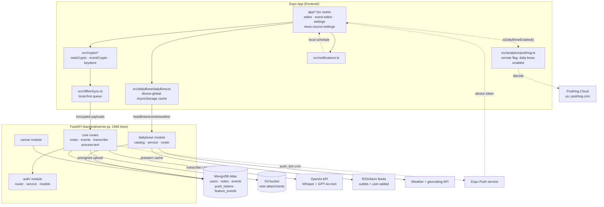

# MemoPad — Architecture Review

*Components, data flow, coupling issues, and a Mermaid diagram — generated by direct repo inspection on 2026-07-21.*

A local-first, end-to-end-encrypted notes and reminders app: Expo/React Native client, FastAPI backend, MongoDB Atlas, deployed on Railway.

## Component map

Solid arrows are request/response calls. Dashed arrows are async or best-effort paths — background jobs, client-side-only checks, and services the client can silently fail closed against.

## Backend modules

One large route file plus a handful of self-contained feature modules. The modules are the newer, better-separated pattern; `server.py` is the older one everything else still gets bolted onto.

| Module | Path | Role |
|---|---|---|
| **server.py** | `backend/server.py` (1,666 lines) | The original monolith: notes, events, attachments, auth glue, voice transcription, AI text processing, push cron, index creation, and router registration all live here. Every new module still gets wired in by hand at the bottom of this file. |
| **auth/** | `backend/auth/` — router, service, models, schemas, email_service, reset_password_page | Login, signup, password reset, and per-user preference fields (news country/outlets, daily-brew-show-verse). Cleanest-separated module — new preference endpoints mirror its shape exactly. |
| **dailybrew/** | `backend/dailybrew/` — catalog, service, router, schemas | Curated outlet catalog, weighted search, RSS caching + 10-min prewarm loop, custom-feed resolution. Self-contained; only touches `db.users` for saved preferences and custom feeds. |
| **canva/** | `backend/canva/` — router, service, schemas | OAuth-token integration, kept separate from the shared-API-key pattern used elsewhere (dailybrew, OpenAI) since it's per-user credentials, Fernet-encrypted at rest. |

## Data flow: a note's round trip

The path that matters most: the server is deliberately never able to read note content.

1. **Write locally, encrypt on-device** — Editor writes to local state; `src/crypto/noteCrypto.ts` encrypts title and body with a key derived and held only on-device.
2. **Queue for sync** — `src/offlineSync.ts` treats the encrypted payload as the source of truth locally first — the app works fully offline before any network call happens.
3. **Sync to Mongo** — Ciphertext lands in `db.notes` via FastAPI. The server stores and indexes it (by `user_id`, `updated_at`, pinned state) without ever decrypting it.
4. **Attachments bypass the API** — Images get a presigned S3 URL from `server.py` and upload directly to the bucket — the app server never proxies file bytes.
5. **Reminder fires as a title-less push** — Because the server can't decrypt the title, `push_tick` can only send `{eventId}` — the real title is filled in locally, from the locally-held plaintext, at notification build time.

## Coupling & separation-of-concerns findings

Traced this session while debugging a Daily Brew visibility report. Ranked by how much they cost in support time, not by code size.

### 1. Feature visibility depends on reaching a third-party domain from the client — *confirmed cause*
Daily Brew is gated by a PostHog remote flag checked directly from the device (`src/analytics/posthog.ts`), and fails **closed** if that call can't complete — no fallback to a source the app already trusts. Any ad-blocker, private DNS, or VPN blocking `us.i.posthog.com` hides the whole feature indefinitely, indistinguishable from the flag being off.
`posthog.ts:117–146` · `settings.tsx:41` · `(tabs)/_layout.tsx:64–68`

### 2. Device-local state isn't scoped to the logged-in account
Daily Brew's dismissed-for-today, pinned, onboarding-seen, and flag-cache keys are all plain AsyncStorage keys with no user id in them. Two accounts sharing one device inherit each other's dismiss/pin state until the keys roll over at midnight.
`dailyBrew.ts:16,35–40` · `posthog.ts:114`

### 3. Deploy target is a second, nested git repo
Railway watches `memopad-backend`, a separate repo nested inside this monorepo's `backend/` folder — not the repo this session works in. A commit here does nothing in production until it's mirrored across by hand, which has already caused at least one silent-404 incident.

### 4. In-memory caches assume exactly one server replica
The dailybrew outlet cache (and the same pattern planned for reminder-voice synthesis) is a process-local dict guarded by `asyncio.Lock`. Correct today on a single Railway instance; scaling to two replicas would silently duplicate every cache miss and API cost per replica.
`dailybrew/service.py` — outlet cache + prewarm loop

### 5. New features keep landing in server.py instead of their own module
`auth/`, `dailybrew/`, and `canva/` show the pattern the codebase wants — but transcription, AI text processing, and attachment handling are all still inline in the 1,666-line core file, so route registration and index setup have to be re-read in full for any change near them.
`server.py:1148–1330` (transcribe, process-text)

## Backend dependencies worth a second look

`requirements.txt` has a few packages with no corresponding import anywhere in `backend/` — likely leftovers from an earlier template or experiment.

| Package | Status | Actual role |
|---|---|---|
| `boto3` / `s3transfer` | wired in | Presigned S3 uploads & deletes for note attachments (`server.py`) |
| `openai` | wired in | Whisper transcription + GPT-4o-mini text processing |
| `cryptography` | wired in | Fernet encryption for stored Canva OAuth tokens |
| `stripe` | no import found | No billing code exists yet; safe to drop or a placeholder for future usage billing |
| `google-generativeai` / `google-genai` | no import found | Not called from any current route |
| `litellm` | no import found | OpenAI is called directly instead |
