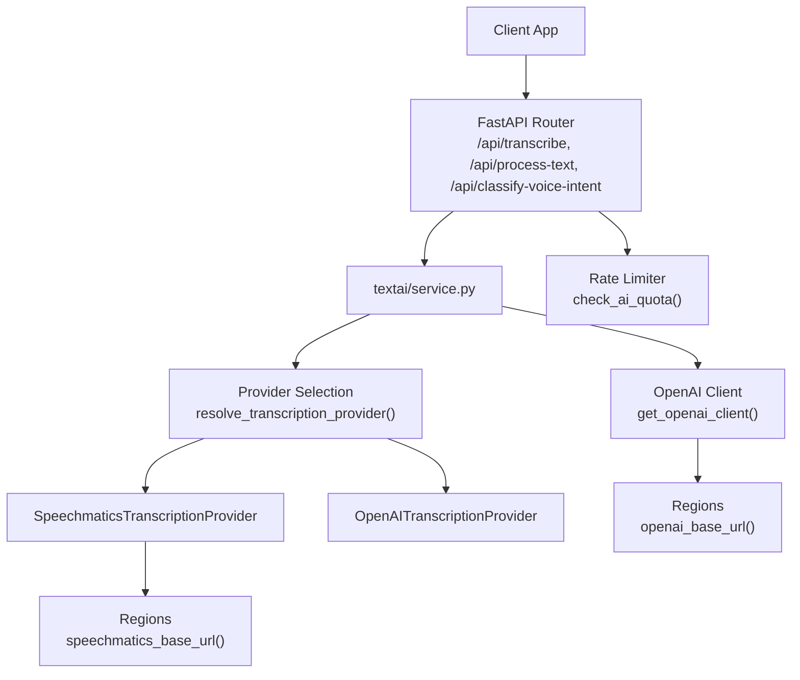
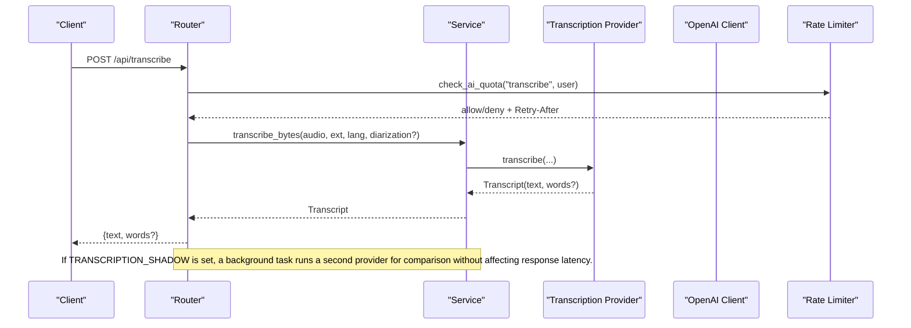
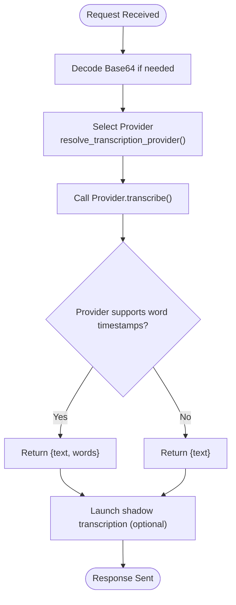
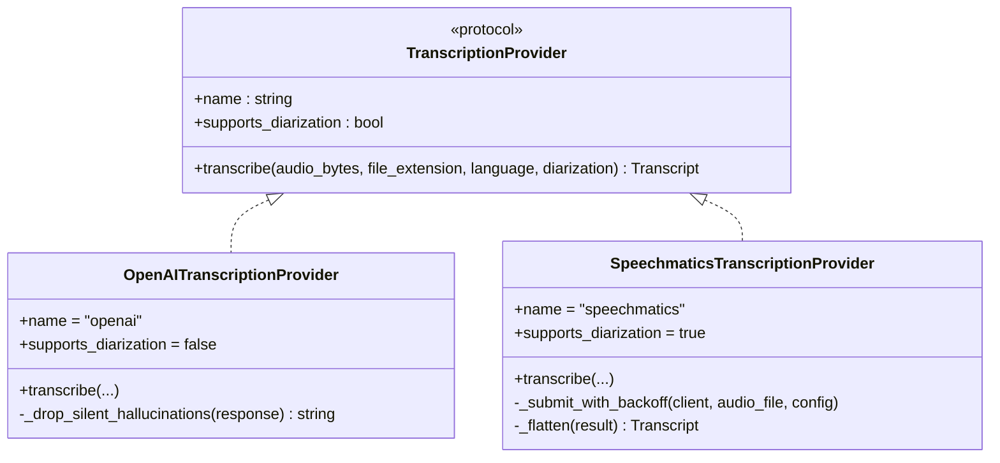
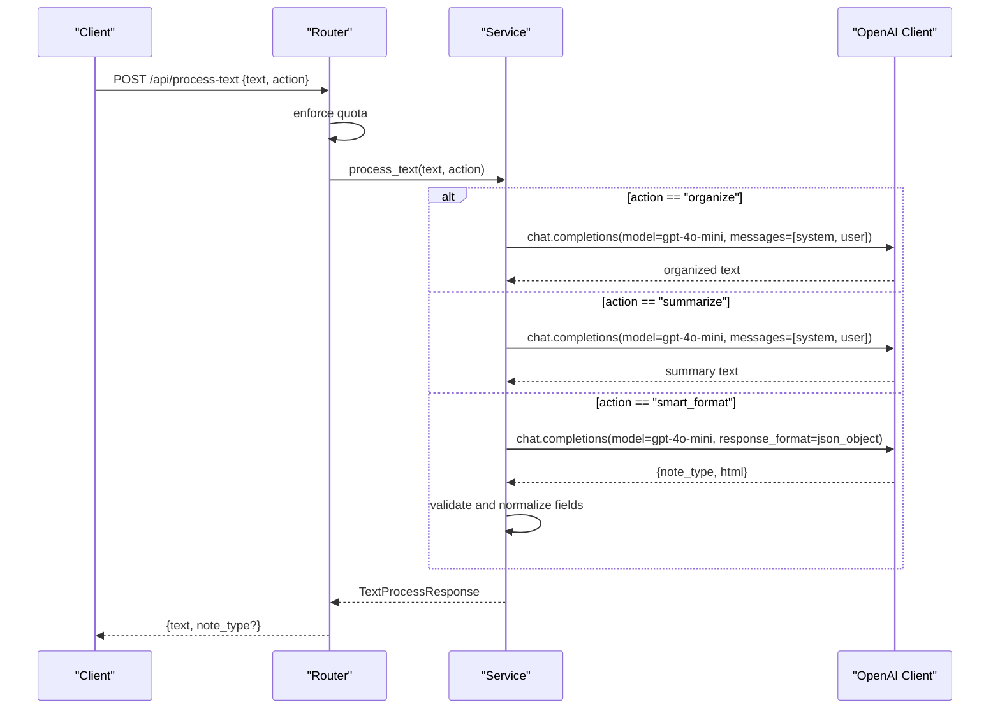
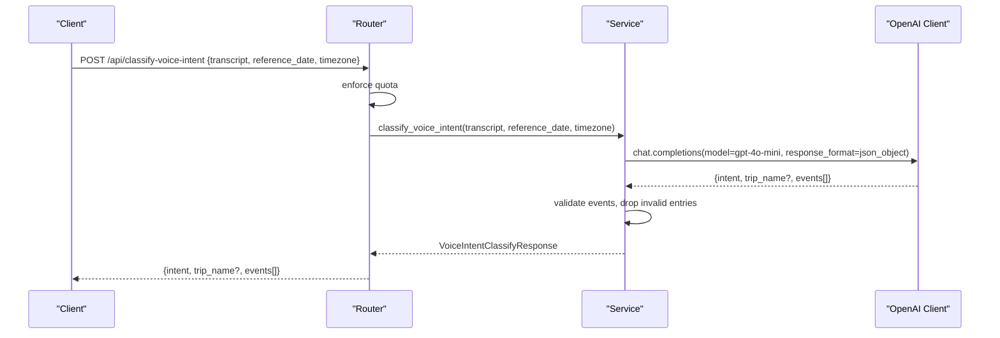
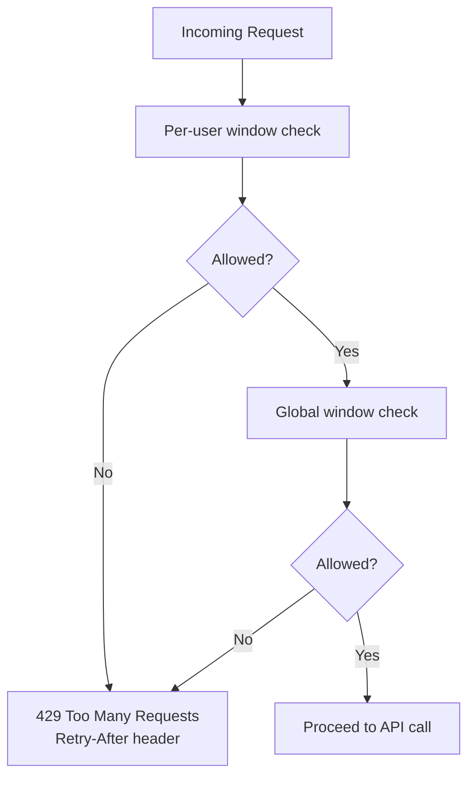
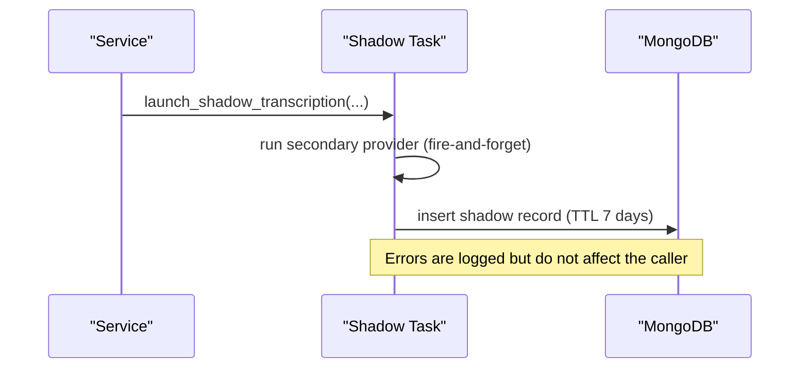
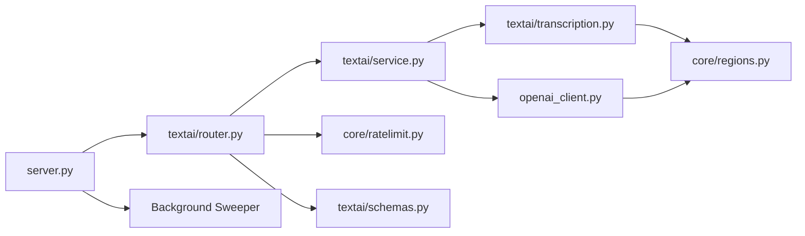

# AI Services

<cite>
**Referenced Files in This Document**
- [server.py](file://server.py)
- [textai/router.py](file://textai/router.py)
- [textai/service.py](file://textai/service.py)
- [textai/transcription.py](file://textai/transcription.py)
- [textai/schemas.py](file://textai/schemas.py)
- [openai_client.py](file://openai_client.py)
- [core/ratelimit.py](file://core/ratelimit.py)
- [core/regions.py](file://core/regions.py)
</cite>

## Table of Contents
1. [Introduction](#introduction)
2. [Project Structure](#project-structure)
3. [Core Components](#core-components)
4. [Architecture Overview](#architecture-overview)
5. [Detailed Component Analysis](#detailed-component-analysis)
6. [Dependency Analysis](#dependency-analysis)
7. [Performance Considerations](#performance-considerations)
8. [Troubleshooting Guide](#troubleshooting-guide)
9. [Conclusion](#conclusion)

## Introduction
This document explains the AI Services sub-feature that powers audio transcription and text processing. It covers:
- Audio transcription via Speechmatics (with a fallback to OpenAI Whisper)
- Text processing with OpenAI for organizing, summarizing, and smart formatting
- Voice intent detection to classify dictation versus scheduling requests and extract structured events
- Quota management and rate limiting to protect shared API quotas
- Error handling and resilience patterns for external API failures
- Operational concerns such as job cleanup, shadow-mode evaluation, and cost control

The service is exposed through FastAPI endpoints under /api and integrates with region-gated providers to ensure data residency compliance.

## Project Structure
The AI Services feature is implemented under the textai module and supported by core infrastructure modules:
- Router exposes HTTP endpoints for transcription, text processing, and voice intent classification
- Service implements business logic and orchestrates provider calls
- Transcription abstraction supports multiple providers (Speechmatics and OpenAI)
- Schemas define request/response models and validation rules
- OpenAI client provides a region-pinned client instance
- Rate limiter enforces per-user and global quotas
- Regions validates and returns provider base URLs

**Diagram sources**
- [textai/router.py:75-162](file://textai/router.py#L75-L162)
- [textai/service.py:112-130](file://textai/service.py#L112-L130)
- [textai/transcription.py:288-320](file://textai/transcription.py#L288-L320)
- [openai_client.py:15-23](file://openai_client.py#L15-L23)
- [core/ratelimit.py:115-123](file://core/ratelimit.py#L115-L123)
- [core/regions.py:186-191](file://core/regions.py#L186-L191)

**Section sources**
- [server.py:207-208](file://server.py#L207-L208)
- [textai/router.py:51-162](file://textai/router.py#L51-L162)
- [core/ratelimit.py:1-124](file://core/ratelimit.py#L1-124)
- [core/regions.py:1-230](file://core/regions.py#L1-L230)

## Core Components
- Transcription endpoints:
  - POST /api/transcribe: upload an audio file
  - POST /api/transcribe-base64: submit base64-encoded audio
- Text processing endpoint:
  - POST /api/process-text: organize, summarize, or smart-format text
- Voice intent classification endpoint:
  - POST /api/classify-voice-intent: classify transcript into note vs. event(s) vs. itinerary and extract events

Key responsibilities:
- Enforce quotas before calling external APIs
- Normalize inputs and handle errors consistently
- Return structured responses suitable for client UIs
- Provide word-level timestamps when available for tap-to-seek playback

**Section sources**
- [textai/router.py:75-162](file://textai/router.py#L75-L162)
- [textai/schemas.py:6-143](file://textai/schemas.py#L6-L143)

## Architecture Overview
The system uses a provider abstraction for transcription and a unified OpenAI client for text tasks. Region checks ensure all outbound calls go to approved Australian endpoints. A sliding-window rate limiter protects both per-user and global quotas.

**Diagram sources**
- [textai/router.py:106-130](file://textai/router.py#L106-L130)
- [textai/service.py:112-130](file://textai/service.py#L112-L130)
- [textai/transcription.py:387-449](file://textai/transcription.py#L387-L449)
- [core/ratelimit.py:115-123](file://core/ratelimit.py#L115-L123)

## Detailed Component Analysis

### Audio Transcription Workflow
- Endpoints accept either an uploaded file or base64-encoded audio
- The router decodes base64 when needed and delegates to the service layer
- The service selects a provider based on configuration and optional diarization support
- Providers return a normalized Transcript containing text and optional word-level timestamps
- A fire-and-forget shadow run can be launched to compare a secondary provider’s output without impacting the response

**Diagram sources**
- [textai/router.py:75-130](file://textai/router.py#L75-L130)
- [textai/service.py:112-130](file://textai/service.py#L112-L130)
- [textai/transcription.py:310-320](file://textai/transcription.py#L310-L320)
- [textai/transcription.py:387-449](file://textai/transcription.py#L387-L449)

**Section sources**
- [textai/router.py:75-130](file://textai/router.py#L75-L130)
- [textai/service.py:112-130](file://textai/service.py#L112-L130)
- [textai/transcription.py:78-133](file://textai/transcription.py#L78-L133)
- [textai/transcription.py:171-285](file://textai/transcription.py#L171-L285)

### Transcription Providers
- OpenAI Whisper provider:
  - Uses whisper-1 with verbose JSON to filter silent hallucinations
  - Returns plain text; no word-level timestamps
- Speechmatics provider:
  - Supports diarization when requested
  - Returns word-level timestamps enabling tap-to-seek
  - Implements retry/backoff for rate limits and ensures job deletion after completion
  - Includes a reconciliation sweeper to delete stale jobs left behind

**Diagram sources**
- [textai/transcription.py:53-64](file://textai/transcription.py#L53-L64)
- [textai/transcription.py:78-133](file://textai/transcription.py#L78-L133)
- [textai/transcription.py:171-285](file://textai/transcription.py#L171-L285)

**Section sources**
- [textai/transcription.py:78-133](file://textai/transcription.py#L78-L133)
- [textai/transcription.py:171-285](file://textai/transcription.py#L171-L285)
- [textai/transcription.py:323-360](file://textai/transcription.py#L323-L360)

### Text Processing with OpenAI
Actions:
- organize: restructure text into readable paragraphs/bullets while preserving meaning
- summarize: concise summary retaining key points
- smart_format: classify note type and return clean HTML in a JSON object

Implementation highlights:
- Uses gpt-4o-mini with low temperature for stable outputs
- Smart format enforces JSON mode and validates parsed results
- Empty or malformed responses raise specific exceptions handled by the router

**Diagram sources**
- [textai/router.py:136-148](file://textai/router.py#L136-L148)
- [textai/service.py:133-232](file://textai/service.py#L133-L232)
- [openai_client.py:15-23](file://openai_client.py#L15-L23)

**Section sources**
- [textai/service.py:133-232](file://textai/service.py#L133-L232)
- [textai/schemas.py:20-42](file://textai/schemas.py#L20-L42)

### Voice Intent Detection
Purpose:
- Classify whether a voice memo is plain dictation or a scheduling request
- Extract structured events for single/multiple events or itineraries
- Provide trip names for multi-event itineraries

Behavior:
- Uses JSON-mode LLM call to produce a strict schema
- Validates events using Pydantic; drops unusable entries rather than failing the whole request
- Falls back to “note” intent when the model returns unrecognizable values

**Diagram sources**
- [textai/router.py:151-162](file://textai/router.py#L151-L162)
- [textai/service.py:259-314](file://textai/service.py#L259-L314)
- [textai/schemas.py:44-143](file://textai/schemas.py#L44-L143)

**Section sources**
- [textai/service.py:259-314](file://textai/service.py#L259-L314)
- [textai/schemas.py:44-143](file://textai/schemas.py#L44-L143)

### Quota Management and Rate Limiting
- Per-endpoint quotas protect shared API keys and prevent runaway clients from exhausting resources
- Global quota acts as a backstop across all users
- On quota exceeded, the router returns 429 with a Retry-After header so clients can back off

Quotas:
- Transcription: limited per user per minute
- Voice intent: higher limit than transcription to avoid blocking automatic post-transcription classification
- Text processing: limited per user per minute
- Global: generous cap to blunt stampedes

**Diagram sources**
- [core/ratelimit.py:41-88](file://core/ratelimit.py#L41-L88)
- [core/ratelimit.py:98-123](file://core/ratelimit.py#L98-L123)
- [textai/router.py:28-49](file://textai/router.py#L28-L49)

**Section sources**
- [core/ratelimit.py:1-124](file://core/ratelimit.py#L1-L124)
- [textai/router.py:28-49](file://textai/router.py#L28-L49)

### Data Residency and Provider Configuration
- All external endpoints are validated at startup to ensure they point to approved Australian regions
- OpenAI and Speechmatics base URLs are resolved via a central regions module
- Misconfiguration aborts the server boot to fail closed

**Section sources**
- [core/regions.py:1-230](file://core/regions.py#L1-L230)
- [openai_client.py:15-23](file://openai_client.py#L15-L23)
- [textai/transcription.py:207-209](file://textai/transcription.py#L207-L209)

### Job Queuing and Background Tasks
- No persistent job queue is used; transcription is synchronous per request
- Shadow transcription runs asynchronously in the background for provider comparison without blocking the response
- A periodic sweeper deletes stale Speechmatics jobs to minimize provider-side retention

**Diagram sources**
- [textai/transcription.py:387-449](file://textai/transcription.py#L387-L449)
- [server.py:453-459](file://server.py#L453-L459)

**Section sources**
- [textai/transcription.py:387-449](file://textai/transcription.py#L387-L449)
- [server.py:453-459](file://server.py#L453-L459)

## Dependency Analysis
- Router depends on:
  - Service for business logic
  - Rate limiter for quota enforcement
  - Schemas for input/output validation
- Service depends on:
  - Transcription provider abstraction
  - OpenAI client for text tasks
- Transcription providers depend on:
  - Regions for provider base URLs
  - Optional Speechmatics SDK
- Server wires routers and starts background tasks

**Diagram sources**
- [textai/router.py:1-24](file://textai/router.py#L1-L24)
- [textai/service.py:1-23](file://textai/service.py#L1-L23)
- [textai/transcription.py:1-23](file://textai/transcription.py#L1-L23)
- [openai_client.py:1-23](file://openai_client.py#L1-L23)
- [core/ratelimit.py:1-23](file://core/ratelimit.py#L1-L23)
- [core/regions.py:1-23](file://core/regions.py#L1-L23)
- [server.py:207-208](file://server.py#L207-L208)
- [server.py:453-459](file://server.py#L453-L459)

**Section sources**
- [textai/router.py:1-24](file://textai/router.py#L1-L24)
- [textai/service.py:1-23](file://textai/service.py#L1-L23)
- [textai/transcription.py:1-23](file://textai/transcription.py#L1-L23)
- [openai_client.py:1-23](file://openai_client.py#L1-L23)
- [core/ratelimit.py:1-23](file://core/ratelimit.py#L1-L23)
- [core/regions.py:1-23](file://core/regions.py#L1-L23)
- [server.py:207-208](file://server.py#L207-L208)
- [server.py:453-459](file://server.py#L453-L459)

## Performance Considerations
- Use Speechmatics when word-level timestamps are required (e.g., tap-to-seek playback)
- Prefer Whisper for simpler cases where only text is needed
- Enable diarization only when conversation capture is needed; it adds latency and requires Speechmatics
- Keep language hints explicit to reduce auto-detection overhead
- Leverage shadow mode to evaluate provider changes without impacting live traffic
- Monitor quota usage and adjust limits if necessary to balance responsiveness and cost

[No sources needed since this section provides general guidance]

## Troubleshooting Guide
Common issues and resolutions:
- API key missing:
  - Ensure OPENAI_API_KEY or EMERGENT_LLM_KEY is set for OpenAI features
  - Ensure SPEECHMATICS_API_KEY is set when using Speechmatics or diarization
- Region misconfiguration:
  - Validate OPENAI_BASE_URL/REGION and SPEECHMATICS_BASE_URL/REGION point to approved Australian endpoints
- Rate limiting:
  - Observe 429 responses with Retry-After; implement client-side backoff
- Transcription quality:
  - For Whisper, silence/hallucination filtering is applied automatically; consider providing a language hint
  - For Speechmatics, enable diarization only when needed and ensure audio clarity
- External API failures:
  - Speechmatics retries on transport errors and rate limits; failures are logged
  - OpenAI errors surface as 500 responses; log details and retry with exponential backoff on the client side
- Stale jobs:
  - The background sweeper deletes old Speechmatics jobs; verify it is running and logs show deletions

**Section sources**
- [openai_client.py:8-23](file://openai_client.py#L8-L23)
- [textai/transcription.py:148-163](file://textai/transcription.py#L148-L163)
- [textai/transcription.py:236-251](file://textai/transcription.py#L236-L251)
- [textai/transcription.py:323-360](file://textai/transcription.py#L323-L360)
- [core/ratelimit.py:98-123](file://core/ratelimit.py#L98-L123)
- [core/regions.py:144-165](file://core/regions.py#L144-L165)

## Conclusion
The AI Services feature provides robust audio transcription and text processing capabilities with strong safeguards for quotas, data residency, and operational hygiene. It supports provider selection, background evaluation via shadow mode, and resilient error handling. By following the recommended practices and monitoring quotas and provider health, teams can maintain high-quality transcription and efficient text operations while controlling costs.

[No sources needed since this section summarizes without analyzing specific files]