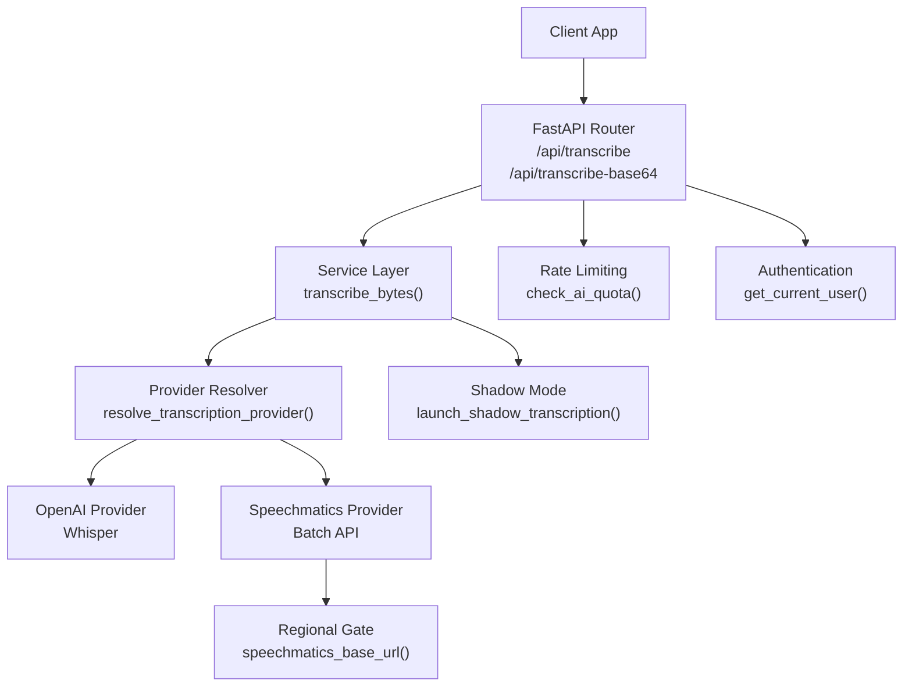
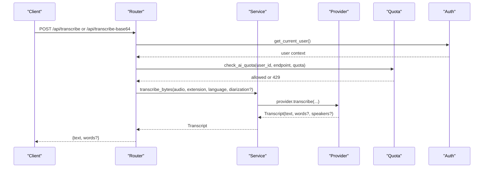
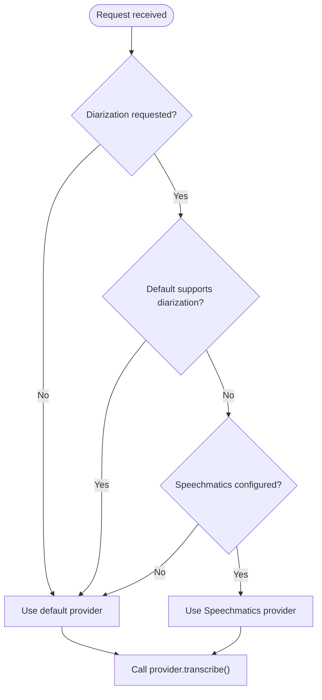
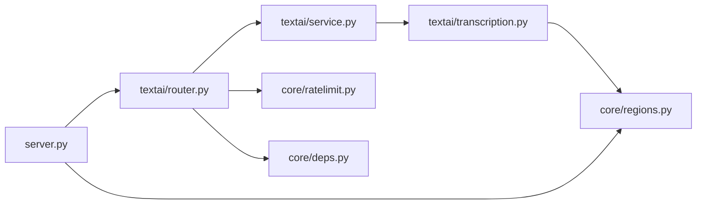

# Audio Transcription

<cite>
**Referenced Files in This Document**
- [transcription.py](file://textai/transcription.py)
- [router.py](file://textai/router.py)
- [service.py](file://textai/service.py)
- [schemas.py](file://textai/schemas.py)
- [ratelimit.py](file://core/ratelimit.py)
- [regions.py](file://core/regions.py)
- [deps.py](file://core/deps.py)
- [server.py](file://server.py)
</cite>

## Table of Contents
1. [Introduction](#introduction)
2. [Project Structure](#project-structure)
3. [Core Components](#core-components)
4. [Architecture Overview](#architecture-overview)
5. [Detailed Component Analysis](#detailed-component-analysis)
6. [Dependency Analysis](#dependency-analysis)
7. [Performance Considerations](#performance-considerations)
8. [Troubleshooting Guide](#troubleshooting-guide)
9. [Conclusion](#conclusion)

## Introduction
This document explains the audio transcription service end-to-end: how clients upload audio, how the backend processes it, and how text (with optional word-level timestamps and speaker labels) is returned. It covers both file upload and base64-encoded audio, provider selection between OpenAI Whisper and Speechmatics, language hints, diarization support, authentication, rate limits, error handling, and operational safeguards such as job cleanup and shadow-mode evaluation.

## Project Structure
The transcription feature lives under the textai module and integrates with shared core services for authentication, quotas, and regional configuration.

**Diagram sources**
- [router.py:75-130](file://textai/router.py#L75-L130)
- [service.py:112-130](file://textai/service.py#L112-L130)
- [transcription.py:294-320](file://textai/transcription.py#L294-L320)
- [ratelimit.py:115-123](file://core/ratelimit.py#L115-L123)
- [regions.py:190-191](file://core/regions.py#L190-L191)
- [deps.py:24-50](file://core/deps.py#L24-L50)

**Section sources**
- [router.py:1-163](file://textai/router.py#L1-L163)
- [service.py:1-315](file://textai/service.py#L1-L315)
- [transcription.py:1-450](file://textai/transcription.py#L1-L450)
- [ratelimit.py:1-124](file://core/ratelimit.py#L1-L124)
- [regions.py:1-230](file://core/regions.py#L1-L230)
- [deps.py:1-51](file://core/deps.py#L1-L51)
- [server.py:165-208](file://server.py#L165-L208)

## Core Components
- Endpoints:
  - POST /api/transcribe: accepts multipart audio file upload.
  - POST /api/transcribe-base64: accepts base64-encoded audio payload.
- Service layer:
  - Normalizes extensions, selects provider, calls provider.transcribe(), logs latency, and optionally runs a shadow transcription for evaluation.
- Providers:
  - OpenAI Whisper: returns plain text; no diarization; includes hallucination filtering for silence.
  - Speechmatics Batch API: returns text plus per-word timestamps and optional speaker labels when diarization is enabled; supports region-gated endpoints and automatic job deletion.
- Authentication:
  - Bearer token required via Authorization header.
- Rate limiting:
  - Per-user and global sliding-window limits enforced before external calls.
- Regional compliance:
  - External endpoints must be declared and validated to Australian regions at startup.

**Section sources**
- [router.py:75-130](file://textai/router.py#L75-L130)
- [service.py:102-130](file://textai/service.py#L102-L130)
- [transcription.py:78-132](file://textai/transcription.py#L78-L132)
- [transcription.py:171-285](file://textai/transcription.py#L171-L285)
- [ratelimit.py:98-123](file://core/ratelimit.py#L98-L123)
- [regions.py:144-191](file://core/regions.py#L144-L191)
- [deps.py:24-50](file://core/deps.py#L24-L50)

## Architecture Overview
The request flow enforces authentication and quotas first, then delegates to the service layer which resolves the active provider based on configuration and requested features (e.g., diarization). The provider performs transcription and returns a normalized result that may include word-level timestamps and speaker labels. A background reconciliation sweep cleans up any orphaned jobs from the batch provider.

**Diagram sources**
- [router.py:75-130](file://textai/router.py#L75-L130)
- [service.py:112-130](file://textai/service.py#L112-L130)
- [transcription.py:294-320](file://textai/transcription.py#L294-L320)
- [ratelimit.py:115-123](file://core/ratelimit.py#L115-L123)
- [deps.py:24-50](file://core/deps.py#L24-L50)

## Detailed Component Analysis

### Endpoints and Request/Response Schemas
- POST /api/transcribe
  - Method: POST
  - Path: /api/transcribe
  - Authentication: Bearer token required
  - Request:
    - File: audio file (multipart/form-data)
    - Optional form field: language (ISO-639-1 hint)
  - Response:
    - text: string
    - words: array of objects (only when provider supplies word-level timestamps)
      - word: string
      - start: number (seconds)
      - end: number (seconds)
      - speaker: string (optional, when diarization is supported)
      - confidence: number (optional, when available)
- POST /api/transcribe-base64
  - Method: POST
  - Path: /api/transcribe-base64
  - Authentication: Bearer token required
  - Request body (JSON):
    - audio_base64: string (base64-encoded audio bytes)
    - file_extension: string (default m4a)
    - language: string (optional ISO-639-1 hint)
    - diarization: string (optional; enables diarization when supported by provider)
  - Response: same as /api/transcribe

Notes:
- The base64 endpoint decodes the payload and passes bytes to the service layer. Invalid base64 yields a 400 error.
- The file upload endpoint reads the file content and infers the extension from the filename if missing.

**Section sources**
- [router.py:75-130](file://textai/router.py#L75-L130)
- [schemas.py:6-18](file://textai/schemas.py#L6-L18)

### Provider Selection and Diarization
- Provider resolution:
  - Default provider is OpenAI unless configured otherwise via environment variable.
  - If diarization is requested and the default provider does not support it, the system falls back to Speechmatics when its API key is configured.
- Diarization behavior:
  - When enabled, Speechmatics returns per-word speaker labels (generic identifiers like “S1”).
  - OpenAI provider ignores diarization requests and logs a warning.

**Diagram sources**
- [transcription.py:294-320](file://textai/transcription.py#L294-L320)

**Section sources**
- [transcription.py:78-132](file://textai/transcription.py#L78-L132)
- [transcription.py:171-285](file://textai/transcription.py#L171-L285)
- [transcription.py:294-320](file://textai/transcription.py#L294-L320)

### OpenAI Whisper Provider
- Capabilities:
  - Returns plain text transcript.
  - No diarization support; diarization parameter is ignored with a warning.
  - Filters out likely hallucinated segments from silence using segment quality metrics.
- Input:
  - Audio bytes and file extension.
  - Optional language hint.
- Output:
  - Transcript with text only; words list is omitted.

Operational notes:
- Uses a temporary file to pass audio to the client library.
- Ensures cleanup even on errors.

**Section sources**
- [transcription.py:78-132](file://textai/transcription.py#L78-L132)

### Speechmatics Batch Provider
- Capabilities:
  - High-quality transcription with word-level timestamps.
  - Optional diarization with speaker labels when enabled.
  - Region-gated endpoint via centralized configuration.
  - Automatic job deletion after completion to minimize retention.
- Input:
  - Audio bytes and file extension.
  - Optional language hint (defaults to English if none provided).
  - Optional diarization flag; when set, configures max speakers for better turn attribution.
- Output:
  - Transcript with text and words array including start/end times, optional speaker and confidence.

Reliability:
- Submit retries with exponential backoff and jitter on rate-limit responses.
- Job timeout and polling interval are bounded.
- Inline job deletion in finally block; failures logged critically.
- Background reconciliation sweep deletes stale jobs older than a threshold.

**Section sources**
- [transcription.py:135-145](file://textai/transcription.py#L135-L145)
- [transcription.py:171-285](file://textai/transcription.py#L171-L285)
- [transcription.py:323-360](file://textai/transcription.py#L323-L360)

### Service Layer: transcribe_bytes
Responsibilities:
- Normalize file extension (e.g., map .caf to .m4a).
- Resolve provider based on configuration and diarization request.
- Measure and log latency.
- Launch optional shadow transcription for evaluation without blocking the response.
- Return full Transcript object so callers can include word-level metadata when available.

**Section sources**
- [service.py:102-130](file://textai/service.py#L102-L130)

### Authentication and Quotas
- Authentication:
  - All transcription endpoints require a valid Bearer token.
  - Token verification and user lookup are handled centrally.
- Quotas:
  - Per-user transcription limit enforced before calling providers.
  - Global limit protects shared provider keys from stampedes.
  - On quota exceeded, returns HTTP 429 with Retry-After header.

**Section sources**
- [deps.py:24-50](file://core/deps.py#L24-L50)
- [ratelimit.py:98-123](file://core/ratelimit.py#L98-L123)
- [router.py:28-49](file://textai/router.py#L28-L49)

### Regional Compliance
- Startup validation ensures all external service endpoints and regions are declared and within the approved Australian region allowlist.
- Speechmatics base URL is resolved through the central regions module to enforce data residency.

**Section sources**
- [regions.py:144-191](file://core/regions.py#L144-L191)
- [server.py:338-341](file://server.py#L338-L341)

## Dependency Analysis

**Diagram sources**
- [router.py:1-163](file://textai/router.py#L1-L163)
- [service.py:1-315](file://textai/service.py#L1-L315)
- [transcription.py:1-450](file://textai/transcription.py#L1-L450)
- [ratelimit.py:1-124](file://core/ratelimit.py#L1-L124)
- [regions.py:1-230](file://core/regions.py#L1-L230)
- [deps.py:1-51](file://core/deps.py#L1-L51)
- [server.py:165-208](file://server.py#L165-L208)

**Section sources**
- [router.py:1-163](file://textai/router.py#L1-L163)
- [service.py:1-315](file://textai/service.py#L1-L315)
- [transcription.py:1-450](file://textai/transcription.py#L1-L450)
- [ratelimit.py:1-124](file://core/ratelimit.py#L1-L124)
- [regions.py:1-230](file://core/regions.py#L1-L230)
- [deps.py:1-51](file://core/deps.py#L1-L51)
- [server.py:165-208](file://server.py#L165-L208)

## Performance Considerations
- Large audio files:
  - Prefer streaming-friendly formats supported by providers; ensure reasonable file sizes to avoid timeouts.
  - Base64 encoding increases payload size; prefer direct file uploads when possible.
- Provider-specific behavior:
  - OpenAI Whisper: filters silent hallucinations; no diarization.
  - Speechmatics: supports diarization and word-level timestamps; uses job lifecycle management with timeouts and retries.
- Quota management:
  - Per-user transcription limit: 10 requests per minute.
  - Voice intent classification limit: 20 requests per minute (automatically invoked after transcription).
  - Text processing limit: 15 requests per minute.
  - Global AI quota: 120 requests per minute across all users.
- Operational safeguards:
  - Background sweep deletes stale Speechmatics jobs older than a short threshold to prevent long-term retention.
  - Shadow mode allows parallel evaluation of alternative providers without impacting user requests.

**Section sources**
- [ratelimit.py:98-123](file://core/ratelimit.py#L98-L123)
- [transcription.py:135-145](file://textai/transcription.py#L135-L145)
- [transcription.py:323-360](file://textai/transcription.py#L323-L360)

## Troubleshooting Guide
Common issues and resolutions:
- Invalid base64 audio data:
  - Symptom: 400 Bad Request on /api/transcribe-base64.
  - Cause: Malformed base64 string.
  - Resolution: Ensure correct base64 encoding of audio bytes.
- Authentication failures:
  - Symptom: 401 Unauthorized.
  - Cause: Missing, invalid, or expired Bearer token.
  - Resolution: Provide a valid token in the Authorization header.
- Quota exceeded:
  - Symptom: 429 Too Many Requests with Retry-After header.
  - Cause: Exceeded per-user or global transcription/text-processing limits.
  - Resolution: Back off according to Retry-After; reduce request frequency.
- Network/provider errors:
  - Symptom: 500 Internal Server Error with transcription failure detail.
  - Cause: Provider transport errors, timeouts, or unexpected responses.
  - Resolution: Retry with backoff; check provider status and configuration.
- Unsupported diarization:
  - Symptom: Diarization ignored with provider-specific behavior.
  - Cause: Using OpenAI provider which does not support diarization.
  - Resolution: Enable Speechmatics provider and configure its API key to use diarization.
- Stale jobs retention:
  - Symptom: Orphaned jobs remain longer than expected.
  - Cause: Inline job deletion failed.
  - Resolution: Rely on background reconciliation sweep; monitor logs for critical delete failures.

**Section sources**
- [router.py:75-130](file://textai/router.py#L75-L130)
- [deps.py:24-50](file://core/deps.py#L24-L50)
- [ratelimit.py:28-49](file://core/ratelimit.py#L28-L49)
- [transcription.py:222-233](file://textai/transcription.py#L222-L233)
- [transcription.py:323-360](file://textai/transcription.py#L323-L360)

## Conclusion
The transcription service provides a robust, configurable pipeline for converting audio to text with optional word-level timestamps and speaker identification. It supports both file upload and base64 payloads, enforces authentication and quotas, and integrates with regionalized providers for compliance. Operational safeguards like job cleanup and shadow-mode evaluation help maintain reliability and enable safe provider transitions. For best results, use appropriate audio formats, respect rate limits, and leverage diarization when speaker separation is needed.