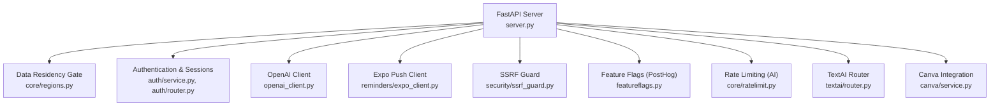
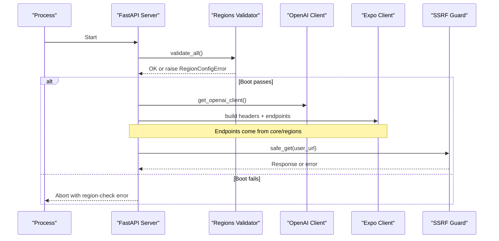
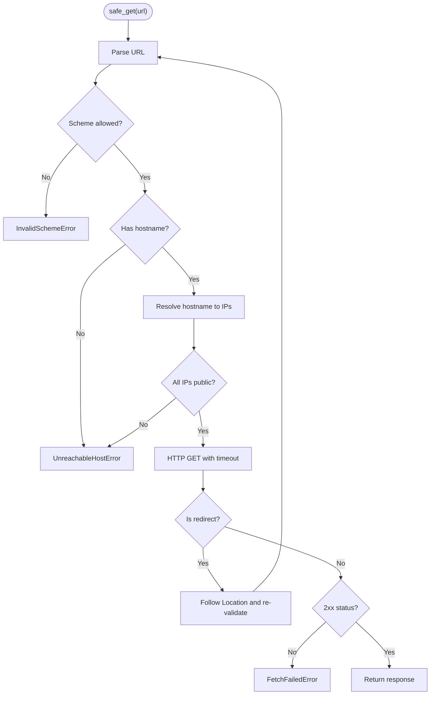
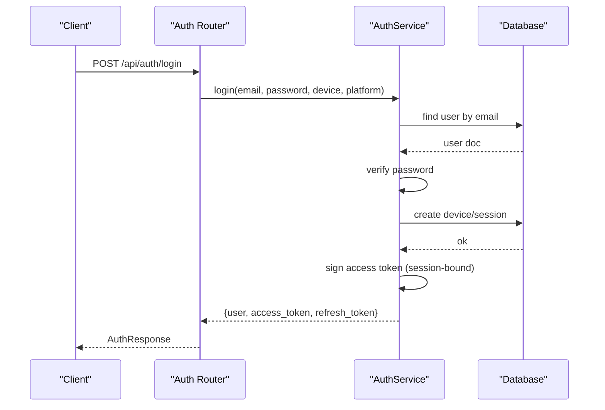
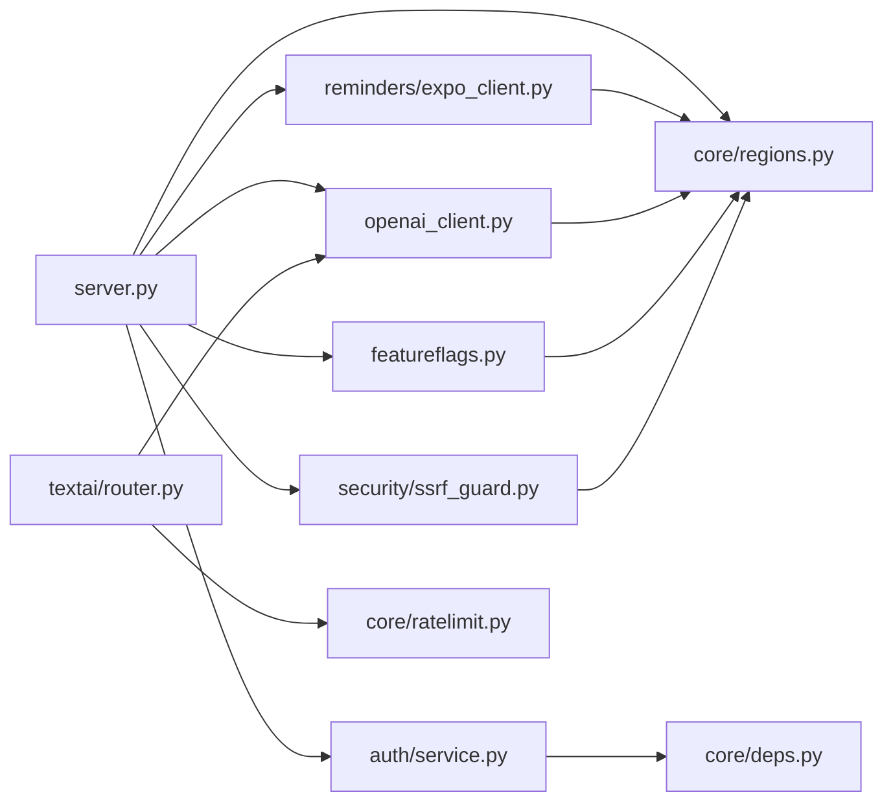

# Configuration & Security

<cite>
**Referenced Files in This Document**
- [server.py](file://server.py)
- [core/regions.py](file://core/regions.py)
- [openai_client.py](file://openai_client.py)
- [security/ssrf_guard.py](file://security/ssrf_guard.py)
- [reminders/expo_client.py](file://reminders/expo_client.py)
- [featureflags.py](file://featureflags.py)
- [auth/service.py](file://auth/service.py)
- [auth/router.py](file://auth/router.py)
- [core/deps.py](file://core/deps.py)
- [core/ratelimit.py](file://core/ratelimit.py)
- [textai/router.py](file://textai/router.py)
- [canva/service.py](file://canva/service.py)
</cite>

## Table of Contents
1. [Introduction](#introduction)
2. [Project Structure](#project-structure)
3. [Core Components](#core-components)
4. [Architecture Overview](#architecture-overview)
5. [Detailed Component Analysis](#detailed-component-analysis)
6. [Dependency Analysis](#dependency-analysis)
7. [Performance Considerations](#performance-considerations)
8. [Troubleshooting Guide](#troubleshooting-guide)
9. [Conclusion](#conclusion)
10. [Appendices](#appendices)

## Introduction
This document explains how the backend configures and secures external API integrations, focusing on environment-driven configuration, data residency enforcement, request sanitization, input validation, secret management, and monitoring/auditing patterns. It provides practical guidance for configuring development, staging, and production environments with appropriate credentials and endpoints while maintaining strong security posture.

## Project Structure
The application is a FastAPI service that:
- Loads environment variables at startup
- Enforces data residency by validating all external endpoints and regions before serving traffic
- Centralizes external service configuration to prevent hardcoded URLs or regions
- Protects outbound requests from SSRF and enforces safe schemes and public IPs
- Secures authentication and rate-limits sensitive endpoints
- Uses typed accessors to fetch validated endpoints for each provider

**Diagram sources**
- [server.py:13-20](file://server.py#L13-L20)
- [core/regions.py:144-165](file://core/regions.py#L144-L165)
- [auth/service.py:24-33](file://auth/service.py#L24-L33)
- [openai_client.py:15-23](file://openai_client.py#L15-L23)
- [reminders/expo_client.py:18-49](file://reminders/expo_client.py#L18-L49)
- [security/ssrf_guard.py:50-108](file://security/ssrf_guard.py#L50-L108)
- [featureflags.py:25-52](file://featureflags.py#L25-L52)
- [core/ratelimit.py:1-17](file://core/ratelimit.py#L1-L17)
- [textai/router.py:28-49](file://textai/router.py#L28-L49)
- [canva/service.py:40-63](file://canva/service.py#L40-L63)

**Section sources**
- [server.py:13-20](file://server.py#L13-L20)
- [core/regions.py:1-19](file://core/regions.py#L1-L19)

## Core Components
- Environment-driven configuration: All external endpoints and regions are declared via environment variables and validated at boot.
- Data residency enforcement: A centralized registry ensures every outbound service has an endpoint and an Australian region; boot fails if any are missing or invalid.
- Secure client adapters: OpenAI and Expo clients obtain endpoints through typed accessors, never hardcoding URLs.
- SSRF protection: User-supplied URLs are validated for scheme, hostname, and resolved IP ranges before any network call.
- Authentication and session binding: Access tokens are bound to sessions; refresh tokens are hashed and stored securely.
- Rate limiting: Global and per-user quotas protect paid AI endpoints.
- Feature flags: Server-side resolution of feature flags via PostHog with retries and caching.

**Section sources**
- [core/regions.py:55-77](file://core/regions.py#L55-L77)
- [server.py:333-341](file://server.py#L333-L341)
- [openai_client.py:15-23](file://openai_client.py#L15-L23)
- [security/ssrf_guard.py:67-108](file://security/ssrf_guard.py#L67-L108)
- [auth/service.py:63-83](file://auth/service.py#L63-L83)
- [core/ratelimit.py:1-17](file://core/ratelimit.py#L1-L17)
- [featureflags.py:25-52](file://featureflags.py#L25-L52)

## Architecture Overview
The server boots, loads environment variables, and validates all external-service declarations. Only after passing the data residency gate does it serve requests. Each integration uses a dedicated client or adapter that reads endpoints from the central regions module.

**Diagram sources**
- [server.py:333-341](file://server.py#L333-L341)
- [core/regions.py:144-165](file://core/regions.py#L144-L165)
- [openai_client.py:15-23](file://openai_client.py#L15-L23)
- [reminders/expo_client.py:18-49](file://reminders/expo_client.py#L18-L49)
- [security/ssrf_guard.py:67-108](file://security/ssrf_guard.py#L67-L108)

## Detailed Component Analysis

### Environment Variables and Secret Management
- Database and app bootstrap:
  - MongoDB URL and database name are read from environment variables at startup.
  - CORS origins can be configured via an environment variable; defaults to allow all when not set.
- External services:
  - Every outbound service declares its base URL(s) and region via environment variables. The central registry enforces presence, format, and region allowlist.
- Authentication secrets:
  - JWT signing secret is required at runtime; token lifetimes and lockout policies are defined in the auth service.
- Provider-specific secrets:
  - OpenAI key is read from environment variables; fallback keys supported.
  - Expo push token is optional but recommended for secure send operations.
  - Canva OAuth credentials and encryption key are required for authorization flows and token storage.
  - PostHog project API key is used for server-side feature flag resolution.

Operational notes:
- Secrets must be provided per environment (development, staging, production).
- Do not hardcode secrets or endpoints in source code; rely on environment variables and the regions registry.
- Use distinct values per environment and rotate regularly.

**Section sources**
- [server.py:13-18](file://server.py#L13-L18)
- [server.py:320-330](file://server.py#L320-L330)
- [core/regions.py:55-77](file://core/regions.py#L55-L77)
- [auth/service.py:24-33](file://auth/service.py#L24-L33)
- [openai_client.py:15-23](file://openai_client.py#L15-L23)
- [reminders/expo_client.py:18-24](file://reminders/expo_client.py#L18-L24)
- [canva/service.py:40-63](file://canva/service.py#L40-L63)
- [featureflags.py:11-14](file://featureflags.py#L11-L14)

### Data Residency and Endpoint Validation
- Centralized registry enumerates all external services, their endpoint environment variables, and region variables.
- On startup, the server calls a validator that checks:
  - Presence of all endpoint and region variables
  - Correct URL schemes (e.g., https for most services, mongodb/mongodb+srv for database)
  - Region values within an approved list
- If validation fails, the process aborts before serving traffic, ensuring no unvalidated endpoints are used.

Best practices:
- Maintain the registry whenever adding or removing integrations.
- Keep region values aligned with compliance requirements.
- Avoid bypassing the typed accessors; always use them to fetch endpoints.

**Section sources**
- [core/regions.py:1-19](file://core/regions.py#L1-L19)
- [core/regions.py:55-77](file://core/regions.py#L55-L77)
- [core/regions.py:104-141](file://core/regions.py#L104-L141)
- [core/regions.py:144-165](file://core/regions.py#L144-L165)
- [server.py:333-341](file://server.py#L333-L341)

### Secure Outbound Requests and SSRF Protection
- For user-influenced URLs, the SSRF guard:
  - Restricts schemes to http/https
  - Ensures hostnames resolve to public IPs (rejects private, loopback, link-local, reserved, multicast, unspecified)
  - Re-validates on every redirect hop to prevent redirection into internal networks
  - Enforces timeouts and limits redirects
- Use this guard for any feature fetching content based on user input.

**Diagram sources**
- [security/ssrf_guard.py:67-108](file://security/ssrf_guard.py#L67-L108)

**Section sources**
- [security/ssrf_guard.py:1-21](file://security/ssrf_guard.py#L1-L21)
- [security/ssrf_guard.py:50-108](file://security/ssrf_guard.py#L50-L108)

### Authentication, Authorization, and Session Binding
- Access tokens are signed with a secret and include expiration and type claims.
- Tokens are bound to login sessions; logout or session expiry revokes tokens even if signatures remain valid.
- Refresh tokens are generated securely and stored as hashes.
- Login/signup/reset endpoints implement rate limiting to mitigate brute-force and abuse.

**Diagram sources**
- [auth/router.py:115-139](file://auth/router.py#L115-L139)
- [auth/service.py:202-273](file://auth/service.py#L202-L273)
- [auth/service.py:63-83](file://auth/service.py#L63-L83)

**Section sources**
- [auth/service.py:24-33](file://auth/service.py#L24-L33)
- [auth/service.py:63-83](file://auth/service.py#L63-L83)
- [auth/service.py:202-273](file://auth/service.py#L202-L273)
- [auth/router.py:22-53](file://auth/router.py#L22-L53)
- [auth/router.py:115-139](file://auth/router.py#L115-L139)

### Request Sanitization and Input Validation
- Pydantic models enforce schema validation for incoming requests across routers.
- Size caps and field validations are applied where applicable (e.g., wrapped key blobs, event metadata).
- Rate limiting protects sensitive endpoints and paid AI features.
- SSRF guard prevents unsafe outbound requests from user-provided URLs.

Examples:
- Wrapped key storage validates blob sizes before persisting.
- Feature events cap metadata size to discourage sensitive payloads.
- AI endpoints enforce quotas and return 429 with Retry-After when exceeded.

**Section sources**
- [server.py:75-93](file://server.py#L75-L93)
- [server.py:107-123](file://server.py#L107-L123)
- [textai/router.py:28-49](file://textai/router.py#L28-L49)
- [core/ratelimit.py:1-17](file://core/ratelimit.py#L1-L17)
- [security/ssrf_guard.py:67-108](file://security/ssrf_guard.py#L67-L108)

### External Integrations: OpenAI, Expo, Canva, PostHog
- OpenAI:
  - Client constructed with API key from environment and base URL from regions module.
  - Base URL is enforced to avoid default SDK endpoints that bypass residency checks.
- Expo Push:
  - Optional access token added to headers for secure delivery.
  - Endpoints obtained via regions module; failures logged and handled gracefully.
- Canva:
  - Requires client ID/secret and encryption key for OAuth flows and token storage.
  - Authorization header built from credentials; pending states cleaned up periodically.
- PostHog:
  - Server-side feature flag resolution with retry and background refresh.
  - Fail-closed behavior hides features until flags are successfully fetched.

**Section sources**
- [openai_client.py:15-23](file://openai_client.py#L15-L23)
- [reminders/expo_client.py:18-49](file://reminders/expo_client.py#L18-L49)
- [canva/service.py:40-63](file://canva/service.py#L40-L63)
- [featureflags.py:25-52](file://featureflags.py#L25-L52)

### Monitoring and Auditing
- Logging:
  - Structured logging is configured at the application level.
  - Errors and warnings are logged for failed operations (e.g., push delivery, feature flag refresh).
- Audit considerations:
  - Log only non-sensitive metadata (e.g., timestamps, IDs, operation outcomes).
  - Avoid logging secrets, tokens, or user content.
  - Ensure logs are retained according to compliance requirements and protected at rest/in transit.

**Section sources**
- [server.py:23-27](file://server.py#L23-L27)
- [reminders/expo_client.py:31-49](file://reminders/expo_client.py#L31-L49)
- [featureflags.py:38-46](file://featureflags.py#L38-L46)

## Dependency Analysis
External dependencies and their roles:
- FastAPI/Starlette: HTTP framework and middleware (CORS).
- Motor: Async MongoDB driver for persistence.
- httpx: HTTP client for outbound requests (used by SSRF guard, Expo client, PostHog).
- openai: SDK for LLM interactions (configured via regions).
- jwt/bcrypt/secrets: Authentication and cryptographic utilities.
- dotenv: Environment loading.

**Diagram sources**
- [server.py:13-20](file://server.py#L13-L20)
- [core/regions.py:55-77](file://core/regions.py#L55-L77)
- [auth/service.py:24-33](file://auth/service.py#L24-L33)
- [openai_client.py:15-23](file://openai_client.py#L15-L23)
- [reminders/expo_client.py:18-49](file://reminders/expo_client.py#L18-L49)
- [security/ssrf_guard.py:67-108](file://security/ssrf_guard.py#L67-L108)
- [featureflags.py:25-52](file://featureflags.py#L25-L52)
- [textai/router.py:28-49](file://textai/router.py#L28-L49)
- [core/ratelimit.py:1-17](file://core/ratelimit.py#L1-L17)

**Section sources**
- [server.py:13-20](file://server.py#L13-L20)
- [core/regions.py:55-77](file://core/regions.py#L55-L77)
- [textai/router.py:28-49](file://textai/router.py#L28-L49)

## Performance Considerations
- Rate limiting:
  - Global and per-user quotas protect paid AI endpoints and reduce unnecessary costs.
  - Quota decisions return 429 with Retry-After to guide client backoff.
- Network timeouts:
  - Outbound requests use explicit timeouts to prevent hanging connections.
- Indexes:
  - Startup creates optimized indexes for frequent queries to maintain performance under load.

[No sources needed since this section provides general guidance]

## Troubleshooting Guide
Common issues and resolutions:
- Boot failure due to missing or invalid configuration:
  - Check that all endpoint and region environment variables are set and well-formed.
  - Review region allowlist values and ensure they match compliance requirements.
- Authentication errors:
  - Verify JWT secret is set and consistent across deployments.
  - Ensure sessions exist and are not expired; check logout behavior.
- SSRF errors:
  - Confirm user-supplied URLs resolve to public IPs and use allowed schemes.
  - Inspect redirect chains to ensure intermediate hops are also public.
- Rate limit errors:
  - Respect Retry-After headers and implement exponential backoff on clients.
  - Adjust quotas if legitimate usage exceeds defaults.

**Section sources**
- [core/regions.py:144-165](file://core/regions.py#L144-L165)
- [auth/service.py:469-494](file://auth/service.py#L469-L494)
- [security/ssrf_guard.py:50-108](file://security/ssrf_guard.py#L50-L108)
- [textai/router.py:28-49](file://textai/router.py#L28-L49)

## Conclusion
This backend enforces a strict, environment-driven configuration model with centralized validation to guarantee data residency and secure outbound communication. By using typed accessors, SSRF guards, robust authentication, and rate limiting, the system minimizes risks associated with external API usage. Operators should manage secrets via environment variables, adhere to the region allowlist, and follow the recommended patterns for secure configuration, rotation, and monitoring.

[No sources needed since this section summarizes without analyzing specific files]

## Appendices

### Environment-Specific Configuration Examples
- Development:
  - Set local or test endpoints for providers where permitted.
  - Use short-lived tokens and relaxed quotas for testing.
  - Enable verbose logging for debugging.
- Staging:
  - Mirror production configurations with staging-only credentials.
  - Validate all endpoints and regions against the allowlist.
  - Use staging-specific feature flags and analytics hosts.
- Production:
  - Enforce HTTPS endpoints and strict region declarations.
  - Rotate secrets regularly and store them securely in your deployment platform.
  - Monitor logs and metrics; alert on configuration validation failures.

[No sources needed since this section provides general guidance]

### Security Best Practices Summary
- Store secrets in environment variables; never commit to source control.
- Use the regions registry to declare endpoints and regions; do not hardcode URLs.
- Apply SSRF protection for any user-influenced outbound requests.
- Bind access tokens to sessions and revoke on logout/expiry.
- Implement rate limiting on sensitive and paid endpoints.
- Encrypt sensitive tokens at rest where applicable (e.g., Canva tokens).
- Log only non-sensitive metadata and protect log storage/transmission.

[No sources needed since this section provides general guidance]