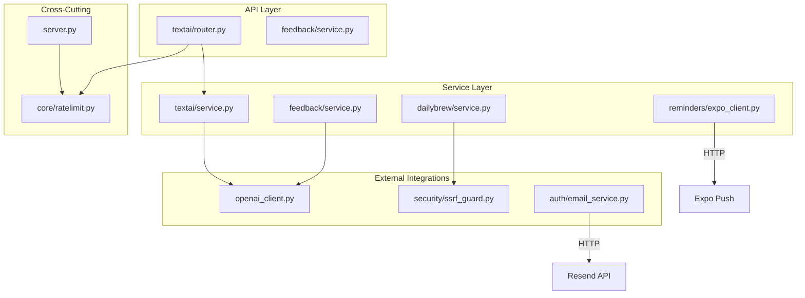
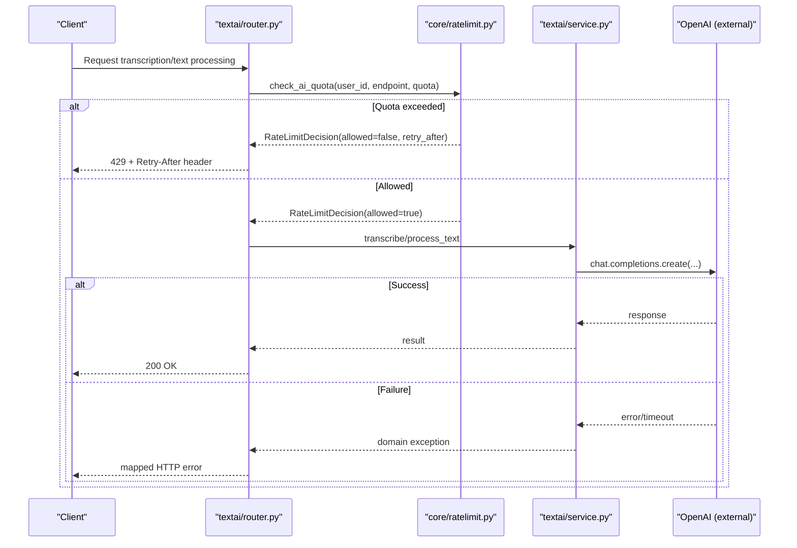
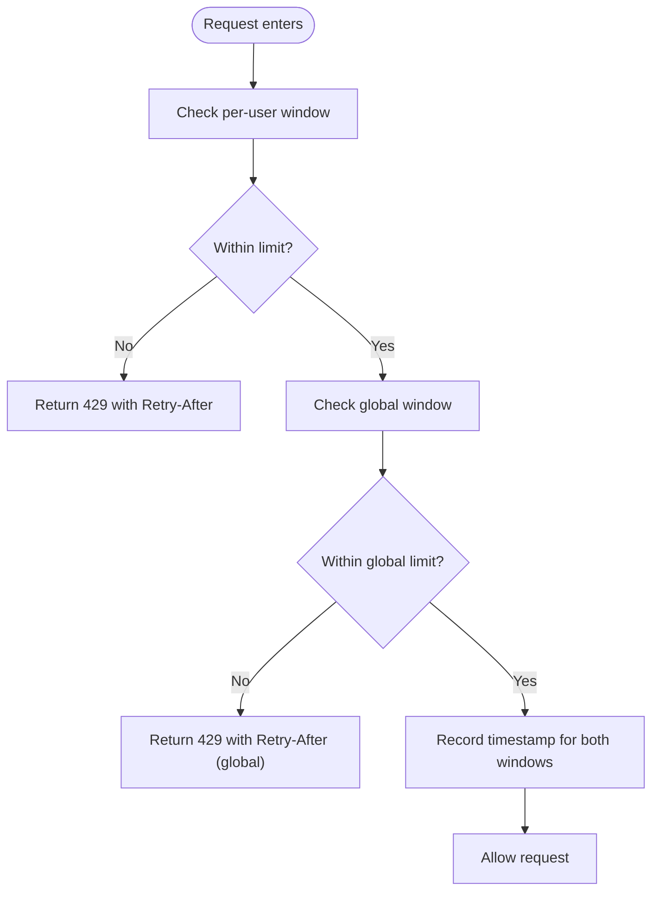
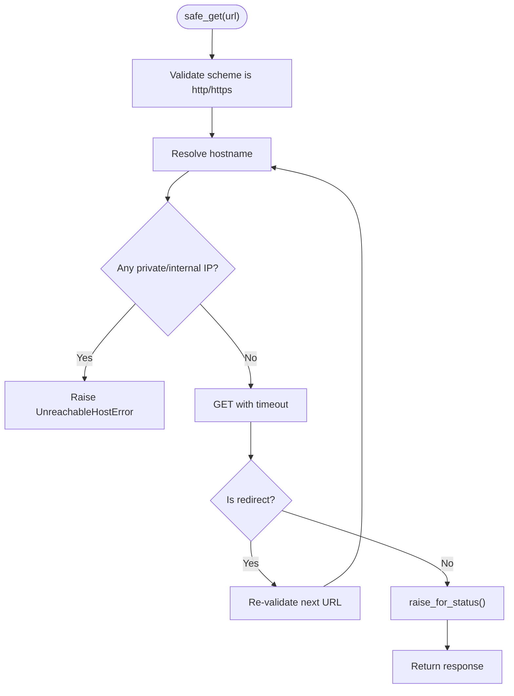
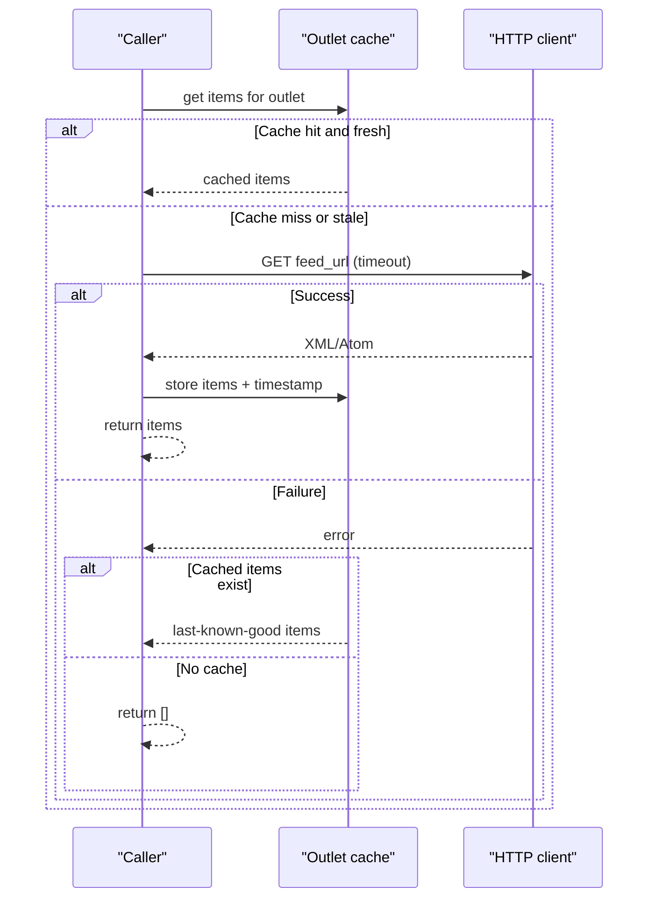
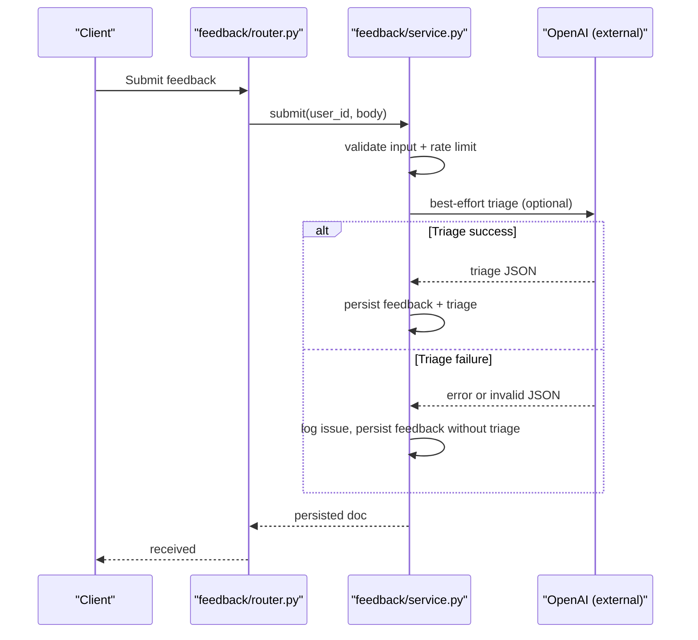
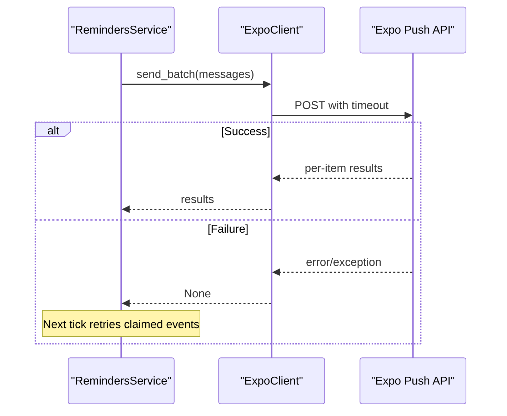
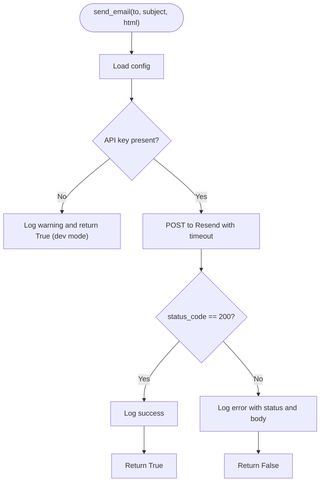
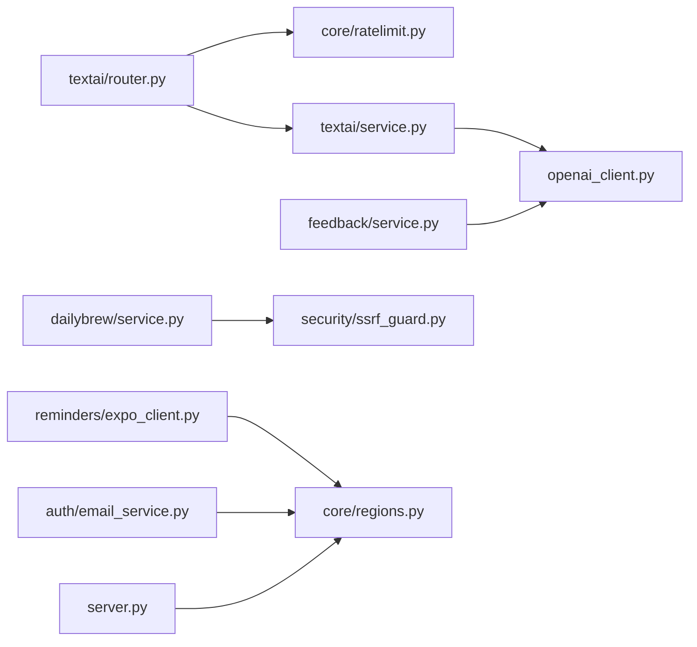

# Error Handling & Retry Logic

<cite>
**Referenced Files in This Document**
- [openai_client.py](file://openai_client.py)
- [core/ratelimit.py](file://core/ratelimit.py)
- [textai/router.py](file://textai/router.py)
- [textai/service.py](file://textai/service.py)
- [feedback/service.py](file://feedback/service.py)
- [security/ssrf_guard.py](file://security/ssrf_guard.py)
- [dailybrew/service.py](file://dailybrew/service.py)
- [reminders/expo_client.py](file://reminders/expo_client.py)
- [auth/email_service.py](file://auth/email_service.py)
- [server.py](file://server.py)
- [tests/test_nueco_apis.py](file://tests/test_nueco_apis.py)
</cite>

## Table of Contents
1. [Introduction](#introduction)
2. [Project Structure](#project-structure)
3. [Core Components](#core-components)
4. [Architecture Overview](#architecture-overview)
5. [Detailed Component Analysis](#detailed-component-analysis)
6. [Dependency Analysis](#dependency-analysis)
7. [Performance Considerations](#performance-considerations)
8. [Troubleshooting Guide](#troubleshooting-guide)
9. [Conclusion](#conclusion)
10. [Appendices](#appendices)

## Introduction
This document explains how the backend handles external API errors and implements resilience patterns such as rate limiting, timeouts, fallbacks, and graceful degradation. It focuses on:
- Preventing cascading failures when external services are unavailable or throttled
- Enforcing per-user and global quotas with clear retry guidance to clients
- Using timeouts and safe network calls to avoid hangs and SSRF risks
- Implementing best-effort behavior for non-critical external calls (e.g., AI triage, push notifications)
- Logging strategies that aid debugging without leaking sensitive data
- Testing approaches to simulate failures and validate behavior

## Project Structure
The repository organizes external integrations by feature modules. Each module typically contains:
- A router layer that translates service exceptions into HTTP responses
- A service layer that performs business logic and calls external APIs
- Shared utilities for rate limiting, security, and configuration

**Diagram sources**
- [textai/router.py:28-49](file://textai/router.py#L28-L49)
- [textai/service.py:112-232](file://textai/service.py#L112-L232)
- [feedback/service.py:76-139](file://feedback/service.py#L76-L139)
- [dailybrew/service.py:168-202](file://dailybrew/service.py#L168-L202)
- [reminders/expo_client.py:18-49](file://reminders/expo_client.py#L18-L49)
- [auth/email_service.py:26-64](file://auth/email_service.py#L26-L64)
- [core/ratelimit.py:41-88](file://core/ratelimit.py#L41-L88)
- [server.py:338-341](file://server.py#L338-L341)

**Section sources**
- [textai/router.py:28-49](file://textai/router.py#L28-L49)
- [core/ratelimit.py:41-88](file://core/ratelimit.py#L41-L88)
- [dailybrew/service.py:168-202](file://dailybrew/service.py#L168-L202)
- [reminders/expo_client.py:18-49](file://reminders/expo_client.py#L18-L49)
- [auth/email_service.py:26-64](file://auth/email_service.py#L26-L64)
- [server.py:338-341](file://server.py#L338-L341)

## Core Components
- Rate limiter with sliding windows and global backstop to protect shared quotas
- Safe HTTP fetcher with scheme validation, DNS resolution checks, and redirect safety
- Best-effort external calls with timeouts and logging
- Graceful degradation via caching and partial results
- Clear error signaling to clients (including Retry-After headers)

Key responsibilities:
- core/ratelimit.py: Enforces per-user and global quotas; returns structured decisions with retry guidance
- security/ssrf_guard.py: Validates URLs, resolves hostnames, rejects private/internal IPs, and enforces redirects policy
- textai/service.py: Calls OpenAI with timeouts (via SDK), validates responses, and raises domain-specific exceptions
- feedback/service.py: Best-effort AI triage; persists feedback regardless of triage outcome
- dailybrew/service.py: Caches RSS/Atom feeds with TTL; falls back to last-known-good on failure
- reminders/expo_client.py: Batches push requests with timeouts; returns None on transport failures so callers can retry later
- auth/email_service.py: Sends emails with explicit timeouts; logs failures without blocking request flow

**Section sources**
- [core/ratelimit.py:25-88](file://core/ratelimit.py#L25-L88)
- [security/ssrf_guard.py:50-108](file://security/ssrf_guard.py#L50-L108)
- [textai/service.py:112-232](file://textai/service.py#L112-L232)
- [feedback/service.py:76-139](file://feedback/service.py#L76-L139)
- [dailybrew/service.py:168-202](file://dailybrew/service.py#L168-L202)
- [reminders/expo_client.py:18-49](file://reminders/expo_client.py#L18-L49)
- [auth/email_service.py:26-64](file://auth/email_service.py#L26-L64)

## Architecture Overview
The system applies multiple layers of resilience:
- Quota enforcement before expensive calls to prevent overuse of shared keys
- Timeouts on all outbound HTTP calls to avoid hanging workers
- Safe fetching with SSRF protection for user-supplied URLs
- Best-effort processing for non-critical features (triage, push receipts)
- In-memory caches to degrade gracefully when upstream is slow or down

**Diagram sources**
- [textai/router.py:28-49](file://textai/router.py#L28-L49)
- [core/ratelimit.py:66-88](file://core/ratelimit.py#L66-L88)
- [textai/service.py:112-232](file://textai/service.py#L112-L232)

## Detailed Component Analysis

### Rate Limiting and Retry Guidance
- Sliding-window limiter tracks per-user and global request timestamps
- When a limit is reached, it computes a precise retry-after value based on when the oldest event expires
- Routers translate denied decisions into 429 responses with Retry-After headers, instructing clients to pause retries

**Diagram sources**
- [core/ratelimit.py:55-88](file://core/ratelimit.py#L55-L88)

**Section sources**
- [core/ratelimit.py:25-88](file://core/ratelimit.py#L25-L88)
- [textai/router.py:28-49](file://textai/router.py#L28-L49)

### Safe Network Fetching and SSRF Protection
- Ensures only http/https schemes are used
- Resolves hostnames and rejects private, loopback, link-local, reserved, multicast, or unspecified addresses
- Manually follows redirects while re-validating each hop
- Enforces timeouts and raises typed errors for different failure modes

**Diagram sources**
- [security/ssrf_guard.py:50-108](file://security/ssrf_guard.py#L50-L108)

**Section sources**
- [security/ssrf_guard.py:50-108](file://security/ssrf_guard.py#L50-L108)
- [dailybrew/service.py:134-158](file://dailybrew/service.py#L134-L158)

### Graceful Degradation with Caching (Daily Brew)
- Maintains an in-memory cache per outlet with a TTL
- On network or parse failure, returns cached items if available, otherwise empty list
- Background prewarmer keeps caches warm to reduce cold-start latency

**Diagram sources**
- [dailybrew/service.py:168-202](file://dailybrew/service.py#L168-L202)

**Section sources**
- [dailybrew/service.py:168-202](file://dailybrew/service.py#L168-L202)

### Best-Effort External Calls (Feedback Triaging)
- Attempts AI triage but never blocks feedback submission
- Parses LLM output robustly, tolerating markdown fences and invalid fields
- Logs field-level issues without exposing user content

**Diagram sources**
- [feedback/service.py:76-139](file://feedback/service.py#L76-L139)

**Section sources**
- [feedback/service.py:76-139](file://feedback/service.py#L76-L139)

### Push Notifications with Retries at Pipeline Level
- ExpoClient wraps HTTP calls with timeouts and returns None on transport failures
- The caller leaves events “claimed” for the next tick to retry, avoiding per-item failure semantics during transient outages

**Diagram sources**
- [reminders/expo_client.py:26-49](file://reminders/expo_client.py#L26-L49)

**Section sources**
- [reminders/expo_client.py:18-49](file://reminders/expo_client.py#L18-L49)

### Email Delivery with Timeouts and Non-Fatal Failures
- Uses explicit timeouts to prevent worker stalls
- Logs failures and returns booleans to indicate success/failure without raising
- In development, missing configuration is tolerated with warnings

**Diagram sources**
- [auth/email_service.py:26-64](file://auth/email_service.py#L26-L64)

**Section sources**
- [auth/email_service.py:26-64](file://auth/email_service.py#L26-L64)

### OpenAI Client Configuration and Region Enforcement
- Retrieves API key from environment and pins base URL to region-checked configuration
- Raises a plain exception if key is missing; routers handle unexpected failures via generic handlers

**Section sources**
- [openai_client.py:8-24](file://openai_client.py#L8-L24)
- [server.py:338-341](file://server.py#L338-L341)

## Dependency Analysis
- Routers depend on service modules and cross-cutting utilities (rate limits, regions)
- Services encapsulate external calls and raise domain exceptions
- Utilities provide reusable resilience primitives (SSRF guard, rate limiter)
- Tests isolate behaviors using mocks and unique IPs to avoid cross-test rate limiting

**Diagram sources**
- [textai/router.py:28-49](file://textai/router.py#L28-L49)
- [textai/service.py:112-232](file://textai/service.py#L112-L232)
- [feedback/service.py:76-139](file://feedback/service.py#L76-L139)
- [dailybrew/service.py:168-202](file://dailybrew/service.py#L168-L202)
- [reminders/expo_client.py:18-49](file://reminders/expo_client.py#L18-L49)
- [auth/email_service.py:26-64](file://auth/email_service.py#L26-L64)
- [server.py:338-341](file://server.py#L338-L341)

**Section sources**
- [textai/router.py:28-49](file://textai/router.py#L28-L49)
- [core/ratelimit.py:66-88](file://core/ratelimit.py#L66-L88)
- [security/ssrf_guard.py:50-108](file://security/ssrf_guard.py#L50-L108)
- [dailybrew/service.py:168-202](file://dailybrew/service.py#L168-L202)
- [reminders/expo_client.py:26-49](file://reminders/expo_client.py#L26-L49)
- [auth/email_service.py:26-64](file://auth/email_service.py#L26-L64)
- [server.py:338-341](file://server.py#L338-L341)

## Performance Considerations
- Timeouts on all outbound HTTP calls prevent worker starvation and reduce tail latencies
- In-process sliding-window rate limiting avoids unnecessary external calls and protects shared quotas
- Caching reduces repeated network I/O and improves responsiveness under load
- Best-effort processing ensures critical paths remain responsive even when auxiliary services fail

[No sources needed since this section provides general guidance]

## Troubleshooting Guide
Common issues and where to look:
- 429 Too Many Requests: Check per-user and global quotas; inspect Retry-After values returned by routers
  - See quota decision and header emission
- Network timeouts or hangs: Verify timeouts configured on HTTP clients and ensure they propagate through service calls
- SSRF rejections: Ensure URLs use http/https and resolve to public IPs; confirm redirects are allowed and safe
- AI parsing errors: Review logged field names when LLM responses do not match expected schemas
- Push notification failures: Inspect logs for batch send/receipt errors; rely on pipeline retries for transient issues

**Section sources**
- [textai/router.py:28-49](file://textai/router.py#L28-L49)
- [core/ratelimit.py:66-88](file://core/ratelimit.py#L66-L88)
- [security/ssrf_guard.py:50-108](file://security/ssrf_guard.py#L50-L108)
- [feedback/service.py:106-139](file://feedback/service.py#L106-L139)
- [reminders/expo_client.py:26-49](file://reminders/expo_client.py#L26-L49)

## Conclusion
The backend employs layered resilience:
- Proactive rate limiting with precise retry guidance
- Strict network safety and timeouts
- Graceful degradation via caching and best-effort processing
- Clear logging that aids debugging without leaking sensitive data

These patterns collectively prevent cascading failures and maintain service stability even when external APIs are degraded or unavailable.

[No sources needed since this section summarizes without analyzing specific files]

## Appendices

### Examples of Robust Error Handling Patterns
- Network timeouts: Explicit timeouts on HTTP clients across email, push, and feed fetching
- Rate limiting: Per-user and global quotas with structured decisions and Retry-After headers
- Authentication/configuration failures: Plain exceptions raised early; routers map to appropriate HTTP codes
- Fallback mechanisms: Caching for feeds; best-effort triage for feedback; pipeline retries for push

**Section sources**
- [auth/email_service.py:26-64](file://auth/email_service.py#L26-L64)
- [core/ratelimit.py:66-88](file://core/ratelimit.py#L66-L88)
- [dailybrew/service.py:168-202](file://dailybrew/service.py#L168-L202)
- [feedback/service.py:106-139](file://feedback/service.py#L106-L139)
- [reminders/expo_client.py:26-49](file://reminders/expo_client.py#L26-L49)

### Testing Approaches for External API Failures
- Use unique X-Forwarded-For per test to avoid cross-test rate limiting
- Mock or replace external clients (e.g., ExpoClient) to exercise business logic without network calls
- Assert status codes and headers (e.g., 429 with Retry-After) to validate retry behavior

**Section sources**
- [tests/test_nueco_apis.py:54-84](file://tests/test_nueco_apis.py#L54-L84)