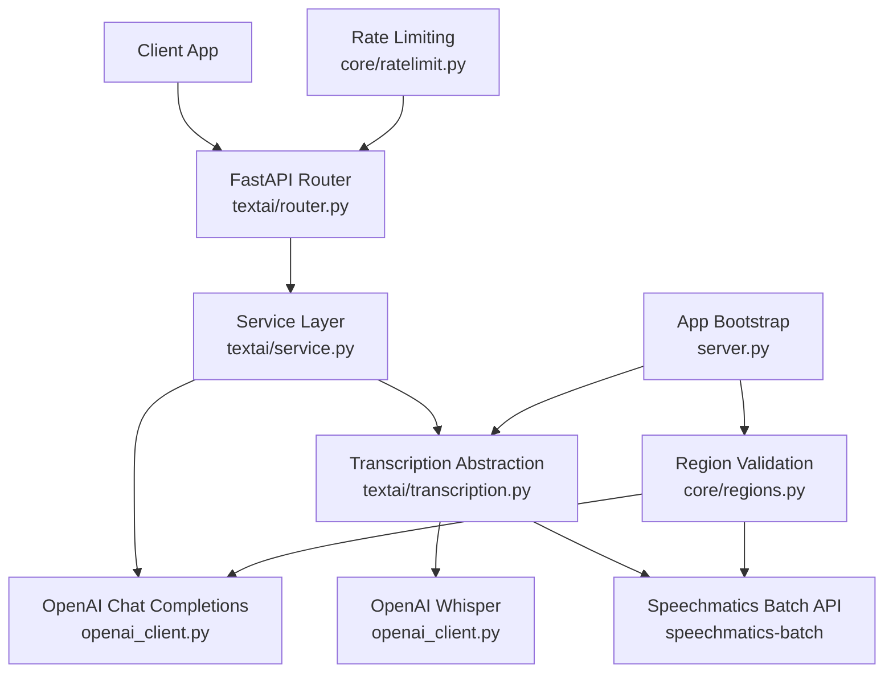
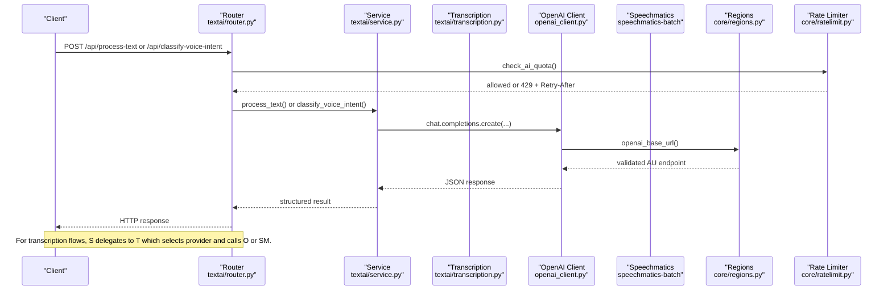
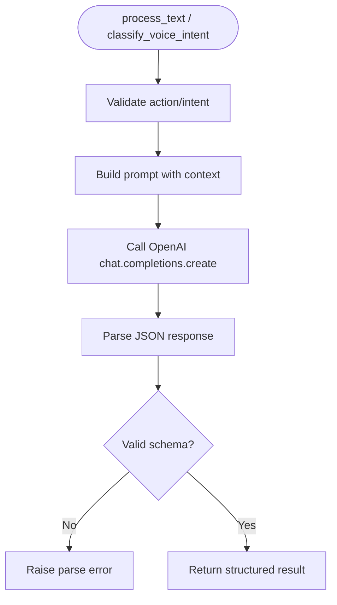
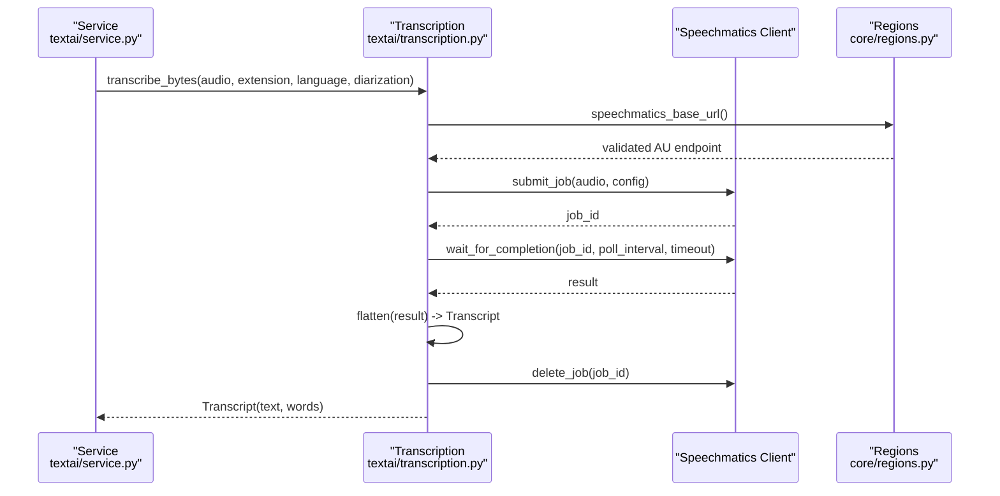
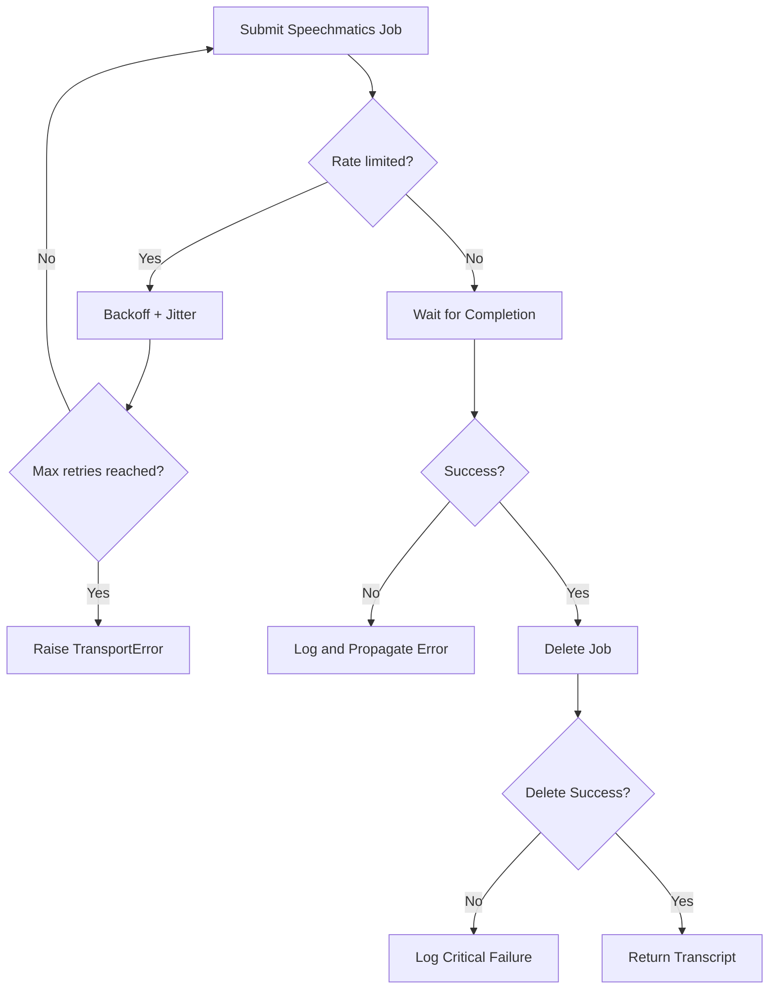
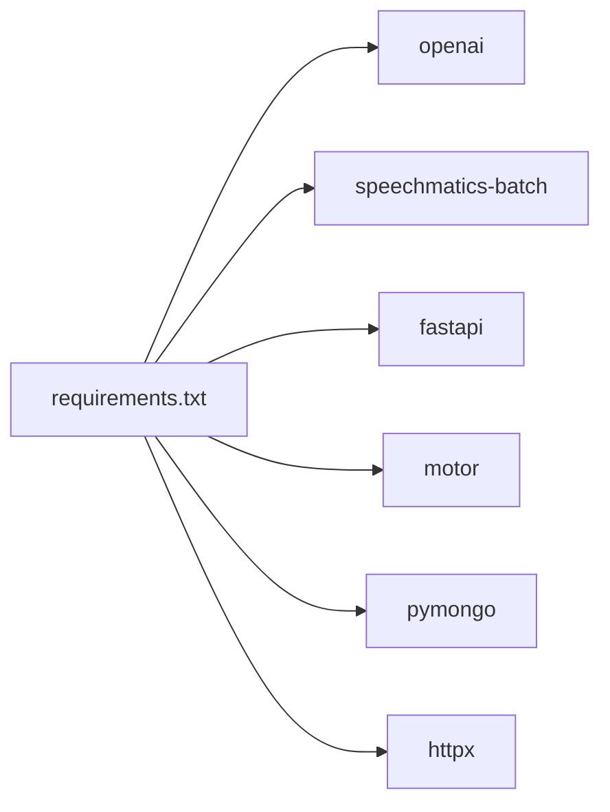

# External API Integration

<cite>
**Referenced Files in This Document**
- [openai_client.py](file://openai_client.py)
- [textai/service.py](file://textai/service.py)
- [textai/transcription.py](file://textai/transcription.py)
- [textai/router.py](file://textai/router.py)
- [textai/schemas.py](file://textai/schemas.py)
- [core/regions.py](file://core/regions.py)
- [core/ratelimit.py](file://core/ratelimit.py)
- [server.py](file://server.py)
- [requirements.txt](file://requirements.txt)
</cite>

## Table of Contents
1. [Introduction](#introduction)
2. [Project Structure](#project-structure)
3. [Core Components](#core-components)
4. [Architecture Overview](#architecture-overview)
5. [Detailed Component Analysis](#detailed-component-analysis)
6. [Dependency Analysis](#dependency-analysis)
7. [Performance Considerations](#performance-considerations)
8. [Troubleshooting Guide](#troubleshooting-guide)
9. [Conclusion](#conclusion)
10. [Appendices](#appendices)

## Introduction
This document explains how the backend integrates external AI services to power text processing and voice intent classification, as well as audio transcription. It covers:
- OpenAI client configuration for chat completions used by text processing and voice intent classification
- Speechmatics integration for audio transcription with job lifecycle management
- Error handling strategies including retries, rate limiting, and fallbacks
- Configuration for endpoints, timeouts, and connection behavior
- Security considerations for API keys, request sanitization, and response validation
- Performance techniques such as provider selection, shadow mode, and efficient polling
- Guidance for adding new providers, mocking APIs for tests, and monitoring usage/costs

## Project Structure
The external integrations are centered around the textai module and shared core utilities:
- openai_client.py: Creates an AsyncOpenAI client using validated base URL and API key
- textai/service.py: Orchestrates text processing and voice intent classification via OpenAI
- textai/transcription.py: Abstracts transcription providers (OpenAI Whisper and Speechmatics), manages jobs, and runs reconciliation sweeps
- textai/router.py: FastAPI endpoints that enforce quotas and translate service exceptions into HTTP responses
- core/regions.py: Centralized endpoint and region validation ensuring data residency compliance
- core/ratelimit.py: In-process sliding-window rate limiter protecting shared vendor quotas
- server.py: Application bootstrap, startup tasks (region checks, index creation, sweepers), and router registration
- requirements.txt: Vendor SDKs including openai and speechmatics-batch

**Diagram sources**
- [textai/router.py:75-163](file://textai/router.py#L75-L163)
- [textai/service.py:133-315](file://textai/service.py#L133-L315)
- [openai_client.py:15-24](file://openai_client.py#L15-L24)
- [textai/transcription.py:78-321](file://textai/transcription.py#L78-L321)
- [core/regions.py:184-191](file://core/regions.py#L184-L191)
- [core/ratelimit.py:115-124](file://core/ratelimit.py#L115-L124)
- [server.py:338-459](file://server.py#L338-L459)

**Section sources**
- [textai/router.py:1-163](file://textai/router.py#L1-L163)
- [textai/service.py:1-315](file://textai/service.py#L1-L315)
- [textai/transcription.py:1-450](file://textai/transcription.py#L1-L450)
- [openai_client.py:1-24](file://openai_client.py#L1-L24)
- [core/regions.py:1-230](file://core/regions.py#L1-L230)
- [core/ratelimit.py:1-124](file://core/ratelimit.py#L1-L124)
- [server.py:1-465](file://server.py#L1-L465)
- [requirements.txt:63-104](file://requirements.txt#L63-L104)

## Core Components
- OpenAI client: Provides a configured AsyncOpenAI instance with a residency-checked base URL and API key from environment variables. Used for chat completions in text processing and voice intent classification.
- Text processing service: Validates actions, formats prompts, calls OpenAI chat completions, parses JSON responses, and returns structured results.
- Voice intent classification: Uses OpenAI to classify transcripts into intents and extract structured events with strict schema validation.
- Transcription abstraction: Pluggable providers (OpenAI Whisper and Speechmatics). Handles diarization routing, job submission, polling, result flattening, and cleanup.
- Region enforcement: All external endpoints must be declared and validated against an Australian-region allowlist at boot and on each access.
- Rate limiting: Per-user and global sliding windows protect shared vendor quotas; clients receive Retry-After headers when throttled.
- Application bootstrap: Starts region validation, database indexes, and background sweepers for stale transcription jobs.

**Section sources**
- [openai_client.py:8-24](file://openai_client.py#L8-L24)
- [textai/service.py:133-315](file://textai/service.py#L133-L315)
- [textai/transcription.py:78-321](file://textai/transcription.py#L78-L321)
- [core/regions.py:144-191](file://core/regions.py#L144-L191)
- [core/ratelimit.py:41-124](file://core/ratelimit.py#L41-L124)
- [server.py:338-459](file://server.py#L338-L459)

## Architecture Overview
The system routes requests through FastAPI routers into framework-agnostic services. Services call external providers via centralized clients and region validators. Background tasks ensure data residency and provider-side resource cleanup.

**Diagram sources**
- [textai/router.py:136-163](file://textai/router.py#L136-L163)
- [textai/service.py:133-315](file://textai/service.py#L133-L315)
- [openai_client.py:15-24](file://openai_client.py#L15-L24)
- [core/regions.py:184-191](file://core/regions.py#L184-L191)
- [core/ratelimit.py:115-124](file://core/ratelimit.py#L115-L124)

## Detailed Component Analysis

### OpenAI Client Integration for Text Processing and Voice Intent Classification
- Configuration: The client is created with an API key resolved from environment variables and a base URL enforced by region validation. This ensures all LLM calls go through the approved Australian-region endpoint.
- Request formatting: Text processing uses system and user messages with low temperature to produce deterministic outputs. JSON-mode responses are requested for structured parsing.
- Response parsing: Responses are parsed into JSON objects and validated against Pydantic schemas. Empty or malformed responses raise specific exceptions that the router translates to HTTP errors.

**Diagram sources**
- [textai/service.py:133-233](file://textai/service.py#L133-L233)
- [textai/service.py:259-315](file://textai/service.py#L259-L315)
- [openai_client.py:15-24](file://openai_client.py#L15-L24)

**Section sources**
- [openai_client.py:8-24](file://openai_client.py#L8-L24)
- [textai/service.py:25-88](file://textai/service.py#L25-L88)
- [textai/service.py:133-233](file://textai/service.py#L133-L233)
- [textai/service.py:259-315](file://textai/service.py#L259-L315)
- [textai/schemas.py:30-143](file://textai/schemas.py#L30-L143)

### Speechmatics Integration for Audio Transcription
- Authentication: API key is read from environment and required; missing key raises a configuration error.
- Endpoint and region: Base URL is obtained from region validation to ensure Australian-region compliance.
- Job lifecycle:
  - Submit job with language and optional diarization settings
  - Poll for completion with timeout and interval
  - Flatten structured results into plain text plus word-level timestamps
  - Delete job immediately after completion to avoid provider-side retention
- Diarization support: When diarization is requested and supported by the active provider, speaker labels are included; otherwise, it falls back gracefully.

**Diagram sources**
- [textai/transcription.py:171-286](file://textai/transcription.py#L171-L286)
- [core/regions.py:190-191](file://core/regions.py#L190-L191)

**Section sources**
- [textai/transcription.py:148-163](file://textai/transcription.py#L148-L163)
- [textai/transcription.py:171-286](file://textai/transcription.py#L171-L286)
- [textai/transcription.py:323-361](file://textai/transcription.py#L323-L361)
- [server.py:453-459](file://server.py#L453-L459)

### Error Handling Strategies
- Provider-specific retries:
  - Speechmatics submit retries on rate limit (HTTP 429) with exponential backoff and jitter, up to a bounded cap.
  - On completion failure or unexpected states, exceptions propagate to the router for standardized HTTP responses.
- Fallback mechanisms:
  - If diarization is requested but unsupported by the primary provider and Speechmatics is configured, the flow switches to Speechmatics automatically.
  - Shadow mode runs a secondary provider in the background for migration validation without affecting user requests.
- Quota protection:
  - Per-user and global rate limits return 429 with Retry-Before headers before any external call, preventing wasted costs.
- Cleanup and reconciliation:
  - Immediate deletion of Speechmatics jobs after transcription; if deletion fails, a background sweeper periodically deletes stale jobs.

**Diagram sources**
- [textai/transcription.py:235-252](file://textai/transcription.py#L235-L252)
- [textai/transcription.py:222-233](file://textai/transcription.py#L222-L233)
- [textai/transcription.py:323-361](file://textai/transcription.py#L323-L361)

**Section sources**
- [textai/transcription.py:135-146](file://textai/transcription.py#L135-L146)
- [textai/transcription.py:235-252](file://textai/transcription.py#L235-L252)
- [textai/transcription.py:222-233](file://textai/transcription.py#L222-L233)
- [core/ratelimit.py:115-124](file://core/ratelimit.py#L115-L124)
- [textai/router.py:28-50](file://textai/router.py#L28-L50)

### Configuration Options
- API endpoints and regions:
  - OPENAI_BASE_URL and OPENAI_REGION for OpenAI
  - SPEECHMATICS_BASE_URL and SPEECHMATICS_REGION for Speechmatics
  - Enforced at boot and on every access via region validation
- API keys:
  - OPENAI_API_KEY or EMERGENT_LLM_KEY for OpenAI
  - SPEECHMATICS_API_KEY for Speechmatics
- Timeouts and polling:
  - Speechmatics job timeout and polling interval are defined constants
- Connection reuse:
  - Providers use SDK-managed async clients; no explicit pooling configuration is present in this codebase
- Environment loading:
  - .env file loaded at application startup

**Section sources**
- [core/regions.py:58-77](file://core/regions.py#L58-L77)
- [core/regions.py:184-191](file://core/regions.py#L184-L191)
- [openai_client.py:15-24](file://openai_client.py#L15-L24)
- [textai/transcription.py:135-146](file://textai/transcription.py#L135-L146)
- [server.py:13-18](file://server.py#L13-L18)

### Security Considerations
- API key management:
  - Keys are read from environment variables; missing keys raise configuration errors
  - Base URLs are validated to prevent accidental egress outside approved regions
- Request sanitization:
  - Inputs validated via Pydantic schemas; invalid actions and malformed fields are rejected early
  - Transcript content is not logged to avoid exposing sensitive data
- Response validation:
  - LLM outputs parsed and validated against strict schemas; unknown values degrade safely rather than failing entirely
  - Events with missing or invalid fields are dropped individually to preserve other valid events

**Section sources**
- [openai_client.py:8-24](file://openai_client.py#L8-L24)
- [core/regions.py:144-191](file://core/regions.py#L144-L191)
- [textai/schemas.py:30-143](file://textai/schemas.py#L30-L143)
- [textai/router.py:91-98](file://textai/router.py#L91-L98)

### Performance Optimization Techniques
- Provider selection:
  - Automatic fallback to Speechmatics when diarization is requested and available
  - Shadow mode runs a secondary provider in the background for comparison without impacting latency
- Efficient polling:
  - Configured polling intervals and timeouts for Speechmatics jobs
- Quiet filtering:
  - Whisper responses filtered to drop likely hallucinations based on segment metrics
- Logging discipline:
  - Logs transcript lengths and timing instead of content to reduce noise and protect privacy

**Section sources**
- [textai/transcription.py:310-321](file://textai/transcription.py#L310-L321)
- [textai/transcription.py:387-449](file://textai/transcription.py#L387-L449)
- [textai/transcription.py:121-133](file://textai/transcription.py#L121-L133)
- [textai/router.py:91-98](file://textai/router.py#L91-L98)

## Dependency Analysis
External dependencies and their roles:
- openai: Used for chat completions and Whisper transcription
- speechmatics-batch: Used for batch transcription with job management
- fastapi/starlette: Web framework and middleware
- motor/pymongo: Database interactions
- httpx: Used elsewhere for feature flags and analytics

**Diagram sources**
- [requirements.txt:63-104](file://requirements.txt#L63-L104)

**Section sources**
- [requirements.txt:1-121](file://requirements.txt#L1-L121)

## Performance Considerations
- Use provider capabilities strategically: prefer Speechmatics when diarization is needed; otherwise default to OpenAI Whisper for simplicity.
- Keep polling intervals reasonable to balance responsiveness and provider load.
- Avoid logging sensitive content; log metadata like sizes and durations.
- Leverage shadow mode to evaluate alternative providers without impacting user experience.
- Monitor quota hits and adjust per-user/global limits to match expected traffic patterns.

[No sources needed since this section provides general guidance]

## Troubleshooting Guide
Common issues and resolutions:
- Missing API keys:
  - Ensure OPENAI_API_KEY or EMERGENT_LLM_KEY is set for OpenAI
  - Ensure SPEECHMATICS_API_KEY is set for Speechmatics
- Region validation failures:
  - Verify OPENAI_BASE_URL, OPENAI_REGION, SPEECHMATICS_BASE_URL, and SPEECHMATICS_REGION are correctly set and within the Australian-region allowlist
- Rate limiting:
  - If receiving 429 with Retry-After, back off according to the header; consider reducing request frequency or adjusting quotas
- Transcription failures:
  - Check provider logs for transport errors; verify audio format and language hints
  - Confirm immediate job deletion succeeded; rely on the background sweeper for stale job cleanup
- Response parsing errors:
  - Inspect LLM output structure; ensure JSON mode is enabled and schemas are aligned with expected fields

**Section sources**
- [openai_client.py:15-24](file://openai_client.py#L15-L24)
- [core/regions.py:144-191](file://core/regions.py#L144-L191)
- [core/ratelimit.py:115-124](file://core/ratelimit.py#L115-L124)
- [textai/transcription.py:235-252](file://textai/transcription.py#L235-L252)
- [textai/transcription.py:323-361](file://textai/transcription.py#L323-L361)
- [textai/service.py:213-229](file://textai/service.py#L213-L229)

## Conclusion
The backend implements robust external API integrations for AI-driven text processing and voice intent classification, alongside reliable audio transcription via OpenAI Whisper and Speechmatics. Data residency is enforced centrally, rate limits protect shared vendor quotas, and background tasks ensure provider-side resource cleanup. The modular design allows easy addition of new providers and supports testing via shadow mode and strict schema validation.

[No sources needed since this section summarizes without analyzing specific files]

## Appendices

### Adding a New AI Provider
- Implement a provider class conforming to the TranscriptionProvider protocol
- Register the provider in the provider map
- Update resolve_transcription_provider logic if special routing rules apply
- Add environment variables and region declarations if applicable
- Test with shadow mode to compare outputs without affecting users

**Section sources**
- [textai/transcription.py:53-64](file://textai/transcription.py#L53-L64)
- [textai/transcription.py:288-321](file://textai/transcription.py#L288-L321)
- [textai/transcription.py:387-449](file://textai/transcription.py#L387-L449)

### Mocking External APIs for Testing
- Use in-process test harnesses to run the FastAPI app without network egress
- Replace external clients with mocks where necessary
- Validate behavior under rate limits and quota enforcement
- Ensure region validation fixtures include non-real endpoints

**Section sources**
- [tests/test_nueco_apis.py:1-88](file://tests/test_nueco_apis.py#L1-L88)
- [tests/test_regions.py:14-43](file://tests/test_regions.py#L14-L43)

### Monitoring API Usage and Costs
- Track quota decisions and 429 responses to identify hotspots
- Log transcription latencies and provider usage for cost analysis
- Use shadow mode records to compare provider performance and accuracy
- Integrate first-party analytics endpoints for feature usage without sending sensitive content

**Section sources**
- [core/ratelimit.py:115-124](file://core/ratelimit.py#L115-L124)
- [textai/transcription.py:387-449](file://textai/transcription.py#L387-L449)
- [server.py:107-123](file://server.py#L107-L123)