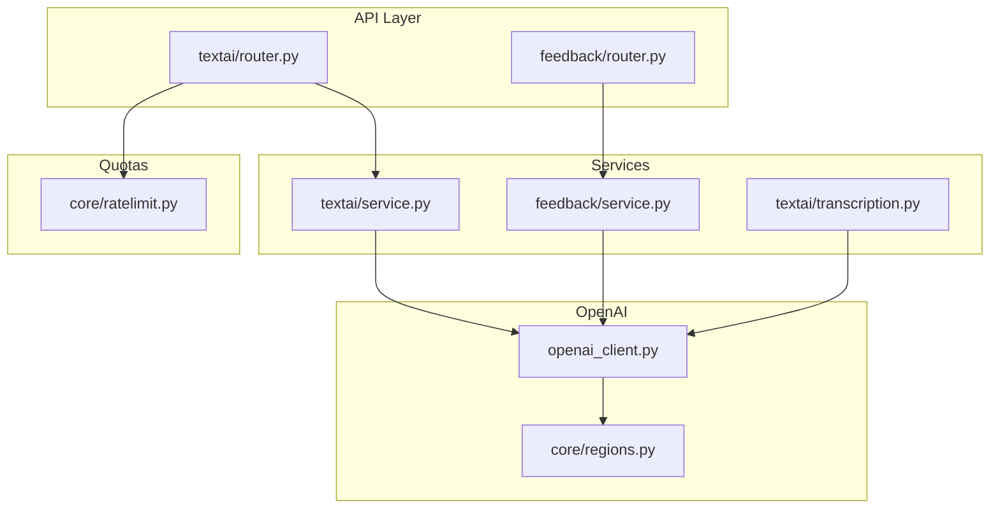
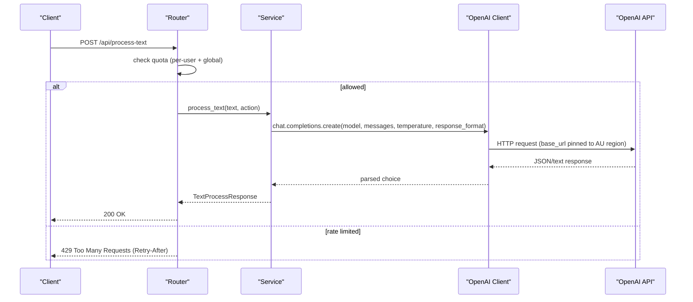
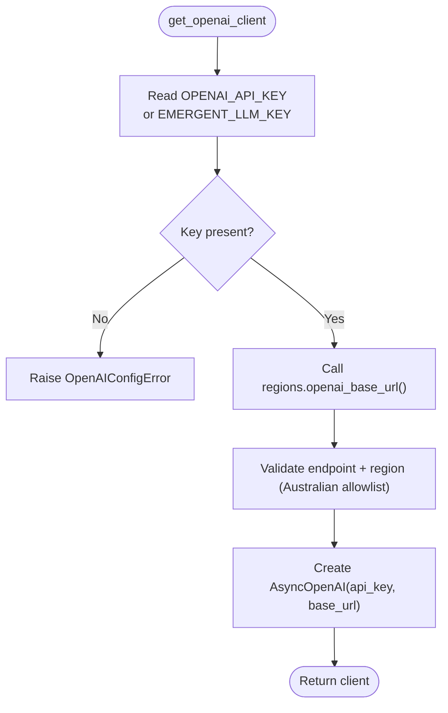
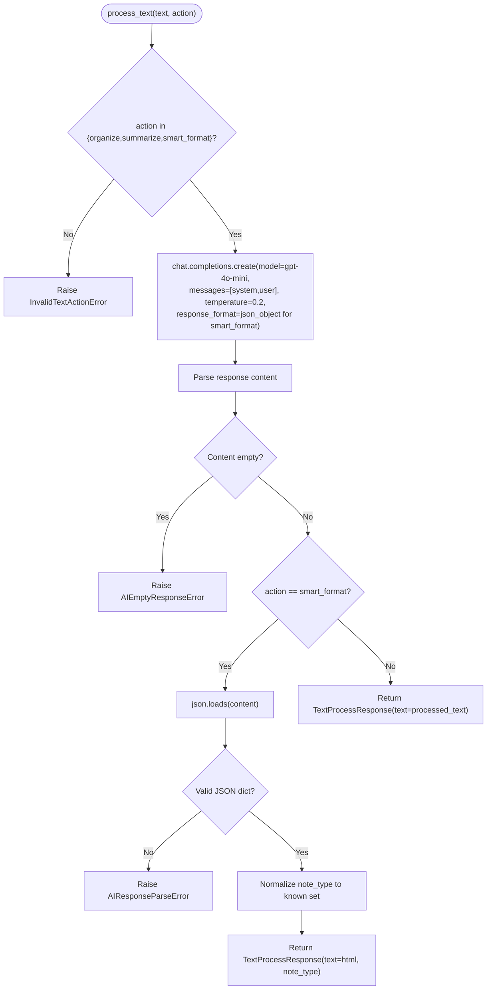
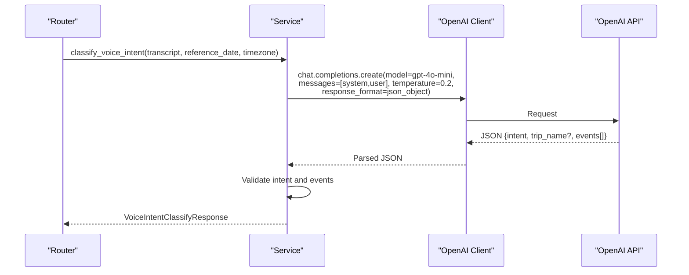
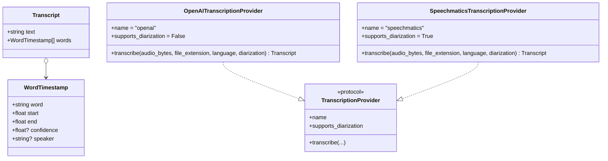
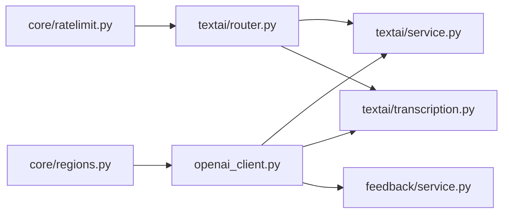

# OpenAI Integration

<cite>
**Referenced Files in This Document**
- [openai_client.py](file://openai_client.py)
- [regions.py](file://core/regions.py)
- [ratelimit.py](file://core/ratelimit.py)
- [service.py](file://textai/service.py)
- [router.py](file://textai/router.py)
- [schemas.py](file://textai/schemas.py)
- [transcription.py](file://textai/transcription.py)
- [feedback_service.py](file://feedback/service.py)
</cite>

## Table of Contents
1. [Introduction](#introduction)
2. [Project Structure](#project-structure)
3. [Core Components](#core-components)
4. [Architecture Overview](#architecture-overview)
5. [Detailed Component Analysis](#detailed-component-analysis)
6. [Dependency Analysis](#dependency-analysis)
7. [Performance Considerations](#performance-considerations)
8. [Troubleshooting Guide](#troubleshooting-guide)
9. [Conclusion](#conclusion)

## Introduction
This document explains how the backend integrates with OpenAI to provide text processing and transcription capabilities while enforcing Australian data residency and protecting shared API quotas. It covers client initialization, environment configuration for API keys and base URLs, request formatting, response parsing, error handling, and operational guidance such as rate limiting, cost optimization, and monitoring.

## Project Structure
The OpenAI integration spans a small set of focused modules:
- Client initialization and region enforcement
- Text processing services (organize, summarize, smart format)
- Voice intent classification and transcription
- Feedback triage using AI
- Rate limiting and quota protection
- Request/response schemas

**Diagram sources**
- [router.py:1-163](file://textai/router.py#L1-L163)
- [service.py:1-315](file://textai/service.py#L1-L315)
- [transcription.py:1-450](file://textai/transcription.py#L1-L450)
- [openai_client.py:1-24](file://openai_client.py#L1-L24)
- [regions.py:1-230](file://core/regions.py#L1-L230)
- [ratelimit.py:1-124](file://core/ratelimit.py#L1-L124)

**Section sources**
- [openai_client.py:1-24](file://openai_client.py#L1-L24)
- [regions.py:1-230](file://core/regions.py#L1-L230)
- [ratelimit.py:1-124](file://core/ratelimit.py#L1-L124)
- [service.py:1-315](file://textai/service.py#L1-L315)
- [router.py:1-163](file://textai/router.py#L1-L163)
- [transcription.py:1-450](file://textai/transcription.py#L1-L450)
- [feedback_service.py:1-139](file://feedback/service.py#L1-L139)

## Core Components
- OpenAI client factory that reads API keys from environment variables and pins the base URL to an Australian-region endpoint.
- Text processing service supporting organize, summarize, and smart format actions.
- Voice intent classifier that extracts structured events or recognizes plain dictation.
- Transcription providers (OpenAI Whisper and Speechmatics) with provider selection and diarization support.
- Feedback triage service that categorizes and prioritizes user feedback via AI.
- In-process sliding-window rate limiter to protect shared OpenAI quotas.

Key responsibilities:
- Enforce data residency by routing all OpenAI calls through a validated Australian base URL.
- Provide robust prompt templates and JSON-mode responses for reliable parsing.
- Apply per-user and global rate limits before making any external API call.
- Handle malformed or empty AI responses gracefully without crashing requests.

**Section sources**
- [openai_client.py:15-23](file://openai_client.py#L15-L23)
- [service.py:133-232](file://textai/service.py#L133-L232)
- [service.py:259-315](file://textai/service.py#L259-L315)
- [transcription.py:78-133](file://textai/transcription.py#L78-L133)
- [transcription.py:171-285](file://textai/transcription.py#L171-L285)
- [feedback_service.py:76-139](file://feedback/service.py#L76-L139)
- [ratelimit.py:41-124](file://core/ratelimit.py#L41-L124)

## Architecture Overview
The system uses a layered approach: routers enforce authentication and quotas; services implement business logic and prompt orchestration; the OpenAI client centralizes configuration and ensures regional compliance.

**Diagram sources**
- [router.py:136-148](file://textai/router.py#L136-L148)
- [ratelimit.py:115-124](file://core/ratelimit.py#L115-L124)
- [service.py:133-232](file://textai/service.py#L133-L232)
- [openai_client.py:15-23](file://openai_client.py#L15-L23)
- [regions.py:186-187](file://core/regions.py#L186-L187)

## Detailed Component Analysis

### OpenAI Client Initialization and Region Compliance
- API key resolution: The client reads OPENAI_API_KEY first, then falls back to EMERGENT_LLM_KEY. If neither is set, it raises a configuration error.
- Base URL pinning: The client always sets base_url to the value returned by the regions module, which validates that the endpoint and region are configured and Australian-compliant.
- Fail-closed design: Any missing or non-Australian configuration aborts at startup and re-validates on every access.

**Diagram sources**
- [openai_client.py:15-23](file://openai_client.py#L15-L23)
- [regions.py:186-187](file://core/regions.py#L186-L187)
- [regions.py:144-165](file://core/regions.py#L144-L165)

**Section sources**
- [openai_client.py:8-23](file://openai_client.py#L8-L23)
- [regions.py:26-30](file://core/regions.py#L26-L30)
- [regions.py:144-187](file://core/regions.py#L144-L187)

### Text Processing Capabilities
Actions supported:
- Organize: Reformat text into readable paragraphs, bullets, headers, and fix grammar.
- Summarize: Produce concise summaries preserving key points.
- Smart format: Classify note type (recipe, checklist, meeting_notes, general) and return clean HTML for that type.

Request formatting:
- Uses chat.completions with model gpt-4o-mini, low temperature for stability.
- For smart format, enforces JSON mode to ensure parseable output.

Response parsing:
- Extracts content from choices[0].message.content.
- Validates non-empty results; raises specific errors for empty or malformed responses.
- For smart format, parses JSON and normalizes unknown note types to general.

**Diagram sources**
- [service.py:133-232](file://textai/service.py#L133-L232)

**Section sources**
- [service.py:25-47](file://textai/service.py#L25-L47)
- [service.py:133-232](file://textai/service.py#L133-L232)
- [schemas.py:20-42](file://textai/schemas.py#L20-L42)

### Voice Intent Detection and Event Extraction
Purpose:
- Determine whether a voice transcript is plain dictation or a scheduling request (single event, multiple events, or itinerary).
- Extract structured events with title, start/end times, location, recurrence, and confidence.

Prompting and parsing:
- System message defines role and constraints.
- Prompt includes reference date and timezone to resolve relative times.
- Response must be JSON with strict fields; unknown intents fall back to “note”.
- Events are validated against schema; invalid entries are dropped individually to preserve valid ones.

**Diagram sources**
- [service.py:259-315](file://textai/service.py#L259-L315)
- [schemas.py:44-143](file://textai/schemas.py#L44-L143)

**Section sources**
- [service.py:49-87](file://textai/service.py#L49-L87)
- [service.py:235-315](file://textai/service.py#L235-L315)
- [schemas.py:44-143](file://textai/schemas.py#L44-L143)

### Transcription Providers and Data Residency
Providers:
- OpenAI Whisper: Uses audio.transcriptions with verbose_json to detect and drop silent hallucinations.
- Speechmatics: Batch API with job submission, polling, and immediate deletion; supports diarization when requested.

Provider selection:
- Default is OpenAI unless TRANSCRIPTION_PROVIDER is set.
- If diarization is requested and available (Speechmatics), it is used; otherwise falls back to primary provider.

Regional compliance:
- Both providers use base URLs obtained from the regions module to ensure Australian endpoints.

**Diagram sources**
- [transcription.py:26-51](file://textai/transcription.py#L26-L51)
- [transcription.py:78-133](file://textai/transcription.py#L78-L133)
- [transcription.py:171-285](file://textai/transcription.py#L171-L285)

**Section sources**
- [transcription.py:78-133](file://textai/transcription.py#L78-L133)
- [transcription.py:171-285](file://textai/transcription.py#L171-L285)
- [transcription.py:294-321](file://textai/transcription.py#L294-L321)
- [regions.py:186-191](file://core/regions.py#L186-L191)

### Feedback Triage and Content Moderation
Feedback triage uses AI to categorize and prioritize user comments:
- Input validation and length checks.
- Per-user rate limiting within a 24-hour window.
- Calls OpenAI with a compact JSON schema for category, priority, and summary.
- Gracefully handles malformed or unexpected AI replies without failing the feedback submission.

Use cases:
- Automatic categorization of bug reports vs feature requests.
- Prioritizing urgent issues like crashes or billing problems.
- Generating short summaries for quick review.

**Section sources**
- [feedback_service.py:21-57](file://feedback/service.py#L21-L57)
- [feedback_service.py:60-74](file://feedback/service.py#L60-L74)
- [feedback_service.py:76-139](file://feedback/service.py#L76-L139)

## Dependency Analysis
- Router layers depend on services for business logic and on ratelimit for quota enforcement.
- Services depend on openai_client for API access and on regions for endpoint validation.
- Transcription depends on openai_client and optionally on Speechmatics SDK based on configuration.
- Feedback service depends on openai_client and local in-memory rate limiter.

**Diagram sources**
- [ratelimit.py:115-124](file://core/ratelimit.py#L115-L124)
- [router.py:1-163](file://textai/router.py#L1-L163)
- [openai_client.py:15-23](file://openai_client.py#L15-L23)
- [regions.py:186-191](file://core/regions.py#L186-L191)
- [service.py:133-315](file://textai/service.py#L133-L315)
- [transcription.py:78-321](file://textai/transcription.py#L78-L321)
- [feedback_service.py:76-139](file://feedback/service.py#L76-L139)

**Section sources**
- [ratelimit.py:1-124](file://core/ratelimit.py#L1-L124)
- [openai_client.py:1-24](file://openai_client.py#L1-L24)
- [regions.py:1-230](file://core/regions.py#L1-L230)
- [service.py:1-315](file://textai/service.py#L1-L315)
- [transcription.py:1-450](file://textai/transcription.py#L1-L450)
- [feedback_service.py:1-139](file://feedback/service.py#L1-L139)

## Performance Considerations
- Model selection: All text and feedback paths use gpt-4o-mini for cost efficiency and speed.
- Temperature: Low temperature (0.2) improves determinism and reduces retries.
- JSON mode: Using response_format json_object reduces parsing overhead and improves reliability.
- Transcription: Whisper verbose_json enables filtering of silent segments to avoid wasted tokens and improve quality.
- Provider fallback: Diarization-enabled path uses Speechmatics only when needed; otherwise defaults to OpenAI.

Cost optimization techniques:
- Prefer shorter prompts and structured outputs to reduce token usage.
- Use JSON mode to avoid extra parsing steps and retries.
- Avoid unnecessary diarization unless required by conversation capture.
- Leverage rate limiting to prevent runaway loops that waste quota.

Monitoring approaches:
- Log transcript lengths and processing latencies without logging sensitive content.
- Track quota decisions and 429 responses to identify bursts.
- Use shadow transcription to compare provider performance offline without impacting users.

**Section sources**
- [service.py:154-167](file://textai/service.py#L154-L167)
- [service.py:180-193](file://textai/service.py#L180-L193)
- [service.py:202-229](file://textai/service.py#L202-L229)
- [transcription.py:101-117](file://textai/transcription.py#L101-L117)
- [transcription.py:387-446](file://textai/transcription.py#L387-L446)
- [ratelimit.py:98-112](file://core/ratelimit.py#L98-L112)

## Troubleshooting Guide
Common issues and resolutions:
- Missing API key: Ensure OPENAI_API_KEY or EMERGENT_LLM_KEY is set. The client will raise a configuration error if neither is present.
- Non-Australian base URL: Verify OPENAI_BASE_URL and OPENAI_REGION are configured correctly; boot will fail if not compliant.
- Rate limiting: If you receive 429 with Retry-After, back off according to the header. Check per-user and global quotas.
- Empty or malformed AI responses: For text processing and voice intent, empty or unparseable responses raise specific errors; retry with adjusted prompts or lower complexity.
- Transcription failures: Whisper may produce hallucinated text on silence; the provider filters these using segment metrics. For diarization, ensure Speechmatics key is configured.

Operational tips:
- Inspect logs for quota exceeded messages and transcription latency.
- Use shadow transcription to evaluate alternative providers without affecting live traffic.
- Keep prompts concise and specify JSON mode where applicable to reduce parsing errors.

**Section sources**
- [openai_client.py:8-23](file://openai_client.py#L8-L23)
- [regions.py:144-165](file://core/regions.py#L144-L165)
- [router.py:28-49](file://textai/router.py#L28-L49)
- [service.py:90-99](file://textai/service.py#L90-L99)
- [service.py:212-229](file://textai/service.py#L212-L229)
- [transcription.py:121-133](file://textai/transcription.py#L121-L133)

## Conclusion
The OpenAI integration is designed for reliability, compliance, and cost efficiency. It centralizes configuration and regional enforcement, applies robust prompting and parsing strategies, and protects shared quotas with per-user and global rate limits. Text processing, voice intent detection, transcription, and feedback triage are implemented with clear error handling and monitoring hooks to support production operations.