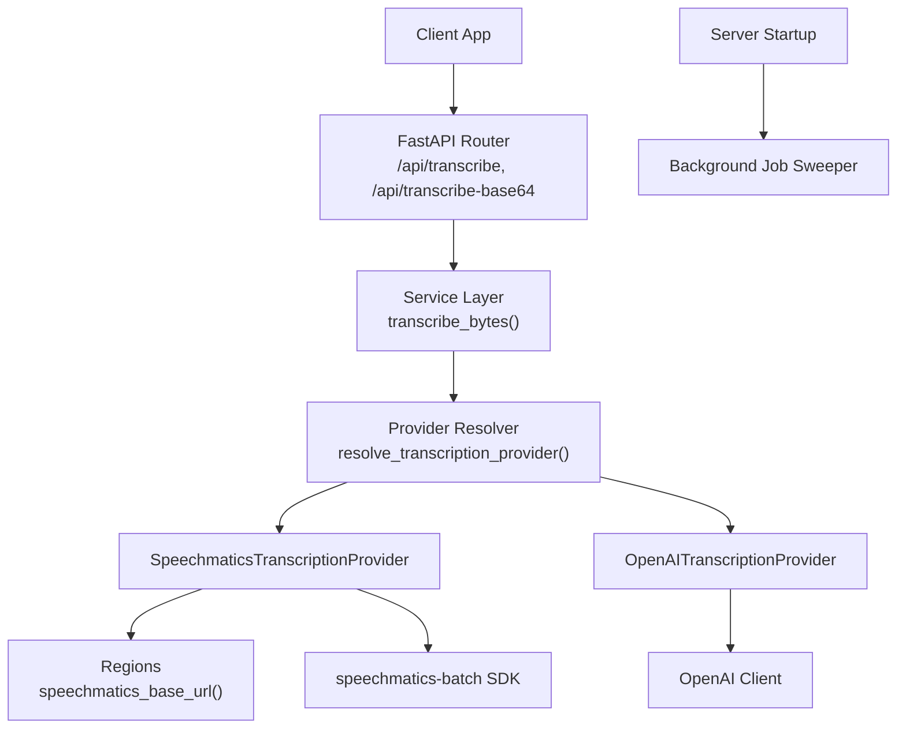
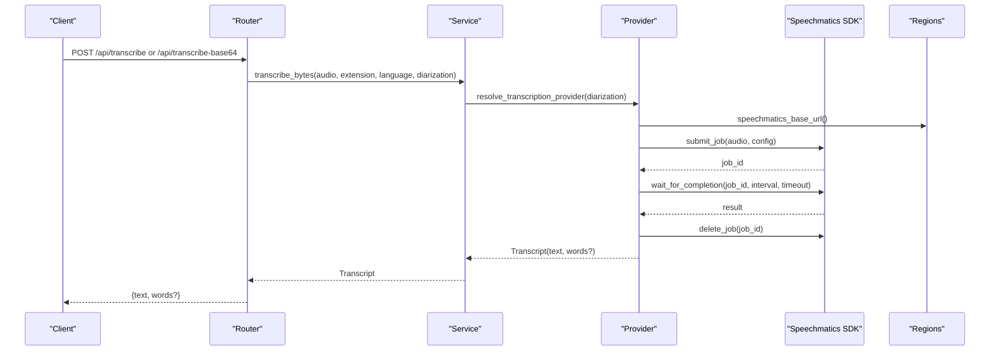
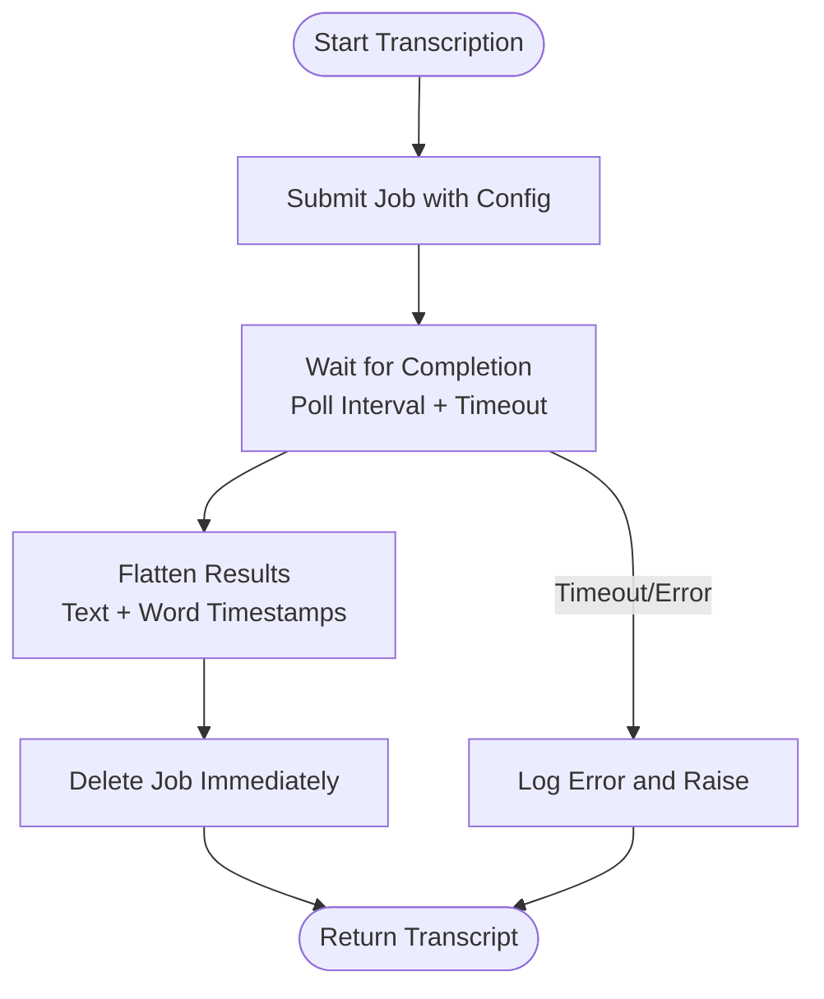
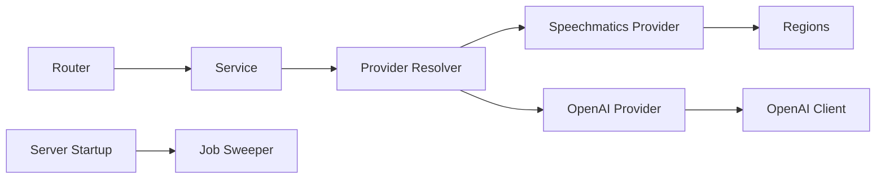

# Speechmatics Integration

<cite>
**Referenced Files in This Document**
- [transcription.py](file://textai/transcription.py)
- [service.py](file://textai/service.py)
- [router.py](file://textai/router.py)
- [schemas.py](file://textai/schemas.py)
- [regions.py](file://core/regions.py)
- [openai_client.py](file://openai_client.py)
- [server.py](file://server.py)
</cite>

## Table of Contents
1. [Introduction](#introduction)
2. [Project Structure](#project-structure)
3. [Core Components](#core-components)
4. [Architecture Overview](#architecture-overview)
5. [Detailed Component Analysis](#detailed-component-analysis)
6. [Dependency Analysis](#dependency-analysis)
7. [Performance Considerations](#performance-considerations)
8. [Troubleshooting Guide](#troubleshooting-guide)
9. [Conclusion](#conclusion)

## Introduction
This document explains the audio transcription integration that supports both OpenAI Whisper and Speechmatics, with a focus on the Speechmatics batch API workflow. It covers authentication setup, supported audio formats, asynchronous job submission, polling for completion, result retrieval, configuration options (language detection, speaker diarization), error handling, and performance optimizations such as retries, backoff, and background cleanup.

## Project Structure
The transcription feature is implemented under textai/ and integrates with core services:
- Router exposes HTTP endpoints for transcription and text processing.
- Service orchestrates provider selection and returns normalized results.
- Transcription module implements provider abstractions and the Speechmatics batch workflow.
- Regions enforces data residency by validating external service endpoints and regions.
- Server initializes startup tasks including a background sweeper for stale jobs.

**Diagram sources**
- [router.py:75-130](file://textai/router.py#L75-L130)
- [service.py:112-130](file://textai/service.py#L112-L130)
- [transcription.py:171-285](file://textai/transcription.py#L171-L285)
- [regions.py:190-191](file://core/regions.py#L190-L191)
- [openai_client.py:15-23](file://openai_client.py#L15-L23)
- [server.py:453-459](file://server.py#L453-L459)

**Section sources**
- [router.py:75-130](file://textai/router.py#L75-L130)
- [service.py:112-130](file://textai/service.py#L112-L130)
- [transcription.py:171-285](file://textai/transcription.py#L171-L285)
- [regions.py:190-191](file://core/regions.py#L190-L191)
- [openai_client.py:15-23](file://openai_client.py#L15-L23)
- [server.py:453-459](file://server.py#L453-L459)

## Core Components
- Provider abstraction: A protocol defines a uniform interface for providers to transcribe audio bytes into a normalized transcript with optional word-level timestamps.
- Providers:
  - OpenAI provider uses Whisper via an async client; it does not support diarization and filters out likely hallucinated segments from silence.
  - Speechmatics provider uses the batch API to submit jobs, wait for completion, flatten results into text plus per-word timestamps, and delete jobs immediately after processing.
- Region enforcement: All outbound endpoints are validated against an Australian region allowlist before use.
- Background maintenance: A background task periodically deletes stale Speechmatics jobs if inline deletion fails.

Key behaviors:
- Language hint is passed to providers when provided; defaults are applied otherwise.
- Diarization is enabled per-call for conversation mode when using Speechmatics.
- Quotas are enforced at the router layer before invoking transcription.

**Section sources**
- [transcription.py:26-63](file://textai/transcription.py#L26-L63)
- [transcription.py:78-132](file://textai/transcription.py#L78-L132)
- [transcription.py:171-285](file://textai/transcription.py#L171-L285)
- [regions.py:144-191](file://core/regions.py#L144-L191)
- [server.py:453-459](file://server.py#L453-L459)

## Architecture Overview
The transcription flow is asynchronous and provider-agnostic. For Speechmatics, the process involves submitting a job, waiting for completion with polling, flattening structured results, and deleting the job to avoid long-term retention.

**Diagram sources**
- [router.py:75-130](file://textai/router.py#L75-L130)
- [service.py:112-130](file://textai/service.py#L112-L130)
- [transcription.py:171-285](file://textai/transcription.py#L171-L285)
- [regions.py:190-191](file://core/regions.py#L190-L191)

## Detailed Component Analysis

### Authentication and Configuration
- Speechmatics API key: Required environment variable for Speechmatics access. If missing, a configuration error is raised.
- Endpoint and region: The base URL for Speechmatics is obtained through a region-checked accessor that validates the endpoint scheme and ensures the region is within the allowed Australian set.
- Provider selection: The active provider is chosen via an environment variable; when diarization is requested and the primary provider cannot provide it, the system can fall back to Speechmatics if configured.

Operational notes:
- The Speechmatics client is created with the API key and the region-validated base URL.
- The OpenAI client similarly uses a region-validated base URL.

**Section sources**
- [transcription.py:148-163](file://textai/transcription.py#L148-L163)
- [transcription.py:198-209](file://textai/transcription.py#L198-L209)
- [transcription.py:294-320](file://textai/transcription.py#L294-L320)
- [regions.py:144-191](file://core/regions.py#L144-L191)
- [openai_client.py:15-23](file://openai_client.py#L15-L23)

### Supported Audio Formats
- File extension normalization: The system normalizes extensions to ensure compatibility with providers. For example, a specific iOS raw format is mapped to a widely supported container.
- Upload paths:
  - Direct file upload endpoint reads the uploaded file and determines the suffix from the filename.
  - Base64 endpoint decodes the payload and uses the provided extension.

Practical implications:
- Ensure the audio container matches what the provider accepts; the system maps known unsupported containers to supported ones where possible.

**Section sources**
- [service.py:102-109](file://textai/service.py#L102-L109)
- [router.py:106-130](file://textai/router.py#L106-L130)
- [router.py:75-103](file://textai/router.py#L75-L103)

### Asynchronous Transcription Workflow (Speechmatics)
- Submission: The provider submits the audio as a job with a transcription configuration that includes language and optional diarization settings.
- Polling: The provider waits for completion with a fixed polling interval and a maximum timeout.
- Result flattening: Structured results are converted into plain text and a list of word timestamps with optional confidence and speaker labels.
- Cleanup: The job is deleted immediately after transcription on all code paths; failures are logged critically and handled by a background reconciliation sweep.

**Diagram sources**
- [transcription.py:182-234](file://textai/transcription.py#L182-L234)
- [transcription.py:253-285](file://textai/transcription.py#L253-L285)

**Section sources**
- [transcription.py:182-234](file://textai/transcription.py#L182-L234)
- [transcription.py:253-285](file://textai/transcription.py#L253-L285)

### Job Status Polling and Result Retrieval
- Polling parameters: A fixed polling interval and a maximum job timeout are used to balance responsiveness and resource usage.
- Result structure: The flattened result provides both human-readable text and per-word timing metadata suitable for tap-to-seek playback. Speaker labels and confidence values are included when available from the provider.

**Section sources**
- [transcription.py:135-145](file://textai/transcription.py#L135-L145)
- [transcription.py:216-221](file://textai/transcription.py#L216-L221)
- [transcription.py:253-285](file://textai/transcription.py#L253-L285)

### Configuration Options
- Language detection/hint: A language hint can be passed to providers; default behavior applies when none is provided.
- Speaker diarization: When diarization is requested, the Speechmatics provider enables speaker diarization with a bounded number of speakers to improve turn attribution.
- Custom vocabulary: Not present in the current implementation; the transcription configuration does not include custom vocabulary fields.

**Section sources**
- [transcription.py:191-202](file://textai/transcription.py#L191-L202)
- [transcription.py:310-320](file://textai/transcription.py#L310-L320)

### Examples of Usage
- Uploading audio files:
  - Use the direct upload endpoint with a file and optional language parameter.
  - Use the base64 endpoint with encoded audio and a file extension.
- Managing transcription jobs:
  - The backend handles job lifecycle internally; clients receive a final response containing text and optional word timestamps.
- Processing results:
  - Clients can use the returned text for display and the word timestamps for interactive playback features like tap-to-seek.

**Section sources**
- [router.py:75-130](file://textai/router.py#L75-L130)
- [service.py:112-130](file://textai/service.py#L112-L130)

### Error Handling
- Network failures and rate limits:
  - Speechmatics job submission retries with exponential backoff and jitter on transient transport errors, specifically handling rate limit responses up to a configured retry budget.
- Invalid audio formats:
  - The router validates base64 decoding and logs errors; invalid payloads return appropriate client errors.
- Quota limits:
  - The router enforces quotas per user and endpoint; exceeding limits returns a throttled response with a retry-after header.
- Provider configuration errors:
  - Missing API keys or unknown providers raise configuration errors that propagate to the caller.

Operational safeguards:
- Immediate job deletion after transcription; if deletion fails, a background reconciler removes stale jobs after a short age threshold.

**Section sources**
- [transcription.py:235-251](file://textai/transcription.py#L235-L251)
- [router.py:28-49](file://textai/router.py#L28-L49)
- [router.py:75-103](file://textai/router.py#L75-L103)
- [transcription.py:148-163](file://textai/transcription.py#L148-L163)
- [transcription.py:323-360](file://textai/transcription.py#L323-L360)

## Dependency Analysis
The transcription subsystem depends on:
- FastAPI router for HTTP endpoints and request validation.
- Service layer for orchestration and provider resolution.
- Provider implementations for actual transcription logic.
- Regions module for endpoint and region validation.
- OpenAI client for Whisper-based transcription path.
- Background tasks for cleanup and maintenance.

**Diagram sources**
- [router.py:75-130](file://textai/router.py#L75-L130)
- [service.py:112-130](file://textai/service.py#L112-L130)
- [transcription.py:171-285](file://textai/transcription.py#L171-L285)
- [regions.py:190-191](file://core/regions.py#L190-L191)
- [openai_client.py:15-23](file://openai_client.py#L15-L23)
- [server.py:453-459](file://server.py#L453-L459)

**Section sources**
- [router.py:75-130](file://textai/router.py#L75-L130)
- [service.py:112-130](file://textai/service.py#L112-L130)
- [transcription.py:171-285](file://textai/transcription.py#L171-L285)
- [regions.py:190-191](file://core/regions.py#L190-L191)
- [openai_client.py:15-23](file://openai_client.py#L15-L23)
- [server.py:453-459](file://server.py#L453-L459)

## Performance Considerations
- Retry and backoff: Speechmatics job submissions implement exponential backoff with jitter to handle transient rate limiting.
- Polling interval and timeout: Fixed polling interval and a maximum timeout balance responsiveness and resource consumption during job completion.
- Immediate job deletion: Jobs are deleted right after transcription to minimize provider-side retention; a background reconciler cleans up any missed deletions.
- Quota enforcement: Requests are throttled before invoking external APIs to reduce unnecessary load.
- Connection management: The provider uses context-managed clients for efficient resource handling.

Recommendations:
- Tune polling intervals and timeouts based on expected job durations and server capacity.
- Monitor quota usage and adjust client retry strategies to respect server-side limits.
- Ensure background sweeper runs reliably to prevent accumulation of stale jobs.

[No sources needed since this section provides general guidance]

## Troubleshooting Guide
Common issues and resolutions:
- Missing Speechmatics API key:
  - Symptom: Configuration error indicating the API key is not set.
  - Resolution: Set the required environment variable for Speechmatics access.
- Unknown transcription provider:
  - Symptom: Configuration error naming an unrecognized provider.
  - Resolution: Configure the correct provider name via the environment variable.
- Rate limiting:
  - Symptom: Temporary failures due to provider rate limits.
  - Resolution: The system retries with backoff; consider reducing request rates or scaling horizontally.
- Invalid base64 audio:
  - Symptom: Client error indicating invalid base64 data.
  - Resolution: Ensure the audio payload is correctly encoded and the extension is valid.
- Stale jobs retained:
  - Symptom: Audio retained at the provider beyond expected duration.
  - Resolution: Verify the background sweeper is running; check logs for critical deletion failures.

Operational checks:
- Validate region configuration at startup to ensure endpoints and regions are correctly declared.
- Monitor logs for transcription errors and quota violations.

**Section sources**
- [transcription.py:148-163](file://textai/transcription.py#L148-L163)
- [transcription.py:294-307](file://textai/transcription.py#L294-L307)
- [transcription.py:235-251](file://textai/transcription.py#L235-L251)
- [router.py:75-103](file://textai/router.py#L75-L103)
- [server.py:338-341](file://server.py#L338-L341)
- [transcription.py:323-360](file://textai/transcription.py#L323-L360)

## Conclusion
The transcription integration provides a robust, provider-agnostic pipeline supporting both OpenAI Whisper and Speechmatics. Speechmatics integration leverages an asynchronous batch workflow with careful attention to retention, reliability, and compliance. The system enforces regional data residency, manages quotas, and includes background maintenance to ensure operational stability. Clients interact via simple HTTP endpoints and receive normalized results suitable for both reading and interactive playback.

[No sources needed since this section summarizes without analyzing specific files]