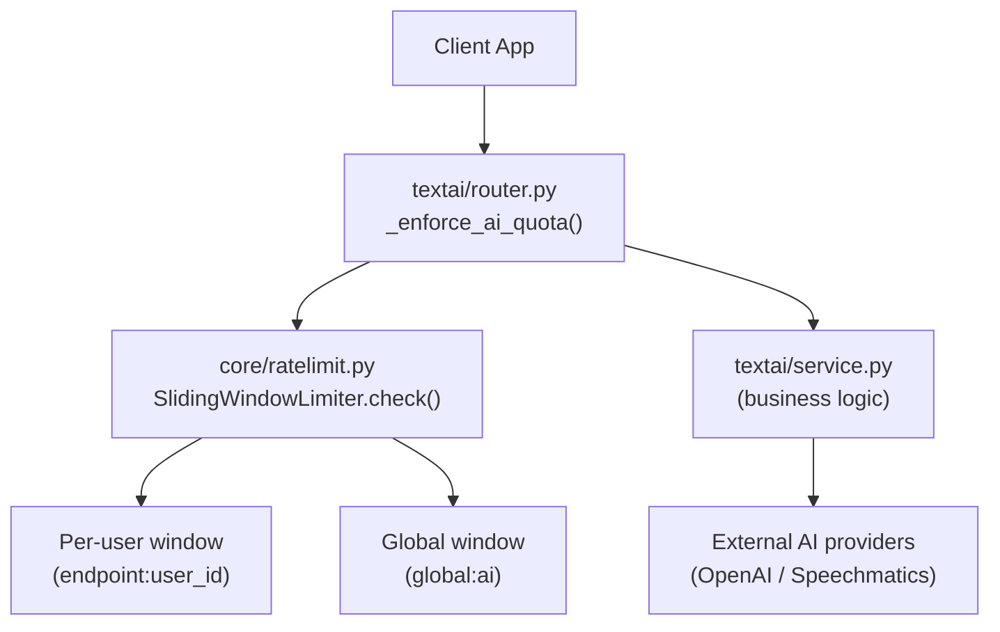
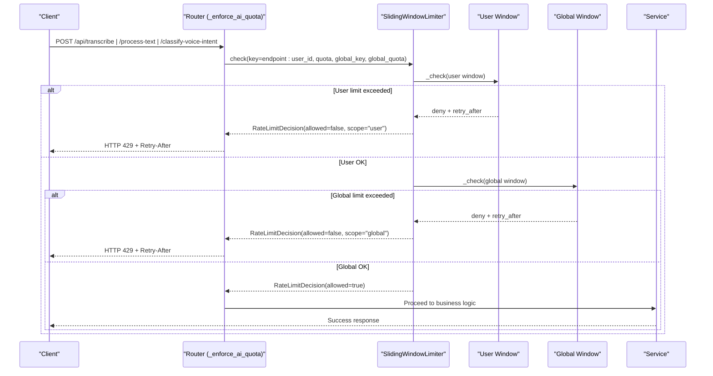
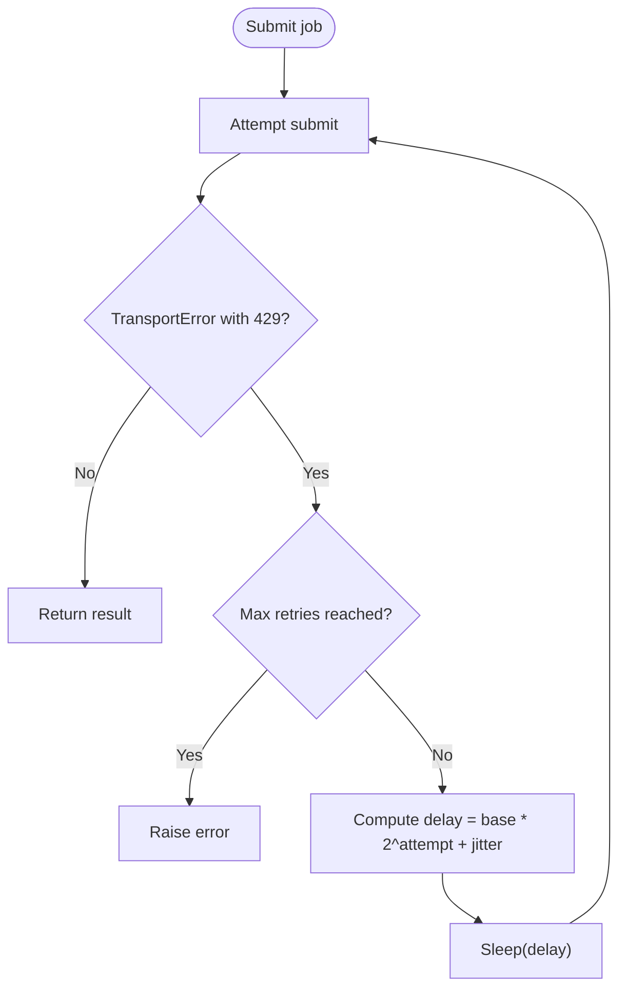
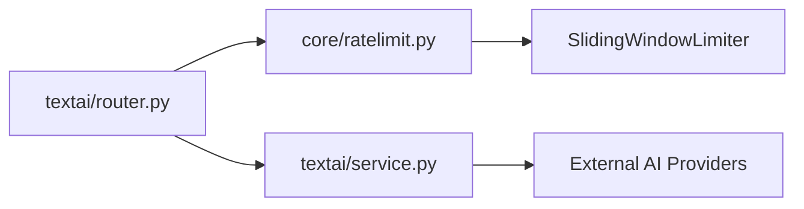

# Quota Management & Rate Limiting

<cite>
**Referenced Files in This Document**
- [core/ratelimit.py](file://core/ratelimit.py)
- [textai/router.py](file://textai/router.py)
- [textai/transcription.py](file://textai/transcription.py)
</cite>

## Table of Contents
1. [Introduction](#introduction)
2. [Project Structure](#project-structure)
3. [Core Components](#core-components)
4. [Architecture Overview](#architecture-overview)
5. [Detailed Component Analysis](#detailed-component-analysis)
6. [Dependency Analysis](#dependency-analysis)
7. [Performance Considerations](#performance-considerations)
8. [Troubleshooting Guide](#troubleshooting-guide)
9. [Conclusion](#conclusion)
10. [Appendices](#appendices)

## Introduction
This document explains the AI service quota management and rate limiting system that protects expensive, per-call AI endpoints (transcription, text processing, and voice intent classification). It covers the three-tier quota model, how the middleware enforces limits before any costly API call is made, how global vs user-specific limits interact, and how clients should handle HTTP 429 responses with Retry-After using exponential backoff. It also provides best practices for cost control, request optimization, scaling strategies, and troubleshooting common quota-related issues.

## Project Structure
The quota system spans two primary areas:
- A framework-agnostic sliding-window limiter and quota definitions in core/ratelimit.py
- Router-level enforcement in textai/router.py that gates transcription, text processing, and voice intent classification endpoints

**Diagram sources**
- [textai/router.py:28-49](file://textai/router.py#L28-L49)
- [core/ratelimit.py:41-88](file://core/ratelimit.py#L41-L88)
- [core/ratelimit.py:115-123](file://core/ratelimit.py#L115-L123)

**Section sources**
- [core/ratelimit.py:1-123](file://core/ratelimit.py#L1-L123)
- [textai/router.py:1-163](file://textai/router.py#L1-L163)

## Core Components
- Three-tier quotas:
  - Transcription limit: TRANSCRIBE_QUOTA
  - Text processing limit: TEXT_PROCESS_QUOTA
  - Voice intent classification limit: VOICE_INTENT_QUOTA
- Global shared quota: GLOBAL_AI_QUOTA to protect the single OpenAI key across all users
- Sliding-window limiter: tracks recent requests per user and globally, computes precise retry timing
- Middleware function: _enforce_ai_quota raises HTTP 429 with Retry-After when limits are exceeded

Key behaviors:
- Checks occur BEFORE any external AI call, preventing unnecessary costs
- Per-endpoint scoping allows a user blocked on transcription to still use other endpoints like text processing
- Global quota acts as a backstop against aggregate traffic spikes

**Section sources**
- [core/ratelimit.py:25-38](file://core/ratelimit.py#L25-L38)
- [core/ratelimit.py:41-88](file://core/ratelimit.py#L41-L88)
- [core/ratelimit.py:98-123](file://core/ratelimit.py#L98-L123)
- [textai/router.py:28-49](file://textai/router.py#L28-L49)

## Architecture Overview
The enforcement flow ensures that only allowed requests proceed to expensive operations. The middleware extracts the user identity, checks both per-user and global quotas, and returns either permission or an HTTP 429 with a calculated Retry-After value.

**Diagram sources**
- [textai/router.py:28-49](file://textai/router.py#L28-L49)
- [core/ratelimit.py:55-88](file://core/ratelimit.py#L55-L88)
- [core/ratelimit.py:115-123](file://core/ratelimit.py#L115-L123)

## Detailed Component Analysis

### Three-Tier Quota System
- TRANSCRIBE_QUOTA: Limits transcription calls per user per minute
- TEXT_PROCESS_QUOTA: Limits text processing actions per user per minute
- VOICE_INTENT_QUOTA: Limits voice intent classification per user per minute
- GLOBAL_AI_QUOTA: Shared cap across all users to protect the server’s OpenAI key

These quotas are enforced per endpoint so that hitting one ceiling does not block unrelated functionality.

**Section sources**
- [core/ratelimit.py:98-112](file://core/ratelimit.py#L98-L112)
- [textai/router.py:75-163](file://textai/router.py#L75-L163)

### _enforce_ai_quota Middleware
Responsibilities:
- Extracts user ID from current_user context
- Calls check_ai_quota to evaluate per-user and global windows
- Returns early if allowed; otherwise raises HTTP 429 with Retry-After header
- Logs quota exceedance with scope and endpoint for observability

Behavioral notes:
- Prevents any downstream AI calls when throttled, saving costs
- Provides precise Retry-After based on when the oldest event in the window expires

**Section sources**
- [textai/router.py:28-49](file://textai/router.py#L28-L49)

### SlidingWindowLimiter and Quota Data Structures
- Quota: immutable configuration of limit and window_seconds
- RateLimitDecision: carries allowed flag, retry_after seconds, and scope ("user" or "global")
- SlidingWindowLimiter:
  - Maintains per-key deques of timestamps
  - Evicts events outside the window
  - Computes retry_after from the oldest event’s expiry
  - Uses a single lock for thread safety
  - Supports optional global window to guard shared resources

Complexity:
- Each check performs O(k) eviction where k is the number of expired events in the deque; typically small due to bounded windows
- Memory usage grows with the number of unique keys and their recent event counts

**Section sources**
- [core/ratelimit.py:25-38](file://core/ratelimit.py#L25-L38)
- [core/ratelimit.py:41-93](file://core/ratelimit.py#L41-L93)

### Endpoint Integration
Each AI endpoint invokes _enforce_ai_quota with its specific quota before calling service logic:
- /api/transcribe-base64 and /api/transcribe use TRANSCRIBE_QUOTA
- /api/process-text uses TEXT_PROCESS_QUOTA
- /api/classify-voice-intent uses VOICE_INTENT_QUOTA

This ensures consistent protection across all expensive operations.

**Section sources**
- [textai/router.py:75-163](file://textai/router.py#L75-L163)

### External Provider Rate Limit Handling
Transcription includes provider-side retry logic with exponential backoff for transient 429 errors from upstream services (e.g., Speechmatics). This complements server-side quotas by handling provider throttling gracefully.

**Diagram sources**
- [textai/transcription.py:235-251](file://textai/transcription.py#L235-L251)

**Section sources**
- [textai/transcription.py:235-251](file://textai/transcription.py#L235-L251)

## Dependency Analysis
- textai/router.py depends on core.ratelimit for quota definitions and enforcement
- core.ratelimit is framework-agnostic and can be reused elsewhere
- SlidingWindowLimiter encapsulates state and synchronization, isolating complexity from routers
- Endpoints depend on service modules for business logic but gate them via middleware

**Diagram sources**
- [textai/router.py:8-16](file://textai/router.py#L8-L16)
- [core/ratelimit.py:41-93](file://core/ratelimit.py#L41-L93)

**Section sources**
- [textai/router.py:8-16](file://textai/router.py#L8-L16)
- [core/ratelimit.py:41-93](file://core/ratelimit.py#L41-L93)

## Performance Considerations
- In-process state: The limiter stores state in memory per process; it resets on deploy and is not shared across replicas. With N replicas, effective limits scale linearly. For horizontal scaling, move to a shared store like Redis.
- Lock contention: A single mutex guards all windows; contention is minimal relative to network latency of AI calls.
- Event eviction: Deque-based sliding windows efficiently drop old events; ensure windows remain bounded to avoid unbounded growth.
- Cost prevention: Enforcing quotas before calling providers avoids unnecessary spend during throttling.

[No sources needed since this section provides general guidance]

## Troubleshooting Guide
Common issues and diagnostics:
- Frequent HTTP 429 responses:
  - Verify client respects Retry-After and implements exponential backoff
  - Inspect logs for “AI quota exceeded” messages to identify scope (user vs global) and endpoint
- Unexpected global throttling:
  - Indicates aggregate traffic exceeding GLOBAL_AI_QUOTA; consider reducing burstiness or increasing global limit cautiously
- Per-user throttling:
  - Review client behavior for loops or excessive retries; adjust UI to inform users to wait
- Scaling anomalies:
  - If running multiple replicas, remember limits multiply by replica count; migrate to distributed rate limiting if needed

Operational tips:
- Monitor quota exceedance logs and metrics around the router and limiter
- Track Retry-After distribution to tune backoff strategies
- Use test hooks to reset limiter state during development/testing

**Section sources**
- [textai/router.py:28-49](file://textai/router.py#L28-L49)
- [core/ratelimit.py:13-16](file://core/ratelimit.py#L13-L16)

## Conclusion
The AI quota system combines per-user and global sliding-window limits to protect expensive endpoints and shared provider keys. The middleware enforces these rules before any costly calls, returning HTTP 429 with precise Retry-After values. Clients should implement robust retry logic with exponential backoff and jitter. For high-volume deployments, consider migrating to a distributed rate limiter to maintain accurate global constraints across replicas.

[No sources needed since this section summarizes without analyzing specific files]

## Appendices

### Implementing Client-Side Retry Logic with Exponential Backoff
Recommended approach:
- On receiving HTTP 429, read the Retry-After header and wait at least that many seconds
- Apply exponential backoff with jitter to reduce thundering herds
- Cap maximum retries and total wait time to avoid indefinite loops
- Distinguish between user-scoped and global-scoped limits in logging and alerting

[No sources needed since this section provides general guidance]

### Monitoring Quota Usage
- Log each quota decision with scope, endpoint, and timestamp
- Emit metrics for:
  - Allowed vs denied counts per endpoint
  - Average and p95 Retry-After values
  - Global quota utilization over time
- Set alerts for sustained global throttling or sudden spikes

[No sources needed since this section provides general guidance]

### Best Practices for Managing API Costs and Optimizing Requests
- Batch requests where possible to reduce per-call overhead
- Cache results for repeated operations (e.g., identical text processing)
- Avoid redundant retries; respect Retry-After strictly
- Instrument and review client retry policies regularly
- Tune per-user quotas to match realistic usage patterns while preventing abuse

[No sources needed since this section provides general guidance]

### Scaling Strategies for High-Volume Applications
- Move from in-process to distributed rate limiting (e.g., Redis-backed counters)
- Shard keys by region or tenant if multi-tenant isolation is required
- Add circuit breakers around external provider calls to fail fast under load
- Use autoscaling with careful capacity planning to avoid outgrowing per-replica limits

[No sources needed since this section provides general guidance]