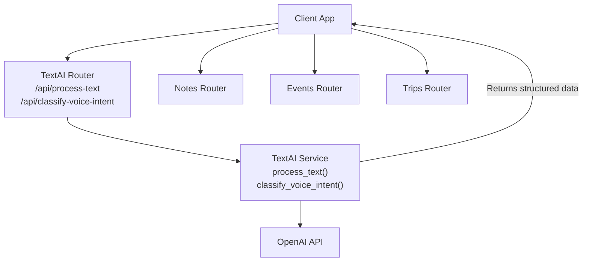
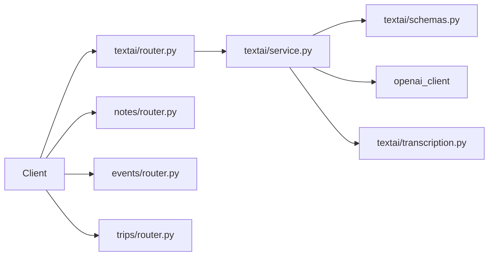

# Note Classification

<cite>
**Referenced Files in This Document**
- [textai/router.py](file://textai/router.py)
- [textai/schemas.py](file://textai/schemas.py)
- [textai/service.py](file://textai/service.py)
- [textai/transcription.py](file://textai/transcription.py)
- [notes/router.py](file://notes/router.py)
- [notes/schemas.py](file://notes/schemas.py)
- [events/router.py](file://events/router.py)
- [trips/router.py](file://trips/router.py)
</cite>

## Table of Contents
1. [Introduction](#introduction)
2. [Project Structure](#project-structure)
3. [Core Components](#core-components)
4. [Architecture Overview](#architecture-overview)
5. [Detailed Component Analysis](#detailed-component-analysis)
6. [Dependency Analysis](#dependency-analysis)
7. [Performance Considerations](#performance-considerations)
8. [Troubleshooting Guide](#troubleshooting-guide)
9. [Conclusion](#conclusion)
10. [Appendices](#appendices)

## Introduction
This document explains the note classification feature powered by the detect-and-restructure action (implemented as smart_format). It covers how the system identifies note types, restructures content into structured HTML, and integrates with calendar events and trip planning via voice intent classification. You will find:
- The TextProcessRequest schema for action-based text processing
- Supported note types and structured output formats
- Classification logic, confidence handling, and fallbacks
- Examples for classifying voice memos, event descriptions, travel plans, and mixed content
- Integration points with events and trips modules

## Project Structure
The note classification feature spans the textai module and integrates with notes, events, and trips modules. Key responsibilities:
- Router exposes endpoints for text processing and voice intent classification
- Service implements AI-driven classification and formatting using OpenAI
- Schemas define request/response contracts and validation rules
- Transcription provides audio-to-text capabilities used upstream
- Notes, Events, and Trips routers provide storage and lifecycle APIs that downstream callers use after user confirmation



**Diagram sources**
- [textai/router.py:136-148](file://textai/router.py#L136-L148)
- [textai/service.py:133-232](file://textai/service.py#L133-L232)
- [textai/service.py:259-314](file://textai/service.py#L259-L314)
- [notes/router.py:17-28](file://notes/router.py#L17-L28)
- [events/router.py:23-34](file://events/router.py#L23-L34)
- [trips/router.py:23-34](file://trips/router.py#L23-L34)

**Section sources**
- [textai/router.py:136-148](file://textai/router.py#L136-L148)
- [textai/service.py:133-232](file://textai/service.py#L133-L232)
- [textai/service.py:259-314](file://textai/service.py#L259-L314)
- [notes/router.py:17-28](file://notes/router.py#L17-L28)
- [events/router.py:23-34](file://events/router.py#L23-L34)
- [trips/router.py:23-34](file://trips/router.py#L23-L34)

## Core Components
- Text processing endpoint: POST /api/process-text accepts a text and an action. For smart_format, it classifies the note type and returns structured HTML.
- Voice intent classification endpoint: POST /api/classify-voice-intent accepts a transcript and context to classify dictation vs scheduling intents and extract structured events or itineraries.
- Schemas enforce allowed actions and note types, and validate extracted events and recurrences.
- Service orchestrates calls to OpenAI, parses JSON responses, applies fallbacks, and returns typed responses.

Supported actions:
- organize: reorganize text without classification
- summarize: concise summary without classification
- smart_format: classify note type and return structured HTML

Supported note types for smart_format:
- recipe
- checklist
- meeting_notes
- general (fallback for unclear or unrecognized types)

Voice intent classification supports:
- note: plain dictation
- single_event: one scheduled event
- multiple_events: two or more unrelated events
- itinerary: grouped events forming a trip

**Section sources**
- [textai/schemas.py:20-41](file://textai/schemas.py#L20-L41)
- [textai/schemas.py:44-57](file://textai/schemas.py#L44-L57)
- [textai/service.py:133-232](file://textai/service.py#L133-L232)
- [textai/service.py:259-314](file://textai/service.py#L259-L314)

## Architecture Overview
The detect-and-restructure flow uses prompt templates to instruct the model to classify and format content. For voice inputs, a separate classifier extracts scheduling intent and structured events.

```mermaid
sequenceDiagram
participant C as "Client"
participant R as "TextAI Router"
participant S as "TextAI Service"
participant O as "OpenAI"
C->>R : POST /api/process-text {text, action="smart_format"}
R->>S : process_text(text, "smart_format")
S->>O : chat.completions(model=gpt-4o-mini, json_object)
O-->>S : {"note_type", "html"}
S->>S : Validate note_type; fallback to "general" if unknown
S-->>R : TextProcessResponse{text, note_type}
R-->>C : 200 OK
C->>R : POST /api/classify-voice-intent {transcript, reference_date, timezone}
R->>S : classify_voice_intent(transcript, reference_date, timezone)
S->>O : chat.completions(model=gpt-4o-mini, json_object)
O-->>S : {"intent", "trip_name?", "events[]"}
S->>S : Validate events; drop unusable entries; fallbacks
S-->>R : VoiceIntentClassifyResponse{intent, trip_name?, events[]}
R-->>C : 200 OK
```

**Diagram sources**
- [textai/router.py:136-148](file://textai/router.py#L136-L148)
- [textai/router.py:151-162](file://textai/router.py#L151-L162)
- [textai/service.py:195-229](file://textai/service.py#L195-L229)
- [textai/service.py:259-314](file://textai/service.py#L259-L314)

## Detailed Component Analysis

### Smart Format (detect-and-restructure) Flow
- Input: TextProcessRequest with text and action="smart_format"
- Processing:
  - Build a system message and prompt template instructing the model to classify into one of the supported note types and return clean HTML tailored to that type
  - Call OpenAI with JSON response mode
  - Parse JSON; if note_type is not recognized, degrade to "general" while preserving the generated HTML
  - Ensure HTML is present; otherwise raise an empty response error
- Output: TextProcessResponse with structured HTML and detected note_type

Classification logic highlights:
- Strictly limited set of note types; unknown types fall back to "general"
- HTML structure varies by type:
  - recipe: optional title, ingredients list, steps list
  - checklist: unordered list with checkbox items
  - meeting_notes: headings like Attendees, Discussion, Decisions, Action Items with lists
  - general: readable paragraphs/bullets with grammar fixes

Confidence and fallbacks:
- No explicit confidence score is returned for smart_format; uncertainty is handled by falling back to "general" when the model’s note_type is not recognized
- Empty HTML triggers an error so clients can handle missing structured content

Integration examples:
- Voice memo transcription followed by smart_format to produce structured note content
- Event description text to generate meeting_notes or general formatted content
- Travel plan text to produce a checklist or general organized content

**Section sources**
- [textai/service.py:25-47](file://textai/service.py#L25-L47)
- [textai/service.py:195-229](file://textai/service.py#L195-L229)
- [textai/schemas.py:20-41](file://textai/schemas.py#L20-L41)

#### Smart Format Class Diagram
```mermaid
classDiagram
class TextProcessRequest {
+string text
+string action
}
class TextProcessResponse {
+string text
+NoteType note_type
}
class NoteType {
<<enum>>
"recipe"
"checklist"
"meeting_notes"
"general"
}
TextProcessResponse --> NoteType : "optional"
```

**Diagram sources**
- [textai/schemas.py:20-41](file://textai/schemas.py#L20-L41)

### Voice Intent Classification Flow
- Input: VoiceIntentClassifyRequest with transcript, reference_date, timezone
- Processing:
  - Prompt the model to determine intent among note, single_event, multiple_events, itinerary
  - Extract structured events with fields such as title, start_time, end_time, location, recurrence, confidence
  - Validate each event; drop unusable entries rather than failing the whole request
  - If intent is itinerary but trip_name is missing, assign a default "New Trip"
  - If no usable events are extracted for non-note intents, raise an empty response error
- Output: VoiceIntentClassifyResponse with intent, optional trip_name, and validated events array

Confidence scoring:
- Each event includes a confidence field ("high" or "low") indicating clarity of time extraction
- Unknown confidence values degrade to "low" to ensure UI prompts for confirmation

Fallback mechanisms:
- Unrecognized intent falls back to "note" (plain dictation)
- Malformed recurrence is dropped; event still created as one-off
- Unusable events are skipped; siblings remain valid

Integration with calendar and trips:
- single_event/multiple_events: caller creates events via events router
- itinerary: caller creates a trip via trips router and links events to it

**Section sources**
- [textai/service.py:49-87](file://textai/service.py#L49-L87)
- [textai/service.py:235-314](file://textai/service.py#L235-L314)
- [textai/schemas.py:44-142](file://textai/schemas.py#L44-L142)

#### Voice Intent Sequence Diagram
```mermaid
sequenceDiagram
participant C as "Client"
participant R as "TextAI Router"
participant S as "TextAI Service"
participant O as "OpenAI"
C->>R : POST /api/classify-voice-intent {transcript, reference_date, timezone}
R->>S : classify_voice_intent(...)
S->>O : chat.completions(model=gpt-4o-mini, json_object)
O-->>S : {"intent","trip_name?","events[]"}
S->>S : Validate events; drop bad entries
alt intent == "note"
S-->>R : {intent : "note", events : []}
else intent != "note"
S->>S : Ensure at least one usable event
S-->>R : {intent, trip_name?, events[]}
end
R-->>C : 200 OK
```

**Diagram sources**
- [textai/router.py:151-162](file://textai/router.py#L151-L162)
- [textai/service.py:259-314](file://textai/service.py#L259-L314)

### Schema Definitions

#### TextProcessRequest and Response
- TextProcessRequest:
  - text: input string
  - action: string; must be one of "organize", "summarize", "smart_format"
- TextProcessResponse:
  - text: processed or structured content
  - note_type: optional enum for smart_format results

Supported note types:
- recipe
- checklist
- meeting_notes
- general

**Section sources**
- [textai/schemas.py:20-41](file://textai/schemas.py#L20-L41)

#### VoiceIntentClassifyRequest and Response
- VoiceIntentClassifyRequest:
  - transcript: string
  - reference_date: ISO date string
  - timezone: IANA timezone name
- VoiceIntentClassifyResponse:
  - intent: one of "note", "single_event", "multiple_events", "itinerary"
  - trip_name: optional string for itinerary
  - events: list of VoiceEventOut

VoiceEventOut fields:
- title: required, non-empty
- start_time: required, non-empty
- end_time: optional; blank treated as None
- location: optional string
- recurrence: optional RecurrenceOut
- confidence: "high" or "low"; unknown degrades to "low"

RecurrenceOut fields:
- freq: "daily", "weekly", "monthly", "yearly"
- byweekday: optional list of integers 0-6 (Sunday=0)
- until: optional ISO date string

**Section sources**
- [textai/schemas.py:44-142](file://textai/schemas.py#L44-L142)

### Endpoints and Routing
- POST /api/process-text:
  - Enforces AI quota
  - Calls service.process_text
  - Returns TextProcessResponse
- POST /api/classify-voice-intent:
  - Enforces AI quota
  - Calls service.classify_voice_intent
  - Returns VoiceIntentClassifyResponse

Error handling:
- Invalid action returns 400
- AI empty or malformed responses return 500
- Quota exceeded returns 429 with Retry-After header

**Section sources**
- [textai/router.py:28-49](file://textai/router.py#L28-L49)
- [textai/router.py:136-148](file://textai/router.py#L136-L148)
- [textai/router.py:151-162](file://textai/router.py#L151-L162)

### Integration with Notes, Events, and Trips
- Notes:
  - After smart_format, clients may store structured HTML in note content
  - Notes support tags, images, attachments, and E2EE metadata
- Events:
  - For single_event or multiple_events intents, clients create events via events router
  - Events support recurrence and other scheduling fields
- Trips:
  - For itinerary intent, clients create a trip via trips router and link events to it

These integrations occur on the client side after receiving structured outputs from textai endpoints.

**Section sources**
- [notes/router.py:17-28](file://notes/router.py#L17-L28)
- [notes/schemas.py:33-52](file://notes/schemas.py#L33-L52)
- [events/router.py:23-34](file://events/router.py#L23-L34)
- [trips/router.py:23-34](file://trips/router.py#L23-L34)

## Dependency Analysis
- Router depends on service for business logic and schemas for request/response models
- Service depends on OpenAI client and uses prompt templates to drive classification and extraction
- Transcription module provides audio-to-text capability used before classification
- Notes, Events, and Trips routers are independent storage layers invoked by clients based on classification results



**Diagram sources**
- [textai/router.py:136-162](file://textai/router.py#L136-L162)
- [textai/service.py:133-314](file://textai/service.py#L133-L314)
- [textai/transcription.py:112-130](file://textai/transcription.py#L112-L130)
- [notes/router.py:17-28](file://notes/router.py#L17-L28)
- [events/router.py:23-34](file://events/router.py#L23-L34)
- [trips/router.py:23-34](file://trips/router.py#L23-L34)

**Section sources**
- [textai/router.py:136-162](file://textai/router.py#L136-L162)
- [textai/service.py:133-314](file://textai/service.py#L133-L314)
- [textai/transcription.py:112-130](file://textai/transcription.py#L112-L130)
- [notes/router.py:17-28](file://notes/router.py#L17-L28)
- [events/router.py:23-34](file://events/router.py#L23-L34)
- [trips/router.py:23-34](file://trips/router.py#L23-L34)

## Performance Considerations
- AI quotas: Requests are rate-limited per user and endpoint; exceeding quotas returns 429 with Retry-After
- Model selection: Uses gpt-4o-mini for cost and latency balance
- JSON response mode reduces parsing overhead and improves reliability
- Event validation is per-entry to avoid cascading failures across large itineraries
- Transcription providers include retry/backoff and job cleanup to maintain stability

[No sources needed since this section provides general guidance]

## Troubleshooting Guide
Common issues and resolutions:
- Invalid action: Ensure action is one of "organize", "summarize", "smart_format"
- Empty AI response: Indicates model did not return content; retry or adjust input
- Malformed JSON: Check network conditions and retry; server returns 500 for parse errors
- Unrecognized note_type: Falls back to "general"; verify input content clarity
- Unrecognized intent: Falls back to "note"; consider refining transcript or context
- Missing trip_name for itinerary: Server assigns "New Trip"; update in client if needed
- Malformed recurrence: Dropped; event created as one-off; correct recurrence in client if necessary

**Section sources**
- [textai/router.py:136-148](file://textai/router.py#L136-L148)
- [textai/router.py:151-162](file://textai/router.py#L151-L162)
- [textai/service.py:213-229](file://textai/service.py#L213-L229)
- [textai/service.py:297-314](file://textai/service.py#L297-L314)

## Conclusion
The note classification feature provides robust, AI-driven detection and restructuring of note content through smart_format, along with voice intent classification for scheduling needs. It enforces strict schemas, handles uncertainties gracefully with fallbacks, and integrates cleanly with notes, events, and trips workflows. Clients should leverage structured outputs to enhance user experience while maintaining flexibility for corrections and confirmations.

[No sources needed since this section summarizes without analyzing specific files]

## Appendices

### Example Scenarios

- Voice memo (dictation):
  - Use classify-voice-intent; expect intent "note" and empty events
  - Store raw transcript in note content

- Event description (meeting notes):
  - Use process-text with action "smart_format"
  - Expect note_type "meeting_notes" and structured HTML with headings and lists

- Travel plan (itinerary):
  - Use classify-voice-intent; expect intent "itinerary" with multiple events and trip_name
  - Create a trip and link events via trips and events routers

- Mixed content:
  - Use process-text with action "smart_format"
  - Expect note_type "general" with organized paragraphs/bullets when content does not fit specific categories

[No sources needed since this section provides conceptual examples]