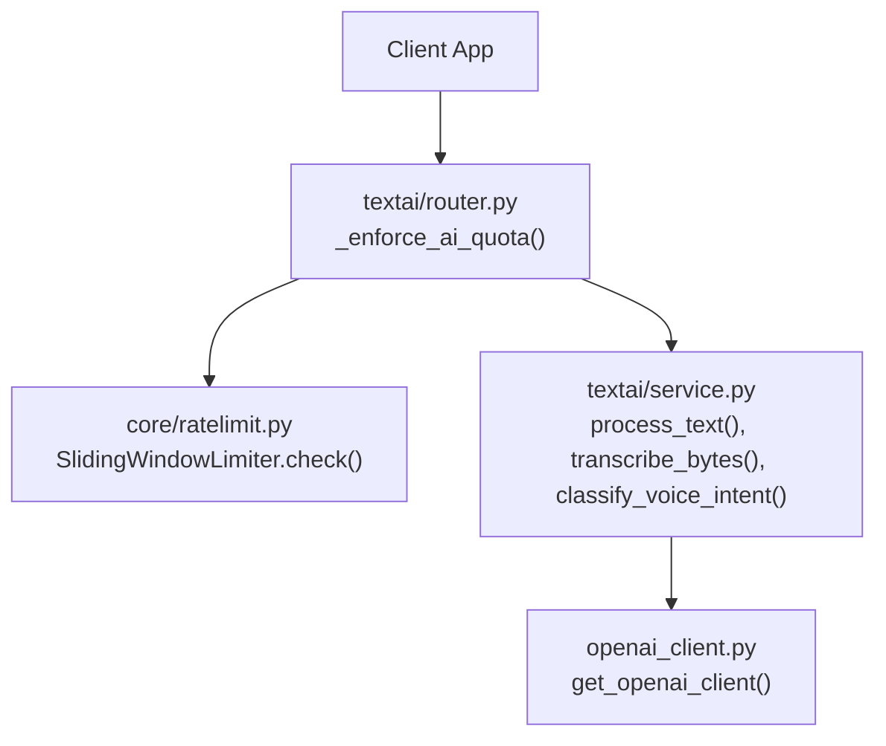
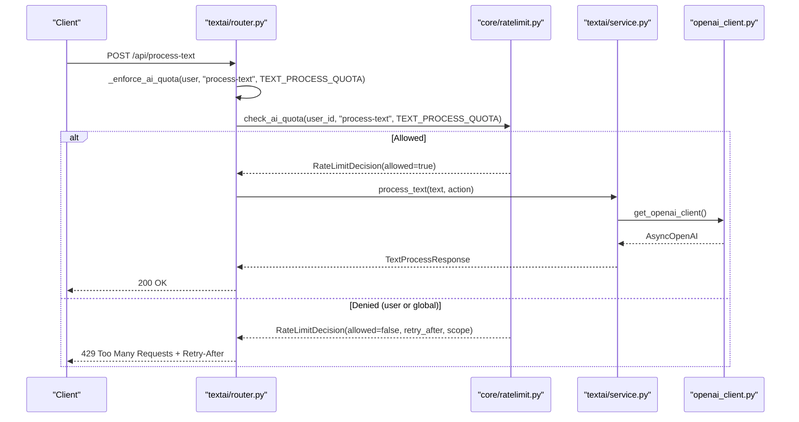
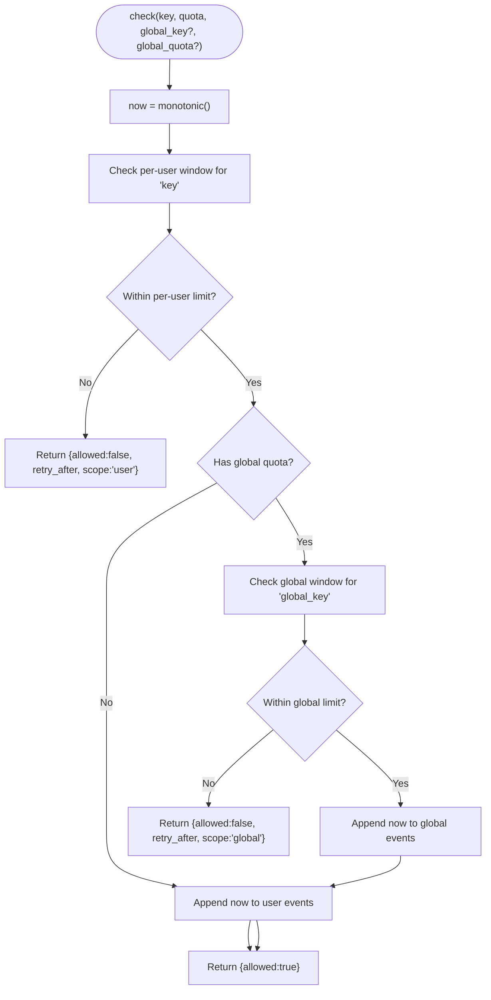
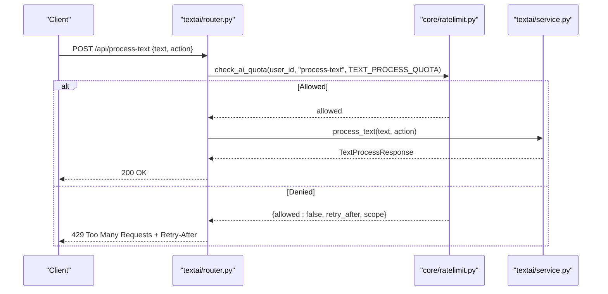
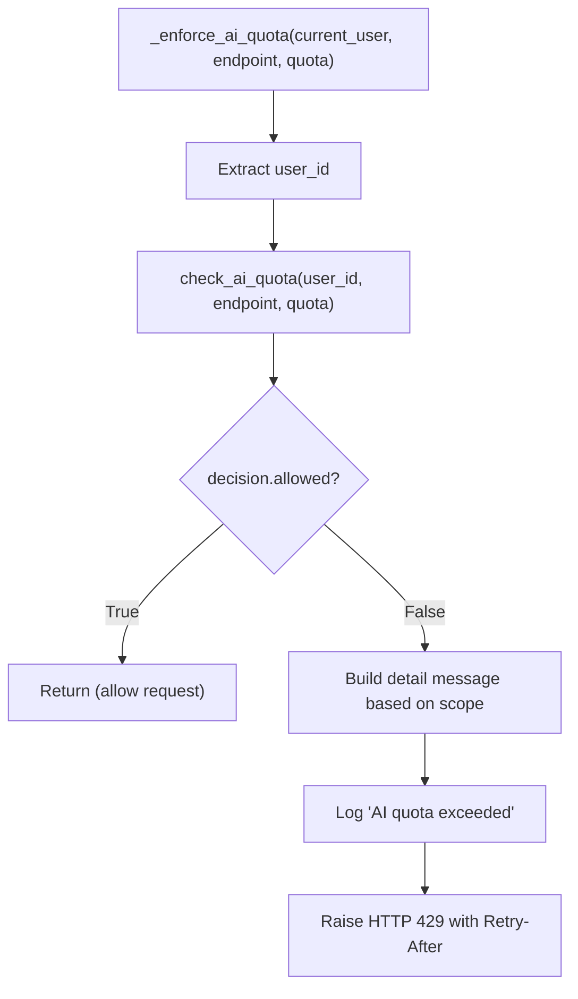
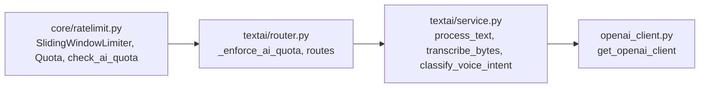

# Quota Management

<cite>
**Referenced Files in This Document**
- [core/ratelimit.py](file://core/ratelimit.py)
- [textai/router.py](file://textai/router.py)
- [textai/service.py](file://textai/service.py)
- [openai_client.py](file://openai_client.py)
- [tests/test_nueco_apis.py](file://tests/test_nueco_apis.py)
</cite>

## Table of Contents
1. [Introduction](#introduction)
2. [Project Structure](#project-structure)
3. [Core Components](#core-components)
4. [Architecture Overview](#architecture-overview)
5. [Detailed Component Analysis](#detailed-component-analysis)
6. [Dependency Analysis](#dependency-analysis)
7. [Performance Considerations](#performance-considerations)
8. [Troubleshooting Guide](#troubleshooting-guide)
9. [Conclusion](#conclusion)
10. [Appendices](#appendices)

## Introduction
This document explains the quota management system for AI-powered text processing services, focusing on per-user rate limiting and global throttling to protect a shared OpenAI key. It details how TEXT_PROCESS_QUOTA is enforced, how _enforce_ai_quota prevents abuse and manages resource allocation, and what clients should do when they receive 429 responses with Retry-After headers. It also covers monitoring and logging patterns and provides best practices for client-side retry strategies and request optimization.

## Project Structure
The quota system spans two layers:
- Rate-limiting core: sliding-window limiter and quotas in core/ratelimit.py
- API enforcement: router-level checks in textai/router.py that gate calls to textai/service.py before any external AI call

**Diagram sources**
- [textai/router.py:28-49](file://textai/router.py#L28-L49)
- [core/ratelimit.py:41-88](file://core/ratelimit.py#L41-L88)
- [textai/service.py:133-232](file://textai/service.py#L133-L232)
- [openai_client.py:15-23](file://openai_client.py#L15-L23)

**Section sources**
- [core/ratelimit.py:1-123](file://core/ratelimit.py#L1-L123)
- [textai/router.py:1-163](file://textai/router.py#L1-L163)

## Core Components
- SlidingWindowLimiter: In-process, thread-safe sliding window tracker using deques. Enforces both per-user and global limits atomically.
- Quota: Immutable configuration of limit and window_seconds.
- RateLimitDecision: Decision object carrying allowed flag, retry_after seconds, and scope (user or global).
- check_ai_quota: Convenience function that applies per-endpoint + per-user limits and a global backstop.
- _enforce_ai_quota: Router helper that raises HTTP 429 with Retry-After when limits are exceeded, before any AI call.

Key quotas:
- TRANSCRIBE_QUOTA: 10 requests per user per 60s
- VOICE_INTENT_QUOTA: 20 requests per user per 60s
- TEXT_PROCESS_QUOTA: 15 requests per user per 60s
- GLOBAL_AI_QUOTA: 120 requests across all users per 60s

**Section sources**
- [core/ratelimit.py:25-38](file://core/ratelimit.py#L25-L38)
- [core/ratelimit.py:41-88](file://core/ratelimit.py#L41-L88)
- [core/ratelimit.py:96-123](file://core/ratelimit.py#L96-L123)
- [textai/router.py:28-49](file://textai/router.py#L28-L49)

## Architecture Overview
The enforcement flow ensures no cost is incurred if a request is denied:
1. The router calls _enforce_ai_quota with the current user, endpoint name, and appropriate quota.
2. _enforce_ai_quota invokes check_ai_quota to evaluate per-user and global windows.
3. If allowed, the router proceeds to service methods that call get_openai_client and make external AI calls.
4. If denied, the router returns HTTP 429 with a Retry-After header; no AI call is made.

**Diagram sources**
- [textai/router.py:28-49](file://textai/router.py#L28-L49)
- [textai/router.py:136-148](file://textai/router.py#L136-L148)
- [core/ratelimit.py:66-88](file://core/ratelimit.py#L66-L88)
- [textai/service.py:133-232](file://textai/service.py#L133-L232)
- [openai_client.py:15-23](file://openai_client.py#L15-L23)

## Detailed Component Analysis

### Per-user and Global Rate Limiting
- Per-user keys are scoped by endpoint and user ID, e.g., "process-text:user123". This allows independent limits per feature so hitting one ceiling does not block others.
- Global key "global:ai" protects the shared OpenAI key from aggregate overload.
- Sliding window eviction removes events older than window_seconds to keep memory bounded.
- When denied, retry_after is computed based on when the oldest event in the window expires, ensuring the earliest possible retry time.

**Diagram sources**
- [core/ratelimit.py:55-88](file://core/ratelimit.py#L55-L88)

**Section sources**
- [core/ratelimit.py:41-88](file://core/ratelimit.py#L41-L88)
- [core/ratelimit.py:96-123](file://core/ratelimit.py#L96-L123)

### TEXT_PROCESS_QUOTA Enforcement
- Applied at the /api/process-text route before calling service.process_text.
- Prevents abuse by capping user-initiated organize/summarize/smart_format calls to 15 per minute per user.
- Protects the shared OpenAI key via the global cap of 120 per minute across all users.

**Diagram sources**
- [textai/router.py:136-148](file://textai/router.py#L136-L148)
- [core/ratelimit.py:66-88](file://core/ratelimit.py#L66-L88)
- [textai/service.py:133-232](file://textai/service.py#L133-L232)

**Section sources**
- [textai/router.py:136-148](file://textai/router.py#L136-L148)
- [core/ratelimit.py:96-123](file://core/ratelimit.py#L96-L123)

### How _enforce_ai_quota Prevents Abuse
- Runs before any network call to OpenAI, so throttled requests incur zero cost.
- Distinguishes between user-scoped and global scopes to provide context-appropriate messages.
- Always includes Retry-After to guide client backoff behavior.
- Logs quota exceedances for observability.

**Diagram sources**
- [textai/router.py:28-49](file://textai/router.py#L28-L49)

**Section sources**
- [textai/router.py:28-49](file://textai/router.py#L28-L49)

### Quota Exceeded Scenarios and Retry-After
- Per-user exceeded: A single user sends too many transcription or text-processing requests within 60 seconds. Response: 429 with Retry-After indicating seconds until the oldest request ages out.
- Global exceeded: Aggregate traffic across all users exceeds 120 per minute. Response: 429 with Retry-After.
- Mixed endpoints: Limits are per endpoint, so exceeding transcription limits does not block text processing for the same user.

Retry-After semantics:
- Computed as the time until the earliest slot frees in the relevant window.
- Clients should honor this value to avoid hammering the server.

**Section sources**
- [core/ratelimit.py:55-64](file://core/ratelimit.py#L55-L64)
- [core/ratelimit.py:66-88](file://core/ratelimit.py#L66-L88)
- [textai/router.py:28-49](file://textai/router.py#L28-L49)

### Client-Side Retry Strategies
Recommended approach:
- On receiving 429, read the Retry-After header and wait that many seconds before retrying.
- Implement exponential backoff with jitter on top of Retry-After to reduce synchronized retries.
- Respect per-endpoint limits: if one endpoint is rate limited, continue using other endpoints if allowed.
- Avoid tight loops; batch or throttle client-side where feasible.

Example strategy outline:
- Send request
- If 429:
  - Read Retry-After
  - Sleep for Retry-After seconds
  - Optionally add small random jitter
  - Retry once or twice with backoff
- If still failing, surface a user-friendly error and suggest trying later

[No sources needed since this section provides general guidance]

### Monitoring and Logging Patterns
- Quota exceedances are logged with scope and endpoint, enabling dashboards and alerts.
- Transcription and text processing logs include metadata such as lengths and latency but intentionally omit sensitive content.
- Errors during AI calls are logged with status mapping to 500 for service errors.

Operational tips:
- Alert on spikes in 429 rates to detect misuse or unexpected load.
- Track per-endpoint 429 counts to identify hotspots.
- Correlate 429 spikes with global quota usage to understand stampedes.

**Section sources**
- [textai/router.py:28-49](file://textai/router.py#L28-L49)
- [textai/router.py:75-103](file://textai/router.py#L75-L103)
- [textai/router.py:106-130](file://textai/router.py#L106-L130)
- [textai/service.py:112-130](file://textai/service.py#L112-L130)
- [textai/service.py:133-232](file://textai/service.py#L133-L232)

### Administrative Tools and Configuration
- Adjust quotas by editing constants in core/ratelimit.py:
  - TEXT_PROCESS_QUOTA, TRANSCRIBE_QUOTA, VOICE_INTENT_QUOTA for per-user caps
  - GLOBAL_AI_QUOTA for aggregate protection
- Deployment considerations:
  - State is in-process; with N replicas, effective limits scale linearly. For horizontal scaling, consider moving to a shared store like Redis.
- Observability:
  - Use logs to monitor quota exceedance frequency and response codes.
  - Integrate with metrics systems to track 429 rates and latency.

**Section sources**
- [core/ratelimit.py:96-123](file://core/ratelimit.py#L96-L123)

### Best Practices for Handling Quota Errors in Client Applications
- Honor Retry-After strictly; do not ignore it.
- Implement graceful degradation: queue or defer non-critical text processing during high load.
- Provide user feedback: inform users when limits are reached and when to retry.
- Avoid redundant requests: debounce rapid clicks and prevent duplicate submissions.
- Monitor client-side error rates to detect misbehavior early.

[No sources needed since this section provides general guidance]

### Optimizing Text Processing Requests
- Batch operations where possible to reduce total calls.
- Prefer smaller payloads to minimize token usage and processing time.
- Cache results for repeated inputs to avoid unnecessary calls.
- Stagger background jobs to smooth traffic spikes.
- Use lower-cost models or parameters when acceptable to reduce pressure on quotas.

[No sources needed since this section provides general guidance]

## Dependency Analysis

**Diagram sources**
- [core/ratelimit.py:41-88](file://core/ratelimit.py#L41-L88)
- [textai/router.py:28-49](file://textai/router.py#L28-L49)
- [textai/service.py:133-232](file://textai/service.py#L133-L232)
- [openai_client.py:15-23](file://openai_client.py#L15-L23)

**Section sources**
- [core/ratelimit.py:1-123](file://core/ratelimit.py#L1-L123)
- [textai/router.py:1-163](file://textai/router.py#L1-L163)
- [textai/service.py:1-315](file://textai/service.py#L1-L315)
- [openai_client.py:1-24](file://openai_client.py#L1-L24)

## Performance Considerations
- In-process state resets on deploy; plan capacity accordingly.
- Single lock minimizes contention; acceptable for single-instance deployments.
- Sliding window evicts old entries to bound memory usage.
- Global quota acts as a blunt instrument to protect against stampedes; tune thresholds based on observed traffic.

[No sources needed since this section provides general guidance]

## Troubleshooting Guide
Common issues and resolutions:
- Frequent 429 errors:
  - Verify client respects Retry-After and implements backoff.
  - Review per-endpoint quotas and adjust if necessary.
- Unexpected global throttling:
  - Investigate traffic spikes across users; consider staggering jobs or reducing concurrency.
- Misconfigured endpoints:
  - Ensure correct endpoint names are used when enforcing quotas.
- OpenAI configuration errors:
  - Missing API key raises a plain exception; ensure environment variables are set.

**Section sources**
- [textai/router.py:28-49](file://textai/router.py#L28-L49)
- [openai_client.py:8-23](file://openai_client.py#L8-L23)

## Conclusion
The quota management system uses a dual-layer approach: per-user sliding windows and a global backstop to protect shared AI resources. _enforce_ai_quota ensures no cost is incurred for throttled requests and communicates clear backoff signals via Retry-After. Proper client-side handling, monitoring, and thoughtful tuning of quotas will maintain reliability and fairness under load.

## Appendices

### Endpoint-to-Quota Mapping
- /api/transcribe-base64: TRANSCRIBE_QUOTA
- /api/transcribe: TRANSCRIBE_QUOTA
- /api/process-text: TEXT_PROCESS_QUOTA
- /api/classify-voice-intent: VOICE_INTENT_QUOTA

**Section sources**
- [textai/router.py:75-79](file://textai/router.py#L75-L79)
- [textai/router.py:106-114](file://textai/router.py#L106-L114)
- [textai/router.py:136-140](file://textai/router.py#L136-L140)
- [textai/router.py:151-156](file://textai/router.py#L151-L156)

### Error Contract Notes
- Unknown actions return 400, not 422, preserving backward compatibility.
- Service errors map to 500 with descriptive details.

**Section sources**
- [tests/test_nueco_apis.py:1713-1719](file://tests/test_nueco_apis.py#L1713-L1719)
- [textai/router.py:136-148](file://textai/router.py#L136-L148)