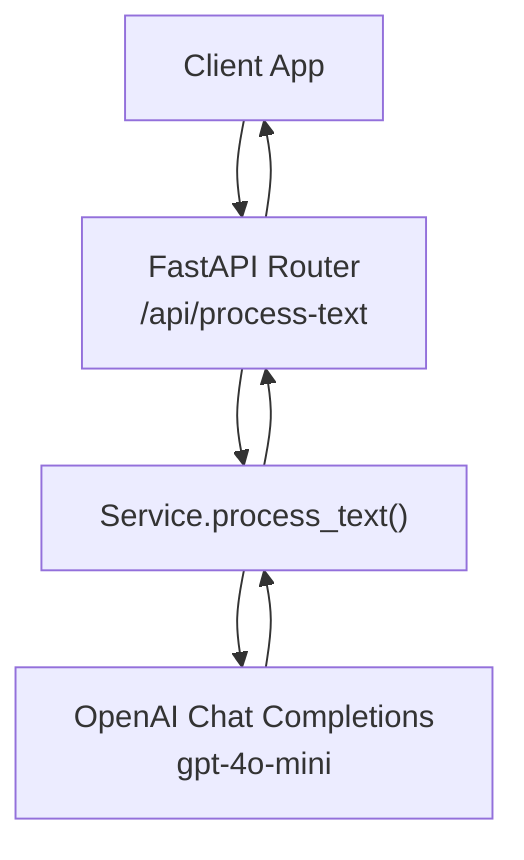
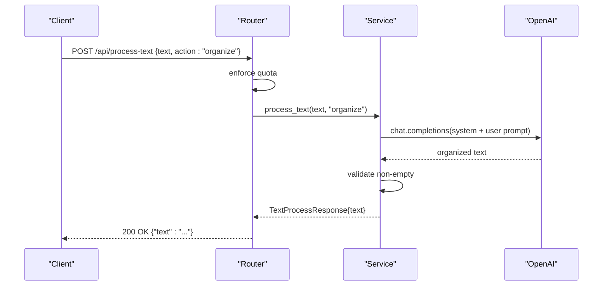
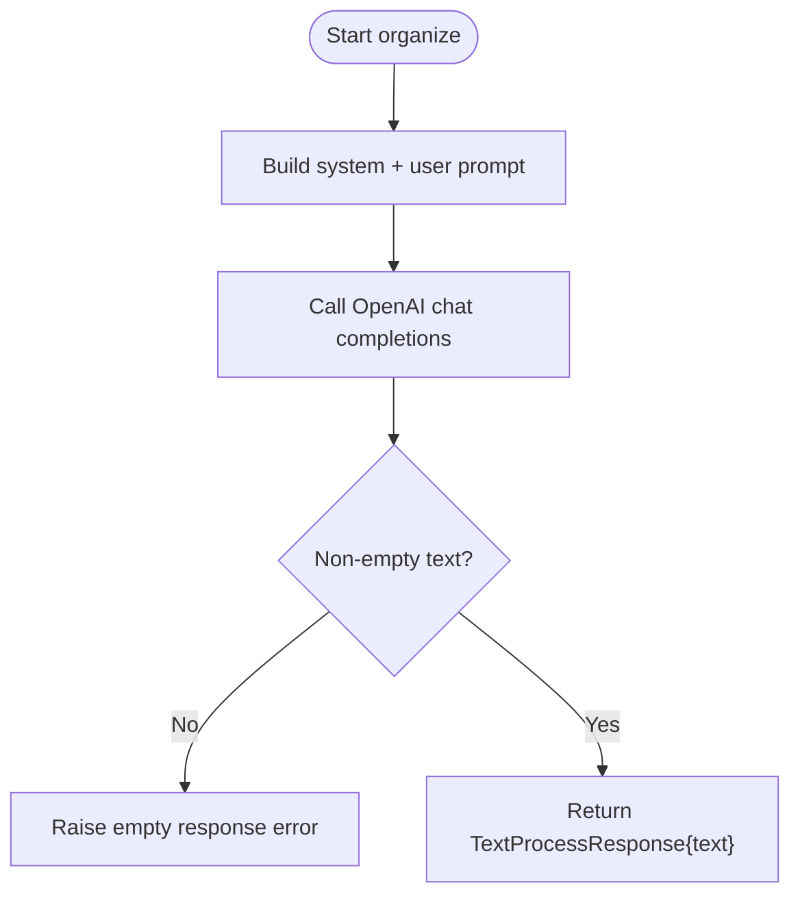
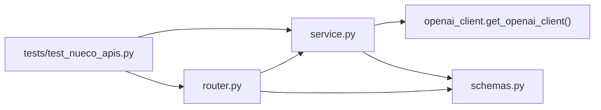

# Text Organization

<cite>
**Referenced Files in This Document**
- [router.py](file://textai/router.py)
- [schemas.py](file://textai/schemas.py)
- [service.py](file://textai/service.py)
- [test_nueco_apis.py](file://tests/test_nueco_apis.py)
</cite>

## Table of Contents
1. [Introduction](#introduction)
2. [Project Structure](#project-structure)
3. [Core Components](#core-components)
4. [Architecture Overview](#architecture-overview)
5. [Detailed Component Analysis](#detailed-component-analysis)
6. [Dependency Analysis](#dependency-analysis)
7. [Performance Considerations](#performance-considerations)
8. [Troubleshooting Guide](#troubleshooting-guide)
9. [Conclusion](#conclusion)
10. [Appendices](#appendices)

## Introduction
This document explains the text organization functionality exposed by the backend’s text AI service. It focuses on the “organize” action, which transforms unstructured or messy input into a cleaner, more readable version with improved structure and formatting while preserving the original meaning. You will find:
- The request/response contract for action=“organize”
- How the system processes text end-to-end
- The AI prompts and quality controls used
- Concrete before/after examples for typical inputs like meeting transcripts, brainstorming notes, and messy drafts
- Limitations, edge cases, and best practices to get the best results

## Project Structure
The text organization feature is implemented under the textai module:
- Router exposes the HTTP endpoint /api/process-text
- Schemas define the request and response models
- Service implements the business logic and calls the OpenAI model
- Tests validate behavior for organize and related actions

**Diagram sources**
- [router.py:136-148](file://textai/router.py#L136-L148)
- [service.py:133-167](file://textai/service.py#L133-L167)

**Section sources**
- [router.py:136-148](file://textai/router.py#L136-L148)
- [schemas.py:30-42](file://textai/schemas.py#L30-L42)
- [service.py:133-167](file://textai/service.py#L133-L167)

## Core Components
- Endpoint: POST /api/process-text
- Action: "organize"
- Request schema: TextProcessRequest with fields text (string) and action (string)
- Response schema: TextProcessResponse with field text (string); note_type is absent for organize

Key behaviors:
- Quota enforcement occurs before any AI call
- Invalid action returns 400
- Empty AI responses return 500
- Non-classifying actions (organize, summarize) omit note_type in the response

**Section sources**
- [router.py:136-148](file://textai/router.py#L136-L148)
- [schemas.py:30-42](file://textai/schemas.py#L30-L42)
- [service.py:133-167](file://textai/service.py#L133-L167)
- [test_nueco_apis.py:1701-1711](file://tests/test_nueco_apis.py#L1701-L1711)

## Architecture Overview
End-to-end flow for action="organize":
1. Client sends POST /api/process-text with { text, action: "organize" }
2. Router enforces quota and delegates to service.process_text
3. Service builds a system message and user prompt instructing the model to organize text, fix grammar/punctuation, add paragraphs/bullets/headers as appropriate, and preserve meaning
4. Model returns organized text; service validates non-empty and returns it
5. Router serializes the response without note_type

**Diagram sources**
- [router.py:136-148](file://textai/router.py#L136-L148)
- [service.py:133-167](file://textai/service.py#L133-L167)

## Detailed Component Analysis

### Request Schema: TextProcessRequest (action="organize")
- Fields:
  - text: string (required). Provide the raw, unstructured content you want organized.
  - action: string (required). Must be "organize".
- Validation:
  - If action is not one of the supported values, the router returns a 400 error with a message listing valid actions.

Best practices for input text:
- Include all relevant details (names, times, numbers, quantities) because the organizer preserves information rather than inventing or dropping it.
- Prefer natural language; bullet fragments are fine.
- Avoid extremely long documents in a single call; if needed, split into logical sections.

**Section sources**
- [schemas.py:30-36](file://textai/schemas.py#L30-L36)
- [service.py:133-136](file://textai/service.py#L133-L136)
- [test_nueco_apis.py:1713-1719](file://tests/test_nueco_apis.py#L1713-L1719)

### Response Schema: TextProcessResponse (action="organize")
- Fields:
  - text: string (required). The organized output.
  - note_type: omitted for organize (and summarize). Only smart_format includes this.

Behavior:
- For organize, the response contains only the organized text.

**Section sources**
- [schemas.py:38-42](file://textai/schemas.py#L38-L42)
- [router.py:133-135](file://textai/router.py#L133-L135)
- [test_nueco_apis.py:1701-1711](file://tests/test_nueco_apis.py#L1701-L1711)

### Processing Logic and AI Prompts
- System message: Instructs the assistant to organize and structure text to make it easier to read.
- User prompt: Requests clear paragraphs, bullet points where appropriate, headers if needed, grammar/punctuation fixes, and preservation of original meaning.
- Model: gpt-4o-mini
- Temperature: 0.2 (low creativity for consistent, deterministic formatting)
- Output validation: Empty responses raise an error; otherwise, the text is returned.

Quality thresholds and standards applied:
- Formatting targets: paragraphs, bullets, headers
- Language: grammar and punctuation improvements
- Fidelity: preserve original meaning and details
- Determinism: low temperature reduces variability

**Diagram sources**
- [service.py:139-167](file://textai/service.py#L139-L167)

**Section sources**
- [service.py:139-167](file://textai/service.py#L139-L167)

### Before/After Examples
Below are representative transformations that illustrate how messy input becomes structured output. These are illustrative patterns based on the prompt instructions; actual outputs may vary slightly due to model generation.

- Messy notes
  - Before: A stream-of-consciousness paragraph with mixed ideas, missing punctuation, and no structure.
  - After: Organized into clear paragraphs with headings and bullet points where appropriate; grammar fixed; meaning preserved.

- Meeting transcript
  - Before: Raw transcript lines with overlapping speakers and no agenda.
  - After: Structured with headings such as Attendees, Discussion, Decisions, Action Items; key decisions and tasks highlighted; speaker confusion resolved into coherent narrative.

- Brainstorming session
  - Before: Scattered ideas, duplicates, and fragmented phrases.
  - After: Grouped into thematic sections with concise bullets; duplicates removed; actionable items separated from background context.

Note: These examples describe expected outcomes aligned with the prompt’s formatting goals. They do not quote exact code or model outputs.

[No sources needed since this section describes conceptual transformations]

## Dependency Analysis
- Router depends on:
  - Quota enforcement
  - Service.process_text
  - Schemas for request/response validation
- Service depends on:
  - OpenAI client via get_openai_client
  - Schemas constants for allowed actions
- Tests assert:
  - Non-classifying actions return only text
  - Unknown actions return 400

**Diagram sources**
- [router.py:136-148](file://textai/router.py#L136-L148)
- [service.py:133-167](file://textai/service.py#L133-L167)
- [schemas.py:30-42](file://textai/schemas.py#L30-L42)
- [test_nueco_apis.py:1701-1719](file://tests/test_nueco_apis.py#L1701-L1719)

**Section sources**
- [router.py:136-148](file://textai/router.py#L136-L148)
- [service.py:133-167](file://textai/service.py#L133-L167)
- [schemas.py:30-42](file://textai/schemas.py#L30-L42)
- [test_nueco_apis.py:1701-1719](file://tests/test_nueco_apis.py#L1701-L1719)

## Performance Considerations
- Quota checks occur before calling the model, preventing unnecessary costs when rate-limited.
- Low temperature (0.2) improves consistency and reduces token usage variability.
- Keep input text focused; very long inputs can increase latency and cost.
- For large documents, consider splitting into logical sections and organizing each part separately.

[No sources needed since this section provides general guidance]

## Troubleshooting Guide
Common issues and resolutions:
- 400 Bad Request: Invalid action value. Ensure action is exactly "organize", "summarize", or "smart_format".
- 500 Internal Server Error: Empty AI response or parse failure. Retry with clearer input or shorter text.
- Unexpected response shape: For organize, note_type should be absent. If present, check client-side handling.

Operational notes:
- Errors are logged at the router level with status codes and messages suitable for clients.
- Quota exceeded returns 429 with Retry-After header; back off accordingly.

**Section sources**
- [router.py:136-148](file://textai/router.py#L136-L148)
- [service.py:133-167](file://textai/service.py#L133-L167)
- [test_nueco_apis.py:1701-1719](file://tests/test_nueco_apis.py#L1701-L1719)

## Conclusion
The organize action provides a reliable way to transform messy, unstructured text into clean, readable content with appropriate formatting and structure while preserving the original meaning. Use concise, complete inputs and follow the best practices above to achieve optimal results. When encountering errors, consult the troubleshooting guide to resolve common issues quickly.

[No sources needed since this section summarizes without analyzing specific files]

## Appendices

### API Contract Summary
- Endpoint: POST /api/process-text
- Headers: Authorization (Bearer token)
- Body:
  - text: string
  - action: "organize"
- Success response:
  - 200 OK
  - Body: { "text": "organized content" }
- Error responses:
  - 400 Bad Request: invalid action
  - 429 Too Many Requests: quota exceeded (Retry-After header)
  - 500 Internal Server Error: AI empty response or processing failure

**Section sources**
- [router.py:136-148](file://textai/router.py#L136-L148)
- [schemas.py:30-42](file://textai/schemas.py#L30-L42)
- [service.py:133-167](file://textai/service.py#L133-L167)
- [test_nueco_apis.py:1701-1719](file://tests/test_nueco_apis.py#L1701-L1719)