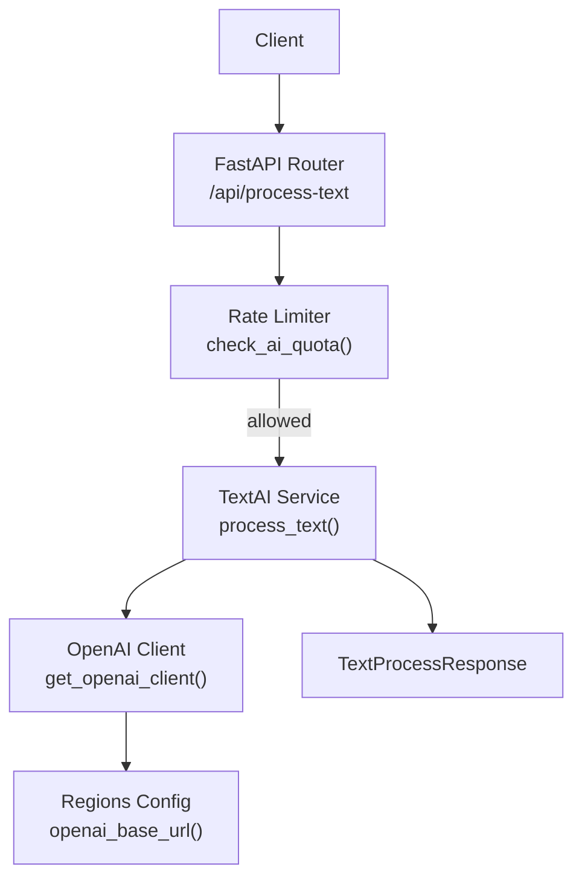
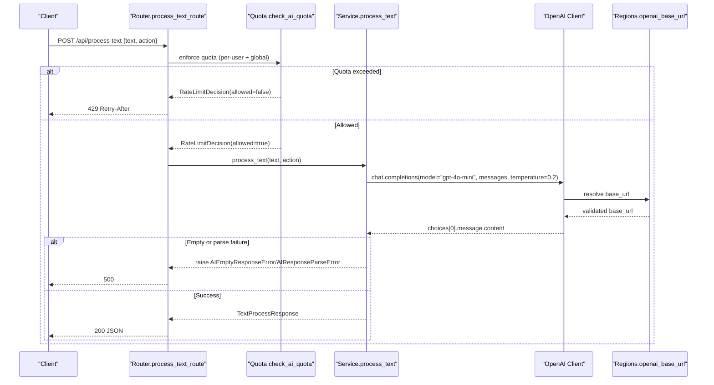
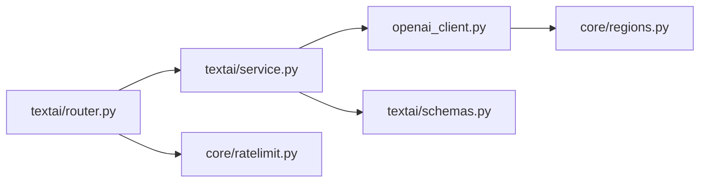

# Text Processing

<cite>
**Referenced Files in This Document**
- [router.py](file://textai/router.py)
- [schemas.py](file://textai/schemas.py)
- [service.py](file://textai/service.py)
- [ratelimit.py](file://core/ratelimit.py)
- [openai_client.py](file://openai_client.py)
- [regions.py](file://core/regions.py)
</cite>

## Table of Contents
1. [Introduction](#introduction)
2. [Project Structure](#project-structure)
3. [Core Components](#core-components)
4. [Architecture Overview](#architecture-overview)
5. [Detailed Component Analysis](#detailed-component-analysis)
6. [Dependency Analysis](#dependency-analysis)
7. [Performance Considerations](#performance-considerations)
8. [Troubleshooting Guide](#troubleshooting-guide)
9. [Conclusion](#conclusion)
10. [Appendices](#appendices)

## Introduction
This document explains the AI-powered text processing capabilities exposed by the /process-text endpoint. It covers the three supported actions (organize, summarize, smart_format), request and response schemas, integration with OpenAI’s GPT models, quota management, error handling, and best practices for prompt engineering, content filtering, and cost optimization.

## Project Structure
The text processing feature is implemented under the textai module and integrates with core services for rate limiting and region-aware configuration:
- Router defines HTTP endpoints and enforces quotas before calling into service logic.
- Service contains business logic for text processing and voice intent classification, including prompts and LLM calls.
- Schemas define typed request/response models and allowed action types.
- Core modules provide sliding-window rate limits and region validation for external services.

**Diagram sources**
- [router.py:136-148](file://textai/router.py#L136-L148)
- [ratelimit.py:115-123](file://core/ratelimit.py#L115-L123)
- [service.py:133-232](file://textai/service.py#L133-L232)
- [openai_client.py:15-23](file://openai_client.py#L15-L23)
- [regions.py:186-187](file://core/regions.py#L186-L187)

**Section sources**
- [router.py:136-148](file://textai/router.py#L136-L148)
- [ratelimit.py:98-123](file://core/ratelimit.py#L98-L123)
- [service.py:133-232](file://textai/service.py#L133-L232)
- [openai_client.py:15-23](file://openai_client.py#L15-L23)
- [regions.py:186-187](file://core/regions.py#L186-L187)

## Core Components
- Endpoint: POST /api/process-text (mounted under /api). Requires authentication and enforces per-user and global quotas before invoking the service.
- Actions:
  - organize: restructures unstructured text into readable paragraphs, bullets, headers, and corrected grammar while preserving meaning.
  - summarize: produces a concise summary that retains key points.
  - smart_format: classifies note type and returns clean HTML structured for recipe, checklist, meeting_notes, or general content.
- Request schema: TextProcessRequest includes text and action fields. Action values are validated server-side; unknown actions return a 400 with guidance.
- Response schema: TextProcessResponse includes text and an optional note_type field present only for smart_format.

Key behaviors:
- Quotas: Enforced before any LLM call to protect shared OpenAI quota and avoid unnecessary costs.
- Error mapping: Invalid action -> 400; empty or malformed LLM responses -> 500; other exceptions -> 500.
- Region safety: OpenAI base URL is enforced via region configuration to ensure data residency compliance.

**Section sources**
- [router.py:136-148](file://textai/router.py#L136-L148)
- [schemas.py:20-42](file://textai/schemas.py#L20-L42)
- [service.py:133-232](file://textai/service.py#L133-L232)
- [ratelimit.py:98-123](file://core/ratelimit.py#L98-L123)
- [openai_client.py:15-23](file://openai_client.py#L15-L23)
- [regions.py:186-187](file://core/regions.py#L186-L187)

## Architecture Overview
The flow from client request to LLM response involves strict validation, quota enforcement, and robust error handling.

**Diagram sources**
- [router.py:136-148](file://textai/router.py#L136-L148)
- [ratelimit.py:115-123](file://core/ratelimit.py#L115-L123)
- [service.py:133-232](file://textai/service.py#L133-L232)
- [openai_client.py:15-23](file://openai_client.py#L15-L23)
- [regions.py:186-187](file://core/regions.py#L186-L187)

## Detailed Component Analysis

### Endpoint: /process-text
- Authentication: Required via dependency injection.
- Quota enforcement: Per-user limit and global backstop checked before any LLM call.
- Action routing: Delegates to service.process_text based on action string.
- Error handling:
  - Invalid action -> 400 with guidance.
  - AI empty or parse errors -> 500.
  - Unexpected exceptions -> 500 with message.

**Section sources**
- [router.py:136-148](file://textai/router.py#L136-L148)

### Schema: TextProcessRequest and TextProcessResponse
- TextProcessRequest:
  - text: str
  - action: str (validated server-side against allowed set)
- TextProcessResponse:
  - text: str (always present)
  - note_type: optional NoteType (present only for smart_format)

Allowed actions and note types are defined centrally as Literals and used across schemas and service logic.

**Section sources**
- [schemas.py:20-42](file://textai/schemas.py#L20-L42)

### Service: process_text
- Validates action against allowed set.
- For each action:
  - organize:
    - System prompt instructs organization and formatting while preserving meaning.
    - Calls LLM with low temperature for deterministic output.
    - Returns TextProcessResponse with organized text.
  - summarize:
    - System prompt instructs concise summarization retaining key points.
    - Calls LLM with low temperature.
    - Returns TextProcessResponse with summary text.
  - smart_format:
    - Uses a structured prompt template to classify note type and produce HTML.
    - Expects JSON response with note_type and html.
    - Parses JSON; if invalid, raises parse error.
    - Normalizes unknown note_type to general to preserve user value.
    - Returns TextProcessResponse with html and note_type.

Prompt templates and model parameters are tuned for reliability and cost efficiency.

**Section sources**
- [service.py:25-47](file://textai/service.py#L25-L47)
- [service.py:133-232](file://textai/service.py#L133-L232)

### Quota Management
- Sliding window limiter tracks per-user and global usage.
- Quotas:
  - TEXT_PROCESS_QUOTA: 15 requests per 60 seconds per user.
  - GLOBAL_AI_QUOTA: 120 requests per 60 seconds globally to protect shared OpenAI key.
- Decision includes retry_after seconds when denied; router sets 429 with Retry-After header.

**Section sources**
- [ratelimit.py:41-88](file://core/ratelimit.py#L41-L88)
- [ratelimit.py:98-123](file://core/ratelimit.py#L98-L123)
- [router.py:28-49](file://textai/router.py#L28-L49)

### OpenAI Integration and Region Safety
- get_openai_client reads API key from environment and constructs AsyncOpenAI with base_url from regions.openai_base_url().
- openai_base_url enforces configured endpoint and Australian region allowlist at runtime.
- All LLM calls use gpt-4o-mini with temperature 0.2 for predictable outputs and lower cost.

**Section sources**
- [openai_client.py:15-23](file://openai_client.py#L15-L23)
- [regions.py:186-187](file://core/regions.py#L186-L187)
- [service.py:155-162](file://textai/service.py#L155-L162)
- [service.py:181-188](file://textai/service.py#L181-L188)
- [service.py:203-211](file://textai/service.py#L203-L211)

### Error Handling and Fallbacks
- Invalid action: 400 with guidance listing valid actions.
- Empty LLM response: 500 indicating empty response.
- Malformed LLM JSON: 500 indicating unexpected response.
- Unknown note_type in smart_format: degrades to general rather than failing the entire operation.
- Quota exceeded: 429 with Retry-After header to guide client throttling.

There is no automatic fallback to alternative providers within this codebase; failures surface as HTTP errors with clear diagnostics.

**Section sources**
- [service.py:133-232](file://textai/service.py#L133-L232)
- [router.py:136-148](file://textai/router.py#L136-L148)
- [ratelimit.py:115-123](file://core/ratelimit.py#L115-L123)

## Dependency Analysis
The text processing pipeline depends on:
- FastAPI router for HTTP handling and auth.
- Core rate limiter for quota enforcement.
- OpenAI client for LLM calls.
- Regions module for endpoint and region validation.

**Diagram sources**
- [router.py:136-148](file://textai/router.py#L136-L148)
- [service.py:133-232](file://textai/service.py#L133-L232)
- [ratelimit.py:115-123](file://core/ratelimit.py#L115-L123)
- [openai_client.py:15-23](file://openai_client.py#L15-L23)
- [regions.py:186-187](file://core/regions.py#L186-L187)
- [schemas.py:20-42](file://textai/schemas.py#L20-L42)

**Section sources**
- [router.py:136-148](file://textai/router.py#L136-L148)
- [service.py:133-232](file://textai/service.py#L133-L232)
- [ratelimit.py:115-123](file://core/ratelimit.py#L115-L123)
- [openai_client.py:15-23](file://openai_client.py#L15-L23)
- [regions.py:186-187](file://core/regions.py#L186-L187)
- [schemas.py:20-42](file://textai/schemas.py#L20-L42)

## Performance Considerations
- Model selection: gpt-4o-mini balances quality and cost for text tasks.
- Temperature: Set to 0.2 to reduce variability and improve determinism.
- Quotas: Protect shared OpenAI quota and prevent runaway clients from impacting others.
- Prompt length: Keep inputs concise to minimize token usage and latency.
- Response parsing: JSON mode for structured outputs reduces retries and parsing overhead.

[No sources needed since this section provides general guidance]

## Troubleshooting Guide
Common issues and resolutions:
- 400 Invalid action: Ensure action is one of organize, summarize, smart_format.
- 429 Too many requests: Respect Retry-After header; implement exponential backoff on client side.
- 500 Empty response: Indicates LLM returned no content; retry after brief delay or reduce input size.
- 500 Unexpected response: Indicates malformed JSON from LLM; verify prompt constraints and consider adding stricter system instructions.
- Smart format note_type unknown: The system normalizes to general; validate downstream rendering for general content.

Operational checks:
- Verify OPENAI_API_KEY or EMERGENT_LLM_KEY is set.
- Confirm OPENAI_BASE_URL and OPENAI_REGION are configured and compliant.
- Monitor logs for quota decisions and transcription/text processing durations.

**Section sources**
- [router.py:136-148](file://textai/router.py#L136-L148)
- [service.py:133-232](file://textai/service.py#L133-L232)
- [ratelimit.py:115-123](file://core/ratelimit.py#L115-L123)
- [openai_client.py:15-23](file://openai_client.py#L15-L23)
- [regions.py:186-187](file://core/regions.py#L186-L187)

## Conclusion
The /process-text endpoint provides reliable, quota-gated text processing powered by OpenAI’s GPT models. It supports organizing notes, summarizing long texts, and automatically classifying content into structured formats via smart_format. Robust error handling, region-safe configuration, and sliding-window quotas ensure safe and cost-effective operations. Following the recommended prompt engineering and cost optimization practices will further improve reliability and efficiency.

[No sources needed since this section summarizes without analyzing specific files]

## Appendices

### API Reference: /process-text
- Method: POST
- Path: /api/process-text
- Authentication: Required
- Request body:
  - text: string
  - action: string (organize | summarize | smart_format)
- Responses:
  - 200 OK: TextProcessResponse
    - text: string
    - note_type: string (only for smart_format; absent otherwise)
  - 400 Bad Request: Invalid action
  - 429 Too Many Requests: Quota exceeded (Retry-After header present)
  - 500 Internal Server Error: Empty or malformed LLM response

**Section sources**
- [router.py:136-148](file://textai/router.py#L136-L148)
- [schemas.py:20-42](file://textai/schemas.py#L20-L42)

### Example Workflows

#### Organize Unstructured Notes
- Input: A messy paragraph with mixed ideas.
- Action: organize
- Output: Cleanly structured text with paragraphs, bullets, and corrected grammar.

**Section sources**
- [service.py:139-167](file://textai/service.py#L139-L167)

#### Summarize Long Text
- Input: A lengthy article or memo.
- Action: summarize
- Output: Concise summary retaining key points.

**Section sources**
- [service.py:169-193](file://textai/service.py#L169-L193)

#### Classify and Restructure by Note Type
- Input: Mixed content that could be a recipe, checklist, meeting notes, or general.
- Action: smart_format
- Output: HTML structured for the detected note type plus note_type field.

**Section sources**
- [service.py:195-229](file://textai/service.py#L195-L229)

### Best Practices

- Prompt Engineering
  - Use explicit system messages to constrain behavior.
  - Provide clear examples in prompts where appropriate.
  - Prefer structured outputs (JSON) for complex tasks like smart_format.

- Content Filtering
  - Validate inputs on the client and server to avoid excessively large payloads.
  - Sanitize or redact sensitive information before sending to LLMs.

- Cost Optimization
  - Choose smaller models (e.g., gpt-4o-mini) for routine tasks.
  - Reduce prompt length and avoid redundant context.
  - Implement client-side retries with backoff and respect Retry-After headers.
  - Cache repeated results when feasible to reduce LLM calls.

[No sources needed since this section provides general guidance]