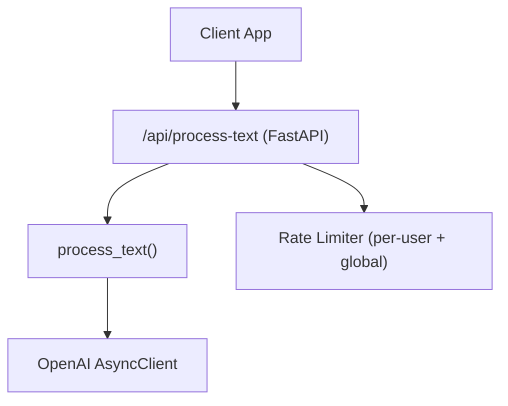
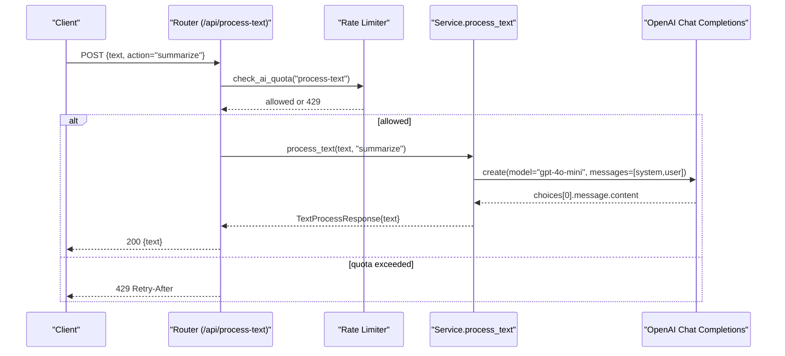
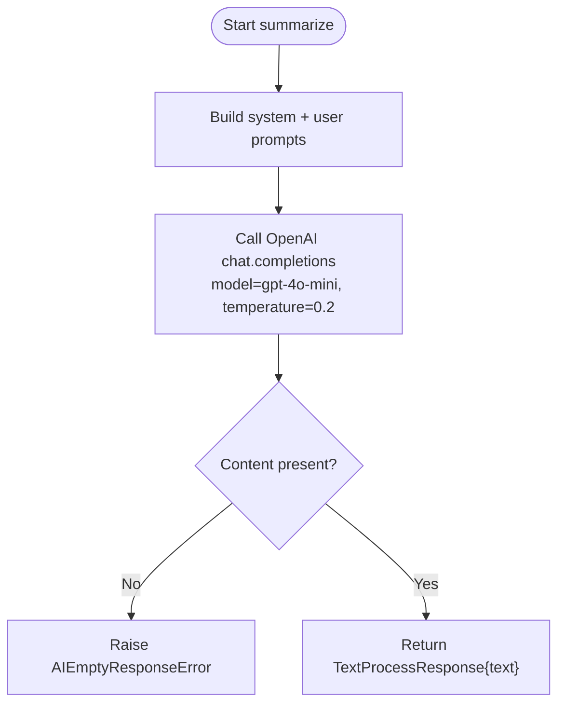
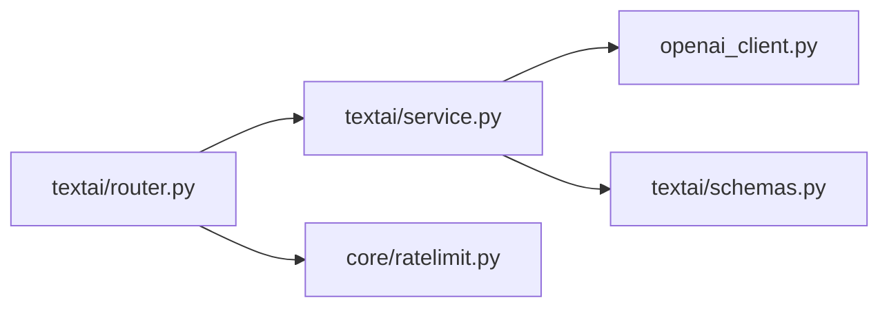

# Text Summarization

<cite>
**Referenced Files in This Document**
- [router.py](file://textai/router.py)
- [schemas.py](file://textai/schemas.py)
- [service.py](file://textai/service.py)
- [openai_client.py](file://openai_client.py)
- [ratelimit.py](file://core/ratelimit.py)
- [test_nueco_apis.py](file://tests/test_nueco_apis.py)
</cite>

## Table of Contents
1. [Introduction](#introduction)
2. [Project Structure](#project-structure)
3. [Core Components](#core-components)
4. [Architecture Overview](#architecture-overview)
5. [Detailed Component Analysis](#detailed-component-analysis)
6. [Dependency Analysis](#dependency-analysis)
7. [Performance Considerations](#performance-considerations)
8. [Troubleshooting Guide](#troubleshooting-guide)
9. [Conclusion](#conclusion)
10. [Appendices](#appendices)

## Introduction
This document explains the text summarization capability exposed by the backend’s AI text processing endpoint. It focuses on how the summarize action condenses long texts while preserving key information and main points, the request/response schema for action=summarize, input length considerations, output formats, and operational aspects such as rate limiting and error handling. It also provides practical usage examples and guidance for performance and accuracy when summarizing complex content.

## Project Structure
The summarization feature is implemented under the textai module with a clear separation:
- Router defines HTTP endpoints and enforces quotas.
- Schemas define request/response models and allowed actions.
- Service implements the business logic that calls the OpenAI API to perform summarize, organize, or smart_format.
- OpenAI client configuration centralizes API key and base URL setup.
- Rate limiting protects shared AI quotas at both per-user and global levels.

**Diagram sources**
- [router.py:136-148](file://textai/router.py#L136-L148)
- [service.py:133-193](file://textai/service.py#L133-L193)
- [ratelimit.py:115-123](file://core/ratelimit.py#L115-L123)

**Section sources**
- [router.py:136-148](file://textai/router.py#L136-L148)
- [schemas.py:20-42](file://textai/schemas.py#L20-L42)
- [service.py:133-193](file://textai/service.py#L133-L193)
- [openai_client.py:15-23](file://openai_client.py#L15-L23)
- [ratelimit.py:98-123](file://core/ratelimit.py#L98-L123)

## Core Components
- Endpoint: POST /api/process-text accepts a TextProcessRequest and returns a TextProcessResponse.
- Action: summarize instructs the model to produce a concise summary while retaining key points.
- Schema:
  - Request: text (string), action (string; must be one of organize, summarize, smart_format).
  - Response: text (string); note_type is absent for summarize.
- Quotas: Each call is subject to per-user and global rate limits before any external API call.
- Model: Uses gpt-4o-mini via an async OpenAI client configured from environment variables.

Key behaviors:
- Invalid action returns 400 with a message listing valid actions.
- Empty or malformed LLM responses return 500 with descriptive details.
- The response excludes note_type for summarize, keeping the contract simple: {"text": "..."}

**Section sources**
- [schemas.py:20-42](file://textai/schemas.py#L20-L42)
- [router.py:136-148](file://textai/router.py#L136-L148)
- [service.py:133-193](file://textai/service.py#L133-L193)
- [ratelimit.py:98-123](file://core/ratelimit.py#L98-L123)

## Architecture Overview
The summarize flow:
1. Client sends POST /api/process-text with { "text": "...", "action": "summarize" }.
2. Router validates authentication and enforces quotas.
3. Router delegates to service.process_text(text, "summarize").
4. Service builds a system prompt and user prompt, then calls OpenAI chat completions with gpt-4o-mini and temperature=0.2.
5. Service extracts the model’s text, validates it is non-empty, and returns TextProcessResponse.
6. Router serializes the response without note_type.

**Diagram sources**
- [router.py:136-148](file://textai/router.py#L136-L148)
- [service.py:169-193](file://textai/service.py#L169-L193)
- [ratelimit.py:115-123](file://core/ratelimit.py#L115-L123)

## Detailed Component Analysis

### Request and Response Schema for action=summarize
- TextProcessRequest:
  - text: string (the source content to summarize)
  - action: string; must be "summarize" for this use case
- TextProcessResponse:
  - text: string (the generated summary)
  - note_type: not included for summarize

Validation and contracts:
- Unknown actions are rejected with 400 and a message naming valid actions.
- For summarize, the response contains only text; note_type is omitted.

**Section sources**
- [schemas.py:20-42](file://textai/schemas.py#L20-L42)
- [test_nueco_apis.py:1713-1719](file://tests/test_nueco_apis.py#L1713-L1719)

### Summarization Algorithm and Prompting
- Model: gpt-4o-mini
- Temperature: 0.2 (low randomness for consistent summaries)
- System message: directs the assistant to summarize concisely while keeping key points
- User message: includes the full input text and asks for a summary only
- Output validation: empty responses raise a specific error to signal failure

**Diagram sources**
- [service.py:169-193](file://textai/service.py#L169-L193)

**Section sources**
- [service.py:169-193](file://textai/service.py#L169-L193)

### Input Length Considerations and Context Window Handling
- The current implementation passes the entire input text into the user prompt without explicit chunking or truncation.
- There is no built-in guard against exceeding the model’s context window; very large inputs may cause provider-side errors or unexpected behavior.
- Logging records the input length for observability but does not enforce limits.

Recommendations for large texts:
- Implement client-side or server-side chunking strategies (e.g., split by paragraphs or sections) and aggregate summaries if needed.
- Add explicit length checks and return actionable errors when inputs exceed reasonable bounds.
- Consider adding a max_length parameter to control summarization scope.

**Section sources**
- [service.py:169-193](file://textai/service.py#L169-L193)

### Output Formats
- Successful summarize returns a JSON object with a single field: text.
- The note_type field is intentionally absent for summarize to maintain compatibility with existing clients.

Example response shape:
- { "text": "A concise summary of the input." }

**Section sources**
- [schemas.py:38-42](file://textai/schemas.py#L38-L42)
- [router.py:133-141](file://textai/router.py#L133-L141)

### Practical Examples
Below are example requests and expected outcomes. Replace placeholders with your actual content.

- Article summarization
  - Request: { "text": "<full article text>", "action": "summarize" }
  - Response: { "text": "<concise summary>" }

- Meeting notes summarization
  - Request: { "text": "<raw meeting notes>", "action": "summarize" }
  - Response: { "text": "<key decisions, attendees, action items summarized>" }

- Research paper summarization
  - Request: { "text": "<abstract/intro/methods/results/discussion>", "action": "summarize" }
  - Response: { "text": "
" }

- Long document summarization
  - Request: { "text": "<document content>", "action": "summarize" }
  - Response: { "text": "<condensed overview preserving main points>" }

Note: These are illustrative shapes; actual payloads should conform to the TextProcessRequest schema.

[No sources needed since this section provides conceptual usage examples]

### Quality Metrics and Evaluation
- Deterministic settings: temperature=0.2 reduces variability, improving consistency across runs.
- Observability: logs include input and output lengths to help detect anomalies.
- Error signals: empty responses are explicitly flagged to aid monitoring and retries.

To evaluate quality in practice:
- Compare summaries against human references using metrics like ROUGE or BERTScore.
- Track latency and token usage via application metrics and provider dashboards.
- Monitor error rates for empty or malformed responses.

[No sources needed since this section provides general evaluation guidance]

## Dependency Analysis
- Router depends on:
  - Rate limiter to enforce quotas before calling the service
  - Service to perform text processing
- Service depends on:
  - OpenAI client to call the model
  - Schemas for validation constants and response types
- OpenAI client depends on:
  - Environment variables for API key and region-specific base URL

**Diagram sources**
- [router.py:136-148](file://textai/router.py#L136-L148)
- [service.py:133-193](file://textai/service.py#L133-L193)
- [openai_client.py:15-23](file://openai_client.py#L15-L23)
- [ratelimit.py:115-123](file://core/ratelimit.py#L115-L123)

**Section sources**
- [router.py:136-148](file://textai/router.py#L136-L148)
- [service.py:133-193](file://textai/service.py#L133-L193)
- [openai_client.py:15-23](file://openai_client.py#L15-L23)
- [ratelimit.py:98-123](file://core/ratelimit.py#L98-L123)

## Performance Considerations
- Rate limiting:
  - Per-user limit for text processing prevents runaway usage.
  - Global limit protects the shared OpenAI key from stampedes.
- Model choice:
  - gpt-4o-mini is cost- and latency-efficient for summarization tasks.
- Memory and throughput:
  - The service processes one request at a time per route handler; ensure concurrency aligns with deployment capacity.
  - Avoid sending extremely large texts to reduce memory pressure and avoid context overflows.
- Optimization strategies:
  - Pre-truncate or chunk long inputs on the client or server side.
  - Cache repeated summaries for identical inputs where appropriate.
  - Use streaming responses if you need faster perceived latency (requires additional changes).

[No sources needed since this section provides general guidance]

## Troubleshooting Guide
Common issues and resolutions:
- 400 Bad Request: invalid action
  - Cause: action is not one of organize, summarize, smart_format
  - Resolution: ensure action equals "summarize" for summarization
- 429 Too Many Requests
  - Cause: exceeded per-user or global quota
  - Resolution: back off according to Retry-After header; reduce request frequency
- 500 Internal Server Error: AI empty response
  - Cause: model returned no content
  - Resolution: retry with smaller input or adjust content; monitor logs for patterns
- 500 Internal Server Error: unexpected response
  - Cause: parsing/validation failure (more common in other actions)
  - Resolution: review input formatting; ensure text is well-formed

Operational tips:
- Log and monitor input/output lengths to detect anomalies early.
- If encountering frequent 429s, consider batching or throttling client-side.
- For very long documents, implement chunked summarization to improve reliability.

**Section sources**
- [router.py:136-148](file://textai/router.py#L136-L148)
- [service.py:169-193](file://textai/service.py#L169-L193)
- [ratelimit.py:115-123](file://core/ratelimit.py#L115-L123)

## Conclusion
The summarize action provides a straightforward, low-latency way to condense text while preserving key points using a lightweight model. The current implementation is simple and effective for moderate-length inputs. For large or complex documents, consider implementing chunking, explicit length checks, and caching to improve reliability and performance. Monitoring input/output sizes and error rates will help maintain high-quality summarization in production.

[No sources needed since this section summarizes without analyzing specific files]

## Appendices

### API Reference: /api/process-text
- Method: POST
- Authentication: required
- Request body:
  - text: string
  - action: string; use "summarize"
- Response body:
  - text: string (summary)
- Status codes:
  - 200: success
  - 400: invalid action
  - 429: quota exceeded (Retry-After header provided)
  - 500: AI service errors (empty or malformed response)

**Section sources**
- [router.py:136-148](file://textai/router.py#L136-L148)
- [schemas.py:20-42](file://textai/schemas.py#L20-L42)
- [ratelimit.py:98-123](file://core/ratelimit.py#L98-L123)