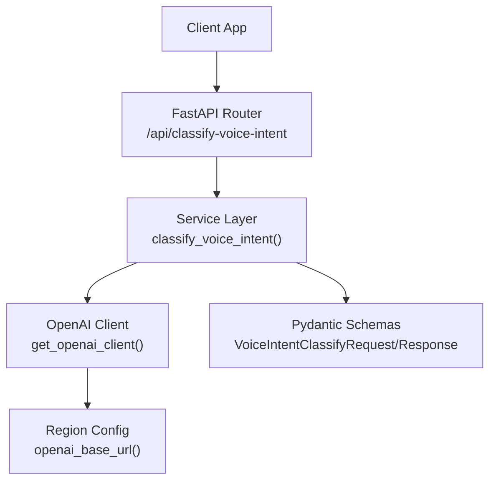
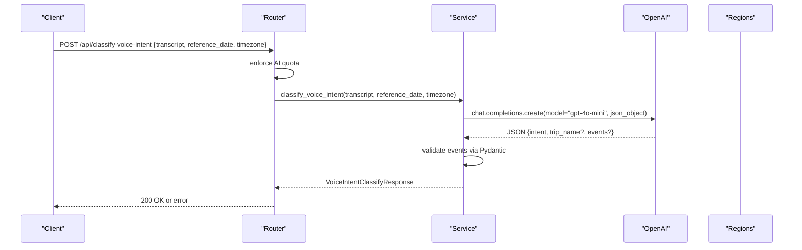
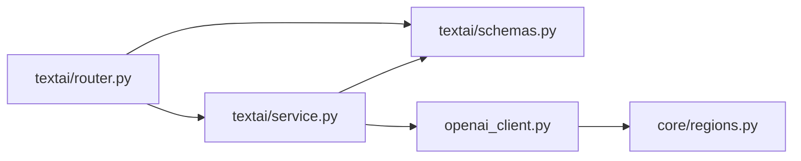
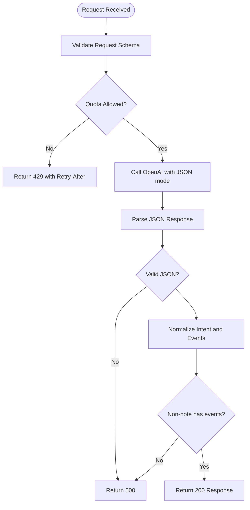

# Voice Intent Classification

<cite>
**Referenced Files in This Document**
- [router.py](file://textai/router.py)
- [service.py](file://textai/service.py)
- [schemas.py](file://textai/schemas.py)
- [openai_client.py](file://openai_client.py)
- [transcription.py](file://textai/transcription.py)
- [regions.py](file://core/regions.py)
- [test_nueco_apis.py](file://tests/test_nueco_apis.py)
</cite>

## Table of Contents
1. [Introduction](#introduction)
2. [Project Structure](#project-structure)
3. [Core Components](#core-components)
4. [Architecture Overview](#architecture-overview)
5. [Detailed Component Analysis](#detailed-component-analysis)
6. [Dependency Analysis](#dependency-analysis)
7. [Performance Considerations](#performance-considerations)
8. [Troubleshooting Guide](#troubleshooting-guide)
9. [Conclusion](#conclusion)
10. [Appendices](#appendices)

## Introduction
This document explains the voice intent classification service that analyzes voice memo transcripts to determine whether they are:
- Plain dictation (note)
- A single scheduling request (single_event)
- Multiple unrelated scheduling requests (multiple_events)
- An itinerary (a grouped set of events for a trip)

It documents the /classify-voice-intent endpoint, the request/response schemas, the classification logic, timezone-aware date parsing, and integration with OpenAI for intent recognition and event extraction. It also covers accuracy considerations, edge cases, and strategies to improve classification quality through prompts and context.

## Project Structure
The voice intent classification feature lives under the textai module and integrates with authentication, quotas, and OpenAI via shared infrastructure.

**Diagram sources**
- [router.py:151-162](file://textai/router.py#L151-L162)
- [service.py:259-314](file://textai/service.py#L259-L314)
- [openai_client.py:15-23](file://openai_client.py#L15-L23)
- [regions.py:186-187](file://core/regions.py#L186-L187)
- [schemas.py:44-48](file://textai/schemas.py#L44-L48)

**Section sources**
- [router.py:151-162](file://textai/router.py#L151-L162)
- [service.py:259-314](file://textai/service.py#L259-L314)
- [schemas.py:44-48](file://textai/schemas.py#L44-L48)
- [openai_client.py:15-23](file://openai_client.py#L15-L23)
- [regions.py:186-187](file://core/regions.py#L186-L187)

## Core Components
- Endpoint: POST /api/classify-voice-intent
- Request schema: VoiceIntentClassifyRequest
  - transcript: string
  - reference_date: ISO date string representing the user’s local “today”
  - timezone: IANA timezone name (e.g., "Australia/Sydney")
- Response schema: VoiceIntentClassifyResponse
  - intent: one of note, single_event, multiple_events, itinerary
  - trip_name: optional string when intent is itinerary
  - events: list of structured events when intent is not note

Key responsibilities:
- Enforce per-user AI quota before calling OpenAI
- Build a prompt with transcript, reference_date, and timezone
- Call OpenAI to classify intent and extract events as JSON
- Validate and normalize extracted events using Pydantic models
- Return normalized response or raise appropriate errors

**Section sources**
- [router.py:151-162](file://textai/router.py#L151-L162)
- [schemas.py:44-48](file://textai/schemas.py#L44-L48)
- [schemas.py:134-143](file://textai/schemas.py#L134-L143)

## Architecture Overview
The classification flow uses a strict JSON-mode LLM call to ensure reliable parsing and consistent structure.

**Diagram sources**
- [router.py:151-162](file://textai/router.py#L151-L162)
- [service.py:259-314](file://textai/service.py#L259-L314)
- [openai_client.py:15-23](file://openai_client.py#L15-L23)
- [regions.py:186-187](file://core/regions.py#L186-L187)

## Detailed Component Analysis

### Endpoint: /classify-voice-intent
- Path: POST /api/classify-voice-intent
- Authentication: required (via dependency)
- Quota enforcement: per-user limit for voice-intent; returns 429 with Retry-After on exceed
- Behavior:
  - Validates request body against VoiceIntentClassifyRequest
  - Delegates to service.classify_voice_intent
  - Maps service exceptions to HTTP 500 responses

Error handling:
- AIEmptyResponseError -> 500
- AIResponseParseError -> 500
- Other exceptions -> 500 with message

**Section sources**
- [router.py:151-162](file://textai/router.py#L151-L162)
- [router.py:28-49](file://textai/router.py#L28-L49)

### Request Schema: VoiceIntentClassifyRequest
- transcript: string containing the ASR output
- reference_date: ISO date string from the device’s local “today” to avoid server-timezone skew
- timezone: IANA timezone name used to resolve relative times

Validation:
- FastAPI enforces presence and types
- The service treats unknown intents as “note” to preserve original content

**Section sources**
- [schemas.py:44-48](file://textai/schemas.py#L44-L48)

### Response Schema: VoiceIntentClassifyResponse
- intent: one of note, single_event, multiple_events, itinerary
- trip_name: present only for itinerary; defaults to "New Trip" if missing
- events: list of VoiceEventOut when intent is not note; empty for note

Event model highlights:
- title: non-empty string
- start_time: non-empty string (ISO datetime with UTC offset)
- end_time: optional; blank treated as None
- location: string; absent becomes empty string
- recurrence: optional RecurrenceOut with freq, byweekday (0=Sunday..6=Saturday), until
- confidence: high or low; unknown degrades to low

Recurrence validation:
- Invalid byweekday values are dropped rather than failing the whole event
- Unknown freq values cause recurrence to be dropped while keeping the event

**Section sources**
- [schemas.py:60-85](file://textai/schemas.py#L60-L85)
- [schemas.py:87-132](file://textai/schemas.py#L87-L132)
- [schemas.py:134-143](file://textai/schemas.py#L134-L143)

### Classification Logic: classify_voice_intent
- Builds a system message and a prompt template including:
  - Transcript
  - Reference date (device’s local today)
  - Timezone (IANA name)
- Calls OpenAI with:
  - model: gpt-4o-mini
  - temperature: 0.2
  - response_format: json_object
- Parses JSON response into a dict
- Normalizes intent:
  - If unrecognized, falls back to “note”
- For non-note intents:
  - Extracts events array
  - Validates each event via Pydantic; drops invalid entries
  - Requires at least one valid event; otherwise raises AIEmptyResponseError
- For itinerary:
  - Ensures trip_name is a non-empty string; defaults to "New Trip" if missing

Date/time resolution:
- Performed by the LLM using reference_date and timezone
- No server-side date math or recurrence validation occurs here

**Section sources**
- [service.py:25-87](file://textai/service.py#L25-L87)
- [service.py:259-314](file://textai/service.py#L259-L314)

### OpenAI Integration
- Client creation:
  - Reads API key from OPENAI_API_KEY or EMERGENT_LLM_KEY
  - Uses base URL from regions.openai_base_url() to enforce data residency
- Region enforcement:
  - openai_base_url() validates region and URL scheme at runtime
- Model and parameters:
  - gpt-4o-mini with JSON mode and low temperature for stability

**Section sources**
- [openai_client.py:15-23](file://openai_client.py#L15-L23)
- [regions.py:186-187](file://core/regions.py#L186-L187)

### Example Classifications
Examples validated by tests demonstrate:
- Note intent returns no events
- Single event with weekly recurrence extracts correctly
- Multiple events returned as separate items
- Itinerary returns trip_name and multiple events
- Missing trip_name defaults to "New Trip"
- Malformed LLM JSON returns 500
- Non-note intent with no usable events returns 500
- Malformed recurrence fields are dropped without failing the event
- Unrecognized intent falls back to note
- Unrecognized confidence degrades to low

These examples illustrate how the service handles natural language inputs, relative dates, recurring patterns, and robustness to malformed LLM outputs.

**Section sources**
- [test_nueco_apis.py:851-1079](file://tests/test_nueco_apis.py#L851-L1079)
- [test_nueco_apis.py:1623-1645](file://tests/test_nueco_apis.py#L1623-L1645)

### Transcription Context (Optional Background)
While transcription is not part of intent classification, it provides the transcript input. The system supports:
- OpenAI Whisper provider
- Speechmatics provider with diarization support
- Shadow mode for provider comparison
- Word-level timestamps when available

This background helps understand how transcripts are produced before classification.

**Section sources**
- [transcription.py:78-132](file://textai/transcription.py#L78-L132)
- [transcription.py:171-285](file://textai/transcription.py#L171-L285)
- [transcription.py:363-449](file://textai/transcription.py#L363-L449)

## Dependency Analysis
High-level dependencies:
- Router depends on:
  - Quota enforcement
  - Service layer
  - Schemas
- Service depends on:
  - OpenAI client
  - Schemas for validation
  - Logging
- OpenAI client depends on:
  - Region configuration for base URL
- Schemas define closed sets for intents, frequencies, and confidence levels

**Diagram sources**
- [router.py:151-162](file://textai/router.py#L151-L162)
- [service.py:259-314](file://textai/service.py#L259-L314)
- [openai_client.py:15-23](file://openai_client.py#L15-L23)
- [regions.py:186-187](file://core/regions.py#L186-L187)
- [schemas.py:44-48](file://textai/schemas.py#L44-L48)

**Section sources**
- [router.py:151-162](file://textai/router.py#L151-L162)
- [service.py:259-314](file://textai/service.py#L259-L314)
- [openai_client.py:15-23](file://openai_client.py#L15-L23)
- [regions.py:186-187](file://core/regions.py#L186-L187)
- [schemas.py:44-48](file://textai/schemas.py#L44-L48)

## Performance Considerations
- Low temperature (0.2) reduces variability and improves parse reliability
- JSON mode ensures structured responses, minimizing post-processing cost
- Quota enforcement prevents unnecessary OpenAI calls when rate-limited
- Event validation is per-entry; bad entries are dropped without failing the entire batch
- Avoid logging sensitive transcript content; logs capture lengths and metadata only

[No sources needed since this section provides general guidance]

## Troubleshooting Guide
Common issues and resolutions:
- 429 Too Many Requests:
  - Indicates quota exceeded; respect Retry-After header and retry later
- 500 AI service returned an unexpected response:
  - LLM did not return valid JSON; check network, model availability, and prompt clarity
- 500 Could not extract an event from that recording:
  - Non-note intent but no valid events; refine transcript or prompt context
- Malformed recurrence or confidence:
  - Recurrence fields are dropped; confidence degrades to low; event still returned
- Unrecognized intent:
  - Falls back to “note”; review transcript and prompt to encourage correct classification

Operational checks:
- Ensure OPENAI_API_KEY or EMERGENT_LLM_KEY is configured
- Verify regions configuration for OpenAI base URL and region
- Confirm quota settings and per-user limits

**Section sources**
- [router.py:28-49](file://textai/router.py#L28-L49)
- [service.py:289-314](file://textai/service.py#L289-L314)
- [openai_client.py:15-23](file://openai_client.py#L15-L23)
- [regions.py:186-187](file://core/regions.py#L186-L187)

## Conclusion
The voice intent classification service reliably distinguishes between dictation and scheduling intents, extracting structured events with timezone-aware date resolution. It leverages OpenAI’s JSON mode and robust Pydantic validation to produce predictable outputs. Quotas, region enforcement, and careful error handling ensure safe and scalable operation. Accuracy can be improved by providing clear transcripts, precise reference dates and timezones, and well-crafted prompts that guide the model toward expected behaviors.

[No sources needed since this section summarizes without analyzing specific files]

## Appendices

### API Definition: /classify-voice-intent
- Method: POST
- Path: /api/classify-voice-intent
- Authentication: Required
- Request body:
  - transcript: string
  - reference_date: ISO date string
  - timezone: IANA timezone name
- Response body:
  - intent: note | single_event | multiple_events | itinerary
  - trip_name: string or null
  - events: array of VoiceEventOut

Status codes:
- 200: Success
- 429: Quota exceeded (Retry-After header provided)
- 500: AI service errors or parsing failures

**Section sources**
- [router.py:151-162](file://textai/router.py#L151-L162)
- [schemas.py:44-48](file://textai/schemas.py#L44-L48)
- [schemas.py:134-143](file://textai/schemas.py#L134-L143)

### Prompt Template Summary
- System message instructs the model to classify voice memos and extract events as JSON
- User prompt includes transcript, reference_date, and timezone
- Output must be a JSON object with intent, optional trip_name, and events array
- Events include title, start_time, optional end_time, location, optional recurrence, and confidence

**Section sources**
- [service.py:25-87](file://textai/service.py#L25-L87)

### Data Flow Diagram

**Diagram sources**
- [router.py:151-162](file://textai/router.py#L151-L162)
- [service.py:259-314](file://textai/service.py#L259-L314)