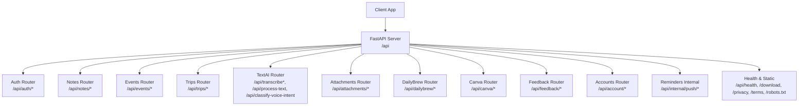
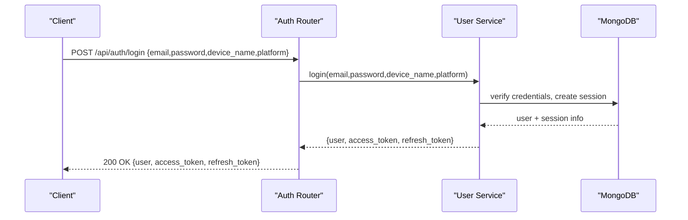
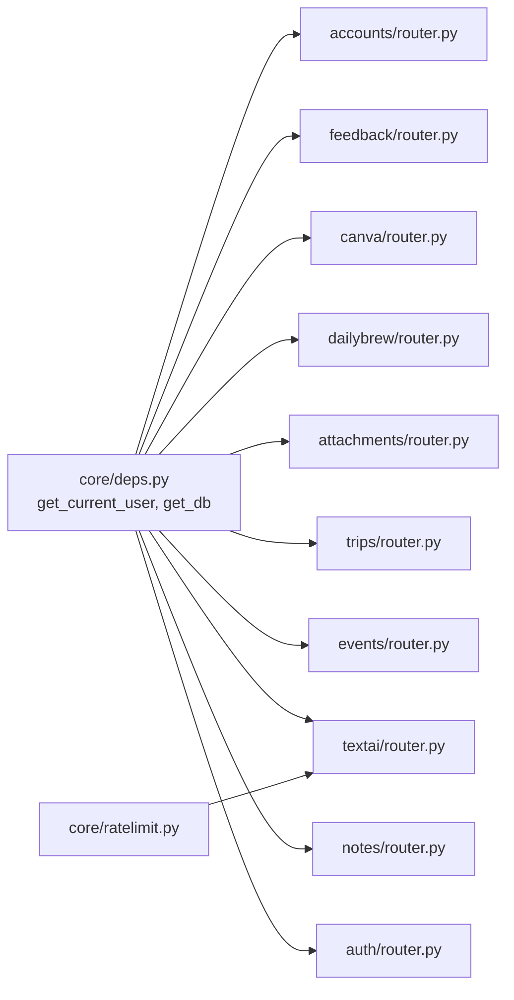

# API Reference

<cite>
**Referenced Files in This Document**
- [server.py](file://server.py)
- [auth/router.py](file://auth/router.py)
- [auth/schemas.py](file://auth/schemas.py)
- [core/deps.py](file://core/deps.py)
- [core/ratelimit.py](file://core/ratelimit.py)
- [notes/router.py](file://notes/router.py)
- [notes/schemas.py](file://notes/schemas.py)
- [events/router.py](file://events/router.py)
- [events/schemas.py](file://events/schemas.py)
- [textai/router.py](file://textai/router.py)
- [textai/schemas.py](file://textai/schemas.py)
- [trips/router.py](file://trips/router.py)
- [trips/schemas.py](file://trips/schemas.py)
- [reminders/router.py](file://reminders/router.py)
- [accounts/router.py](file://accounts/router.py)
- [feedback/router.py](file://feedback/router.py)
- [canva/router.py](file://canva/router.py)
- [dailybrew/router.py](file://dailybrew/router.py)
- [attachments/router.py](file://attachments/router.py)
</cite>

## Table of Contents
1. Introduction
2. Project Structure
3. Core Components
4. Architecture Overview
5. Detailed Component Analysis
6. Dependency Analysis
7. Performance Considerations
8. Troubleshooting Guide
9. Conclusion
10. Appendices

## Introduction
This document provides comprehensive API documentation for the Nueco Backend. It covers all public endpoints under the /api base path, including authentication, notes, events, trips, text AI (transcription and processing), attachments, daily news, Canva integration, feedback, account management, push notifications internals, and health checks. For each endpoint group, you will find HTTP methods, URL patterns, request/response schemas, authentication requirements, validation rules, error responses, rate limiting, security considerations, and practical examples.

## Project Structure
The application is a FastAPI service with modular routers grouped by feature:
- Authentication and user session management
- Notes, Events, Trips (core domain data)
- Text AI (transcription and text processing)
- Attachments (presigned uploads/downloads)
- Daily Brew (news sources and headlines)
- Canva integration (OAuth flow and design export)
- Feedback and Account management
- Internal reminders tick endpoints
- Health and static assets

**Diagram sources**
- [server.py:20-214](file://server.py#L20-L214)
- [auth/router.py:20-366](file://auth/router.py#L20-L366)
- [notes/router.py:10-100](file://notes/router.py#L10-L100)
- [events/router.py:16-111](file://events/router.py#L16-L111)
- [textai/router.py:51-163](file://textai/router.py#L51-L163)
- [attachments/router.py:19-82](file://attachments/router.py#L19-L82)
- [dailybrew/router.py:12-102](file://dailybrew/router.py#L12-L102)
- [canva/router.py:13-116](file://canva/router.py#L13-L116)
- [feedback/router.py:8-26](file://feedback/router.py#L8-L26)
- [accounts/router.py:8-25](file://accounts/router.py#L8-L25)
- [reminders/router.py:9-29](file://reminders/router.py#L9-L29)

**Section sources**
- [server.py:20-214](file://server.py#L20-L214)

## Core Components
- Authentication: JWT-based access tokens via Bearer Authorization header; refresh token flow; email verification; password reset/change; profile updates; sync status.
- Data domains: Notes, Events, Trips with CRUD operations and pagination.
- Text AI: Audio transcription (file upload or base64), text processing (organize/summarize/smart-format), voice intent classification.
- Attachments: Presigned S3 upload/download URLs with quota and type enforcement.
- Daily Brew: News sources, search, outlets, custom feeds, and personalized headlines.
- Canva: OAuth connect/callback/status/disconnect, list designs, create/export, check export status.
- Feedback: Submit feedback with rate limiting and input validation.
- Accounts: Delete account with password confirmation.
- Internal reminders: Secret-gated cron-like ticks to process reminders and receipts.
- Health and static: Health check, APK download page, privacy/terms pages, robots.txt.

Authentication and authorization:
- All protected endpoints require Authorization: Bearer <access_token>.
- Tokens are validated against sessions; invalid/expired tokens return 401.
- Internal endpoints use X-Tick-Secret header instead of user auth.

Rate limiting:
- Auth endpoints have per-IP and per-email limits for signup/login/reset.
- Text AI endpoints enforce per-user and global quotas with Retry-After on 429.

Security:
- Input validation via Pydantic models.
- Size caps for wrapped keys and feature event metadata.
- CORS configured with allowed origins and headers.
- Anti-crawler middleware blocks known AI crawler User-Agents and sets noindex/noai headers.

**Section sources**
- [core/deps.py:24-51](file://core/deps.py#L24-L51)
- [auth/router.py:22-84](file://auth/router.py#L22-L84)
- [core/ratelimit.py:1-124](file://core/ratelimit.py#L1-L124)
- [server.py:75-123](file://server.py#L75-L123)
- [server.py:310-330](file://server.py#L310-L330)

## Architecture Overview
The server mounts multiple routers under /api. Protected routes depend on get_current_user which validates the Bearer token and resolves the current user. Text AI routes additionally enforce AI quotas before calling external services.

**Diagram sources**
- [auth/router.py:115-140](file://auth/router.py#L115-L140)
- [auth/schemas.py:12-16](file://auth/schemas.py#L12-L16)
- [auth/schemas.py:66-70](file://auth/schemas.py#L66-L70)

**Section sources**
- [server.py:20-214](file://server.py#L20-L214)
- [core/deps.py:24-51](file://core/deps.py#L24-L51)

## Detailed Component Analysis

### Authentication API (/api/auth)
Endpoints:
- POST /api/auth/signup
  - Request: name, email, password, confirm_password
  - Response: message, success
  - Validation: passwords match; password length >= 8; email format
  - Rate limit: 3 signups per IP per hour
  - Errors: 400 validation errors, 429 too many attempts
- POST /api/auth/login
  - Request: email, password, device_name, platform
  - Response: user, access_token, refresh_token, token_type
  - Rate limit: 5 attempts per email per minute; 10 per IP per minute
  - Errors: 401 invalid credentials, 403 needs verification, 429 too many attempts
- GET /api/auth/verify-email/{token}
  - Returns HTML page indicating success/failure and deep link into app
- POST /api/auth/forgot-password
  - Request: email
  - Response: message, success
  - Rate limit: 3 resets per email per hour; 5 per IP per hour
  - Errors: 429 too many attempts
- POST /api/auth/reset-password
  - Request: token, new_password, confirm_password
  - Response: message, success
  - Validation: passwords match; password length >= 8
  - Errors: 400 validation errors
- POST /api/auth/resend-verification
  - Request: email
  - Response: message, success
  - Errors: 400 if email not found or already verified
- POST /api/auth/delete-unverified
  - Request: email
  - Response: message, success
  - Errors: 400 if deletion failed
- POST /api/auth/change-password
  - Requires: Authorization: Bearer <access_token>
  - Request: current_password, new_password, confirm_password
  - Response: message, success
  - Validation: passwords match; password length >= 8
  - Errors: 400 validation errors
- POST /api/auth/refresh
  - Request: refresh_token
  - Response: user, access_token, refresh_token, token_type
  - Errors: 401 invalid refresh token
- POST /api/auth/logout
  - Request: refresh_token
  - Response: message, success
  - Errors: 401 invalid token
- GET /api/auth/me
  - Requires: Authorization: Bearer <access_token>
  - Response: user profile fields
- PUT /api/auth/me
  - Requires: Authorization: Bearer <access_token>
  - Request: name, enc_version (optional)
  - Response: updated user profile
- PUT /api/auth/me/news-preferences
  - Requires: Authorization: Bearer <access_token>
  - Request: country, outlet_ids, show_verse, show_quote
  - Response: updated user profile
- GET /api/auth/sync-status
  - Requires: Authorization: Bearer <access_token>
  - Response: notes_count, synced, user_name

Common headers:
- Authorization: Bearer <access_token> for protected endpoints

Error handling:
- 400: Validation failures
- 401: Invalid/expired token or incorrect credentials
- 403: Needs verification
- 429: Too many requests (rate limited)

Examples:
- Create account: POST /api/auth/signup with JSON body containing name, email, password, confirm_password
- Login: POST /api/auth/login with JSON body containing email, password, device_name, platform
- Refresh token: POST /api/auth/refresh with JSON body containing refresh_token

**Section sources**
- [auth/router.py:93-366](file://auth/router.py#L93-L366)
- [auth/schemas.py:6-80](file://auth/schemas.py#L6-L80)

### Notes API (/api/notes)
Endpoints:
- POST /api/notes
  - Requires: Authorization: Bearer <access_token>
  - Request: NoteCreate schema (title, content, tags, is_pinned, linked_event_id deprecated, linked_event_ids, images base64, attachments, objects, enc_version optional, created_at optional, updated_at optional)
  - Response: NoteResponse
  - Validation: payload size enforced; E2EE fields supported
  - Errors: 413 payload too large, 401 unauthorized
- GET /api/notes
  - Query: page (>=1), page_size (1..100)
  - Requires: Authorization: Bearer <access_token>
  - Response: List[NoteResponse]
- GET /api/notes/{note_id}
  - Requires: Authorization: Bearer <access_token>
  - Response: NoteResponse
  - Errors: 404 not found
- PUT /api/notes/{note_id}
  - Requires: Authorization: Bearer <access_token>
  - Request: NoteUpdate schema (partial fields)
  - Response: NoteResponse
  - Errors: 404 not found, 413 payload too large
- DELETE /api/notes/{note_id}
  - Requires: Authorization: Bearer <access_token>
  - Response: {message: "Note deleted"}
  - Errors: 404 not found
- POST /api/notes/{note_id}/toggle-pin
  - Requires: Authorization: Bearer <access_token>
  - Response: NoteResponse
  - Errors: 404 not found

Data model highlights:
- Tags: name, color
- ImageObject: id, type, local_uri, remote_url, key, intrinsic_width, intrinsic_height, x, y, scale, rotation, z, upload_status
- E2EE: enc_version indicates client-side encryption for title/content/tags

Example:
- Create encrypted note: POST /api/notes with enc_version set and ciphertext in title/content/tags

**Section sources**
- [notes/router.py:17-100](file://notes/router.py#L17-L100)
- [notes/schemas.py:7-100](file://notes/schemas.py#L7-L100)

### Events API (/api/events)
Endpoints:
- POST /api/events
  - Requires: Authorization: Bearer <access_token>
  - Request: EventCreate schema (title, description, location, start_time, end_time, all_day, linked_note_ids, reminder_minutes, device_calendar_event_id, enc_version optional, recurrence optional, timezone optional, trip_id optional, google_* fields optional, updated_at optional)
  - Response: EventResponse
  - Validation: payload size enforced; recurrence constraints
  - Errors: 413 payload too large, 401 unauthorized
- GET /api/events
  - Query: month, year, page (>=1), page_size (1..MAX_EVENTS_PAGE_SIZE)
  - Requires: Authorization: Bearer <access_token>
  - Response: List[EventResponse]
- GET /api/events/{event_id}
  - Requires: Authorization: Bearer <access_token>
  - Response: EventResponse
  - Errors: 404 not found
- POST /api/events/batch
  - Requires: Authorization: Bearer <access_token>
  - Request: BatchEventIds {event_ids: List[str]}
  - Response: List[EventResponse]
- PUT /api/events/{event_id}
  - Requires: Authorization: Bearer <access_token>
  - Request: EventUpdate schema (partial fields)
  - Response: EventResponse
  - Errors: 404 not found, 413 payload too large
- DELETE /api/events/{event_id}
  - Requires: Authorization: Bearer <access_token>
  - Response: {message: "Event deleted"}
  - Errors: 404 not found

Recurrence:
- freq: daily|weekly|monthly|yearly
- byweekday: list of ints (0=Sunday..6=Saturday)
- until: ISO date string

Example:
- Schedule recurring event: POST /api/events with recurrence.freq="weekly", byweekday=[1], until="2025-12-31", timezone="Australia/Sydney"

**Section sources**
- [events/router.py:23-111](file://events/router.py#L23-L111)
- [events/schemas.py:5-101](file://events/schemas.py#L5-L101)

### Trips API (/api/trips)
Endpoints:
- POST /api/trips
  - Requires: Authorization: Bearer <access_token>
  - Request: TripCreate {name, description, enc_version optional}
  - Response: TripResponse
  - Errors: 413 payload too large
- GET /api/trips
  - Query: page (>=1), page_size (1..MAX_TRIPS_PAGE_SIZE)
  - Requires: Authorization: Bearer <access_token>
  - Response: List[TripResponse]
- GET /api/trips/{trip_id}
  - Requires: Authorization: Bearer <access_token>
  - Response: TripResponse
  - Errors: 404 not found
- PUT /api/trips/{trip_id}
  - Requires: Authorization: Bearer <access_token>
  - Request: TripUpdate {name?, description?, enc_version?}
  - Response: TripResponse
  - Errors: 404 not found, 413 payload too large
- DELETE /api/trips/{trip_id}
  - Requires: Authorization: Bearer <access_token>
  - Response: {message: "Trip deleted"}
  - Errors: 404 not found

**Section sources**
- [trips/router.py:23-96](file://trips/router.py#L23-L96)
- [trips/schemas.py:5-26](file://trips/schemas.py#L5-L26)

### Text AI API (/api/transcribe*, /api/process-text, /api/classify-voice-intent)
Endpoints:
- POST /api/transcribe-base64
  - Requires: Authorization: Bearer <access_token>
  - Request: TranscribeBase64Request {audio_base64, file_extension default m4a, language optional, diarization optional}
  - Response: {text, words?}
  - Quota: TRANSCRIBE_QUOTA (per-user); global AI quota applies
  - Errors: 400 invalid base64, 429 rate limited (Retry-After), 500 transcription failed
- POST /api/transcribe
  - Requires: Authorization: Bearer <access_token>
  - Request: multipart/form-data with file, language optional
  - Response: {text, words?}
  - Quota: TRANSCRIBE_QUOTA; global AI quota applies
  - Errors: 429 rate limited (Retry-After), 500 transcription failed
- POST /api/process-text
  - Requires: Authorization: Bearer <access_token>
  - Request: TextProcessRequest {text, action} where action in organize|summarize|smart_format
  - Response: TextProcessResponse {text, note_type?}
  - Quota: TEXT_PROCESS_QUOTA; global AI quota applies
  - Errors: 400 invalid action, 500 parse/empty response
- POST /api/classify-voice-intent
  - Requires: Authorization: Bearer <access_token>
  - Request: VoiceIntentClassifyRequest {transcript, reference_date, timezone}
  - Response: VoiceIntentClassifyResponse {intent, trip_name?, events[]}
  - Quota: VOICE_INTENT_QUOTA; global AI quota applies
  - Errors: 500 parse/empty response

Quotas and rate limiting:
- Per-user quotas: transcribe (10/min), voice-intent (20/min), text-process (15/min)
- Global quota: 120/min shared across users
- On 429, include Retry-After header indicating seconds to wait

Examples:
- Transcribe audio file: POST /api/transcribe with multipart file and optional language
- Process text: POST /api/process-text with action="smart_format" to classify note type
- Classify voice intent: POST /api/classify-voice-intent with transcript and timezone

**Section sources**
- [textai/router.py:75-163](file://textai/router.py#L75-L163)
- [textai/schemas.py:6-143](file://textai/schemas.py#L6-L143)
- [core/ratelimit.py:98-124](file://core/ratelimit.py#L98-L124)

### Attachments API (/api/attachments)
Endpoints:
- POST /api/attachments/presign
  - Requires: Authorization: Bearer <access_token>
  - Request: PresignRequest {filename, mime_type, size}
  - Response: presigned upload URL details
  - Validation: file type allowed; size within limits; storage quota checked
  - Errors: 400 invalid type/size/quota, 503 storage disabled, 502 storage error, 507 quota exceeded
- DELETE /api/attachments
  - Query: key
  - Requires: Authorization: Bearer <access_token>
  - Response: {message: "Attachment deleted"}
  - Errors: 403 access denied, 503 storage disabled, 502 storage error
- POST /api/attachments/download-url
  - Requires: Authorization: Bearer <access_token>
  - Request: DownloadUrlRequest {key}
  - Response: {url}
  - Errors: 403 access denied, 503 storage disabled, 502 storage error

Usage:
- Upload: Use presign endpoint to obtain upload URL, then upload directly to storage
- Download: Use download-url endpoint to obtain temporary signed URL

**Section sources**
- [attachments/router.py:28-82](file://attachments/router.py#L28-L82)

### Daily Brew API (/api/dailybrew)
Endpoints:
- GET /api/dailybrew/news-sources
  - Query: country (required)
  - Requires: Authorization: Bearer <access_token>
  - Response: NewsSourceResponse {country, outlets[]}
- GET /api/dailybrew/search-feeds
  - Query: q (required)
  - Requires: Authorization: Bearer <access_token>
  - Response: SearchFeedsResponse {outlets[]}
- GET /api/dailybrew/outlets
  - Query: ids (comma-separated outlet ids)
  - Requires: Authorization: Bearer <access_token>
  - Response: SearchFeedsResponse {outlets[]}
- POST /api/dailybrew/custom-feed
  - Requires: Authorization: Bearer <access_token>
  - Request: AddCustomFeedRequest {feed_url}
  - Response: OutletInfo {id, name, description, topics}
  - Errors: 400 invalid feed URL
- GET /api/dailybrew/news
  - Requires: Authorization: Bearer <access_token>
  - Response: NewsHeadlinesResponse {items[]}

Notes:
- Custom feeds are validated live before saving
- Headlines are personalized based on user preferences and custom feeds

**Section sources**
- [dailybrew/router.py:15-102](file://dailybrew/router.py#L15-L102)

### Canva Integration API (/api/canva)
Endpoints:
- GET /api/canva/connect
  - Requires: Authorization: Bearer <access_token>
  - Response: CanvaConnectResponse {authorize_url}
- GET /api/canva/callback
  - Query: code, state, error
  - No auth required; called by Canva OAuth redirect
  - Redirects to app deep link on success/failure
- GET /api/canva/status
  - Requires: Authorization: Bearer <access_token>
  - Response: CanvaStatusResponse
- DELETE /api/canva/disconnect
  - Requires: Authorization: Bearer <access_token>
  - Response: {success: true}
- GET /api/canva/designs
  - Query: query, continuation
  - Requires: Authorization: Bearer <access_token>
  - Response: CanvaDesignsResponse
  - Errors: 409 not connected
- POST /api/canva/designs/{design_id}/export
  - Requires: Authorization: Bearer <access_token>
  - Response: CanvaExportCreateResponse
  - Errors: 409 export failed
- GET /api/canva/exports/{job_id}
  - Requires: Authorization: Bearer <access_token>
  - Response: CanvaExportStatusResponse
  - Errors: 409 could not check status

Flow:
- Connect: Obtain authorize_url, open in-app browser, complete OAuth
- Callback: Canva redirects here; backend exchanges code and redirects back to app scheme
- Export: Create export job and poll status

**Section sources**
- [canva/router.py:29-116](file://canva/router.py#L29-L116)

### Feedback API (/api/feedback)
Endpoints:
- POST /api/feedback
  - Requires: Authorization: Bearer <access_token>
  - Request: FeedbackCreate {text, sentiment}
  - Response: submission result
  - Validation: sentiment must be valid; text length within limits
  - Errors: 400 invalid sentiment/text too long, 429 too many submissions

**Section sources**
- [feedback/router.py:11-26](file://feedback/router.py#L11-L26)

### Accounts API (/api/account)
Endpoints:
- POST /api/account/delete
  - Requires: Authorization: Bearer <access_token>
  - Request: DeleteAccountRequest {password}
  - Response: {ok: true}
  - Errors: 401 incorrect password, 404 user not found

**Section sources**
- [accounts/router.py:11-25](file://accounts/router.py#L11-L25)

### Internal Reminders API (/api/internal/push)
Endpoints:
- POST /api/internal/push/tick
  - Header: X-Tick-Secret must match server secret
  - Response: tick execution result
  - Errors: 403 forbidden if secret missing/mismatch
- POST /api/internal/push/receipts
  - Header: X-Tick-Secret must match server secret
  - Response: receipts resolution result
  - Errors: 403 forbidden if secret missing/mismatch

Purpose:
- Cron-like triggers for reminder delivery and receipt reconciliation

**Section sources**
- [reminders/router.py:12-29](file://reminders/router.py#L12-L29)

### Crypto and Feature Events (/api/crypto, /api/events)
Endpoints:
- PUT /api/crypto/wrapped-key
  - Requires: Authorization: Bearer <access_token>
  - Request: WrappedKeyPut {wrapped_by_password, wrapped_by_recovery, kdf_salt, recovery_salt, kdf, kdf_params, enc_version}
  - Response: {message: "stored"}
  - Validation: blob size caps enforced
  - Errors: 413 blob too large
- GET /api/crypto/wrapped-key
  - Requires: Authorization: Bearer <access_token>
  - Response: WrappedKeyResponse
  - Errors: 404 no key escrow
- POST /api/events/feature
  - Requires: Authorization: Bearer <access_token>
  - Request: FeatureEvent {event, meta}
  - Response: {ok: true}
  - Validation: event name length cap; meta size cap
  - Errors: 400 invalid event/meta

Purpose:
- Store opaque wrapped encryption keys for E2EE
- Record metadata-only feature usage events

**Section sources**
- [server.py:56-123](file://server.py#L56-L123)

### Health and Static Assets
Endpoints:
- GET /api/health
  - Response: {status: "healthy", timestamp}
- GET /download
  - HTML page to download staging APK
  - Errors: 404 if APK not available
- GET /download/nueco-staging.apk
  - Binary file download
  - Errors: 404 if APK not available
- GET /privacy
  - HTML privacy policy
  - Errors: 404 if not available
- GET /terms
  - HTML terms of use
  - Errors: 404 if not available
- GET /robots.txt
  - Plain text robots directive
  - Errors: 404 if not available

**Section sources**
- [server.py:170-295](file://server.py#L170-L295)

## Dependency Analysis
- Routers depend on core dependencies for DB access and current user resolution.
- Text AI router depends on rate limiter to protect shared OpenAI quota.
- Notes, Events, Trips routers depend on their respective services for persistence and business logic.
- Attachments router uses async-to-thread for sync storage calls to avoid blocking event loop.
- Daily Brew and Canva routers integrate with external services and user preferences.

**Diagram sources**
- [core/deps.py:15-51](file://core/deps.py#L15-L51)
- [core/ratelimit.py:96-124](file://core/ratelimit.py#L96-L124)
- [auth/router.py:16-20](file://auth/router.py#L16-L20)
- [notes/router.py:6-8](file://notes/router.py#L6-L8)
- [events/router.py:6-14](file://events/router.py#L6-L14)
- [textai/router.py:8-14](file://textai/router.py#L8-L14)
- [attachments/router.py:7-17](file://attachments/router.py#L7-L17)
- [dailybrew/router.py:6-10](file://dailybrew/router.py#L6-L10)
- [canva/router.py:6-11](file://canva/router.py#L6-L11)
- [feedback/router.py:4-6](file://feedback/router.py#L4-L6)
- [accounts/router.py:4-6](file://accounts/router.py#L4-L6)

**Section sources**
- [core/deps.py:15-51](file://core/deps.py#L15-L51)
- [core/ratelimit.py:96-124](file://core/ratelimit.py#L96-L124)

## Performance Considerations
- Database indexes are created at startup to optimize queries for notes, events, trips, push tokens, users, sessions, devices, and telemetry.
- Pagination parameters are enforced to prevent excessive data transfer.
- Attachment operations run in threads to avoid blocking the event loop during sync storage calls.
- AI quotas protect shared provider quotas and provide Retry-After guidance to clients.
- Stale indexes are dropped explicitly to maintain performance over time.

[No sources needed since this section provides general guidance]

## Troubleshooting Guide
Common errors and handling:
- 400 Bad Request: Validation errors (e.g., mismatched passwords, invalid actions, invalid sentiment, payload too large)
- 401 Unauthorized: Missing/invalid/expired token or incorrect credentials
- 403 Forbidden: Needs verification or internal secret mismatch
- 404 Not Found: Resource not found (notes, events, trips, crypto key escrow)
- 409 Conflict: Canva not connected or export failed
- 413 Payload Too Large: Notes/events/trips payloads exceed limits; wrapped key blobs too large
- 429 Too Many Requests: Rate limited (auth or AI quotas); includes Retry-After header for AI endpoints
- 500 Internal Server Error: Unexpected failures in transcription or text processing
- 502 Bad Gateway: Storage errors in attachments
- 503 Service Unavailable: Storage disabled or not enabled
- 507 Insufficient Storage: Attachment quota exceeded

Debugging approaches:
- Check Authorization header format and token validity
- Validate request schemas against documented fields
- Review rate limit headers and retry strategies
- Inspect logs for transcription and text processing errors
- Verify environment variables for storage and external services

**Section sources**
- [auth/router.py:93-366](file://auth/router.py#L93-L366)
- [notes/router.py:17-100](file://notes/router.py#L17-L100)
- [events/router.py:23-111](file://events/router.py#L23-L111)
- [textai/router.py:75-163](file://textai/router.py#L75-L163)
- [attachments/router.py:28-82](file://attachments/router.py#L28-L82)
- [canva/router.py:29-116](file://canva/router.py#L29-L116)

## Conclusion
The Nueco Backend provides a comprehensive REST API covering authentication, core data domains (notes, events, trips), AI-powered transcription and text processing, attachments, daily news, Canva integration, feedback, account management, and internal reminder processing. Endpoints are secured with JWT tokens, validated with strict schemas, and protected by rate limiting and quotas. The architecture emphasizes security, performance, and scalability through careful indexing, threading for sync operations, and robust error handling.

[No sources needed since this section summarizes without analyzing specific files]

## Appendices

### Authentication Methods
- Bearer Token: Include Authorization: Bearer <access_token> in all protected endpoints
- Refresh Flow: Use POST /api/auth/refresh with refresh_token to obtain new access_token
- Logout: Invalidate session with POST /api/auth/logout

### Versioning and Deprecation
- No explicit version prefix in URLs; endpoints are mounted under /api
- Deprecated fields: linked_event_id in notes is deprecated in favor of linked_event_ids
- Behavior changes are handled gracefully with optional fields and fallbacks

### Security Considerations
- Input validation via Pydantic models
- Size caps for sensitive payloads (wrapped keys, feature event metadata)
- CORS configuration restricts origins and headers
- Anti-crawler middleware blocks known AI crawlers and sets noindex/noai headers
- E2EE support with enc_version for notes, events, trips, and user names

[No sources needed since this section provides general guidance]