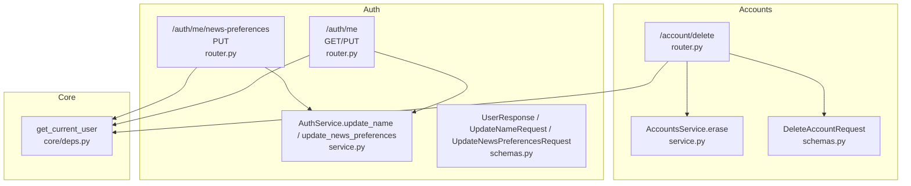
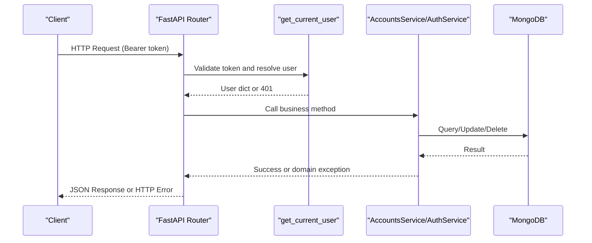
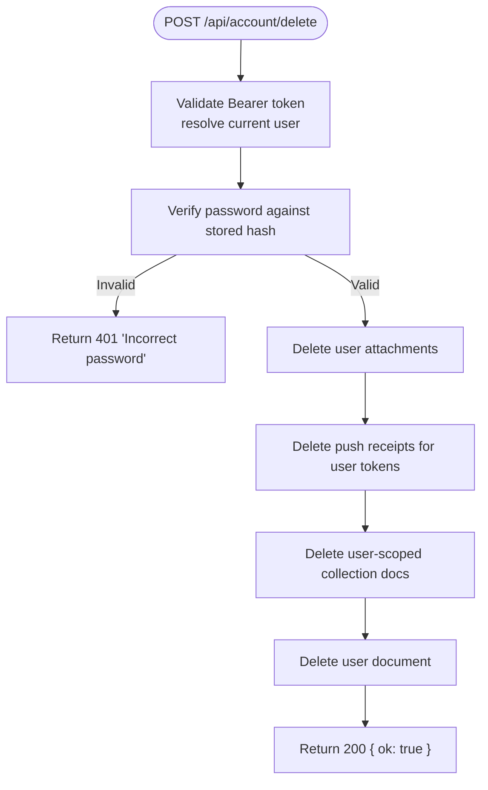
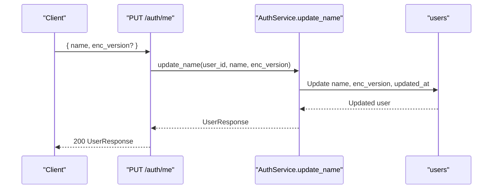
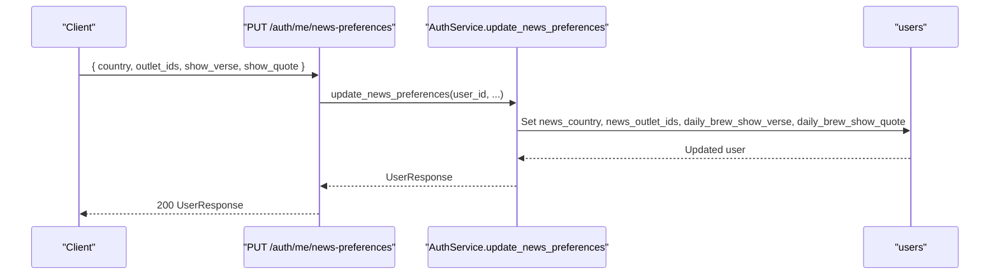
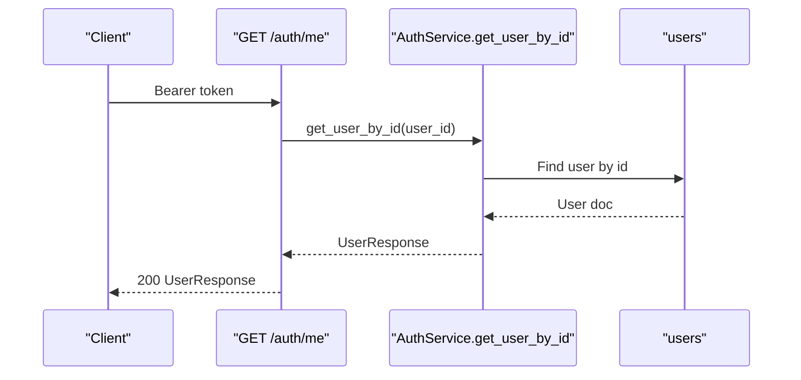
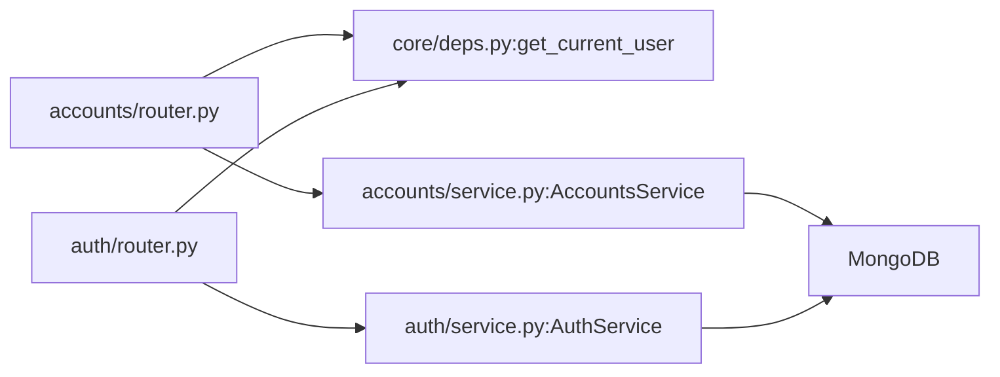

# Accounts API

<cite>
**Referenced Files in This Document**
- [accounts/router.py](file://accounts/router.py)
- [accounts/schemas.py](file://accounts/schemas.py)
- [accounts/service.py](file://accounts/service.py)
- [auth/router.py](file://auth/router.py)
- [auth/schemas.py](file://auth/schemas.py)
- [auth/service.py](file://auth/service.py)
- [core/deps.py](file://core/deps.py)
</cite>

## Table of Contents
1. [Introduction](#introduction)
2. [Project Structure](#project-structure)
3. [Core Components](#core-components)
4. [Architecture Overview](#architecture-overview)
5. [Detailed Component Analysis](#detailed-component-analysis)
6. [Dependency Analysis](#dependency-analysis)
7. [Performance Considerations](#performance-considerations)
8. [Troubleshooting Guide](#troubleshooting-guide)
9. [Conclusion](#conclusion)
10. [Appendices](#appendices)

## Introduction
This document provides comprehensive API documentation for account management endpoints related to user profiles, settings, and account lifecycle operations. It covers authentication requirements, request/response schemas, validation rules, privacy considerations, error responses, and recovery procedures. The focus is on:
- Profile updates (display name and E2EE metadata)
- Settings management (Daily Brew news preferences)
- Account deletion (GDPR-compliant erasure)
- Authentication flows that enable these operations

## Project Structure
The account-related functionality spans two modules:
- accounts: Implements GDPR account erasure with a dedicated endpoint and service logic
- auth: Implements profile updates and settings management under /auth/me* routes

**Diagram sources**
- [accounts/router.py:1-25](file://accounts/router.py#L1-L25)
- [accounts/service.py:56-108](file://accounts/service.py#L56-L108)
- [accounts/schemas.py:1-6](file://accounts/schemas.py#L1-L6)
- [auth/router.py:323-366](file://auth/router.py#L323-L366)
- [auth/service.py:92-105](file://auth/service.py#L92-L105)
- [auth/service.py:387-422](file://auth/service.py#L387-L422)
- [auth/schemas.py:40-80](file://auth/schemas.py#L40-L80)
- [core/deps.py:24-50](file://core/deps.py#L24-L50)

**Section sources**
- [accounts/router.py:1-25](file://accounts/router.py#L1-L25)
- [auth/router.py:323-366](file://auth/router.py#L323-L366)
- [core/deps.py:24-50](file://core/deps.py#L24-L50)

## Core Components
- Account deletion endpoint: POST /api/account/delete
  - Requires authenticated user via Bearer token
  - Validates password confirmation
  - Erases all user-scoped data across collections and object storage
- Profile update endpoint: PUT /api/auth/me
  - Updates display name and optional E2EE version field
- News preferences endpoint: PUT /api/auth/me/news-preferences
  - Updates country, outlet IDs, and Daily Brew toggles
- Read profile endpoint: GET /api/auth/me
  - Returns current user profile including settings fields

Authentication is enforced by the shared dependency that validates access tokens and resolves the current user.

**Section sources**
- [accounts/router.py:11-24](file://accounts/router.py#L11-L24)
- [auth/router.py:323-366](file://auth/router.py#L323-L366)
- [core/deps.py:24-50](file://core/deps.py#L24-L50)

## Architecture Overview
The system uses FastAPI routers with dependency injection for authentication and database access. Business logic is separated into services that raise domain exceptions or return structured results. The accounts module focuses on irreversible GDPR erasure, while the auth module handles profile and settings updates.

**Diagram sources**
- [core/deps.py:24-50](file://core/deps.py#L24-L50)
- [accounts/service.py:60-88](file://accounts/service.py#L60-L88)
- [auth/service.py:387-422](file://auth/service.py#L387-L422)

## Detailed Component Analysis

### Account Deletion (POST /api/account/delete)
- Purpose: Permanently erase the authenticated user’s account and all associated data per GDPR Art. 17
- Authentication: Required (Bearer token)
- Request body schema: DeleteAccountRequest
  - password: string (required; used to confirm identity before erasure)
- Behavior:
  - Verifies the provided password against the stored hash
  - Deletes user attachments from object storage
  - Deletes push receipts linked to user’s devices
  - Deletes all documents in user-scoped collections by user_id
  - Deletes the user document itself
- Responses:
  - 200 OK: {"ok": true}
  - 401 Unauthorized: Incorrect password
  - 404 Not Found: User not found
- Notes:
  - Irreversible operation
  - Uses background-safe patterns to avoid blocking the event loop during CPU-bound hashing and I/O

**Diagram sources**
- [accounts/router.py:11-24](file://accounts/router.py#L11-L24)
- [accounts/service.py:60-88](file://accounts/service.py#L60-L88)
- [accounts/schemas.py:1-6](file://accounts/schemas.py#L1-L6)

**Section sources**
- [accounts/router.py:11-24](file://accounts/router.py#L11-L24)
- [accounts/service.py:60-88](file://accounts/service.py#L60-L88)
- [accounts/schemas.py:1-6](file://accounts/schemas.py#L1-L6)

### Profile Update (PUT /api/auth/me)
- Purpose: Update the account display name and optionally set an E2EE version marker
- Authentication: Required (Bearer token)
- Request body schema: UpdateNameRequest
  - name: string (required)
  - enc_version: integer or null (optional; indicates client-side encryption version when applicable)
- Behavior:
  - Updates the user’s name and enc_version fields
  - Updates timestamp
- Responses:
  - 200 OK: UserResponse with updated fields
  - 404 Not Found: User not found
- Validation:
  - Name must be present (enforced by Pydantic model)
  - enc_version is optional

**Diagram sources**
- [auth/router.py:328-340](file://auth/router.py#L328-L340)
- [auth/service.py:387-400](file://auth/service.py#L387-L400)
- [auth/schemas.py:40-65](file://auth/schemas.py#L40-L65)

**Section sources**
- [auth/router.py:328-340](file://auth/router.py#L328-L340)
- [auth/service.py:387-400](file://auth/service.py#L387-L400)
- [auth/schemas.py:40-65](file://auth/schemas.py#L40-L65)

### News Preferences Update (PUT /api/auth/me/news-preferences)
- Purpose: Manage Daily Brew “News from home” preferences and content toggles
- Authentication: Required (Bearer token)
- Request body schema: UpdateNewsPreferencesRequest
  - country: string (required)
  - outlet_ids: array of strings (default [])
  - show_verse: boolean (default False)
  - show_quote: boolean (default False)
- Behavior:
  - Persists country, outlet selection, and toggle flags
  - Updates timestamp
- Responses:
  - 200 OK: UserResponse with updated preference fields
  - 404 Not Found: User not found

**Diagram sources**
- [auth/router.py:342-356](file://auth/router.py#L342-L356)
- [auth/service.py:402-422](file://auth/service.py#L402-L422)
- [auth/schemas.py:44-65](file://auth/schemas.py#L44-L65)

**Section sources**
- [auth/router.py:342-356](file://auth/router.py#L342-L356)
- [auth/service.py:402-422](file://auth/service.py#L402-L422)
- [auth/schemas.py:44-65](file://auth/schemas.py#L44-L65)

### Read Profile (GET /api/auth/me)
- Purpose: Retrieve the current authenticated user’s profile and settings
- Authentication: Required (Bearer token)
- Response schema: UserResponse
  - id: string
  - email: string
  - name: string
  - enc_version: integer or null
  - email_verified: boolean
  - created_at: datetime
  - news_country: string or null
  - news_outlet_ids: array of strings
  - daily_brew_show_verse: boolean
  - daily_brew_show_quote: boolean
  - daily_brew_enabled: boolean

**Diagram sources**
- [auth/router.py:323-326](file://auth/router.py#L323-L326)
- [auth/service.py:462-467](file://auth/service.py#L462-L467)
- [auth/schemas.py:53-65](file://auth/schemas.py#L53-L65)

**Section sources**
- [auth/router.py:323-326](file://auth/router.py#L323-L326)
- [auth/service.py:462-467](file://auth/service.py#L462-L467)
- [auth/schemas.py:53-65](file://auth/schemas.py#L53-L65)

## Dependency Analysis
- Authentication dependency:
  - get_current_user enforces Bearer token presence and validity, decodes JWT, checks session binding, and returns the user document
- Database access:
  - get_db provides AsyncIOMotorDatabase instance
- Service layer:
  - AccountsService encapsulates GDPR erasure logic and interacts with multiple collections and external storage
  - AuthService encapsulates profile and settings updates, returning normalized response models

**Diagram sources**
- [core/deps.py:15-50](file://core/deps.py#L15-L50)
- [accounts/router.py:1-25](file://accounts/router.py#L1-L25)
- [auth/router.py:323-366](file://auth/router.py#L323-L366)
- [accounts/service.py:56-108](file://accounts/service.py#L56-L108)
- [auth/service.py:35-41](file://auth/service.py#L35-L41)

**Section sources**
- [core/deps.py:15-50](file://core/deps.py#L15-L50)
- [accounts/service.py:56-108](file://accounts/service.py#L56-L108)
- [auth/service.py:35-41](file://auth/service.py#L35-L41)

## Performance Considerations
- Password verification and hashing are CPU-bound; the code uses offloading to avoid blocking the event loop
- Object storage deletion for attachments is also offloaded to prevent long-running synchronous calls from stalling requests
- Bulk deletions across collections are performed sequentially but wrapped with logging to capture partial failures without aborting the entire process

[No sources needed since this section provides general guidance]

## Troubleshooting Guide
Common errors and handling:
- 401 Unauthorized: Missing or invalid Bearer token; ensure Authorization header is set correctly
- 401 Incorrect password: Account deletion requires correct password; verify credentials
- 404 Not Found: User not found; check user ID resolution and token validity
- 404 Not Found on profile/settings updates: Indicates user not found after token resolution; re-authenticate if necessary

Recovery procedures:
- For failed account deletion due to transient errors, retry the request; the service logs failures per collection but continues processing
- If profile or settings updates fail with 404, refresh your access token and retry

**Section sources**
- [accounts/router.py:11-24](file://accounts/router.py#L11-L24)
- [accounts/service.py:82-88](file://accounts/service.py#L82-L88)
- [auth/router.py:328-356](file://auth/router.py#L328-L356)
- [core/deps.py:24-50](file://core/deps.py#L24-L50)

## Conclusion
The Accounts API provides secure, authenticated endpoints for managing user profiles and settings, along with a robust, GDPR-compliant account deletion workflow. Authentication is enforced via Bearer tokens validated through a shared dependency. Profile updates and settings changes return normalized user responses, while account deletion performs comprehensive data erasure across collections and storage.

[No sources needed since this section summarizes without analyzing specific files]

## Appendices

### Authentication Requirements
- All account management endpoints require a valid Bearer token in the Authorization header
- Tokens are validated and bound to active sessions; expired or revoked tokens result in 401 responses

**Section sources**
- [core/deps.py:24-50](file://core/deps.py#L24-L50)

### Data Models and Schemas
- DeleteAccountRequest: password (string)
- UpdateNameRequest: name (string), enc_version (integer or null)
- UpdateNewsPreferencesRequest: country (string), outlet_ids (array of strings), show_verse (boolean), show_quote (boolean)
- UserResponse: id, email, name, enc_version, email_verified, created_at, news_country, news_outlet_ids, daily_brew_show_verse, daily_brew_show_quote, daily_brew_enabled

**Section sources**
- [accounts/schemas.py:1-6](file://accounts/schemas.py#L1-L6)
- [auth/schemas.py:40-80](file://auth/schemas.py#L40-L80)

### Privacy Considerations
- Account deletion permanently erases user data across all user-scoped collections and object storage
- Email verification and password reset flows include rate limiting and safeguards to protect user accounts
- Preference updates are scoped to the authenticated user and do not expose sensitive identifiers

**Section sources**
- [accounts/service.py:15-45](file://accounts/service.py#L15-L45)
- [auth/router.py:22-84](file://auth/router.py#L22-L84)