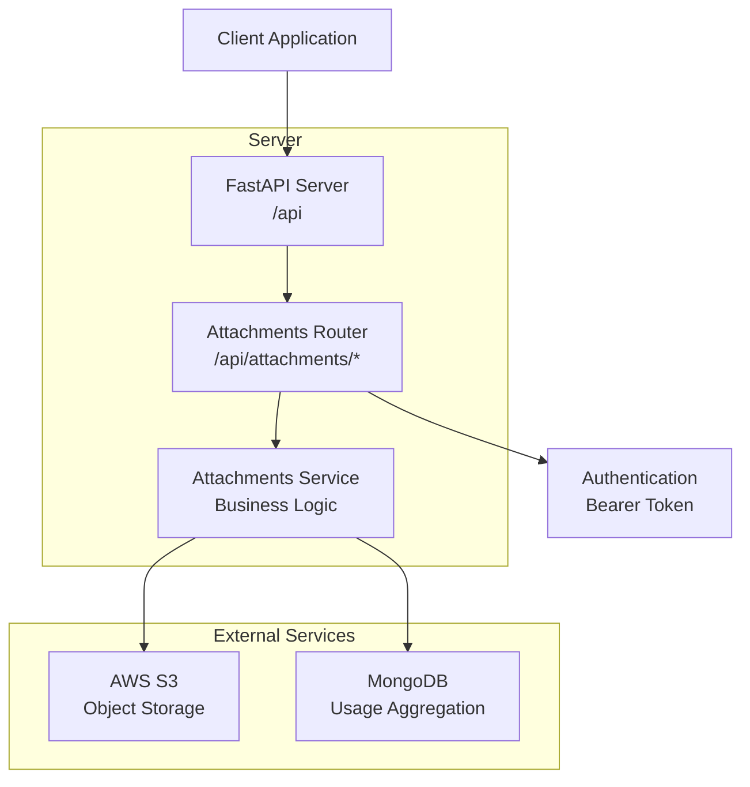
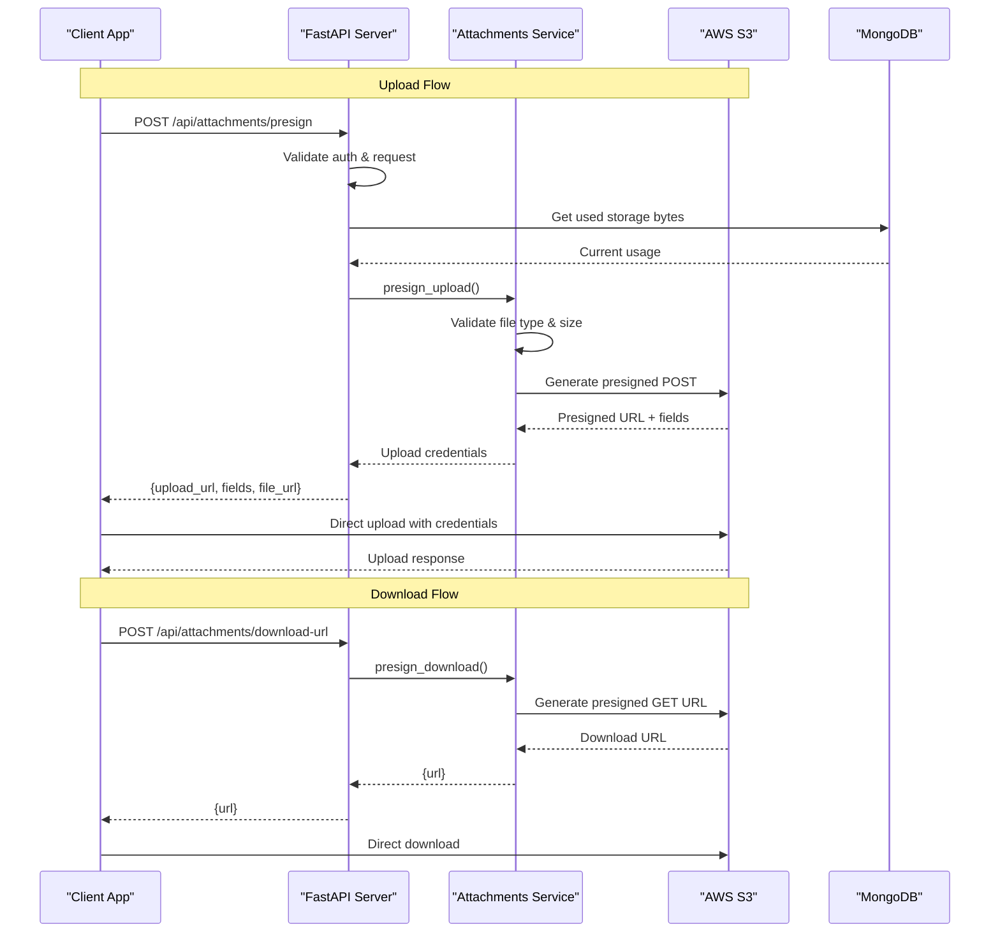
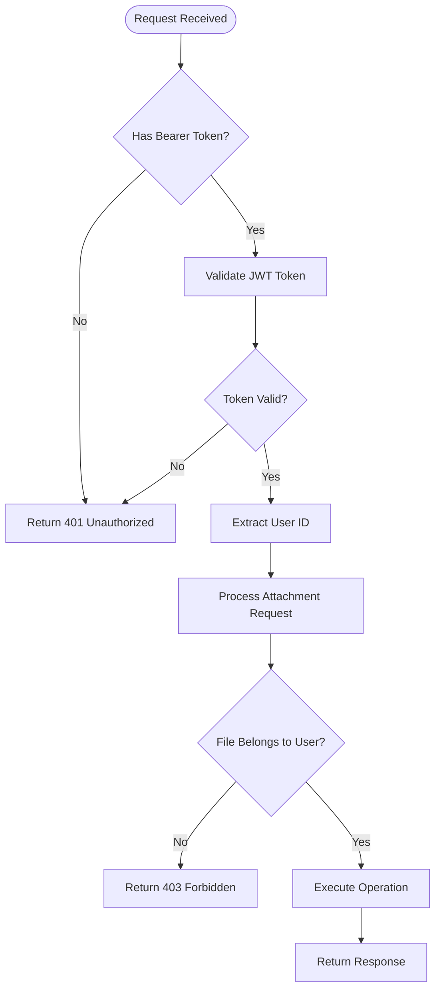
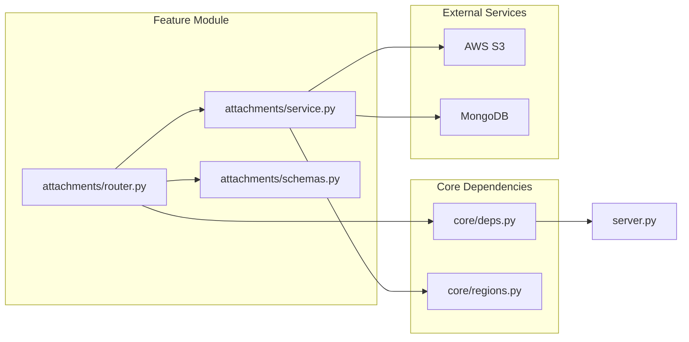

# Attachments API

<cite>
**Referenced Files in This Document**
- [server.py](file://server.py)
- [attachments/router.py](file://attachments/router.py)
- [attachments/schemas.py](file://attachments/schemas.py)
- [attachments/service.py](file://attachments/service.py)
- [core/deps.py](file://core/deps.py)
- [core/regions.py](file://core/regions.py)
</cite>

## Table of Contents
1. [Introduction](#introduction)
2. [Project Structure](#project-structure)
3. [Core Components](#core-components)
4. [Architecture Overview](#architecture-overview)
5. [Detailed Component Analysis](#detailed-component-analysis)
6. [Dependency Analysis](#dependency-analysis)
7. [Performance Considerations](#performance-considerations)
8. [Troubleshooting Guide](#troubleshooting-guide)
9. [Conclusion](#conclusion)
10. [Appendices](#appendices)

## Introduction
This document provides comprehensive API documentation for the Attachments endpoints that enable secure file uploads, downloads, and storage management via AWS S3. The API uses a presigned URL workflow to allow clients to upload directly to S3 while enforcing validation, access control, and quota limits on the server side. All attachment endpoints are mounted under /api/attachments and require authentication.

Key capabilities:
- Upload preparation via presigned POST (direct-to-S3 upload)
- Secure download via presigned GET URLs
- Attachment deletion with strict user-scoped access control
- Storage quota enforcement per account
- File type and size validation
- Data residency enforcement for AWS region configuration

## Project Structure
The attachments feature is implemented as a FastAPI router with clear separation between HTTP handling, request/response schemas, and business logic.



**Diagram sources**
- [server.py:210-211](file://server.py#L210-L211)
- [attachments/router.py:21-82](file://attachments/router.py#L21-L82)
- [attachments/service.py:86-173](file://attachments/service.py#L86-L173)

**Section sources**
- [server.py:210-211](file://server.py#L210-L211)
- [attachments/router.py:1-82](file://attachments/router.py#L1-L82)

## Core Components
The Attachments API consists of three main components working together:

### Authentication Layer
All attachment endpoints require authentication using Bearer tokens. The system validates user identity and ensures proper authorization before processing any attachment operations.

### Request Validation Layer
The API validates incoming requests including file metadata, size constraints, and MIME types before allowing any storage operations.

### Storage Management Layer
Handles direct communication with AWS S3 for file uploads, downloads, and deletions while maintaining security boundaries and access controls.

**Section sources**
- [core/deps.py:24-50](file://core/deps.py#L24-L50)
- [attachments/router.py:28-82](file://attachments/router.py#L28-L82)
- [attachments/service.py:86-173](file://attachments/service.py#L86-L173)

## Architecture Overview
The Attachments API follows a secure presigned URL architecture pattern that minimizes server load while maintaining strict security controls.



**Diagram sources**
- [attachments/router.py:28-82](file://attachments/router.py#L28-L82)
- [attachments/service.py:86-173](file://attachments/service.py#L86-L173)

## Detailed Component Analysis

### Authentication Requirements
All attachment endpoints require authentication via Bearer token in the Authorization header. The authentication system validates tokens and ensures users can only access their own files.

**Security Features:**
- Bearer token authentication required for all endpoints
- User-scoped file access control
- Strict prefix validation preventing cross-user access
- Session-based token validation with expiration handling

### Endpoint Specifications

#### POST /api/attachments/presign
Prepares a presigned URL for direct-to-S3 file uploads.

**Request Schema:**
```json
{
  "filename": "document.pdf",
  "mime_type": "application/pdf", 
  "size": 1048576
}
```

**Response Schema:**
```json
{
  "id": "attachment-id-uuid",
  "key": "note-attachments/user-id/attachment-id.ext",
  "upload_url": "https://bucket.s3.region.amazonaws.com/",
  "fields": {
    "Content-Type": "application/pdf",
    "policy": "...",
    "signature": "...",
    "x-amz-algorithm": "AWS4-HMAC-SHA256",
    "x-amz-credential": "...",
    "x-amz-date": "...",
    "x-amz-signature": "..."
  },
  "file_url": "https://bucket.s3.region.amazonaws.com/note-attachments/user-id/attachment-id.ext"
}
```

**Validation Rules:**
- File size must be positive and ≤ 100MB
- MIME type must be in allowed list
- File extension must be in allowed extensions
- Account storage quota must not be exceeded

**Error Responses:**
- 400 Bad Request: Invalid file type or size
- 401 Unauthorized: Missing or invalid authentication
- 503 Service Unavailable: S3 not configured
- 507 Insufficient Storage: Quota exceeded

#### DELETE /api/attachments?key=...
Deletes an attachment by its storage key.

**Query Parameters:**
- `key`: Full S3 object key (e.g., "note-attachments/user-id/attachment-id.ext")

**Response:**
```json
{
  "message": "Attachment deleted"
}
```

**Access Control:**
- Key must belong to authenticated user's namespace
- Prefix validation prevents unauthorized deletions

**Error Responses:**
- 403 Forbidden: Attempting to delete another user's file
- 503 Service Unavailable: S3 not configured
- 502 Bad Gateway: Storage operation failed

#### POST /api/attachments/download-url
Generates a presigned URL for downloading attachments.

**Request Schema:**
```json
{
  "key": "note-attachments/user-id/attachment-id.ext"
}
```

**Response Schema:**
```json
{
  "url": "https://bucket.s3.region.amazonaws.com/key?X-Amz-Algorithm=...&X-Amz-Credential=...&X-Amz-Signature=..."
}
```

**Access Control:**
- Key must belong to authenticated user's namespace
- Presigned URLs expire after 7 days

**Error Responses:**
- 403 Forbidden: Attempting to access another user's file
- 503 Service Unavailable: S3 not configured
- 502 Bad Gateway: Storage operation failed

### Supported File Types

#### Allowed MIME Types
- **Images**: image/jpeg, image/png, image/gif, image/webp, image/heic
- **Videos**: video/mp4, video/quicktime, video/webm, video/x-msvideo, video/x-matroska, video/3gpp
- **Audio**: audio/mpeg, audio/mp4, audio/x-m4a, audio/wav, audio/x-wav, audio/aac, audio/ogg, audio/webm
- **Documents**: application/pdf, text/plain, text/csv, application/msword, Microsoft Office formats

#### Allowed File Extensions
- **Images**: jpg, jpeg, png, gif, webp, heic
- **Videos**: mp4, mov, webm, avi, mkv, 3gp, m4v
- **Audio**: mp3, m4a, wav, aac, ogg, oga
- **Documents**: pdf, txt, csv, doc, docx, xls, xlsx, ppt, pptx

### Size Limitations
- **Per-file limit**: 100MB maximum
- **Account quota**: Configurable total storage limit (default 2GB)
- **Quota enforcement**: Checked before issuing presigned URLs

### AWS S3 Integration

#### Configuration Requirements
- `S3_BUCKET`: Name of the S3 bucket for storing attachments
- `AWS_REGION`: Must be set to Australian regions (ap-southeast-2 or ap-southeast-4)
- AWS credentials via environment variables or IAM roles

#### Security Features
- **Data Residency**: Enforced Australian region compliance
- **User Isolation**: Files stored under user-specific prefixes
- **Presigned URLs**: Time-limited access without exposing credentials
- **Direct Upload**: Files bypass application server for better performance

#### Storage Structure
```
note-attachments/
├── user-id-1/
│   ├── attachment-id-1.jpg
│   └── attachment-id-2.pdf
├── user-id-2/
│   └── attachment-id-3.mp4
```

### Access Control Mechanisms

#### User Scoping
- Each user's files are isolated under unique prefixes
- Key validation ensures users can only access their own files
- Cross-user access attempts are rejected with 403 errors

#### Authentication Flow


**Diagram sources**
- [core/deps.py:24-50](file://core/deps.py#L24-L50)
- [attachments/service.py:139-173](file://attachments/service.py#L139-L173)

### Error Handling

#### Common Error Scenarios
- **File Too Large**: Exceeds 100MB per-file limit
- **Unsupported File Type**: MIME type or extension not in allowed lists
- **Storage Quota Exceeded**: Account has reached total storage limit
- **Access Denied**: Attempting to access another user's files
- **Service Unavailable**: S3 storage not configured or unavailable
- **Storage Error**: S3 operation failures (network, permissions, etc.)

#### Error Response Format
```json
{
  "detail": "Human-readable error message"
}
```

## Dependency Analysis



**Diagram sources**
- [attachments/router.py:1-18](file://attachments/router.py#L1-L18)
- [attachments/service.py:1-13](file://attachments/service.py#L1-L13)
- [core/deps.py:1-51](file://core/deps.py#L1-L51)
- [core/regions.py:1-230](file://core/regions.py#L1-L230)

**Section sources**
- [attachments/router.py:1-18](file://attachments/router.py#L1-L18)
- [attachments/service.py:1-13](file://attachments/service.py#L1-L13)

## Performance Considerations

### Direct-to-S3 Uploads
The presigned URL approach allows files to be uploaded directly to S3, bypassing the application server. This reduces server load and improves upload performance for large files.

### Efficient Storage Quota Checking
Storage usage is calculated via MongoDB aggregation pipeline rather than fetching individual notes, minimizing database queries and network overhead.

### Asynchronous Processing
Heavy S3 operations are executed in background threads to prevent blocking the event loop, maintaining API responsiveness during file operations.

### Connection Pooling
Boto3 client connection pooling optimizes S3 API calls for better throughput and reduced latency.

## Troubleshooting Guide

### Common Issues and Solutions

#### S3 Not Configured
**Symptoms**: 503 Service Unavailable responses
**Solution**: Ensure S3_BUCKET environment variable is set and AWS credentials are properly configured

#### Authentication Failures
**Symptoms**: 401 Unauthorized errors
**Solution**: Verify Bearer token is present and valid in Authorization header

#### File Type Rejections
**Symptoms**: 400 Bad Request with "File type not allowed"
**Solution**: Check that both MIME type and file extension are in allowed lists

#### Storage Quota Exceeded
**Symptoms**: 507 Insufficient Storage errors
**Solution**: Delete existing attachments or increase MAX_TOTAL_ATTACHMENT_BYTES environment variable

#### Access Denied Errors
**Symptoms**: 403 Forbidden when accessing files
**Solution**: Ensure the file key belongs to the authenticated user's namespace

### Debugging Tips
- Enable detailed logging in attachments service module
- Check AWS CloudWatch logs for S3 operation errors
- Verify MongoDB aggregation pipeline for storage calculation
- Monitor CORS configuration if experiencing browser upload issues

## Conclusion
The Attachments API provides a secure, scalable solution for file management with robust validation, access control, and performance optimizations. The presigned URL architecture ensures efficient file transfers while maintaining strict security boundaries. The system enforces data residency requirements and provides comprehensive error handling for production deployments.

Key benefits:
- Secure file uploads with direct-to-S3 performance
- Comprehensive file type and size validation
- Per-user access isolation and quota management
- Australian data residency compliance
- Production-ready error handling and monitoring

## Appendices

### Environment Variables
- `S3_BUCKET`: S3 bucket name for attachment storage
- `MAX_TOTAL_ATTACHMENT_BYTES`: Total storage quota per account (default 2GB)
- `AWS_REGION`: Must be set to Australian region (ap-southeast-2 or ap-southeast-4)

### CORS Configuration
The API supports CORS with configurable allowed origins for browser-based uploads.

### GDPR Compliance
Automatic cleanup of user attachments during account deletion processes, supporting data erasure requirements.