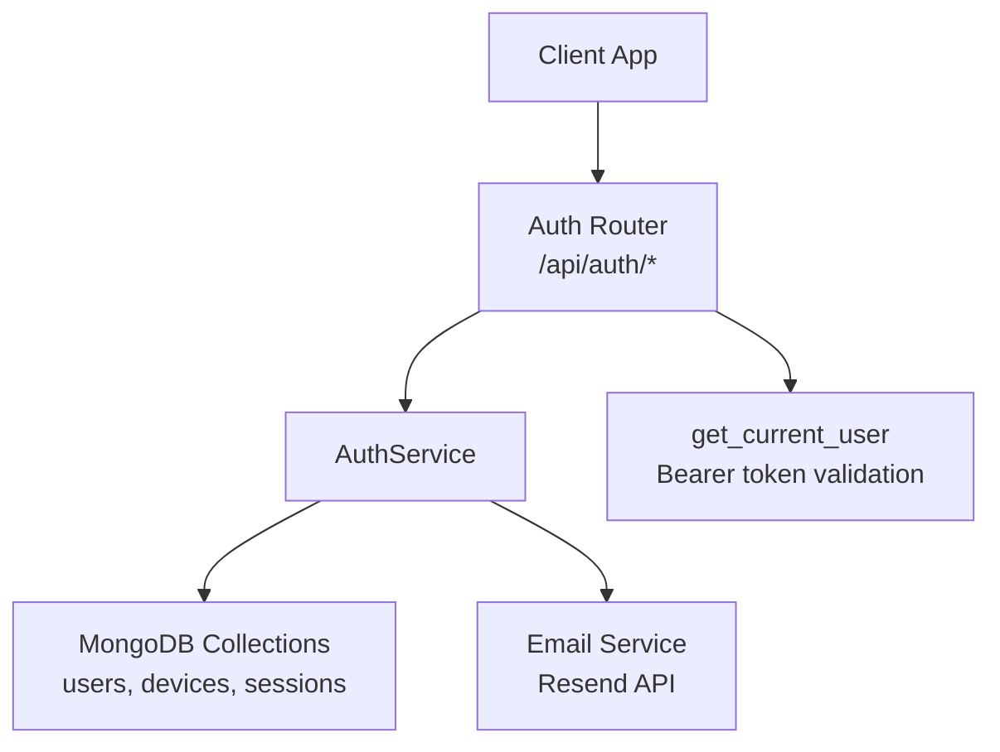
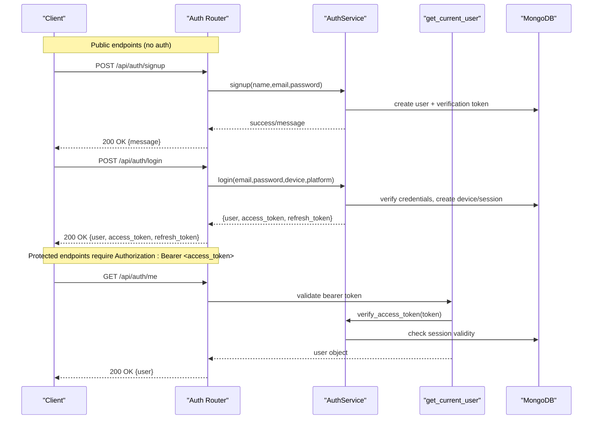
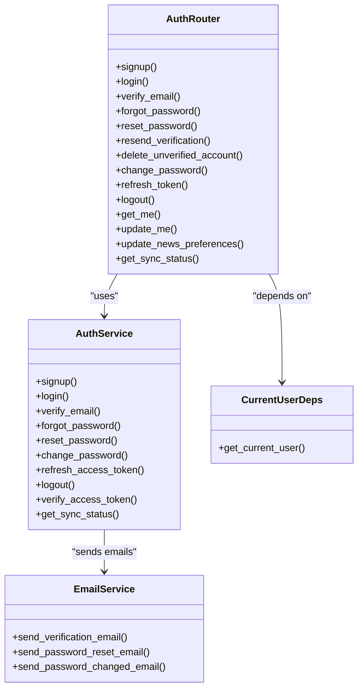

# Authentication API

<cite>
**Referenced Files in This Document**
- [router.py](file://auth/router.py)
- [schemas.py](file://auth/schemas.py)
- [service.py](file://auth/service.py)
- [deps.py](file://core/deps.py)
- [models.py](file://auth/models.py)
- [email_service.py](file://auth/email_service.py)
</cite>

## Table of Contents
1. [Introduction](#introduction)
2. [Project Structure](#project-structure)
3. [Core Components](#core-components)
4. [Architecture Overview](#architecture-overview)
5. [Detailed Component Analysis](#detailed-component-analysis)
6. [Dependency Analysis](#dependency-analysis)
7. [Performance Considerations](#performance-considerations)
8. [Troubleshooting Guide](#troubleshooting-guide)
9. [Conclusion](#conclusion)
10. [Appendices](#appendices)

## Introduction
This document provides comprehensive API documentation for the Authentication endpoints under /api/auth/*. It covers user registration, login, email verification, password management (forgot/reset/change), session handling (refresh/logout), and profile queries. It also documents JWT usage, required headers, authorization requirements, rate limiting rules, error responses, and common protocol-specific flows with examples.

## Project Structure
The authentication feature is implemented as a FastAPI router with request/response schemas, a service layer for business logic, shared dependencies for current-user resolution, and MongoDB models for users, devices, and sessions. Email delivery is handled via an email service module.

**Diagram sources**
- [router.py:20-366](file://auth/router.py#L20-L366)
- [service.py:35-506](file://auth/service.py#L35-L506)
- [deps.py:24-51](file://core/deps.py#L24-L51)
- [email_service.py:26-151](file://auth/email_service.py#L26-L151)

**Section sources**
- [router.py:20-366](file://auth/router.py#L20-L366)
- [schemas.py:1-80](file://auth/schemas.py#L1-L80)
- [service.py:35-506](file://auth/service.py#L35-L506)
- [deps.py:24-51](file://core/deps.py#L24-L51)
- [models.py:6-66](file://auth/models.py#L6-L66)
- [email_service.py:26-151](file://auth/email_service.py#L26-L151)

## Core Components
- Auth Router: Defines HTTP endpoints under /api/auth with request/response models and rate limiting.
- AuthService: Implements signup/login/password reset/verification, refresh/logout, and token verification.
- Schemas: Pydantic models for requests and responses.
- Dependencies: get_current_user validates Bearer tokens and resolves the authenticated user.
- Models: MongoDB document creators for users, devices, and sessions.
- Email Service: Sends verification, reset, and change notifications via Resend.

Key responsibilities:
- Enforce rate limits on sensitive endpoints.
- Validate inputs and enforce security constraints (password length, matching).
- Manage sessions and refresh tokens securely.
- Provide consistent error responses and status codes.

**Section sources**
- [router.py:22-84](file://auth/router.py#L22-L84)
- [service.py:24-105](file://auth/service.py#L24-L105)
- [schemas.py:6-80](file://auth/schemas.py#L6-L80)
- [deps.py:24-51](file://core/deps.py#L24-L51)
- [models.py:6-66](file://auth/models.py#L6-L66)
- [email_service.py:26-151](file://auth/email_service.py#L26-L151)

## Architecture Overview
Authentication uses short-lived access tokens bound to a session ID and long-lived refresh tokens stored hashed in sessions. Access tokens are validated by verifying signature, type, expiry, and active session existence. Refresh tokens allow obtaining new access tokens without re-authentication until the session expires or is revoked.

**Diagram sources**
- [router.py:93-140](file://auth/router.py#L93-L140)
- [router.py:323-326](file://auth/router.py#L323-L326)
- [service.py:202-273](file://auth/service.py#L202-L273)
- [service.py:469-494](file://auth/service.py#L469-L494)
- [deps.py:24-51](file://core/deps.py#L24-L51)

## Detailed Component Analysis

### Endpoints Reference

- POST /api/auth/signup
  - Purpose: Create a new account; sends verification email.
  - Request body: SignUpRequest
  - Response: MessageResponse
  - Rate limit: 3 signups per IP per hour
  - Errors: 400 (validation), 429 (rate limited)

- POST /api/auth/login
  - Purpose: Authenticate user and issue tokens.
  - Request body: LoginRequest
  - Response: AuthResponse
  - Rate limit: 5 login attempts per email per minute; 10 per IP per minute
  - Errors: 401 (invalid credentials), 403 (needs verification), 429 (rate limited)

- GET /api/auth/verify-email/{token}
  - Purpose: Verify email using token; returns HTML page.
  - Response: HTML (success/failure)
  - Notes: Idempotent; safe against link prefetching

- POST /api/auth/forgot-password
  - Purpose: Send password reset email.
  - Request body: ForgotPasswordRequest
  - Response: MessageResponse
  - Rate limit: 3 resets per email per hour; 5 per IP per hour
  - Errors: 429 (rate limited)

- POST /api/auth/reset-password
  - Purpose: Reset password using token.
  - Request body: ResetPasswordRequest
  - Response: MessageResponse
  - Errors: 400 (validation), 400 (invalid/expired token)

- POST /api/auth/resend-verification
  - Purpose: Resend verification email with new token.
  - Request body: ResendVerificationRequest
  - Response: MessageResponse
  - Errors: 400 (already verified or invalid)

- POST /api/auth/delete-unverified
  - Purpose: Delete unverified account so user can re-signup with same email.
  - Request body: DeleteUnverifiedRequest
  - Response: MessageResponse
  - Errors: 400 (not found or already verified)

- POST /api/auth/change-password
  - Purpose: Change password for authenticated user.
  - Request body: ChangePasswordRequest
  - Response: MessageResponse
  - Auth: Requires Bearer token
  - Errors: 400 (validation), 401 (unauthorized)

- POST /api/auth/refresh
  - Purpose: Obtain new access token using refresh token.
  - Request body: RefreshTokenRequest
  - Response: AuthResponse (includes same refresh token)
  - Errors: 401 (invalid/expired refresh token)

- POST /api/auth/logout
  - Purpose: Invalidate session tied to refresh token.
  - Request body: RefreshTokenRequest
  - Response: MessageResponse
  - Errors: None expected (idempotent logout)

- GET /api/auth/me
  - Purpose: Get current user info.
  - Response: UserResponse
  - Auth: Requires Bearer token
  - Errors: 401 (unauthorized)

- PUT /api/auth/me
  - Purpose: Update display name (supports E2EE enc_version).
  - Request body: UpdateNameRequest
  - Response: UserResponse
  - Auth: Requires Bearer token
  - Errors: 404 (not found)

- PUT /api/auth/me/news-preferences
  - Purpose: Update news preferences and daily brew toggles.
  - Request body: UpdateNewsPreferencesRequest
  - Response: UserResponse
  - Auth: Requires Bearer token
  - Errors: 404 (not found)

- GET /api/auth/sync-status
  - Purpose: Get sync status for current user.
  - Response: SyncStatusResponse
  - Auth: Requires Bearer token
  - Errors: 401 (unauthorized)

**Section sources**
- [router.py:93-366](file://auth/router.py#L93-L366)
- [schemas.py:6-80](file://auth/schemas.py#L6-L80)

### Request and Response Schemas

- SignUpRequest
  - Fields: name (string), email (email), password (string), confirm_password (string)
  - Validation: Password must be at least 8 characters; passwords must match

- LoginRequest
  - Fields: email (email), password (string), device_name (string, default "Unknown Device"), platform (string, default "unknown")

- ForgotPasswordRequest
  - Fields: email (email)

- ResetPasswordRequest
  - Fields: token (string), new_password (string), confirm_password (string)
  - Validation: Password must be at least 8 characters; passwords must match

- ChangePasswordRequest
  - Fields: current_password (string), new_password (string), confirm_password (string)
  - Validation: Password must be at least 8 characters; passwords must match

- RefreshTokenRequest
  - Fields: refresh_token (string)

- ResendVerificationRequest
  - Fields: email (email)

- DeleteUnverifiedRequest
  - Fields: email (email)

- UpdateNameRequest
  - Fields: name (string), enc_version (optional integer)

- UpdateNewsPreferencesRequest
  - Fields: country (string), outlet_ids (array of strings, default []), show_verse (boolean, default False), show_quote (boolean, default False)

- UserResponse
  - Fields: id (string), email (string), name (string), enc_version (optional int), email_verified (boolean), created_at (datetime), news_country (optional string), news_outlet_ids (array of strings), daily_brew_show_verse (boolean), daily_brew_show_quote (boolean), daily_brew_enabled (boolean)

- AuthResponse
  - Fields: user (UserResponse), access_token (string), refresh_token (string), token_type (string, default "bearer")

- MessageResponse
  - Fields: message (string), success (boolean, default True)

- SyncStatusResponse
  - Fields: notes_count (integer), synced (boolean), user_name (string)

**Section sources**
- [schemas.py:6-80](file://auth/schemas.py#L6-L80)

### JWT Token Usage and Authorization

- Access Tokens
  - Algorithm: HS256
  - Expiry: Short-lived (minutes)
  - Claims: sub (user_id), type ("access"), exp (expiry), sid (session_id)
  - Session binding: Access tokens include session_id; if session is deleted or expired, token is rejected even if signature/exp are valid

- Refresh Tokens
  - Stored hashed in sessions collection
  - Expiry: Long-lived (days)
  - Used to obtain new access tokens without re-authentication

- Authorization Header
  - Required for protected endpoints: Authorization: Bearer <access_token>
  - Missing or invalid header results in 401 Unauthorized

- Scopes
  - No granular scopes are enforced; authorization is based on valid bearer token and active session

**Section sources**
- [service.py:24-33](file://auth/service.py#L24-L33)
- [service.py:63-83](file://auth/service.py#L63-L83)
- [service.py:469-494](file://auth/service.py#L469-L494)
- [deps.py:24-51](file://core/deps.py#L24-L51)

### Rate Limiting

- Login
  - 5 attempts per email per minute
  - 10 attempts per IP per minute

- Signup
  - 3 signups per IP per hour

- Password Reset
  - 3 resets per email per hour
  - 5 resets per IP per hour

- Behavior
  - In-memory sliding window per process
  - Returns 429 Too Many Requests when exceeded

**Section sources**
- [router.py:22-84](file://auth/router.py#L22-L84)

### Error Responses

- 400 Bad Request
  - Validation errors (e.g., mismatched passwords, too short password)
  - Invalid/expired tokens for reset operations

- 401 Unauthorized
  - Missing or invalid Bearer token
  - Invalid/expired refresh token

- 403 Forbidden
  - Unverified email attempting to log in

- 404 Not Found
  - User not found for update operations

- 429 Too Many Requests
  - Rate limit exceeded on signup, login, or password reset

**Section sources**
- [router.py:93-140](file://auth/router.py#L93-L140)
- [router.py:222-321](file://auth/router.py#L222-L321)
- [deps.py:24-51](file://core/deps.py#L24-L51)

### Common Use Cases and Protocol Examples

- User Registration Flow
  - Steps:
    - POST /api/auth/signup with SignUpRequest
    - Receive confirmation message
    - Check email for verification link
    - GET /api/auth/verify-email/{token} to verify
  - Example:
    - Request: {"name":"Alice","email":"alice@example.com","password":"StrongPass1!","confirm_password":"StrongPass1!"}
    - Response: {"message":"Account created! Please check your email to verify your account.","success":true}

- Login Flow
  - Steps:
    - POST /api/auth/login with LoginRequest
    - Receive AuthResponse with access_token and refresh_token
    - Include Authorization: Bearer <access_token> in subsequent requests
  - Example:
    - Request: {"email":"alice@example.com","password":"StrongPass1!","device_name":"iPhone","platform":"ios"}
    - Response: {"user":{...},"access_token":"eyJ...", "refresh_token":"abc...", "token_type":"bearer"}

- Password Reset Flow
  - Steps:
    - POST /api/auth/forgot-password with ForgotPasswordRequest
    - Receive confirmation message
    - Open reset link from email (server serves reset page)
    - POST /api/auth/reset-password with ResetPasswordRequest
  - Example:
    - Request: {"email":"alice@example.com"}
    - Response: {"message":"If an account exists, a password reset email has been sent","success":true}

- Token Refresh Flow
  - Steps:
    - POST /api/auth/refresh with RefreshTokenRequest
    - Receive new access_token; refresh_token remains the same
  - Example:
    - Request: {"refresh_token":"abc..."}
    - Response: {"user":{...},"access_token":"eyJ...","refresh_token":"abc...","token_type":"bearer"}

- Logout Flow
  - Steps:
    - POST /api/auth/logout with RefreshTokenRequest
    - Session invalidated; access tokens bound to session become invalid
  - Example:
    - Request: {"refresh_token":"abc..."}
    - Response: {"message":"Logged out successfully","success":true}

**Section sources**
- [router.py:93-321](file://auth/router.py#L93-L321)
- [service.py:202-460](file://auth/service.py#L202-L460)

## Dependency Analysis

**Diagram sources**
- [router.py:20-366](file://auth/router.py#L20-L366)
- [service.py:35-506](file://auth/service.py#L35-L506)
- [deps.py:24-51](file://core/deps.py#L24-L51)
- [email_service.py:26-151](file://auth/email_service.py#L26-L151)

**Section sources**
- [router.py:20-366](file://auth/router.py#L20-L366)
- [service.py:35-506](file://auth/service.py#L35-L506)
- [deps.py:24-51](file://core/deps.py#L24-L51)
- [email_service.py:26-151](file://auth/email_service.py#L26-L151)

## Performance Considerations
- Password hashing uses bcrypt with asynchronous offloading to avoid blocking the event loop.
- Email sending uses async HTTP client with explicit timeouts to prevent hanging connections.
- Rate limiting is in-process; horizontal scaling requires shared state (e.g., Redis) if needed.
- Access tokens are short-lived to reduce exposure window; refresh tokens are long-lived but stored hashed and session-bound.

[No sources needed since this section provides general guidance]

## Troubleshooting Guide

- 401 Unauthorized
  - Ensure Authorization header is present and formatted as "Bearer <token>"
  - Verify token has not expired and session still exists
  - Check that token type is "access" and includes session_id

- 403 Forbidden
  - Account may be unverified; use resend verification or follow verification link

- 429 Too Many Requests
  - Respect rate limits:
    - Login: 5 per email per minute, 10 per IP per minute
    - Signup: 3 per IP per hour
    - Password reset: 3 per email per hour, 5 per IP per hour
  - Implement exponential backoff and honor Retry-After if provided

- Verification Link Issues
  - Links are idempotent; repeated clicks succeed
  - If link expired, request a new one via forgot-password flow

- Debugging Tips
  - Log request payloads and responses for endpoints
  - Inspect session and device records in MongoDB for login/refresh issues
  - Confirm environment variables for JWT_SECRET and APP_BASE_URL are set

**Section sources**
- [deps.py:24-51](file://core/deps.py#L24-L51)
- [router.py:22-84](file://auth/router.py#L22-L84)
- [service.py:275-310](file://auth/service.py#L275-L310)
- [service.py:424-460](file://auth/service.py#L424-L460)

## Conclusion
The Authentication API provides secure, rate-limited endpoints for user lifecycle management, including registration, login, email verification, password reset/change, and session handling. It enforces strong security practices such as session-bound access tokens, hashed refresh tokens, and robust error handling. Clients should implement proper token management, respect rate limits, and handle error responses gracefully.

[No sources needed since this section summarizes without analyzing specific files]

## Appendices

### Security Considerations
- Use HTTPS for all endpoints
- Store refresh tokens securely on clients; rotate on refresh where appropriate
- Enforce password policies (minimum length, complexity)
- Monitor failed login attempts and lockouts
- Keep JWT_SECRET secret and rotated periodically

[No sources needed since this section provides general guidance]