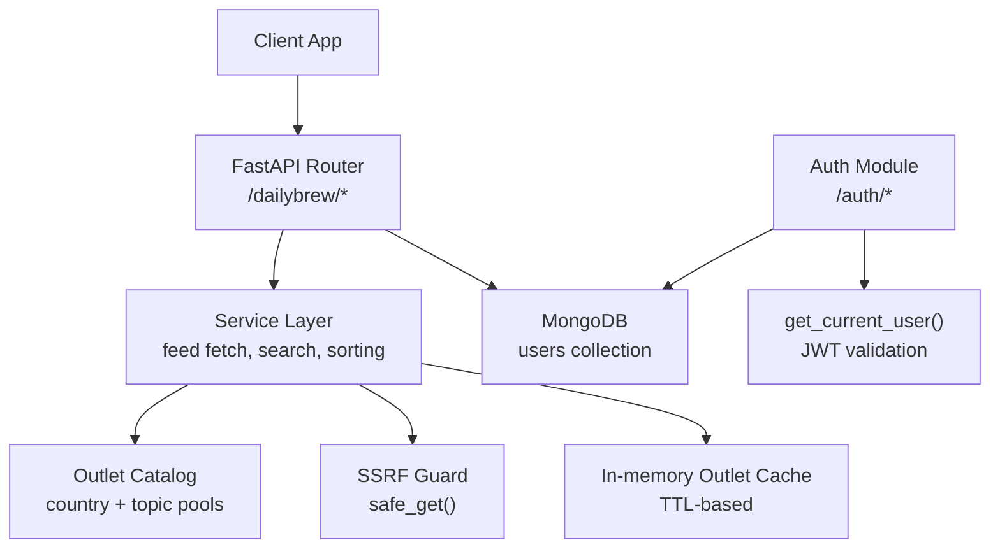
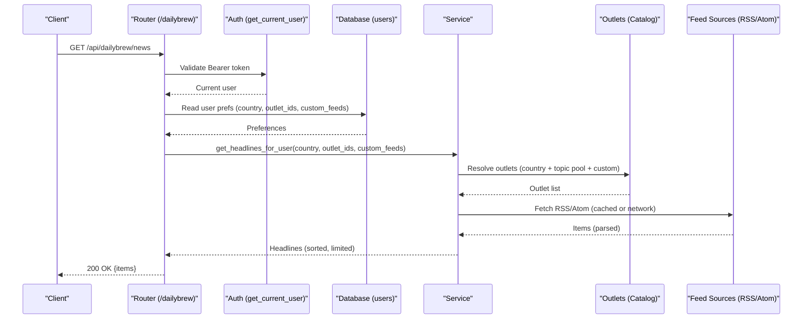
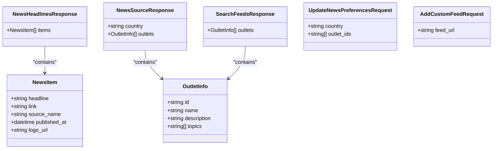
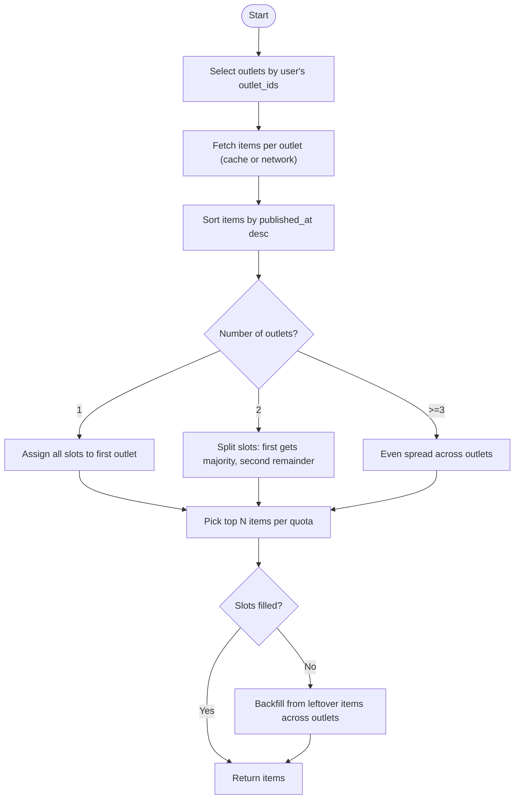
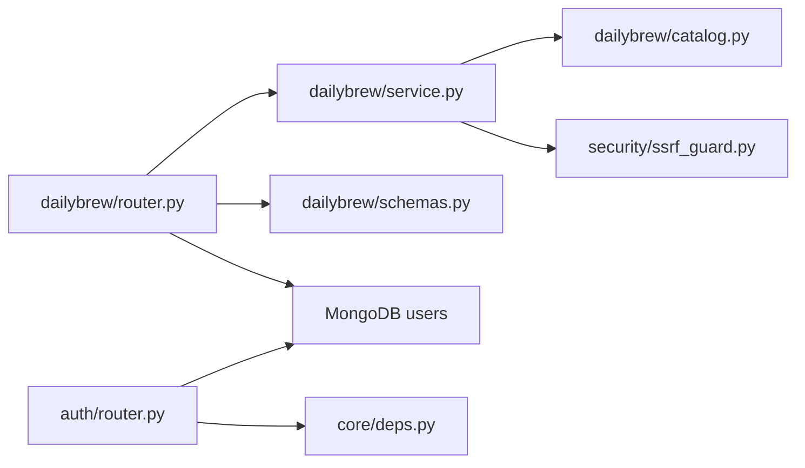

# Daily Brew API

<cite>
**Referenced Files in This Document**
- [router.py](file://dailybrew/router.py)
- [service.py](file://dailybrew/service.py)
- [schemas.py](file://dailybrew/schemas.py)
- [catalog.py](file://dailybrew/catalog.py)
- [auth_router.py](file://auth/router.py)
- [auth_service.py](file://auth/service.py)
- [auth_schemas.py](file://auth/schemas.py)
- [deps.py](file://core/deps.py)
- [ssrf_guard.py](file://security/ssrf_guard.py)
</cite>

## Table of Contents
1. Introduction
2. Project Structure
3. Core Components
4. Architecture Overview
5. Detailed Component Analysis
6. Dependency Analysis
7. Performance Considerations
8. Troubleshooting Guide
9. Conclusion

## Introduction
This document provides comprehensive API documentation for the Daily Brew endpoints under /api/dailybrew/*. It covers:
- Country-specific news source retrieval
- Custom feed management (RSS/Atom)
- Outlet preferences and personalization
- News aggregation, caching, and freshness policies
- Authentication requirements and error handling

Daily Brew aggregates RSS/Atom feeds from curated country catalogs and a topic-focused pool, plus user-added custom feeds, to deliver personalized headlines.

## Project Structure
The Daily Brew feature is implemented as a FastAPI router with service logic, schemas, and a catalog of outlets. User authentication and preference updates are handled by the auth module. SSRF-safe outbound fetching is provided by a security utility.

**Diagram sources**
- [router.py:12-101](file://dailybrew/router.py#L12-L101)
- [service.py:168-284](file://dailybrew/service.py#L168-L284)
- [catalog.py:29-281](file://dailybrew/catalog.py#L29-L281)
- [ssrf_guard.py:67-109](file://security/ssrf_guard.py#L67-L109)
- [deps.py:24-50](file://core/deps.py#L24-L50)

**Section sources**
- [router.py:12-101](file://dailybrew/router.py#L12-L101)
- [service.py:1-356](file://dailybrew/service.py#L1-L356)
- [catalog.py:1-281](file://dailybrew/catalog.py#L1-L281)
- [auth_router.py:342-356](file://auth/router.py#L342-L356)
- [auth_service.py:402-422](file://auth/service.py#L402-L422)
- [deps.py:24-50](file://core/deps.py#L24-L50)
- [ssrf_guard.py:1-109](file://security/ssrf_guard.py#L1-L109)

## Core Components
- Router: Defines HTTP endpoints under /dailybrew with request/response models.
- Service: Implements feed fetching, parsing (RSS/Atom), caching, search, and headline composition.
- Catalog: Holds curated per-country outlet lists and a topic-focused pool; exposes all outlets and lookup helpers.
- Schemas: Pydantic models for requests/responses including NewsItem, OutletInfo, and preference payloads.
- Auth integration: JWT-based authentication via get_current_user; preferences updated via /auth/me/news-preferences.
- Security: SSRF guard ensures safe outbound fetches for custom feeds.

**Section sources**
- [router.py:15-101](file://dailybrew/router.py#L15-L101)
- [service.py:20-356](file://dailybrew/service.py#L20-L356)
- [catalog.py:29-281](file://dailybrew/catalog.py#L29-L281)
- [schemas.py:6-41](file://dailybrew/schemas.py#L6-L41)
- [auth_router.py:342-356](file://auth/router.py#L342-L356)
- [auth_service.py:402-422](file://auth/service.py#L402-L422)
- [deps.py:24-50](file://core/deps.py#L24-L50)
- [ssrf_guard.py:67-109](file://security/ssrf_guard.py#L67-L109)

## Architecture Overview
Daily Brew endpoints require authentication via Bearer token. The router resolves the current user, reads their preferences (country, selected outlet IDs, custom feeds), and composes a personalized set of headlines. Outlets are fetched from an in-memory cache with TTL; background prewarming keeps caches warm. Custom feeds are validated live before saving.

**Diagram sources**
- [router.py:91-101](file://dailybrew/router.py#L91-L101)
- [service.py:227-284](file://dailybrew/service.py#L227-L284)
- [catalog.py:267-281](file://dailybrew/catalog.py#L267-L281)
- [deps.py:24-50](file://core/deps.py#L24-L50)

## Detailed Component Analysis

### Authentication
- All /dailybrew/* endpoints require a valid Bearer token.
- Token validation and user resolution are performed by get_current_user, which checks JWT validity and session status.

Authentication requirements:
- Include Authorization header: Bearer <access_token>
- Tokens are bound to sessions; logout invalidates tokens server-side.

Error responses:
- 401 Unauthorized if token is missing, invalid, expired, or session revoked.

**Section sources**
- [deps.py:24-50](file://core/deps.py#L24-L50)
- [auth_service.py:469-494](file://auth/service.py#L469-L494)

### Endpoints

#### GET /api/dailybrew/news-sources
- Purpose: Retrieve available outlets for a given country code.
- Query parameters:
  - country: ISO 3166-1 alpha-2 code (required). Case-insensitive; normalized to uppercase.
- Response schema:
  - country: string
  - outlets: array of OutletInfo
    - id: string
    - name: string
    - description: string
    - topics: array of strings (may be empty for country-catalog outlets)
- Behavior:
  - Returns outlets curated for the specified country from the catalog.
- Authentication: Required (Bearer token).

Example request:
- GET /api/dailybrew/news-sources?country=AU
- Headers: Authorization: Bearer <token>

Example response:
- 200 OK
- {
    "country": "AU",
    "outlets": [
      {"id": "abc-news-au", "name": "...", "description": "...", "topics": []},
      ...
    ]
  }

**Section sources**
- [router.py:15-24](file://dailybrew/router.py#L15-L24)
- [catalog.py:29-82](file://dailybrew/catalog.py#L29-L82)
- [schemas.py:18-27](file://dailybrew/schemas.py#L18-L27)

#### GET /api/dailybrew/search-feeds
- Purpose: Search across all known outlets (country catalog + topic pool) by free text.
- Query parameters:
  - q: search query (required). Performs case-insensitive, per-word prefix matching against name, description, and topics.
- Response schema:
  - outlets: array of OutletInfo (up to 5 results)
- Behavior:
  - Searches both country catalog and topic-focused pool.
  - Results are scored by specificity (topic > name > description).
- Authentication: Required (Bearer token).

Example request:
- GET /api/dailybrew/search-feeds?q=AI
- Headers: Authorization: Bearer <token>

Example response:
- 200 OK
- {
    "outlets": [
      {"id": "techcrunch-ai", "name": "TechCrunch AI", "description": "...", "topics": ["AI","Technology"]},
      ...
    ]
  }

**Section sources**
- [router.py:27-39](file://dailybrew/router.py#L27-L39)
- [service.py:311-356](file://dailybrew/service.py#L311-L356)
- [catalog.py:84-264](file://dailybrew/catalog.py#L84-L264)
- [schemas.py:30-31](file://dailybrew/schemas.py#L30-L31)

#### GET /api/dailybrew/outlets
- Purpose: Resolve specific outlet IDs to display info (including topic-pool feeds and user’s custom feeds).
- Query parameters:
  - ids: comma-separated outlet IDs (required).
- Response schema:
  - outlets: array of OutletInfo
- Behavior:
  - Resolves IDs against the full catalog and the user’s custom_news_feeds stored in the users collection.
- Authentication: Required (Bearer token).

Example request:
- GET /api/dailybrew/outlets?ids=bbc-world,custom:uuid-here
- Headers: Authorization: Bearer <token>

Example response:
- 200 OK
- {
    "outlets": [
      {"id": "bbc-world", "name": "BBC World News", "description": "...", "topics": ["World"]},
      {"id": "custom:...", "name": "...", "description": "Custom feed", "topics": []}
    ]
  }

**Section sources**
- [router.py:42-57](file://dailybrew/router.py#L42-L57)
- [service.py:291-304](file://dailybrew/service.py#L291-L304)
- [schemas.py:18-31](file://dailybrew/schemas.py#L18-L31)

#### POST /api/dailybrew/custom-feed
- Purpose: Add a custom RSS/Atom feed URL to the user’s profile after validating it.
- Request body:
  - feed_url: string (required). Must be http/https and reachable; must parse as RSS/Atom with a title.
- Response schema:
  - OutletInfo with id prefixed by "custom:", name derived from feed title, description "Custom feed".
- Behavior:
  - Validates URL scheme and reachability using SSRF guard.
  - Parses feed to extract title; stores resolved URL (after redirects).
  - Prevents duplicates by feed_url; reuses existing entry if present.
  - Saves to user’s custom_news_feeds array in MongoDB.
- Authentication: Required (Bearer token).

Example request:
- POST /api/dailybrew/custom-feed
- Headers: Authorization: Bearer <token>
- Body: {"feed_url": "https://example.com/feed.xml"}

Example response:
- 200 OK
- {"id": "custom:uuid", "name": "Example Feed", "description": "Custom feed", "topics": []}

Error responses:
- 400 Bad Request if URL is invalid, unreachable, or not a parseable RSS/Atom.

**Section sources**
- [router.py:60-88](file://dailybrew/router.py#L60-L88)
- [service.py:134-158](file://dailybrew/service.py#L134-L158)
- [ssrf_guard.py:67-109](file://security/ssrf_guard.py#L67-L109)
- [schemas.py:39-41](file://dailybrew/schemas.py#L39-L41)

#### GET /api/dailybrew/news
- Purpose: Retrieve personalized news headlines based on user preferences.
- Request: No body; uses authenticated user context.
- Response schema:
  - items: array of NewsItem
    - headline: string
    - link: string
    - source_name: string
    - published_at: datetime or null
    - logo_url: string or null
- Behavior:
  - Reads user’s news_country, news_outlet_ids, and custom_news_feeds.
  - Resolves outlets from catalog and custom feeds.
  - Fetches items from each outlet (with caching), sorts by recency, and applies distribution quotas to balance sources.
  - Limits total items returned (default limit enforced by service).
- Authentication: Required (Bearer token).

Example request:
- GET /api/dailybrew/news
- Headers: Authorization: Bearer <token>

Example response:
- 200 OK
- {
    "items": [
      {"headline": "...", "link": "...", "source_name": "...", "published_at": "...", "logo_url": "..."},
      ...
    ]
  }

Notes:
- If no outlets are selected, returns an empty items array.
- If a feed fails to fetch or parse, the last cached items are used; otherwise empty.

**Section sources**
- [router.py:91-101](file://dailybrew/router.py#L91-L101)
- [service.py:227-284](file://dailybrew/service.py#L227-L284)
- [schemas.py:6-16](file://dailybrew/schemas.py#L6-L16)

### Updating News Preferences
- Endpoint: PUT /api/auth/me/news-preferences
- Purpose: Update the Daily Brew country selection, chosen outlet IDs, and optional Bible verse/quote toggles.
- Request body:
  - country: string (ISO 3166-1 alpha-2)
  - outlet_ids: array of strings (selected outlet IDs)
  - show_verse: boolean (opt-in Bible verse inclusion)
  - show_quote: boolean (opt-in quote inclusion; defaults false)
- Response: Updated user object including daily_brew_enabled flag and preference fields.
- Authentication: Required (Bearer token).

Example request:
- PUT /api/auth/me/news-preferences
- Headers: Authorization: Bearer <token>
- Body: {"country": "ID", "outlet_ids": ["detik-news","bbc-world"], "show_verse": true, "show_quote": false}

Example response:
- 200 OK
- {
    "id": "...",
    "email": "...",
    "name": "...",
    "news_country": "ID",
    "news_outlet_ids": ["detik-news","bbc-world"],
    "daily_brew_show_verse": true,
    "daily_brew_show_quote": false,
    "daily_brew_enabled": true
  }

**Section sources**
- [auth_router.py:342-356](file://auth/router.py#L342-L356)
- [auth_service.py:402-422](file://auth/service.py#L402-L422)
- [auth_schemas.py:44-64](file://auth/schemas.py#L44-L64)

### Data Models

**Diagram sources**
- [schemas.py:6-41](file://dailybrew/schemas.py#L6-L41)

**Section sources**
- [schemas.py:6-41](file://dailybrew/schemas.py#L6-L41)

### Content Personalization Algorithms
- Outlet selection:
  - Uses user’s news_outlet_ids to select outlets from both the curated catalog and the topic pool.
  - Includes user’s custom feeds if their IDs match selected outlet IDs.
- Distribution and quotas:
  - For one outlet: all slots filled by that outlet.
  - For two outlets: first outlet gets majority share; second gets remainder.
  - For three or more: even spread across outlets; extra slots distributed round-robin to first outlets.
- Sorting:
  - Items sorted by published_at descending; undated items sort last.
- Backfill:
  - If any outlet runs short, remaining slots are backfilled from the next-freshest items across all outlets.
- Limit:
  - Default limit applied to cap number of headlines returned per request.

**Diagram sources**
- [service.py:227-284](file://dailybrew/service.py#L227-L284)

**Section sources**
- [service.py:227-284](file://dailybrew/service.py#L227-L284)

### News Source Integration
- Supported formats:
  - RSS 2.0 (channel/item elements)
  - Atom (feed/entry elements with namespace handling)
- Parsing:
  - Extracts title, link, and publication date; normalizes timezones where possible.
- Logo:
  - Derives a favicon URL from the feed domain for visual identification.

**Section sources**
- [service.py:48-131](file://dailybrew/service.py#L48-L131)
- [service.py:161-166](file://dailybrew/service.py#L161-L166)

### Bible Verse Inclusion Features
- Toggle fields:
  - daily_brew_show_verse: opt-in to include a Bible verse in the Daily Brew card.
  - daily_brew_show_quote: opt-in to include a quote (defaults false).
- Storage:
  - Persisted in the user document alongside news_country and news_outlet_ids.
- Retrieval:
  - Returned in user profile responses; clients can use these flags to decide whether to render verse/quote content.

Note: The Daily Brew endpoints themselves return only aggregated news items. Verse/quote toggles are part of user preferences and may be consumed by the client when composing the Daily Brew UI.

**Section sources**
- [auth_router.py:342-356](file://auth/router.py#L342-L356)
- [auth_service.py:402-422](file://auth/service.py#L402-L422)
- [auth_schemas.py:44-64](file://auth/schemas.py#L44-L64)

## Dependency Analysis
- Router depends on:
  - Service for business logic (fetching, search, composition)
  - Schemas for request/response validation
  - Database via dependency injection for user preferences
- Service depends on:
  - Catalog for outlet definitions
  - SSRF guard for safe outbound fetches
  - In-memory cache for performance and resilience
- Authentication depends on:
  - JWT verification and session checks
  - User model fields for preferences and toggles

**Diagram sources**
- [router.py:1-101](file://dailybrew/router.py#L1-L101)
- [service.py:1-356](file://dailybrew/service.py#L1-L356)
- [catalog.py:1-281](file://dailybrew/catalog.py#L1-L281)
- [ssrf_guard.py:1-109](file://security/ssrf_guard.py#L1-L109)
- [deps.py:1-51](file://core/deps.py#L1-L51)
- [auth_router.py:1-366](file://auth/router.py#L1-L366)

**Section sources**
- [router.py:1-101](file://dailybrew/router.py#L1-L101)
- [service.py:1-356](file://dailybrew/service.py#L1-L356)
- [catalog.py:1-281](file://dailybrew/catalog.py#L1-L281)
- [ssrf_guard.py:1-109](file://security/ssrf_guard.py#L1-L109)
- [deps.py:1-51](file://core/deps.py#L1-L51)
- [auth_router.py:1-366](file://auth/router.py#L1-L366)

## Performance Considerations
- Caching strategy:
  - In-memory per-outlet cache with TTL of 900 seconds (15 minutes).
  - Concurrency control via async lock prevents thundering herds on cache misses.
  - Background prewarmer refreshes all curated outlets every 600 seconds to keep cache warm.
- Network behavior:
  - Browser-like User-Agent to avoid blocking by some outlets.
  - Timeout of 8 seconds per fetch to prevent slow stalls.
- Error resilience:
  - Failures fall back to last-known-good cache; if none, returns empty items for that outlet.
- Sorting and backfill:
  - Efficient sorting by epoch timestamps; backfill minimizes impact of sparse outlets.

[No sources needed since this section provides general guidance]

## Troubleshooting Guide
Common issues and resolutions:
- 401 Unauthorized:
  - Ensure Authorization header includes a valid Bearer token.
  - Verify session has not been invalidated (logout or expired).
- 400 Bad Request on custom feed:
  - URL must be http/https and reachable.
  - Must parse as RSS/Atom with a title.
  - Check for DNS resolution and public IP (SSRF guard rejects private/internal addresses).
- Empty news items:
  - Confirm user has selected at least one outlet ID.
  - Check feed availability and parsing; failures fall back to cache or empty.
- Stale content:
  - Wait for cache TTL to expire or rely on background prewarmer.
  - Verify outlet feed URLs are correct and active.

**Section sources**
- [deps.py:24-50](file://core/deps.py#L24-L50)
- [router.py:60-88](file://dailybrew/router.py#L60-L88)
- [service.py:168-203](file://dailybrew/service.py#L168-L203)
- [service.py:205-221](file://dailybrew/service.py#L205-L221)

## Conclusion
The Daily Brew API provides a robust, secure, and personalized news aggregation experience. It supports country-specific outlets, topic-based discovery, and user-defined custom feeds. Authentication is enforced via JWT, and content is efficiently cached with background prewarming. Preferences, including Bible verse and quote toggles, are managed through the auth module and influence the Daily Brew experience on the client side.