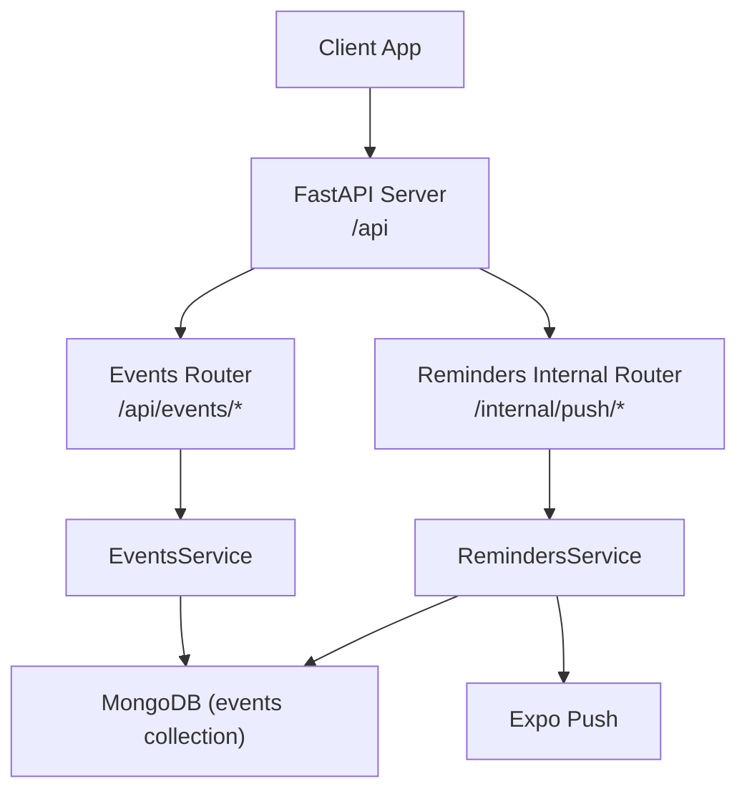
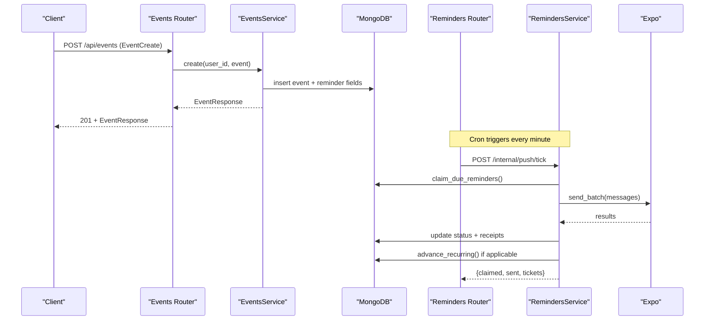
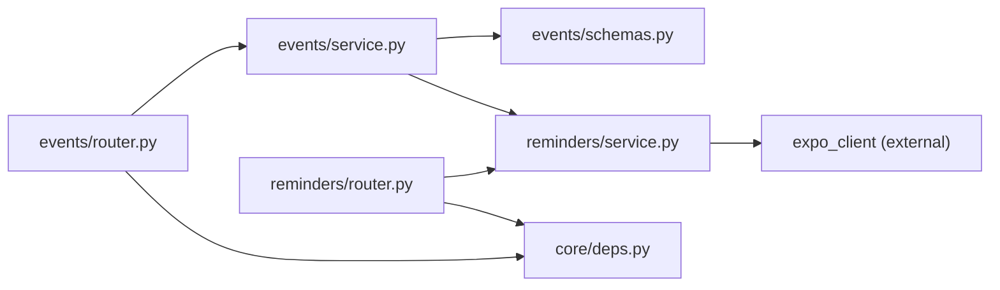

# Events API

<cite>
**Referenced Files in This Document**
- [server.py](file://server.py)
- [events/router.py](file://events/router.py)
- [events/schemas.py](file://events/schemas.py)
- [events/service.py](file://events/service.py)
- [reminders/router.py](file://reminders/router.py)
- [reminders/service.py](file://reminders/service.py)
- [core/deps.py](file://core/deps.py)
</cite>

## Table of Contents
1. [Introduction](#introduction)
2. [Project Structure](#project-structure)
3. [Core Components](#core-components)
4. [Architecture Overview](#architecture-overview)
5. [Detailed Component Analysis](#detailed-component-analysis)
6. [Dependency Analysis](#dependency-analysis)
7. [Performance Considerations](#performance-considerations)
8. [Troubleshooting Guide](#troubleshooting-guide)
9. [Conclusion](#conclusion)
10. [Appendices](#appendices)

## Introduction
This document provides comprehensive API documentation for the Events endpoints and the reminder scheduling system that powers calendar events, reminders, and timeline integration. It covers HTTP methods, URL patterns under /api/events/*, request/response schemas, authentication requirements, recurrence patterns, timezone handling, validation rules, error responses, and conflict resolution strategies for overlapping events. It also documents the internal push notification pipeline used to deliver event reminders via Expo.

## Project Structure
The Events feature is implemented as a FastAPI router with service logic and Pydantic schemas:
- Router defines REST endpoints under /api/events
- Service handles persistence, validation, reminder computation, and recurrence math
- Schemas define EventCreate, EventUpdate, EventResponse, Recurrence, and batch helpers
- Reminders module provides an internal cron-driven tick to deliver push notifications and advance recurring reminders
- Authentication is enforced via Bearer tokens resolved by core dependencies

**Diagram sources**
- [server.py:175-197](file://server.py#L175-L197)
- [events/router.py:16-111](file://events/router.py#L16-L111)
- [reminders/router.py:9-29](file://reminders/router.py#L9-L29)
- [events/service.py:163-312](file://events/service.py#L163-L312)
- [reminders/service.py:37-177](file://reminders/service.py#L37-L177)

**Section sources**
- [server.py:175-197](file://server.py#L175-L197)
- [events/router.py:16-111](file://events/router.py#L16-L111)
- [reminders/router.py:9-29](file://reminders/router.py#L9-L29)

## Core Components
- Events Router: Exposes CRUD endpoints for events and batch retrieval
- Events Service: Validates payloads, computes reminder fields, manages recurrence, persists events
- Reminders Service: Claims due reminders, sends push notifications via Expo, resolves receipts, advances recurring reminders
- Schemas: Define event data models, recurrence configuration, and response shapes
- Authentication: Bearer token required for all user-scoped endpoints; internal tick endpoints use a shared secret

Key responsibilities:
- Enforce user scoping on all event operations
- Validate field sizes and compute reminder scheduling metadata
- Support all-day vs instant time semantics and IANA timezone-aware recurrence
- Provide pagination for listing events
- Deliver push notifications and handle device token lifecycle

**Section sources**
- [events/router.py:23-111](file://events/router.py#L23-L111)
- [events/service.py:142-312](file://events/service.py#L142-L312)
- [reminders/service.py:37-215](file://reminders/service.py#L37-L215)
- [events/schemas.py:5-101](file://events/schemas.py#L5-L101)
- [core/deps.py:24-50](file://core/deps.py#L24-L50)

## Architecture Overview
The Events API integrates with a background reminder delivery pipeline:
- Clients authenticate with Bearer tokens to call /api/events/*
- Creating or updating events may set reminder_minutes; the server computes reminder_fire_at and status
- A cron job calls /internal/push/tick to claim due reminders, send pushes via Expo, and advance recurring events
- A second cron job calls /internal/push/receipts to resolve delivery receipts and clean up stale tokens

**Diagram sources**
- [events/router.py:23-35](file://events/router.py#L23-L35)
- [events/service.py:167-199](file://events/service.py#L167-L199)
- [reminders/router.py:19-23](file://reminders/router.py#L19-L23)
- [reminders/service.py:52-177](file://reminders/service.py#L52-L177)

## Detailed Component Analysis

### Authentication Requirements
- All /api/events/* endpoints require a valid Bearer token in the Authorization header
- Tokens are verified against sessions; invalid/expired tokens return 401
- Internal reminder endpoints (/internal/push/*) require a shared secret header X-Tick-Secret matching PUSH_TICK_SECRET

Authentication flow:
- Header: Authorization: Bearer <token>
- Token verification returns user_id; user document is attached to request context
- Internal endpoints validate X-Tick-Secret header

Error responses:
- 401 Not authenticated: missing or malformed Authorization header
- 401 Invalid or expired token: token verification fails
- 401 User not found: token maps to non-existent user
- 403 Forbidden: internal endpoint called without correct secret

**Section sources**
- [core/deps.py:24-50](file://core/deps.py#L24-L50)
- [reminders/router.py:12-17](file://reminders/router.py#L12-L17)

### Events Endpoints

#### Create Event
- Method: POST
- URL: /api/events
- Auth: Bearer token required
- Request body: EventCreate schema
- Response: EventResponse
- Notes:
  - Payload size validated per field; oversized payloads return 413
  - Reminder fields computed from start_time and reminder_minutes
  - updated_at defaults to server time if not provided by client

Validation rules:
- title: max length enforced (with ciphertext headroom)
- description: max length enforced (with ciphertext headroom)
- location: max length enforced (with ciphertext headroom)
- start_time/end_time: ISO-8601 strings; all_day flag changes interpretation to date-only
- reminder_minutes: optional integer minutes before event
- recurrence: optional object with freq, byweekday, until
- timezone: optional IANA name for wall-clock recurrence math
- google_* fields: passthrough sync metadata
- attendees: optional list of dicts

Example request fields:
- title, description, location, start_time, end_time, all_day, linked_note_ids, reminder_minutes, device_calendar_event_id, enc_version, recurrence, timezone, trip_id, google_event_id, google_calendar_id, google_event_updated, attendees, updated_at

Example response fields:
- id, title, description, location, start_time, end_time, all_day, linked_note_ids, reminder_minutes, device_calendar_event_id, user_id, enc_version, created_at, updated_at, recurrence, timezone, trip_id, google_event_id, google_calendar_id, google_event_updated, attendees

Error responses:
- 401: Not authenticated or invalid token
- 413: Payload too large (title/description/location exceeds limits)

**Section sources**
- [events/router.py:23-35](file://events/router.py#L23-L35)
- [events/schemas.py:11-41](file://events/schemas.py#L11-L41)
- [events/service.py:142-199](file://events/service.py#L142-L199)

#### List Events
- Method: GET
- URL: /api/events
- Query parameters:
  - month: Optional integer (1–12)
  - year: Optional integer (e.g., 2025)
  - page: Integer >= 1 (default 1)
  - page_size: Integer between 1 and 100 (default 100)
- Auth: Bearer token required
- Response: Array of EventResponse objects (no envelope)
- Notes:
  - If month/year provided, filters events by start_time within that month
  - Results sorted by start_time then id for deterministic pagination
  - Older clients receive up to 100 items; newer clients can paginate beyond

Pagination behavior:
- Return fewer items than requested when no more exist
- Use page and page_size to iterate through all events

Error responses:
- 401: Not authenticated or invalid token

**Section sources**
- [events/router.py:37-53](file://events/router.py#L37-L53)
- [events/service.py:201-247](file://events/service.py#L201-L247)

#### Get Event
- Method: GET
- URL: /api/events/{event_id}
- Auth: Bearer token required
- Response: EventResponse
- Error responses:
  - 401: Not authenticated or invalid token
  - 404: Event not found

**Section sources**
- [events/router.py:56-67](file://events/router.py#L56-L67)
- [events/service.py:249-253](file://events/service.py#L249-L253)

#### Batch Get Events
- Method: POST
- URL: /api/events/batch
- Auth: Bearer token required
- Request body: BatchEventIds with event_ids array
- Response: Array of EventResponse objects
- Notes:
  - Limits batch size to prevent abuse (up to 50 IDs)
  - Returns only events belonging to the current user

Error responses:
- 401: Not authenticated or invalid token

**Section sources**
- [events/router.py:71-79](file://events/router.py#L71-L79)
- [events/service.py:255-265](file://events/service.py#L255-L265)

#### Update Event
- Method: PUT
- URL: /api/events/{event_id}
- Auth: Bearer token required
- Request body: EventUpdate schema (partial updates allowed)
- Response: EventResponse
- Notes:
  - Explicit null values clear specific fields (reminder_minutes, recurrence, trip_id, google_* fields, attendees)
  - Reminder fields recomputed when timing or recurrence changes
  - updated_at preserved from client if provided; otherwise set to server time

Error responses:
- 401: Not authenticated or invalid token
- 404: Event not found
- 413: Payload too large

**Section sources**
- [events/router.py:82-96](file://events/router.py#L82-L96)
- [events/service.py:267-306](file://events/service.py#L267-L306)

#### Delete Event
- Method: DELETE
- URL: /api/events/{event_id}
- Auth: Bearer token required
- Response: JSON message indicating deletion
- Error responses:
  - 401: Not authenticated or invalid token
  - 404: Event not found

**Section sources**
- [events/router.py:99-111](file://events/router.py#L99-L111)
- [events/service.py:308-312](file://events/service.py#L308-L312)

### Event Schemas and Validation

#### Recurrence
- freq: One of daily, weekly, monthly, yearly
- byweekday: Optional list of integers (0=Sunday..6=Saturday); applies to weekly
- until: Optional inclusive ISO date string marking the end of the series

Timezone handling:
- timezone: Optional IANA name (e.g., Australia/Sydney) anchors recurrence math to wall-clock time across DST transitions
- next_occurrence_on_or_after converts start_time into local zone, computes occurrences naively in that zone, then converts back to UTC

Reminder scheduling:
- reminder_minutes: Minutes before event to remind
- compute_reminder_fields calculates reminder_fire_at = start_time - reminder_minutes
- Past-due guard sets reminder_status to sent if fire time is already in the past or if no reminder configured

Validation rules:
- Field lengths enforced with ciphertext headroom for E2EE scenarios
- Date/time parsing tolerates Z suffix and normalizes to UTC internally
- Recurrence frequency mapped to dateutil rrule constants; weekday mapping adjusted from JS convention to dateutil convention

Conflict resolution:
- updated_at field supports offline-first merge; client-provided timestamp wins when present
- Google Calendar bridge uses google_event_updated for last-write-wins conflict resolution

**Section sources**
- [events/schemas.py:5-41](file://events/schemas.py#L5-L41)
- [events/service.py:39-123](file://events/service.py#L39-L123)
- [events/service.py:142-160](file://events/service.py#L142-L160)

### Reminder Scheduling System

#### Internal Tick Endpoint
- Method: POST
- URL: /internal/push/tick
- Auth: Requires X-Tick-Secret header matching PUSH_TICK_SECRET environment variable
- Behavior:
  - Recovers stuck claims older than threshold
  - Atomically claims due pending reminders
  - Builds push messages per active device token
  - Sends batches via Expo (up to 100 per call)
  - Updates event status to sent and records receipts
  - Advances recurring events to next occurrence

Receipt Resolution Endpoint:
- Method: POST
- URL: /internal/push/receipts
- Auth: Requires X-Tick-Secret header
- Behavior:
  - Resolves Expo delivery receipts after delay window
  - Marks stale tokens inactive on DeviceNotRegistered errors
  - Prunes unresolved receipts after timeout

Push Notification Integration:
- Messages include title, body, sound, channelId, and eventId
- Encrypted titles fall back to generic text for privacy
- Device tokens managed per user; inactive tokens marked on errors

Recurring Event Advancement:
- Uses next_occurrence_on_or_after to compute next fire time
- Resets reminder state to pending with new fire_at and clears claimed_at
- Protects against race conditions by operating only on claimed events

**Section sources**
- [reminders/router.py:12-29](file://reminders/router.py#L12-L29)
- [reminders/service.py:44-177](file://reminders/service.py#L44-L177)
- [events/service.py:69-123](file://events/service.py#L69-L123)

### Timeline Integration
- Events support trip_id to group events under trips for timeline organization
- Linked note ids associate notes with events for contextual information
- Google Calendar bridge fields enable synchronization with external calendars
- Attendees list supports sharing event participants

Timeline display considerations:
- Sorting by start_time ensures chronological order
- All-day events share start_time dates; id tiebreaker ensures stable ordering
- Timezone-aware recurrence maintains consistent wall-clock times across DST changes

**Section sources**
- [events/schemas.py:11-41](file://events/schemas.py#L11-L41)
- [events/service.py:201-247](file://events/service.py#L201-L247)

## Dependency Analysis

**Diagram sources**
- [events/router.py:6-14](file://events/router.py#L6-L14)
- [events/service.py:17-18](file://events/service.py#L17-L18)
- [reminders/router.py:6-8](file://reminders/router.py#L6-L8)
- [reminders/service.py:17-20](file://reminders/service.py#L17-L20)
- [core/deps.py:15-50](file://core/deps.py#L15-L50)

Coupling and cohesion:
- Events router depends on EventsService for business logic
- EventsService depends on schemas for validation and RemindersService for recurrence calculations
- RemindersService depends on ExpoClient for push delivery and MongoDB for state management
- Authentication dependency is centralized in core/deps.py

External dependencies:
- MongoDB for persistence
- Expo for push notifications
- dateutil for recurrence calculation
- zoneinfo for timezone handling

Potential circular dependencies:
- Deferred imports prevent circular import issues between server, auth, and core modules

**Section sources**
- [events/router.py:6-14](file://events/router.py#L6-L14)
- [events/service.py:17-18](file://events/service.py#L17-L18)
- [reminders/router.py:6-8](file://reminders/router.py#L6-L8)
- [reminders/service.py:17-20](file://reminders/service.py#L17-L20)
- [core/deps.py:15-50](file://core/deps.py#L15-L50)

## Performance Considerations
- Pagination limits: Default and maximum page size set to 100 to balance performance and usability
- Batch operations: Batch endpoint limits to 50 IDs to prevent abuse
- Database queries: Optimized with field projection and sorting for efficient pagination
- Reminder claiming: Atomic operations prevent duplicate notifications with bounded loops
- Expo batching: Push messages sent in batches of 100 to respect API limits
- Receipt resolution: Batches of 300 with configurable timeouts to manage network overhead

Optimization opportunities:
- Consider indexing strategies for frequently queried fields (user_id, start_time, reminder_status)
- Monitor memory usage during large batch operations
- Implement circuit breakers for external service failures (Expo)

[No sources needed since this section provides general guidance]

## Troubleshooting Guide

Common issues and resolutions:
- 401 Unauthorized: Verify Bearer token format and validity; check session expiration
- 404 Not Found: Ensure event exists and belongs to authenticated user
- 413 Payload Too Large: Reduce field sizes; consider using linked notes for large content
- Reminder not firing: Check reminder_minutes value and start_time validity; verify device tokens are active
- Duplicate notifications: Investigate stuck claims; system automatically recovers claims older than threshold
- Receipt delays: Expo receipts may take ~15 minutes; system waits before giving up

Debugging steps:
- Verify event creation includes proper start_time and reminder_minutes
- Check reminder_status progression: pending → claimed → sent
- Monitor push_tokens table for active device registrations
- Review Expo receipt status for delivery confirmation

**Section sources**
- [events/router.py:30-34](file://events/router.py#L30-L34)
- [events/router.py:63-67](file://events/router.py#L63-L67)
- [reminders/service.py:44-67](file://reminders/service.py#L44-L67)
- [reminders/service.py:181-215](file://reminders/service.py#L181-L215)

## Conclusion
The Events API provides a comprehensive solution for calendar event management with robust reminder scheduling, recurrence support, and timeline integration. The system enforces strong authentication, validates inputs thoroughly, and handles edge cases like timezone transitions and payload size limits. The internal reminder pipeline ensures reliable push notification delivery with proper conflict resolution and recovery mechanisms.

Key strengths:
- Clear separation of concerns between routing, service logic, and data models
- Robust authentication and authorization mechanisms
- Comprehensive validation and error handling
- Efficient pagination and batch operations
- Reliable reminder delivery with automatic recovery

Recommendations:
- Monitor database query performance and consider additional indexes
- Implement rate limiting for high-frequency operations
- Add comprehensive logging for debugging reminder delivery issues
- Consider implementing retry logic for failed Expo deliveries

[No sources needed since this section summarizes without analyzing specific files]

## Appendices

### HTTP Status Codes Reference
- 200 OK: Successful operation
- 201 Created: Event successfully created
- 400 Bad Request: Invalid request parameters
- 401 Unauthorized: Missing or invalid authentication
- 403 Forbidden: Missing internal secret for admin endpoints
- 404 Not Found: Resource not found
- 413 Payload Too Large: Request body exceeds size limits
- 429 Too Many Requests: Rate limit exceeded

### Timezone Handling Examples
- All-day events: start_time and end_time are date-only strings (YYYY-MM-DD)
- Instant events: start_time and end_time are full ISO-8601 timestamps with timezone
- Recurrence timezone: IANA names ensure consistent wall-clock times across DST changes

### Recurrence Patterns
- Daily: Repeats every day at the same time
- Weekly: Repeats on specified weekdays (byweekday)
- Monthly: Repeats on the same day each month
- Yearly: Repeats on the same date each year
- Until: Optional end date for the recurrence series

**Section sources**
- [events/schemas.py:5-41](file://events/schemas.py#L5-L41)
- [events/service.py:69-123](file://events/service.py#L69-L123)