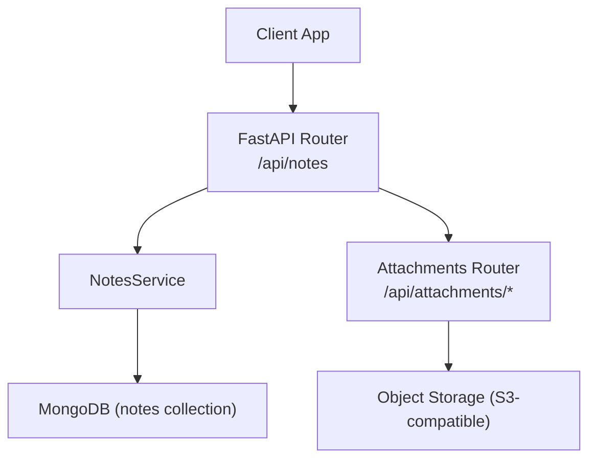
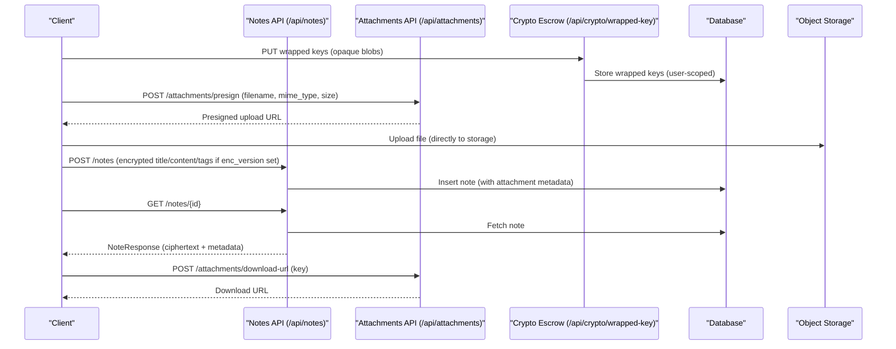
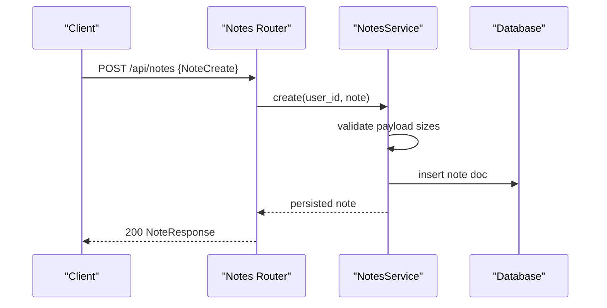
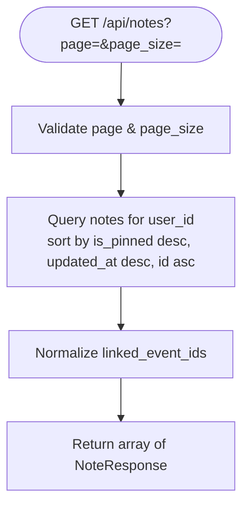
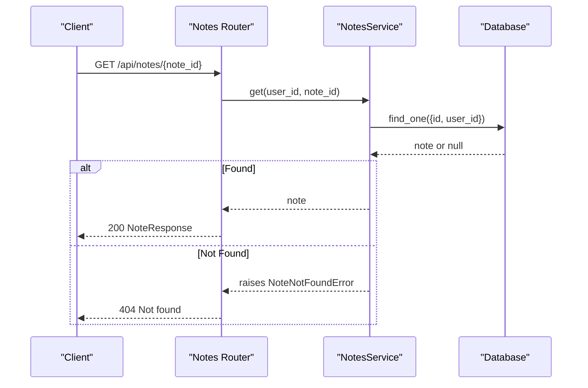
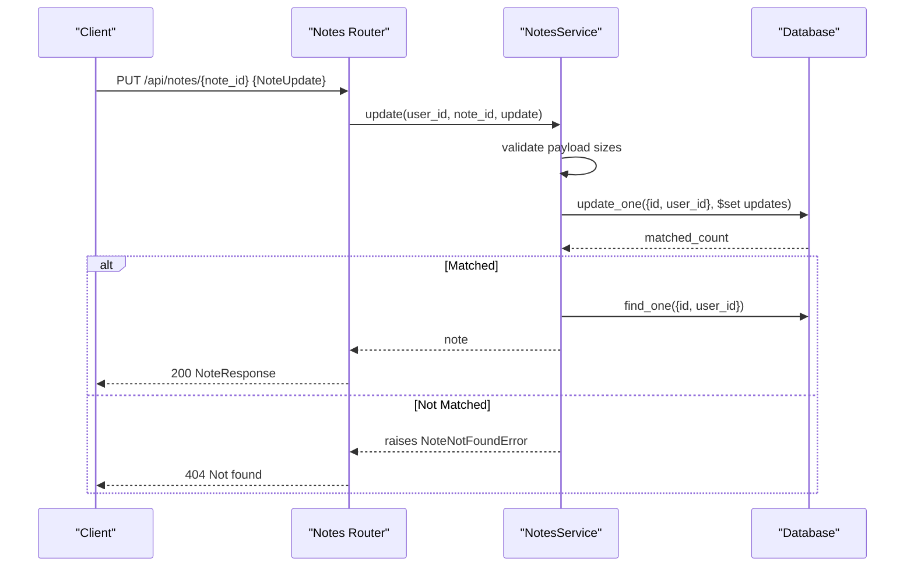
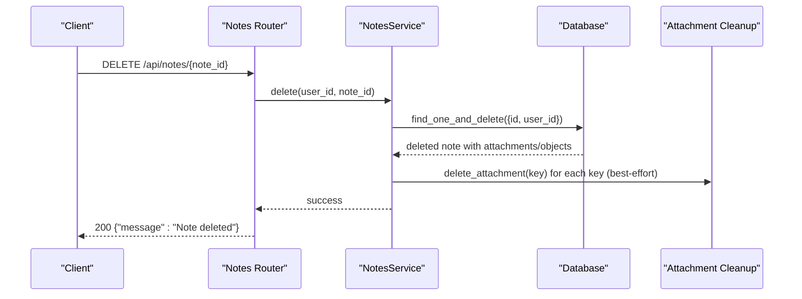
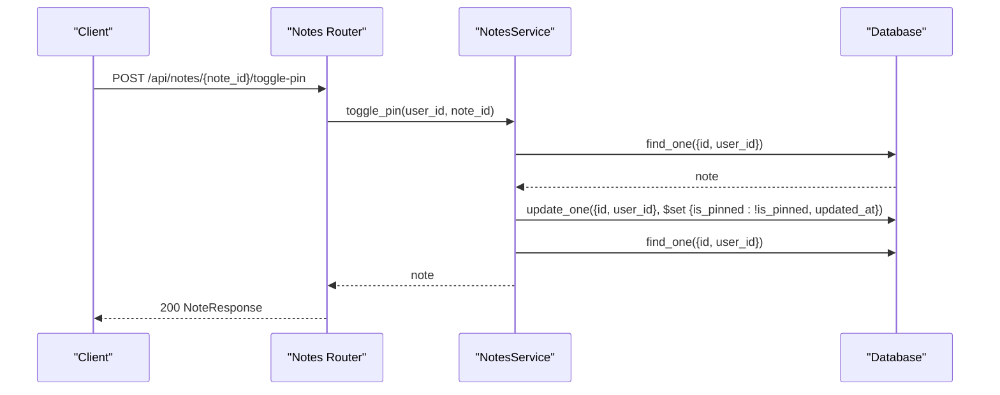
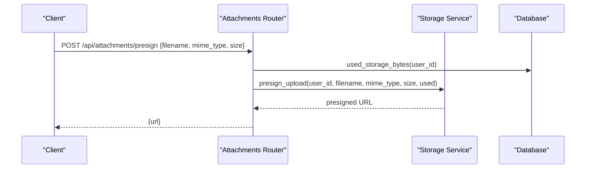
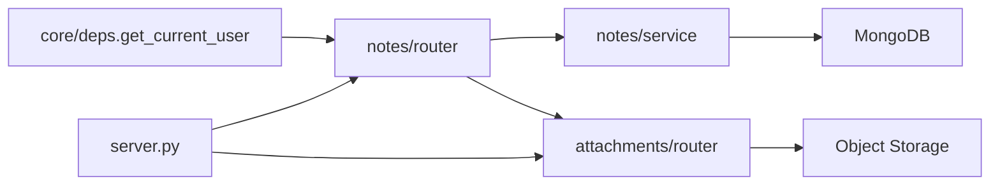

# Notes API

<cite>
**Referenced Files in This Document**
- [server.py](file://server.py)
- [notes/router.py](file://notes/router.py)
- [notes/schemas.py](file://notes/schemas.py)
- [notes/service.py](file://notes/service.py)
- [attachments/router.py](file://attachments/router.py)
- [attachments/schemas.py](file://attachments/schemas.py)
- [core/deps.py](file://core/deps.py)
</cite>

## Table of Contents
1. [Introduction](#introduction)
2. [Project Structure](#project-structure)
3. [Core Components](#core-components)
4. [Architecture Overview](#architecture-overview)
5. [Detailed Component Analysis](#detailed-component-analysis)
6. [Dependency Analysis](#dependency-analysis)
7. [Performance Considerations](#performance-considerations)
8. [Troubleshooting Guide](#troubleshooting-guide)
9. [Conclusion](#conclusion)
10. [Appendices](#appendices)

## Introduction
This document provides comprehensive API documentation for the Notes endpoints under /api/notes/*, including CRUD operations, pin/unpin functionality, and attachment handling. It also documents end-to-end encryption (E2EE) considerations as implemented by the server: notes may carry client-side encrypted content with an enc_version marker; attachments are stored via presigned URLs; and a separate key escrow endpoint stores wrapped keys without ever seeing plaintext or unwrapped keys.

Authentication is required on all note endpoints using a Bearer token. The server enforces user scoping so users can only access their own notes.

## Project Structure
The Notes feature is implemented as a FastAPI router mounted under /api/notes. Schemas define request/response models, while the service layer handles validation, persistence, and business rules. Attachments are handled by a dedicated module that provides presign upload/download and deletion endpoints.

**Diagram sources**
- [notes/router.py:17-99](file://notes/router.py#L17-L99)
- [notes/service.py:79-226](file://notes/service.py#L79-L226)
- [attachments/router.py:28-81](file://attachments/router.py#L28-L81)

**Section sources**
- [server.py:175-214](file://server.py#L175-L214)
- [notes/router.py:1-100](file://notes/router.py#L1-L100)

## Core Components
- Notes Router: Exposes HTTP endpoints for creating, listing, retrieving, updating, deleting notes, and toggling pins.
- Notes Schemas: Define NoteCreate, NoteUpdate, NoteResponse, Tag, ImageObject, and pagination response shapes.
- Notes Service: Validates payloads, persists notes, manages linked events compatibility, and handles deletions with attachment cleanup.
- Attachments Router: Provides presign upload, download URL generation, and deletion for note attachments.
- Authentication Dependency: Enforces Bearer token authentication and resolves current user context.

Key responsibilities:
- Payload size validation to protect server memory and MongoDB limits.
- Deterministic paging with index-backed sorting.
- E2EE awareness via enc_version field; server treats title/content/tags as opaque when present.
- Attachment lifecycle integration during note creation/update/delete.

**Section sources**
- [notes/router.py:17-99](file://notes/router.py#L17-L99)
- [notes/schemas.py:7-100](file://notes/schemas.py#L7-L100)
- [notes/service.py:53-226](file://notes/service.py#L53-L226)
- [attachments/router.py:28-81](file://attachments/router.py#L28-L81)
- [core/deps.py:24-50](file://core/deps.py#L24-L50)

## Architecture Overview
End-to-end encryption model:
- Clients may encrypt note fields (title, content, tags) before sending them to the server. When enc_version is set, these fields are ciphertext.
- The server stores ciphertext verbatim and never decrypts it.
- Wrapped keys (DEK wrapped by password-derived and recovery-code-derived KEKs) are stored via a separate crypto endpoint. The server never sees unwrapped keys or plaintext.

**Diagram sources**
- [server.py:80-104](file://server.py#L80-L104)
- [attachments/router.py:28-81](file://attachments/router.py#L28-L81)
- [notes/router.py:17-99](file://notes/router.py#L17-L99)

## Detailed Component Analysis

### Authentication
All note endpoints require a valid Bearer token. The dependency extracts the token from the Authorization header, verifies it against sessions, and returns the current user context. Missing or invalid tokens result in 401 responses.

- Header: Authorization: Bearer <token>
- Failure cases:
  - Missing or malformed Authorization header -> 401 Not authenticated
  - Invalid/expired token or revoked session -> 401 Invalid or expired token
  - User not found -> 401 User not found

**Section sources**
- [core/deps.py:24-50](file://core/deps.py#L24-L50)

### End-to-End Encryption (E2EE)
- When enc_version is present, title, content, and tags are client-side ciphertext (AES-256-GCM). The server does not decrypt them.
- Wrapped keys are stored via /api/crypto/wrapped-key. The server stores opaque blobs and salts; it never sees plaintext or unwrapped keys.
- Clients must handle decryption locally using the stored wrapped keys and user credentials.

**Section sources**
- [notes/schemas.py:33-52](file://notes/schemas.py#L33-L52)
- [server.py:46-104](file://server.py#L46-L104)

### Notes Endpoints

#### Create Note
- Method: POST
- Path: /api/notes
- Auth: Required (Bearer token)
- Request body: NoteCreate schema
  - Fields:
    - title: string (may be ciphertext if enc_version set)
    - content: string (may be ciphertext if enc_version set)
    - tags: array of Tag objects
    - is_pinned: boolean
    - linked_event_id: string (deprecated; kept for compatibility)
    - linked_event_ids: array of strings
    - images: array of base64-encoded image strings
    - attachments: array of Attachment objects
    - objects: array of ImageObject metadata
    - enc_version: integer (optional; presence indicates ciphertext)
    - created_at: string ISO timestamp (optional; client-authoritative)
    - updated_at: string ISO timestamp (optional; client-authoritative)
- Response: NoteResponse
- Validation:
  - Title length capped (with headroom for ciphertext expansion)
  - Content length capped (with headroom for ciphertext expansion)
  - Total base64 images payload capped
  - Image objects count capped
- Errors:
  - 413 Payload too large (when exceeding caps)
  - 401 Unauthorized (missing/invalid token)

**Diagram sources**
- [notes/router.py:17-28](file://notes/router.py#L17-L28)
- [notes/service.py:83-111](file://notes/service.py#L83-L111)

**Section sources**
- [notes/router.py:17-28](file://notes/router.py#L17-L28)
- [notes/schemas.py:33-52](file://notes/schemas.py#L33-L52)
- [notes/service.py:53-111](file://notes/service.py#L53-L111)

#### List Notes
- Method: GET
- Path: /api/notes
- Query parameters:
  - page: integer >= 1 (default 1)
  - page_size: integer between 1 and 100 (default 50)
- Auth: Required (Bearer token)
- Response: Array of NoteResponse
- Behavior:
  - Returns notes scoped to the current user
  - Sorted deterministically by pinned status, then updated_at descending, then id ascending
  - Uses index-covered queries for performance

**Diagram sources**
- [notes/router.py:31-40](file://notes/router.py#L31-L40)
- [notes/service.py:113-148](file://notes/service.py#L113-L148)

**Section sources**
- [notes/router.py:31-40](file://notes/router.py#L31-L40)
- [notes/service.py:113-148](file://notes/service.py#L113-L148)

#### Get Note
- Method: GET
- Path: /api/notes/{note_id}
- Auth: Required (Bearer token)
- Response: NoteResponse
- Errors:
  - 404 Not found (if note does not exist or belongs to another user)

**Diagram sources**
- [notes/router.py:43-54](file://notes/router.py#L43-L54)
- [notes/service.py:150-154](file://notes/service.py#L150-L154)

**Section sources**
- [notes/router.py:43-54](file://notes/router.py#L43-L54)
- [notes/service.py:150-154](file://notes/service.py#L150-L154)

#### Update Note
- Method: PUT
- Path: /api/notes/{note_id}
- Auth: Required (Bearer token)
- Request body: NoteUpdate schema (partial update; only provided fields are applied)
  - Same fields as NoteCreate but optional
  - linked_event_ids clears both linked_event_ids and linked_event_id when explicitly set to empty
- Response: NoteResponse
- Errors:
  - 404 Not found
  - 413 Payload too large

**Diagram sources**
- [notes/router.py:57-71](file://notes/router.py#L57-L71)
- [notes/service.py:156-189](file://notes/service.py#L156-L189)

**Section sources**
- [notes/router.py:57-71](file://notes/router.py#L57-L71)
- [notes/schemas.py:54-74](file://notes/schemas.py#L54-L74)
- [notes/service.py:156-189](file://notes/service.py#L156-L189)

#### Delete Note
- Method: DELETE
- Path: /api/notes/{note_id}
- Auth: Required (Bearer token)
- Response: JSON message indicating deletion
- Behavior:
  - Atomically deletes the note and collects attachment/object keys
  - Best-effort cleanup of associated storage objects
- Errors:
  - 404 Not found

**Diagram sources**
- [notes/router.py:74-85](file://notes/router.py#L74-L85)
- [notes/service.py:191-212](file://notes/service.py#L191-L212)

**Section sources**
- [notes/router.py:74-85](file://notes/router.py#L74-L85)
- [notes/service.py:191-212](file://notes/service.py#L191-L212)

#### Toggle Pin
- Method: POST
- Path: /api/notes/{note_id}/toggle-pin
- Auth: Required (Bearer token)
- Response: NoteResponse with updated is_pinned flag
- Errors:
  - 404 Not found

**Diagram sources**
- [notes/router.py:88-99](file://notes/router.py#L88-L99)
- [notes/service.py:213-226](file://notes/service.py#L213-L226)

**Section sources**
- [notes/router.py:88-99](file://notes/router.py#L88-L99)
- [notes/service.py:213-226](file://notes/service.py#L213-L226)

### Attachments Handling

#### Presign Upload
- Method: POST
- Path: /api/attachments/presign
- Auth: Required (Bearer token)
- Request body: PresignRequest
  - filename: string
  - mime_type: string
  - size: integer
- Response: Presigned upload URL
- Errors:
  - 400 Bad request (too large, unsupported type)
  - 503 Service unavailable (storage not enabled)
  - 507 Quota exceeded
  - 502 Storage error

**Diagram sources**
- [attachments/router.py:28-55](file://attachments/router.py#L28-L55)

**Section sources**
- [attachments/router.py:28-55](file://attachments/router.py#L28-L55)
- [attachments/schemas.py:16-20](file://attachments/schemas.py#L16-L20)

#### Download URL
- Method: POST
- Path: /api/attachments/download-url
- Auth: Required (Bearer token)
- Request body: DownloadUrlRequest
  - key: string (storage object key)
- Response: { url: string }
- Errors:
  - 403 Access denied
  - 503 Service unavailable
  - 502 Storage error

**Section sources**
- [attachments/router.py:71-81](file://attachments/router.py#L71-L81)
- [attachments/schemas.py:22-24](file://attachments/schemas.py#L22-L24)

#### Delete Attachment
- Method: DELETE
- Path: /api/attachments
- Query parameter: key (required)
- Auth: Required (Bearer token)
- Response: JSON message indicating deletion
- Errors:
  - 403 Access denied
  - 503 Service unavailable
  - 502 Storage error

**Section sources**
- [attachments/router.py:58-68](file://attachments/router.py#L58-L68)

### Data Models

#### NoteCreate
- title: string (may be ciphertext if enc_version set)
- content: string (may be ciphertext if enc_version set)
- tags: array of Tag
- is_pinned: boolean
- linked_event_id: string (deprecated)
- linked_event_ids: array of strings
- images: array of base64-encoded image strings
- attachments: array of Attachment
- objects: array of ImageObject
- enc_version: integer (optional)
- created_at: string ISO timestamp (optional)
- updated_at: string ISO timestamp (optional)

**Section sources**
- [notes/schemas.py:33-52](file://notes/schemas.py#L33-L52)

#### NoteUpdate
- All fields optional; only provided fields are applied
- linked_event_ids clearing sets both linked_event_ids and linked_event_id to empty/null
- updated_at is client-authoritative when provided; otherwise server stamps time

**Section sources**
- [notes/schemas.py:54-74](file://notes/schemas.py#L54-L74)
- [notes/service.py:156-189](file://notes/service.py#L156-L189)

#### NoteResponse
- id: string
- title: string
- content: string
- tags: array of Tag
- is_pinned: boolean
- linked_event_id: string (deprecated)
- linked_event_ids: array of strings
- images: array of base64-encoded image strings
- attachments: array of Attachment
- objects: array of ImageObject
- has_attachments: boolean
- user_id: string (optional)
- enc_version: integer (optional)
- created_at: string
- updated_at: string

**Section sources**
- [notes/schemas.py:76-92](file://notes/schemas.py#L76-L92)

#### Tag
- name: string
- color: string

**Section sources**
- [notes/schemas.py:7-10](file://notes/schemas.py#L7-L10)

#### ImageObject
- id: string
- type: string ("image")
- local_uri: string (optional)
- remote_url: string (optional; informational)
- key: string (optional; S3 object key)
- intrinsic_width: number
- intrinsic_height: number
- x: number (normalized 0..1)
- y: number (normalized 0..1)
- scale: number
- rotation: number (radians)
- z: integer
- upload_status: string ("pending" | "uploaded" | "failed")

**Section sources**
- [notes/schemas.py:12-31](file://notes/schemas.py#L12-L31)

#### Attachment
- id: string
- key: string (storage object key)
- url: string (download URL)
- filename: string
- mime_type: string
- size_bytes: integer
- uploaded_at: string

**Section sources**
- [attachments/schemas.py:4-14](file://attachments/schemas.py#L4-L14)

### Validation Rules and Limits
- Title length: capped with headroom for ciphertext expansion
- Content length: capped with headroom for ciphertext expansion
- Images total base64 payload: capped at 8 MB
- Image objects count: capped at 200
- Wrapped key blobs: capped at 8192 characters
- Feature event meta: capped at 2048 bytes (metadata only)

These limits prevent oversized payloads and protect server resources and MongoDB document size limits.

**Section sources**
- [notes/service.py:30-64](file://notes/service.py#L30-L64)
- [server.py:46-78](file://server.py#L46-L78)

### Error Responses
Common errors across endpoints:
- 400 Bad Request: invalid input or unsupported attachment type
- 401 Unauthorized: missing/invalid/expired token or user not found
- 403 Forbidden: attachment access denied
- 404 Not Found: note not found or no key escrow
- 413 Payload Too Large: note fields exceed limits
- 502 Bad Gateway: storage error
- 503 Service Unavailable: storage not enabled
- 507 Insufficient Storage: quota exceeded

**Section sources**
- [notes/router.py:26-28](file://notes/router.py#L26-L28)
- [notes/router.py:52-54](file://notes/router.py#L52-L54)
- [notes/router.py:67-70](file://notes/router.py#L67-L70)
- [notes/router.py:83-85](file://notes/router.py#L83-L85)
- [notes/router.py:97-99](file://notes/router.py#L97-L99)
- [attachments/router.py:45-55](file://attachments/router.py#L45-L55)
- [attachments/router.py:62-67](file://attachments/router.py#L62-L67)
- [attachments/router.py:75-80](file://attachments/router.py#L75-L80)
- [server.py:75-78](file://server.py#L75-L78)

## Dependency Analysis
The Notes API depends on:
- Authentication dependency for user resolution
- Database for persistence and indexing
- Attachments module for storage operations
- Crypto escrow endpoints for key management

**Diagram sources**
- [core/deps.py:24-50](file://core/deps.py#L24-L50)
- [notes/router.py:1-100](file://notes/router.py#L1-L100)
- [notes/service.py:79-226](file://notes/service.py#L79-L226)
- [attachments/router.py:28-81](file://attachments/router.py#L28-L81)
- [server.py:175-214](file://server.py#L175-L214)

**Section sources**
- [core/deps.py:24-50](file://core/deps.py#L24-L50)
- [notes/router.py:1-100](file://notes/router.py#L1-L100)
- [notes/service.py:79-226](file://notes/service.py#L79-L226)
- [attachments/router.py:28-81](file://attachments/router.py#L28-L81)
- [server.py:175-214](file://server.py#L175-L214)

## Performance Considerations
- Indexing: Notes list uses a compound index (user_id, is_pinned, updated_at, id) to avoid in-memory sorts and ensure deterministic paging.
- Pagination: page and page_size parameters limit data transfer and processing.
- Payload caps: Prevent excessive memory usage and MongoDB document size violations.
- Attachment cleanup: Deletion triggers best-effort storage cleanup to prevent orphaned objects.
- E2EE overhead: Encrypted fields increase wire size due to base64 encoding and AES-GCM tag; payload caps account for this expansion.

Recommendations:
- Use reasonable page_size values (up to 100) to balance latency and throughput.
- Avoid sending excessively large images; consider external storage links where appropriate.
- Ensure clients send accurate updated_at timestamps for conflict resolution.

[No sources needed since this section provides general guidance]

## Troubleshooting Guide
Common issues and resolutions:
- 401 Unauthorized: Verify Authorization header format and token validity.
- 404 Not Found: Confirm note_id exists and belongs to the authenticated user.
- 413 Payload Too Large: Reduce title/content/image sizes or split large notes.
- 503 Service Unavailable: Attachments may be disabled on the server; check configuration.
- 507 Quota Exceeded: Account storage quota reached; free space or upgrade plan.
- 502 Storage Error: Temporary storage backend issue; retry later.

Debugging steps:
- Check request headers for correct Authorization scheme.
- Validate payload sizes against documented limits.
- Review attachment presign flow for proper MIME types and sizes.
- Inspect database indexes to ensure efficient queries.

**Section sources**
- [core/deps.py:24-50](file://core/deps.py#L24-L50)
- [notes/router.py:26-28](file://notes/router.py#L26-L28)
- [notes/router.py:52-54](file://notes/router.py#L52-L54)
- [notes/router.py:67-70](file://notes/router.py#L67-L70)
- [notes/router.py:83-85](file://notes/router.py#L83-L85)
- [notes/router.py:97-99](file://notes/router.py#L97-L99)
- [attachments/router.py:45-55](file://attachments/router.py#L45-L55)
- [attachments/router.py:62-67](file://attachments/router.py#L62-L67)
- [attachments/router.py:75-80](file://attachments/router.py#L75-L80)

## Conclusion
The Notes API provides a robust, secure, and performant interface for managing encrypted notes with attachments. It enforces strict authentication, validates payloads, and leverages database indexing for efficient operations. The E2EE design ensures sensitive data remains confidential, with the server handling only opaque metadata and wrapped keys. Clients must implement local encryption/decryption and manage wrapped keys securely.

[No sources needed since this section summarizes without analyzing specific files]

## Appendices

### Protocol-Specific Examples

#### Creating an Encrypted Note
- Endpoint: POST /api/notes
- Headers: Authorization: Bearer <token>, Content-Type: application/json
- Body: NoteCreate with enc_version set and title/content/tags as ciphertext
- Response: NoteResponse

#### Retrieving a Note with Decryption
- Endpoint: GET /api/notes/{note_id}
- Headers: Authorization: Bearer <token>
- Response: NoteResponse containing ciphertext fields; client decrypts locally using stored wrapped keys

#### Managing Attachments
- Presign Upload: POST /api/attachments/presign with filename, mime_type, size
- Direct Upload: Use returned presigned URL to upload file directly to storage
- Download URL: POST /api/attachments/download-url with key
- Delete: DELETE /api/attachments?key=<key>

#### Organizing Notes with Pins
- Toggle Pin: POST /api/notes/{note_id}/toggle-pin
- List Notes: GET /api/notes?page=1&page_size=50 (pinned notes appear first)

[No sources needed since this section provides conceptual examples without analyzing specific files]