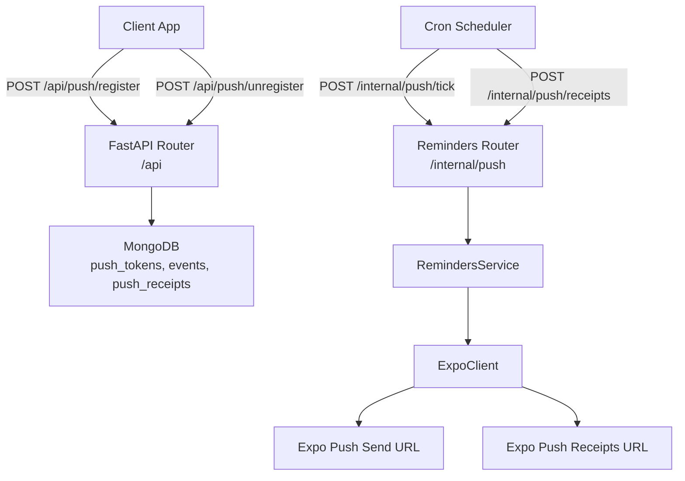
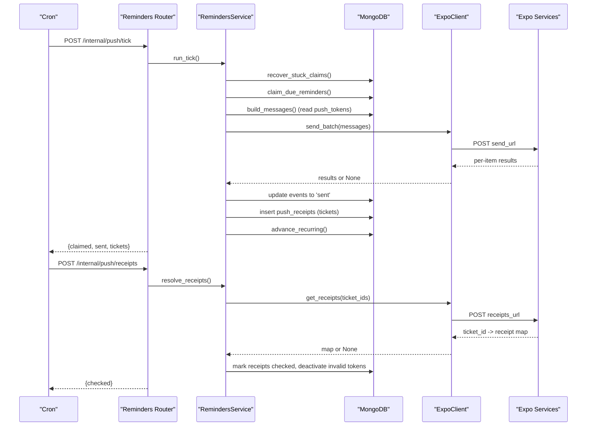
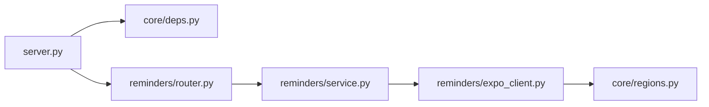

# Reminders & Notifications API

<cite>
**Referenced Files in This Document**
- [server.py](file://server.py)
- [reminders/router.py](file://reminders/router.py)
- [reminders/service.py](file://reminders/service.py)
- [reminders/expo_client.py](file://reminders/expo_client.py)
- [core/deps.py](file://core/deps.py)
- [core/regions.py](file://core/regions.py)
- [accounts/service.py](file://accounts/service.py)
</cite>

## Table of Contents
1. [Introduction](#introduction)
2. [Project Structure](#project-structure)
3. [Core Components](#core-components)
4. [Architecture Overview](#architecture-overview)
5. [Detailed Component Analysis](#detailed-component-analysis)
6. [Dependency Analysis](#dependency-analysis)
7. [Performance Considerations](#performance-considerations)
8. [Troubleshooting Guide](#troubleshooting-guide)
9. [Conclusion](#conclusion)
10. [Appendices](#appendices)

## Introduction
This document provides comprehensive API documentation for the Reminders and Notifications subsystem. It covers:
- Device token registration and unregistration endpoints under /api/push/*
- Internal push scheduling and delivery tracking endpoints under /internal/push/*
- Push notification payload structure, delivery options, and receipt resolution
- Integration with Expo push notifications (and how Firebase is used indirectly via Expo)
- Retry mechanisms, queuing, error handling, and rate limiting considerations

The system uses a cron-driven pipeline to claim due reminders, send them via Expo, track delivery receipts, and advance recurring reminders. Device tokens are stored per user and can be registered or deactivated by authenticated clients.

## Project Structure
Push-related functionality spans two areas:
- Public API (/api): device token management for authenticated users
- Internal API (/internal/push): cron-triggered scheduling and delivery operations protected by a shared secret

**Diagram sources**
- [server.py:126-162](file://server.py#L126-L162)
- [reminders/router.py:9-28](file://reminders/router.py#L9-L28)
- [reminders/service.py:37-177](file://reminders/service.py#L37-L177)
- [reminders/expo_client.py:18-49](file://reminders/expo_client.py#L18-L49)
- [core/regions.py:194-199](file://core/regions.py#L194-L199)

**Section sources**
- [server.py:126-162](file://server.py#L126-L162)
- [reminders/router.py:9-28](file://reminders/router.py#L9-L28)

## Core Components
- Device Token Management (Public API)
  - POST /api/push/register
  - POST /api/push/unregister
- Internal Scheduling and Delivery (Internal API)
  - POST /internal/push/tick
  - POST /internal/push/receipts
- Reminder Delivery Pipeline
  - Claim due reminders atomically
  - Build Expo messages per active device token
  - Batch-send via Expo (up to 100 per call)
  - Track tickets and resolve receipts asynchronously
  - Advance recurring reminders to next occurrence
- Expo Integration
  - Uses configured Expo push endpoints validated against region policy
  - Optional Bearer token via environment variable for secure access

**Section sources**
- [server.py:126-162](file://server.py#L126-L162)
- [reminders/service.py:37-177](file://reminders/service.py#L37-L177)
- [reminders/expo_client.py:18-49](file://reminders/expo_client.py#L18-L49)
- [core/regions.py:194-199](file://core/regions.py#L194-L199)

## Architecture Overview
The reminder delivery pipeline runs as scheduled ticks:
- Recover stuck claims from prior crashes
- Atomically claim due reminders
- Build one message per event per active device token
- Send batches to Expo; record tickets for later receipt resolution
- Mark events sent when processed
- Advance recurring events to their next fire time
- Periodically resolve receipts and deactivate invalid tokens

**Diagram sources**
- [reminders/router.py:19-28](file://reminders/router.py#L19-L28)
- [reminders/service.py:44-177](file://reminders/service.py#L44-L177)
- [reminders/service.py:181-214](file://reminders/service.py#L181-L214)
- [reminders/expo_client.py:26-49](file://reminders/expo_client.py#L26-L49)
- [core/regions.py:194-199](file://core/regions.py#L194-L199)

## Detailed Component Analysis

### Public API: Device Token Management
Endpoints:
- POST /api/push/register
  - Authentication: Required (Bearer token via standard auth flow)
  - Request body schema:
    - token: string (required)
    - platform: string (default "android")
  - Behavior: Upserts a device token for the current user, deduplicated by user_id + token; marks it active and updates timestamp
  - Response: { ok: true }
  - Errors:
    - 400 if token missing
    - 401 if not authenticated
- POST /api/push/unregister
  - Authentication: Required
  - Request body schema: same as register
  - Behavior: Marks the token inactive (kept for late receipt resolution)
  - Response: { ok: true }
  - Errors:
    - 401 if not authenticated

Notes:
- Tokens are scoped to the authenticated user
- Inactive tokens are skipped during delivery
- Account deletion clears push receipts associated with the user’s tokens

**Section sources**
- [server.py:126-162](file://server.py#L126-L162)
- [accounts/service.py:90-107](file://accounts/service.py#L90-L107)

### Internal API: Scheduling and Delivery Tracking
Endpoints:
- POST /internal/push/tick
  - Authentication: Shared secret via header X-Tick-Secret matching PUSH_TICK_SECRET
  - Behavior: Runs the full reminder pipeline (claim, send, track, advance recurring)
  - Response: { claimed: number, sent: number, tickets: number }
  - Errors:
    - 403 if secret missing or mismatch
- POST /internal/push/receipts
  - Authentication: Same shared secret requirement
  - Behavior: Resolves pending Expo delivery receipts, deactivates invalid tokens, marks receipts checked
  - Response: { checked: number }
  - Errors:
    - 403 if secret missing or mismatch

Notes:
- These endpoints are intended for cron or internal schedulers, not public clients
- The tick endpoint enforces atomicity to prevent double-sends across overlapping runs

**Section sources**
- [reminders/router.py:12-28](file://reminders/router.py#L12-L28)

### Reminder Delivery Pipeline (RemindersService)
Key responsibilities:
- Recover stuck claims older than a threshold
- Atomically claim due reminders up to a cap per tick
- Build Expo messages per active device token per event
- Send batches to Expo (max 100 per call), record tickets
- Update event status to sent when processed
- Advance recurring events to next occurrence
- Resolve receipts periodically, deactivate invalid tokens

Important constants:
- MAX_CLAIM_PER_TICK: limits per-run claim loop
- STUCK_CLAIM_MINUTES: recovery window for crashed ticks
- EXPO_BATCH_SIZE: max items per Expo send call
- RECEIPT_READY_AFTER_MINUTES: minimum age before checking receipts
- RECEIPT_GIVE_UP_AFTER_HOURS: stop chasing unresolved receipts after this duration
- RECEIPT_FETCH_LIMIT: batch size for fetching pending receipts

Message construction:
- For each claimed event, find active tokens for that user
- If no active tokens, mark event as sent immediately
- Construct Expo message with title, body, data, sound, channelId
- Title falls back to generic text when content is encrypted

Delivery and tracking:
- Batch send to Expo; on success, record ticket and event mapping
- On per-item errors, handle DeviceNotRegistered by deactivating token
- Persist receipts for later resolution

Recurring advancement:
- Compute next occurrence based on recurrence rule and timezone
- Reset reminder status to pending and set new fire time

Receipt resolution:
- Fetch pending receipts ready for checking
- Query Expo for receipt status per ticket
- Deactivate tokens flagged as DeviceNotRegistered
- Mark receipts as checked; give up on very old unresolved receipts

**Section sources**
- [reminders/service.py:24-35](file://reminders/service.py#L24-L35)
- [reminders/service.py:44-177](file://reminders/service.py#L44-L177)
- [reminders/service.py:181-214](file://reminders/service.py#L181-L214)

### Expo Integration
ExpoClient:
- send_batch(messages): POST up to 100 messages to Expo send URL; returns per-item results or None on transport failure
- get_receipts(ticket_ids): POST up to 300 ticket IDs to receipts URL; returns ticket_id -> receipt map or None on failure
- Headers include Content-Type and Accept; optional Authorization Bearer from environment
- URLs obtained from core.regions to enforce region compliance

Region enforcement:
- Expo push endpoints must be declared via environment variables and validated against Australian region allowlist at startup
- Accessors ensure region validation on every call

**Section sources**
- [reminders/expo_client.py:18-49](file://reminders/expo_client.py#L18-L49)
- [core/regions.py:58-77](file://core/regions.py#L58-L77)
- [core/regions.py:144-165](file://core/regions.py#L144-L165)
- [core/regions.py:194-199](file://core/regions.py#L194-L199)

### Data Models and Schemas

#### PushTokenBody (Request Schema)
- token: string (required)
- platform: string (default "android")

Used by:
- POST /api/push/register
- POST /api/push/unregister

**Section sources**
- [server.py:129-132](file://server.py#L129-L132)

#### Push Message Payload (Expo)
Constructed per event per active token:
- to: device token string
- title: event title or fallback "Event Reminder"
- body: human-readable reminder label indicating start time offset
- data: object containing eventId and kind ("event-reminder")
- sound: "default"
- channelId: "event-reminders"

Notes:
- When event content is encrypted, title falls back to generic text to avoid showing ciphertext

**Section sources**
- [reminders/service.py:69-91](file://reminders/service.py#L69-L91)

#### Push Receipt Record (Stored)
- ticket_id: Expo ticket identifier
- event_id: event identifier
- token: device token
- created_at: ISO timestamp
- checked: boolean flag

Used to track delivery outcomes and reconcile with Expo receipts.

**Section sources**
- [reminders/service.py:93-118](file://reminders/service.py#L93-L118)
- [reminders/service.py:181-214](file://reminders/service.py#L181-L214)

### Error Handling and Edge Cases
- Missing token in register: 400
- Unauthenticated requests: 401
- Internal tick secret mismatch: 403
- Transport failures to Expo: whole batch left claimed for retry on next tick
- Per-item errors:
  - DeviceNotRegistered: token marked inactive
  - Other errors: logged as warnings
- Stuck claims: recovered by resetting to pending if claim older than threshold
- Receipt resolution:
  - Unknown ticket: mark checked if beyond give-up window
  - Error receipts: deactivate invalid tokens; otherwise mark checked

**Section sources**
- [server.py:134-162](file://server.py#L134-L162)
- [reminders/router.py:12-28](file://reminders/router.py#L12-L28)
- [reminders/service.py:44-118](file://reminders/service.py#L44-L118)
- [reminders/service.py:181-214](file://reminders/service.py#L181-L214)

### Retry Mechanisms and Queuing
- Atomic claim loop prevents double-sends; overlapping ticks cannot claim the same event
- Stuck claim recovery resets stale claims to pending
- Expo send failures leave events claimed so they can be retried on subsequent ticks
- Receipt resolution runs periodically; unresolved receipts are eventually pruned

**Section sources**
- [reminders/service.py:44-67](file://reminders/service.py#L44-L67)
- [reminders/service.py:93-118](file://reminders/service.py#L93-L118)
- [reminders/service.py:181-214](file://reminders/service.py#L181-L214)

### Rate Limiting and Frequency Controls
- No explicit per-endpoint rate limiter is applied to push endpoints in this codebase
- Expo imposes its own per-call limits (batch sizes enforced by client)
- AI endpoints have sliding-window rate limiting; not applicable to push endpoints
- Operational controls:
  - Tick frequency controlled by scheduler (e.g., once per minute)
  - Receipt resolution runs less frequently (~every 15–20 minutes)
  - Batch sizes cap outbound calls to Expo

**Section sources**
- [reminders/service.py:24-35](file://reminders/service.py#L24-L35)
- [reminders/expo_client.py:26-49](file://reminders/expo_client.py#L26-L49)
- [core/ratelimit.py:1-124](file://core/ratelimit.py#L1-124)

## Dependency Analysis
- server.py mounts routers and defines public push endpoints
- reminders/router.py exposes internal endpoints gated by shared secret
- reminders/service.py implements business logic for claiming, sending, tracking, and advancing
- reminders/expo_client.py handles HTTP calls to Expo endpoints
- core/regions.py validates and provides Expo endpoints with region checks
- core/deps.py provides authentication dependency used by public endpoints

**Diagram sources**
- [server.py:175-197](file://server.py#L175-L197)
- [reminders/router.py:1-28](file://reminders/router.py#L1-L28)
- [reminders/service.py:1-22](file://reminders/service.py#L1-L22)
- [reminders/expo_client.py:1-16](file://reminders/expo_client.py#L1-L16)
- [core/regions.py:1-19](file://core/regions.py#L1-L19)

**Section sources**
- [server.py:175-197](file://server.py#L175-L197)
- [reminders/router.py:1-28](file://reminders/router.py#L1-L28)
- [reminders/service.py:1-22](file://reminders/service.py#L1-L22)
- [reminders/expo_client.py:1-16](file://reminders/expo_client.py#L1-L16)
- [core/regions.py:1-19](file://core/regions.py#L1-L19)

## Performance Considerations
- Batch sizes:
  - Max 100 messages per Expo send call
  - Max 300 ticket IDs per receipts call
- Database operations:
  - Atomic find_one_and_update prevents duplicate sends
  - Bulk updates for marking events sent
  - Indexed queries on push_tokens (user_id, active) and token
- Timeouts:
  - HTTPX timeout set for Expo calls
- Concurrency:
  - Async I/O for database and network calls
- Operational caps:
  - Claim loop capped per tick to avoid long-running jobs

[No sources needed since this section provides general guidance]

## Troubleshooting Guide
Common issues and resolutions:
- 401 Not authenticated: Ensure valid Bearer token is provided for /api/push/* endpoints
- 403 Forbidden: Internal endpoints require correct X-Tick-Secret header
- DeviceNotRegistered: Token deactivated automatically; re-register device token
- Expo send failures: Events remain claimed; retry on next tick; check logs for transport errors
- Stuck claims: Recovery process resets stale claims to pending; verify scheduler health
- Receipts not resolving: Check readiness window and give-up thresholds; ensure periodic receipt resolution runs

Operational checks:
- Verify environment variables for Expo endpoints and region configuration
- Confirm PUSH_TICK_SECRET matches expected value
- Monitor logs for warnings and errors related to Expo calls and receipt resolution

**Section sources**
- [reminders/router.py:12-28](file://reminders/router.py#L12-L28)
- [reminders/service.py:93-118](file://reminders/service.py#L93-L118)
- [reminders/service.py:181-214](file://reminders/service.py#L181-L214)
- [core/regions.py:144-165](file://core/regions.py#L144-L165)

## Conclusion
The Reminders & Notifications API provides robust device token management and a reliable, batched push delivery pipeline using Expo. Internal scheduling endpoints enable safe, idempotent processing with automatic recovery and receipt resolution. Region-compliant configuration ensures data residency constraints are enforced. Clients interact only with device registration endpoints; all delivery logic is handled internally.

[No sources needed since this section summarizes without analyzing specific files]

## Appendices

### Protocol Examples

- Register device token
  - Method: POST
  - URL: /api/push/register
  - Headers: Authorization: Bearer <access_token>
  - Body: { "token": "<device_token>", "platform": "android" }
  - Response: { "ok": true }

- Unregister device token
  - Method: POST
  - URL: /api/push/unregister
  - Headers: Authorization: Bearer <access_token>
  - Body: { "token": "<device_token>", "platform": "android" }
  - Response: { "ok": true }

- Trigger reminder tick (internal)
  - Method: POST
  - URL: /internal/push/tick
  - Headers: X-Tick-Secret: <shared_secret>
  - Response: { "claimed": <number>, "sent": <number>, "tickets": <number> }

- Resolve receipts (internal)
  - Method: POST
  - URL: /internal/push/receipts
  - Headers: X-Tick-Secret: <shared_secret>
  - Response: { "checked": <number> }

Note: These examples reflect the actual endpoints and behaviors defined in the codebase.

**Section sources**
- [server.py:126-162](file://server.py#L126-L162)
- [reminders/router.py:19-28](file://reminders/router.py#L19-L28)