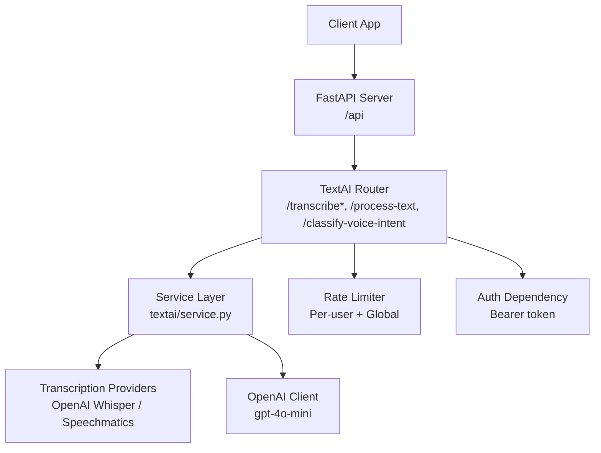
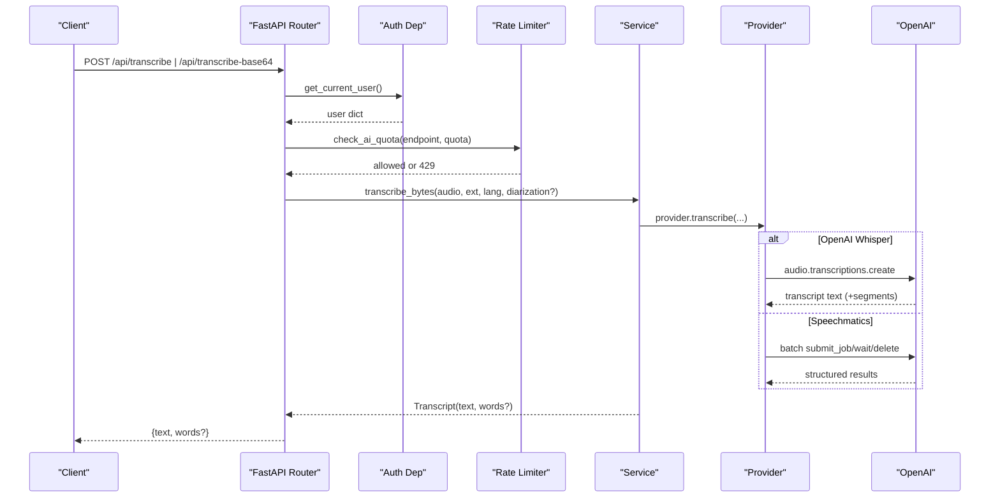
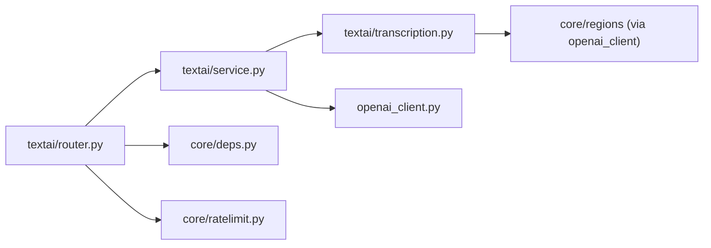

# Text AI API

<cite>
**Referenced Files in This Document**
- [server.py](file://server.py)
- [textai/router.py](file://textai/router.py)
- [textai/service.py](file://textai/service.py)
- [textai/schemas.py](file://textai/schemas.py)
- [textai/transcription.py](file://textai/transcription.py)
- [openai_client.py](file://openai_client.py)
- [core/deps.py](file://core/deps.py)
- [core/ratelimit.py](file://core/ratelimit.py)
</cite>

## Table of Contents
1. [Introduction](#introduction)
2. [Project Structure](#project-structure)
3. [Core Components](#core-components)
4. [Architecture Overview](#architecture-overview)
5. [Detailed Component Analysis](#detailed-component-analysis)
6. [Dependency Analysis](#dependency-analysis)
7. [Performance Considerations](#performance-considerations)
8. [Troubleshooting Guide](#troubleshooting-guide)
9. [Conclusion](#conclusion)

## Introduction
This document provides comprehensive API documentation for the Text AI endpoints that power audio transcription, text processing (organize/summarize/smart format), and voice intent classification. It covers HTTP methods, URL patterns under /api, request/response schemas, authentication requirements, OpenAI integration, Speechmatics transcription service, quota management, rate limiting, supported audio formats, error responses, and protocol-specific examples.

## Project Structure
The Text AI functionality is implemented as a FastAPI router mounted under the application’s /api prefix. The router defines endpoints for:
- Audio transcription via file upload or base64 payload
- Text processing actions (organize, summarize, smart_format)
- Voice intent classification from transcripts

**Diagram sources**
- [server.py:207-208](file://server.py#L207-L208)
- [textai/router.py:75-163](file://textai/router.py#L75-L163)
- [textai/service.py:112-315](file://textai/service.py#L112-L315)
- [textai/transcription.py:78-321](file://textai/transcription.py#L78-L321)
- [openai_client.py:15-24](file://openai_client.py#L15-L24)
- [core/ratelimit.py:96-124](file://core/ratelimit.py#L96-L124)
- [core/deps.py:24-50](file://core/deps.py#L24-L50)

**Section sources**
- [server.py:207-208](file://server.py#L207-L208)

## Core Components
- Authentication: All endpoints require a valid Bearer token resolved by the shared dependency.
- Quota enforcement: Each endpoint enforces per-user and global quotas before calling external services.
- Transcription providers:
  - OpenAI Whisper (default): text-only output; supports language hint; no diarization.
  - Speechmatics: optional diarization with speaker labels; word-level timestamps; robust retry/backoff on rate limits.
- Text processing: Uses OpenAI gpt-4o-mini to organize, summarize, or smart-format notes into structured HTML with note type detection.
- Voice intent classification: Classifies transcripts into note vs scheduling intents and extracts structured events when applicable.

**Section sources**
- [core/deps.py:24-50](file://core/deps.py#L24-L50)
- [core/ratelimit.py:96-124](file://core/ratelimit.py#L96-L124)
- [textai/transcription.py:78-321](file://textai/transcription.py#L78-L321)
- [textai/service.py:133-315](file://textai/service.py#L133-L315)

## Architecture Overview
The request flow includes authentication, quota checks, provider selection, and response shaping. For transcription, the router delegates to the service layer which selects a provider based on configuration and features like diarization. For text operations, the service calls OpenAI chat completions with specific prompts and parses results.

**Diagram sources**
- [textai/router.py:75-131](file://textai/router.py#L75-L131)
- [textai/service.py:112-131](file://textai/service.py#L112-L131)
- [textai/transcription.py:78-133](file://textai/transcription.py#L78-L133)
- [textai/transcription.py:171-286](file://textai/transcription.py#L171-L286)
- [openai_client.py:15-24](file://openai_client.py#L15-L24)

## Detailed Component Analysis

### Authentication and Quotas
- Authentication: Endpoints depend on a Bearer token validated against sessions. Missing/invalid/expired tokens return 401.
- Quotas: Per-endpoint per-user limits and a global limit protect the shared OpenAI key. Exceeded quotas return 429 with Retry-After header.

Endpoints protected:
- /api/transcribe
- /api/transcribe-base64
- /api/process-text
- /api/classify-voice-intent

Quota values:
- Transcription: 10 requests per minute per user
- Voice intent: 20 requests per minute per user
- Text processing: 15 requests per minute per user
- Global: 120 requests per minute across all users

**Section sources**
- [core/deps.py:24-50](file://core/deps.py#L24-L50)
- [core/ratelimit.py:96-124](file://core/ratelimit.py#L96-L124)
- [textai/router.py:28-49](file://textai/router.py#L28-L49)

### Endpoint: POST /api/transcribe
Upload an audio file for transcription.

- Method: POST
- Path: /api/transcribe
- Authentication: Required (Bearer token)
- Request:
  - multipart/form-data
  - file: audio file (required)
  - language: ISO-639-1 hint (optional)
- Supported formats: Any container accepted by the selected provider; .caf is normalized to .m4a internally.
- Response:
  - 200 OK: JSON object with text and optional words array (when provider supplies word timestamps).
  - 401 Unauthorized: Invalid or missing token.
  - 429 Too Many Requests: Quota exceeded; includes Retry-After header.
  - 500 Internal Server Error: Transcription failure.

Example (multipart form):
- Content-Type: multipart/form-data
- Fields:
  - file: binary audio
  - language: "en" (optional)

Response schema:
- text: string
- words: array of objects (optional)
  - word: string
  - start: number
  - end: number
  - speaker: string (optional)
  - confidence: number (optional)

**Section sources**
- [textai/router.py:106-131](file://textai/router.py#L106-L131)
- [textai/service.py:112-131](file://textai/service.py#L112-L131)
- [textai/transcription.py:102-133](file://textai/transcription.py#L102-L133)

### Endpoint: POST /api/transcribe-base64
Transcribe audio provided as base64-encoded data.

- Method: POST
- Path: /api/transcribe-base64
- Authentication: Required (Bearer token)
- Request body (JSON):
  - audio_base64: string (required)
  - file_extension: string (default "m4a")
  - language: ISO-639-1 hint (optional)
  - diarization: string (optional; enables diarization if supported)
- Supported formats: Determined by file_extension; .caf normalized to .m4a.
- Response: Same as /api/transcribe.

Example JSON:
{
  "audio_base64": "<base64-encoded-audio>",
  "file_extension": "m4a",
  "language": "en",
  "diarization": "speaker"
}

**Section sources**
- [textai/router.py:75-104](file://textai/router.py#L75-L104)
- [textai/schemas.py:6-18](file://textai/schemas.py#L6-L18)
- [textai/service.py:112-131](file://textai/service.py#L112-L131)

### Endpoint: POST /api/process-text
Process text using AI with one of three actions.

- Method: POST
- Path: /api/process-text
- Authentication: Required (Bearer token)
- Request body (JSON):
  - text: string (required)
  - action: string; one of "organize", "summarize", "smart_format"
- Response:
  - 200 OK: JSON object with text; smart_format may include note_type.
  - 400 Bad Request: Invalid action.
  - 429 Too Many Requests: Quota exceeded; includes Retry-After header.
  - 500 Internal Server Error: Empty or malformed AI response.

Action details:
- organize: Returns organized text with improved readability.
- summarize: Returns concise summary preserving key points.
- smart_format: Detects note type and returns structured HTML; response may include note_type.

Response schema:
- text: string
- note_type: string; one of "recipe", "checklist", "meeting_notes", "general" (only present for smart_format)

**Section sources**
- [textai/router.py:136-149](file://textai/router.py#L136-L149)
- [textai/service.py:133-233](file://textai/service.py#L133-L233)
- [textai/schemas.py:20-42](file://textai/schemas.py#L20-L42)

### Endpoint: POST /api/classify-voice-intent
Classify a transcript to determine if it is plain dictation or a scheduling request, and extract events when applicable.

- Method: POST
- Path: /api/classify-voice-intent
- Authentication: Required (Bearer token)
- Request body (JSON):
  - transcript: string (required)
  - reference_date: string; ISO date representing device’s “today”
  - timezone: string; IANA timezone name (e.g., "Australia/Sydney")
- Response:
  - 200 OK: JSON object with intent, optional trip_name, and events array.
  - 429 Too Many Requests: Quota exceeded; includes Retry-After header.
  - 500 Internal Server Error: Empty or malformed AI response.

Intent types:
- note: Plain dictation; events array empty.
- single_event: One event extracted.
- multiple_events: Multiple unrelated events.
- itinerary: Several related events grouped as a trip; trip_name set.

Events schema:
- title: string (required)
- start_time: string; ISO datetime with UTC offset (required)
- end_time: string; optional
- location: string; default ""
- recurrence: object; optional
  - freq: "daily" | "weekly" | "monthly" | "yearly"
  - byweekday: array of integers 0–6 (0=Sunday); optional
  - until: string; optional
- confidence: "high" | "low"; default "low"

**Section sources**
- [textai/router.py:151-163](file://textai/router.py#L151-L163)
- [textai/service.py:259-315](file://textai/service.py#L259-L315)
- [textai/schemas.py:44-143](file://textai/schemas.py#L44-L143)

### Provider Behavior and Diarization
- OpenAI Whisper:
  - Default provider unless overridden.
  - No diarization support; ignores diarization parameter.
  - Filters out hallucinated segments from silence using segment metrics.
- Speechmatics:
  - Optional diarization enabled via diarization parameter; uses speaker labels.
  - Provides word-level timestamps enabling tap-to-seek playback.
  - Implements retry with exponential backoff and jitter on 429 responses.
  - Deletes jobs after completion to minimize retention.

Provider selection:
- Primary provider determined by environment variable; falls back to OpenAI.
- If diarization requested and primary does not support it, and Speechmatics is configured, switches to Speechmatics.

**Section sources**
- [textai/transcription.py:78-133](file://textai/transcription.py#L78-L133)
- [textai/transcription.py:171-321](file://textai/transcription.py#L171-L321)

### OpenAI Integration
- Text processing and voice intent classification use OpenAI chat completions with model gpt-4o-mini.
- Base URL is pinned via region configuration to ensure residency compliance.
- Requires OPENAI_API_KEY or EMERGENT_LLM_KEY environment variable.

**Section sources**
- [textai/service.py:133-315](file://textai/service.py#L133-L315)
- [openai_client.py:15-24](file://openai_client.py#L15-L24)

### Quota Management and Rate Limiting
- Sliding window limiter tracks per-user and global usage.
- On quota exceedance:
  - Status code: 429
  - Header: Retry-After (seconds until next allowed request)
  - Scope indicator: "user" or "global"
- Limits are per-endpoint so hitting one quota does not block others.

**Section sources**
- [core/ratelimit.py:41-124](file://core/ratelimit.py#L41-L124)
- [textai/router.py:28-49](file://textai/router.py#L28-L49)

## Dependency Analysis

**Diagram sources**
- [textai/router.py:1-24](file://textai/router.py#L1-L24)
- [textai/service.py:1-23](file://textai/service.py#L1-L23)
- [textai/transcription.py:1-23](file://textai/transcription.py#L1-L23)
- [openai_client.py:1-24](file://openai_client.py#L1-L24)
- [core/deps.py:1-51](file://core/deps.py#L1-L51)
- [core/ratelimit.py:1-124](file://core/ratelimit.py#L1-L124)

**Section sources**
- [textai/router.py:1-24](file://textai/router.py#L1-L24)
- [textai/service.py:1-23](file://textai/service.py#L1-L23)
- [textai/transcription.py:1-23](file://textai/transcription.py#L1-L23)
- [openai_client.py:1-24](file://openai_client.py#L1-L24)
- [core/deps.py:1-51](file://core/deps.py#L1-L51)
- [core/ratelimit.py:1-124](file://core/ratelimit.py#L1-L124)

## Performance Considerations
- Transcription latency:
  - OpenAI Whisper: depends on audio length and network; typically seconds.
  - Speechmatics: job submission, polling, and deletion; typical latency includes retries and backoff.
- Word-level timestamps:
  - Available only when provider supplies them (Speechmatics); clients should degrade gracefully when absent.
- Diarization:
  - Only available via Speechmatics; increases processing time slightly due to speaker separation.
- Shadow mode:
  - Optional background transcription run for evaluation; does not affect request latency.

[No sources needed since this section provides general guidance]

## Troubleshooting Guide
Common errors and handling:
- 401 Unauthorized:
  - Cause: Missing or invalid Bearer token.
  - Action: Ensure Authorization header contains a valid token.
- 400 Bad Request:
  - Cause: Invalid action for process-text or invalid base64 audio data.
  - Action: Validate request fields and content encoding.
- 429 Too Many Requests:
  - Cause: Per-user or global quota exceeded.
  - Action: Respect Retry-After header and back off client-side.
- 500 Internal Server Error:
  - Cause: Empty or malformed AI response; transcription failures.
  - Action: Retry after a delay; check logs for provider errors.

Provider-specific issues:
- Speechmatics rate limits:
  - Automatic retries with exponential backoff and jitter; persistent failures logged.
- Job retention:
  - Jobs deleted inline; reconciliation sweep cleans stale jobs periodically.

**Section sources**
- [textai/router.py:75-163](file://textai/router.py#L75-L163)
- [textai/transcription.py:135-145](file://textai/transcription.py#L135-L145)
- [textai/transcription.py:235-252](file://textai/transcription.py#L235-L252)
- [textai/transcription.py:323-361](file://textai/transcription.py#L323-L361)

## Conclusion
The Text AI API provides secure, quota-managed endpoints for audio transcription, text processing, and voice intent classification. It integrates OpenAI Whisper and Speechmatics for flexible transcription options and leverages OpenAI GPT models for intelligent text operations. Robust error handling, rate limiting, and provider-specific optimizations ensure reliable performance while protecting shared resources.

[No sources needed since this section summarizes without analyzing specific files]