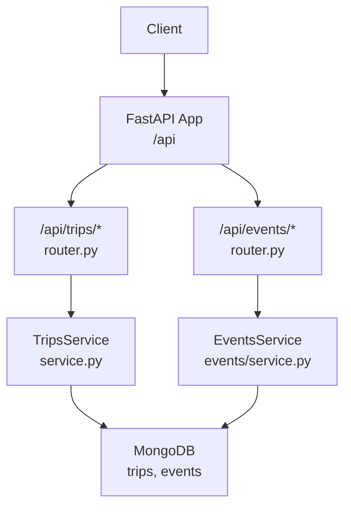
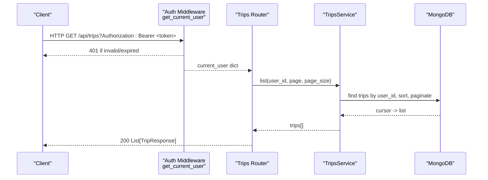
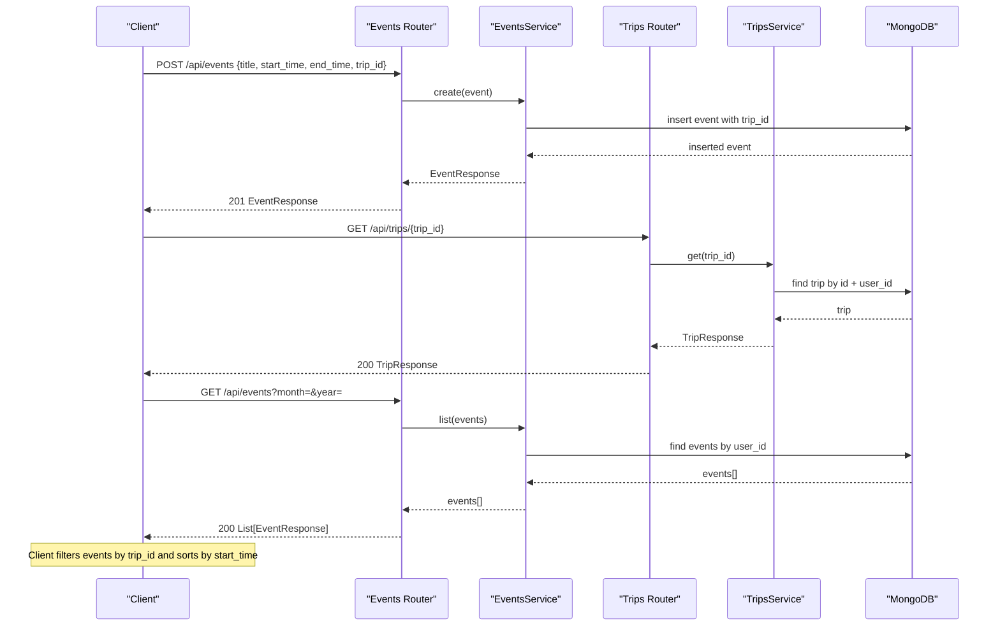
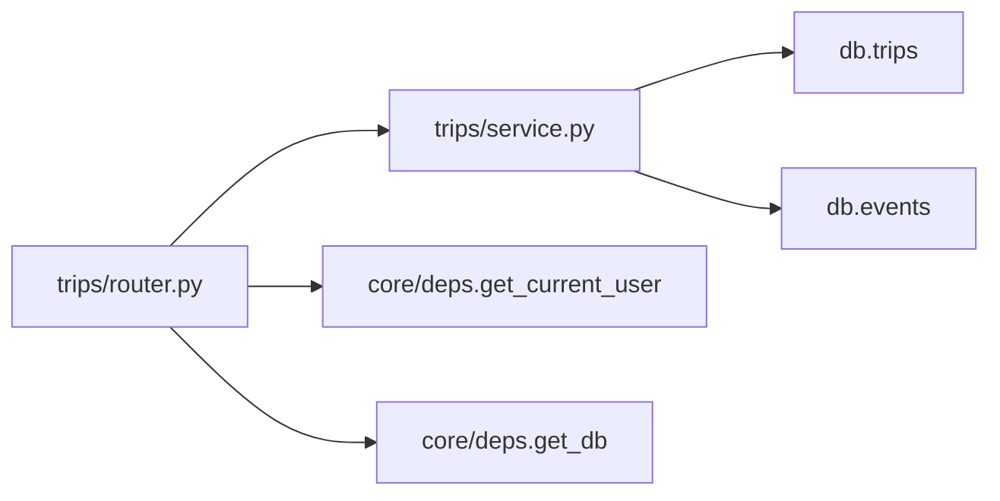

# Trips API

<cite>
**Referenced Files in This Document**
- [server.py](file://server.py)
- [core/deps.py](file://core/deps.py)
- [trips/router.py](file://trips/router.py)
- [trips/schemas.py](file://trips/schemas.py)
- [trips/service.py](file://trips/service.py)
- [events/router.py](file://events/router.py)
- [events/schemas.py](file://events/schemas.py)
</cite>

## Table of Contents
1. [Introduction](#introduction)
2. [Project Structure](#project-structure)
3. [Core Components](#core-components)
4. [Architecture Overview](#architecture-overview)
5. [Detailed Component Analysis](#detailed-component-analysis)
6. [Dependency Analysis](#dependency-analysis)
7. [Performance Considerations](#performance-considerations)
8. [Troubleshooting Guide](#troubleshooting-guide)
9. [Conclusion](#conclusion)
10. [Appendices](#appendices)

## Introduction
This document provides comprehensive API documentation for the Trips endpoints under /api/trips/*. It covers trip creation, listing, retrieval, updates, and deletion; explains how trips relate to events for timeline synchronization; and documents authentication, request/response schemas, validation rules, error responses, and integration patterns with the Events system.

Trips are lightweight containers that group calendar events into a named itinerary. The trip’s own timeline is computed client-side by sorting linked events by start time; there is no separate ordering or scheduling data stored on the trip itself.

## Project Structure
The Trips feature is implemented as a FastAPI router mounted under /api/trips. Authentication and database access are provided via shared dependencies. The server mounts routers and creates necessary indexes for efficient queries.

**Diagram sources**
- [server.py:175-188](file://server.py#L175-L188)
- [trips/router.py:16-96](file://trips/router.py#L16-L96)
- [events/router.py:16-111](file://events/router.py#L16-L111)

**Section sources**
- [server.py:175-188](file://server.py#L175-L188)
- [trips/router.py:16-96](file://trips/router.py#L16-L96)
- [events/router.py:16-111](file://events/router.py#L16-L111)

## Core Components
- Trips Router: Exposes CRUD endpoints for trips under /api/trips.
- Trips Service: Implements business logic, payload validation, pagination, and persistence operations.
- Schemas: Define TripCreate, TripUpdate, TripResponse models.
- Events Integration: Events carry an optional trip_id to associate them with a trip; deleting a trip cascades by unsetting trip_id on associated events.

Key responsibilities:
- Enforce user scoping (user_id) on all operations.
- Validate payload sizes for name and description.
- Provide paginated listing with deterministic ordering.
- Maintain referential integrity when deleting trips.

**Section sources**
- [trips/router.py:23-96](file://trips/router.py#L23-L96)
- [trips/service.py:39-102](file://trips/service.py#L39-L102)
- [trips/schemas.py:5-26](file://trips/schemas.py#L5-L26)
- [events/schemas.py:11-89](file://events/schemas.py#L11-L89)

## Architecture Overview
Authentication is enforced via a Bearer token in the Authorization header. All trip endpoints require a valid token and operate within the authenticated user’s scope.

**Diagram sources**
- [core/deps.py:24-50](file://core/deps.py#L24-L50)
- [trips/router.py:37-50](file://trips/router.py#L37-L50)
- [trips/service.py:65-75](file://trips/service.py#L65-L75)

## Detailed Component Analysis

### Authentication Requirements
- All /api/trips/* endpoints require a valid Bearer token in the Authorization header.
- Missing or malformed Authorization header returns 401.
- Invalid or expired tokens return 401.
- Token verification binds to a session; logout revokes tokens server-side.

**Section sources**
- [core/deps.py:24-50](file://core/deps.py#L24-L50)
- [auth/router.py:115-140](file://auth/router.py#L115-L140)
- [auth/router.py:301-314](file://auth/router.py#L301-L314)

### Endpoints

#### Create Trip
- Method: POST
- URL: /api/trips
- Request Body: TripCreate
- Response: TripResponse
- Notes:
  - Validates name and description length limits.
  - Creates a new trip scoped to the authenticated user.
  - Returns 413 if payload exceeds size limits.

**Section sources**
- [trips/router.py:23-34](file://trips/router.py#L23-L34)
- [trips/service.py:51-63](file://trips/service.py#L51-L63)
- [trips/service.py:39-44](file://trips/service.py#L39-L44)

#### List Trips
- Method: GET
- URL: /api/trips?page={page}&page_size={page_size}
- Query Parameters:
  - page: integer >= 1
  - page_size: integer between 1 and MAX_TRIPS_PAGE_SIZE
- Response: Array of TripResponse
- Notes:
  - Paginated; returns a bare array for wire compatibility.
  - Deterministic ordering by created_at desc then id asc.

**Section sources**
- [trips/router.py:37-50](file://trips/router.py#L37-L50)
- [trips/service.py:65-75](file://trips/service.py#L65-L75)

#### Get Trip
- Method: GET
- URL: /api/trips/{trip_id}
- Response: TripResponse
- Notes:
  - Returns 404 if trip not found or not owned by user.

**Section sources**
- [trips/router.py:53-64](file://trips/router.py#L53-L64)
- [trips/service.py:77-81](file://trips/service.py#L77-L81)

#### Update Trip
- Method: PUT
- URL: /api/trips/{trip_id}
- Request Body: TripUpdate
- Response: TripResponse
- Notes:
  - Partial update using only provided fields.
  - Validates name/description lengths if present.
  - Returns 404 if trip not found or not owned by user.
  - Returns 413 if payload exceeds size limits.

**Section sources**
- [trips/router.py:67-81](file://trips/router.py#L67-L81)
- [trips/service.py:83-91](file://trips/service.py#L83-L91)
- [trips/service.py:39-44](file://trips/service.py#L39-L44)

#### Delete Trip
- Method: DELETE
- URL: /api/trips/{trip_id}
- Response: {"message": "Trip deleted"}
- Notes:
  - Cascades by unsetting trip_id on all events belonging to the same user that reference this trip before deleting the trip document.
  - Returns 404 if trip not found or not owned by user.

**Section sources**
- [trips/router.py:84-96](file://trips/router.py#L84-L96)
- [trips/service.py:93-102](file://trips/service.py#L93-L102)

### Schemas

#### TripCreate
- Fields:
  - name: string (required)
  - description: string (optional, default empty)
  - enc_version: integer (optional; E2EE version flag)

Validation:
- Name length must not exceed configured maximum (with ciphertext headroom).
- Description length must not exceed configured maximum (with ciphertext headroom).

**Section sources**
- [trips/schemas.py:5-11](file://trips/schemas.py#L5-L11)
- [trips/service.py:25-30](file://trips/service.py#L25-L30)
- [trips/service.py:39-44](file://trips/service.py#L39-L44)

#### TripUpdate
- Fields:
  - name: string (optional)
  - description: string (optional)
  - enc_version: integer (optional)

Validation:
- Same length constraints apply to provided fields.

**Section sources**
- [trips/schemas.py:13-17](file://trips/schemas.py#L13-L17)
- [trips/service.py:39-44](file://trips/service.py#L39-L44)

#### TripResponse
- Fields:
  - id: string
  - name: string
  - description: string
  - user_id: string (optional)
  - enc_version: integer (optional)
  - created_at: string (ISO timestamp)

**Section sources**
- [trips/schemas.py:19-26](file://trips/schemas.py#L19-L26)

### Timeline Synchronization and Event Linking
- Trips do not store their own timeline; instead, clients compute the timeline by retrieving events linked to a trip and sorting by start_time.
- Events can be associated with a trip via the event’s trip_id field.
- Deleting a trip removes the association by setting trip_id to null for all events owned by the user that referenced the trip.

**Diagram sources**
- [events/router.py:23-34](file://events/router.py#L23-L34)
- [events/router.py:37-53](file://events/router.py#L37-L53)
- [trips/router.py:53-64](file://trips/router.py#L53-L64)
- [trips/service.py:77-81](file://trips/service.py#L77-L81)

**Section sources**
- [events/schemas.py:11-89](file://events/schemas.py#L11-L89)
- [trips/service.py:93-102](file://trips/service.py#L93-L102)

### Validation Rules
- Name and description length limits are enforced at service level for both create and update operations. Limits include headroom for encrypted payloads.
- Pagination parameters are validated at the router level:
  - page must be >= 1
  - page_size must be between 1 and MAX_TRIPS_PAGE_SIZE

**Section sources**
- [trips/service.py:25-30](file://trips/service.py#L25-L30)
- [trips/service.py:39-44](file://trips/service.py#L39-L44)
- [trips/router.py:37-45](file://trips/router.py#L37-L45)

### Error Responses
- 401 Not authenticated: Missing or invalid Authorization header or token.
- 404 Not found: Trip not found or not owned by user.
- 413 Payload too large: Name or description exceeds maximum allowed length.
- General 4xx/5xx may occur from underlying services or database errors.

**Section sources**
- [core/deps.py:24-50](file://core/deps.py#L24-L50)
- [trips/router.py:30-34](file://trips/router.py#L30-L34)
- [trips/router.py:60-64](file://trips/router.py#L60-L64)
- [trips/router.py:74-81](file://trips/router.py#L74-L81)
- [trips/router.py:90-96](file://trips/router.py#L90-L96)

### Trip State Management
- Trips are immutable except for name, description, and encryption version updates.
- Deletion cascades by unlinking events (setting trip_id to null) before removing the trip document.
- No explicit state machine; lifecycle is create -> read/update -> delete.

**Section sources**
- [trips/service.py:83-102](file://trips/service.py#L83-L102)

## Dependency Analysis
- Trips Router depends on:
  - get_current_user for authentication
  - get_db for database access
  - TripsService for business logic
- Trips Service depends on:
  - MongoDB trips collection for persistence
  - MongoDB events collection for cascade unlinking on delete
- Server mounts routers and creates indexes for performance.

**Diagram sources**
- [trips/router.py:6-14](file://trips/router.py#L6-L14)
- [trips/service.py:12-15](file://trips/service.py#L12-L15)
- [core/deps.py:15-50](file://core/deps.py#L15-L50)

**Section sources**
- [trips/router.py:6-14](file://trips/router.py#L6-L14)
- [trips/service.py:12-15](file://trips/service.py#L12-L15)
- [core/deps.py:15-50](file://core/deps.py#L15-L50)

## Performance Considerations
- Pagination uses deterministic sorting by created_at desc and id asc to avoid row loss across pages.
- Database indexes are created for:
  - trips: (user_id, created_at), (user_id, created_at, id), (user_id, id)
  - events: (user_id, start_time), (user_id, start_time, id), (user_id, id), id, reminder scheduler partial index, and (trip_id, user_id) for trip cascade operations.
- These indexes ensure efficient listing, retrieval, and cascade unlinking.

**Section sources**
- [trips/service.py:65-75](file://trips/service.py#L65-L75)
- [server.py:394-402](file://server.py#L394-L402)

## Troubleshooting Guide
Common issues and resolutions:
- 401 Unauthorized: Ensure Authorization header contains a valid Bearer token. Verify token has not been revoked via logout.
- 404 Not Found: Confirm trip_id exists and belongs to the authenticated user.
- 413 Payload Too Large: Reduce name or description length to meet limits.
- Timeline appears incorrect: Ensure events have correct start_time and trip_id; client should sort events by start_time to build the timeline.

Operational checks:
- Health endpoint: GET /api/health
- Verify indexes exist at startup to ensure optimal query performance.

**Section sources**
- [core/deps.py:24-50](file://core/deps.py#L24-L50)
- [trips/router.py:30-34](file://trips/router.py#L30-L34)
- [trips/router.py:60-64](file://trips/router.py#L60-L64)
- [server.py:170-173](file://server.py#L170-L173)
- [server.py:394-402](file://server.py#L394-L402)

## Conclusion
The Trips API provides a minimal, secure, and efficient way to manage travel plans by grouping events under named trips. Authentication is enforced via Bearer tokens, and all operations are scoped to the authenticated user. Trips themselves are simple containers; timelines are derived client-side from linked events. Robust validation, pagination, and indexing ensure reliability and performance. Integration with the Events system enables seamless trip planning and timeline synchronization.

## Appendices

### Protocol-Specific Examples

- Creating a Travel Plan
  - Method: POST
  - URL: /api/trips
  - Headers: Authorization: Bearer <token>
  - Body: TripCreate
  - Success: 201 with TripResponse
  - Errors: 401, 413

- Adding an Event to a Trip
  - Method: POST
  - URL: /api/events
  - Headers: Authorization: Bearer <token>
  - Body: EventCreate including trip_id
  - Success: 201 with EventResponse
  - Errors: 401, 413

- Managing Trip Timelines
  - Retrieve trips: GET /api/trips?page=1&page_size=200
  - Retrieve events: GET /api/events?month=&year=
  - Client computes timeline by filtering events by trip_id and sorting by start_time

- Synchronizing with External Calendars
  - Events support Google Calendar bridge fields (google_event_id, google_calendar_id, google_event_updated, attendees). These are stored as-is by the backend; synchronization logic resides in the client or external bridges.

[No sources needed since this section provides general guidance without analyzing specific files]