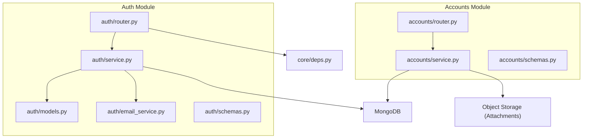
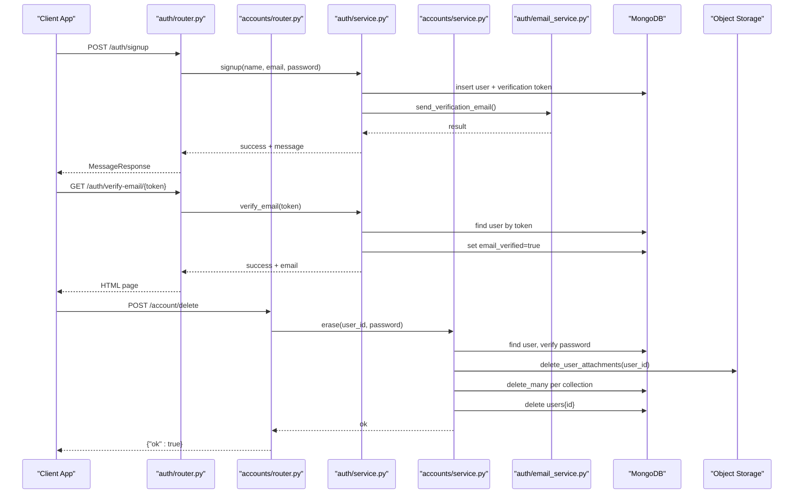
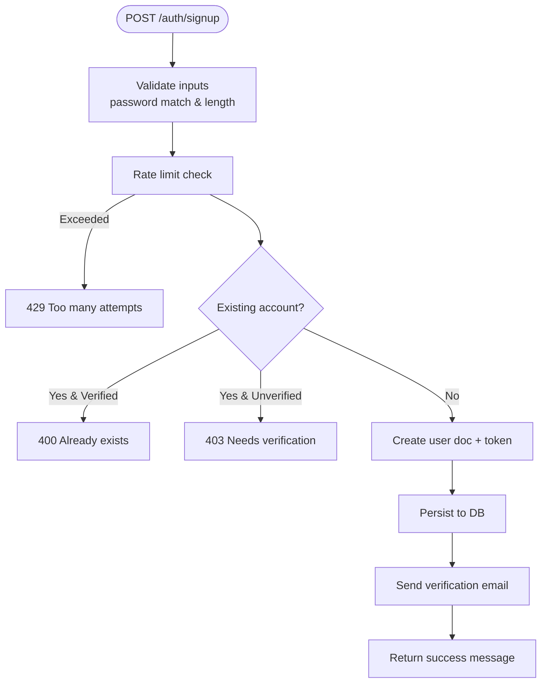
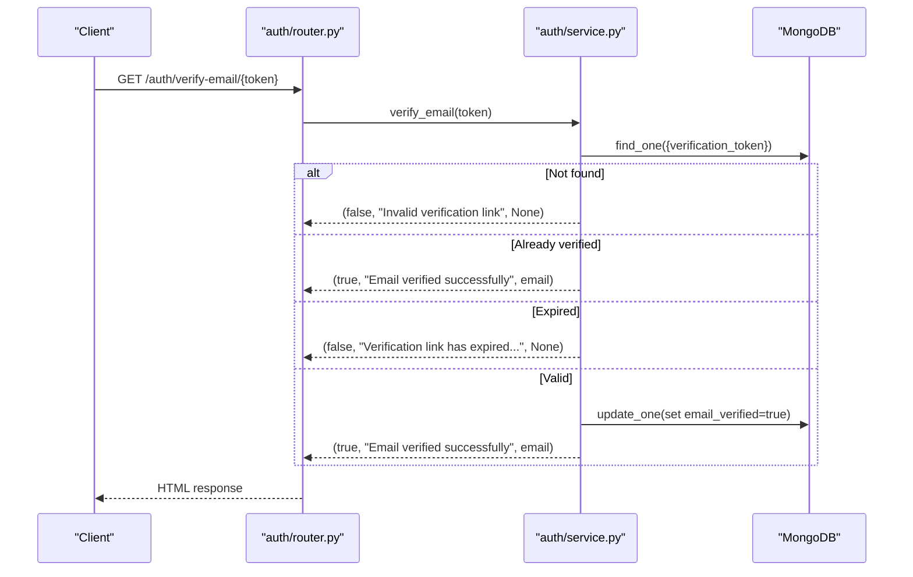
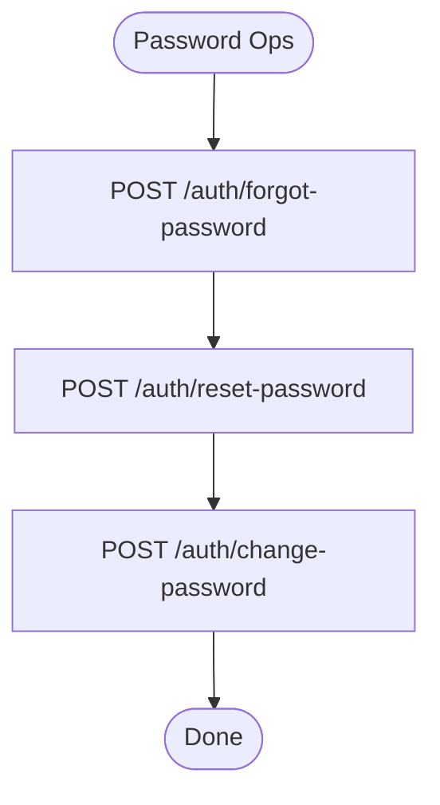
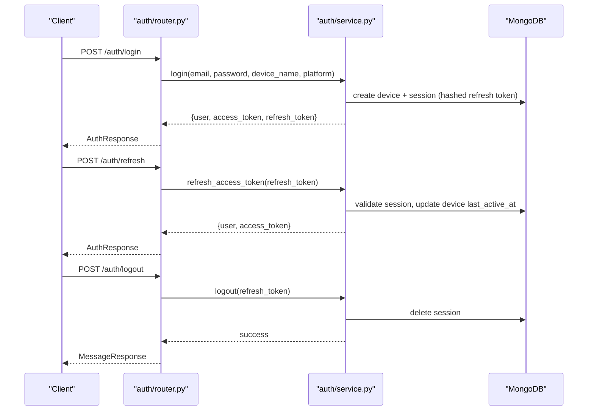
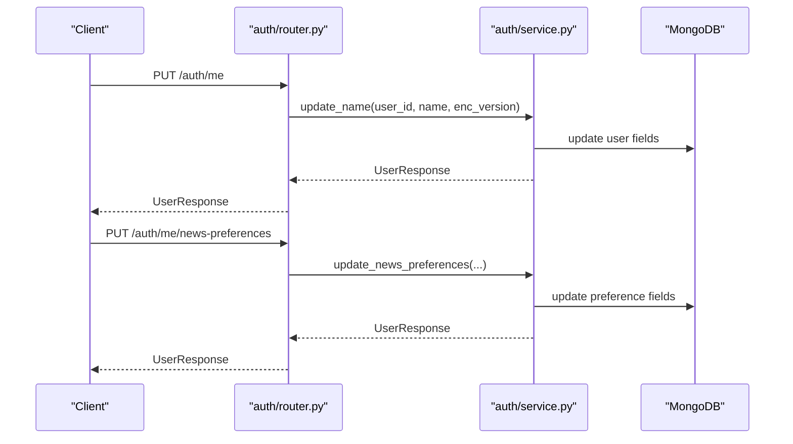
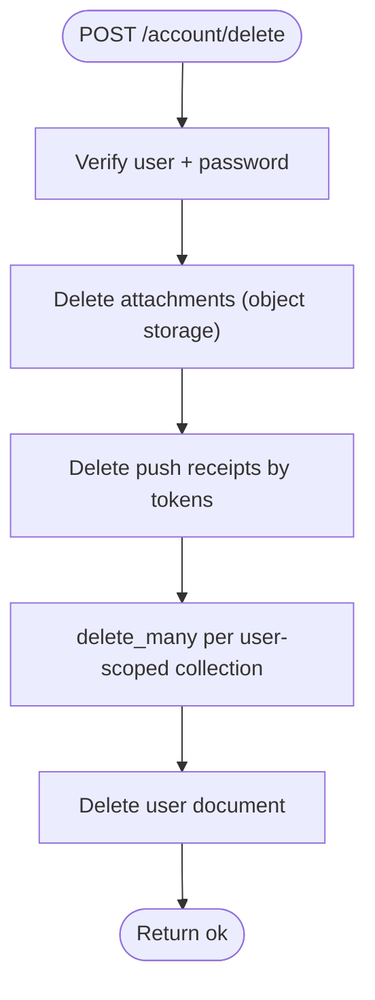
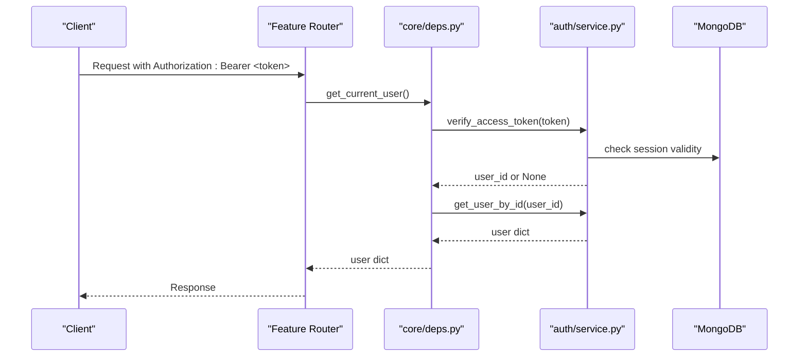
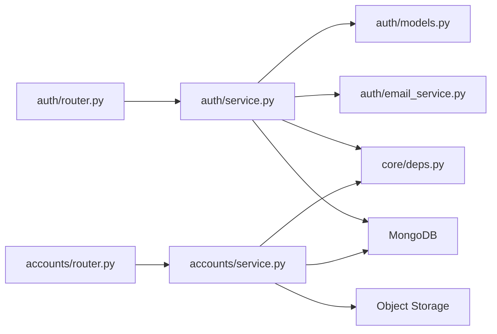

# Account Management

<cite>
**Referenced Files in This Document**
- [accounts/router.py](file://accounts/router.py)
- [accounts/service.py](file://accounts/service.py)
- [accounts/schemas.py](file://accounts/schemas.py)
- [auth/router.py](file://auth/router.py)
- [auth/service.py](file://auth/service.py)
- [auth/models.py](file://auth/models.py)
- [auth/email_service.py](file://auth/email_service.py)
- [auth/schemas.py](file://auth/schemas.py)
- [core/deps.py](file://core/deps.py)
</cite>

## Table of Contents
1. [Introduction](#introduction)
2. [Project Structure](#project-structure)
3. [Core Components](#core-components)
4. [Architecture Overview](#architecture-overview)
5. [Detailed Component Analysis](#detailed-component-analysis)
6. [Dependency Analysis](#dependency-analysis)
7. [Performance Considerations](#performance-considerations)
8. [Troubleshooting Guide](#troubleshooting-guide)
9. [Conclusion](#conclusion)
10. [Appendices](#appendices)

## Introduction
This document explains the Account Management sub-feature, covering user profile operations, settings management, and account lifecycle operations. It details registration workflows, email verification, password management, multi-device session handling, profile updates, and account deletion. It also addresses integration with the authentication system, privacy controls, data retention considerations, and common issues such as email delivery failures and cross-device synchronization.

## Project Structure
Account Management spans two primary modules:
- Authentication and user profile/settings endpoints under auth/
- Account lifecycle (deletion) under accounts/

**Diagram sources**
- [auth/router.py:1-366](file://auth/router.py#L1-L366)
- [auth/service.py:1-506](file://auth/service.py#L1-L506)
- [auth/models.py:1-66](file://auth/models.py#L1-L66)
- [auth/email_service.py:1-151](file://auth/email_service.py#L1-L151)
- [auth/schemas.py:1-80](file://auth/schemas.py#L1-L80)
- [accounts/router.py:1-25](file://accounts/router.py#L1-L25)
- [accounts/service.py:1-108](file://accounts/service.py#L1-L108)
- [accounts/schemas.py:1-6](file://accounts/schemas.py#L1-L6)
- [core/deps.py:1-51](file://core/deps.py#L1-L51)

**Section sources**
- [auth/router.py:1-366](file://auth/router.py#L1-L366)
- [accounts/router.py:1-25](file://accounts/router.py#L1-L25)
- [core/deps.py:1-51](file://core/deps.py#L1-L51)

## Core Components
- Authentication service: handles signup, login, email verification, password reset/change, refresh tokens, logout, profile name update, news preferences, and sync status.
- Accounts service: implements GDPR-style account erasure across collections and object storage.
- Email service: sends verification, password reset, and password change notifications via an external provider with timeouts and error logging.
- Request/response schemas: define inputs and outputs for all account-related endpoints.
- Dependencies: shared current-user resolution and database access used by routers.

**Section sources**
- [auth/service.py:1-506](file://auth/service.py#L1-L506)
- [accounts/service.py:1-108](file://accounts/service.py#L1-L108)
- [auth/email_service.py:1-151](file://auth/email_service.py#L1-L151)
- [auth/schemas.py:1-80](file://auth/schemas.py#L1-L80)
- [accounts/schemas.py:1-6](file://accounts/schemas.py#L1-L6)
- [core/deps.py:1-51](file://core/deps.py#L1-L51)

## Architecture Overview
The account management flow is request-driven through FastAPI routers that delegate to services. The auth module manages identity and sessions; the accounts module enforces data deletion. Both rely on MongoDB and integrate with an email provider.

**Diagram sources**
- [auth/router.py:93-140](file://auth/router.py#L93-L140)
- [auth/router.py:142-220](file://auth/router.py#L142-L220)
- [auth/service.py:107-149](file://auth/service.py#L107-L149)
- [auth/service.py:275-310](file://auth/service.py#L275-L310)
- [auth/email_service.py:66-92](file://auth/email_service.py#L66-L92)
- [accounts/router.py:11-24](file://accounts/router.py#L11-L24)
- [accounts/service.py:60-88](file://accounts/service.py#L60-L88)

## Detailed Component Analysis

### User Registration Workflow
- Input validation: password confirmation and minimum length enforced at the router layer.
- Rate limiting: signup attempts are rate-limited per IP.
- Service logic:
  - Normalizes email, checks for existing unverified or verified accounts.
  - Creates a new user document with a verification token and expiry.
  - Persists user to MongoDB.
  - Sends verification email asynchronously; non-fatal if sending fails.
- Response: returns a message instructing the user to verify their email.

**Diagram sources**
- [auth/router.py:93-113](file://auth/router.py#L93-L113)
- [auth/service.py:107-149](file://auth/service.py#L107-L149)
- [auth/email_service.py:66-92](file://auth/email_service.py#L66-L92)

**Section sources**
- [auth/router.py:93-113](file://auth/router.py#L93-L113)
- [auth/service.py:107-149](file://auth/service.py#L107-L149)
- [auth/email_service.py:66-92](file://auth/email_service.py#L66-L92)

### Email Verification Process
- Endpoint: GET /auth/verify-email/{token} returns an HTML page indicating success or failure.
- Idempotency: visiting the link multiple times succeeds without consuming the token; mail scanners may trigger this safely.
- Logic:
  - Find user by token; if not found, return failure page.
  - If already verified, return success page.
  - If token expired, return failure page.
  - Otherwise, mark email_verified and return success page.

**Diagram sources**
- [auth/router.py:142-220](file://auth/router.py#L142-L220)
- [auth/service.py:275-310](file://auth/service.py#L275-L310)

**Section sources**
- [auth/router.py:142-220](file://auth/router.py#L142-L220)
- [auth/service.py:275-310](file://auth/service.py#L275-L310)

### Password Management
- Forgot password:
  - Rate limited per email and IP.
  - Generates a short-lived reset token and sends a reset email.
  - Always returns success to avoid revealing whether the email exists.
- Reset password:
  - Validates token presence and expiry.
  - Updates password hash and clears reset token fields.
  - Invalidates all sessions for the user to force re-login.
- Change password (authenticated):
  - Requires current password and new password confirmation.
  - Updates password and sends a security notification email.

**Diagram sources**
- [auth/router.py:222-249](file://auth/router.py#L222-L249)
- [auth/router.py:276-299](file://auth/router.py#L276-L299)
- [auth/service.py:312-361](file://auth/service.py#L312-L361)
- [auth/service.py:363-385](file://auth/service.py#L363-L385)

**Section sources**
- [auth/router.py:222-249](file://auth/router.py#L222-L249)
- [auth/router.py:276-299](file://auth/router.py#L276-L299)
- [auth/service.py:312-361](file://auth/service.py#L312-L361)
- [auth/service.py:363-385](file://auth/service.py#L363-L385)

### Multi-Device Session Handling
- Login creates a device record and a session with a hashed refresh token.
- Access tokens are bound to the session ID; logout deletes the session, revoking access tokens server-side.
- Refresh endpoint validates the session and refreshes the access token while updating device last active time.
- Logout invalidates the session.

**Diagram sources**
- [auth/router.py:115-140](file://auth/router.py#L115-L140)
- [auth/router.py:301-321](file://auth/router.py#L301-L321)
- [auth/service.py:202-273](file://auth/service.py#L202-L273)
- [auth/service.py:424-460](file://auth/service.py#L424-L460)

**Section sources**
- [auth/router.py:115-140](file://auth/router.py#L115-L140)
- [auth/router.py:301-321](file://auth/router.py#L301-L321)
- [auth/service.py:202-273](file://auth/service.py#L202-L273)
- [auth/service.py:424-460](file://auth/service.py#L424-L460)

### Profile Updates and Settings Management
- Update display name:
  - Supports plaintext updates and E2EE key bootstrap (encrypted name with enc_version).
  - Returns updated user profile.
- News preferences:
  - Updates country, outlet IDs, and toggles for verse/quote visibility.
  - Returns updated user profile.
- Current user info:
  - GET /auth/me returns the authenticated user’s profile.

**Diagram sources**
- [auth/router.py:323-356](file://auth/router.py#L323-L356)
- [auth/service.py:387-422](file://auth/service.py#L387-L422)

**Section sources**
- [auth/router.py:323-356](file://auth/router.py#L323-L356)
- [auth/service.py:387-422](file://auth/service.py#L387-L422)

### Account Deletion (GDPR Erasure)
- Endpoint: POST /account/delete requires the current user’s password to confirm deletion.
- Service behavior:
  - Verifies user existence and password.
  - Deletes attachments from object storage.
  - Deletes push receipts associated with user’s devices.
  - Deletes all documents scoped by user_id across a defined list of collections.
  - Finally deletes the user document.
- Error handling:
  - Returns 404 if user not found.
  - Returns 401 if password is incorrect.

**Diagram sources**
- [accounts/router.py:11-24](file://accounts/router.py#L11-L24)
- [accounts/service.py:60-108](file://accounts/service.py#L60-L108)

**Section sources**
- [accounts/router.py:11-24](file://accounts/router.py#L11-L24)
- [accounts/service.py:60-108](file://accounts/service.py#L60-L108)

### Integration with Authentication System
- Current user resolution:
  - Routers use get_current_user dependency to extract and validate bearer tokens.
  - Token verification checks signature, type, session binding, and session validity.
- Protected routes:
  - Profile updates and account deletion require a valid, non-revoked session.

**Diagram sources**
- [core/deps.py:24-50](file://core/deps.py#L24-L50)
- [auth/service.py:469-494](file://auth/service.py#L469-L494)

**Section sources**
- [core/deps.py:24-50](file://core/deps.py#L24-L50)
- [auth/service.py:469-494](file://auth/service.py#L469-L494)

### Data Export Capabilities and Privacy Controls
- Data export:
  - No explicit data export endpoint is implemented in the analyzed files.
- Privacy controls:
  - Account deletion provides full erasure across user-scoped collections and attachments.
  - Email verification and password reset flows include safeguards (rate limiting, token expiry, idempotent verification).
  - Device and session records support logout and token revocation.

[No sources needed since this section summarizes capabilities without analyzing specific files]

## Dependency Analysis
Key dependencies and relationships:
- Routers depend on services for business logic and on core/deps for authentication and DB access.
- Services depend on MongoDB models and email service for communications.
- Account deletion depends on attachment deletion and a curated list of user-scoped collections.

**Diagram sources**
- [auth/router.py:1-366](file://auth/router.py#L1-L366)
- [accounts/router.py:1-25](file://accounts/router.py#L1-L25)
- [auth/service.py:1-506](file://auth/service.py#L1-L506)
- [accounts/service.py:1-108](file://accounts/service.py#L1-L108)
- [auth/models.py:1-66](file://auth/models.py#L1-L66)
- [auth/email_service.py:1-151](file://auth/email_service.py#L1-L151)
- [core/deps.py:1-51](file://core/deps.py#L1-L51)

**Section sources**
- [auth/router.py:1-366](file://auth/router.py#L1-L366)
- [accounts/router.py:1-25](file://accounts/router.py#L1-L25)
- [auth/service.py:1-506](file://auth/service.py#L1-L506)
- [accounts/service.py:1-108](file://accounts/service.py#L1-L108)
- [auth/models.py:1-66](file://auth/models.py#L1-L66)
- [auth/email_service.py:1-151](file://auth/email_service.py#L1-L151)
- [core/deps.py:1-51](file://core/deps.py#L1-L51)

## Performance Considerations
- CPU-bound hashing: bcrypt operations are offloaded to threads to avoid blocking the event loop during signup, login, and password changes.
- External I/O timeouts: email sending uses explicit timeouts to prevent hanging connections from stalling the single worker process.
- Account deletion performance: attachment deletion and bulk collection deletions run off the event loop where applicable; ensure indexes exist on user_id fields for fast scans.

[No sources needed since this section provides general guidance]

## Troubleshooting Guide
Common issues and resolutions:
- Email delivery failures:
  - Symptom: verification or reset emails not received.
  - Checks: SMTP configuration, API key presence, and Resend endpoint availability; logs will indicate failures.
  - Mitigation: resend verification or reset links; verify environment variables and network connectivity.
- Profile synchronization across devices:
  - Ensure clients fetch latest profile via /auth/me after updates.
  - For E2EE names, enc_version indicates encrypted state; clients should handle accordingly.
- Data retention policies:
  - Account deletion removes user-scoped data comprehensively; ensure all new collections writing user_id are added to the erasure list to maintain compliance.
- Session and token issues:
  - If access tokens fail despite being signed, verify session validity; logout invalidates sessions and revokes tokens.
  - Refresh token expiration leads to forced re-login.

**Section sources**
- [auth/email_service.py:26-64](file://auth/email_service.py#L26-L64)
- [auth/service.py:275-310](file://auth/service.py#L275-L310)
- [accounts/service.py:15-45](file://accounts/service.py#L15-L45)
- [auth/service.py:424-460](file://auth/service.py#L424-L460)

## Conclusion
The Account Management feature provides a robust foundation for user lifecycle operations, including secure registration, email verification, password management, multi-device sessions, profile and settings updates, and comprehensive account deletion aligned with privacy requirements. Proper configuration of email services and careful maintenance of user-scoped collection lists are essential for reliable operation and compliance.

[No sources needed since this section summarizes without analyzing specific files]

## Appendices

### API Reference Summary
- Authentication and profile endpoints:
  - POST /auth/signup
  - POST /auth/login
  - GET /auth/verify-email/{token}
  - POST /auth/forgot-password
  - POST /auth/reset-password
  - POST /auth/change-password
  - POST /auth/refresh
  - POST /auth/logout
  - GET /auth/me
  - PUT /auth/me
  - PUT /auth/me/news-preferences
  - GET /auth/sync-status
- Account lifecycle:
  - POST /account/delete

**Section sources**
- [auth/router.py:93-366](file://auth/router.py#L93-L366)
- [accounts/router.py:11-24](file://accounts/router.py#L11-L24)