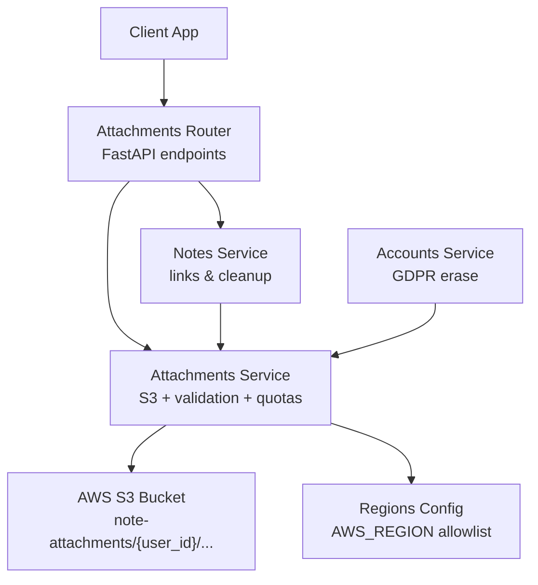
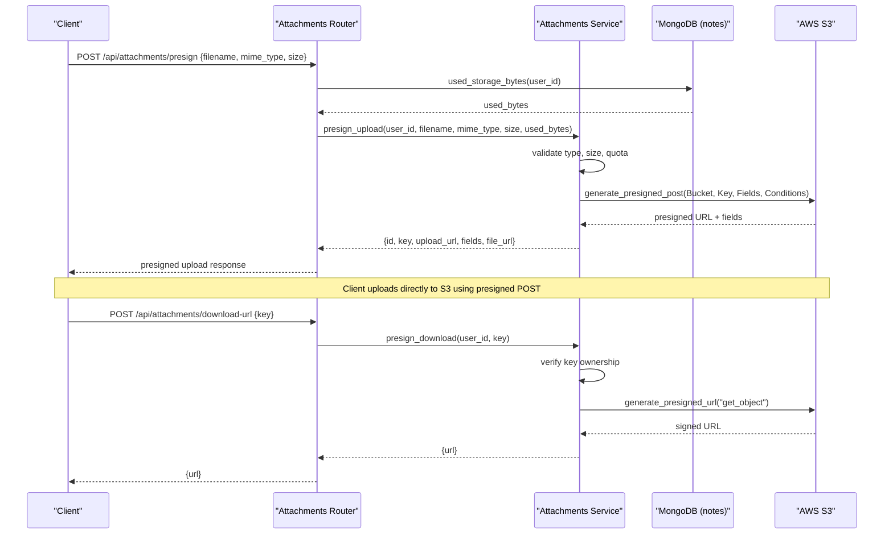
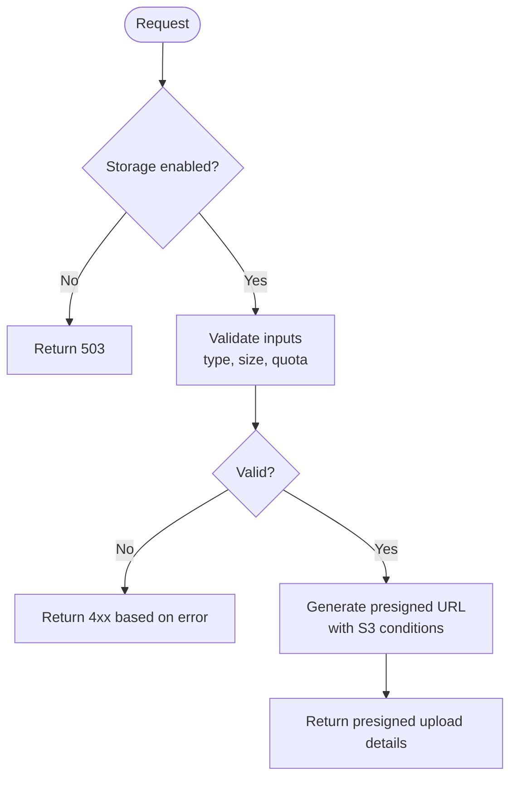
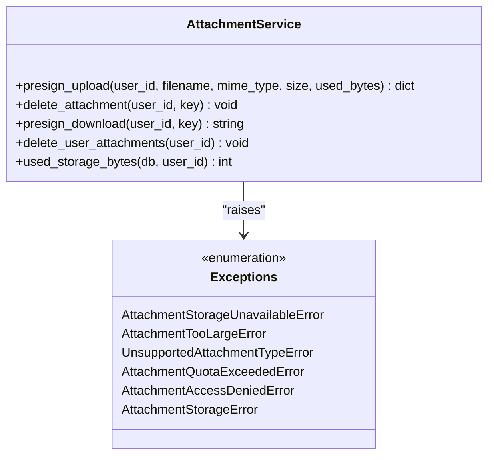
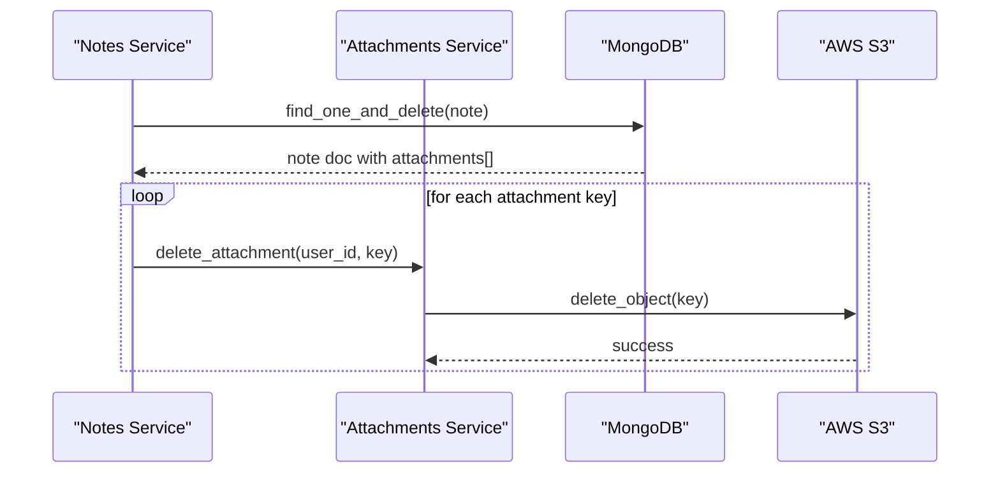
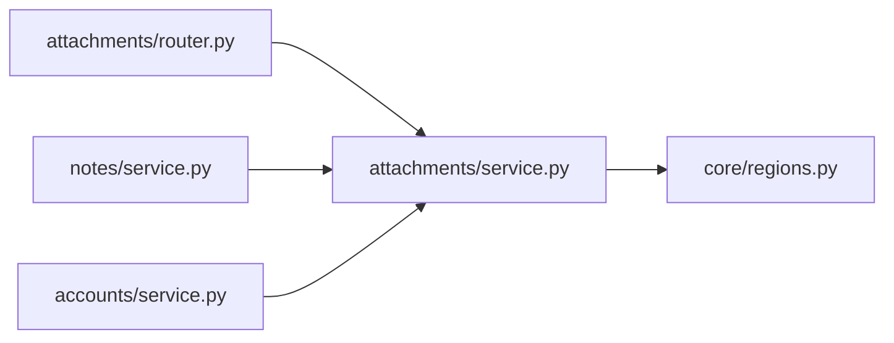

# Attachments Service

<cite>
**Referenced Files in This Document**
- [attachments/router.py](file://attachments/router.py)
- [attachments/service.py](file://attachments/service.py)
- [attachments/schemas.py](file://attachments/schemas.py)
- [notes/service.py](file://notes/service.py)
- [accounts/service.py](file://accounts/service.py)
- [core/regions.py](file://core/regions.py)
</cite>

## Table of Contents
1. [Introduction](#introduction)
2. [Project Structure](#project-structure)
3. [Core Components](#core-components)
4. [Architecture Overview](#architecture-overview)
5. [Detailed Component Analysis](#detailed-component-analysis)
6. [Dependency Analysis](#dependency-analysis)
7. [Performance Considerations](#performance-considerations)
8. [Troubleshooting Guide](#troubleshooting-guide)
9. [Conclusion](#conclusion)
10. [Appendices](#appendices)

## Introduction
This document explains the Attachments Service sub-feature that integrates with AWS S3 to support file upload, storage, and retrieval for notes. It covers supported file types, size limits, security validation, presigned URL generation, metadata handling, integration with the notes system, cleanup processes, versioning considerations, access control for shared attachments, backup considerations, and operational guidance for common issues such as upload failures, storage quotas, and performance optimization for large files.

## Project Structure
The Attachments feature is implemented across a small set of focused modules:
- API layer (FastAPI router) exposing endpoints for presigning uploads, generating download URLs, and deleting attachments.
- Business logic service implementing S3 operations, validation, quota checks, and cleanup routines.
- Pydantic schemas defining request/response shapes used by the router and consumed by the notes module.
- Integration points with Notes (attachment linking and cleanup on note deletion) and Accounts (GDPR erasure).
- Centralized region configuration ensuring data residency compliance for AWS services.

**Diagram sources**
- [attachments/router.py:28-81](file://attachments/router.py#L28-L81)
- [attachments/service.py:77-173](file://attachments/service.py#L77-L173)
- [notes/service.py:191-212](file://notes/service.py#L191-L212)
- [accounts/service.py:60-88](file://accounts/service.py#L60-L88)
- [core/regions.py:206-208](file://core/regions.py#L206-L208)

**Section sources**
- [attachments/router.py:1-82](file://attachments/router.py#L1-L82)
- [attachments/service.py:1-227](file://attachments/service.py#L1-L227)
- [attachments/schemas.py:1-24](file://attachments/schemas.py#L1-L24)
- [notes/service.py:1-226](file://notes/service.py#L1-L226)
- [accounts/service.py:1-108](file://accounts/service.py#L1-L108)
- [core/regions.py:1-230](file://core/regions.py#L1-L230)

## Core Components
- Presign Upload: Validates file type, size, and account quota; returns a presigned POST to upload directly to S3 under a user-scoped prefix.
- Download URL: Generates a time-limited presigned GET URL for viewing/downloading an attachment.
- Delete Attachment: Removes an attachment object from S3 if it belongs to the requesting user.
- Quota and Usage: Aggregates current usage from notes metadata to enforce per-account storage caps before issuing presigned uploads.
- Cleanup: Best-effort bulk deletion of all attachments for a user during GDPR erasure; also deletes attachments when notes are deleted.

Key behaviors:
- File type validation via both MIME type and extension allowlists.
- Per-file size limit enforced at presign time and enforced again by S3 conditions.
- Per-account total storage cap enforced before presign issuance.
- User-scoped object keys prevent cross-user access.
- Region enforcement ensures S3 client targets an approved Australian region.

**Section sources**
- [attachments/service.py:26-50](file://attachments/service.py#L26-L50)
- [attachments/service.py:86-136](file://attachments/service.py#L86-L136)
- [attachments/service.py:155-173](file://attachments/service.py#L155-L173)
- [attachments/service.py:199-226](file://attachments/service.py#L199-L226)
- [core/regions.py:206-208](file://core/regions.py#L206-L208)

## Architecture Overview
The Attachments Service uses a direct-to-S3 upload pattern:
1. Client requests a presigned upload URL from the server.
2. Server validates inputs, checks quota, and generates a presigned POST scoped to the user’s namespace.
3. Client uploads directly to S3 using the presigned URL and fields.
4. Client associates the returned metadata (id, key, url, filename, mime_type, size_bytes, uploaded_at) with a note.
5. For downloads or sharing, the server issues a presigned GET URL scoped to the user’s namespace.

**Diagram sources**
- [attachments/router.py:28-81](file://attachments/router.py#L28-L81)
- [attachments/service.py:86-136](file://attachments/service.py#L86-L136)
- [attachments/service.py:155-173](file://attachments/service.py#L155-L173)
- [attachments/service.py:199-226](file://attachments/service.py#L199-L226)

## Detailed Component Analysis

### API Endpoints (Router)
- POST /api/attachments/presign
  - Validates current usage via notes metadata.
  - Calls service to issue presigned upload with strict conditions.
  - Maps service exceptions to HTTP status codes (e.g., 400 for unsupported type or too large, 507 for quota exceeded, 503 if storage disabled, 502 for storage errors).
- DELETE /api/attachments?key=...
  - Deletes an attachment only if the key belongs to the requester.
- POST /api/attachments/download-url
  - Issues a presigned GET URL valid for 7 days for viewing/sharing.

**Diagram sources**
- [attachments/router.py:28-55](file://attachments/router.py#L28-L55)
- [attachments/service.py:86-136](file://attachments/service.py#L86-L136)

**Section sources**
- [attachments/router.py:28-81](file://attachments/router.py#L28-L81)

### Business Logic (Service)
- Allowed Types and Extensions
  - Images: jpeg, png, gif, webp, heic
  - Video: mp4, quicktime, webm, x-msvideo, matroska, 3gpp
  - Audio: mpeg, mp4, x-m4a, wav, x-wav, aac, ogg, webm
  - Docs: pdf, plain text, csv, Microsoft Office formats
  - Extension allowlist mirrors MIME allowlist for defense-in-depth.
- Size Limits
  - Per-file limit: up to 100 MB.
  - Enforced twice: server-side before presign and via S3 content-length-range condition.
- Account Storage Quota
  - Default total per account: 2 GB (configurable via environment variable).
  - Calculated by aggregating size_bytes from notes attachments to avoid moving large payloads over the wire.
- Security and Access Control
  - Object keys are prefixed with user_id to isolate namespaces.
  - Delete and download operations reject keys not belonging to the caller.
  - Region enforcement ensures S3 client targets an approved Australian region.
- Presigned Upload Details
  - Returns id, key, upload_url, fields, and a stable file_url for reference.
  - Presigned POST expires after a short window to minimize risk.
- Presigned Download Details
  - Returns a presigned GET URL valid for 7 days, suitable for tap-to-open and shareable links.
- Cleanup
  - Bulk delete for GDPR erasure: paginates objects under user prefix and deletes in batches.
  - Note deletion triggers best-effort removal of associated S3 objects.

**Diagram sources**
- [attachments/service.py:53-74](file://attachments/service.py#L53-L74)
- [attachments/service.py:86-173](file://attachments/service.py#L86-L173)
- [attachments/service.py:176-226](file://attachments/service.py#L176-L226)

**Section sources**
- [attachments/service.py:26-50](file://attachments/service.py#L26-L50)
- [attachments/service.py:86-136](file://attachments/service.py#L86-L136)
- [attachments/service.py:139-173](file://attachments/service.py#L139-L173)
- [attachments/service.py:176-226](file://attachments/service.py#L176-L226)
- [core/regions.py:206-208](file://core/regions.py#L206-L208)

### Data Models (Schemas)
- Attachment: Embedded in notes; includes id, key, url, filename, mime_type, size_bytes, uploaded_at.
- PresignRequest: filename, mime_type, size.
- DownloadUrlRequest: key.

These models define the contract between the router and service and how attachments are represented within notes.

**Section sources**
- [attachments/schemas.py:4-24](file://attachments/schemas.py#L4-L24)

### Integration with Notes System
- Linking Attachments
  - After successful upload, clients associate the returned attachment metadata with a note. The notes schema supports an attachments list and a denormalized flag indicating presence of attachments.
- Cleanup on Note Deletion
  - When a note is deleted, the service retrieves stored attachment keys and performs best-effort deletion from S3 to prevent orphaned files.
- Usage Accounting
  - Quota enforcement reads aggregated size_bytes from notes rather than scanning S3, avoiding heavy network overhead and aligning with what clients can see and manage.

**Diagram sources**
- [notes/service.py:191-212](file://notes/service.py#L191-L212)
- [attachments/service.py:139-152](file://attachments/service.py#L139-L152)

**Section sources**
- [notes/service.py:83-111](file://notes/service.py#L83-L111)
- [notes/service.py:191-212](file://notes/service.py#L191-L212)
- [attachments/service.py:199-226](file://attachments/service.py#L199-L226)

### GDPR Erasure and Orphaned File Handling
- On account deletion, the system first removes all attachments under the user’s prefix from S3, then clears all user-scoped database collections.
- If any S3 deletion fails, it is logged but does not block the rest of the erasure process.

**Section sources**
- [accounts/service.py:60-88](file://accounts/service.py#L60-L88)
- [attachments/service.py:176-197](file://attachments/service.py#L176-L197)

## Dependency Analysis
- Router depends on FastAPI, Motor (for DB), and the attachments service.
- Service depends on boto3 for S3 and core.regions for validated AWS region.
- Notes service imports attachments service to perform cleanup on note deletion.
- Accounts service imports attachments service for GDPR erasure.

**Diagram sources**
- [attachments/router.py:1-17](file://attachments/router.py#L1-L17)
- [attachments/service.py:1-14](file://attachments/service.py#L1-L14)
- [notes/service.py:15-17](file://notes/service.py#L15-L17)
- [accounts/service.py:11-13](file://accounts/service.py#L11-L13)
- [core/regions.py:206-208](file://core/regions.py#L206-L208)

**Section sources**
- [attachments/router.py:1-17](file://attachments/router.py#L1-L17)
- [attachments/service.py:1-14](file://attachments/service.py#L1-L14)
- [notes/service.py:15-17](file://notes/service.py#L15-L17)
- [accounts/service.py:11-13](file://accounts/service.py#L11-L13)
- [core/regions.py:206-208](file://core/regions.py#L206-L208)

## Performance Considerations
- Direct-to-S3 Uploads
  - Presigned POST avoids routing large payloads through the application server, reducing memory pressure and latency.
- Quota Checks Without Heavy I/O
  - Usage is computed from notes metadata (size_bytes), avoiding expensive scans of S3 or fetching full note documents.
- Batch Deletions
  - Bulk deletion during GDPR erasure uses pagination and batch delete calls to efficiently remove many objects.
- Event Loop Safety
  - Synchronous boto3 calls are offloaded to threads to prevent blocking the event loop during hot paths.
- Large Files
  - Videos and large media are supported up to the configured per-file limit; ensure client-side chunking or multipart strategies if needed beyond single-upload constraints.

[No sources needed since this section provides general guidance]

## Troubleshooting Guide
Common issues and resolutions:
- Upload Failures
  - Symptom: 400 Bad Request for unsupported file type or too large.
  - Cause: MIME type or extension not allowed, or file exceeds per-file limit.
  - Resolution: Ensure file type is in the allowed lists and size is within limits.
- Storage Disabled
  - Symptom: 503 Service Unavailable.
  - Cause: S3 bucket not configured.
  - Resolution: Configure S3_BUCKET and AWS_REGION; ensure region is approved.
- Quota Exceeded
  - Symptom: 507 Insufficient Storage.
  - Cause: Total attachments exceed per-account limit.
  - Resolution: Delete existing attachments or increase MAX_TOTAL_ATTACHMENT_BYTES if appropriate.
- Access Denied on Delete/Download
  - Symptom: 403 Forbidden.
  - Cause: Attempting to access another user’s attachment key.
  - Resolution: Verify the key belongs to the authenticated user.
- Storage Errors
  - Symptom: 502 Bad Gateway.
  - Cause: S3 operation failed (network or permissions).
  - Resolution: Check AWS credentials, IAM permissions, and bucket configuration.

Operational tips:
- Monitor logs for S3 errors raised by the service.
- Use the download URL endpoint to test access without exposing long-lived public links.
- For GDPR erasure, confirm that S3 deletions complete successfully; failures are logged but do not block account deletion.

**Section sources**
- [attachments/router.py:45-67](file://attachments/router.py#L45-L67)
- [attachments/router.py:75-80](file://attachments/router.py#L75-L80)
- [attachments/service.py:94-109](file://attachments/service.py#L94-L109)
- [attachments/service.py:145-152](file://attachments/service.py#L145-L152)
- [attachments/service.py:162-173](file://attachments/service.py#L162-L173)

## Conclusion
The Attachments Service provides secure, scalable, and compliant file handling integrated with AWS S3. It enforces strict type and size validation, per-account storage quotas, and user-scoped access controls. Through presigned URLs, it enables efficient direct uploads and safe downloads. Integration with the notes system ensures consistent metadata and cleanup, while GDPR erasure guarantees comprehensive data removal. With region enforcement and robust error handling, the service balances usability, security, and operational reliability.

[No sources needed since this section summarizes without analyzing specific files]

## Appendices

### Supported File Types and Limits
- Images: jpeg, png, gif, webp, heic
- Video: mp4, quicktime, webm, x-msvideo, matroska, 3gpp
- Audio: mpeg, mp4, x-m4a, wav, x-wav, aac, ogg, webm
- Documents: pdf, plain text, csv, Microsoft Word/Excel/PowerPoint formats
- Per-file size limit: up to 100 MB
- Per-account total storage limit: default 2 GB (configurable)

**Section sources**
- [attachments/service.py:26-50](file://attachments/service.py#L26-L50)
- [attachments/service.py:19-25](file://attachments/service.py#L19-L25)

### Configuration Variables
- S3_BUCKET: Name of the S3 bucket used for attachments.
- AWS_REGION: Must be set to an approved Australian region; enforced centrally.
- MAX_TOTAL_ATTACHMENT_BYTES: Optional override for per-account storage cap.

**Section sources**
- [attachments/service.py:15-25](file://attachments/service.py#L15-L25)
- [core/regions.py:66-70](file://core/regions.py#L66-L70)
- [core/regions.py:206-208](file://core/regions.py#L206-L208)

### Example Workflows

- Uploading an Attachment
  1. Call POST /api/attachments/presign with filename, mime_type, and size.
  2. Receive presigned upload URL and fields.
  3. Upload the file directly to S3 using the provided URL and fields.
  4. Associate the returned attachment metadata (id, key, url, filename, mime_type, size_bytes, uploaded_at) with a note.

- Generating a Presigned Download URL
  1. Call POST /api/attachments/download-url with the attachment key.
  2. Receive a time-limited URL for viewing or downloading the file.

- Deleting an Attachment
  1. Call DELETE /api/attachments?key=<key>.
  2. The server verifies ownership and removes the object from S3.

- Managing Metadata
  - Attachment metadata is embedded in notes and includes identifiers, storage key, URL, filename, MIME type, size, and timestamp.

- Cleanup Processes
  - Deleting a note triggers best-effort deletion of its attached files.
  - GDPR erasure deletes all attachments under the user’s prefix.

**Section sources**
- [attachments/router.py:28-81](file://attachments/router.py#L28-L81)
- [attachments/service.py:86-136](file://attachments/service.py#L86-L136)
- [attachments/service.py:155-173](file://attachments/service.py#L155-L173)
- [attachments/schemas.py:4-24](file://attachments/schemas.py#L4-L24)
- [notes/service.py:191-212](file://notes/service.py#L191-L212)
- [accounts/service.py:60-88](file://accounts/service.py#L60-L88)

### Versioning, Access Control, and Backup Considerations
- Versioning
  - The current implementation does not implement S3 object versioning. Each upload writes a new unique key per attachment. To enable versioning, configure S3 bucket versioning and adjust upload logic to preserve prior versions.
- Access Control for Shared Attachments
  - Downloads use presigned GET URLs scoped to the requesting user’s namespace. Sharing should rely on these time-limited URLs rather than making objects publicly accessible.
- Backup Considerations
  - Backups should include both S3 objects and MongoDB notes metadata. Since attachment metadata is embedded in notes, restoring notes alone does not restore S3 objects; ensure synchronized backups across both systems.

[No sources needed since this section provides general guidance]