# Authentication & Security

<cite>
**Referenced Files in This Document**
- [server.py](file://server.py)
- [auth/router.py](file://auth/router.py)
- [auth/service.py](file://auth/service.py)
- [auth/models.py](file://auth/models.py)
- [auth/schemas.py](file://auth/schemas.py)
- [auth/email_service.py](file://auth/email_service.py)
- [core/deps.py](file://core/deps.py)
- [core/ratelimit.py](file://core/ratelimit.py)
- [security/ssrf_guard.py](file://security/ssrf_guard.py)
- [core/regions.py](file://core/regions.py)
</cite>

## Table of Contents
1. Introduction
2. Project Structure
3. Core Components
4. Architecture Overview
5. Detailed Component Analysis
6. Dependency Analysis
7. Performance Considerations
8. Troubleshooting Guide
9. Conclusion
10. Appendices

## Introduction
This document explains the Nueco Backend’s authentication and security model. It covers JWT-based authentication flows (registration, login, email verification, password reset), token and session management, user context resolution across requests, and security controls including rate limiting, CORS, SSRF protection, input validation, anti-crawler measures, and data residency enforcement. It also provides examples of protected endpoints, error handling patterns, and best practices for building secure APIs.

## Project Structure
The authentication system is implemented across a small set of focused modules:
- Auth router exposes HTTP endpoints for account lifecycle and session operations.
- Auth service implements business logic for users, devices, sessions, tokens, and emails.
- Core dependencies provide current-user resolution and database access.
- Server configures middleware (CORS, anti-crawler), startup guards (data residency), and mounts routers.
- Security utilities protect outbound requests from SSRF.
- Regions enforce data residency by validating external service endpoints and regions at boot and on every call.

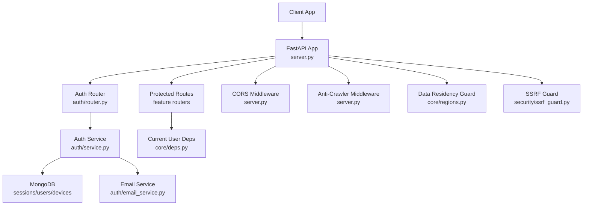

**Diagram sources**
- [server.py:20-214](file://server.py#L20-L214)
- [auth/router.py:20-366](file://auth/router.py#L20-L366)
- [auth/service.py:35-506](file://auth/service.py#L35-L506)
- [core/deps.py:15-51](file://core/deps.py#L15-L51)
- [auth/email_service.py:26-151](file://auth/email_service.py#L26-L151)
- [core/regions.py:144-165](file://core/regions.py#L144-L165)
- [security/ssrf_guard.py:67-109](file://security/ssrf_guard.py#L67-L109)

**Section sources**
- [server.py:20-214](file://server.py#L20-L214)
- [auth/router.py:20-366](file://auth/router.py#L20-L366)
- [auth/service.py:35-506](file://auth/service.py#L35-L506)
- [core/deps.py:15-51](file://core/deps.py#L15-L51)
- [auth/email_service.py:26-151](file://auth/email_service.py#L26-L151)
- [core/regions.py:144-165](file://core/regions.py#L144-L165)
- [security/ssrf_guard.py:67-109](file://security/ssrf_guard.py#L67-L109)

## Core Components
- JWT configuration and token lifecycle: short-lived access tokens bound to sessions; long-lived refresh tokens hashed and stored server-side.
- Session management: per-device sessions with expiration; logout invalidates sessions and revokes access tokens.
- Account lifecycle: signup with email verification, login with lockout policy, password reset with time-bound tokens, change password for authenticated users.
- Current user resolution: dependency that validates bearer tokens and resolves user context for protected routes.
- Rate limiting: per-endpoint in-process sliding windows for AI features; auth-specific counters for login/signup/reset.
- SSRF protection: safe GET helper that enforces scheme and public IP checks on each redirect hop.
- Data residency: strict validation of external service endpoints and region declarations at boot and on every call.
- Anti-crawler posture: blocks known AI crawler user agents and sets robots tags on responses.
- CORS: configurable allowed origins and headers.

**Section sources**
- [auth/service.py:24-33](file://auth/service.py#L24-L33)
- [auth/service.py:63-84](file://auth/service.py#L63-L84)
- [auth/service.py:202-273](file://auth/service.py#L202-L273)
- [auth/service.py:424-460](file://auth/service.py#L424-L460)
- [core/deps.py:24-51](file://core/deps.py#L24-L51)
- [core/ratelimit.py:41-124](file://core/ratelimit.py#L41-L124)
- [security/ssrf_guard.py:50-109](file://security/ssrf_guard.py#L50-L109)
- [core/regions.py:144-165](file://core/regions.py#L144-L165)
- [server.py:310-330](file://server.py#L310-L330)

## Architecture Overview
The authentication flow uses stateless JWT access tokens paired with server-side sessions for revocation. Login creates a device-scoped session storing a hashed refresh token; access tokens embed the session ID so they are invalidated when the session is deleted or expired. Protected endpoints resolve the current user via a dependency that verifies the token against sessions.

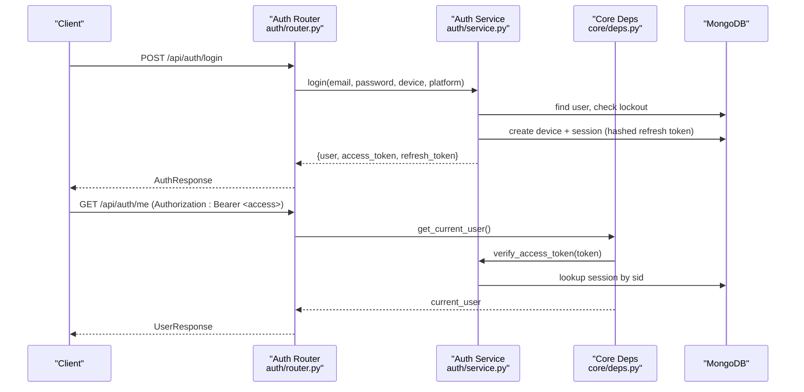

**Diagram sources**
- [auth/router.py:115-140](file://auth/router.py#L115-L140)
- [auth/service.py:202-273](file://auth/service.py#L202-L273)
- [core/deps.py:24-51](file://core/deps.py#L24-L51)
- [auth/service.py:469-494](file://auth/service.py#L469-L494)

## Detailed Component Analysis

### JWT and Session Management
- Access tokens:
  - Short-lived (minutes), signed with HS256, include subject (user_id), type, expiry, and session ID (sid).
  - Bound to a session; if the session is deleted or expired, token verification fails even if signature/exp are valid.
- Refresh tokens:
  - Long-lived (days), URL-safe random strings.
  - Stored hashed in sessions collection; compared via hash equality.
- Sessions:
  - Created per device on login; include user_id, device_id, hashed refresh token, expires_at.
  - Expiration enforced during refresh and access token verification.
- Logout:
  - Deletes session by refresh token hash; subsequent access tokens referencing that session fail verification.

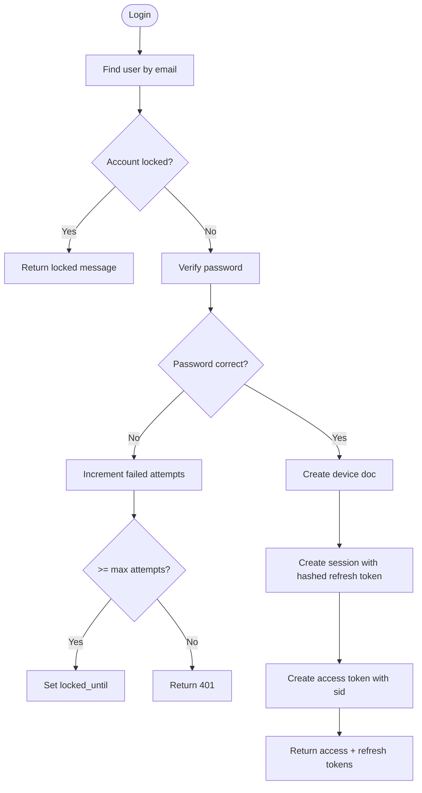

**Diagram sources**
- [auth/service.py:202-273](file://auth/service.py#L202-L273)
- [auth/service.py:469-494](file://auth/service.py#L469-L494)

**Section sources**
- [auth/service.py:24-33](file://auth/service.py#L24-L33)
- [auth/service.py:63-84](file://auth/service.py#L63-L84)
- [auth/service.py:202-273](file://auth/service.py#L202-L273)
- [auth/service.py:424-460](file://auth/service.py#L424-L460)
- [auth/service.py:469-494](file://auth/service.py#L469-L494)
- [auth/models.py:6-66](file://auth/models.py#L6-L66)

### Registration and Email Verification
- Signup:
  - Validates password match and minimum length.
  - Creates user with verification token and expiry; sends verification email.
  - If an unverified account exists with non-expired token, guides user to verify or resend.
- Email verification:
  - Idempotent: visiting link multiple times succeeds; scanner prefetches do not invalidate the link.
  - Checks token expiry before marking verified.
  - Returns HTML page with deep link to open app.

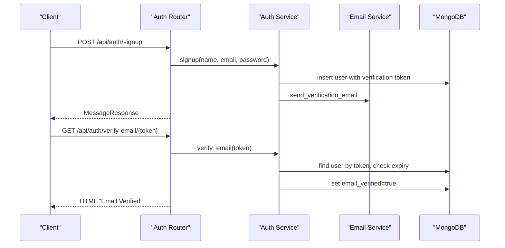

**Diagram sources**
- [auth/router.py:93-113](file://auth/router.py#L93-L113)
- [auth/router.py:142-220](file://auth/router.py#L142-L220)
- [auth/service.py:107-149](file://auth/service.py#L107-L149)
- [auth/service.py:275-310](file://auth/service.py#L275-L310)
- [auth/email_service.py:66-92](file://auth/email_service.py#L66-L92)

**Section sources**
- [auth/router.py:93-113](file://auth/router.py#L93-L113)
- [auth/router.py:142-220](file://auth/router.py#L142-L220)
- [auth/service.py:107-149](file://auth/service.py#L107-L149)
- [auth/service.py:275-310](file://auth/service.py#L275-L310)
- [auth/email_service.py:66-92](file://auth/email_service.py#L66-L92)

### Password Reset Flow
- Forgot password:
  - Generates time-bound reset token; sends email with reset link.
  - Always returns success to avoid revealing whether the email exists.
- Reset password:
  - Validates token existence and expiry.
  - Updates password and clears reset tokens.
  - Invalidates all sessions for the user to force re-login.

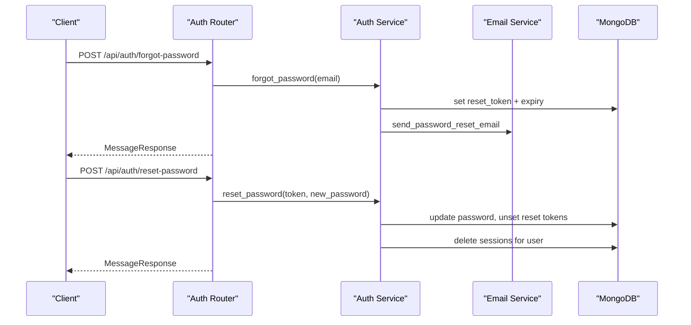

**Diagram sources**
- [auth/router.py:222-249](file://auth/router.py#L222-L249)
- [auth/service.py:312-361](file://auth/service.py#L312-L361)
- [auth/email_service.py:94-122](file://auth/email_service.py#L94-L122)

**Section sources**
- [auth/router.py:222-249](file://auth/router.py#L222-L249)
- [auth/service.py:312-361](file://auth/service.py#L312-L361)
- [auth/email_service.py:94-122](file://auth/email_service.py#L94-L122)

### Token Refresh and Logout
- Refresh:
  - Validates hashed refresh token against sessions; checks expiry.
  - Issues new access token bound to same session; updates device last active.
- Logout:
  - Deletes session by refresh token hash; returns success regardless of prior existence.

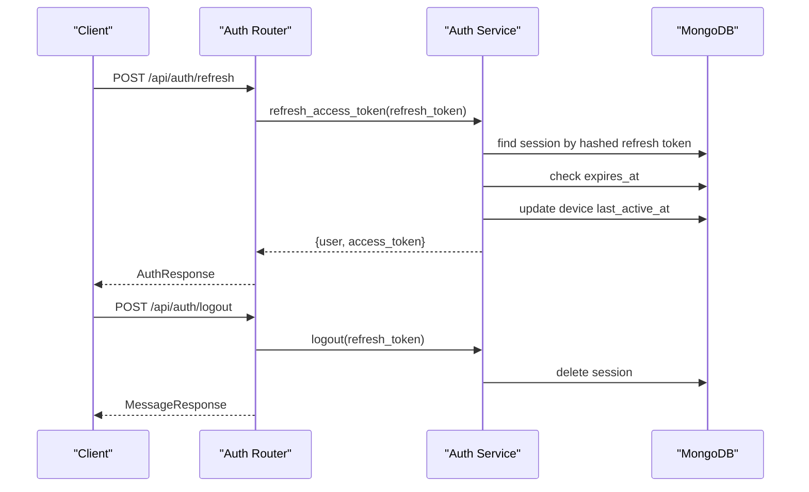

**Diagram sources**
- [auth/router.py:301-321](file://auth/router.py#L301-L321)
- [auth/service.py:424-460](file://auth/service.py#L424-L460)

**Section sources**
- [auth/router.py:301-321](file://auth/router.py#L301-L321)
- [auth/service.py:424-460](file://auth/service.py#L424-L460)

### Protected Endpoints and User Context Resolution
- Current user dependency:
  - Requires Authorization header with Bearer token.
  - Verifies token type, session binding, and session validity.
  - Resolves user document and returns it to route handlers.
- Examples of protected endpoints:
  - GET /api/auth/me
  - PUT /api/auth/me
  - PUT /api/auth/me/news-preferences
  - GET /api/auth/sync-status
  - Any feature endpoint using Depends(get_current_user)

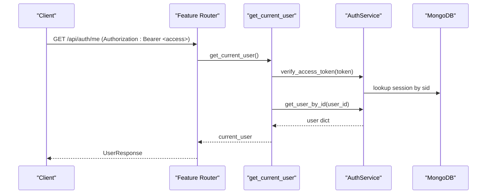

**Diagram sources**
- [core/deps.py:24-51](file://core/deps.py#L24-L51)
- [auth/service.py:469-494](file://auth/service.py#L469-L494)
- [auth/service.py:462-467](file://auth/service.py#L462-L467)
- [auth/router.py:323-366](file://auth/router.py#L323-L366)

**Section sources**
- [core/deps.py:24-51](file://core/deps.py#L24-L51)
- [auth/router.py:323-366](file://auth/router.py#L323-L366)

### Input Validation and Error Handling
- Request schemas:
  - Pydantic models validate fields such as email format, required strings, and defaults for device/platform.
- Route-level validations:
  - Password match and minimum length checks on signup, reset, and change password.
  - Rate limit checks return 429 with descriptive messages.
  - Missing or invalid tokens return 401 with clear details.
- Consistent error responses:
  - HTTPException used throughout with status codes and human-readable detail.

**Section sources**
- [auth/schemas.py:6-49](file://auth/schemas.py#L6-L49)
- [auth/router.py:93-113](file://auth/router.py#L93-L113)
- [auth/router.py:115-140](file://auth/router.py#L115-L140)
- [auth/router.py:222-249](file://auth/router.py#L222-L249)
- [auth/router.py:276-299](file://auth/router.py#L276-L299)
- [core/deps.py:24-51](file://core/deps.py#L24-L51)

### Rate Limiting
- Auth-specific limits:
  - Login: per email and per IP limits within a minute window.
  - Signup: per IP limit within an hour.
  - Password reset: per email and per IP limits within an hour.
- AI endpoints:
  - Sliding-window limiter with per-user quotas and a global quota to protect shared provider keys.
  - Returns Retry-After guidance via decision object; routers translate to HTTP 429.

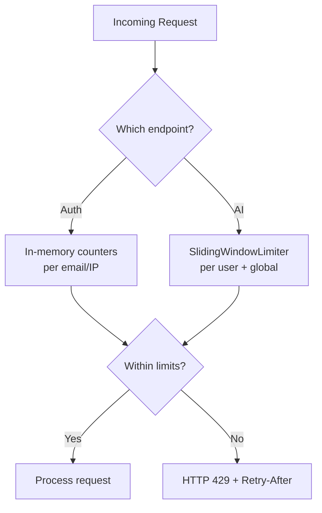

**Diagram sources**
- [auth/router.py:22-84](file://auth/router.py#L22-L84)
- [core/ratelimit.py:41-124](file://core/ratelimit.py#L41-L124)

**Section sources**
- [auth/router.py:22-84](file://auth/router.py#L22-L84)
- [core/ratelimit.py:41-124](file://core/ratelimit.py#L41-L124)

### CORS Configuration
- Configured via environment variable ALLOWED_ORIGINS.
- Allows credentials and specific methods/headers.
- Defaults to allow all origins when no explicit list is provided; production should restrict to known origins.

**Section sources**
- [server.py:320-330](file://server.py#L320-L330)

### SSRF Protection
- Safe GET helper:
  - Enforces http/https schemes only.
  - Resolves hostnames and rejects private, loopback, link-local, reserved, multicast, unspecified addresses.
  - Manually follows redirects, re-validating each hop.
  - Raises typed exceptions for invalid scheme, unreachable host, or fetch failure.

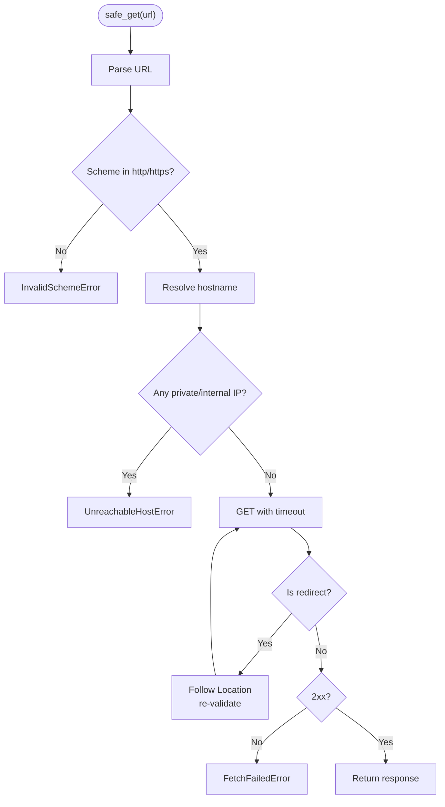

**Diagram sources**
- [security/ssrf_guard.py:67-109](file://security/ssrf_guard.py#L67-L109)
- [security/ssrf_guard.py:50-65](file://security/ssrf_guard.py#L50-L65)

**Section sources**
- [security/ssrf_guard.py:50-109](file://security/ssrf_guard.py#L50-L109)

### Anti-Crawler Measures
- Middleware blocks known AI crawler user agents with 403.
- Adds X-Robots-Tag headers to discourage indexing and AI training.

**Section sources**
- [server.py:298-317](file://server.py#L298-L317)

### Data Residency Enforcement
- Startup validation:
  - All registered external services must have endpoint and region variables declared and Australian-region values.
  - Boot aborts with detailed errors if any declaration is missing, malformed, or non-Australian.
- Runtime validation:
  - Typed accessors re-validate region on every call to ensure no code path bypasses the guard.

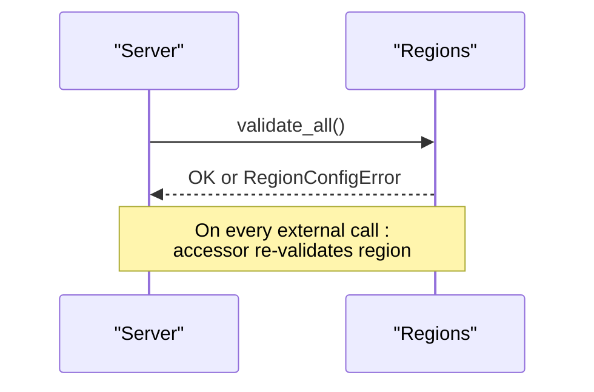

**Diagram sources**
- [server.py:333-341](file://server.py#L333-L341)
- [core/regions.py:144-165](file://core/regions.py#L144-L165)
- [core/regions.py:175-181](file://core/regions.py#L175-L181)

**Section sources**
- [server.py:333-341](file://server.py#L333-L341)
- [core/regions.py:144-165](file://core/regions.py#L144-L165)
- [core/regions.py:175-181](file://core/regions.py#L175-L181)

## Dependency Analysis
- Auth router depends on:
  - AuthService for business logic.
  - Core deps for current user and DB access.
  - Email service for sending verification and reset emails.
- Core deps depend on:
  - AuthService for token verification and user retrieval.
- Server depends on:
  - CORS middleware.
  - Anti-crawler middleware.
  - Regions module for data residency.
  - All feature routers, including auth.

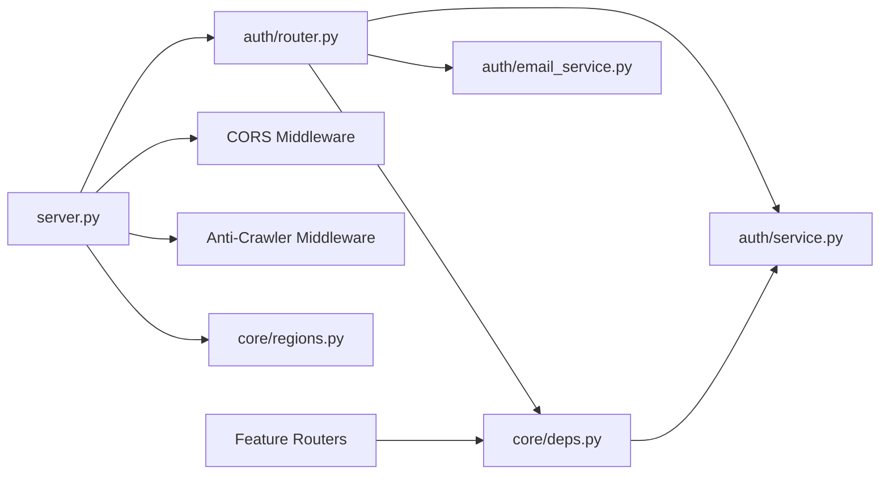

**Diagram sources**
- [auth/router.py:1-17](file://auth/router.py#L1-L17)
- [core/deps.py:1-51](file://core/deps.py#L1-L51)
- [server.py:175-214](file://server.py#L175-L214)
- [server.py:320-330](file://server.py#L320-L330)
- [server.py:298-317](file://server.py#L298-L317)
- [core/regions.py:144-165](file://core/regions.py#L144-L165)

**Section sources**
- [auth/router.py:1-17](file://auth/router.py#L1-L17)
- [core/deps.py:1-51](file://core/deps.py#L1-L51)
- [server.py:175-214](file://server.py#L175-L214)
- [server.py:298-330](file://server.py#L298-L330)
- [core/regions.py:144-165](file://core/regions.py#L144-L165)

## Performance Considerations
- Password hashing runs off the event loop using a thread to prevent blocking single-worker deployments.
- Sliding-window rate limiter uses in-memory structures; suitable for single-instance deployments. Horizontal scaling requires a shared store.
- Database indexes are created at startup to optimize queries for lists, paging, reminders, and sessions.
- Email sending uses timeouts to avoid hanging connections.

[No sources needed since this section provides general guidance]

## Troubleshooting Guide
- 401 Unauthorized:
  - Missing or malformed Authorization header.
  - Invalid or expired access token.
  - Session revoked via logout or expired.
- 403 Forbidden:
  - Unverified email attempting to log in.
  - Known AI crawler user agent blocked.
- 429 Too Many Requests:
  - Exceeded auth rate limits (login/signup/reset).
  - Exceeded AI endpoint quotas (per-user or global).
- Email issues:
  - Verification link expired or invalid.
  - Email delivery failures logged; consider resending verification.
- Data residency errors:
  - Boot failure due to missing or non-Australian region declarations; fix environment variables.

**Section sources**
- [core/deps.py:24-51](file://core/deps.py#L24-L51)
- [auth/router.py:115-140](file://auth/router.py#L115-L140)
- [auth/router.py:222-249](file://auth/router.py#L222-L249)
- [core/ratelimit.py:41-124](file://core/ratelimit.py#L41-L124)
- [server.py:298-317](file://server.py#L298-L317)
- [core/regions.py:144-165](file://core/regions.py#L144-L165)

## Conclusion
The Nueco Backend implements a robust, session-bound JWT authentication model with strong security controls. Tokens are short-lived and revocable via session deletion. Rate limiting protects both auth endpoints and costly AI features. SSRF protection ensures safe outbound fetching, while data residency enforcement guarantees compliance with regional requirements. Anti-crawler measures and CORS configuration further harden the API surface. Following these patterns helps build secure, compliant, and maintainable APIs.

[No sources needed since this section summarizes without analyzing specific files]

## Appendices

### Example Protected Endpoints
- GET /api/auth/me
- PUT /api/auth/me
- PUT /api/auth/me/news-preferences
- GET /api/auth/sync-status

These endpoints require a valid Bearer token and resolve the current user via the core dependency.

**Section sources**
- [auth/router.py:323-366](file://auth/router.py#L323-L366)
- [core/deps.py:24-51](file://core/deps.py#L24-L51)

### Best Practices for Secure APIs
- Use short-lived access tokens bound to sessions for immediate revocation.
- Store refresh tokens hashed server-side with expiration.
- Validate inputs with Pydantic and enforce business rules at route boundaries.
- Apply rate limiting per user and globally where shared resources exist.
- Enforce CORS strictly in production.
- Protect outbound requests with SSRF guards.
- Enforce data residency at boot and on every external call.
- Add anti-crawler signals and robots tags to reduce scraping risk.

[No sources needed since this section provides general guidance]