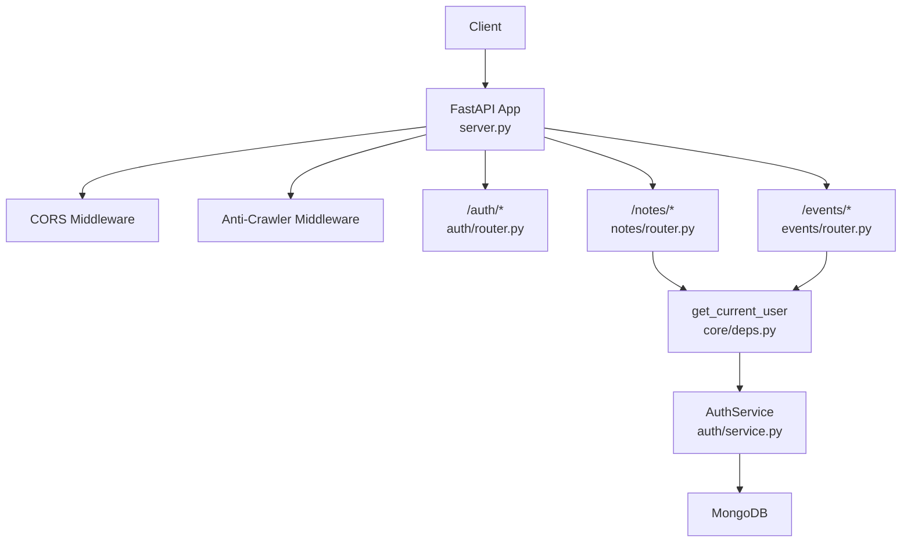
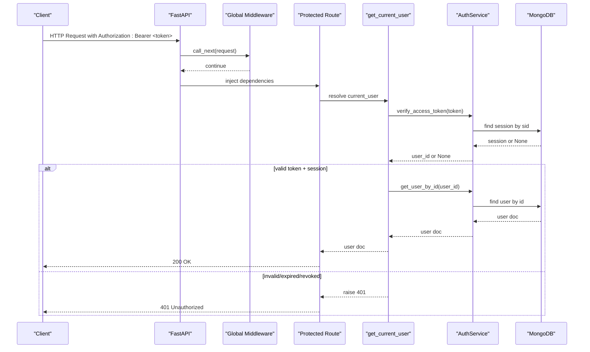
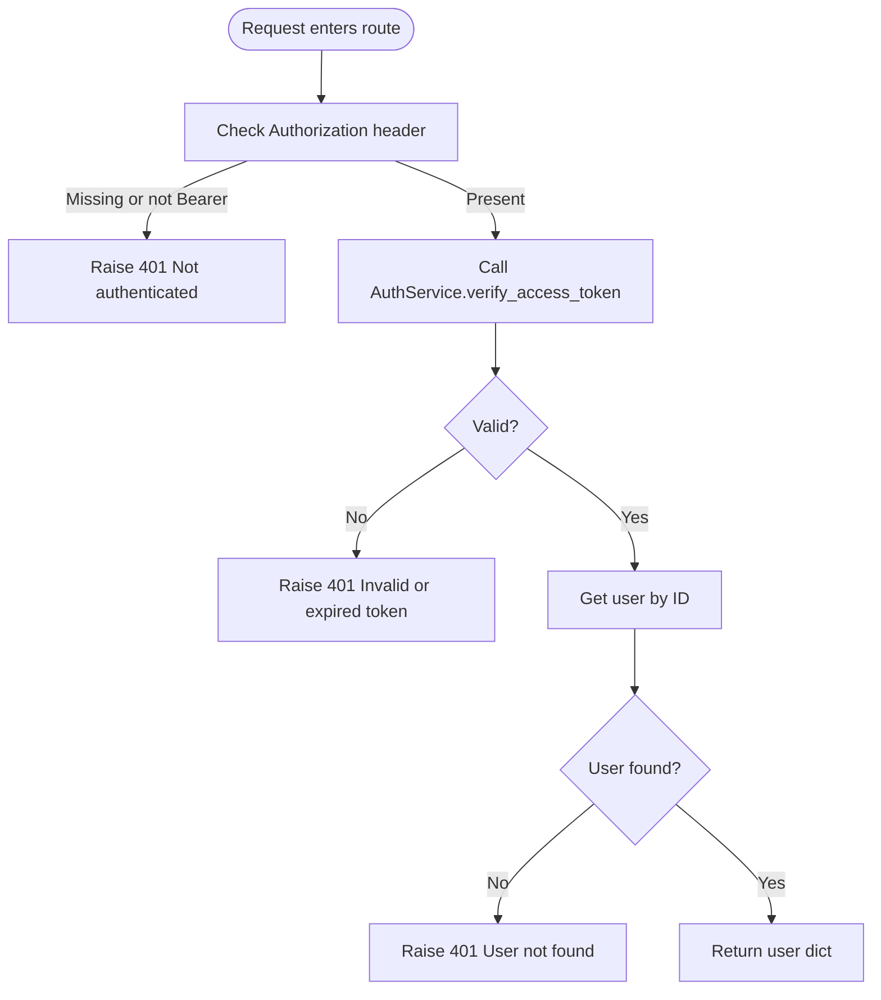
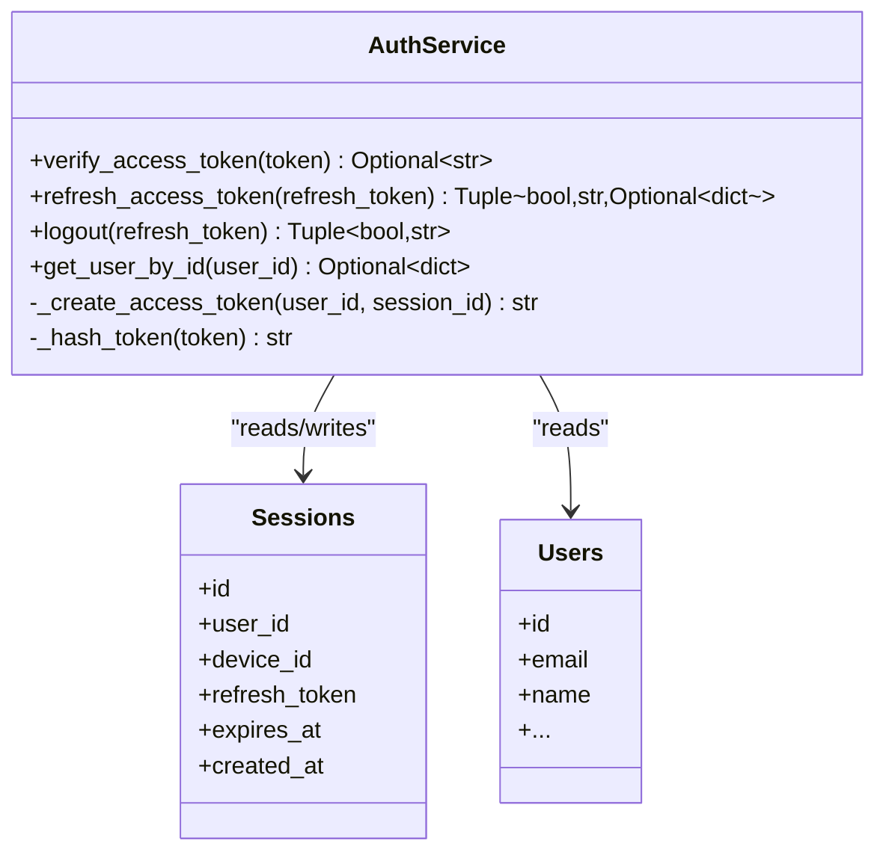
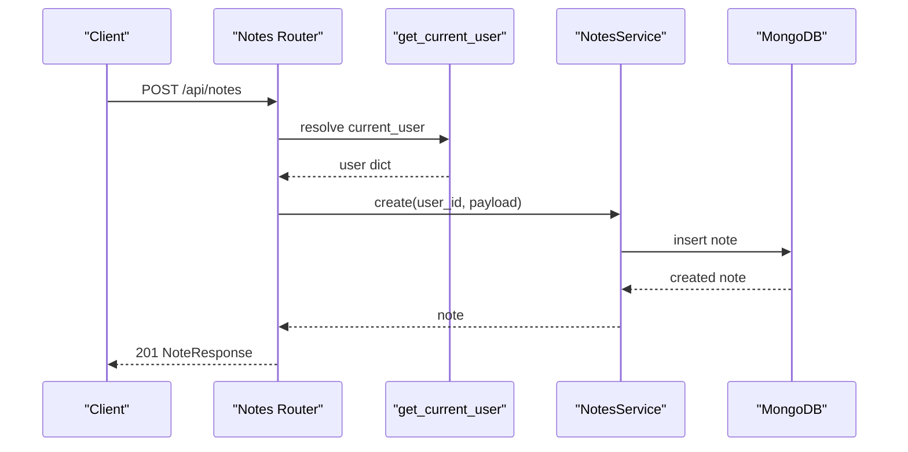
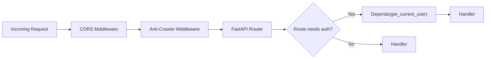
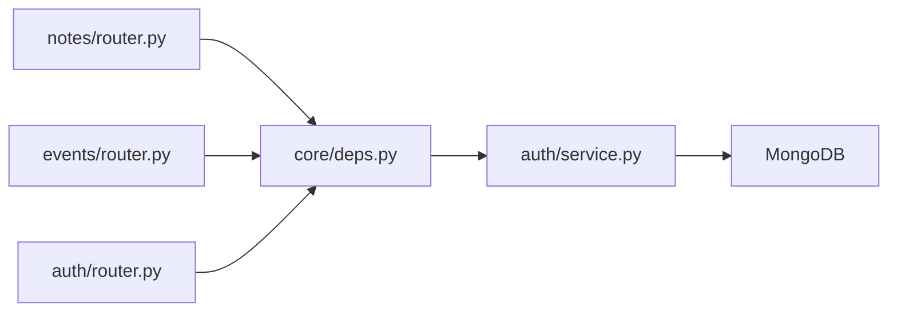

# Authentication Middleware & Dependencies

<cite>
**Referenced Files in This Document**
- [core/deps.py](file://core/deps.py)
- [auth/service.py](file://auth/service.py)
- [auth/router.py](file://auth/router.py)
- [auth/models.py](file://auth/models.py)
- [server.py](file://server.py)
- [notes/router.py](file://notes/router.py)
- [events/router.py](file://events/router.py)
</cite>

## Table of Contents
1. [Introduction](#introduction)
2. [Project Structure](#project-structure)
3. [Core Components](#core-components)
4. [Architecture Overview](#architecture-overview)
5. [Detailed Component Analysis](#detailed-component-analysis)
6. [Dependency Analysis](#dependency-analysis)
7. [Performance Considerations](#performance-considerations)
8. [Troubleshooting Guide](#troubleshooting-guide)
9. [Conclusion](#conclusion)
10. [Appendices](#appendices)

## Introduction
This document explains the authentication middleware and dependency injection system used by the Nueco Backend to protect endpoints and resolve user context from requests. It focuses on:
- The get_current_user dependency that validates JWT tokens, enforces session binding, and resolves the current user
- The middleware pipeline around request handling and how FastAPI’s dependency injection integrates with it
- How protected endpoints use dependencies to enforce authentication
- Error handling for invalid or expired tokens
- Examples of creating protected routes and extending the middleware for additional security checks
- Performance considerations and caching strategies for token validation

## Project Structure
The authentication logic is split across a few focused modules:
- core/deps.py: Shared FastAPI dependencies (get_db, get_current_user)
- auth/service.py: AuthService handles JWT creation/validation, sessions, login/logout, refresh
- auth/router.py: Public auth endpoints (signup, login, password reset, refresh, logout, profile)
- server.py: Application bootstrap, router registration, global middleware (CORS, anti-crawler), startup tasks
- Feature routers (e.g., notes/router.py, events/router.py): Use get_current_user to protect domain endpoints

**Diagram sources**
- [server.py:310-330](file://server.py#L310-L330)
- [auth/router.py:1-20](file://auth/router.py#L1-L20)
- [notes/router.py:1-20](file://notes/router.py#L1-L20)
- [events/router.py:1-20](file://events/router.py#L1-L20)
- [core/deps.py:24-50](file://core/deps.py#L24-L50)
- [auth/service.py:469-494](file://auth/service.py#L469-L494)

**Section sources**
- [server.py:1-40](file://server.py#L1-L40)
- [auth/router.py:1-20](file://auth/router.py#L1-L20)
- [core/deps.py:1-22](file://core/deps.py#L1-L22)

## Core Components
- get_db: Provides the shared MongoDB client per request via deferred import to avoid circular imports at module load time.
- get_current_user: Extracts Authorization header, validates Bearer token format, delegates to AuthService.verify_access_token, then fetches the user document. Raises HTTP 401 for missing/invalid/expired tokens or missing user.
- AuthService: Implements JWT encode/decode, session management, login/logout, refresh, and access token verification bound to a session id.

Key responsibilities:
- Token validation: signature, type, expiry, session binding, session existence and expiry
- User resolution: map sub claim to user document
- Session lifecycle: create on login, invalidate on logout/password change, TTL via index

**Section sources**
- [core/deps.py:15-50](file://core/deps.py#L15-L50)
- [auth/service.py:63-83](file://auth/service.py#L63-L83)
- [auth/service.py:202-273](file://auth/service.py#L202-L273)
- [auth/service.py:424-467](file://auth/service.py#L424-L467)
- [auth/service.py:469-494](file://auth/service.py#L469-L494)

## Architecture Overview
The authentication flow uses FastAPI’s dependency injection rather than a traditional “middleware” class. Each protected endpoint declares current_user: dict = Depends(get_current_user). FastAPI executes get_current_user before the route handler, ensuring authentication happens early. Global middleware (CORS, anti-crawler) runs around all requests, but authentication is enforced per-route via dependencies.

**Diagram sources**
- [core/deps.py:24-50](file://core/deps.py#L24-L50)
- [auth/service.py:469-494](file://auth/service.py#L469-L494)
- [auth/service.py:462-467](file://auth/service.py#L462-L467)
- [server.py:310-330](file://server.py#L310-L330)

## Detailed Component Analysis

### get_current_user dependency
- Reads Authorization header; requires Bearer scheme
- Validates token via AuthService.verify_access_token
- Ensures session exists and has not expired
- Fetches user document and returns it to the route
- Raises HTTPException(401) for:
  - Missing or malformed Authorization header
  - Invalid/expired token
  - Revoked session
  - Missing user

**Diagram sources**
- [core/deps.py:24-50](file://core/deps.py#L24-L50)
- [auth/service.py:469-494](file://auth/service.py#L469-L494)
- [auth/service.py:462-467](file://auth/service.py#L462-L467)

**Section sources**
- [core/deps.py:24-50](file://core/deps.py#L24-L50)

### AuthService token validation and session binding
- Access tokens are short-lived and include:
  - sub: user id
  - type: "access"
  - exp: expiration time
  - sid: session id (enables server-side revocation)
- verify_access_token:
  - Decodes JWT with HS256
  - Enforces type == "access"
  - Requires sid present
  - Looks up session by id; rejects if missing or expired
  - Returns sub (user id) on success
- Refresh flow:
  - Validates stored refresh token hash against sessions
  - Issues new access token bound to same session
- Logout:
  - Deletes session by refresh token hash

**Diagram sources**
- [auth/service.py:63-83](file://auth/service.py#L63-L83)
- [auth/service.py:202-273](file://auth/service.py#L202-L273)
- [auth/service.py:424-467](file://auth/service.py#L424-L467)
- [auth/service.py:469-494](file://auth/service.py#L469-L494)
- [auth/models.py:51-65](file://auth/models.py#L51-L65)

**Section sources**
- [auth/service.py:63-83](file://auth/service.py#L63-L83)
- [auth/service.py:202-273](file://auth/service.py#L202-L273)
- [auth/service.py:424-467](file://auth/service.py#L424-L467)
- [auth/service.py:469-494](file://auth/service.py#L469-L494)
- [auth/models.py:51-65](file://auth/models.py#L51-L65)

### Protected endpoints using dependencies
- Many feature routers declare current_user: dict = Depends(get_current_user) to ensure only authenticated users can access them.
- Typical pattern:
  - Extract user id from current_user
  - Call service methods scoped to that user id
  - Return responses or raise HTTP exceptions

Examples:
- Notes endpoints: create, list, get, update, delete, toggle-pin
- Events endpoints: create, list, get, batch, update, delete
- Auth endpoints: change-password, me, update name/news preferences, sync-status

**Diagram sources**
- [notes/router.py:17-28](file://notes/router.py#L17-L28)
- [core/deps.py:24-50](file://core/deps.py#L24-L50)

**Section sources**
- [notes/router.py:17-28](file://notes/router.py#L17-L28)
- [events/router.py:23-34](file://events/router.py#L23-L34)
- [auth/router.py:276-365](file://auth/router.py#L276-L365)

### Middleware pipeline and integration points
- Global middleware:
  - CORS configured to allow credentials and specific headers
  - Anti-crawler middleware blocks known AI crawler user agents and adds robots tags
- Authentication is enforced per-route via dependencies rather than a single global auth middleware. This allows fine-grained control over which endpoints require authentication.

**Diagram sources**
- [server.py:310-330](file://server.py#L310-L330)
- [core/deps.py:24-50](file://core/deps.py#L24-L50)

**Section sources**
- [server.py:310-330](file://server.py#L310-L330)

## Dependency Analysis
- Coupling:
  - Feature routers depend on core.deps.get_current_user and core.deps.get_db
  - core.deps depends on server.db via deferred import to avoid circular imports
  - AuthService depends on MongoDB collections (users, devices, sessions)
- Cohesion:
  - Authentication concerns are encapsulated in AuthService and core.deps
  - Feature routers remain focused on domain logic after identity is resolved
- External dependencies:
  - PyJWT for token encoding/decoding
  - Motor async driver for MongoDB
  - bcrypt for password hashing

**Diagram sources**
- [notes/router.py:1-20](file://notes/router.py#L1-L20)
- [events/router.py:1-20](file://events/router.py#L1-L20)
- [auth/router.py:1-20](file://auth/router.py#L1-L20)
- [core/deps.py:15-50](file://core/deps.py#L15-L50)
- [auth/service.py:35-41](file://auth/service.py#L35-L41)

**Section sources**
- [core/deps.py:15-50](file://core/deps.py#L15-L50)
- [auth/service.py:35-41](file://auth/service.py#L35-L41)

## Performance Considerations
- Async I/O:
  - All database operations are async via Motor, preventing event loop blocking
  - CPU-bound bcrypt hashing is offloaded to a thread pool via asyncio.to_thread to avoid blocking the event loop during login/password changes
- Token validation cost:
  - Each protected request performs JWT decode plus one session lookup and one user lookup
  - Session lookup is indexed on expires_at and user_id; ensure indexes exist (see startup index creation)
- Caching strategies:
  - In-process cache: Add an LRU cache keyed by token or (sub, sid) to reduce repeated session/user lookups within a process lifetime. Be mindful of memory usage and consistency when sessions are revoked.
  - Distributed cache: For multi-worker deployments, consider Redis to cache recent session validity checks with short TTLs aligned to token/session lifetimes.
  - Read-through: Cache user documents by user_id with invalidation on profile updates or password changes.
- Indexing:
  - Ensure sessions collection has appropriate indexes for fast lookup by id and user_id
  - Ensure users collection has unique index on id and email
  - Startup code creates these indexes; verify they exist in production

[No sources needed since this section provides general guidance]

## Troubleshooting Guide
Common errors and their causes:
- 401 Not authenticated:
  - Missing Authorization header or not starting with "Bearer "
  - Malformed token string
- 401 Invalid or expired token:
  - Expired JWT
  - Invalid signature
  - Token type is not "access"
  - Missing session id claim
- 401 User not found:
  - Session exists but user was deleted or migrated
- 403 Forbidden:
  - Login succeeded but account needs verification
- 429 Too many attempts:
  - Rate limiting triggered on login/signup/reset endpoints

Debugging steps:
- Verify Authorization header format
- Inspect JWT payload claims (type, exp, sid)
- Check session existence and expiry in sessions collection
- Confirm indexes exist for sessions and users
- Review rate limiter logs for repeated failures

**Section sources**
- [core/deps.py:24-50](file://core/deps.py#L24-L50)
- [auth/service.py:469-494](file://auth/service.py#L469-L494)
- [auth/router.py:115-140](file://auth/router.py#L115-L140)
- [auth/router.py:222-232](file://auth/router.py#L222-L232)

## Conclusion
Nueco Backend implements authentication through FastAPI’s dependency injection with a robust AuthService that issues short-lived, session-bound JWTs. Protected endpoints declare current_user: dict = Depends(get_current_user), ensuring consistent enforcement across features. The design avoids global auth middleware in favor of explicit per-route dependencies, enabling fine-grained control while keeping feature routers decoupled from auth implementation details. Performance is maintained via async I/O, offloading CPU-heavy hashing, and careful indexing. Caching can be added at the dependency layer to reduce repeated token and user lookups without compromising correctness.

[No sources needed since this section summarizes without analyzing specific files]

## Appendices

### Creating protected routes
- Add current_user: dict = Depends(get_current_user) to any route parameter
- Extract user id from current_user and scope operations accordingly
- Example patterns:
  - Create: POST /api/notes with body validated by Pydantic
  - List: GET /api/events with pagination parameters
  - Update/Delete: PUT/DELETE /api/{resource}/{id}

**Section sources**
- [notes/router.py:17-28](file://notes/router.py#L17-L28)
- [events/router.py:23-34](file://events/router.py#L23-L34)

### Custom authentication decorators
- While the project uses dependencies, you can wrap existing routes with a decorator that calls get_current_user and raises custom exceptions or adds audit metadata
- Alternatively, create a composite dependency that composes get_current_user with additional checks (e.g., role or feature flag) and use Depends(composite_dep)

[No sources needed since this section provides general guidance]

### Extending middleware for additional security checks
- Add a FastAPI HTTP middleware to inspect requests globally (e.g., add tracing headers, log sensitive fields)
- Combine with per-route dependencies for layered security
- Ensure global middleware does not bypass authentication; rely on dependencies for authorization decisions

**Section sources**
- [server.py:310-330](file://server.py#L310-L330)