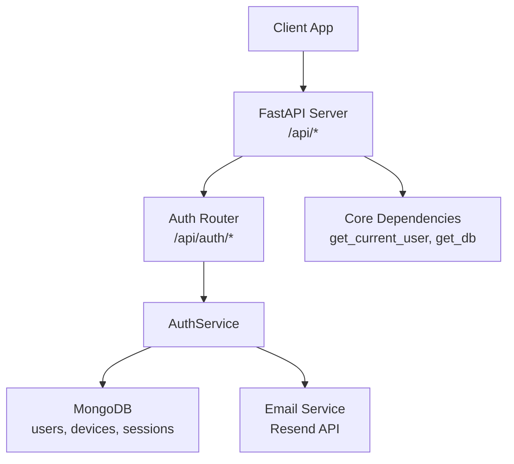
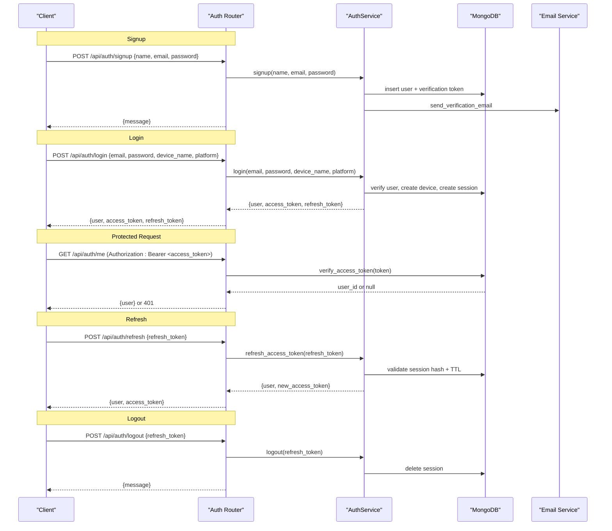
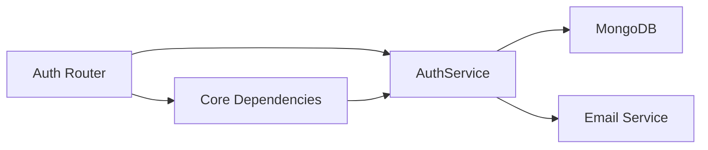

# JWT Authentication Flow

<cite>
**Referenced Files in This Document**
- [server.py](file://server.py)
- [auth/router.py](file://auth/router.py)
- [auth/service.py](file://auth/service.py)
- [auth/models.py](file://auth/models.py)
- [auth/schemas.py](file://auth/schemas.py)
- [auth/email_service.py](file://auth/email_service.py)
- [core/deps.py](file://core/deps.py)
- [accounts/router.py](file://accounts/router.py)
- [accounts/service.py](file://accounts/service.py)
</cite>

## Table of Contents
1. [Introduction](#introduction)
2. [Project Structure](#project-structure)
3. [Core Components](#core-components)
4. [Architecture Overview](#architecture-overview)
5. [Detailed Component Analysis](#detailed-component-analysis)
6. [Dependency Analysis](#dependency-analysis)
7. [Performance Considerations](#performance-considerations)
8. [Troubleshooting Guide](#troubleshooting-guide)
9. [Conclusion](#conclusion)
10. [Appendices](#appendices)

## Introduction
This document explains the complete JWT-based authentication lifecycle in the Nueco Backend, including user registration with email verification, login with device tracking, token generation and validation, refresh token mechanism, logout, and account management operations. It covers the JWT structure, expiration handling, security measures, endpoint behaviors (signup, login, refresh, logout), error scenarios, client integration patterns, and best practices for secure token storage and transmission.

## Project Structure
The authentication system is implemented across several modules:
- API routes under /api/auth handle signup, login, email verification, password reset, refresh, logout, and profile updates.
- Business logic resides in AuthService for token handling, session management, and user workflows.
- Shared dependencies provide current-user resolution and database access.
- Email service sends verification and password-reset emails via an external provider.
- Account deletion integrates with data erasure across collections.

**Diagram sources**
- [server.py:175-214](file://server.py#L175-L214)
- [auth/router.py:20-366](file://auth/router.py#L20-L366)
- [auth/service.py:35-506](file://auth/service.py#L35-L506)
- [core/deps.py:15-51](file://core/deps.py#L15-L51)
- [auth/email_service.py:26-151](file://auth/email_service.py#L26-L151)

**Section sources**
- [server.py:175-214](file://server.py#L175-L214)
- [auth/router.py:20-366](file://auth/router.py#L20-L366)
- [auth/service.py:35-506](file://auth/service.py#L35-L506)
- [core/deps.py:15-51](file://core/deps.py#L15-L51)
- [auth/email_service.py:26-151](file://auth/email_service.py#L26-L151)

## Core Components
- Auth Router: Defines HTTP endpoints for authentication flows and applies rate limiting.
- AuthService: Implements JWT creation/validation, session management, device tracking, email verification, password reset/change, and account operations.
- Models: Define MongoDB documents for users, devices, and sessions.
- Schemas: Pydantic models for request/response payloads.
- Core Dependencies: Provide authenticated user resolution and database connection.
- Email Service: Sends verification and password reset emails via Resend.
- Accounts: Provides GDPR-compliant account erasure.

Key responsibilities:
- Enforce rate limits on sensitive endpoints.
- Validate inputs (e.g., password length, matching).
- Create short-lived access tokens bound to sessions.
- Store hashed refresh tokens and enforce TTL.
- Track devices and update last active timestamps.
- Verify email via idempotent links.
- Invalidate sessions on password changes.

**Section sources**
- [auth/router.py:22-84](file://auth/router.py#L22-L84)
- [auth/service.py:24-105](file://auth/service.py#L24-L105)
- [auth/models.py:6-66](file://auth/models.py#L6-L66)
- [auth/schemas.py:6-80](file://auth/schemas.py#L6-L80)
- [core/deps.py:24-51](file://core/deps.py#L24-L51)
- [auth/email_service.py:66-151](file://auth/email_service.py#L66-L151)
- [accounts/service.py:56-108](file://accounts/service.py#L56-L108)

## Architecture Overview
The authentication architecture uses a session-bound JWT approach:
- Access tokens are short-lived and include a session identifier claim.
- Refresh tokens are long-lived, stored as hashes in sessions, and validated server-side.
- Logout deletes the session, invalidating all associated access tokens even before expiry.
- Device tracking records each login per device and updates activity timestamps.

**Diagram sources**
- [auth/router.py:93-321](file://auth/router.py#L93-L321)
- [auth/service.py:107-461](file://auth/service.py#L107-L461)
- [core/deps.py:24-51](file://core/deps.py#L24-L51)
- [auth/email_service.py:66-122](file://auth/email_service.py#L66-L122)

## Detailed Component Analysis

### JWT Structure and Validation
- Access Token:
  - Contains subject (user ID), type ("access"), expiration, and session ID (sid).
  - Short-lived (minutes) to limit exposure window.
  - Bound to a session; if session is deleted or expired, token is rejected during validation.
- Refresh Token:
  - Long-lived (days), generated securely and stored as a SHA-256 hash in sessions.
  - Used to obtain new access tokens without re-authentication.
  - Deleted upon logout or when expired.

Validation flow:
- Decode and verify signature using HS256 and a secret from environment.
- Ensure type is "access".
- Require sid claim and check that the referenced session exists and has not expired.
- Return user ID if valid; otherwise reject.

Security considerations:
- Secret must be set at runtime; missing secret raises startup error.
- Session binding ensures immediate revocation on logout.
- Refresh tokens are never stored in plaintext.

**Section sources**
- [auth/service.py:24-83](file://auth/service.py#L24-L83)
- [auth/service.py:469-494](file://auth/service.py#L469-L494)

### User Registration and Email Verification
Signup:
- Validates password match and minimum length.
- Applies IP-based rate limiting.
- Creates user with hashed password and verification token with 24-hour expiry.
- Sends verification email; failures are logged but do not block signup.

Email verification:
- Idempotent: visiting the link multiple times succeeds without deleting the token.
- Checks token existence and expiry; marks user verified if valid.
- Returns HTML page with deep link to open the app.

Error scenarios:
- Duplicate unverified account with non-expired token: informs user to check email or resend.
- Expired verification token: instructs user to request a new link.
- Already verified: success message.

**Section sources**
- [auth/router.py:93-113](file://auth/router.py#L93-L113)
- [auth/router.py:142-220](file://auth/router.py#L142-L220)
- [auth/service.py:107-149](file://auth/service.py#L107-L149)
- [auth/service.py:275-310](file://auth/service.py#L275-L310)
- [auth/email_service.py:66-92](file://auth/email_service.py#L66-L92)

### Login with Device Tracking and Multi-Device Support
Login:
- Rate-limited by email and IP.
- Verifies credentials and checks account lockout due to failed attempts.
- Requires email verification before granting tokens.
- On success:
  - Creates or updates device record with name and platform.
  - Creates session with hashed refresh token and expiry.
  - Generates access token bound to session.
  - Returns user info, access token, and refresh token.

Multi-device support:
- Each login creates a new device and session, enabling multiple concurrent devices.
- Refreshing updates device last_active_at timestamp.

Error scenarios:
- Incorrect credentials increment failed attempts; after threshold, account locks temporarily.
- Unverified email blocks login and returns needs_verification flag.

**Section sources**
- [auth/router.py:115-140](file://auth/router.py#L115-L140)
- [auth/service.py:202-273](file://auth/service.py#L202-L273)
- [auth/models.py:34-49](file://auth/models.py#L34-L49)

### Token Refresh Mechanism
Refresh:
- Hashes provided refresh token and looks up session.
- Rejects if session not found or expired; deletes expired sessions.
- Retrieves user and issues a new access token bound to the same session.
- Updates device last_active_at.

Response includes user and new access token; refresh token remains unchanged.

Error scenarios:
- Invalid refresh token: 401.
- Expired session: requires re-login.

**Section sources**
- [auth/router.py:301-314](file://auth/router.py#L301-L314)
- [auth/service.py:424-451](file://auth/service.py#L424-L451)

### Logout Functionality
Logout:
- Accepts refresh token, hashes it, finds session, and deletes it.
- Deleting session invalidates all access tokens bound to it immediately.

Idempotent behavior:
- Returns success even if session not found.

**Section sources**
- [auth/router.py:316-321](file://auth/router.py#L316-L321)
- [auth/service.py:453-460](file://auth/service.py#L453-L460)

### Password Reset and Change
Forgot Password:
- Rate-limited by email and IP.
- Generates reset token with 30-minute expiry and sends email.
- Always returns success to avoid revealing account existence.

Reset Password:
- Validates token and expiry.
- Hashes new password and clears reset tokens.
- Invalidates all sessions for the user (forces re-login everywhere).

Change Password (authenticated):
- Validates current password and new password constraints.
- Updates password and sends confirmation email.

**Section sources**
- [auth/router.py:222-249](file://auth/router.py#L222-L249)
- [auth/router.py:276-299](file://auth/router.py#L276-L299)
- [auth/service.py:312-361](file://auth/service.py#L312-L361)
- [auth/service.py:363-385](file://auth/service.py#L363-L385)
- [auth/email_service.py:94-151](file://auth/email_service.py#L94-L151)

### Account Management Operations
Profile Update:
- Update display name (supports E2EE enc_version).
- Update news preferences (country, outlets, verse/quote toggles).

Account Deletion:
- Requires password confirmation.
- Erases attachments and all user-scoped collections, including push receipts.
- Ensures GDPR compliance by wiping related data.

**Section sources**
- [auth/router.py:323-356](file://auth/router.py#L323-L356)
- [accounts/router.py:11-24](file://accounts/router.py#L11-L24)
- [accounts/service.py:56-108](file://accounts/service.py#L56-L108)

### Protected Endpoints and Current User Resolution
Protected endpoints use get_current_user dependency:
- Extracts Bearer token from Authorization header.
- Verifies token via AuthService.verify_access_token.
- Fetches user document and returns it to route handlers.

Common protected endpoints:
- GET /api/auth/me
- PUT /api/auth/me
- PUT /api/auth/me/news-preferences
- GET /api/auth/sync-status

Error scenarios:
- Missing or malformed Authorization header: 401.
- Invalid/expired token or revoked session: 401.
- User not found: 401.

**Section sources**
- [core/deps.py:24-51](file://core/deps.py#L24-L51)
- [auth/router.py:323-366](file://auth/router.py#L323-L366)

## Dependency Analysis
The authentication flow depends on:
- FastAPI routers for HTTP endpoints.
- AuthService for business logic and token/session management.
- MongoDB for persistence of users, devices, and sessions.
- Email service for sending verification and reset emails.
- Core dependencies for shared auth middleware and DB access.

**Diagram sources**
- [auth/router.py:20-366](file://auth/router.py#L20-L366)
- [auth/service.py:35-506](file://auth/service.py#L35-L506)
- [core/deps.py:15-51](file://core/deps.py#L15-L51)
- [auth/email_service.py:26-151](file://auth/email_service.py#L26-L151)

**Section sources**
- [auth/router.py:20-366](file://auth/router.py#L20-L366)
- [auth/service.py:35-506](file://auth/service.py#L35-L506)
- [core/deps.py:15-51](file://core/deps.py#L15-L51)
- [auth/email_service.py:26-151](file://auth/email_service.py#L26-L151)

## Performance Considerations
- Password hashing uses bcrypt with CPU-bound work offloaded to threads to avoid blocking the event loop.
- Email sending uses async HTTP with explicit timeouts to prevent hanging connections.
- Database indexes are created at startup for performance-critical queries (users, sessions, devices, notes, events, trips, push tokens).
- Sessions have TTL index to auto-expire entries.
- Rate limiting is implemented in-memory with periodic cleanup to control abuse.

[No sources needed since this section provides general guidance]

## Troubleshooting Guide
Common errors and resolutions:
- 401 Not authenticated: Missing or malformed Authorization header; ensure Bearer token is included.
- 401 Invalid or expired token: Access token may be expired or session revoked; refresh or re-login.
- 403 Needs verification: User not verified; follow email verification link.
- 429 Too many attempts: Rate limit exceeded; wait before retrying.
- 400 Bad request: Password mismatch or insufficient length; correct input.
- 404 User not found: During account deletion or profile updates; verify user identity.

Debugging tips:
- Check logs for email delivery failures and token validation errors.
- Inspect session TTL and device last_active_at for refresh behavior.
- Verify environment variables (JWT_SECRET, APP_BASE_URL, SMTP settings).

**Section sources**
- [core/deps.py:24-51](file://core/deps.py#L24-L51)
- [auth/router.py:93-321](file://auth/router.py#L93-L321)
- [auth/service.py:202-461](file://auth/service.py#L202-L461)

## Conclusion
The Nueco Backend implements a robust, session-bound JWT authentication system with strong security controls:
- Short-lived access tokens bound to sessions enable immediate revocation on logout.
- Long-lived refresh tokens are stored as hashes and validated server-side.
- Device tracking supports multi-device usage while maintaining visibility into activity.
- Robust rate limiting protects against brute-force and abuse.
- Email verification and password reset flows are secure and idempotent where appropriate.
- GDPR-compliant account erasure ensures comprehensive data removal.

For clients, integrate by storing tokens securely, refreshing proactively before expiry, and handling error responses gracefully.

[No sources needed since this section summarizes without analyzing specific files]

## Appendices

### Endpoint Reference and Payloads
- POST /api/auth/signup
  - Request: name, email, password, confirm_password
  - Response: message, success
  - Errors: 400 (password mismatch/length), 429 (rate limit)
- POST /api/auth/login
  - Request: email, password, device_name, platform
  - Response: user, access_token, refresh_token, token_type
  - Errors: 401 (invalid creds), 403 (needs verification), 429 (rate limit)
- GET /api/auth/verify-email/{token}
  - Response: HTML page indicating success/failure
- POST /api/auth/forgot-password
  - Request: email
  - Response: message, success
  - Errors: 429 (rate limit)
- POST /api/auth/reset-password
  - Request: token, new_password, confirm_password
  - Response: message, success
  - Errors: 400 (invalid/expired token, password mismatch/length)
- POST /api/auth/resend-verification
  - Request: email
  - Response: message, success
- POST /api/auth/delete-unverified
  - Request: email
  - Response: message, success
- POST /api/auth/change-password
  - Request: current_password, new_password, confirm_password
  - Response: message, success
  - Errors: 400 (validation)
- POST /api/auth/refresh
  - Request: refresh_token
  - Response: user, access_token, refresh_token
  - Errors: 401 (invalid/expired refresh token)
- POST /api/auth/logout
  - Request: refresh_token
  - Response: message, success
- GET /api/auth/me
  - Headers: Authorization: Bearer <access_token>
  - Response: user
- PUT /api/auth/me
  - Headers: Authorization: Bearer <access_token>
  - Request: name, enc_version (optional)
  - Response: user
- PUT /api/auth/me/news-preferences
  - Headers: Authorization: Bearer <access_token>
  - Request: country, outlet_ids, show_verse, show_quote
  - Response: user
- GET /api/auth/sync-status
  - Headers: Authorization: Bearer <access_token>
  - Response: notes_count, synced, user_name

**Section sources**
- [auth/router.py:93-366](file://auth/router.py#L93-L366)
- [auth/schemas.py:6-80](file://auth/schemas.py#L6-L80)

### Security Best Practices
- Token Storage:
  - Store access tokens in memory or secure storage; avoid persistent storage unless necessary.
  - Store refresh tokens securely (e.g., secure HTTP-only cookies or encrypted storage).
- Transmission:
  - Use HTTPS for all requests.
  - Include Authorization header with Bearer token for protected endpoints.
- Validation:
  - Validate tokens server-side with session binding.
  - Handle expired tokens by refreshing or prompting re-login.
- Rate Limiting:
  - Respect 429 responses and implement backoff strategies.
- Email Links:
  - Treat verification and reset links as secrets; they expire and should be used once (verification is idempotent for safety).

[No sources needed since this section provides general guidance]