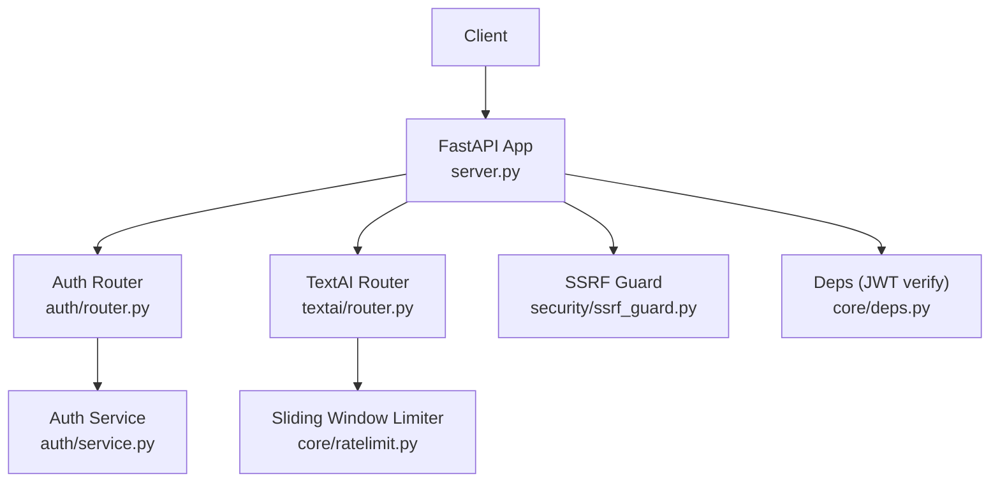
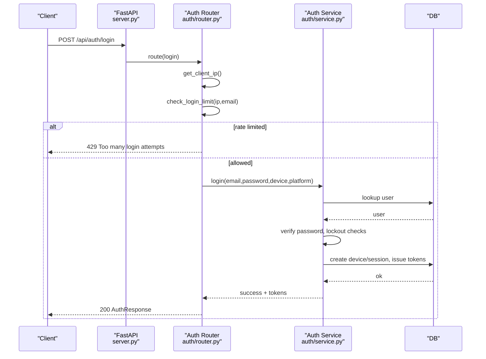
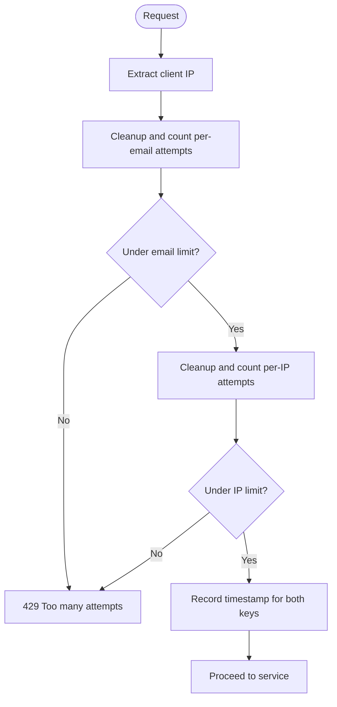
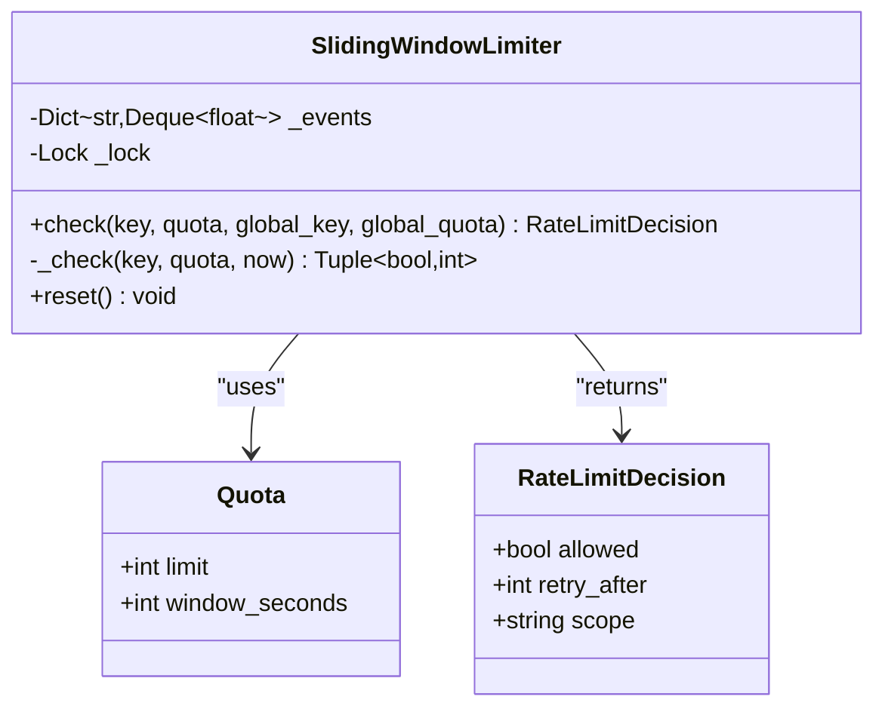
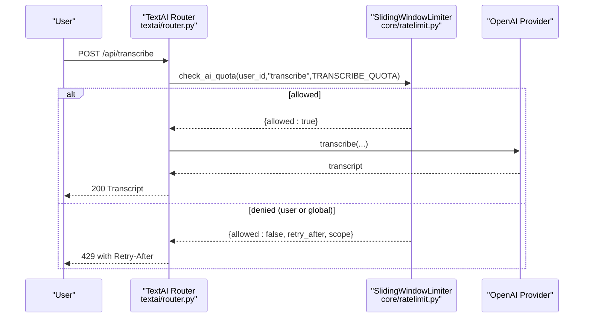
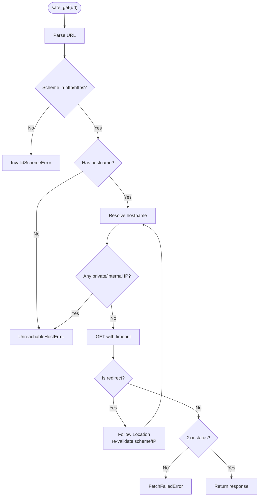
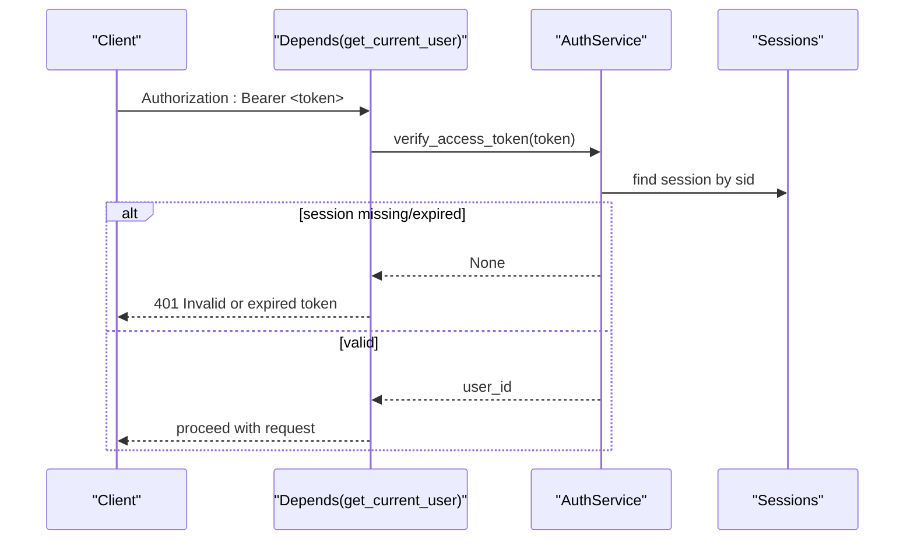
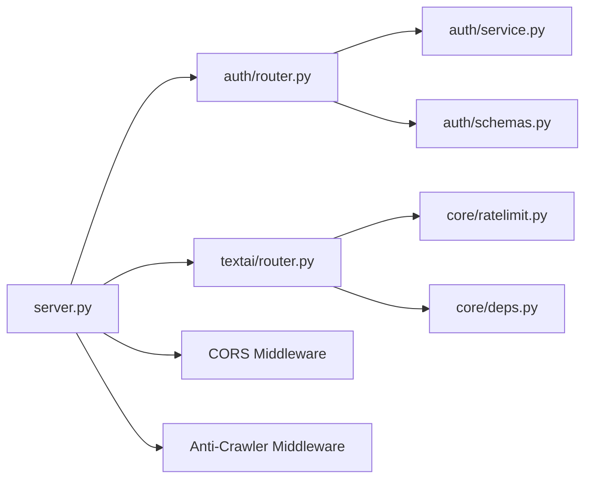

# Rate Limiting & Security Measures

<cite>
**Referenced Files in This Document**
- [server.py](file://server.py)
- [auth/router.py](file://auth/router.py)
- [auth/service.py](file://auth/service.py)
- [core/ratelimit.py](file://core/ratelimit.py)
- [security/ssrf_guard.py](file://security/ssrf_guard.py)
- [textai/router.py](file://textai/router.py)
- [core/deps.py](file://core/deps.py)
- [auth/schemas.py](file://auth/schemas.py)
</cite>

## Table of Contents
1. [Introduction](#introduction)
2. [Project Structure](#project-structure)
3. [Core Components](#core-components)
4. [Architecture Overview](#architecture-overview)
5. [Detailed Component Analysis](#detailed-component-analysis)
6. [Dependency Analysis](#dependency-analysis)
7. [Performance Considerations](#performance-considerations)
8. [Troubleshooting Guide](#troubleshooting-guide)
9. [Conclusion](#conclusion)

## Introduction
This document explains the security measures and rate limiting implementation in the Nueco Backend, focusing on:
- AuthRateLimiter for signup, login, and password reset throttling (IP-based and email-based windows)
- SSRF protection via ssrf_guard when fetching user-supplied URLs
- Input validation strategies using Pydantic schemas and request constraints
- CORS configuration and anti-crawler posture
- Rate limiting algorithms, window cleanup, and thresholds
- Examples of enforcement, common attack vectors mitigated, and best practices for secure endpoints
- Security headers, request sanitization, and protections against brute force and credential stuffing

## Project Structure
The backend is a FastAPI application with modular routers per feature area. Security-related logic spans several modules:
- Authentication routes and in-process rate limiter live under auth/
- Global server setup, CORS, middleware, and index creation are in server.py
- AI/text processing rate limiting lives in core/ratelimit.py and is enforced in textai/router.py
- SSRF protection is encapsulated in security/ssrf_guard.py
- Shared dependencies for authentication and DB access are in core/deps.py
- Request/response contracts are defined in auth/schemas.py

**Diagram sources**
- [server.py:20-214](file://server.py#L20-L214)
- [auth/router.py:20-366](file://auth/router.py#L20-L366)
- [auth/service.py:35-506](file://auth/service.py#L35-L506)
- [core/ratelimit.py:41-124](file://core/ratelimit.py#L41-L124)
- [security/ssrf_guard.py:67-109](file://security/ssrf_guard.py#L67-L109)
- [core/deps.py:24-51](file://core/deps.py#L24-L51)

**Section sources**
- [server.py:20-214](file://server.py#L20-L214)
- [auth/router.py:20-366](file://auth/router.py#L20-L366)

## Core Components
- AuthRateLimiter: In-process sliding-window counters keyed by IP and email to protect signup, login, and password reset endpoints. Includes periodic cleanup of old attempts.
- SlidingWindowLimiter (AI): Per-user and global quotas for expensive AI endpoints (transcription, voice intent, text processing), returning Retry-After guidance.
- SSRF Guard: Validates schemes, resolves hostnames, rejects private/internal IPs, and re-validates on every redirect hop.
- Input Validation: Pydantic models enforce types and formats; additional checks in routers (e.g., password length).
- CORS and Anti-Crawler: Configurable allowed origins; middleware blocks known AI crawlers and adds robots tags.
- Authentication Dependencies: Bearer token verification and session binding to revoke tokens on logout/expiry.

**Section sources**
- [auth/router.py:23-84](file://auth/router.py#L23-L84)
- [core/ratelimit.py:25-124](file://core/ratelimit.py#L25-L124)
- [security/ssrf_guard.py:33-109](file://security/ssrf_guard.py#L33-L109)
- [auth/schemas.py:1-80](file://auth/schemas.py#L1-L80)
- [server.py:310-330](file://server.py#L310-L330)
- [core/deps.py:24-51](file://core/deps.py#L24-L51)

## Architecture Overview
Security controls are layered:
- HTTP layer: CORS, anti-crawler middleware, request parsing/validation
- Route layer: AuthRateLimiter for sensitive flows; AI quota enforcement before external calls
- Service layer: Secure hashing, session management, token revocation, account lockout
- Network layer: SSRF guard prevents outbound requests to internal/private networks

**Diagram sources**
- [server.py:30-35](file://server.py#L30-L35)
- [auth/router.py:115-140](file://auth/router.py#L115-L140)
- [auth/service.py:202-273](file://auth/service.py#L202-L273)

## Detailed Component Analysis

### AuthRateLimiter: IP and Email Throttling
- Mechanism: In-memory lists of timestamps per key; cleanup removes entries older than the window.
- Login: Up to 5 attempts per email per minute and up to 10 attempts per IP per minute.
- Signup: Up to 3 signups per IP per hour.
- Password Reset: Up to 3 resets per email per hour and up to 5 resets per IP per hour.
- Cleanup: Each check trims old timestamps before counting.
- Enforcement: Routes raise HTTPException(429) when limits exceeded.

**Diagram sources**
- [auth/router.py:23-84](file://auth/router.py#L23-L84)
- [auth/router.py:93-121](file://auth/router.py#L93-L121)
- [auth/router.py:222-232](file://auth/router.py#L222-L232)

**Section sources**
- [auth/router.py:23-84](file://auth/router.py#L23-L84)
- [auth/router.py:93-121](file://auth/router.py#L93-L121)
- [auth/router.py:222-232](file://auth/router.py#L222-L232)

### AI Endpoints: Sliding Window Rate Limiting
- Algorithm: Per-user deque of timestamps within a fixed window; optional global window shared across all users to protect a single OpenAI key.
- Quotas:
  - Transcription: 10 per minute per user
  - Voice Intent: 20 per minute per user
  - Text Processing: 15 per minute per user
  - Global backstop: 120 per minute across all users
- Behavior: On denial, returns 429 with Retry-After header indicating seconds until oldest event expires.
- Scope: Enforced before any external call to avoid wasted cost.

**Diagram sources**
- [core/ratelimit.py:25-94](file://core/ratelimit.py#L25-L94)

**Diagram sources**
- [textai/router.py:28-49](file://textai/router.py#L28-L49)
- [textai/router.py:75-130](file://textai/router.py#L75-L130)
- [core/ratelimit.py:66-124](file://core/ratelimit.py#L66-L124)

**Section sources**
- [core/ratelimit.py:41-124](file://core/ratelimit.py#L41-L124)
- [textai/router.py:28-49](file://textai/router.py#L28-L49)
- [textai/router.py:75-130](file://textai/router.py#L75-L130)

### SSRF Protection
- Purpose: Safely fetch user-supplied URLs while preventing access to internal/private networks and DNS rebinding attacks.
- Checks:
  - Scheme must be http or https
  - Hostname must resolve; reject private, loopback, link-local, reserved, multicast, unspecified addresses
  - Manual redirect following validates each hop’s scheme and resolved IPs
- Exceptions: Custom error types for invalid scheme, unreachable host, and fetch failures.

**Diagram sources**
- [security/ssrf_guard.py:67-109](file://security/ssrf_guard.py#L67-L109)

**Section sources**
- [security/ssrf_guard.py:33-109](file://security/ssrf_guard.py#L33-L109)

### Input Validation Strategies
- Schema-level validation: Pydantic models enforce email format, required fields, and defaults.
- Endpoint-level validation: Password length checks and match confirmation in auth routes.
- Size caps: Wrapped key blobs and feature event metadata are size-limited to prevent abuse.

Examples:
- Email validation via EmailStr in request schemas
- Minimum password length enforced at route level
- Event meta JSON size capped before storage

**Section sources**
- [auth/schemas.py:1-80](file://auth/schemas.py#L1-L80)
- [auth/router.py:101-105](file://auth/router.py#L101-L105)
- [auth/router.py:237-241](file://auth/router.py#L237-L241)
- [server.py:51-53](file://server.py#L51-L53)
- [server.py:75-78](file://server.py#L75-L78)
- [server.py:112-115](file://server.py#L112-L115)

### CORS Configuration
- Allowed origins are read from an environment variable; if empty, wildcard is used (not recommended for production).
- Credentials allowed; methods include GET, POST, PUT, DELETE, OPTIONS.
- Allowed headers include Authorization, Content-Type, X-Requested-With.

Best practice: Set ALLOWED_ORIGINS to explicit trusted domains in production.

**Section sources**
- [server.py:320-330](file://server.py#L320-L330)

### Authentication and Session Binding
- Access tokens are bound to a session ID; logging out deletes the session, invalidating tokens even before expiry.
- Refresh tokens are hashed and stored; sessions have TTL indexes for automatic cleanup.
- Account lockout after repeated failed logins with a configurable duration.

**Diagram sources**
- [core/deps.py:24-51](file://core/deps.py#L24-L51)
- [auth/service.py:469-494](file://auth/service.py#L469-L494)

**Section sources**
- [core/deps.py:24-51](file://core/deps.py#L24-L51)
- [auth/service.py:202-273](file://auth/service.py#L202-L273)
- [auth/service.py:469-494](file://auth/service.py#L469-L494)

### Anti-Crawler Posture and Security Headers
- Middleware blocks known AI crawler User-Agents with 403 responses.
- Adds X-Robots-Tag: noai, noimageai, noindex to all responses.

Note: Additional security headers (e.g., HSTS, CSP, X-Frame-Options) are not configured in this codebase; consider adding them based on deployment needs.

**Section sources**
- [server.py:298-317](file://server.py#L298-L317)

## Dependency Analysis
- Auth router depends on:
  - AuthService for business logic
  - AuthRateLimiter for throttling
  - Pydantic schemas for input validation
- TextAI router depends on:
  - SlidingWindowLimiter for per-user/global quotas
  - AuthService indirectly via dependency injection for current user resolution
- Server wires:
  - CORS middleware
  - Anti-crawler middleware
  - Database indexes and startup tasks

**Diagram sources**
- [auth/router.py:1-20](file://auth/router.py#L1-L20)
- [textai/router.py:1-24](file://textai/router.py#L1-L24)
- [server.py:320-330](file://server.py#L320-L330)
- [server.py:310-317](file://server.py#L310-L317)

**Section sources**
- [auth/router.py:1-20](file://auth/router.py#L1-L20)
- [textai/router.py:1-24](file://textai/router.py#L1-L24)
- [server.py:310-330](file://server.py#L310-L330)

## Performance Considerations
- In-process rate limiters:
  - AuthRateLimiter uses simple lists; suitable for single-instance deployments. With multiple replicas, limits apply per process.
  - SlidingWindowLimiter uses deques and a single lock; efficient for high-throughput but still per-process.
- Cleanup:
  - AuthRateLimiter cleans old timestamps on each check to prevent unbounded growth.
  - SlidingWindowLimiter prunes events outside the window during checks.
- External calls:
  - AI quotas are checked before making costly provider calls to reduce waste.
- Database:
  - TTL indexes automatically clean expired sessions.
  - Compound indexes optimize common queries.

[No sources needed since this section provides general guidance]

## Troubleshooting Guide
Common issues and mitigations:
- 429 Too many requests on login/signup/reset:
  - Indicates hitting per-IP or per-email thresholds. Reduce request frequency or wait for window to expire.
  - Verify proxy configuration so get_client_ip extracts the correct real IP.
- 401 Invalid or expired token:
  - Token may have been revoked due to logout or session expiry. Re-authenticate.
- SSRF errors when fetching URLs:
  - Ensure target URLs use http/https and resolve to public IPs. Avoid redirects to internal endpoints.
- CORS errors:
  - Configure ALLOWED_ORIGINS to include your frontend domain(s).
- Anti-crawler blocks:
  - If legitimate bots are blocked, adjust User-Agent or whitelist at the reverse proxy level.

**Section sources**
- [auth/router.py:93-121](file://auth/router.py#L93-L121)
- [auth/router.py:222-232](file://auth/router.py#L222-L232)
- [core/deps.py:24-51](file://core/deps.py#L24-L51)
- [security/ssrf_guard.py:67-109](file://security/ssrf_guard.py#L67-L109)
- [server.py:320-330](file://server.py#L320-L330)
- [server.py:310-317](file://server.py#L310-L317)

## Conclusion
The Nueco Backend implements layered security:
- Robust rate limiting protects sensitive endpoints from brute force and credential stuffing, with clear 429 responses and Retry-After guidance for AI endpoints.
- SSRF protection ensures safe outbound requests by validating schemes, resolving hostnames, and rejecting private/internal addresses on every redirect hop.
- Input validation leverages Pydantic schemas and endpoint-level checks to constrain payloads.
- CORS and anti-crawler middleware provide baseline browser and bot controls.
- Authentication binds tokens to sessions and supports account lockouts, ensuring strong session lifecycle management.

To further harden the system:
- Explicitly set ALLOWED_ORIGINS in production.
- Add standard security headers (HSTS, CSP, X-Frame-Options, X-Content-Type-Options) at the reverse proxy or framework level.
- Consider moving rate limit state to a shared store (e.g., Redis) for horizontal scaling.
- Continuously monitor logs for 429 spikes and adjust thresholds as usage patterns evolve.

[No sources needed since this section summarizes without analyzing specific files]