# User Management & Profile Operations

<cite>
**Referenced Files in This Document**
- [router.py](file://accounts/router.py)
- [service.py](file://accounts/service.py)
- [schemas.py](file://accounts/schemas.py)
- [router.py](file://auth/router.py)
- [service.py](file://auth/service.py)
- [models.py](file://auth/models.py)
- [schemas.py](file://auth/schemas.py)
- [email_service.py](file://auth/email_service.py)
- [deps.py](file://core/deps.py)
- [regions.py](file://core/regions.py)
- [privacy.html](file://static/privacy.html)
</cite>

## Table of Contents
1. [Introduction](#introduction)
2. [Project Structure](#project-structure)
3. [Core Components](#core-components)
4. [Architecture Overview](#architecture-overview)
5. [Detailed Component Analysis](#detailed-component-analysis)
6. [Dependency Analysis](#dependency-analysis)
7. [Performance Considerations](#performance-considerations)
8. [Troubleshooting Guide](#troubleshooting-guide)
9. [Conclusion](#conclusion)
10. [Appendices](#appendices)

## Introduction
This document explains user management and profile operations in the Nueco Backend. It covers account creation, login, email verification, password reset/change, profile updates, session/token handling, and account deletion. It also documents the user data model, field validations, business rules, privacy features, data residency enforcement, and how user accounts relate to notes, events, trips, feedback, devices, sessions, and push tokens.

## Project Structure
User management spans two primary modules:
- Authentication and profile endpoints under auth (signup, login, verify email, password flows, profile updates, token refresh/logout).
- Account lifecycle and GDPR erasure under accounts (secure account deletion with full data wipe).

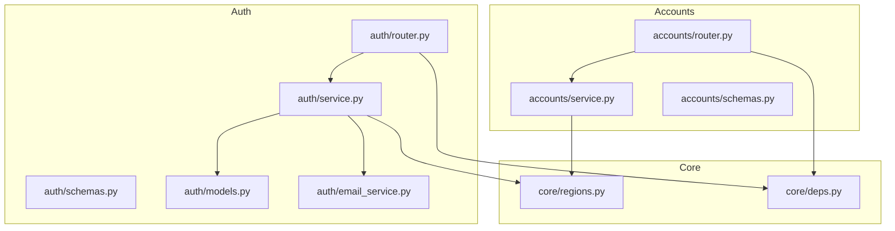

**Diagram sources**
- [router.py:1-366](file://auth/router.py#L1-L366)
- [service.py:1-506](file://auth/service.py#L1-L506)
- [models.py:1-66](file://auth/models.py#L1-L66)
- [schemas.py:1-80](file://auth/schemas.py#L1-L80)
- [email_service.py:1-151](file://auth/email_service.py#L1-L151)
- [router.py:1-25](file://accounts/router.py#L1-L25)
- [service.py:1-108](file://accounts/service.py#L1-L108)
- [schemas.py:1-6](file://accounts/schemas.py#L1-L6)
- [deps.py:1-51](file://core/deps.py#L1-L51)
- [regions.py:1-230](file://core/regions.py#L1-L230)

**Section sources**
- [router.py:1-366](file://auth/router.py#L1-L366)
- [service.py:1-506](file://auth/service.py#L1-L506)
- [router.py:1-25](file://accounts/router.py#L1-L25)
- [service.py:1-108](file://accounts/service.py#L1-L108)

## Core Components
- Auth Router: HTTP endpoints for signup, login, email verification, password reset/change, profile updates, token refresh, logout, and sync status.
- Auth Service: Business logic for authentication, session management, email verification, password resets, profile updates, and token validation.
- Accounts Router/Service: Secure account deletion endpoint implementing GDPR Art. 17 erasure across all user-scoped collections.
- Schemas: Pydantic models enforcing input validation for requests and responses.
- Email Service: Sends verification, password reset, and password change confirmation emails via a region-checked endpoint.
- Dependencies: Current-user resolution from bearer tokens and database access.
- Regions: Data residency enforcement ensuring all external service endpoints are declared and restricted to Australian regions.

**Section sources**
- [router.py:1-366](file://auth/router.py#L1-L366)
- [service.py:1-506](file://auth/service.py#L1-L506)
- [schemas.py:1-80](file://auth/schemas.py#L1-L80)
- [email_service.py:1-151](file://auth/email_service.py#L1-L151)
- [deps.py:1-51](file://core/deps.py#L1-L51)
- [regions.py:1-230](file://core/regions.py#L1-L230)
- [router.py:1-25](file://accounts/router.py#L1-L25)
- [service.py:1-108](file://accounts/service.py#L1-L108)

## Architecture Overview
The system uses FastAPI routers to expose REST endpoints. Requests are validated by Pydantic schemas, then routed to services that interact with MongoDB. Authentication is enforced via JWT access tokens bound to server-side sessions; refresh tokens are stored hashed. Email notifications are sent through a region-checked Resend endpoint. Account deletion triggers a comprehensive data wipe across user-scoped collections and object storage.

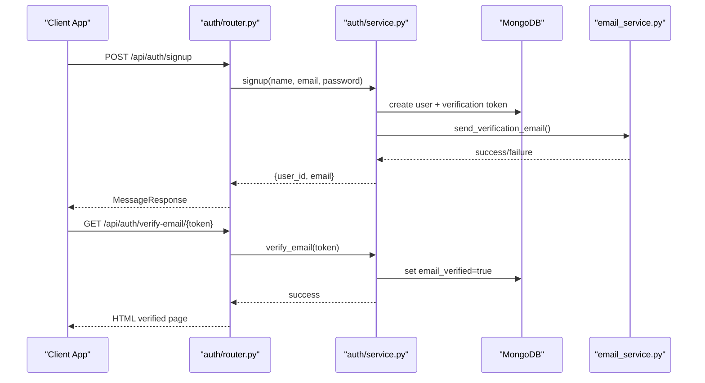

**Diagram sources**
- [router.py:93-140](file://auth/router.py#L93-L140)
- [service.py:107-149](file://auth/service.py#L107-L149)
- [email_service.py:66-92](file://auth/email_service.py#L66-L92)
- [router.py:142-220](file://auth/router.py#L142-L220)

## Detailed Component Analysis

### User Data Model and Field Validations
- User document fields include id, email, name, enc_version, password hash, email_verified flag, verification/reset tokens with expirations, failed login attempts, lockout state, news preferences, and timestamps.
- Request validation:
  - Signup requires name, valid email, password and confirm_password; passwords must match and be at least 8 characters.
  - Login accepts device_name and platform with defaults.
  - Password reset/change require new_password and confirm_password matching and minimum length.
  - Profile updates accept name with optional enc_version and news preferences including country, outlet_ids, and toggles.
- Response shapes include user info, tokens, messages, and sync status.

```mermaid
classDiagram
class UserDocument {
+string id
+string email
+string name
+int? enc_version
+string password
+bool email_verified
+string? verification_token
+datetime? verification_token_expiry
+string? reset_token
+datetime? reset_token_expiry
+int failed_login_attempts
+datetime? locked_until
+string? news_country
+string[] news_outlet_ids
+bool daily_brew_show_verse
+bool daily_brew_show_quote
+datetime created_at
+datetime updated_at
}
class DeviceDocument {
+string id
+string user_id
+string device_name
+string platform
+string? fcm_token
+datetime last_active_at
+datetime registered_at
}
class SessionDocument {
+string id
+string user_id
+string device_id
+string refresh_token_hash
+datetime expires_at
+datetime created_at
}
UserDocument ||--o{ DeviceDocument : "has many"
UserDocument ||--o{ SessionDocument : "has many"
```

**Diagram sources**
- [models.py:6-32](file://auth/models.py#L6-L32)
- [models.py:34-49](file://auth/models.py#L34-L49)
- [models.py:51-65](file://auth/models.py#L51-L65)

**Section sources**
- [models.py:1-66](file://auth/models.py#L1-L66)
- [schemas.py:1-80](file://auth/schemas.py#L1-L80)

### Account Creation Workflow
- Endpoint: POST /api/auth/signup
- Validation: email uniqueness, password match and length, rate limiting per IP.
- Logic: create user doc with bcrypt-hashed password, generate verification token and expiry, insert into users collection, send verification email.
- Responses: success message instructing to verify email; error if existing unverified or verified account.

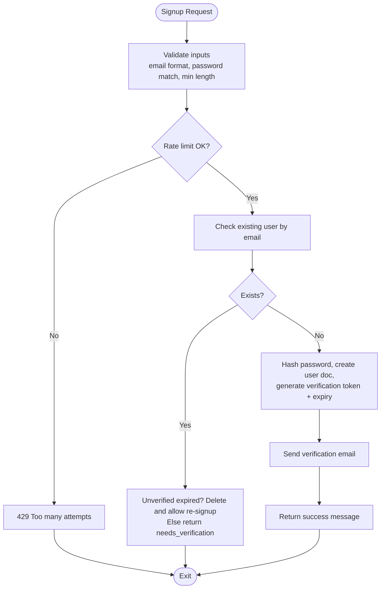

**Diagram sources**
- [router.py:93-113](file://auth/router.py#L93-L113)
- [service.py:107-149](file://auth/service.py#L107-L149)
- [email_service.py:66-92](file://auth/email_service.py#L66-L92)

**Section sources**
- [router.py:93-113](file://auth/router.py#L93-L113)
- [service.py:107-149](file://auth/service.py#L107-L149)

### Login and Session Management
- Endpoint: POST /api/auth/login
- Validation: email/password, device metadata, rate limiting per email and IP.
- Logic: lookup user, check lockout, verify password, enforce email verification, reset failed attempts on success, create device and session, issue JWT access token bound to session, return refresh token.
- Token refresh: POST /api/auth/refresh validates session, issues new access token, updates device last active.
- Logout: DELETE session by refresh token hash.

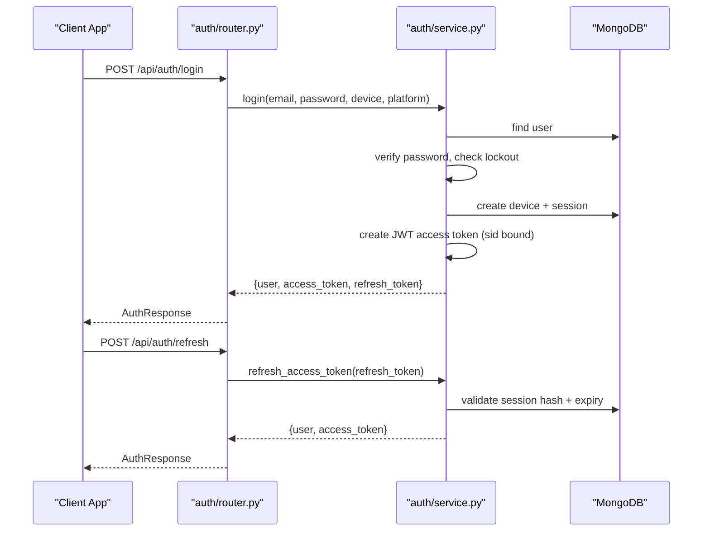

**Diagram sources**
- [router.py:115-140](file://auth/router.py#L115-L140)
- [service.py:202-273](file://auth/service.py#L202-L273)
- [service.py:424-451](file://auth/service.py#L424-L451)

**Section sources**
- [router.py:115-140](file://auth/router.py#L115-L140)
- [service.py:202-273](file://auth/service.py#L202-L273)
- [service.py:424-451](file://auth/service.py#L424-L451)

### Email Verification Process
- Endpoint: GET /api/auth/verify-email/{token}
- Behavior: idempotent verification; visiting link multiple times succeeds; scanner prefetches do not invalidate token; checks expiry only when not already verified; sets email_verified=true.
- Response: HTML page indicating success or failure with deep link hint.

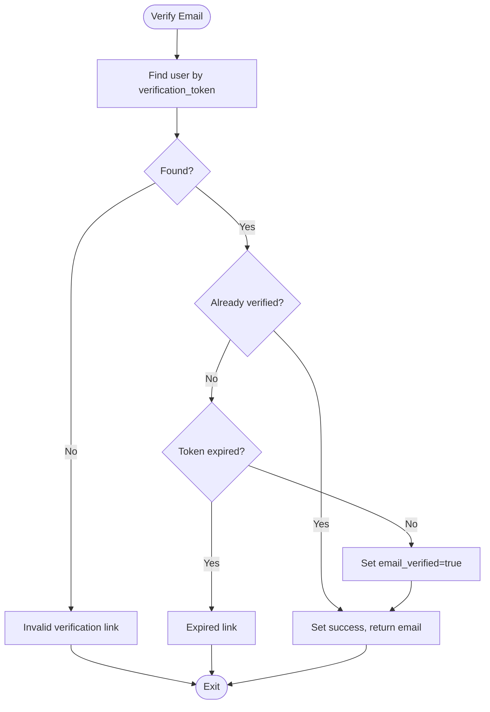

**Diagram sources**
- [router.py:142-220](file://auth/router.py#L142-L220)
- [service.py:275-310](file://auth/service.py#L275-L310)

**Section sources**
- [router.py:142-220](file://auth/router.py#L142-L220)
- [service.py:275-310](file://auth/service.py#L275-L310)

### Password Reset Flow
- Request: POST /api/auth/forgot-password
- Behavior: generates reset token with short expiry, stores hashed token and expiry, sends reset email; always returns success to avoid revealing existence.
- Reset: POST /api/auth/reset-password
- Behavior: validates token and expiry, hashes new password, updates user, deletes all sessions to force re-login, clears reset tokens.

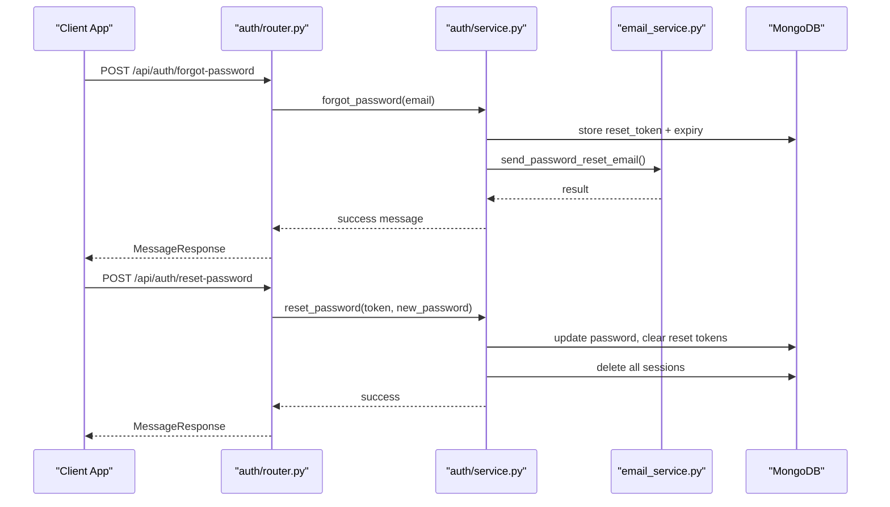

**Diagram sources**
- [router.py:222-249](file://auth/router.py#L222-L249)
- [service.py:312-361](file://auth/service.py#L312-L361)
- [email_service.py:94-122](file://auth/email_service.py#L94-L122)

**Section sources**
- [router.py:222-249](file://auth/router.py#L222-L249)
- [service.py:312-361](file://auth/service.py#L312-L361)
- [email_service.py:94-122](file://auth/email_service.py#L94-L122)

### Password Change for Authenticated Users
- Endpoint: POST /api/auth/change-password
- Validation: current_password required, new_password matches confirm_password and meets length requirement.
- Logic: verify current password, hash new password, update user, send confirmation email.

**Section sources**
- [router.py:276-299](file://auth/router.py#L276-L299)
- [service.py:363-385](file://auth/service.py#L363-L385)
- [email_service.py:125-151](file://auth/email_service.py#L125-L151)

### Profile Updates
- Update Name: PUT /api/auth/me
- Validates and updates display name and enc_version; used during E2EE key bootstrap to push client-encrypted name once DEK available.
- News Preferences: PUT /api/auth/me/news-preferences
- Updates country, outlet_ids, and opt-in toggles for Daily Brew content.

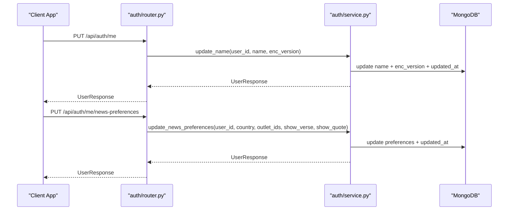

**Diagram sources**
- [router.py:328-356](file://auth/router.py#L328-L356)
- [service.py:387-422](file://auth/service.py#L387-L422)

**Section sources**
- [router.py:328-356](file://auth/router.py#L328-L356)
- [service.py:387-422](file://auth/service.py#L387-L422)

### Account Deletion (GDPR Art. 17 Erasure)
- Endpoint: POST /api/account/delete
- Requires authenticated user and password confirmation.
- Logic: verify password against fresh hash, delete attachments, erase push receipts, delete all user-scoped collections, delete user document.

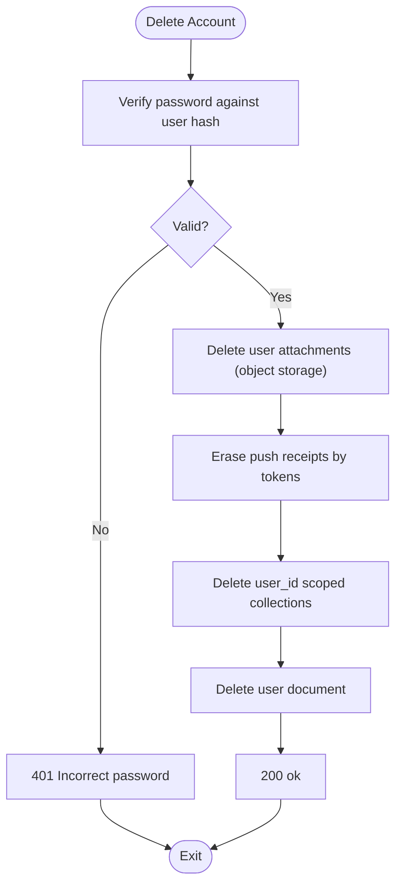

**Diagram sources**
- [router.py:11-24](file://accounts/router.py#L11-L24)
- [service.py:60-88](file://accounts/service.py#L60-L88)

**Section sources**
- [router.py:11-24](file://accounts/router.py#L11-L24)
- [service.py:60-88](file://accounts/service.py#L60-L88)

### User Privacy Features and Data Residency Enforcement
- Privacy policy outlines rights to export and delete data, control analytics and calendar sync, correct name, and contact/support channels.
- Data residency: All external service endpoints and regions are validated at startup; non-Australian regions abort boot. Email sending uses a region-checked Resend endpoint.

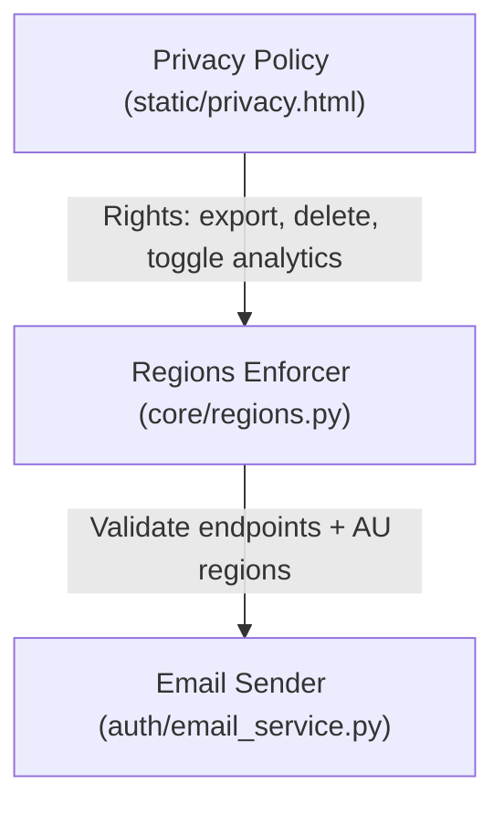

**Diagram sources**
- [privacy.html:518-529](file://static/privacy.html#L518-L529)
- [regions.py:144-165](file://core/regions.py#L144-L165)
- [email_service.py:26-64](file://auth/email_service.py#L26-L64)

**Section sources**
- [privacy.html:518-529](file://static/privacy.html#L518-L529)
- [regions.py:144-165](file://core/regions.py#L144-L165)
- [email_service.py:26-64](file://auth/email_service.py#L26-L64)

### Relationship Between User Accounts and Other Entities
- Notes: Scoped by user_id; list/get enforce user scope; supports linked events and attachments.
- Events: Scoped by user_id; supports trip linkage and reminders; indexed for efficient queries.
- Trips: Scoped by user_id; payload size validation enforced.
- Feedback: Scoped by user_id; included in erasure contract.
- Devices/Sessions/Push Tokens: Track device identity and sessions; push receipts tied to tokens; erased on account deletion.

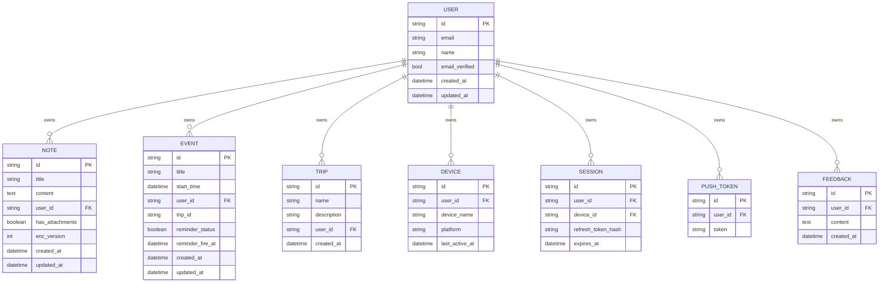

**Diagram sources**
- [models.py:6-32](file://auth/models.py#L6-L32)
- [notes/service.py:113-154](file://notes/service.py#L113-L154)
- [events/service.py:201-265](file://events/service.py#L201-L265)
- [trips/service.py:39-63](file://trips/service.py#L39-L63)
- [accounts/service.py:24-45](file://accounts/service.py#L24-L45)

**Section sources**
- [notes/service.py:113-154](file://notes/service.py#L113-L154)
- [events/service.py:201-265](file://events/service.py#L201-L265)
- [trips/service.py:39-63](file://trips/service.py#L39-L63)
- [accounts/service.py:24-45](file://accounts/service.py#L24-L45)

## Dependency Analysis
- Authentication dependency chain:
  - get_current_user resolves bearer token to user via AuthService.verify_access_token, which checks JWT signature, type, session binding, and session validity.
  - Services depend on Motor async database access via get_db.
- External dependencies:
  - Email service depends on region-checked Resend endpoint; failures logged but do not block core flows.
  - Data residency enforced at startup via regions.validate_all; any misconfiguration aborts boot.

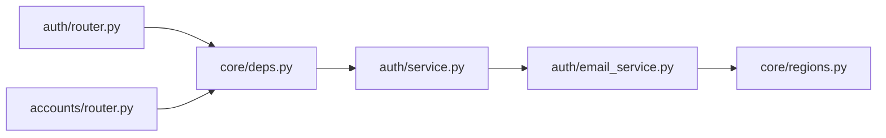

**Diagram sources**
- [deps.py:15-51](file://core/deps.py#L15-L51)
- [service.py:469-494](file://auth/service.py#L469-L494)
- [email_service.py:26-64](file://auth/email_service.py#L26-L64)
- [regions.py:144-165](file://core/regions.py#L144-L165)

**Section sources**
- [deps.py:15-51](file://core/deps.py#L15-L51)
- [service.py:469-494](file://auth/service.py#L469-L494)
- [email_service.py:26-64](file://auth/email_service.py#L26-L64)
- [regions.py:144-165](file://core/regions.py#L144-L165)

## Performance Considerations
- CPU-bound operations (bcrypt hashing/verification) are offloaded to threads to avoid blocking the single uvicorn worker event loop.
- Email sending uses async HTTP with explicit timeouts to prevent indefinite hangs.
- Account deletion performs expensive operations (attachment deletion, push receipt cleanup) asynchronously via threads to minimize request latency.
- Database queries use indexes for efficient paging and filtering (e.g., notes and events lists).

[No sources needed since this section provides general guidance]

## Troubleshooting Guide
- Common errors:
  - Invalid/expired verification or reset links: ensure tokens exist and are within expiry windows; resend verification or request new reset.
  - Account locked due to too many failed attempts: wait for lockout duration or reset via support.
  - Token invalid/expired: refresh access token using valid refresh token; logout and re-login if session revoked.
  - Email delivery failures: check Resend configuration and region settings; logs indicate failures without blocking core flows.
- Debugging tips:
  - Inspect rate limiter behavior for signup/login/reset endpoints.
  - Verify region configuration at startup; any missing/malformed variables abort boot.
  - Confirm user-scoped deletions cover all collections listed in erasure contract.

**Section sources**
- [router.py:23-84](file://auth/router.py#L23-L84)
- [service.py:216-233](file://auth/service.py#L216-L233)
- [service.py:424-451](file://auth/service.py#L424-L451)
- [email_service.py:26-64](file://auth/email_service.py#L26-L64)
- [regions.py:144-165](file://core/regions.py#L144-L165)

## Conclusion
Nueco’s backend implements robust user management with strong security, privacy, and compliance controls. Authentication leverages JWT sessions bound to server-side records, while profile updates and preferences are supported via dedicated endpoints. Email verification and password reset flows are secure and resilient to automated scanning. Account deletion comprehensively erases user data across all relevant collections and storage. Data residency enforcement ensures all external services operate within approved Australian regions, aligning with privacy regulations.

[No sources needed since this section summarizes without analyzing specific files]

## Appendices

### API Reference Summary
- Signup: POST /api/auth/signup
- Login: POST /api/auth/login
- Verify Email: GET /api/auth/verify-email/{token}
- Forgot Password: POST /api/auth/forgot-password
- Reset Password: POST /api/auth/reset-password
- Change Password: POST /api/auth/change-password
- Refresh Token: POST /api/auth/refresh
- Logout: POST /api/auth/logout
- Get Me: GET /api/auth/me
- Update Name: PUT /api/auth/me
- Update News Preferences: PUT /api/auth/me/news-preferences
- Sync Status: GET /api/auth/sync-status
- Delete Account: POST /api/account/delete

**Section sources**
- [router.py:93-366](file://auth/router.py#L93-L366)
- [router.py:11-24](file://accounts/router.py#L11-L24)