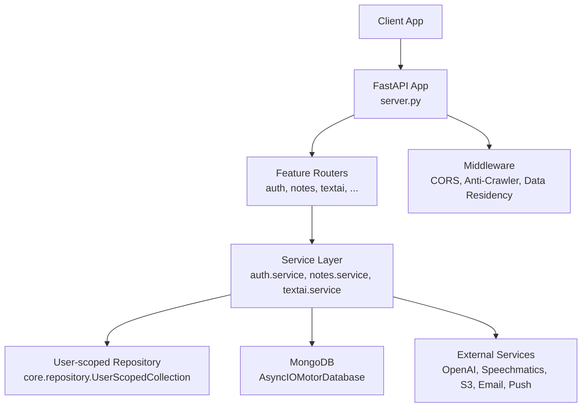
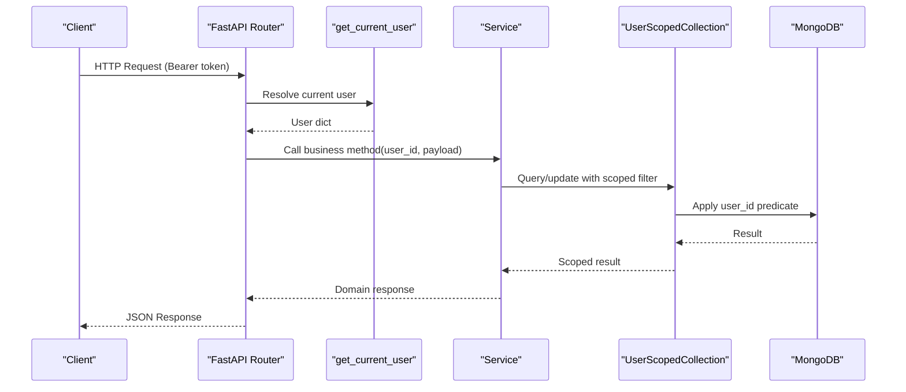
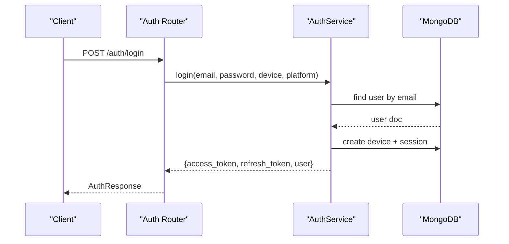
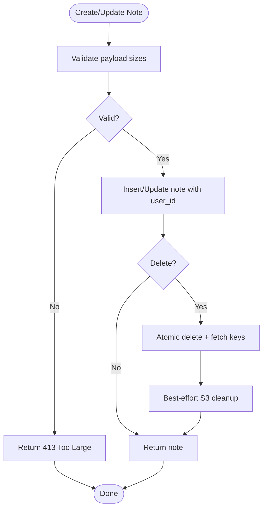
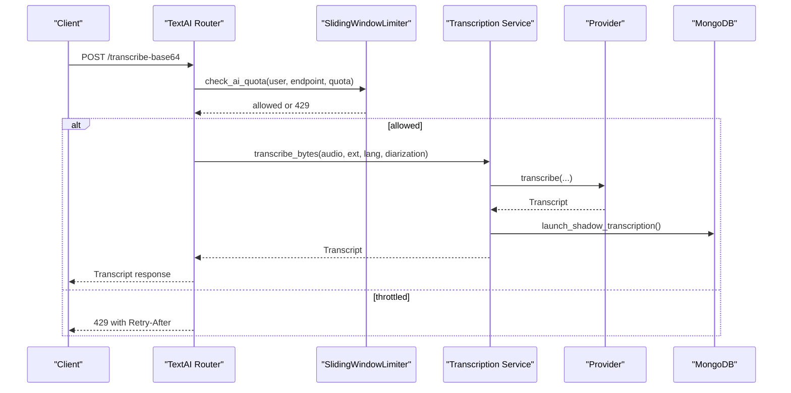
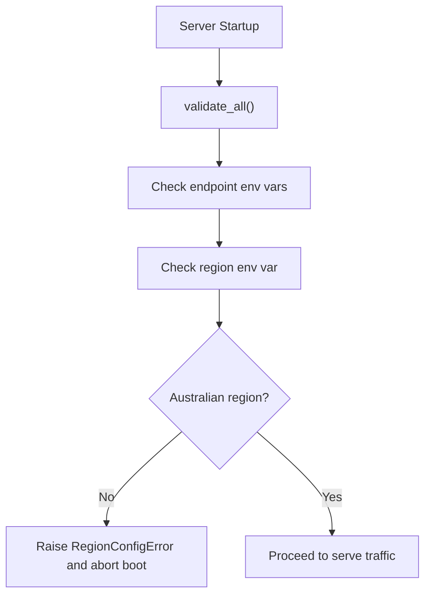
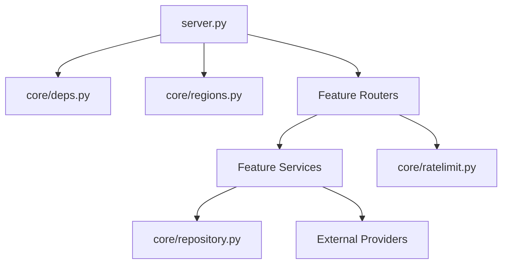

# Core Architecture

<cite>
**Referenced Files in This Document**
- [server.py](file://server.py)
- [core/deps.py](file://core/deps.py)
- [core/repository.py](file://core/repository.py)
- [core/ratelimit.py](file://core/ratelimit.py)
- [core/regions.py](file://core/regions.py)
- [auth/router.py](file://auth/router.py)
- [auth/service.py](file://auth/service.py)
- [notes/router.py](file://notes/router.py)
- [notes/service.py](file://notes/service.py)
- [textai/router.py](file://textai/router.py)
- [textai/service.py](file://textai/service.py)
- [security/ssrf_guard.py](file://security/ssrf_guard.py)
</cite>

## Table of Contents
1. [Introduction](#introduction)
2. [Project Structure](#project-structure)
3. [Core Components](#core-components)
4. [Architecture Overview](#architecture-overview)
5. [Detailed Component Analysis](#detailed-component-analysis)
6. [Dependency Analysis](#dependency-analysis)
7. [Performance Considerations](#performance-considerations)
8. [Troubleshooting Guide](#troubleshooting-guide)
9. [Conclusion](#conclusion)

## Introduction
This document describes the Nueco Backend core system architecture with a focus on:
- High-level FastAPI application structure and router composition
- Dependency injection for authentication and database access
- Middleware pipeline including CORS, anti-crawler, and data residency enforcement
- Component interactions between routers, services, and repositories
- Technical decisions around async/await with Motor, MongoDB connection management, and request/response transformation
- Infrastructure requirements, scalability considerations via indexing strategies, and deployment topology
- Cross-cutting concerns such as security middleware, CORS configuration, and data residency enforcement

## Project Structure
The backend is organized by feature modules (auth, notes, events, trips, reminders, accounts, feedback, canva, dailybrew, textai, attachments), each exposing a FastAPI router and a service layer that encapsulates business logic. The application entrypoint wires routers, configures middleware, initializes the MongoDB client, enforces data residency at startup, creates indexes, and starts background tasks.

**Diagram sources**
- [server.py:1-465](file://server.py#L1-L465)
- [core/repository.py:27-95](file://core/repository.py#L27-L95)

**Section sources**
- [server.py:1-465](file://server.py#L1-L465)

## Core Components
- Application bootstrap and routing:
  - Creates a single AsyncIOMotorClient and database handle
  - Mounts an APIRouter under /api and includes all feature routers
  - Adds CORS middleware and an HTTP middleware to block AI crawlers and tag responses
  - Enforces data residency validation at startup
  - Creates indexes across collections for performance
  - Starts background tasks (cache prewarmer, flag refresher, job sweeper)
  - Gracefully closes the MongoDB client on shutdown

- Dependency injection:
  - get_db provides the shared AsyncIOMotorDatabase instance
  - get_current_user resolves the authenticated user from Authorization header using AuthService.verify_access_token and returns the user document

- User-scoped repository:
  - UserScopedCollection wraps a Motor collection and injects user_id into every query/filter and stamps it on inserts
  - Prevents cross-account data leaks by construction

- Rate limiting:
  - SlidingWindowLimiter implements per-user and global quotas for AI endpoints
  - Returns Retry-After guidance when throttled

- Data residency:
  - Centralized registry of external service endpoints and region declarations
  - Validates environment variables at boot and re-validates on each endpoint accessor
  - Enforces Australian-region allowlist for all outbound services

**Section sources**
- [server.py:16-214](file://server.py#L16-L214)
- [server.py:310-330](file://server.py#L310-L330)
- [server.py:338-465](file://server.py#L338-L465)
- [core/deps.py:15-51](file://core/deps.py#L15-L51)
- [core/repository.py:27-95](file://core/repository.py#L27-L95)
- [core/ratelimit.py:41-124](file://core/ratelimit.py#L41-L124)
- [core/regions.py:144-230](file://core/regions.py#L144-L230)

## Architecture Overview
The system follows a layered architecture:
- Presentation: FastAPI routers define REST endpoints and translate requests/responses
- Business: Service modules implement domain logic, payload validation, and orchestration
- Data Access: Motor-based persistence with user-scoped queries to enforce tenant isolation
- Cross-cutting: Middleware and startup hooks provide security, compliance, and operational concerns

**Diagram sources**
- [auth/router.py:93-140](file://auth/router.py#L93-L140)
- [core/deps.py:24-51](file://core/deps.py#L24-L51)
- [notes/router.py:17-40](file://notes/router.py#L17-L40)
- [notes/service.py:83-148](file://notes/service.py#L83-L148)
- [core/repository.py:27-95](file://core/repository.py#L27-L95)

## Detailed Component Analysis

### Authentication and Session Management
- Flow:
  - Login validates credentials, creates device/session records, issues JWT access tokens bound to session IDs, and returns refresh tokens
  - Access tokens are verified against sessions to support server-side revocation on logout or session expiry
  - Password hashing uses bcrypt offloaded to a thread to avoid blocking the event loop
  - Email verification and password reset flows include rate limiting and idempotent behaviors

**Diagram sources**
- [auth/router.py:115-140](file://auth/router.py#L115-L140)
- [auth/service.py:202-273](file://auth/service.py#L202-L273)

**Section sources**
- [auth/router.py:22-84](file://auth/router.py#L22-L84)
- [auth/router.py:93-140](file://auth/router.py#L93-L140)
- [auth/service.py:35-105](file://auth/service.py#L35-L105)
- [auth/service.py:202-273](file://auth/service.py#L202-L273)
- [auth/service.py:469-495](file://auth/service.py#L469-L495)

### Notes Domain
- Payload validation enforces size caps for title, content, images, and objects to protect memory and stay within MongoDB limits
- List operations use index-covered sorting with deterministic tiebreakers to avoid in-memory sorts
- Deletion atomically removes notes and triggers best-effort cleanup of associated storage keys
- User scoping is enforced through the repository seam

**Diagram sources**
- [notes/service.py:30-65](file://notes/service.py#L30-L65)
- [notes/service.py:83-111](file://notes/service.py#L83-L111)
- [notes/service.py:191-212](file://notes/service.py#L191-L212)

**Section sources**
- [notes/router.py:17-100](file://notes/router.py#L17-L100)
- [notes/service.py:79-226](file://notes/service.py#L79-L226)
- [core/repository.py:27-95](file://core/repository.py#L27-L95)

### Text AI and Transcription
- Endpoints:
  - Transcribe audio (base64 or file upload)
  - Process text (organize, summarize, smart format)
  - Classify voice intent (note vs. scheduling vs. itinerary)
- Quotas:
  - Per-user and global sliding-window rate limits protect shared provider quotas
  - Throttling returns Retry-After headers to guide client backoff
- Provider abstraction:
  - Transcription providers resolved dynamically; shadow transcription runs asynchronously for comparison
- Safety:
  - SSRF guard prevents fetching internal/private hosts and validates schemes and redirects

**Diagram sources**
- [textai/router.py:75-103](file://textai/router.py#L75-L103)
- [textai/router.py:136-148](file://textai/router.py#L136-L148)
- [textai/service.py:112-130](file://textai/service.py#L112-L130)
- [core/ratelimit.py:66-88](file://core/ratelimit.py#L66-L88)

**Section sources**
- [textai/router.py:28-163](file://textai/router.py#L28-L163)
- [textai/service.py:90-315](file://textai/service.py#L90-L315)
- [security/ssrf_guard.py:50-109](file://security/ssrf_guard.py#L50-L109)

### Data Residency Enforcement
- Startup hook calls validate_all() to ensure every external service endpoint and region declaration is present, well-formed, and Australian
- Typed accessors re-validate region and scheme on each call, preventing unchecked paths
- Fail-closed policy aborts boot if any requirement is not met

**Diagram sources**
- [server.py:338-341](file://server.py#L338-L341)
- [core/regions.py:144-165](file://core/regions.py#L144-L165)
- [core/regions.py:175-182](file://core/regions.py#L175-L182)

**Section sources**
- [core/regions.py:1-230](file://core/regions.py#L1-L230)

### Middleware Pipeline
- CORS:
  - Configured via environment variable ALLOWED_ORIGINS; defaults to allow all if empty
- Anti-crawler:
  - Blocks known AI crawler user agents and sets X-Robots-Tag headers
- Data residency:
  - First startup handler ensures compliance before serving requests

**Diagram sources**
- [server.py:310-330](file://server.py#L310-L330)

**Section sources**
- [server.py:310-330](file://server.py#L310-L330)

## Dependency Analysis
Key dependencies and relationships:
- server.py depends on:
  - core.deps for authentication and DB access
  - Feature routers (auth, notes, events, trips, reminders, accounts, feedback, canva, dailybrew, textai, attachments)
  - core.regions for data residency validation
  - Motor client for MongoDB
- Routers depend on:
  - core.deps.get_current_user and get_db
  - Feature services for business logic
- Services depend on:
  - core.repository.scoped for user-scoped queries
  - External clients (OpenAI, Speechmatics, S3, email, push) via region-configured endpoints
- Security:
  - SSRF guard used for safe outbound fetches

**Diagram sources**
- [server.py:175-214](file://server.py#L175-L214)
- [core/deps.py:15-51](file://core/deps.py#L15-L51)
- [core/repository.py:27-95](file://core/repository.py#L27-L95)
- [core/ratelimit.py:96-124](file://core/ratelimit.py#L96-L124)

**Section sources**
- [server.py:175-214](file://server.py#L175-L214)
- [core/deps.py:15-51](file://core/deps.py#L15-L51)
- [core/repository.py:27-95](file://core/repository.py#L27-L95)
- [core/ratelimit.py:96-124](file://core/ratelimit.py#L96-L124)

## Performance Considerations
- Indexing strategy:
  - Compound indexes for notes and events optimize list pagination and sorting, avoiding in-memory sorts
  - Partial indexes reduce scan size for pending reminders
  - Unique and sparse indexes enforce constraints efficiently
  - Stale indexes are dropped explicitly to prevent dead weight
- Asynchronous I/O:
  - All database operations are async via Motor
  - CPU-bound tasks (bcrypt hashing) are offloaded to threads to avoid blocking the event loop
- Quotas and backpressure:
  - Sliding-window rate limits protect shared provider quotas and return Retry-After to guide clients
- Storage cleanup:
  - Best-effort deletion of attachments and objects on note removal avoids orphaned storage

[No sources needed since this section provides general guidance]

## Troubleshooting Guide
Common issues and diagnostics:
- Authentication failures:
  - Missing or malformed Authorization header results in 401
  - Invalid/expired tokens or revoked sessions result in 401
- Data residency boot failure:
  - Missing or non-Australian region declarations raise RegionConfigError and abort boot
  - Logs include offending variables for quick remediation
- Rate limiting:
  - 429 responses include Retry-After headers; check logs for scope (user/global)
- Index creation warnings:
  - Startup may log warnings if indexes already exist; these are benign
- SSRF protection:
  - Fetches to private/internal IPs or invalid schemes raise specific errors; inspect URL and redirect chain

**Section sources**
- [core/deps.py:24-51](file://core/deps.py#L24-L51)
- [core/regions.py:144-165](file://core/regions.py#L144-L165)
- [core/ratelimit.py:66-88](file://core/ratelimit.py#L66-L88)
- [server.py:345-433](file://server.py#L345-L433)
- [security/ssrf_guard.py:50-109](file://security/ssrf_guard.py#L50-L109)

## Conclusion
The Nueco Backend employs a clean separation of concerns with FastAPI routers delegating to framework-agnostic services, which interact with a user-scoped repository to enforce tenant isolation. The application integrates robust cross-cutting mechanisms: dependency injection for auth and DB access, middleware for CORS and anti-crawler behavior, and strict data residency enforcement at startup and runtime. Scalability is addressed through careful indexing strategies, asynchronous I/O, and rate limiting to protect shared resources. Deployment relies on environment-driven configuration for external services and regions, ensuring compliance and operational safety.