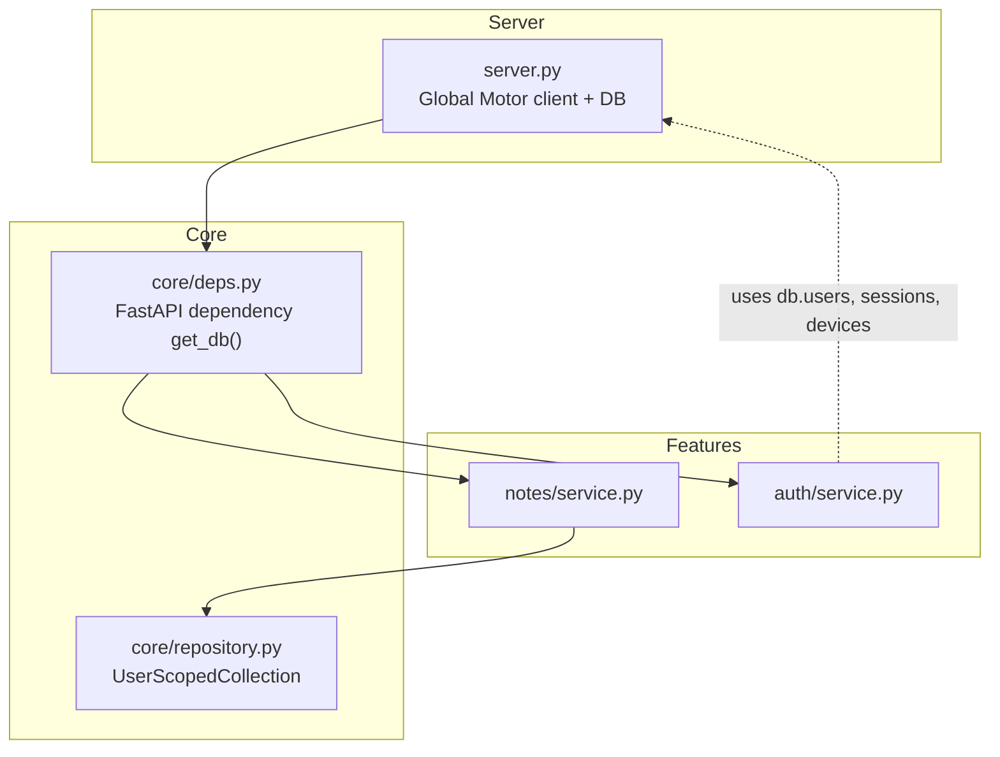
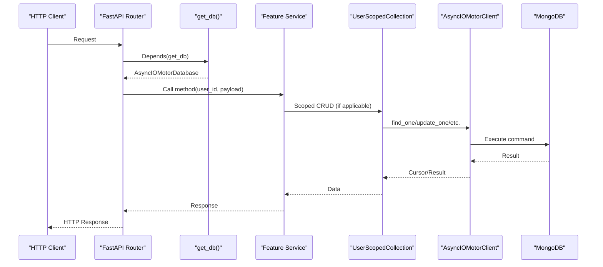
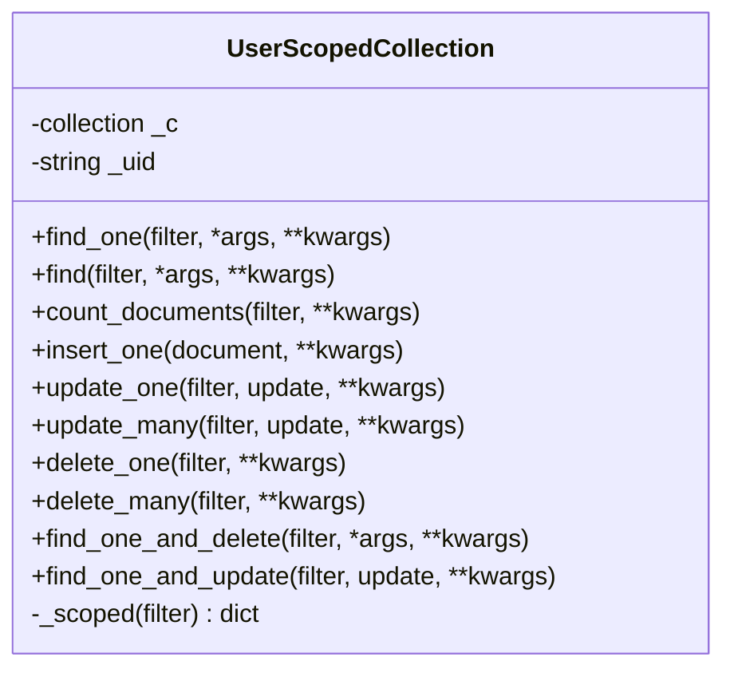
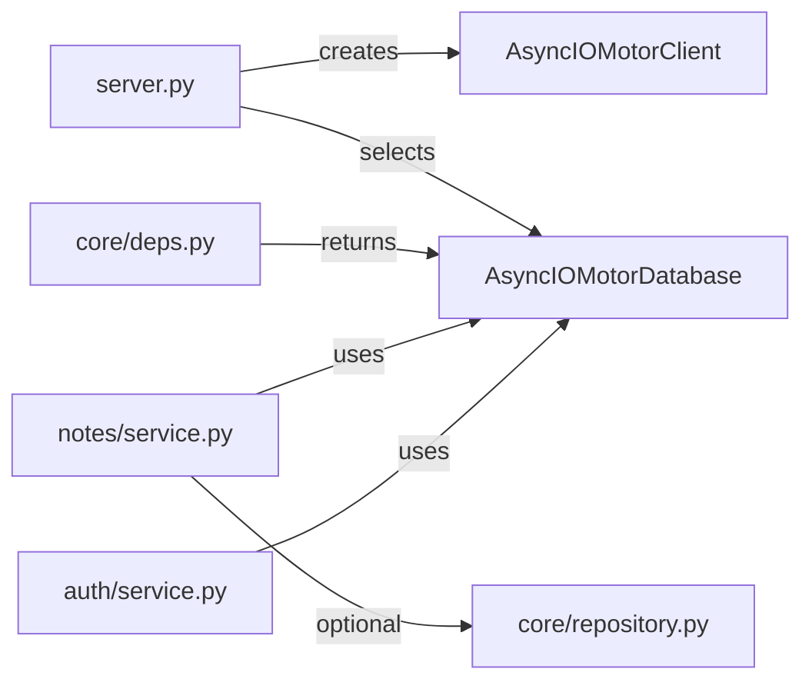

# Database Connection Management

<cite>
**Referenced Files in This Document**
- [server.py](file://server.py)
- [core/repository.py](file://core/repository.py)
- [core/deps.py](file://core/deps.py)
- [notes/service.py](file://notes/service.py)
- [auth/service.py](file://auth/service.py)
- [requirements.txt](file://requirements.txt)
</cite>

## Table of Contents
1. [Introduction](#introduction)
2. [Project Structure](#project-structure)
3. [Core Components](#core-components)
4. [Architecture Overview](#architecture-overview)
5. [Detailed Component Analysis](#detailed-component-analysis)
6. [Dependency Analysis](#dependency-analysis)
7. [Performance Considerations](#performance-considerations)
8. [Troubleshooting Guide](#troubleshooting-guide)
9. [Conclusion](#conclusion)

## Introduction
This document explains how the backend manages MongoDB connections using the Motor async driver and FastAPI’s async/await model. It covers global client initialization, database selection, collection access patterns, a user-scoped repository abstraction for safe multi-tenant queries, connection lifecycle (startup/shutdown), error handling strategies, query optimization via indexes, and guidance on monitoring and performance tuning. It also clarifies how Motor’s asynchronous nature integrates with FastAPI request handlers and services.

## Project Structure
The application is organized by feature modules (e.g., notes, auth, events) that depend on shared infrastructure:
- Global MongoDB client and database are created at module load time in the server entrypoint.
- Feature routers import their service modules; services receive an AsyncIOMotorDatabase via FastAPI dependency injection.
- A small repository seam enforces user scoping to prevent cross-account data leaks.

**Diagram sources**
- [server.py:1-20](file://server.py#L1-L20)
- [core/deps.py:15-21](file://core/deps.py#L15-L21)
- [core/repository.py:27-94](file://core/repository.py#L27-L94)
- [notes/service.py:79-148](file://notes/service.py#L79-L148)
- [auth/service.py:35-41](file://auth/service.py#L35-L41)

**Section sources**
- [server.py:1-20](file://server.py#L1-L20)
- [core/deps.py:15-21](file://core/deps.py#L15-L21)
- [core/repository.py:27-94](file://core/repository.py#L27-L94)

## Core Components
- Global Motor client and database:
  - The server initializes a single AsyncIOMotorClient and selects the database from environment variables. This instance is reused across requests.
- Dependency injection:
  - A FastAPI dependency returns the shared database instance to routers/services without circular imports.
- User-scoped repository:
  - A wrapper around a Motor collection that injects a tenant predicate into every operation, ensuring reads/writes are scoped to the current user.

Key responsibilities:
- server.py: Create and close the Motor client; create indexes at startup; graceful shutdown.
- core/deps.py: Provide the database handle to routes and services.
- core/repository.py: Enforce user scoping for all CRUD operations on user-owned collections.
- Feature services: Implement business logic using Motor cursors and atomic operations, leveraging indexes for performance.

**Section sources**
- [server.py:16-18](file://server.py#L16-L18)
- [server.py:345-432](file://server.py#L345-L432)
- [server.py:462-465](file://server.py#L462-L465)
- [core/deps.py:15-21](file://core/deps.py#L15-L21)
- [core/repository.py:27-94](file://core/repository.py#L27-L94)

## Architecture Overview
Motor provides an async-native interface to MongoDB. In this project:
- A single AsyncIOMotorClient is created once at process start.
- The selected database object is injected into services via FastAPI dependencies.
- Services perform async operations directly on collections or through the user-scoped wrapper.
- Startup events create indexes; shutdown closes the client.

**Diagram sources**
- [server.py:16-18](file://server.py#L16-L18)
- [core/deps.py:15-21](file://core/deps.py#L15-L21)
- [core/repository.py:55-89](file://core/repository.py#L55-L89)
- [notes/service.py:113-148](file://notes/service.py#L113-L148)

## Detailed Component Analysis

### Global Client Initialization and Lifecycle
- Client creation:
  - A single AsyncIOMotorClient is instantiated at module level using a URL from environment configuration.
  - The database is selected by name from environment configuration.
- Startup:
  - Indexes are created or ensured on startup to optimize queries and enforce uniqueness where needed.
- Shutdown:
  - On process shutdown, the client is closed to release resources.

Operational implications:
- Because the client is global, it benefits from connection pooling managed by Motor under the hood.
- Startup index creation ensures consistent schema evolution and query performance.
- Graceful shutdown avoids hanging connections.

**Section sources**
- [server.py:16-18](file://server.py#L16-L18)
- [server.py:345-432](file://server.py#L345-L432)
- [server.py:462-465](file://server.py#L462-L465)

### Database Selection and Collection Access Patterns
- Database selection:
  - The database is chosen by name from environment variables and stored in a module-level variable.
- Collection access:
  - Services receive the database via dependency injection and access collections like users, notes, sessions, etc.
  - Some features use direct collection access; others use the user-scoped wrapper to guarantee tenant isolation.

Examples in code:
- Notes service uses both direct collection calls and the scoped wrapper for list operations.
- Auth service binds to specific collections (users, devices, sessions) for authentication flows.

**Section sources**
- [server.py:16-18](file://server.py#L16-L18)
- [notes/service.py:79-148](file://notes/service.py#L79-L148)
- [auth/service.py:35-41](file://auth/service.py#L35-L41)

### Repository Pattern: User-Scoped Collection
The repository pattern here is a focused seam that wraps a Motor collection to:
- Inject a tenant predicate into every filter so queries cannot accidentally read another user’s data.
- Stamp ownership on inserts so documents always carry the correct user context.
- Expose a subset of common CRUD methods to keep usage explicit and auditable.

Design highlights:
- Wrapping rather than subclassing avoids fragile inheritance with Motor’s collection types.
- The tenant predicate is applied last, preventing callers from overriding it.
- Construction validates that a non-empty user ID is provided.

**Diagram sources**
- [core/repository.py:27-94](file://core/repository.py#L27-L94)

Usage example path:
- Notes list uses the scoped wrapper to ensure index-covered sorting and tenant isolation.

**Section sources**
- [core/repository.py:27-94](file://core/repository.py#L27-L94)
- [notes/service.py:113-148](file://notes/service.py#L113-L148)

### CRUD Operations and Query Optimization
- Create:
  - Services construct documents with required fields and timestamps, then insert them.
- Read:
  - Queries leverage indexes defined at startup to avoid in-memory sorts and to support efficient pagination.
  - Projections limit returned fields to reduce network overhead.
- Update:
  - Atomic updates set only changed fields; denormalized flags are kept in sync when necessary.
- Delete:
  - Atomic delete-and-return patterns retrieve related keys for cleanup in external storage.

Index strategy:
- Startup creates compound indexes tailored to actual query shapes and sort orders.
- Partial indexes restrict indexing to subsets (e.g., pending reminders) to keep indexes small and fast.
- Unique and sparse indexes enforce constraints efficiently.

Example paths:
- Notes list uses a compound index covering sort and paging tiebreakers.
- Events include partial indexes for reminder scheduling.
- Sessions use TTL indexes for automatic expiration.

**Section sources**
- [server.py:345-432](file://server.py#L345-L432)
- [notes/service.py:113-148](file://notes/service.py#L113-L148)
- [auth/service.py:202-273](file://auth/service.py#L202-L273)

### Transaction Handling
- No explicit transactions are used in the analyzed files.
- Where atomicity is important, the code prefers single-operation atomic primitives (e.g., find_one_and_delete) to minimize complexity and risk.

Recommendation:
- For multi-document writes that must succeed or fail together, consider wrapping operations in Motor transactions when appropriate.

[No sources needed since this section summarizes observed behavior]

### Error Handling Strategies
- Validation errors:
  - Payload size limits are enforced before writes to avoid hitting MongoDB document size limits and to return clear client errors.
- Not found:
  - Services raise domain-specific exceptions for missing resources; routers translate these to HTTP 404 responses.
- Authentication failures:
  - Missing or invalid tokens result in 401 responses.
- External service errors:
  - Best-effort cleanup (e.g., deleting attachments) does not fail the primary operation; errors are logged.

Patterns:
- Use domain exceptions in services and map them to HTTP status codes in routers.
- Log unexpected errors while preserving user-facing messages.

**Section sources**
- [notes/service.py:22-27](file://notes/service.py#L22-L27)
- [notes/service.py:191-212](file://notes/service.py#L191-L212)
- [auth/service.py:469-494](file://auth/service.py#L469-L494)

### Relationship Between Motor’s Async Nature and FastAPI
- Motor’s AsyncIOMotorClient and collections expose async methods compatible with FastAPI’s async route handlers.
- Services await Motor operations directly within async functions, keeping the event loop unblocked during I/O.
- CPU-bound work (e.g., password hashing) is offloaded to threads to avoid blocking the event loop.

Integration points:
- FastAPI dependency get_db() returns the shared database instance to be awaited in routes/services.
- All database interactions in services are async and integrated seamlessly with FastAPI’s concurrency model.

**Section sources**
- [core/deps.py:15-21](file://core/deps.py#L15-L21)
- [auth/service.py:50-61](file://auth/service.py#L50-L61)
- [notes/service.py:113-148](file://notes/service.py#L113-L148)

## Dependency Analysis
The following diagram shows how components depend on each other for database access:

**Diagram sources**
- [server.py:16-18](file://server.py#L16-L18)
- [core/deps.py:15-21](file://core/deps.py#L15-L21)
- [notes/service.py:79-148](file://notes/service.py#L79-L148)
- [auth/service.py:35-41](file://auth/service.py#L35-L41)
- [core/repository.py:27-94](file://core/repository.py#L27-L94)

**Section sources**
- [server.py:16-18](file://server.py#L16-L18)
- [core/deps.py:15-21](file://core/deps.py#L15-L21)
- [notes/service.py:79-148](file://notes/service.py#L79-L148)
- [auth/service.py:35-41](file://auth/service.py#L35-L41)
- [core/repository.py:27-94](file://core/repository.py#L27-L94)

## Performance Considerations
- Index-driven queries:
  - Compound indexes match exact query filters and sort orders to avoid in-memory sorts.
  - Partial indexes reduce index size for frequently queried subsets.
- Pagination:
  - Skip/limit with deterministic tiebreakers ensures stable pages and prevents duplicate/missing items.
- Projections:
  - Returning only needed fields reduces payload size and memory usage.
- Event loop safety:
  - CPU-bound tasks are run in threads to prevent blocking the async event loop.
- Connection reuse:
  - A single Motor client per process leverages built-in connection pooling.

[No sources needed since this section provides general guidance based on observed patterns]

## Troubleshooting Guide
Common issues and remedies:
- Authentication failures:
  - Ensure MONGO_URL and DB_NAME are correctly configured and reachable.
- Slow queries:
  - Verify indexes exist and match query/filter/sort patterns. Check for missing compound or partial indexes.
- Blocking event loop:
  - Move CPU-bound operations to threads (as done for password hashing).
- Resource leaks:
  - Confirm the shutdown handler closes the Motor client.
- Cross-account data leaks:
  - Always use the user-scoped wrapper for user-owned collections to enforce tenant predicates.

Monitoring and diagnostics:
- Enable logging at INFO level to capture startup/index creation and warnings.
- Use MongoDB profiling or Atlas insights to identify slow queries and missing indexes.
- Monitor connection metrics in your hosting environment to detect pool saturation.

**Section sources**
- [server.py:23-27](file://server.py#L23-L27)
- [server.py:345-432](file://server.py#L345-L432)
- [server.py:462-465](file://server.py#L462-L465)
- [core/repository.py:27-52](file://core/repository.py#L27-L52)

## Conclusion
This backend uses a simple, robust pattern for MongoDB connectivity:
- A single Motor client initialized at startup, with a shared database handle injected into services.
- A focused repository seam that guarantees user scoping for all user-owned data operations.
- Startup-time index management to ensure optimal query performance.
- Graceful shutdown to release connections.
- Clear separation between validation, business logic, and persistence, with well-defined error handling.

For further hardening:
- Add structured telemetry/metrics around database operations.
- Introduce transactions for multi-document writes requiring atomicity.
- Centralize connection options (pool size, timeouts) if custom tuning is needed.