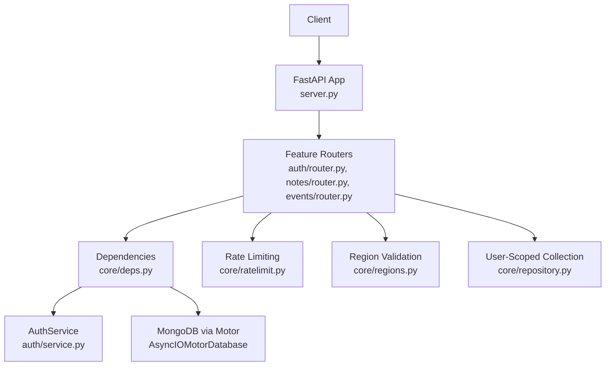
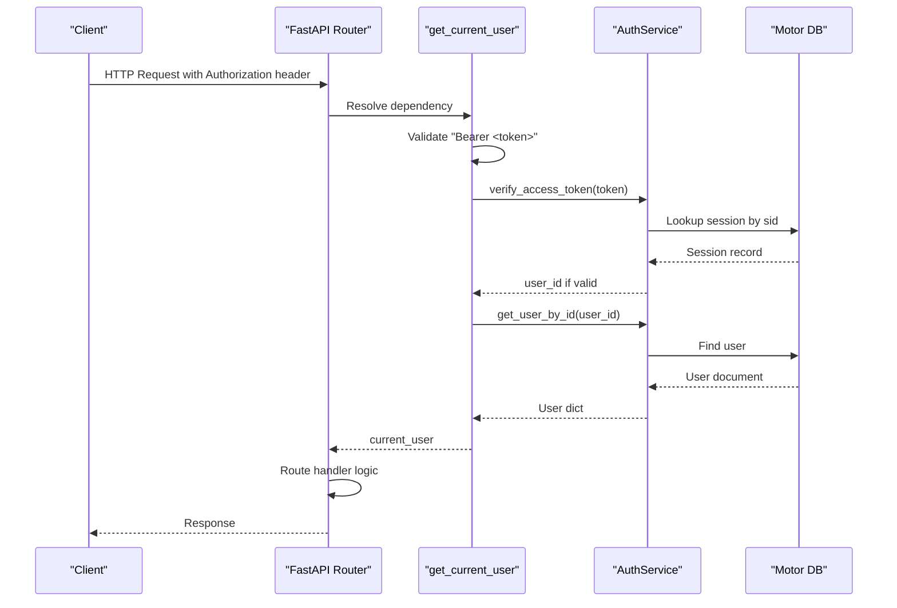
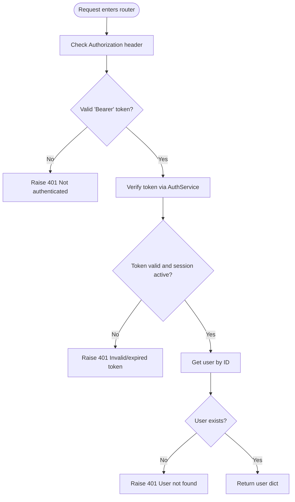
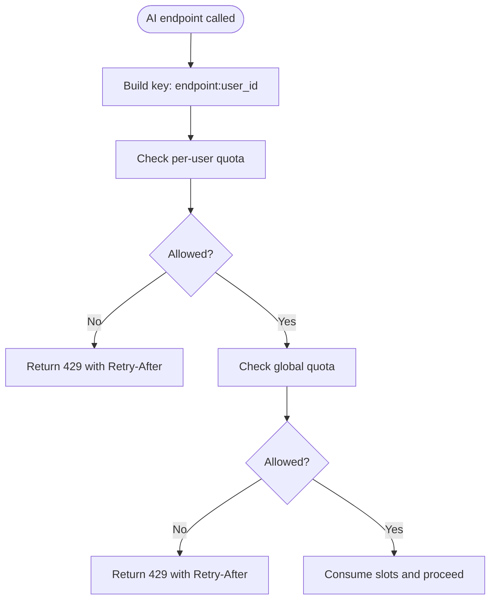
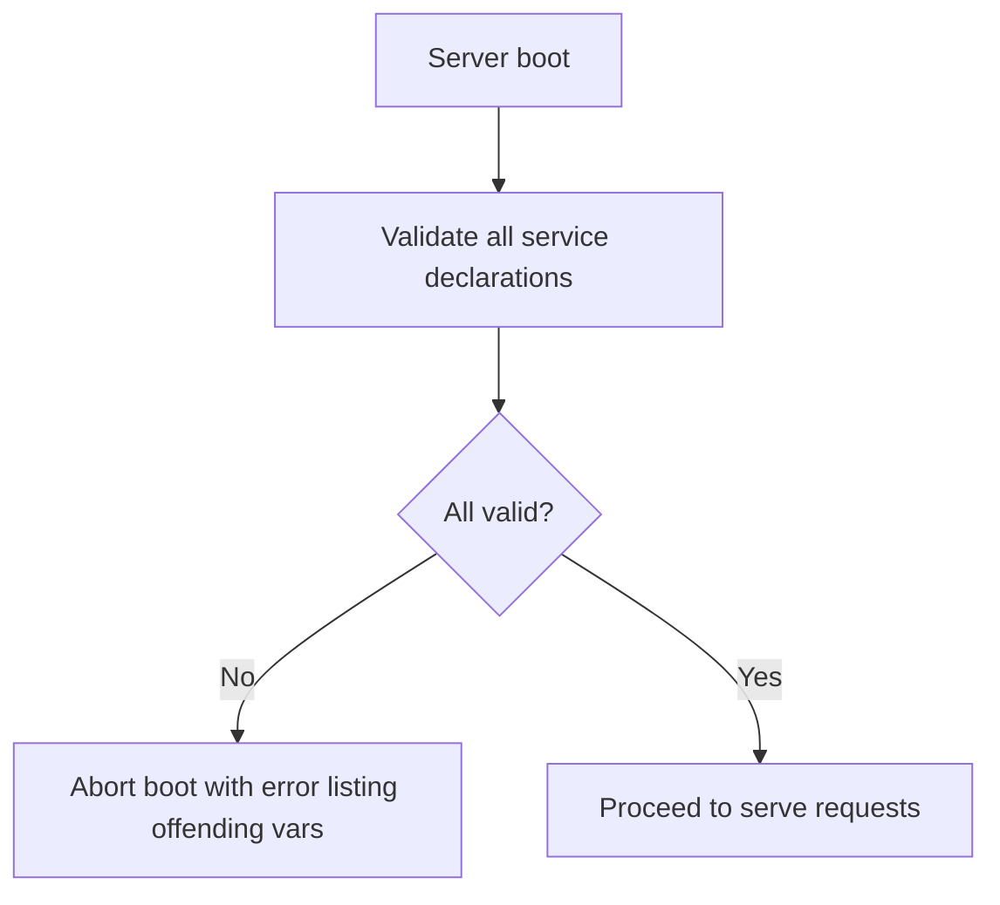
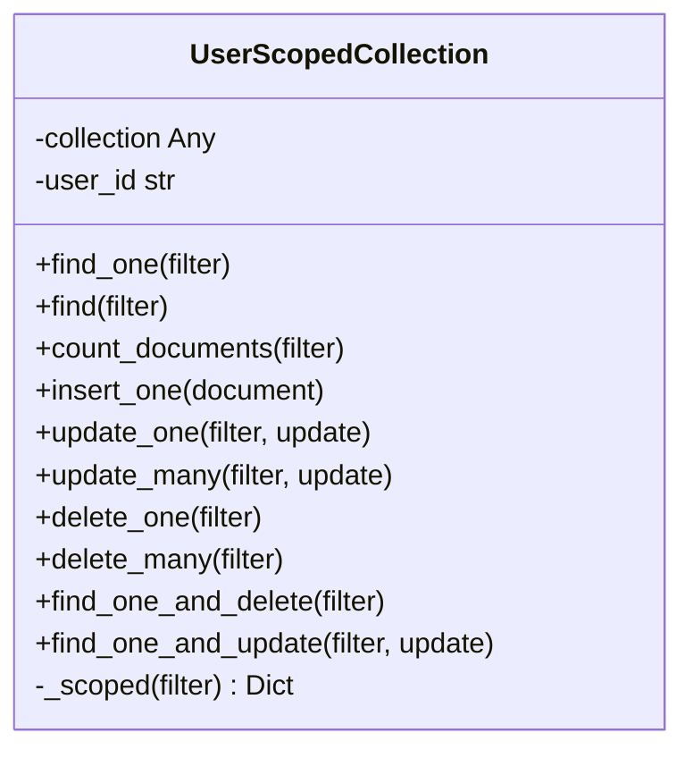
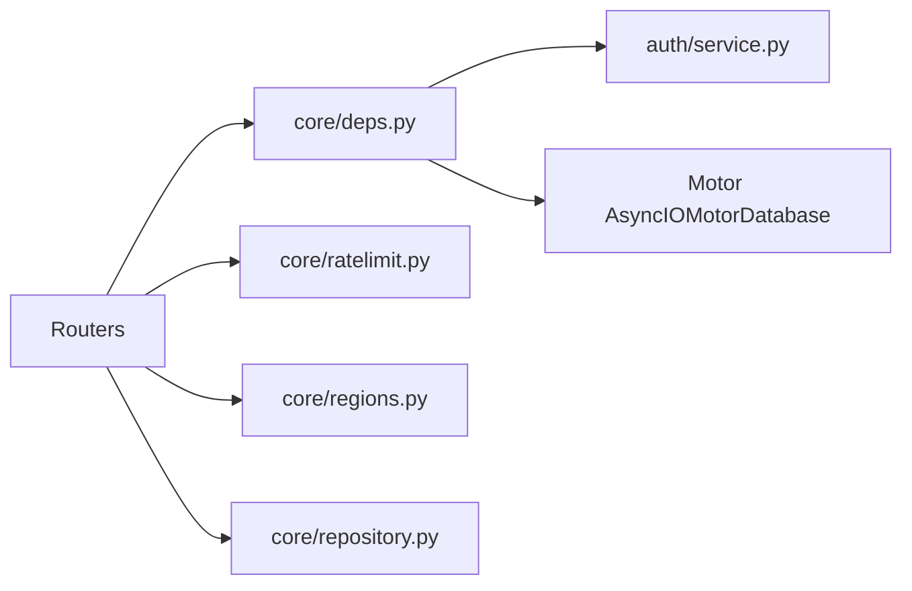

# Dependency Injection System

<cite>
**Referenced Files in This Document**
- [core/deps.py](file://core/deps.py)
- [server.py](file://server.py)
- [auth/router.py](file://auth/router.py)
- [auth/service.py](file://auth/service.py)
- [notes/router.py](file://notes/router.py)
- [events/router.py](file://events/router.py)
- [core/ratelimit.py](file://core/ratelimit.py)
- [core/regions.py](file://core/regions.py)
- [core/repository.py](file://core/repository.py)
</cite>

## Table of Contents
1. [Introduction](#introduction)
2. [Project Structure](#project-structure)
3. [Core Components](#core-components)
4. [Architecture Overview](#architecture-overview)
5. [Detailed Component Analysis](#detailed-component-analysis)
6. [Dependency Analysis](#dependency-analysis)
7. [Performance Considerations](#performance-considerations)
8. [Troubleshooting Guide](#troubleshooting-guide)
9. [Conclusion](#conclusion)
10. [Appendices](#appendices)

## Introduction
This document explains the dependency injection (DI) system centered on core/deps.py and how it powers authentication, database access, request lifecycle concerns, and cross-cutting features across the application. It focuses on:
- The get_current_user dependency that extracts user context from JWT tokens, validates authentication state, and provides user information to protected endpoints.
- MongoDB client management using Motor async driver, including connection pooling and lifecycle handling.
- Request lifecycle dependencies, parameter validation patterns, and composition across routers.
- Examples for creating custom dependencies for rate limiting, region validation, and audit logging.
- Best practices for composing dependencies and testing strategies for injected dependencies.

## Project Structure
The DI system is implemented as FastAPI dependencies that are composed into route handlers across feature routers. Key elements:
- core/deps.py defines shared dependencies: get_db and get_current_user.
- server.py initializes the FastAPI app, creates the Motor client and database instance, includes routers, and handles startup/shutdown events.
- Feature routers (auth, notes, events, etc.) import and compose these dependencies to enforce authentication and obtain a database handle.
- Cross-cutting modules like core/ratelimit.py and core/regions.py provide reusable logic used by routers or services.
- core/repository.py provides a user-scoped collection wrapper to enforce tenant isolation at query time.

**Diagram sources**
- [server.py:1-465](file://server.py#L1-L465)
- [core/deps.py:1-51](file://core/deps.py#L1-L51)
- [auth/router.py:1-366](file://auth/router.py#L1-L366)
- [notes/router.py:1-100](file://notes/router.py#L1-L100)
- [events/router.py:1-111](file://events/router.py#L1-L111)
- [core/ratelimit.py:1-124](file://core/ratelimit.py#L1-L124)
- [core/regions.py:1-230](file://core/regions.py#L1-L230)
- [core/repository.py:1-95](file://core/repository.py#L1-L95)

**Section sources**
- [server.py:1-465](file://server.py#L1-L465)
- [core/deps.py:1-51](file://core/deps.py#L1-L51)

## Core Components
- get_db(): Provides an AsyncIOMotorDatabase instance per request via deferred import to avoid circular imports.
- get_current_user(): Extracts Authorization header, validates Bearer token, verifies session binding and expiry, and returns the current user document.
- User-scoped repository: Enforces user_id scoping on all read/write operations to prevent cross-account data leaks.
- Rate limiting: In-process sliding window limiter for AI endpoints with per-user and global quotas.
- Region validation: Centralized configuration enforcement ensuring external service endpoints and regions are declared and Australian-compliant.

**Section sources**
- [core/deps.py:15-50](file://core/deps.py#L15-L50)
- [core/repository.py:27-95](file://core/repository.py#L27-L95)
- [core/ratelimit.py:25-124](file://core/ratelimit.py#L25-L124)
- [core/regions.py:40-230](file://core/regions.py#L40-L230)

## Architecture Overview
The DI architecture composes FastAPI dependencies to inject authenticated user context and database connections into route handlers. Authentication flows through get_current_user, which delegates to AuthService.verify_access_token and retrieves user details. Database access uses Motor’s AsyncIOMotorDatabase, created once at startup and reused across requests. Cross-cutting concerns like rate limiting and region checks are applied either via middleware or within routers/services.

**Diagram sources**
- [core/deps.py:24-50](file://core/deps.py#L24-L50)
- [auth/service.py:469-494](file://auth/service.py#L469-L494)
- [auth/service.py:462-467](file://auth/service.py#L462-L467)

## Detailed Component Analysis

### Authentication Dependency: get_current_user
Responsibilities:
- Extract Authorization header and ensure it starts with "Bearer ".
- Parse token and call AuthService.verify_access_token to validate signature, type, session binding, and session expiry.
- Retrieve user document by ID and return it to the router.
- Raise 401 for missing, invalid, expired tokens, revoked sessions, or missing users.

Key behaviors:
- Deferred import of auth.service to avoid circular imports during module load.
- Uses Depends(get_db) to obtain the Motor database instance for session/user lookups.

**Diagram sources**
- [core/deps.py:24-50](file://core/deps.py#L24-L50)
- [auth/service.py:469-494](file://auth/service.py#L469-L494)
- [auth/service.py:462-467](file://auth/service.py#L462-L467)

**Section sources**
- [core/deps.py:24-50](file://core/deps.py#L24-L50)
- [auth/service.py:469-494](file://auth/service.py#L469-L494)
- [auth/service.py:462-467](file://auth/service.py#L462-L467)

### MongoDB Client Dependency Management
- server.py creates a single AsyncIOMotorClient and AsyncIOMotorDatabase instance at startup.
- get_db() defers importing server.py to avoid circular imports; by request time, the db object is available.
- Connection pooling is managed by Motor under the hood; the same client is reused across requests.
- Shutdown event closes the client gracefully.

Best practices observed:
- Single client instance for the process lifetime.
- Startup indexes creation for performance.
- Graceful shutdown to release resources.

**Section sources**
- [server.py:16-18](file://server.py#L16-L18)
- [server.py:344-432](file://server.py#L344-L432)
- [server.py:462-465](file://server.py#L462-L465)
- [core/deps.py:15-21](file://core/deps.py#L15-L21)

### Request Lifecycle Dependencies and Parameter Validation
- Routers consistently use Depends(get_current_user) to enforce authentication on protected routes.
- Routers use Depends(get_db) to obtain the database handle for service calls.
- Query parameters are validated using FastAPI Query constraints (e.g., page, page_size ranges).
- Payloads are validated via Pydantic models defined in each feature’s schemas.

Examples:
- notes/router.py and events/router.py demonstrate consistent composition of authentication and DB dependencies.
- auth/router.py applies additional in-process rate limiting for sensitive endpoints.

**Section sources**
- [notes/router.py:17-100](file://notes/router.py#L17-L100)
- [events/router.py:23-111](file://events/router.py#L23-L111)
- [auth/router.py:22-84](file://auth/router.py#L22-L84)

### Cross-Cutting Concerns: Rate Limiting, Region Validation, Audit Logging

#### Rate Limiting
- SlidingWindowLimiter implements per-key and global quotas using in-memory deques and a lock.
- check_ai_quota combines per-user and global limits for AI endpoints to protect shared provider quotas.
- Routers can integrate this limiter to return 429 responses when quotas are exceeded.

**Diagram sources**
- [core/ratelimit.py:41-88](file://core/ratelimit.py#L41-L88)
- [core/ratelimit.py:115-124](file://core/ratelimit.py#L115-L124)

**Section sources**
- [core/ratelimit.py:25-124](file://core/ratelimit.py#L25-L124)

#### Region Validation
- core/regions.py enforces that every external service endpoint and region is declared via environment variables and is Australian-region compliant.
- validate_all() runs at startup to fail closed if any declaration is missing, malformed, or non-Australian.
- Typed accessors re-validate on every call to ensure no code path bypasses checks.

**Diagram sources**
- [core/regions.py:144-165](file://core/regions.py#L144-L165)
- [server.py:338-341](file://server.py#L338-L341)

**Section sources**
- [core/regions.py:40-230](file://core/regions.py#L40-L230)
- [server.py:338-341](file://server.py#L338-L341)

#### Audit Logging (Example Pattern)
While not present as a dedicated dependency in the provided files, a typical pattern would be:
- Create a dependency that logs request metadata (user_id, endpoint, timestamp) using Python’s logging.
- Compose it alongside get_current_user and get_db in routers to capture audit trails without duplicating logic.

[No sources needed since this section proposes a pattern rather than analyzing specific files]

### Data Access: User-Scoped Repository
- UserScopedCollection wraps a Motor collection and injects user_id into every filter and inserts user_id into documents.
- Ensures tenant isolation by merging filters last so callers cannot override user_id.
- Provides convenience methods for common CRUD operations with enforced scoping.

**Diagram sources**
- [core/repository.py:27-95](file://core/repository.py#L27-L95)

**Section sources**
- [core/repository.py:1-95](file://core/repository.py#L1-L95)

## Dependency Analysis
- Coupling: Routers depend on core/deps.py for authentication and DB access, keeping feature modules decoupled from auth implementation details.
- Cohesion: Each dependency has a clear responsibility (auth resolution, DB access, rate limiting, region validation).
- External dependencies: Motor for MongoDB, JWT library for token handling, bcrypt for password hashing.
- Potential circular imports: Mitigated by deferred imports in core/deps.py.

**Diagram sources**
- [core/deps.py:1-51](file://core/deps.py#L1-L51)
- [auth/service.py:1-506](file://auth/service.py#L1-L506)
- [core/ratelimit.py:1-124](file://core/ratelimit.py#L1-L124)
- [core/regions.py:1-230](file://core/regions.py#L1-L230)
- [core/repository.py:1-95](file://core/repository.py#L1-L95)

**Section sources**
- [core/deps.py:1-51](file://core/deps.py#L1-L51)
- [auth/service.py:1-506](file://auth/service.py#L1-L506)

## Performance Considerations
- JWT verification and session lookup are synchronous in terms of I/O but rely on async Motor calls; ensure heavy CPU work (like bcrypt) is offloaded to threads to avoid blocking the event loop.
- Indexes are created at startup to optimize queries; ensure they match actual query patterns to avoid blocking sorts.
- Rate limiting is in-process; horizontal scaling requires a shared store (e.g., Redis) if multi-instance deployments are used.
- Region validation runs at startup to fail fast; keep the allowlist minimal and explicit.

[No sources needed since this section provides general guidance]

## Troubleshooting Guide
Common issues and resolutions:
- Missing Authorization header or malformed token: Ensure clients send "Authorization: Bearer <token>".
- Invalid or expired token: Tokens must be bound to an active session; logout or session expiry will invalidate them.
- User not found after token validation: Indicates inconsistent state; verify user existence and session linkage.
- MongoDB connection errors: Check MONGO_URL and DB_NAME environment variables; ensure indexes are created successfully.
- Region validation failures: Ensure all required environment variables are set and values are within the Australian region allowlist.

**Section sources**
- [core/deps.py:24-50](file://core/deps.py#L24-L50)
- [auth/service.py:469-494](file://auth/service.py#L469-L494)
- [server.py:344-432](file://server.py#L344-L432)
- [core/regions.py:144-165](file://core/regions.py#L144-L165)

## Conclusion
The dependency injection system in core/deps.py centralizes authentication and database access, enabling consistent, secure, and testable route handlers across the application. Combined with cross-cutting concerns like rate limiting and region validation, it provides a robust foundation for building protected endpoints while maintaining clarity and separation of concerns. Following the best practices outlined here will help maintain scalability, security, and reliability.

[No sources needed since this section summarizes without analyzing specific files]

## Appendices

### Creating Custom Dependencies: Examples

- Rate Limiting Dependency
  - Purpose: Enforce per-endpoint or per-user rate limits.
  - Composition: Use Depends(check_ai_quota) or wrap SlidingWindowLimiter in a FastAPI dependency that raises HTTPException(429) with Retry-After.
  - Testing: Mock the limiter’s check method and assert response codes and headers.

- Region Validation Dependency
  - Purpose: Ensure outbound calls comply with data residency requirements.
  - Composition: Call regions.validate_all() or typed accessors within a dependency to fail fast on misconfiguration.
  - Testing: Patch environment variables and assert RegionConfigError is raised during boot or dependency resolution.

- Audit Logging Dependency
  - Purpose: Log request metadata for compliance and debugging.
  - Composition: Define a dependency that reads current_user and request info, then logs structured entries.
  - Testing: Capture log output and assert presence of expected fields (user_id, endpoint, timestamp).

[No sources needed since this section provides example patterns rather than analyzing specific files]

### Testing Strategies for Injected Dependencies
- Unit tests:
  - Replace get_db with a mock AsyncIOMotorDatabase.
  - Replace get_current_user with a fixture returning a known user dict.
  - Assert route handlers behave correctly under various auth states and DB outcomes.
- Integration tests:
  - Spin up a test server with real or mocked dependencies.
  - Use FastAPI TestClient to send requests and verify responses.
  - Validate rate limiting behavior by simulating multiple requests within windows.

[No sources needed since this section provides general guidance]