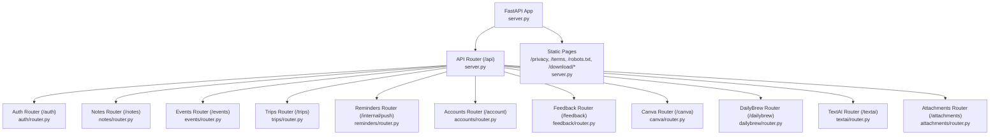
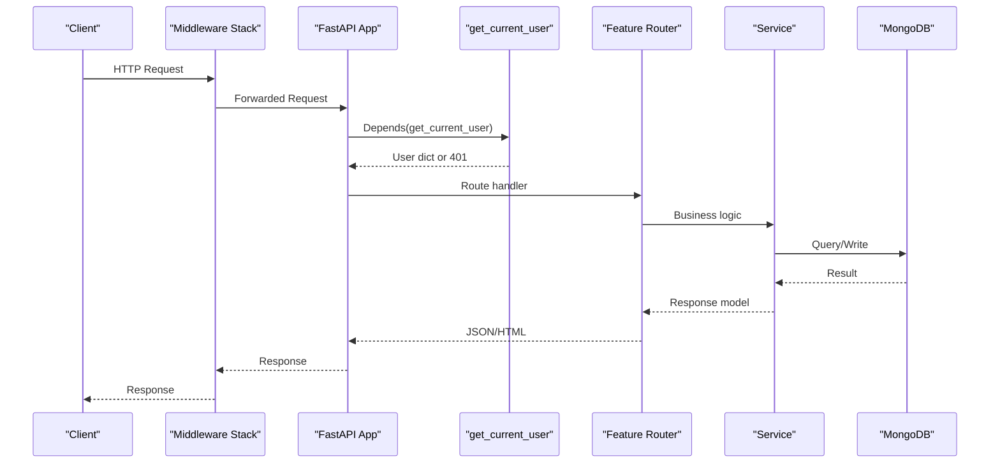
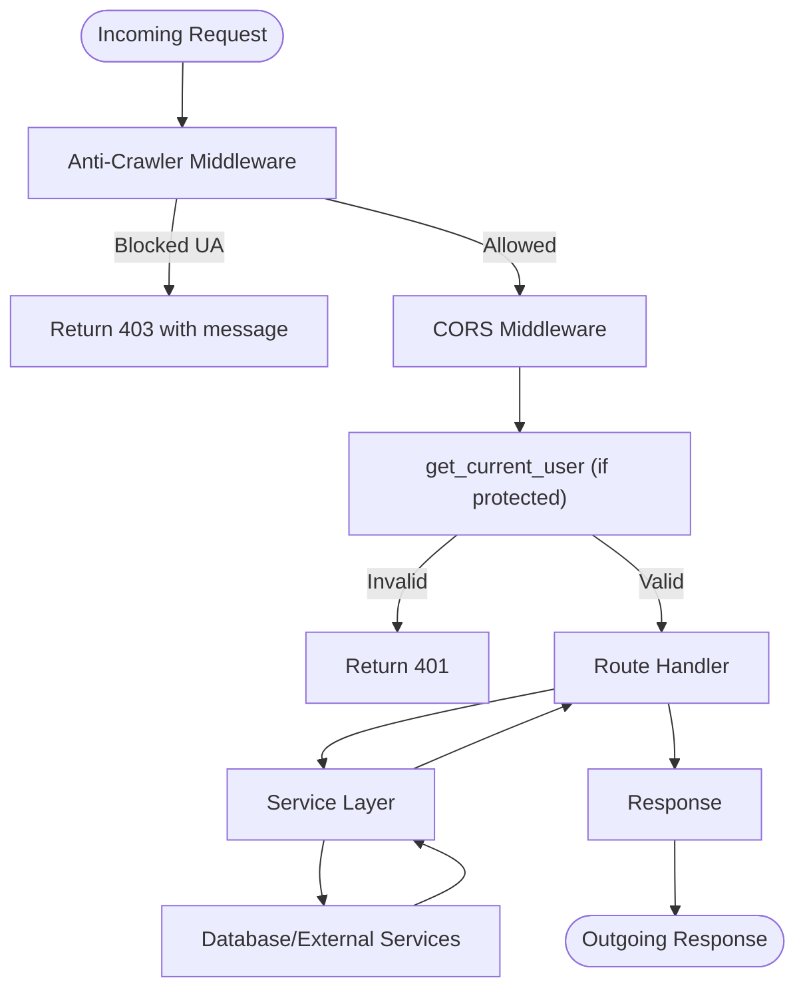

# FastAPI Application Structure

<cite>
**Referenced Files in This Document**
- [server.py](file://server.py)
- [featureflags.py](file://featureflags.py)
- [core/deps.py](file://core/deps.py)
- [core/regions.py](file://core/regions.py)
- [auth/router.py](file://auth/router.py)
- [notes/router.py](file://notes/router.py)
- [events/router.py](file://events/router.py)
- [trips/router.py](file://trips/router.py)
- [reminders/router.py](file://reminders/router.py)
- [accounts/router.py](file://accounts/router.py)
</cite>

## Table of Contents
1. [Introduction](#introduction)
2. [Project Structure](#project-structure)
3. [Core Components](#core-components)
4. [Architecture Overview](#architecture-overview)
5. [Detailed Component Analysis](#detailed-component-analysis)
6. [Dependency Analysis](#dependency-analysis)
7. [Performance Considerations](#performance-considerations)
8. [Troubleshooting Guide](#troubleshooting-guide)
9. [Conclusion](#conclusion)
10. [Appendices](#appendices)

## Introduction
This document explains the FastAPI application structure centered on server.py. It covers application initialization, API router configuration, middleware pipeline setup, modular feature-based routers (auth, notes, events, trips, reminders, accounts, feedback, canva, dailybrew, textai, attachments), startup event handlers for database index creation, cache prewarmer, feature flag refresh, and speechmatics job sweeper, CORS configuration, static file serving (privacy policy and terms), APK download functionality, anti-crawler protection, and how new routers are integrated. It also details the request flow through the middleware stack.

## Project Structure
The backend is organized by feature modules under top-level directories (auth, notes, events, trips, reminders, accounts, feedback, canva, dailybrew, textai, attachments). Each feature typically exposes a router that defines HTTP endpoints and delegates business logic to a service module. The central server.py wires everything together: it creates the FastAPI instance, configures middleware, mounts an API router with a common prefix, includes all feature routers, serves static pages, and registers startup/shutdown lifecycle hooks.

**Diagram sources**
- [server.py:20-214](file://server.py#L20-L214)
- [auth/router.py:20](file://auth/router.py#L20)
- [notes/router.py:10](file://notes/router.py#L10)
- [events/router.py:16](file://events/router.py#L16)
- [trips/router.py:16](file://trips/router.py#L16)
- [reminders/router.py:9](file://reminders/router.py#L9)
- [accounts/router.py:8](file://accounts/router.py#L8)

**Section sources**
- [server.py:20-214](file://server.py#L20-L214)

## Core Components
- Application and API Router: The FastAPI app is created and an APIRouter with prefix "/api" is defined. All feature routers are included into this API router, which is then mounted onto the app.
- Middleware Pipeline:
  - Anti-crawler middleware blocks known AI crawler user agents and adds response headers to discourage indexing and AI training.
  - CORS middleware is configured with credentials and allowed origins/methods/headers from environment variables.
- Static File Serving:
  - Privacy policy at /privacy, Terms of use at /terms, robots.txt at /robots.txt.
  - Staging APK download page at /download and binary endpoint at /download/nueco-staging.apk.
- Startup Events:
  - Data residency enforcement via region validation.
  - Database index creation for performance.
  - Daily Brew cache prewarmer background task.
  - Feature flag refresher background task.
  - Speechmatics job sweeper background task.
- Shutdown Event:
  - Closes the MongoDB client.

**Section sources**
- [server.py:20-214](file://server.py#L20-L214)
- [server.py:310-330](file://server.py#L310-L330)
- [server.py:230-295](file://server.py#L230-L295)
- [server.py:338-464](file://server.py#L338-L464)

## Architecture Overview
The request flow passes through Starlette’s middleware stack before reaching route handlers. For authenticated routes, the get_current_user dependency validates the bearer token and resolves the current user. Feature routers delegate to services that interact with the database or external services. Background tasks run during startup to maintain indexes, prewarm caches, refresh flags, and sweep jobs.

**Diagram sources**
- [server.py:310-330](file://server.py#L310-L330)
- [core/deps.py:24-50](file://core/deps.py#L24-L50)
- [notes/router.py:17-28](file://notes/router.py#L17-L28)

## Detailed Component Analysis

### Application Initialization and Mounting
- Creates FastAPI instance and an APIRouter with prefix "/api".
- Includes feature routers into the API router and mounts it onto the app.
- Defines utility functions like IP extraction used by rate limiters.

Key responsibilities:
- Centralized mounting point for all feature routers.
- Shared prefixes and tags per feature.

**Section sources**
- [server.py:20-214](file://server.py#L20-L214)
- [server.py:30-39](file://server.py#L30-L39)

### Modular Routers
Each feature has its own router with a consistent pattern:
- Define an APIRouter with a prefix and tag.
- Use get_current_user dependency for protected routes.
- Use get_db dependency to access the database.
- Delegate to a service layer for business logic.

Examples:
- Auth: authentication flows, email verification HTML, password reset, account updates.
- Notes: CRUD operations with pagination and pin toggling.
- Events: CRUD, batch retrieval, pagination.
- Trips: CRUD with pagination.
- Reminders: internal cron-like endpoints gated by a shared secret.
- Accounts: secure account deletion.

Integration points:
- All routers are imported and included in server.py under the /api prefix.
- Internal-only endpoints (e.g., reminders) use separate prefixes and secret checks.

**Section sources**
- [auth/router.py:20-366](file://auth/router.py#L20-L366)
- [notes/router.py:10-100](file://notes/router.py#L10-L100)
- [events/router.py:16-111](file://events/router.py#L16-L111)
- [trips/router.py:16-96](file://trips/router.py#L16-L96)
- [reminders/router.py:9-29](file://reminders/router.py#L9-L29)
- [accounts/router.py:8-25](file://accounts/router.py#L8-L25)

### Middleware Pipeline
- Anti-crawler middleware:
  - Blocks requests with known AI crawler user agents.
  - Adds X-Robots-Tag headers to responses.
- CORS middleware:
  - Configured with allow_credentials and dynamic allowed origins from environment.
  - Allows standard methods and headers.

Request flow impact:
- Every request first passes through anti-crawler middleware, then CORS middleware, then route handlers.

**Section sources**
- [server.py:310-330](file://server.py#L310-L330)

### Startup Event Handlers
- Data residency enforcement:
  - Validates all external-service endpoints and regions against an Australian allowlist at boot.
- Database index creation:
  - Drops stale indexes and creates optimized compound indexes for notes, events, trips, push tokens, users, sessions, devices, key escrow, feature events, and transcription shadow records.
- Cache prewarmer:
  - Starts a background task to prewarm Daily Brew cache.
- Feature flag refresh:
  - Performs an initial fetch of feature flags with timeout; starts a periodic refresher task.
- Speechmatics job sweeper:
  - Starts a background task to reconcile and delete old Speechmatics jobs.

Shutdown:
- Closes the MongoDB client gracefully.

**Section sources**
- [server.py:338-464](file://server.py#L338-L464)
- [featureflags.py:25-52](file://featureflags.py#L25-L52)

### Static File Serving and APK Download
- Privacy policy served at /privacy.
- Terms of use served at /terms.
- robots.txt served at /robots.txt.
- Staging APK download:
  - HTML page at /download listing size and link.
  - Binary download at /download/nueco-staging.apk with appropriate media type.

Behavior:
- If files are missing, returns 404.
- Paths are configurable via environment variables where applicable.

**Section sources**
- [server.py:230-295](file://server.py#L230-L295)

### Authentication and Authorization Flow
- Protected routes depend on get_current_user.
- get_current_user extracts the bearer token, verifies it via AuthService, and returns the user document.
- Unauthenticated or invalid tokens result in 401 responses.

Rate limiting:
- Auth endpoints implement in-memory rate limiting based on IP and email windows.

**Section sources**
- [core/deps.py:24-50](file://core/deps.py#L24-L50)
- [auth/router.py:23-84](file://auth/router.py#L23-L84)
- [auth/router.py:93-140](file://auth/router.py#L93-L140)

### Data Residency and External Services
- Single source of truth for external service endpoints and regions.
- Enforces Australian-region declarations at startup and re-validates on each accessor call.
- Prevents accidental data egress outside approved regions.

**Section sources**
- [core/regions.py:1-230](file://core/regions.py#L1-L230)

### Example: Integrating a New Router
To add a new feature router:
1. Create a router module with an APIRouter instance and define endpoints.
2. Import the router in server.py.
3. Include it into api_router using include_router.
4. If needed, add dependencies or middleware behavior globally.

Example integration steps mirror existing patterns for auth, notes, events, trips, reminders, accounts, feedback, canva, dailybrew, textai, and attachments.

**Section sources**
- [server.py:175-214](file://server.py#L175-L214)

## Dependency Analysis
- server.py depends on:
  - core.deps for database and user resolution.
  - core.regions for data residency enforcement.
  - featureflags for feature flag management.
  - textai.transcription for speechmatics sweeper.
  - dailybrew.service for cache prewarmer.
- Feature routers depend on:
  - core.deps for get_current_user and get_db.
  - Their respective services for business logic.

Coupling and cohesion:
- High cohesion within feature modules (router + service + schemas).
- Low coupling between features via centralized mounting in server.py.
- Shared concerns (auth, DB access, regions) abstracted in core.

Potential circular imports:
- Deferred imports in core.deps avoid circular import issues when importing from server.py.

**Section sources**
- [server.py:38-40](file://server.py#L38-L40)
- [core/deps.py:15-21](file://core/deps.py#L15-L21)
- [core/deps.py:24-50](file://core/deps.py#L24-L50)

## Performance Considerations
- Database indexes:
  - Compound indexes optimize list queries and sorting for notes, events, and trips.
  - Partial indexes reduce overhead for reminder scheduling.
  - TTL indexes auto-expire transient data (sessions, transcription shadow records).
- Pagination:
  - Routers expose page and page_size parameters to limit payload sizes.
- Background tasks:
  - Cache prewarming reduces cold-start latency for Daily Brew.
  - Feature flag refresh ensures timely availability without blocking requests.
  - Job sweeper keeps provider-side storage usage minimal.

[No sources needed since this section provides general guidance]

## Troubleshooting Guide
Common issues and diagnostics:
- Missing or malformed environment variables:
  - Data residency validation will abort startup if any required endpoint or region is missing or non-Australian. Check logs for [region-check] messages.
- Index creation failures:
  - Non-fatal warnings may indicate already existing indexes; verify collection names and index definitions.
- Feature flag refresh errors:
  - Initial fetch timeouts or network errors are logged; background refresher retries periodically.
- APK/static files not found:
  - Ensure paths exist and are readable; endpoints return 404 when files are missing.
- Rate limiting triggers:
  - Auth endpoints enforce per-email/IP limits; repeated attempts may result in 429 responses.

**Section sources**
- [core/regions.py:144-165](file://core/regions.py#L144-L165)
- [server.py:345-432](file://server.py#L345-L432)
- [server.py:441-450](file://server.py#L441-L450)
- [server.py:230-295](file://server.py#L230-L295)
- [auth/router.py:23-84](file://auth/router.py#L23-L84)

## Conclusion
The FastAPI application in server.py provides a clean, modular architecture with feature-based routers, robust middleware, and comprehensive startup routines. It enforces data residency, optimizes database performance with indexes, supports static content and APK downloads, and protects against automated crawlers. Adding new features follows a consistent pattern: create a router, wire it into the API router, and rely on shared dependencies for authentication and database access.

[No sources needed since this section summarizes without analyzing specific files]

## Appendices

### Request Flow Through Middleware Stack

**Diagram sources**
- [server.py:310-330](file://server.py#L310-L330)
- [core/deps.py:24-50](file://core/deps.py#L24-L50)