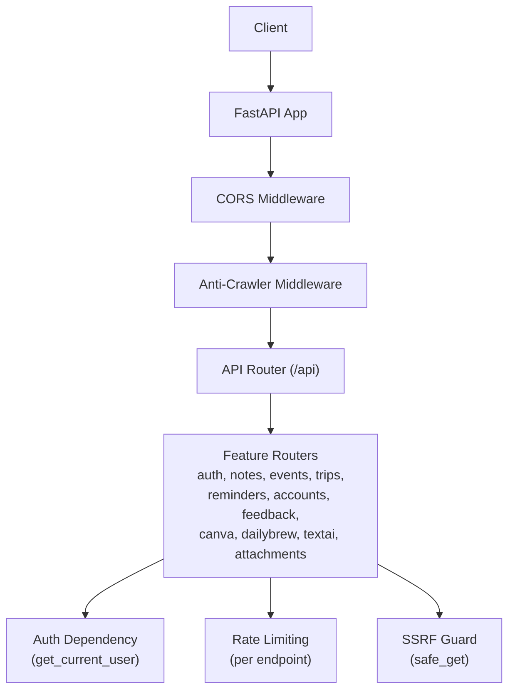
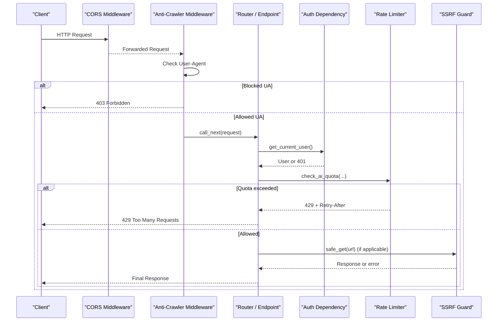
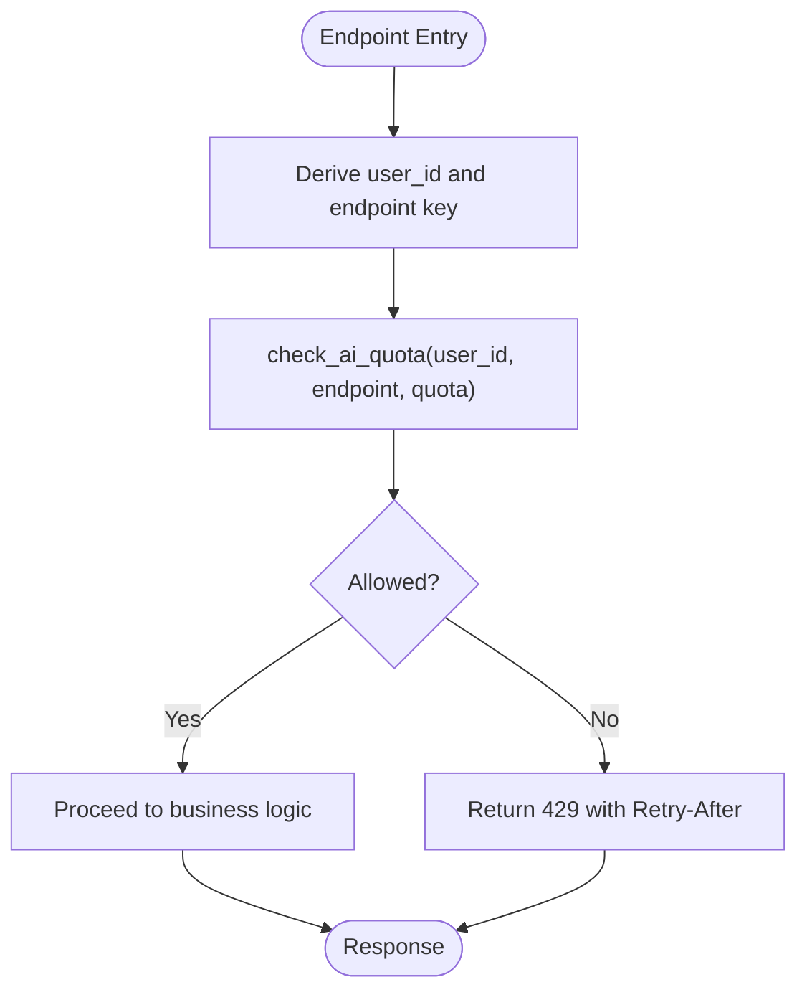
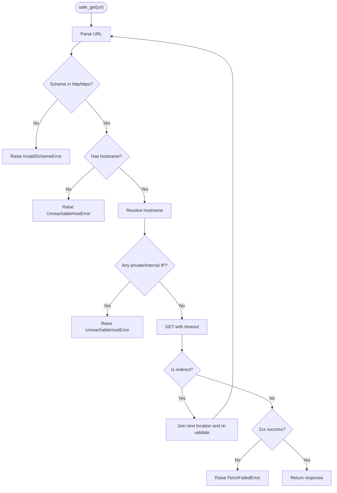
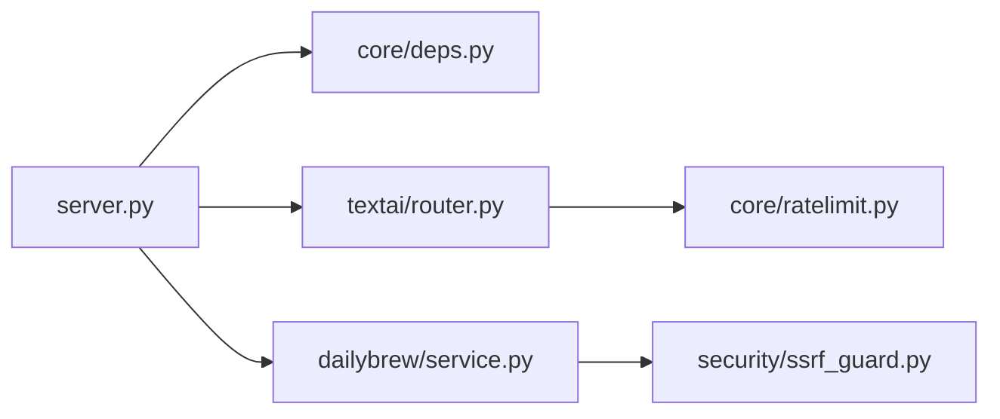

# Middleware Pipeline

<cite>
**Referenced Files in This Document**
- [server.py](file://server.py)
- [ssrf_guard.py](file://security/ssrf_guard.py)
- [ratelimit.py](file://core/ratelimit.py)
- [deps.py](file://core/deps.py)
- [textai/router.py](file://textai/router.py)
- [dailybrew/service.py](file://dailybrew/service.py)
</cite>

## Table of Contents
1. [Introduction](#introduction)
2. [Project Structure](#project-structure)
3. [Core Components](#core-components)
4. [Architecture Overview](#architecture-overview)
5. [Detailed Component Analysis](#detailed-component-analysis)
6. [Dependency Analysis](#dependency-analysis)
7. [Performance Considerations](#performance-considerations)
8. [Troubleshooting Guide](#troubleshooting-guide)
9. [Conclusion](#conclusion)

## Introduction
This document explains the middleware pipeline and security controls implemented in the backend: CORS configuration, anti-crawler protection (including AI crawler blocking), Server-Side Request Forgery (SSRF) guard for outbound requests, and rate limiting for AI endpoints. It details the execution order of middleware components, how requests flow through each layer, and provides guidance on adding custom middleware, debugging issues, and optimizing performance.

## Project Structure
The application is a FastAPI service that registers routers under an API prefix and applies global middleware at startup. Security and cross-cutting concerns are implemented as:
- A global HTTP middleware to block AI crawlers and tag responses with anti-scraping headers.
- CORS middleware configured via environment variables.
- Per-endpoint authentication dependency.
- Per-endpoint rate limiting for AI endpoints.
- An SSRF guard used when fetching user-supplied URLs.

**Diagram sources**
- [server.py:310-330](file://server.py#L310-L330)
- [textai/router.py:28-49](file://textai/router.py#L28-L49)
- [dailybrew/service.py:134-158](file://dailybrew/service.py#L134-L158)

**Section sources**
- [server.py:20-214](file://server.py#L20-L214)
- [server.py:310-330](file://server.py#L310-L330)

## Core Components
- CORS middleware: Configured globally with credentials and allowed origins/methods/headers.
- Anti-crawler middleware: Blocks known AI crawler User-Agent strings and adds response headers to discourage indexing and AI training.
- Authentication dependency: Validates bearer tokens per endpoint using shared dependencies.
- Rate limiting: Sliding-window limiter protecting AI endpoints from abuse and safeguarding shared quotas.
- SSRF guard: Enforces safe outbound requests by validating schemes, resolving hostnames, rejecting private/internal IPs, and re-validating redirects.

**Section sources**
- [server.py:310-330](file://server.py#L310-L330)
- [deps.py:24-50](file://core/deps.py#L24-L50)
- [ratelimit.py:25-123](file://core/ratelimit.py#L25-L123)
- [ssrf_guard.py:1-109](file://security/ssrf_guard.py#L1-L109)

## Architecture Overview
Request lifecycle across middleware and endpoints:
1. The request enters the FastAPI app.
2. CORS middleware processes preflight and sets response headers.
3. Anti-crawler middleware checks User-Agent; if blocked, returns 403 immediately; otherwise proceeds.
4. The request reaches the appropriate router and endpoint.
5. Endpoint dependencies enforce authentication.
6. For AI endpoints, rate limiting is enforced before any external calls.
7. If the endpoint fetches user-supplied URLs, it uses the SSRF guard to prevent malicious outbound access.

**Diagram sources**
- [server.py:310-330](file://server.py#L310-L330)
- [deps.py:24-50](file://core/deps.py#L24-L50)
- [textai/router.py:28-49](file://textai/router.py#L28-L49)
- [ssrf_guard.py:67-109](file://security/ssrf_guard.py#L67-L109)

## Detailed Component Analysis

### CORS Configuration
- Enabled with credentials support.
- Origins are read from an environment variable; if empty, defaults to allow all origins.
- Methods include GET, POST, PUT, DELETE, OPTIONS.
- Allowed headers include Authorization, Content-Type, X-Requested-With.

Configuration location and behavior:
- Origin list parsing and middleware registration occur at application startup.

**Section sources**
- [server.py:320-330](file://server.py#L320-L330)

### Anti-Crawler Protection and AI Crawler Blocking
- A global HTTP middleware inspects the User-Agent header.
- Known AI crawler identifiers trigger an immediate 403 response with a plain text message.
- For allowed requests, the response includes anti-scraping headers to signal no indexing and no AI training usage.

Execution order:
- Registered as an HTTP middleware, so it runs early in the pipeline, before routing and business logic.

User-Agent detection and response headers:
- Detection is substring-based against a curated list of bot identifiers.
- Response headers added include directives discouraging AI training and indexing.

**Section sources**
- [server.py:298-317](file://server.py#L298-L317)

### Authentication Dependency
- Endpoints use a shared dependency to resolve the current user from a Bearer token.
- Missing, malformed, invalid, expired, or revoked tokens result in 401 responses.
- The dependency defers imports to avoid circular imports during module load.

Integration points:
- Used by feature routers to protect authenticated endpoints.

**Section sources**
- [deps.py:24-50](file://core/deps.py#L24-L50)

### Rate Limiting Implementation
- Sliding-window limiter tracks request timestamps per key and optionally a global key.
- Decisions return whether the request is allowed and, if denied, a retry-after value in seconds.
- Per-user quotas are defined for transcription, voice intent classification, and text processing.
- A global quota protects the shared OpenAI key from aggregate overload.

Per-endpoint customization:
- Each AI endpoint selects its specific quota and endpoint key for scoping.
- When a quota is exceeded, the endpoint raises a 429 with a Retry-After header.

Flow within endpoints:
- Rate limit enforcement occurs before any expensive or costly external calls.

**Diagram sources**
- [ratelimit.py:41-123](file://core/ratelimit.py#L41-L123)
- [textai/router.py:28-49](file://textai/router.py#L28-L49)

**Section sources**
- [ratelimit.py:25-123](file://core/ratelimit.py#L25-L123)
- [textai/router.py:28-49](file://textai/router.py#L28-L49)

### SSRF Guard for Outbound Requests
- Purpose: Prevent server-side request forgery when fetching user-supplied URLs.
- Checks:
  - Scheme validation: Only http and https are allowed.
  - Hostname resolution: Resolves hostname asynchronously and rejects private, loopback, link-local, reserved, multicast, or unspecified addresses.
  - Redirect safety: Manually follows redirects and re-validates every hop to prevent bypass via redirection to internal targets.
- Error types:
  - Invalid scheme errors.
  - Unreachable host errors (missing hostname, DNS failure, or private IP).
  - Fetch failures (network errors, non-2xx status, missing Location header, too many redirects).

Usage example:
- Custom feed addition validates a user-provided RSS/Atom URL using the guard before saving.

**Diagram sources**
- [ssrf_guard.py:50-109](file://security/ssrf_guard.py#L50-L109)

**Section sources**
- [ssrf_guard.py:1-109](file://security/ssrf_guard.py#L1-L109)
- [dailybrew/service.py:134-158](file://dailybrew/service.py#L134-L158)

### Execution Order Summary
- Global HTTP middleware (anti-crawler) runs first among custom middleware.
- CORS middleware is registered separately and handles cross-origin preflight and headers.
- Authentication dependency runs at the endpoint level.
- Rate limiting runs at the endpoint level before external calls.
- SSRF guard runs only when making outbound requests to user-supplied URLs.

Note: In this codebase, CORS is added via a framework helper while the anti-crawler middleware is registered via the HTTP middleware decorator. Both apply around route handling, but the anti-crawler middleware explicitly short-circuits on matching User-Agent patterns.

**Section sources**
- [server.py:310-330](file://server.py#L310-L330)

## Dependency Analysis
- server.py wires routers and applies middleware.
- core/deps.py provides shared dependencies for database access and current user resolution.
- core/ratelimit.py implements sliding-window rate limiting and exposes quotas and checks.
- textai/router.py integrates rate limiting into AI endpoints.
- dailybrew/service.py uses the SSRF guard for safe outbound requests.
- security/ssrf_guard.py encapsulates SSRF protection logic.

**Diagram sources**
- [server.py:175-214](file://server.py#L175-L214)
- [deps.py:15-50](file://core/deps.py#L15-L50)
- [ratelimit.py:96-123](file://core/ratelimit.py#L96-L123)
- [textai/router.py:8-14](file://textai/router.py#L8-L14)
- [dailybrew/service.py:16-17](file://dailybrew/service.py#L16-L17)

**Section sources**
- [server.py:175-214](file://server.py#L175-L214)
- [deps.py:15-50](file://core/deps.py#L15-L50)
- [ratelimit.py:96-123](file://core/ratelimit.py#L96-L123)
- [textai/router.py:8-14](file://textai/router.py#L8-L14)
- [dailybrew/service.py:16-17](file://dailybrew/service.py#L16-L17)

## Performance Considerations
- Anti-crawler middleware performs lightweight string checks and can short-circuit early, minimizing overhead.
- CORS middleware handles preflight requests efficiently; ensure production origins are restricted to reduce unnecessary broad allowances.
- Rate limiter uses in-process state; it resets on deploy and does not scale horizontally without a shared store. Adjust quotas based on expected traffic patterns.
- SSRF guard resolves hostnames asynchronously and validates redirects, which adds latency to outbound requests. Use timeouts and cache results where feasible.
- Authentication dependency incurs token verification and user lookup costs; ensure efficient session/token storage and consider caching strategies if needed.

[No sources needed since this section provides general guidance]

## Troubleshooting Guide
- Anti-crawler false positives:
  - Verify the User-Agent string sent by clients. Matching substrings will be blocked.
  - Review the list of blocked identifiers and adjust if necessary.
- CORS issues:
  - Confirm ALLOWED_ORIGINS is set correctly for production environments.
  - Ensure required headers and methods are included in the configuration.
- Authentication failures:
  - Check that Authorization headers contain valid Bearer tokens.
  - Inspect token validity and session expiration.
- Rate limiting:
  - If receiving 429 responses, honor the Retry-After header and back off retries.
  - Tune per-endpoint quotas and global limits based on observed usage.
- SSRF errors:
  - Validate that outbound URLs use http or https and resolve to public IPs.
  - Investigate DNS rebinding scenarios and redirect chains that may lead to internal addresses.

**Section sources**
- [server.py:298-330](file://server.py#L298-L330)
- [ratelimit.py:25-123](file://core/ratelimit.py#L25-L123)
- [ssrf_guard.py:50-109](file://security/ssrf_guard.py#L50-L109)

## Conclusion
The middleware pipeline combines CORS, anti-crawler protection, authentication, rate limiting, and SSRF safeguards to secure and control request handling. The execution order ensures early interception of unwanted traffic and robust protection for sensitive operations. Rate limiting and SSRF guards provide targeted defenses for high-cost and high-risk operations. Following the guidance here helps maintain performance, security, and reliability as the system evolves.

[No sources needed since this section summarizes without analyzing specific files]