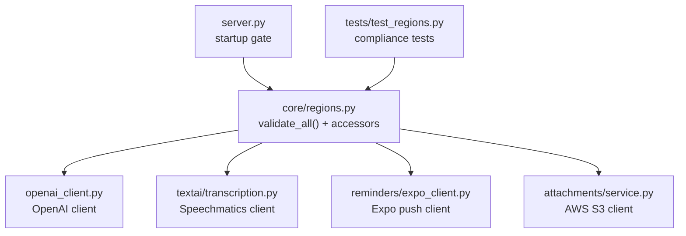
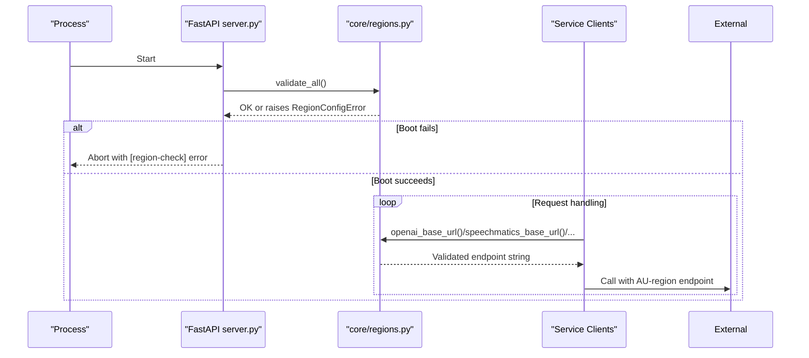
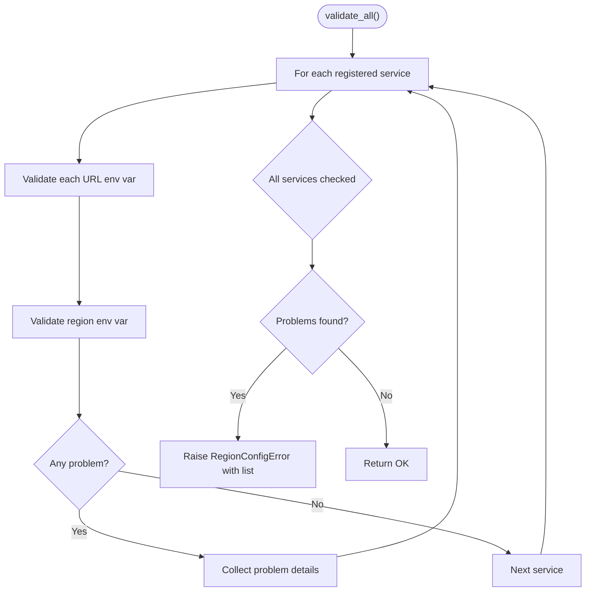
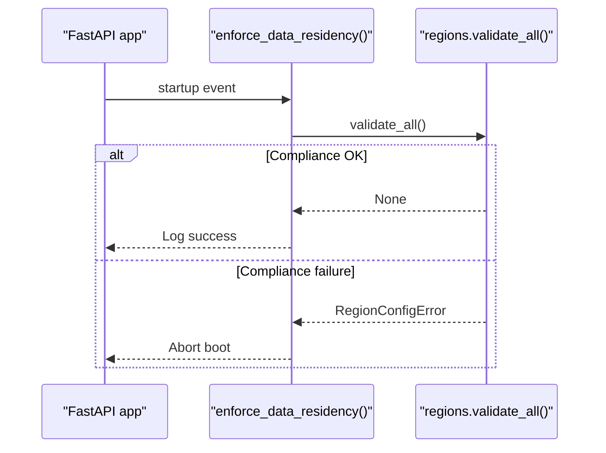
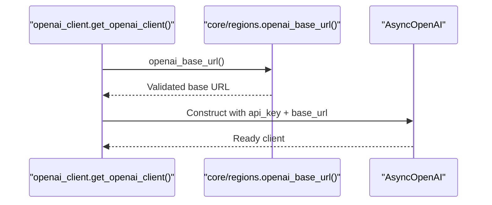
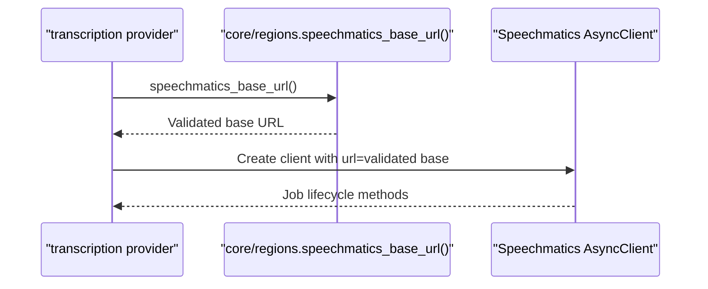
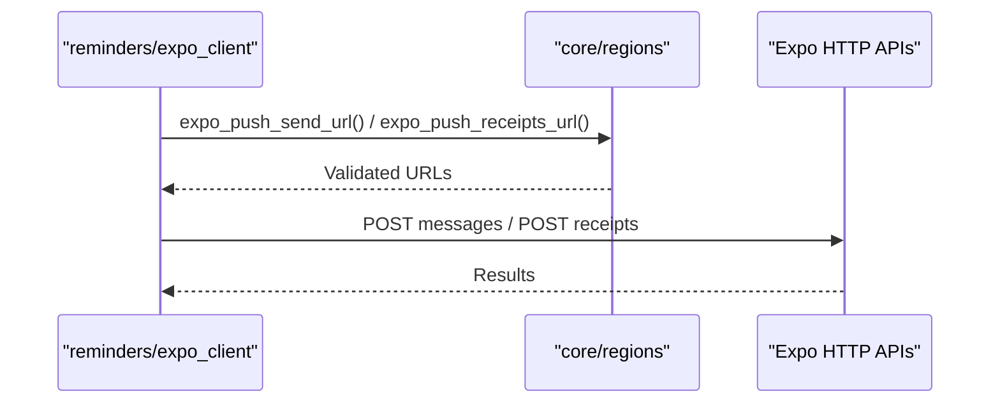
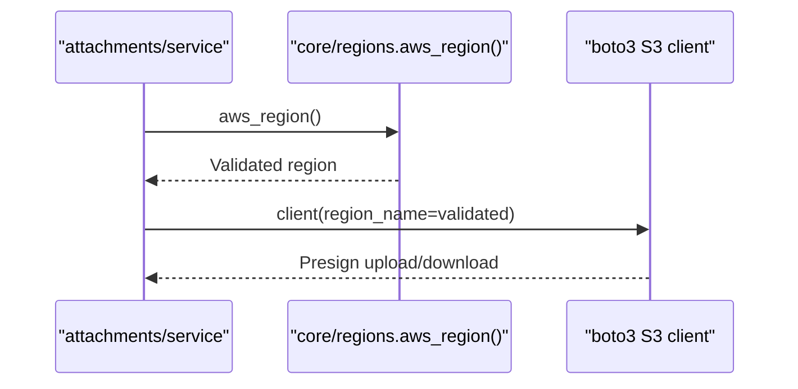
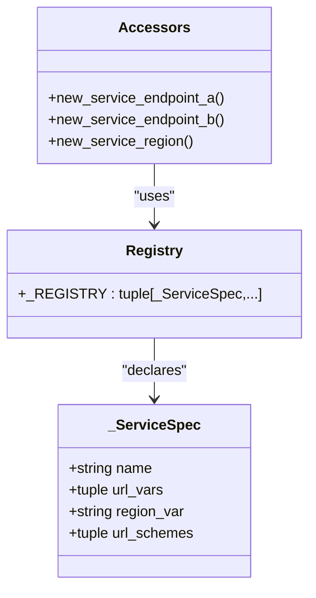
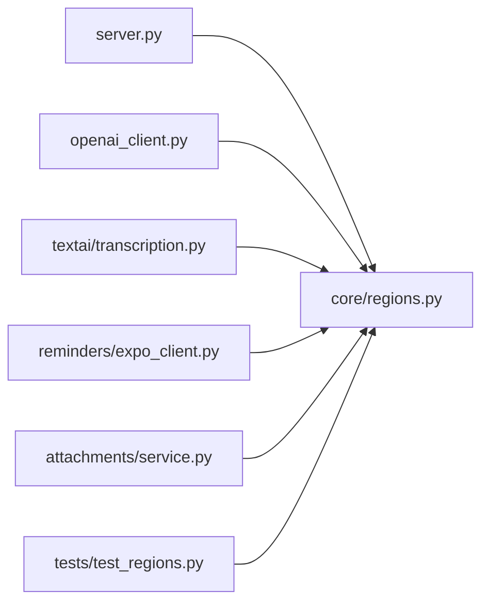

# Region Validation & Data Residency

<cite>
**Referenced Files in This Document**
- [core/regions.py](file://core/regions.py)
- [server.py](file://server.py)
- [openai_client.py](file://openai_client.py)
- [textai/transcription.py](file://textai/transcription.py)
- [reminders/expo_client.py](file://reminders/expo_client.py)
- [attachments/service.py](file://attachments/service.py)
- [tests/test_regions.py](file://tests/test_regions.py)
</cite>

## Table of Contents
1. [Introduction](#introduction)
2. [Project Structure](#project-structure)
3. [Core Components](#core-components)
4. [Architecture Overview](#architecture-overview)
5. [Detailed Component Analysis](#detailed-component-analysis)
6. [Dependency Analysis](#dependency-analysis)
7. [Performance Considerations](#performance-considerations)
8. [Troubleshooting Guide](#troubleshooting-guide)
9. [Conclusion](#conclusion)
10. [Appendices](#appendices)

## Introduction
This document explains the region validation system that enforces data residency under the Australian Privacy Act 1988 (APP 11). The system ensures that all outbound service endpoints and region declarations are present, well-formed, and restricted to approved Australian regions before any request is served. It covers:
- How validate_all() enforces compliance at startup
- How typed accessors re-validate on every call
- Integration with external services such as OpenAI, Speechmatics, Expo push, PostHog, Canva, MongoDB, and AWS S3
- How to add new service integrations safely
- Troubleshooting region validation failures
- Business rationale and architectural impact

## Project Structure
The region enforcement is centralized in a single module and enforced early during server startup. Service modules consume validated endpoints via typed accessors rather than reading environment variables directly.

**Diagram sources**
- [server.py:333-341](file://server.py#L333-L341)
- [core/regions.py:144-165](file://core/regions.py#L144-L165)
- [openai_client.py:15-23](file://openai_client.py#L15-L23)
- [textai/transcription.py:204-209](file://textai/transcription.py#L204-L209)
- [reminders/expo_client.py:26-49](file://reminders/expo_client.py#L26-L49)
- [attachments/service.py:77-83](file://attachments/service.py#L77-L83)
- [tests/test_regions.py:1-201](file://tests/test_regions.py#L1-L201)

**Section sources**
- [server.py:333-341](file://server.py#L333-L341)
- [core/regions.py:1-19](file://core/regions.py#L1-L19)

## Core Components
- Central registry of external services and their required environment variables for endpoints and regions
- Startup enforcement that validates all declared configuration before serving traffic
- Typed accessors that re-validate region and endpoint on each use
- Strict allowlist of approved Australian regions
- Source guard tests preventing hardcoded vendor endpoints outside the central module

Key behaviors:
- Missing or malformed endpoint declarations fail boot
- Non-Australian region declarations fail boot
- Blank values are treated as missing
- Accessors enforce region checks on every call, not just at startup

**Section sources**
- [core/regions.py:26-30](file://core/regions.py#L26-L30)
- [core/regions.py:46-77](file://core/regions.py#L46-L77)
- [core/regions.py:95-141](file://core/regions.py#L95-L141)
- [core/regions.py:144-181](file://core/regions.py#L144-L181)
- [tests/test_regions.py:64-153](file://tests/test_regions.py#L64-L153)

## Architecture Overview
The architecture uses a fail-closed design:
- On process start, the server runs a startup handler that calls validate_all()
- If any service’s endpoint or region is missing, malformed, or non-Australian, the process aborts before handling requests
- All service clients obtain endpoints through typed accessors, which re-check region validity per call
- No service code may hardcode vendor URLs; they must be declared via environment variables and validated centrally

**Diagram sources**
- [server.py:333-341](file://server.py#L333-L341)
- [core/regions.py:144-165](file://core/regions.py#L144-L165)
- [core/regions.py:175-181](file://core/regions.py#L175-L181)

## Detailed Component Analysis

### Central Registry and Validation Engine
- Declares every external service with its endpoint env vars and region env var
- Validates URLs against allowed schemes (e.g., https only; mongodb/mongodb+srv for database)
- Normalizes region values and checks against an explicit Australian allowlist
- Aggregates all problems into a single failure message listing every offending variable
- Provides typed accessors that re-enforce region checks on every call

**Diagram sources**
- [core/regions.py:144-165](file://core/regions.py#L144-L165)
- [core/regions.py:104-127](file://core/regions.py#L104-L127)

**Section sources**
- [core/regions.py:46-77](file://core/regions.py#L46-L77)
- [core/regions.py:95-141](file://core/regions.py#L95-L141)
- [core/regions.py:144-181](file://core/regions.py#L144-L181)

### Startup Enforcement Gate
- Registered as the first startup handler so it runs before index creation, cache prewarmers, and sweepers
- Calls validate_all() and logs success if no errors occur
- Any raised RegionConfigError aborts the boot, ensuring no traffic is served until compliance is satisfied

**Diagram sources**
- [server.py:333-341](file://server.py#L333-L341)
- [core/regions.py:144-165](file://core/regions.py#L144-L165)

**Section sources**
- [server.py:333-341](file://server.py#L333-L341)

### OpenAI Integration
- Obtains API key from environment
- Pins base URL via the region-checked accessor to prevent SDK default fallbacks
- Ensures LLM calls go only to the configured AU-region endpoint

**Diagram sources**
- [openai_client.py:15-23](file://openai_client.py#L15-L23)
- [core/regions.py:186-187](file://core/regions.py#L186-L187)

**Section sources**
- [openai_client.py:15-23](file://openai_client.py#L15-L23)
- [core/regions.py:186-187](file://core/regions.py#L186-L187)

### Speechmatics Integration
- Uses region-checked base URL to construct the transcription client
- Explicitly pins the endpoint to avoid SDK defaults bypassing the AU-region gate
- Includes job cleanup and reconciliation safeguards

**Diagram sources**
- [textai/transcription.py:204-209](file://textai/transcription.py#L204-L209)
- [core/regions.py:190-191](file://core/regions.py#L190-L191)

**Section sources**
- [textai/transcription.py:204-209](file://textai/transcription.py#L204-L209)
- [core/regions.py:190-191](file://core/regions.py#L190-L191)

### Expo Push Integration
- Both send and receipts endpoints come from region-checked accessors
- Thin HTTP adapter keeps network concerns isolated and testable

**Diagram sources**
- [reminders/expo_client.py:26-49](file://reminders/expo_client.py#L26-L49)
- [core/regions.py:194-199](file://core/regions.py#L194-L199)

**Section sources**
- [reminders/expo_client.py:26-49](file://reminders/expo_client.py#L26-L49)
- [core/regions.py:194-199](file://core/regions.py#L194-L199)

### AWS S3 Integration
- Region name comes from the region-checked accessor
- Bucket name is read separately; region is never defaulted silently
- Presigned URLs include the validated region to ensure correct routing

**Diagram sources**
- [attachments/service.py:77-83](file://attachments/service.py#L77-L83)
- [attachments/service.py:129-129](file://attachments/service.py#L129-L129)
- [core/regions.py:206-208](file://core/regions.py#L206-L208)

**Section sources**
- [attachments/service.py:77-83](file://attachments/service.py#L77-L83)
- [attachments/service.py:129-129](file://attachments/service.py#L129-L129)
- [core/regions.py:206-208](file://core/regions.py#L206-L208)

### Adding a New Service Integration
To integrate a new external service while maintaining compliance:
1. Register the service in the central registry with:
   - A unique service name
   - One or more endpoint environment variable names
   - A region environment variable name
   - Allowed URL schemes (default https; override for databases like MongoDB)
2. Add typed accessors for each endpoint you need
3. Update service code to call the new accessors instead of reading environment variables directly
4. Ensure your deployment sets both endpoint and region environment variables
5. Verify with tests that the fixture covers the new variables

**Diagram sources**
- [core/regions.py:46-77](file://core/regions.py#L46-L77)
- [core/regions.py:175-181](file://core/regions.py#L175-L181)

**Section sources**
- [core/regions.py:46-77](file://core/regions.py#L46-L77)
- [core/regions.py:175-181](file://core/regions.py#L175-L181)
- [tests/test_regions.py:64-66](file://tests/test_regions.py#L64-L66)

## Dependency Analysis
- server.py depends on core/regions.py to enforce compliance at startup
- Service modules depend on core/regions.py for validated endpoints and regions
- Tests assert coverage and correctness of the registry and validation logic
- No service module should import vendor SDKs without going through region-checked accessors

**Diagram sources**
- [server.py:333-341](file://server.py#L333-L341)
- [openai_client.py:15-23](file://openai_client.py#L15-L23)
- [textai/transcription.py:204-209](file://textai/transcription.py#L204-L209)
- [reminders/expo_client.py:26-49](file://reminders/expo_client.py#L26-L49)
- [attachments/service.py:77-83](file://attachments/service.py#L77-L83)
- [tests/test_regions.py:1-201](file://tests/test_regions.py#L1-L201)

**Section sources**
- [core/regions.py:46-77](file://core/regions.py#L46-L77)
- [tests/test_regions.py:156-201](file://tests/test_regions.py#L156-L201)

## Performance Considerations
- Validation occurs once at startup; per-call accessors perform lightweight checks
- Avoid caching raw environment reads; always use accessors to guarantee region enforcement
- Keep the registry small and explicit to minimize validation overhead
- Prefer async clients and bounded timeouts for external calls to avoid blocking the event loop

[No sources needed since this section provides general guidance]

## Troubleshooting Guide
Common issues and resolutions:
- Boot failure with [region-check] error:
  - Missing endpoint or region environment variables
  - Malformed URL (wrong scheme or missing host)
  - Non-Australian region value
- Resolution steps:
  - Set all required endpoint and region variables for every registered service
  - Ensure URLs use allowed schemes (https for most; mongodb/mongodb+srv for MongoDB)
  - Use only approved Australian region values
  - Re-run startup to confirm compliance

Useful references:
- Startup enforcement location
- Validation function and error aggregation
- Test suite demonstrating failure modes and expected behavior

**Section sources**
- [server.py:333-341](file://server.py#L333-L341)
- [core/regions.py:144-165](file://core/regions.py#L144-L165)
- [tests/test_regions.py:69-153](file://tests/test_regions.py#L69-L153)

## Conclusion
The region validation system implements a strict, fail-closed data residency policy aligned with the Australian Privacy Act 1988. By centralizing endpoint and region declarations, enforcing them at startup, and re-validating on every call, the system prevents any outbound traffic to unapproved regions. This approach simplifies compliance audits, reduces risk of accidental data exfiltration, and provides clear operational signals when configuration is incomplete or incorrect.

[No sources needed since this section summarizes without analyzing specific files]

## Appendices

### Approved Australian Regions
- Sydney: ap-southeast-2
- Melbourne: ap-southeast-4
- Country-level: au, australia

**Section sources**
- [core/regions.py:26-30](file://core/regions.py#L26-L30)

### Registered Services and Required Environment Variables
- OpenAI: OPENAI_BASE_URL, OPENAI_REGION
- Speechmatics: SPEECHMATICS_BASE_URL, SPEECHMATICS_REGION
- Expo Push: EXPO_PUSH_SEND_URL, EXPO_PUSH_RECEIPTS_URL, EXPO_PUSH_REGION
- Resend: RESEND_BASE_URL, RESEND_REGION
- AWS S3: AWS_REGION
- PostHog: POSTHOG_HOST, POSTHOG_REGION
- Canva: CANVA_AUTHORIZE_URL, CANVA_TOKEN_URL, CANVA_API_BASE_URL, CANVA_REGION
- MongoDB: MONGO_URL, MONGODB_REGION

**Section sources**
- [core/regions.py:58-77](file://core/regions.py#L58-L77)
- [tests/test_regions.py:24-43](file://tests/test_regions.py#L24-L43)

### Example: Adding a New Service
Steps:
1. Add a _ServiceSpec entry with endpoint and region env vars
2. Add typed accessors for each endpoint
3. Update service code to use the new accessors
4. Ensure deployment sets both endpoint and region variables
5. Extend the test fixture to cover the new variables

**Section sources**
- [core/regions.py:46-77](file://core/regions.py#L46-L77)
- [core/regions.py:175-181](file://core/regions.py#L175-L181)
- [tests/test_regions.py:64-66](file://tests/test_regions.py#L64-L66)