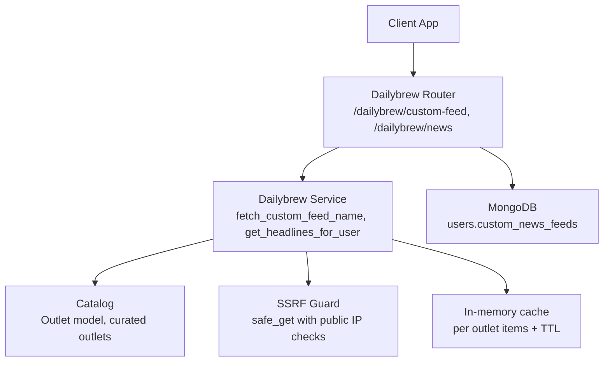
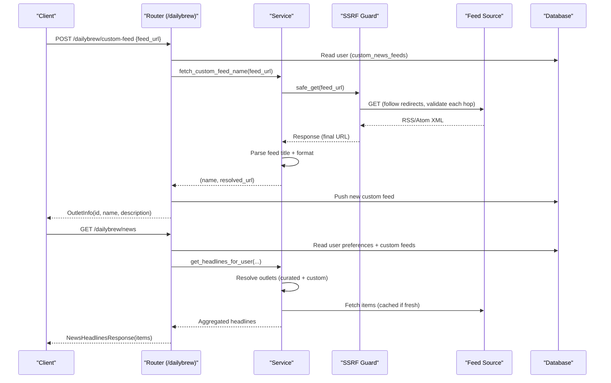
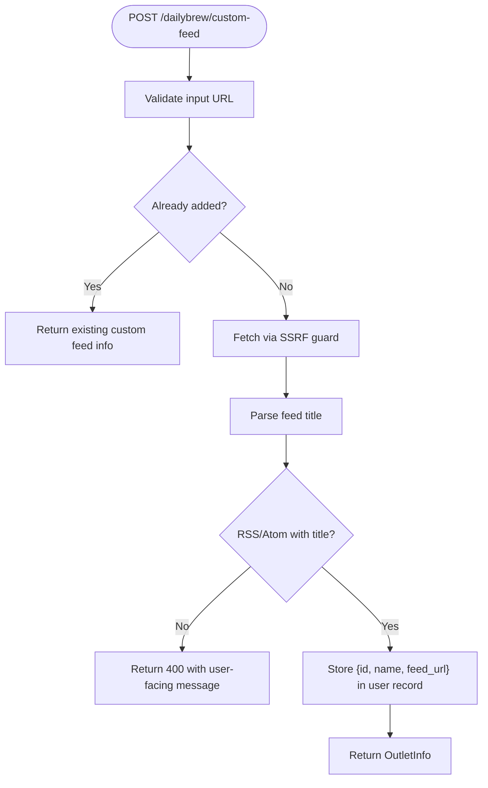
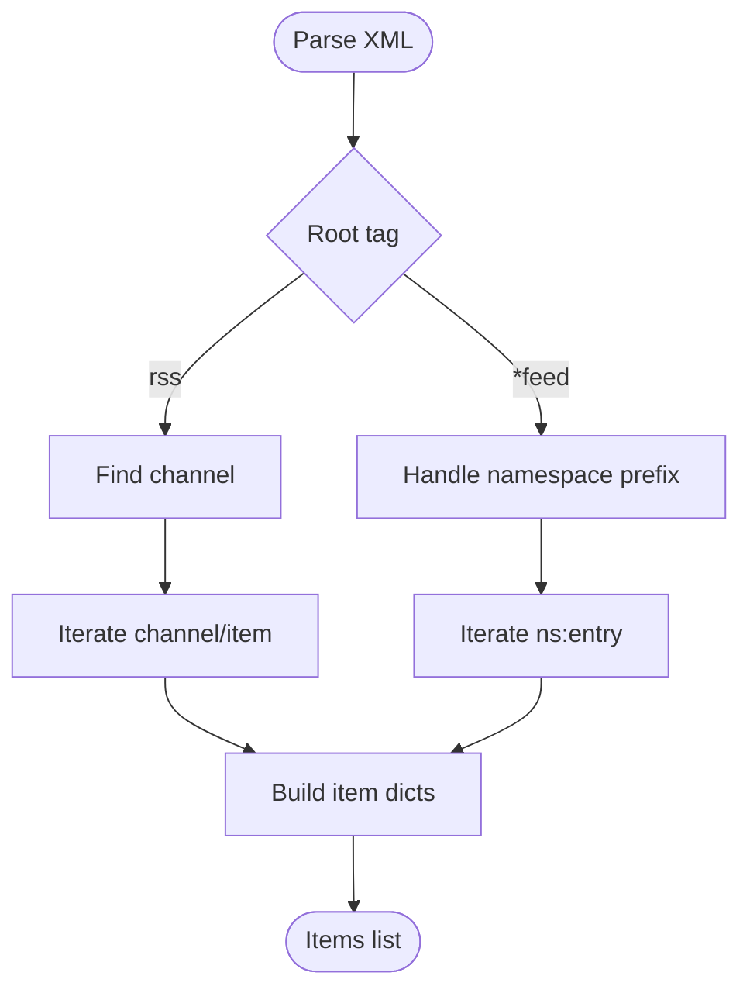
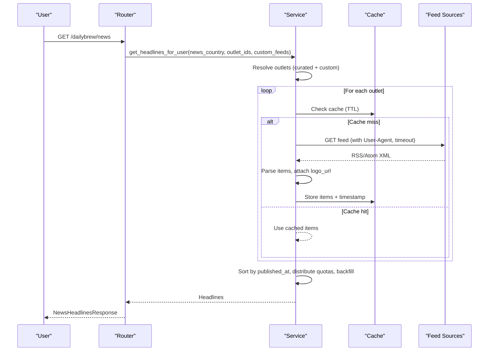
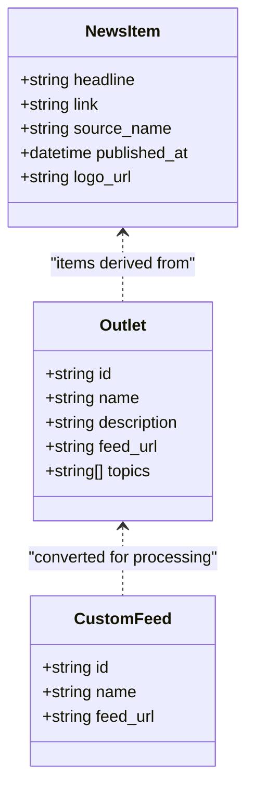
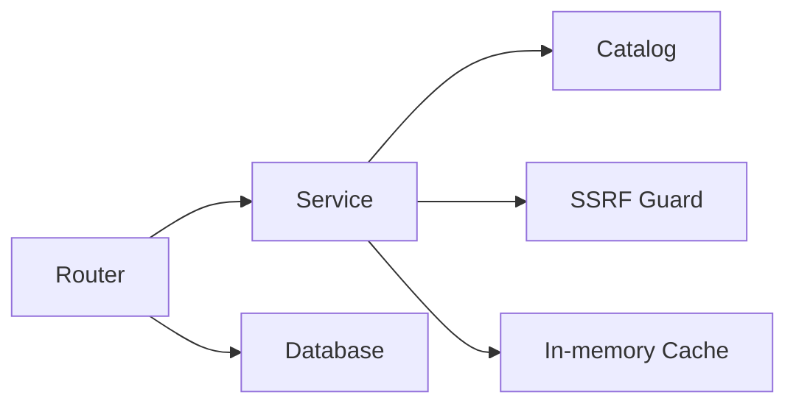

# Custom Feed Support

<cite>
**Referenced Files in This Document**
- [dailybrew/router.py](file://dailybrew/router.py)
- [dailybrew/service.py](file://dailybrew/service.py)
- [dailybrew/catalog.py](file://dailybrew/catalog.py)
- [dailybrew/schemas.py](file://dailybrew/schemas.py)
- [security/ssrf_guard.py](file://security/ssrf_guard.py)
</cite>

## Table of Contents
1. [Introduction](#introduction)
2. [Project Structure](#project-structure)
3. [Core Components](#core-components)
4. [Architecture Overview](#architecture-overview)
5. [Detailed Component Analysis](#detailed-component-analysis)
6. [Dependency Analysis](#dependency-analysis)
7. [Performance Considerations](#performance-considerations)
8. [Troubleshooting Guide](#troubleshooting-guide)
9. [Conclusion](#conclusion)

## Introduction
This document explains the custom feed support feature that allows users to add their own RSS/Atom feeds beyond the curated catalog. It covers how feed URLs are validated, how feed formats are detected, how titles are automatically extracted, and how custom feeds integrate into personalized news delivery. It also documents the full lifecycle from adding a custom feed to using it in the user’s Daily Brew, including error handling, security measures against malicious sources, update frequencies, caching strategies, and limits on the number of custom feeds per user.

## Project Structure
The custom feed feature spans several modules:
- API endpoints for adding and using custom feeds live in the dailybrew router.
- Feed validation, parsing, and fetching logic is implemented in the dailybrew service.
- The Outlet data model and curated catalogs live in the dailybrew catalog module.
- Request/response schemas define the contract for adding custom feeds and returning results.
- SSRF protection ensures all outbound fetches are safe, even when following redirects.

**Diagram sources**
- [dailybrew/router.py:60-101](file://dailybrew/router.py#L60-L101)
- [dailybrew/service.py:134-284](file://dailybrew/service.py#L134-L284)
- [dailybrew/catalog.py:4-12](file://dailybrew/catalog.py#L4-L12)
- [security/ssrf_guard.py:67-109](file://security/ssrf_guard.py#L67-L109)

**Section sources**
- [dailybrew/router.py:1-102](file://dailybrew/router.py#L1-L102)
- [dailybrew/service.py:1-356](file://dailybrew/service.py#L1-L356)
- [dailybrew/catalog.py:1-281](file://dailybrew/catalog.py#L1-L281)
- [dailybrew/schemas.py:1-41](file://dailybrew/schemas.py#L1-L41)
- [security/ssrf_guard.py:1-109](file://security/ssrf_guard.py#L1-L109)

## Core Components
- Add custom feed endpoint: Accepts a feed URL, validates it via a live fetch, extracts the feed title, resolves redirects, stores the feed under the current user, and returns an OutletInfo object.
- Headline aggregation: Merges curated outlets and custom feeds selected by the user, fetches items with caching, sorts by publication time, and distributes headlines across sources.
- Feed parsing: Supports both RSS and Atom formats, extracting headline, link, source name, and published date.
- Security: All user-supplied URLs are fetched through an SSRF guard that enforces allowed schemes, validates hostnames, and re-validates every redirect hop.

Key behaviors:
- Validation: A live GET is performed; only valid RSS/Atom responses are accepted.
- Title extraction: The feed’s top-level title is used as the display name.
- Format detection: Automatic detection based on root tag names for RSS and Atom.
- Redirect resolution: The final URL after redirects is stored to ensure subsequent fetches work reliably.

**Section sources**
- [dailybrew/router.py:60-88](file://dailybrew/router.py#L60-L88)
- [dailybrew/service.py:93-158](file://dailybrew/service.py#L93-L158)
- [dailybrew/service.py:227-284](file://dailybrew/service.py#L227-L284)
- [security/ssrf_guard.py:67-109](file://security/ssrf_guard.py#L67-L109)

## Architecture Overview
The custom feed flow integrates with existing Daily Brew flows:

**Diagram sources**
- [dailybrew/router.py:60-101](file://dailybrew/router.py#L60-L101)
- [dailybrew/service.py:134-284](file://dailybrew/service.py#L134-L284)
- [security/ssrf_guard.py:67-109](file://security/ssrf_guard.py#L67-L109)

## Detailed Component Analysis

### Adding a Custom Feed
- Endpoint: POST /dailybrew/custom-feed
- Input: A single feed URL string.
- Behavior:
  - Checks for duplicates among the user’s existing custom feeds.
  - Performs a live, SSRF-safe fetch to validate the URL and confirm it is a parseable RSS or Atom feed.
  - Extracts the feed’s top-level title to use as the display name.
  - Stores the resolved URL (after redirects) and a generated id prefixed with “custom:”.
  - Returns an OutletInfo describing the new custom feed.

**Diagram sources**
- [dailybrew/router.py:60-88](file://dailybrew/router.py#L60-L88)
- [dailybrew/service.py:134-158](file://dailybrew/service.py#L134-L158)

**Section sources**
- [dailybrew/router.py:60-88](file://dailybrew/router.py#L60-L88)
- [dailybrew/service.py:134-158](file://dailybrew/service.py#L134-L158)
- [dailybrew/schemas.py:39-41](file://dailybrew/schemas.py#L39-L41)

### Feed Validation and Format Detection
- Validation:
  - Uses an SSRF-safe GET to ensure the URL scheme is http or https, the host resolves to a public IP, and every redirect hop is re-checked.
  - Rejects unreachable hosts, invalid schemes, and network errors with clear messages.
- Format detection:
  - Parses the XML response and detects RSS vs Atom by examining the root tag.
  - For RSS, expects a channel element; for Atom, expects entries within a namespace-qualified feed tag.
- Title extraction:
  - Reads the top-level title from RSS channel or Atom feed to set the display name.

**Diagram sources**
- [dailybrew/service.py:93-131](file://dailybrew/service.py#L93-L131)

**Section sources**
- [dailybrew/service.py:93-158](file://dailybrew/service.py#L93-L158)
- [security/ssrf_guard.py:67-109](file://security/ssrf_guard.py#L67-L109)

### Using Custom Feeds in Personalized News
- The user’s selected outlets include both curated outlets and custom feeds.
- When generating headlines:
  - Resolves outlet ids to actual outlets (including custom feeds).
  - Sorts by follow order to respect user priorities.
  - Limits participation to a configured cap to match client-side selection limits.
  - Fetches items concurrently with caching and fallback behavior.
  - Distributes headlines across sources and backfills slots if needed.

**Diagram sources**
- [dailybrew/service.py:168-284](file://dailybrew/service.py#L168-L284)
- [dailybrew/router.py:91-101](file://dailybrew/router.py#L91-L101)

**Section sources**
- [dailybrew/service.py:227-284](file://dailybrew/service.py#L227-L284)
- [dailybrew/router.py:91-101](file://dailybrew/router.py#L91-L101)

### Data Model and Integration Points
- Outlet model: Used uniformly for curated and custom feeds during retrieval and display.
- Custom feed storage: Stored in the user document under a dedicated field alongside other preferences.
- Resolution helpers: Provide lookup of specific outlet ids, including custom feeds not present in the current country catalog.

**Diagram sources**
- [dailybrew/catalog.py:4-12](file://dailybrew/catalog.py#L4-L12)
- [dailybrew/service.py:223-224](file://dailybrew/service.py#L223-L224)
- [dailybrew/schemas.py:6-15](file://dailybrew/schemas.py#L6-L15)

**Section sources**
- [dailybrew/catalog.py:4-12](file://dailybrew/catalog.py#L4-L12)
- [dailybrew/service.py:223-224](file://dailybrew/service.py#L223-L224)
- [dailybrew/schemas.py:6-15](file://dailybrew/schemas.py#L6-L15)

## Dependency Analysis
- Router depends on:
  - Service for business logic (validation, fetching, aggregation).
  - Database for reading/writing user preferences and custom feeds.
  - Schemas for request/response models.
- Service depends on:
  - Catalog for curated outlet definitions and search utilities.
  - SSRF guard for secure outbound requests.
  - In-memory cache for performance and resilience.
- SSRF guard depends on:
  - Async HTTP client with manual redirect handling.
  - Hostname resolution and private IP rejection.

**Diagram sources**
- [dailybrew/router.py:1-102](file://dailybrew/router.py#L1-L102)
- [dailybrew/service.py:1-356](file://dailybrew/service.py#L1-L356)
- [security/ssrf_guard.py:1-109](file://security/ssrf_guard.py#L1-L109)

**Section sources**
- [dailybrew/router.py:1-102](file://dailybrew/router.py#L1-L102)
- [dailybrew/service.py:1-356](file://dailybrew/service.py#L1-L356)
- [security/ssrf_guard.py:1-109](file://security/ssrf_guard.py#L1-L109)

## Performance Considerations
- Caching strategy:
  - Per-outlet in-memory cache stores parsed items with a timestamp.
  - Cache TTL is set to reduce redundant network calls while ensuring reasonably fresh content.
  - Concurrency control uses an async lock to avoid duplicate fetches during cache refresh windows.
- Update frequency:
  - Background prewarmer periodically refreshes curated outlets’ caches at a cadence more frequent than the TTL to keep content warm.
  - Custom feeds participate in the same fetch pipeline and benefit from the same caching behavior when included in the user’s selected outlets.
- Network timeouts and headers:
  - Requests use a browser-like User-Agent and a bounded timeout to improve compatibility and prevent long hangs.
- Best-effort resilience:
  - Fetch failures fall back to the last known good cache or return empty lists so slow/dead feeds do not break the user experience.

[No sources needed since this section provides general guidance]

## Troubleshooting Guide
Common issues and resolutions:
- Invalid scheme:
  - Symptom: Error indicating the URL must start with http:// or https://.
  - Cause: Non-http(s) scheme rejected by SSRF guard.
  - Resolution: Ensure the feed URL uses http or https.
- Unreachable host:
  - Symptom: Error stating the URL isn’t reachable.
  - Cause: DNS resolution failure or target resolves to a private/internal IP.
  - Resolution: Verify domain correctness and public accessibility.
- Not a feed:
  - Symptom: Error indicating the URL does not look like an RSS or Atom feed.
  - Cause: Response is not parseable RSS/Atom or lacks a top-level title.
  - Resolution: Confirm the URL points to a valid RSS/Atom endpoint.
- Duplicate custom feed:
  - Symptom: Adding the same feed returns existing information instead of creating a new entry.
  - Cause: Exact match check against stored feed URLs prevents duplication.
  - Resolution: Use the existing custom feed id; no action required.
- Slow or failing feeds:
  - Symptom: Missing or stale headlines.
  - Cause: Network errors or malformed feeds; system falls back to cached or empty results.
  - Resolution: Retry later; verify feed availability and format.

Error mapping:
- SSRF guard exceptions are translated into user-friendly messages and returned as HTTP 400 responses from the add endpoint.

**Section sources**
- [dailybrew/router.py:78-81](file://dailybrew/router.py#L78-L81)
- [dailybrew/service.py:144-158](file://dailybrew/service.py#L144-L158)
- [security/ssrf_guard.py:33-48](file://security/ssrf_guard.py#L33-L48)

## Conclusion
Custom feed support enables users to extend their personalized news with any valid RSS/Atom feed. The implementation validates URLs securely, auto-detects feed formats, extracts titles, and integrates seamlessly into the existing Daily Brew pipeline. Robust caching and background prewarming maintain responsiveness, while SSRF protections safeguard against malicious or unsafe sources. Users can add feeds via a simple endpoint, manage them through their saved preferences, and rely on consistent headline delivery across curated and custom sources.

[No sources needed since this section summarizes without analyzing specific files]