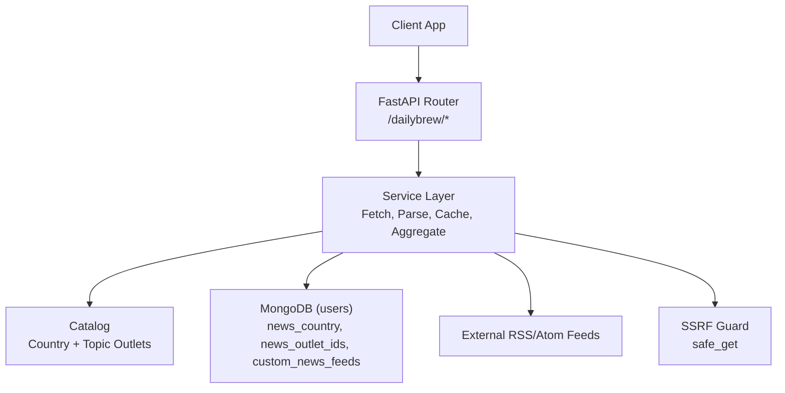
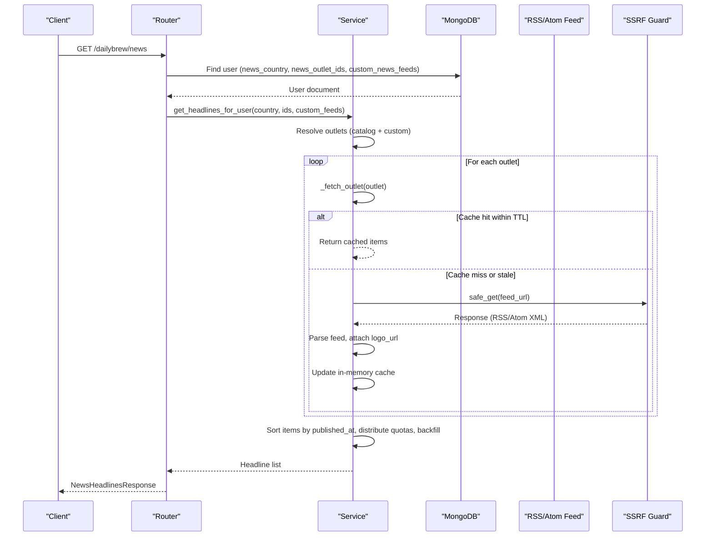
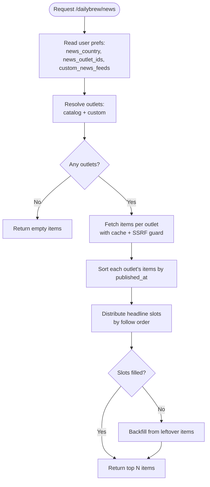
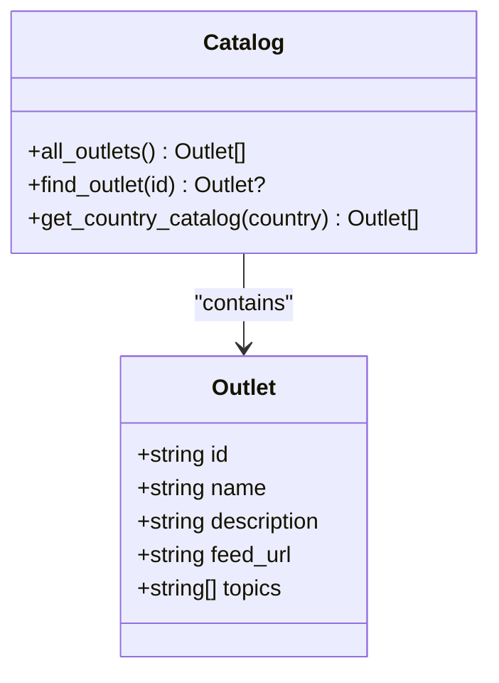
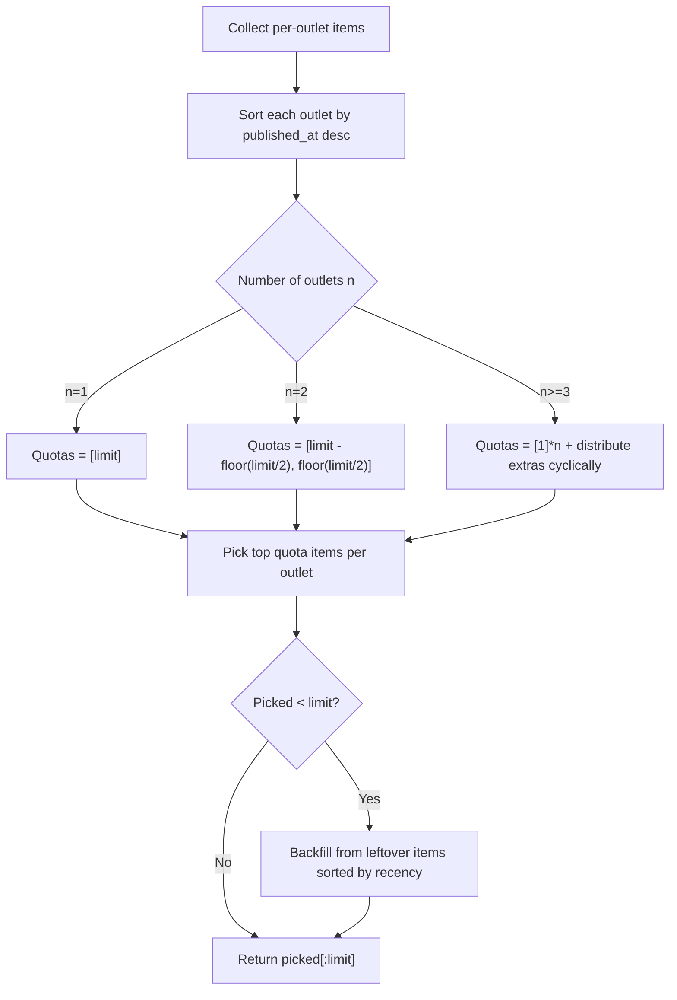
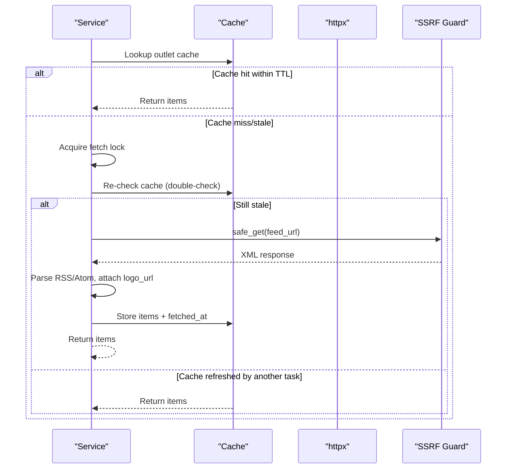
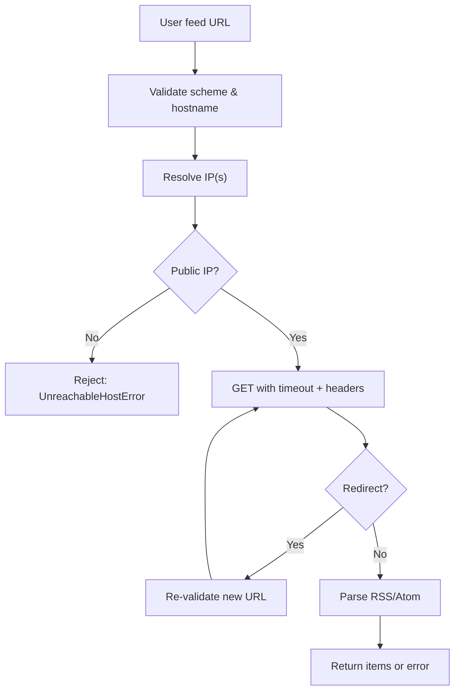
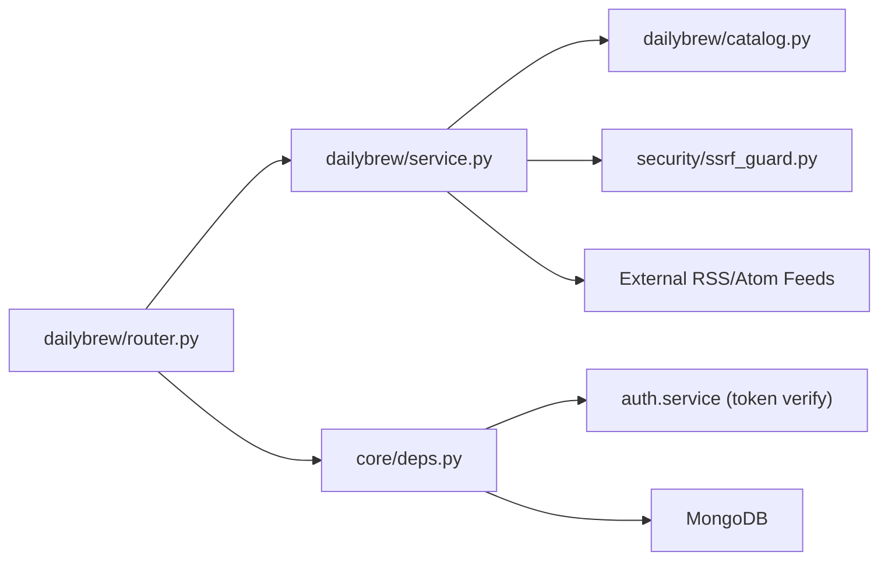

# Daily Brew

<cite>
**Referenced Files in This Document**
- [router.py](file://dailybrew/router.py)
- [service.py](file://dailybrew/service.py)
- [catalog.py](file://dailybrew/catalog.py)
- [schemas.py](file://dailybrew/schemas.py)
- [ssrf_guard.py](file://security/ssrf_guard.py)
- [deps.py](file://core/deps.py)
</cite>

## Table of Contents
1. [Introduction](#introduction)
2. [Project Structure](#project-structure)
3. [Core Components](#core-components)
4. [Architecture Overview](#architecture-overview)
5. [Detailed Component Analysis](#detailed-component-analysis)
6. [Dependency Analysis](#dependency-analysis)
7. [Performance Considerations](#performance-considerations)
8. [Troubleshooting Guide](#troubleshooting-guide)
9. [Conclusion](#conclusion)

## Introduction
Daily Brew is a personalized news aggregation feature that delivers curated headlines to users based on their country, followed outlets, and custom RSS/Atom feeds. It supports:
- Country-specific outlet catalogs
- Topic-focused feed discovery via search
- Custom user-added feeds with live validation
- A background cache prewarmer to keep feeds fresh without cold network latency on user requests
- Safe external fetches with SSRF protection

The system aggregates items from multiple sources, sorts by recency, distributes slots across followed outlets, and returns a concise set of headlines per request.

## Project Structure
The Daily Brew feature is organized into four main modules:
- Router: HTTP endpoints for browsing sources, searching feeds, adding custom feeds, and retrieving personalized headlines
- Service: Core logic for fetching, parsing, caching, and aggregating news items; includes the background prewarmer
- Catalog: Static definitions of country-scoped outlets and a topic-focused pool
- Schemas: Pydantic models for request/response payloads



**Diagram sources**
- [router.py:15-101](file://dailybrew/router.py#L15-L101)
- [service.py:168-284](file://dailybrew/service.py#L168-L284)
- [catalog.py:29-281](file://dailybrew/catalog.py#L29-L281)
- [ssrf_guard.py:67-109](file://security/ssrf_guard.py#L67-L109)

**Section sources**
- [router.py:1-102](file://dailybrew/router.py#L1-L102)
- [service.py:1-356](file://dailybrew/service.py#L1-L356)
- [catalog.py:1-281](file://dailybrew/catalog.py#L1-L281)
- [schemas.py:1-41](file://dailybrew/schemas.py#L1-L41)
- [ssrf_guard.py:1-109](file://security/ssrf_guard.py#L1-L109)
- [deps.py:1-51](file://core/deps.py#L1-L51)

## Core Components
- Router endpoints:
  - GET /dailybrew/news-sources: Returns outlets available for a given country
  - GET /dailybrew/search-feeds: Suggests up to five matching outlets across country catalog and topic pool
  - GET /dailybrew/outlets: Resolves specific outlet IDs to display info (including custom feeds)
  - POST /dailybrew/custom-feed: Adds a validated custom RSS/Atom feed to the current user
  - GET /dailybrew/news: Retrieves personalized headlines for the authenticated user
- Service layer:
  - Fetches RSS/Atom feeds with timeouts and a browser-like User-Agent
  - Parses both RSS and Atom formats
  - Caches per-outlet results in memory with TTL and lock-based refresh
  - Aggregates and distributes headline slots across followed outlets
  - Background prewarmer periodically refreshes all curated outlets
- Catalog:
  - Country-scoped outlet lists (e.g., AU, ID)
  - Topic-focused pool (e.g., AI, Technology, World, Business, Sports, Health, Entertainment, Music, Games, Science, Food)
- Security:
  - SSRF guard validates schemes, resolves hostnames, rejects private/internal IPs, and re-validates on every redirect hop

**Section sources**
- [router.py:15-101](file://dailybrew/router.py#L15-L101)
- [service.py:20-356](file://dailybrew/service.py#L20-L356)
- [catalog.py:15-281](file://dailybrew/catalog.py#L15-L281)
- [ssrf_guard.py:1-109](file://security/ssrf_guard.py#L1-L109)

## Architecture Overview
Daily Brew composes HTTP routes with service logic that reads user preferences from MongoDB, resolves outlets from the catalog or custom feeds, fetches and parses RSS/Atom content safely, caches results, and aggregates headlines.



**Diagram sources**
- [router.py:91-101](file://dailybrew/router.py#L91-L101)
- [service.py:227-284](file://dailybrew/service.py#L227-L284)
- [service.py:168-207](file://dailybrew/service.py#L168-L207)
- [ssrf_guard.py:67-109](file://security/ssrf_guard.py#L67-L109)

## Detailed Component Analysis

### Personalized News Delivery
- Country-specific content delivery:
  - The router endpoint for news sources uses the country parameter to return outlets from the catalog for that region.
  - The user’s news_country influences default suggestions but does not restrict which outlets can be followed; any outlet ID (from catalog or topic pool) can be saved.
- Custom feed support:
  - Users can add any website’s RSS/Atom feed URL. The server validates it live, extracts the feed title, follows redirects, and stores the resolved URL.
  - Custom feeds are stored under a user field and included alongside catalog outlets when generating headlines.
- Outlet preferences:
  - The user’s followed outlets are stored as a list of outlet IDs. Order matters: the first followed outlets receive more headline slots when there are fewer than the limit.
  - The system enforces a per-request headline limit and distributes slots fairly across followed outlets, prioritizing earlier selections.



**Diagram sources**
- [service.py:227-284](file://dailybrew/service.py#L227-L284)
- [service.py:168-207](file://dailybrew/service.py#L168-L207)

**Section sources**
- [router.py:15-101](file://dailybrew/router.py#L15-L101)
- [service.py:227-284](file://dailybrew/service.py#L227-L284)
- [catalog.py:29-281](file://dailybrew/catalog.py#L29-L281)

### News Catalog Management
- Country catalogs:
  - Curated lists keyed by ISO country codes include verified RSS/Atom URLs. Some original outlets were replaced due to non-functional feeds.
- Topic pool:
  - A separate pool of outlets tagged with topics (e.g., AI, Technology, World, Business, Sports, Health, Entertainment, Music, Games, Science, Food) is surfaced via search.
- Discovery:
  - Search matches words against outlet names, descriptions, and topic tags using prefix matching and weighted scoring (topic > name > description).
  - The search returns up to five suggestions.



**Diagram sources**
- [catalog.py:4-13](file://dailybrew/catalog.py#L4-L13)
- [catalog.py:267-281](file://dailybrew/catalog.py#L267-L281)

**Section sources**
- [catalog.py:15-281](file://dailybrew/catalog.py#L15-L281)
- [service.py:287-356](file://dailybrew/service.py#L287-L356)

### Feed Generation Algorithms
- Sorting:
  - Items are sorted by published date descending; undated items sort last.
  - Naive datetimes are normalized to UTC-aware before comparison to avoid errors.
- Distribution:
  - With one followed outlet, all headline slots come from it.
  - With two, the first followed outlet gets the majority of slots.
  - With three or more, each outlet contributes at least one item; extra slots are distributed cyclically starting from the first followed outlet.
- Backfill:
  - If a followed outlet runs short on fresh items, remaining slots are filled from the next-freshest items across all followed outlets.



**Diagram sources**
- [service.py:35-46](file://dailybrew/service.py#L35-L46)
- [service.py:254-284](file://dailybrew/service.py#L254-L284)

**Section sources**
- [service.py:35-46](file://dailybrew/service.py#L35-L46)
- [service.py:254-284](file://dailybrew/service.py#L254-L284)

### Caching Strategies
- In-memory per-outlet cache:
  - Stores parsed items and fetch timestamp per outlet ID.
  - TTL is set to 15 minutes; fetches only occur if cache is missing or stale.
- Concurrency control:
  - An async lock prevents duplicate concurrent fetches for the same outlet while allowing parallel fetches across different outlets.
- Logo attachment:
  - Each item receives a logo URL derived from the feed domain via a favicon service.



**Diagram sources**
- [service.py:20-33](file://dailybrew/service.py#L20-L33)
- [service.py:168-207](file://dailybrew/service.py#L168-L207)
- [ssrf_guard.py:67-109](file://security/ssrf_guard.py#L67-L109)

**Section sources**
- [service.py:20-33](file://dailybrew/service.py#L20-L33)
- [service.py:168-207](file://dailybrew/service.py#L168-L207)

### Cache Prewarmer and Background Processing
- Prewarming:
  - Periodically fetches all curated outlets to keep the cache warm.
  - Runs in a background loop with a fixed interval shorter than the TTL to ensure freshness between cycles.
- Startup integration:
  - The prewarmer is started once during application startup and runs for the lifetime of the process.

```mermaid
sequenceDiagram
participant App as "Application"
participant BG as "Background Task"
participant S as "Service"
App->>BG : Start run_cache_prewarmer()
loop Every cycle
BG->>S : prewarm_all_outlets()
S->>S : Fetch all curated outlets concurrently
Note over S : Exceptions logged; do not stop the loop
BG->>BG : Sleep until next cycle
end
```

**Diagram sources**
- [service.py:205-221](file://dailybrew/service.py#L205-L221)

**Section sources**
- [service.py:205-221](file://dailybrew/service.py#L205-L221)

### External API Integration and Safety
- RSS/Atom parsing:
  - Supports both RSS and Atom formats, extracting title, link, and publication date where available.
- Network safety:
  - Uses an SSRF guard that enforces http/https schemes, resolves hostnames, rejects private/internal IPs, and validates every redirect hop.
- Robustness:
  - Fetch failures fall back to the last known-good cache or an empty list so slow or dead feeds never break the user experience.
  - Timeouts and a browser-like User-Agent improve compatibility with some outlets.



**Diagram sources**
- [ssrf_guard.py:50-109](file://security/ssrf_guard.py#L50-L109)
- [service.py:134-159](file://dailybrew/service.py#L134-L159)
- [service.py:93-117](file://dailybrew/service.py#L93-L117)

**Section sources**
- [service.py:93-117](file://dailybrew/service.py#L93-L117)
- [service.py:134-159](file://dailybrew/service.py#L134-L159)
- [ssrf_guard.py:50-109](file://security/ssrf_guard.py#L50-L109)

### Content Filtering and Regional Compliance
- Content filtering:
  - No server-side content filtering beyond format validation and availability; personalization is driven by user-selected outlets and country context.
- Regional considerations:
  - Country catalogs provide region-relevant defaults; however, users can follow any outlet regardless of country.
  - Some outlets may require specific headers or contexts; the implementation uses a browser-like User-Agent to reduce blocking.

[No sources needed since this section provides general guidance]

## Dependency Analysis
Daily Brew depends on:
- FastAPI router for HTTP endpoints
- MongoDB via shared dependency for user data
- Authentication via token verification to ensure user scoping
- Catalog for static outlet definitions
- SSRF guard for secure outbound requests
- httpx for asynchronous HTTP calls



**Diagram sources**
- [router.py:1-102](file://dailybrew/router.py#L1-L102)
- [service.py:1-356](file://dailybrew/service.py#L1-L356)
- [catalog.py:1-281](file://dailybrew/catalog.py#L1-L281)
- [ssrf_guard.py:1-109](file://security/ssrf_guard.py#L1-L109)
- [deps.py:1-51](file://core/deps.py#L1-L51)

**Section sources**
- [router.py:1-102](file://dailybrew/router.py#L1-L102)
- [service.py:1-356](file://dailybrew/service.py#L1-L356)
- [catalog.py:1-281](file://dailybrew/catalog.py#L1-L281)
- [ssrf_guard.py:1-109](file://security/ssrf_guard.py#L1-L109)
- [deps.py:1-51](file://core/deps.py#L1-L51)

## Performance Considerations
- Caching:
  - 15-minute TTL reduces repeated network calls; background prewarmer keeps caches warm.
- Concurrency:
  - Per-outlet fetches are gathered concurrently; a lock prevents duplicate fetches for the same outlet.
- Sorting and distribution:
  - Sorting by epoch seconds avoids timezone issues; distribution favors earlier-followed outlets to respect user intent.
- Scalability:
  - In-memory cache is suitable for single-replica deployments; consider moving to a short-TTL shared store if scaling to multiple replicas.
- Network resilience:
  - Failures fall back to cached data or empty lists to maintain responsiveness.

[No sources needed since this section provides general guidance]

## Troubleshooting Guide
Common issues and resolutions:
- Feed source unavailable:
  - Symptoms: Empty items or fallback to previous cache.
  - Causes: Network errors, non-RSS/Atom responses, blocked by site policies.
  - Actions: Verify feed URL validity; check logs for fetch errors; consider replacing with a working outlet.
- Content deduplication:
  - Current behavior: Items are aggregated per outlet and merged without explicit deduplication by link.
  - Impact: Duplicate headlines may appear if multiple outlets publish the same story.
  - Mitigation: Consider adding link-based deduplication in aggregation if duplicates become problematic.
- Performance bottlenecks:
  - Symptoms: Slow /dailybrew/news responses during peak times.
  - Causes: Cold cache, many outlets, slow external feeds.
  - Actions: Ensure prewarmer is running; tune TTL; limit number of followed outlets; monitor fetch timeouts.
- SSRF rejections:
  - Symptoms: Errors indicating invalid scheme, unreachable host, or fetch failure.
  - Causes: Non-http/https URLs, private/internal IPs, DNS rebinding attempts.
  - Actions: Validate feed URLs; ensure public domains; review redirect chains.

**Section sources**
- [service.py:168-207](file://dailybrew/service.py#L168-L207)
- [service.py:205-221](file://dailybrew/service.py#L205-L221)
- [ssrf_guard.py:50-109](file://security/ssrf_guard.py#L50-L109)

## Conclusion
Daily Brew provides a robust, user-centric news aggregation system with:
- Country-aware defaults and flexible outlet selection
- Custom feed support with live validation and safety checks
- Efficient caching and background prewarming for fast responses
- Fair distribution of headline slots respecting user preferences
- Secure external fetches with comprehensive SSRF protection

For large user bases, consider migrating the in-memory cache to a shared store and implementing link-based deduplication to further optimize performance and content quality.