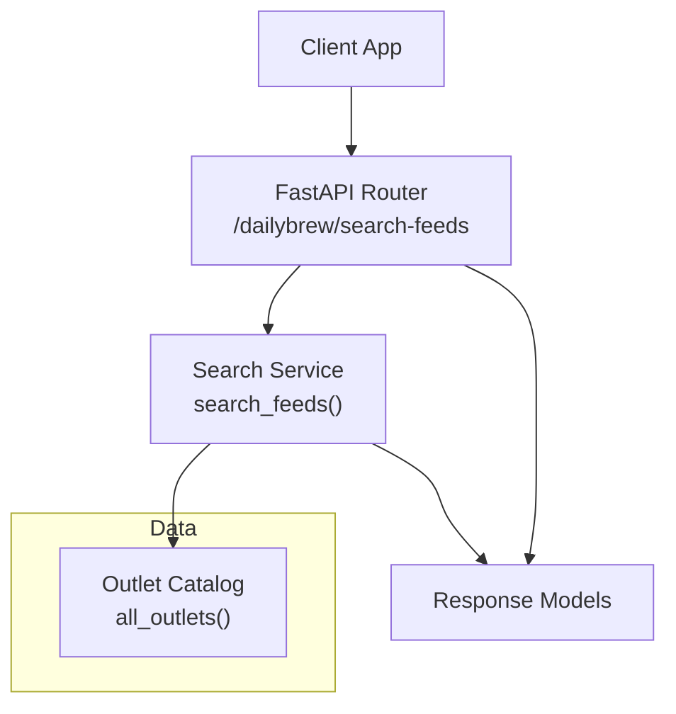
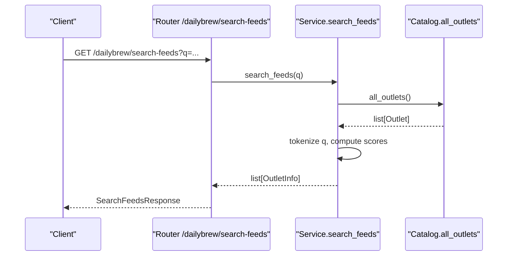
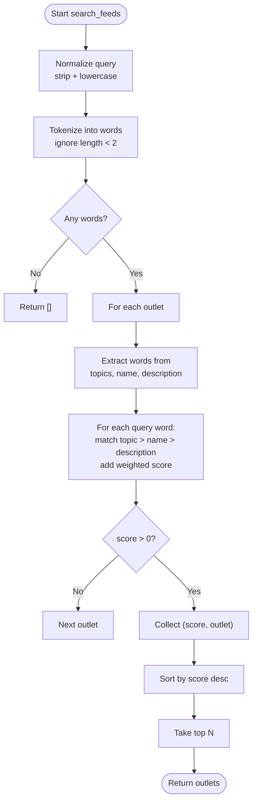
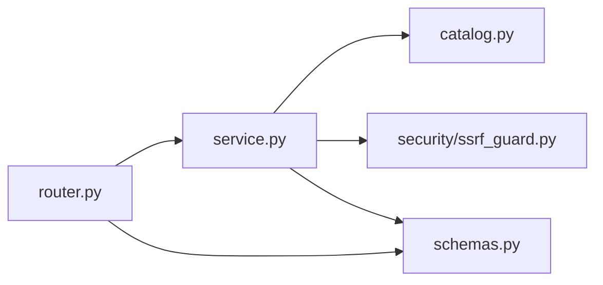

# Feed Search & Discovery

<cite>
**Referenced Files in This Document**
- [catalog.py](file://dailybrew/catalog.py)
- [service.py](file://dailybrew/service.py)
- [router.py](file://dailybrew/router.py)
- [schemas.py](file://dailybrew/schemas.py)
- [ssrf_guard.py](file://security/ssrf_guard.py)
</cite>

## Table of Contents
1. [Introduction](#introduction)
2. [Project Structure](#project-structure)
3. [Core Components](#core-components)
4. [Architecture Overview](#architecture-overview)
5. [Detailed Component Analysis](#detailed-component-analysis)
6. [Dependency Analysis](#dependency-analysis)
7. [Performance Considerations](#performance-considerations)
8. [Troubleshooting Guide](#troubleshooting-guide)
9. [Conclusion](#conclusion)
10. [Appendices](#appendices)

## Introduction
This document explains the feed search and discovery system that helps users find relevant news outlets. It covers how free-text queries are processed, how both the curated country catalog and topic-focused pools are searched, how results are scored and ranked, and how results are presented to users. It also includes guidance on query examples, interpreting results, discovering new outlets, performance optimizations, caching behavior, and handling ambiguous or broad terms.

## Project Structure
The search feature is implemented across a small set of focused modules:
- Catalog data defines the known outlets (country-scoped and topic-focused).
- Service implements the search algorithm, result ranking, and feed fetching/caching.
- Router exposes HTTP endpoints for searching and retrieving outlet metadata.
- Schemas define request/response models.
- Security guard protects outbound requests from SSRF risks when validating custom feeds.

**Diagram sources**
- [router.py:27-39](file://dailybrew/router.py#L27-L39)
- [service.py:311-355](file://dailybrew/service.py#L311-L355)
- [catalog.py:267-273](file://dailybrew/catalog.py#L267-L273)
- [schemas.py:18-31](file://dailybrew/schemas.py#L18-L31)

**Section sources**
- [router.py:1-102](file://dailybrew/router.py#L1-L102)
- [service.py:1-356](file://dailybrew/service.py#L1-L356)
- [catalog.py:1-281](file://dailybrew/catalog.py#L1-L281)
- [schemas.py:1-41](file://dailybrew/schemas.py#L1-L41)

## Core Components
- Outlet model: Represents a news outlet with id, name, description, feed URL, and optional topics used for search relevance.
- Curated catalog: Country-specific lists of verified RSS/Atom feeds.
- Topic pool: A curated list of topic-focused feeds tagged with topics like AI, Technology, Business, Sports, Health, etc.
- Search function: Processes free-text input into tokens and scores outlets by matching against topics, names, and descriptions.
- Endpoints: Provide search suggestions and outlet metadata resolution.

Key responsibilities:
- Catalog: Define all known outlets and provide a combined view for search.
- Service: Implement search scoring, ranking, and feed retrieval with caching.
- Router: Expose search and outlet lookup APIs with proper request/response schemas.
- Security: Validate user-provided feed URLs safely before saving them as custom feeds.

**Section sources**
- [catalog.py:4-281](file://dailybrew/catalog.py#L4-L281)
- [service.py:311-355](file://dailybrew/service.py#L311-L355)
- [router.py:27-57](file://dailybrew/router.py#L27-L57)
- [schemas.py:18-31](file://dailybrew/schemas.py#L18-L31)

## Architecture Overview
The search flow starts at the router endpoint, which delegates to the service’s search function. The service tokenizes the query, scans the full outlet catalog (country + topic), computes per-word scores based on match specificity, sorts by score, and returns the top results.

**Diagram sources**
- [router.py:27-39](file://dailybrew/router.py#L27-L39)
- [service.py:311-355](file://dailybrew/service.py#L311-L355)
- [catalog.py:267-273](file://dailybrew/catalog.py#L267-L273)
- [schemas.py:18-31](file://dailybrew/schemas.py#L18-L31)

## Detailed Component Analysis

### Search Query Processing
- Input normalization: The query is stripped and lowercased.
- Tokenization: Words are extracted using a simple regex that keeps alphanumeric sequences; single-character tokens are ignored.
- Field preparation: For each outlet, words are extracted from its name, description, and topics. Topics are expanded into individual words.

Behavioral notes:
- Phrase matching is not required; each word is matched independently.
- Matching is prefix-based on whole words (e.g., “movie” matches “movies”), avoiding accidental substring hits inside unrelated words.
- Very short or non-alphanumeric inputs return no results.

**Section sources**
- [service.py:307-334](file://dailybrew/service.py#L307-L334)

### Scoring and Ranking Algorithm
- Per-word scoring weights:
  - Topic tag match: highest weight
  - Name match: medium weight
  - Description match: lowest weight
- Each word contributes to the total score only once per outlet; multiple matches within the same field do not multiply the score.
- Results are sorted by descending score and limited to the requested number of outlets.

Implications:
- Topic tags strongly influence relevance, making topic-focused pools especially effective for domain-specific queries.
- Generic words (e.g., “news”) have low impact unless they appear in a topic or name.
- Ambiguous or broad queries will still rank outlets with any partial word match, but high-weight topic matches will rise to the top.

**Diagram sources**
- [service.py:311-355](file://dailybrew/service.py#L311-L355)

**Section sources**
- [service.py:311-355](file://dailybrew/service.py#L311-L355)

### Data Sources: Catalog and Topic Pool
- Curated country catalog: Verified RSS/Atom feeds grouped by country code. These are server-owned and easy to update without client releases.
- Topic pool: A curated set of feeds tagged with topics such as AI, Technology, Business, Finance, Sports, Health, Entertainment, Music, Games, Science, Food, Recipes, Christian, Faith, World.
- Combined view: Search operates over the union of both sources so users can discover both local and topic-relevant outlets.

Practical effect:
- Queries like “AI” or “food” surface specialized topic feeds even if they are not in the user’s country catalog.
- Country-specific outlets may also be surfaced if their name/description/topics match the query.

**Section sources**
- [catalog.py:15-82](file://dailybrew/catalog.py#L15-L82)
- [catalog.py:84-264](file://dailybrew/catalog.py#L84-L264)
- [catalog.py:267-273](file://dailybrew/catalog.py#L267-L273)

### API Endpoints and Presentation
- Search endpoint: Accepts a query parameter and returns up to five suggested outlets with id, name, description, and topics.
- Outlets-by-id endpoint: Resolves specific outlet ids to display info, including topic-pool feeds and user-added custom feeds.
- Response schema: Uses consistent models for outlet information and search responses.

Usage pattern:
- Clients call the search endpoint with a free-text query to populate a suggestion list.
- When a user selects an outlet, the client adds its id to the user’s saved outlets.
- To show what is already selected, clients call the outlets-by-id endpoint with comma-separated ids.

**Section sources**
- [router.py:27-57](file://dailybrew/router.py#L27-L57)
- [schemas.py:18-31](file://dailybrew/schemas.py#L18-L31)

### Custom Feeds and Safety
- Users can add any RSS/Atom feed URL. Before saving, the server validates it by performing a safe fetch and extracting the feed title.
- SSRF protection: Every hop of a redirect is validated to ensure the scheme is http/https and the resolved IP is public (no private/internal ranges).
- If validation fails, a user-friendly error is returned.

Operational note:
- Custom feeds are treated like other outlets in search and headline aggregation, enabling personalized discovery beyond the curated sets.

**Section sources**
- [router.py:60-88](file://dailybrew/router.py#L60-L88)
- [service.py:134-158](file://dailybrew/service.py#L134-L158)
- [ssrf_guard.py:1-109](file://security/ssrf_guard.py#L1-L109)

## Dependency Analysis
- Router depends on service functions for search and outlet resolution.
- Service depends on catalog for the complete set of outlets and on security utilities for safe network access.
- Schemas define the contract between router and clients.

**Diagram sources**
- [router.py:1-102](file://dailybrew/router.py#L1-L102)
- [service.py:1-356](file://dailybrew/service.py#L1-L356)
- [catalog.py:1-281](file://dailybrew/catalog.py#L1-L281)
- [ssrf_guard.py:1-109](file://security/ssrf_guard.py#L1-L109)
- [schemas.py:1-41](file://dailybrew/schemas.py#L1-L41)

**Section sources**
- [router.py:1-102](file://dailybrew/router.py#L1-L102)
- [service.py:1-356](file://dailybrew/service.py#L1-L356)
- [catalog.py:1-281](file://dailybrew/catalog.py#L1-L281)
- [ssrf_guard.py:1-109](file://security/ssrf_guard.py#L1-L109)
- [schemas.py:1-41](file://dailybrew/schemas.py#L1-L41)

## Performance Considerations
- Search complexity: The search iterates over all known outlets and performs lightweight string operations per outlet. With a modest catalog size, this is fast and suitable for real-time UI suggestions.
- Query tokenization: Single-character tokens are filtered out to reduce noise and improve performance.
- Prefix matching: Using prefix checks avoids expensive full-text searches while still supporting flexible queries.
- Result limiting: The default limit caps response size and reduces downstream processing on the client.

Optimization opportunities:
- Indexing: If the catalog grows significantly, consider building inverted indexes for topics, names, and descriptions to speed up lookups.
- Precomputation: Precompute normalized word sets per outlet to avoid repeated tokenization during search.
- Caching: While search itself is lightweight, consider caching frequent queries if traffic increases.

[No sources needed since this section provides general guidance]

## Troubleshooting Guide
Common issues and resolutions:
- Empty results:
  - Ensure the query contains at least two-letter words; very short or non-alphanumeric inputs return no results.
  - Broad terms like “news” may yield few results due to low weighting; try adding more specific terms or topics.
- Unexpected matches:
  - Prefix matching means “movie” matches “movies”. If you see unexpected results, refine your query with more specific words.
- Custom feed validation errors:
  - Invalid schemes (non-http/https) are rejected.
  - Unreachable hosts or redirects to internal/private IPs are blocked for safety.
  - Non-RSS/Atom content is rejected; ensure the URL points to a valid feed.

Diagnostics:
- Check the query string for typos or overly generic terms.
- Verify that the feed URL is publicly accessible and returns a parseable RSS/Atom document.
- Review error messages returned by the custom feed endpoint for precise failure reasons.

**Section sources**
- [service.py:307-334](file://dailybrew/service.py#L307-L334)
- [service.py:134-158](file://dailybrew/service.py#L134-L158)
- [ssrf_guard.py:33-48](file://security/ssrf_guard.py#L33-L48)
- [ssrf_guard.py:50-65](file://security/ssrf_guard.py#L50-L65)
- [ssrf_guard.py:67-109](file://security/ssrf_guard.py#L67-L109)

## Conclusion
The feed search and discovery system combines a curated country catalog with a topic-focused pool to help users quickly find relevant news outlets. Free-text queries are tokenized and scored with a clear weighting strategy that prioritizes topic matches, followed by name and description matches. Results are ranked and limited to keep responses concise. The system is designed to be fast, safe, and extensible, with room for future optimizations such as indexing and query caching.

[No sources needed since this section summarizes without analyzing specific files]

## Appendices

### Example Queries and Expected Behavior
- “AI”: Likely surfaces outlets tagged with AI or Technology topics; high relevance due to topic weighting.
- “global news”: May surface world-focused outlets; expect topic-driven results if available.
- “food” or “recipes”: Surfaces food-related topic feeds; strong topic matches increase ranking.
- “business finance”: Combines two related terms; business and finance topic tags will boost relevant outlets.

Tips for effective discovery:
- Use specific topic keywords to leverage topic weighting.
- Combine terms to narrow results (e.g., “AI technology”).
- Explore the topic pool by trying domain-specific terms even if they are not in your country catalog.

[No sources needed since this section provides general guidance]

### Caching and Background Prewarming
- RSS feed items are cached in memory per outlet with a time-to-live to avoid repeated network calls.
- A background prewarmer periodically refreshes cached items so user-facing news endpoints read from cache.
- Note: This caching applies to feed item retrieval, not to search suggestions. Search suggestions are computed in-memory and are already fast.

Operational implications:
- Cold start delays are minimized by prewarming.
- Network failures fall back to the last-known-good cache to maintain availability.

**Section sources**
- [service.py:20-33](file://dailybrew/service.py#L20-L33)
- [service.py:168-207](file://dailybrew/service.py#L168-L207)
- [service.py:209-221](file://dailybrew/service.py#L209-L221)