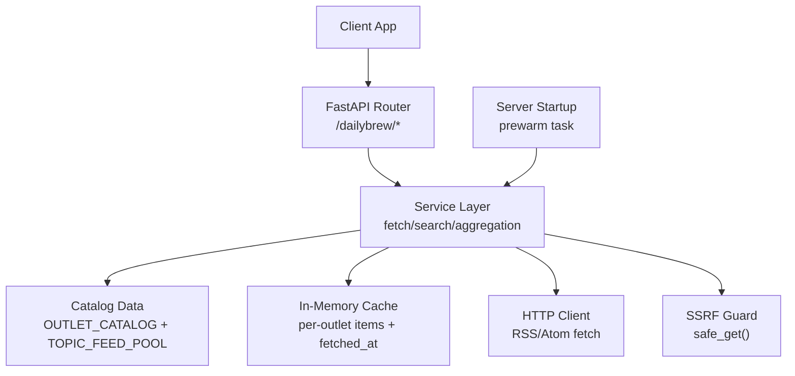
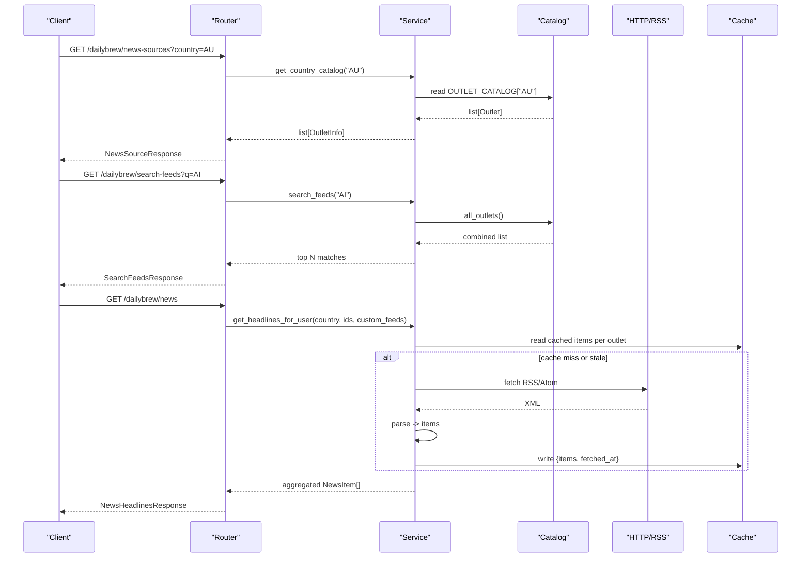
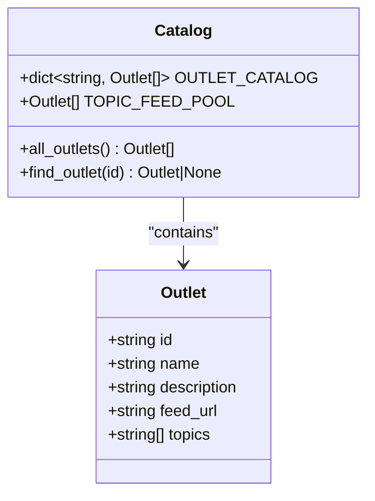
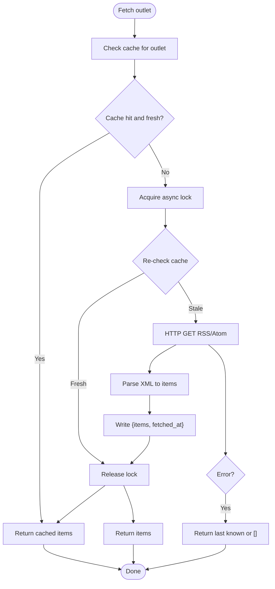
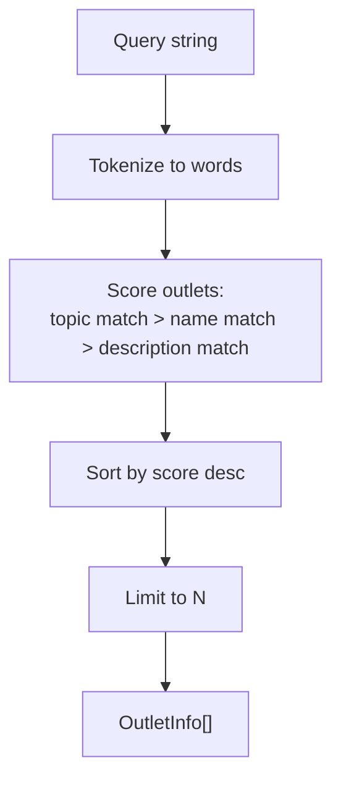
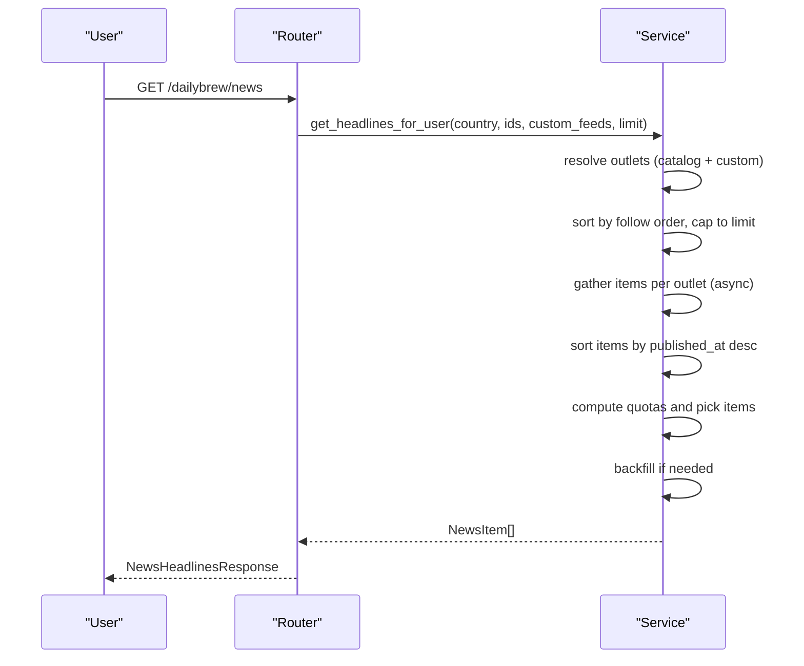
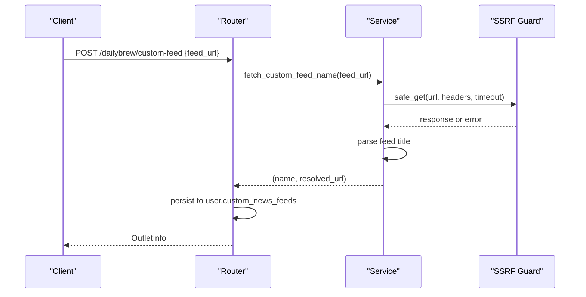
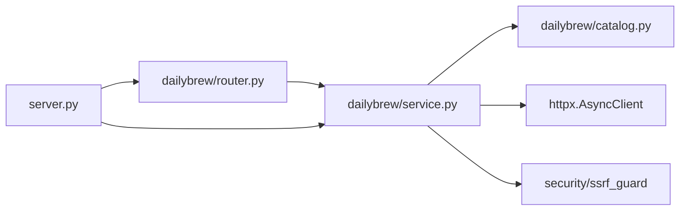

# News Catalog Management

<cite>
**Referenced Files in This Document**
- [catalog.py](file://dailybrew/catalog.py)
- [service.py](file://dailybrew/service.py)
- [router.py](file://dailybrew/router.py)
- [schemas.py](file://dailybrew/schemas.py)
- [server.py](file://server.py)
</cite>

## Table of Contents
1. [Introduction](#introduction)
2. [Project Structure](#project-structure)
3. [Core Components](#core-components)
4. [Architecture Overview](#architecture-overview)
5. [Detailed Component Analysis](#detailed-component-analysis)
6. [Dependency Analysis](#dependency-analysis)
7. [Performance Considerations](#performance-considerations)
8. [Troubleshooting Guide](#troubleshooting-guide)
9. [Conclusion](#conclusion)
10. [Appendices](#appendices)

## Introduction
This document explains the News Catalog Management system that powers curated, country-specific news outlets and topic-based feeds for the Daily Brew feature. It covers:
- How the catalog is structured (country-scoped lists and a topic feed pool)
- The data model for outlets and news items
- Loading mechanisms, caching strategy, and background prewarming
- Adding new outlets and maintaining the catalog
- Querying and filtering by country and topics
- Integration with search and user preferences
- Validation, error handling, and performance considerations for large catalogs

## Project Structure
The Daily Brew feature is implemented under dailybrew/ and integrated into the FastAPI application via server.py. Key responsibilities:
- catalog.py: Defines the Outlet dataclass and the two sources of truth for outlets: per-country OUTLET_CATALOG and global TOPIC_FEED_POOL. Also provides helpers to enumerate all outlets and find one by id.
- service.py: Implements fetching, parsing RSS/Atom feeds, in-memory caching with TTL, search, headline aggregation, and background cache prewarming.
- router.py: Exposes REST endpoints for listing country outlets, searching feeds, resolving outlet ids (including custom feeds), adding a custom feed, and retrieving aggregated headlines.
- schemas.py: Pydantic models for API request/response payloads.
- server.py: Wires routers into the app and starts the background cache prewarmer on startup.

**Diagram sources**
- [router.py:15-101](file://dailybrew/router.py#L15-L101)
- [service.py:134-207](file://dailybrew/service.py#L134-L207)
- [catalog.py:29-281](file://dailybrew/catalog.py#L29-L281)
- [server.py:435-438](file://server.py#L435-L438)

**Section sources**
- [catalog.py:1-281](file://dailybrew/catalog.py#L1-L281)
- [service.py:1-356](file://dailybrew/service.py#L1-L356)
- [router.py:1-102](file://dailybrew/router.py#L1-L102)
- [schemas.py:1-41](file://dailybrew/schemas.py#L1-L41)
- [server.py:203-205](file://server.py#L203-L205)
- [server.py:435-438](file://server.py#L435-L438)

## Core Components
- Outlet data model: Immutable record with id, name, description, feed_url, and optional topics used for loose content tagging.
- Country catalog: A dictionary keyed by ISO 3166-1 alpha-2 codes mapping to lists of Outlet instances.
- Topic feed pool: A flat list of Outlet instances not scoped to any country, surfaced via search.
- Search and aggregation: Word-based scoring across topics, names, and descriptions; headline distribution across followed outlets; sorting by published time.
- Caching: Per-outlet in-memory cache with TTL and async lock to avoid thundering herds.
- Background prewarming: Periodic refresh of all curated outlets to keep responses fast.

**Section sources**
- [catalog.py:4-13](file://dailybrew/catalog.py#L4-L13)
- [catalog.py:29-82](file://dailybrew/catalog.py#L29-L82)
- [catalog.py:88-264](file://dailybrew/catalog.py#L88-L264)
- [service.py:20-33](file://dailybrew/service.py#L20-L33)
- [service.py:168-207](file://dailybrew/service.py#L168-L207)
- [service.py:227-284](file://dailybrew/service.py#L227-L284)
- [service.py:311-356](file://dailybrew/service.py#L311-L356)

## Architecture Overview
The system exposes a small set of endpoints to manage and consume the news catalog:
- GET /dailybrew/news-sources?country=XX: Returns curated outlets for a given country.
- GET /dailybrew/search-feeds?q=...: Suggests outlets matching free-text queries across both country and topic pools.
- GET /dailybrew/outlets?ids=...: Resolves specific outlet ids (including custom feeds) to display info.
- POST /dailybrew/custom-feed: Adds a user’s own RSS/Atom feed after live validation.
- GET /dailybrew/news: Aggregates headlines from the user’s followed outlets (and custom feeds), applying distribution rules and limits.

**Diagram sources**
- [router.py:15-101](file://dailybrew/router.py#L15-L101)
- [service.py:227-284](file://dailybrew/service.py#L227-L284)
- [service.py:311-356](file://dailybrew/service.py#L311-L356)
- [catalog.py:267-281](file://dailybrew/catalog.py#L267-L281)

## Detailed Component Analysis

### Data Model and Catalog Structure
- Outlet: Frozen dataclass with fields id, name, description, feed_url, and topics (optional). Used uniformly for both country-cataloged and topic-pool outlets.
- Country catalog: Dictionary keyed by uppercase ISO country code mapping to lists of Outlet. Each entry was verified at implementation time to return parseable RSS/Atom.
- Topic feed pool: Global list of Outlet entries tagged with topics for discovery via search.

**Diagram sources**
- [catalog.py:4-13](file://dailybrew/catalog.py#L4-L13)
- [catalog.py:29-82](file://dailybrew/catalog.py#L29-L82)
- [catalog.py:88-264](file://dailybrew/catalog.py#L88-L264)
- [catalog.py:267-281](file://dailybrew/catalog.py#L267-L281)

**Section sources**
- [catalog.py:4-13](file://dailybrew/catalog.py#L4-L13)
- [catalog.py:29-82](file://dailybrew/catalog.py#L29-L82)
- [catalog.py:88-264](file://dailybrew/catalog.py#L88-L264)
- [catalog.py:267-281](file://dailybrew/catalog.py#L267-L281)

### Loading Mechanisms and Caching Strategy
- In-memory cache: Per outlet stores items and fetched timestamp. TTL is configured to avoid frequent network calls.
- Concurrency control: An async lock prevents duplicate concurrent fetches for the same outlet.
- Prewarming: On startup, a background task periodically fetches all curated outlets to keep the cache warm.
- Fallback behavior: On network or parse errors, returns last-known-good items or empty list so UI remains functional.

**Diagram sources**
- [service.py:20-33](file://dailybrew/service.py#L20-L33)
- [service.py:168-207](file://dailybrew/service.py#L168-L207)
- [service.py:205-221](file://dailybrew/service.py#L205-L221)

**Section sources**
- [service.py:20-33](file://dailybrew/service.py#L20-L33)
- [service.py:168-207](file://dailybrew/service.py#L168-L207)
- [service.py:205-221](file://dailybrew/service.py#L205-L221)

### Search and Filtering
- Search algorithm: Tokenizes query words (minimum length 2), scores each outlet by prefix matches in topics (highest weight), then name, then description. Returns top N results.
- Country filtering: The /news-sources endpoint filters by country using the catalog key.
- Topic filtering: Not exposed as a direct filter; topics are used for search relevance and can be surfaced in responses.

**Diagram sources**
- [service.py:307-356](file://dailybrew/service.py#L307-L356)

**Section sources**
- [service.py:307-356](file://dailybrew/service.py#L307-L356)
- [router.py:15-39](file://dailybrew/router.py#L15-L39)

### Headline Aggregation and Distribution
- Input: User’s selected outlet ids (from country catalog, search suggestions, or custom feeds).
- Fetch: Concurrently fetches each outlet’s items (cache-aware).
- Sorting: Items sorted by published date descending; undated items sort last.
- Distribution: Prioritizes earlier-followed outlets; quotas ensure fair spread when multiple outlets are followed. Backfills remaining slots from leftover items to meet the limit.

**Diagram sources**
- [service.py:227-284](file://dailybrew/service.py#L227-L284)
- [router.py:91-101](file://dailybrew/router.py#L91-L101)

**Section sources**
- [service.py:227-284](file://dailybrew/service.py#L227-L284)
- [router.py:91-101](file://dailybrew/router.py#L91-L101)

### Custom Feeds and Validation
- Users can add their own RSS/Atom feed URL.
- Live validation: Performs a safe GET (with SSRF protection), verifies it parses as RSS/Atom, and captures the feed title as the display name. Redirects are resolved to stable URLs.
- Storage: Saved in user profile; later included in outlet resolution and headline aggregation.

**Diagram sources**
- [router.py:60-88](file://dailybrew/router.py#L60-L88)
- [service.py:134-158](file://dailybrew/service.py#L134-L158)

**Section sources**
- [router.py:60-88](file://dailybrew/router.py#L60-L88)
- [service.py:134-158](file://dailybrew/service.py#L134-L158)

### API Endpoints Summary
- GET /dailybrew/news-sources?country=XX: Returns country-scoped outlets.
- GET /dailybrew/search-feeds?q=...: Returns suggested outlets based on text search.
- GET /dailybrew/outlets?ids=...: Resolves outlet ids to full info (including custom feeds).
- POST /dailybrew/custom-feed: Validates and adds a custom RSS/Atom feed.
- GET /dailybrew/news: Returns aggregated headlines for the authenticated user.

**Section sources**
- [router.py:15-101](file://dailybrew/router.py#L15-L101)
- [schemas.py:6-41](file://dailybrew/schemas.py#L6-L41)

## Dependency Analysis
- Router depends on service functions for business logic and on schemas for I/O types.
- Service depends on catalog for static data and uses httpx for outbound requests, protected by ssrf_guard.
- Server wires routers and starts the background prewarmer task.

**Diagram sources**
- [router.py:1-102](file://dailybrew/router.py#L1-102)
- [service.py:1-17](file://dailybrew/service.py#L1-L17)
- [server.py:203-205](file://server.py#L203-L205)
- [server.py:435-438](file://server.py#L435-L438)

**Section sources**
- [router.py:1-102](file://dailybrew/router.py#L1-L102)
- [service.py:1-17](file://dailybrew/service.py#L1-L17)
- [server.py:203-205](file://server.py#L203-L205)
- [server.py:435-438](file://server.py#L435-L438)

## Performance Considerations
- Cache TTL: Configured to reduce redundant fetches; tuned to balance freshness and load.
- Async concurrency: Outlets are fetched concurrently to minimize latency.
- Locking: Prevents thundering herd on cache misses.
- Prewarming: Background task keeps caches warm; runs more frequently than TTL to avoid staleness.
- Parsing efficiency: Minimal XML parsing with early exits for invalid entries.
- Scaling note: Current in-memory cache is suitable for single-replica deployments; consider shared short-TTL storage if scaling horizontally.

[No sources needed since this section provides general guidance]

## Troubleshooting Guide
Common issues and how they are handled:
- Unreachable or blocked feeds: Network errors fall back to last-known-good cache or empty list; logs capture failures.
- Invalid or non-RSS/Atom URLs: Custom feed addition raises a client error with a user-facing message.
- Malformed timestamps: Normalized to UTC or treated as undated to avoid comparison errors.
- SSRF protection: All outbound requests go through a guard that validates schemes and resolves redirects safely.

Operational tips:
- Verify feed URLs remain valid; update catalog entries when providers change endpoints.
- Monitor logs for fetch/parse errors to identify failing outlets.
- Adjust cache TTL if you need fresher content at the cost of higher external traffic.

**Section sources**
- [service.py:134-158](file://dailybrew/service.py#L134-L158)
- [service.py:168-207](file://dailybrew/service.py#L168-L207)
- [service.py:35-45](file://dailybrew/service.py#L35-L45)

## Conclusion
The News Catalog Management system provides a robust, cache-backed mechanism to serve curated country-specific outlets and topic-based feeds. It balances freshness and performance with in-memory caching, background prewarming, and resilient fallbacks. The design supports easy maintenance of the catalog, flexible search and filtering, and safe integration points for user-provided feeds.

[No sources needed since this section summarizes without analyzing specific files]

## Appendices

### How to Add a New Outlet
- For country-specific outlets:
  - Add an Outlet instance to the appropriate country list in the catalog module.
  - Ensure the feed_url returns a parseable RSS/Atom feed.
  - Optionally include topics for improved search relevance.
- For topic-focused outlets:
  - Add an Outlet instance to the topic feed pool with relevant topics.
- Validate:
  - Confirm the feed is reachable and parseable.
  - Test search results and country listings.

**Section sources**
- [catalog.py:29-82](file://dailybrew/catalog.py#L29-L82)
- [catalog.py:88-264](file://dailybrew/catalog.py#L88-L264)

### Example Queries and Filtering
- List outlets for a country:
  - GET /dailybrew/news-sources?country=AU
- Search for topic-related outlets:
  - GET /dailybrew/search-feeds?q=AI
- Resolve specific outlets (including custom):
  - GET /dailybrew/outlets?ids=abc-news-au,techcrunch-ai
- Get aggregated headlines:
  - GET /dailybrew/news

**Section sources**
- [router.py:15-101](file://dailybrew/router.py#L15-L101)

### Maintenance Procedures
- Periodically verify feed URLs and update entries when providers change endpoints.
- Remove or replace dead feeds promptly to maintain quality.
- Review search relevance and adjust topics as needed.
- Monitor cache metrics and adjust TTL if necessary.

**Section sources**
- [catalog.py:15-28](file://dailybrew/catalog.py#L15-L28)
- [service.py:20-33](file://dailybrew/service.py#L20-L33)