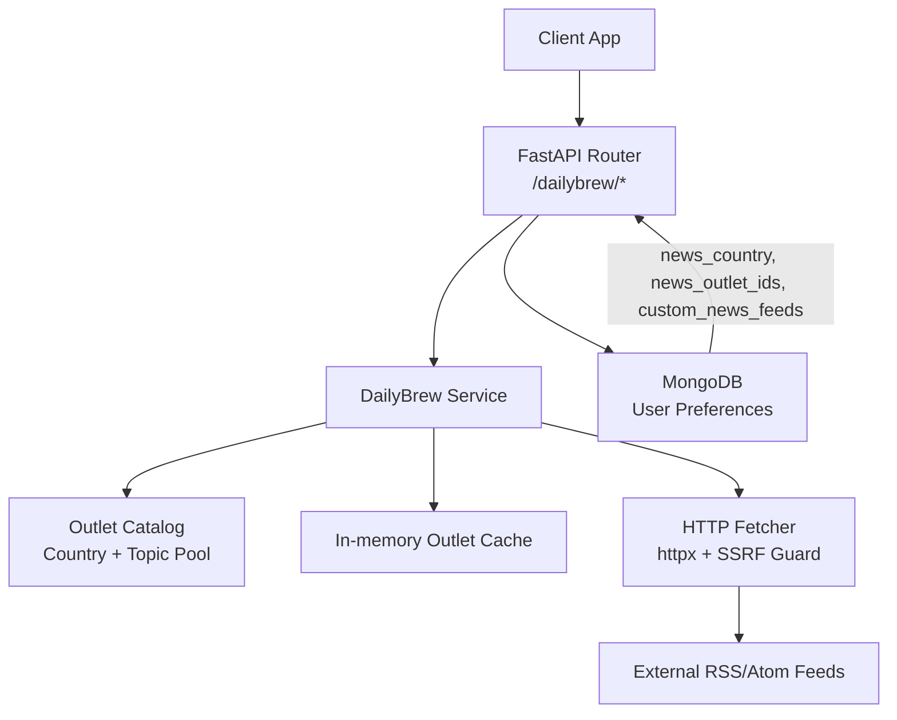
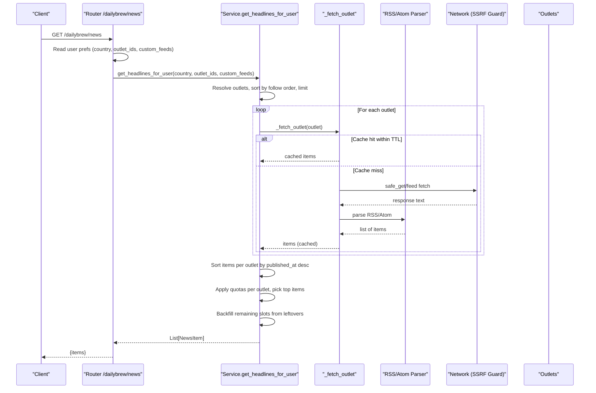
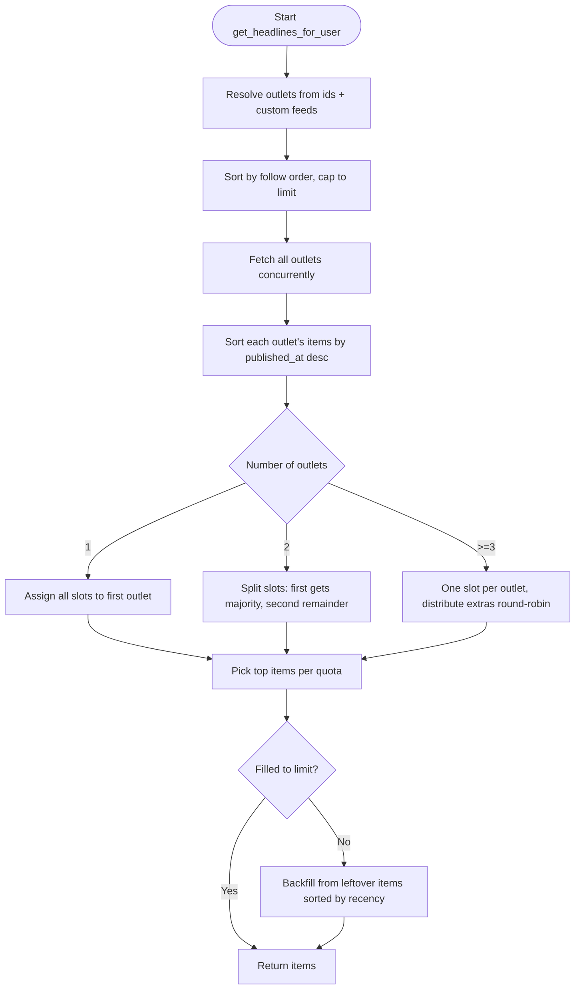
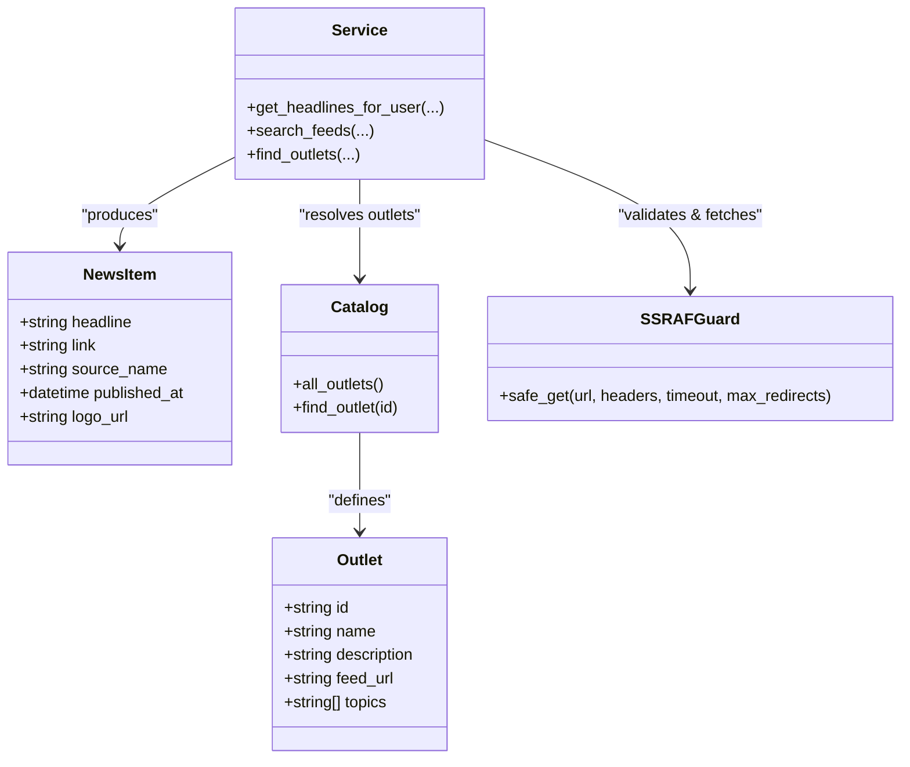
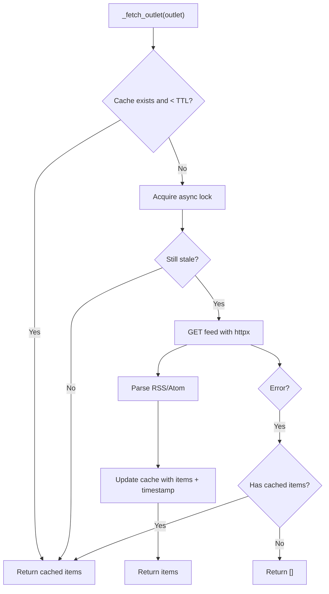
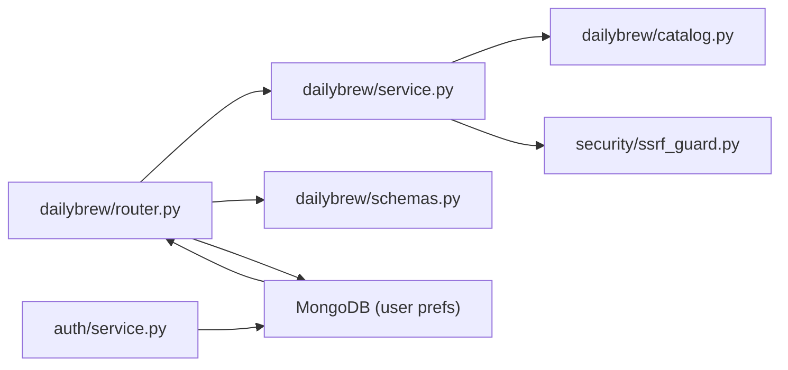

# Personalized Feed Generation

<cite>
**Referenced Files in This Document**
- [dailybrew/service.py](file://dailybrew/service.py)
- [dailybrew/router.py](file://dailybrew/router.py)
- [dailybrew/catalog.py](file://dailybrew/catalog.py)
- [dailybrew/schemas.py](file://dailybrew/schemas.py)
- [security/ssrf_guard.py](file://security/ssrf_guard.py)
- [auth/service.py](file://auth/service.py)
</cite>

## Table of Contents
1. [Introduction](#introduction)
2. [Project Structure](#project-structure)
3. [Core Components](#core-components)
4. [Architecture Overview](#architecture-overview)
5. [Detailed Component Analysis](#detailed-component-analysis)
6. [Dependency Analysis](#dependency-analysis)
7. [Performance Considerations](#performance-considerations)
8. [Troubleshooting Guide](#troubleshooting-guide)
9. [Conclusion](#conclusion)
10. [Appendices](#appendices)

## Introduction
This document explains the personalized feed generation system that assembles individualized news headlines from curated country catalogs, topic-focused feeds, and user-added custom RSS/Atom sources. It covers how user preferences (country, selected outlets, custom feeds) are combined, how feeds are fetched and parsed, how items are ranked and deduplicated, and how reliability is maintained through caching, fallbacks, and SSRF-safe fetching. It also documents configuration examples, preference management, freshness policies, and error handling strategies.

## Project Structure
The feed system spans a small set of focused modules:
- Router exposes REST endpoints for browsing sources, searching feeds, adding custom feeds, and retrieving the personalized feed.
- Service implements feed aggregation, parsing, ranking, and caching logic.
- Catalog defines curated outlets by country and a topic pool used for search suggestions.
- Schemas define request/response models.
- Security provides SSRF protection for any user-supplied URLs.
- Auth service persists and returns user preferences including country, outlet selections, and Daily Brew toggles.

**Diagram sources**
- [dailybrew/router.py:15-101](file://dailybrew/router.py#L15-L101)
- [dailybrew/service.py:168-284](file://dailybrew/service.py#L168-L284)
- [dailybrew/catalog.py:29-281](file://dailybrew/catalog.py#L29-L281)
- [security/ssrf_guard.py:67-109](file://security/ssrf_guard.py#L67-L109)
- [auth/service.py:402-422](file://auth/service.py#L402-L422)

**Section sources**
- [dailybrew/router.py:15-101](file://dailybrew/router.py#L15-L101)
- [dailybrew/service.py:168-284](file://dailybrew/service.py#L168-L284)
- [dailybrew/catalog.py:29-281](file://dailybrew/catalog.py#L29-L281)
- [dailybrew/schemas.py:6-41](file://dailybrew/schemas.py#L6-L41)
- [security/ssrf_guard.py:67-109](file://security/ssrf_guard.py#L67-L109)
- [auth/service.py:402-422](file://auth/service.py#L402-L422)

## Core Components
- Outlet catalog: Curated per-country lists and a topic-focused pool with verified RSS/Atom endpoints.
- Feed fetcher and parser: Async HTTP fetch with timeout and user-agent; parses both RSS and Atom into normalized items.
- Aggregation and ranking: Combines items from selected outlets, sorts by publish time, applies quotas per outlet to preserve user priority, and backfills slots from leftover items.
- Caching: Per-outlet in-memory cache with TTL to avoid repeated network calls.
- Custom feeds: User-submitted RSS/Atom URLs validated via live fetch and saved alongside curated outlets.
- Preference persistence: Country and outlet selections stored per user; custom feeds stored per user.

Key responsibilities by file:
- dailybrew/router.py: Endpoints for sources, search, outlets resolution, custom feed addition, and personalized feed retrieval.
- dailybrew/service.py: Aggregation algorithm, parsing, caching, prewarming, search scoring, and custom feed validation.
- dailybrew/catalog.py: Outlet definitions and lookup helpers.
- dailybrew/schemas.py: Pydantic models for requests/responses.
- security/ssrf_guard.py: Safe URL fetching with scheme checks, DNS rebinding protection, and redirect validation.
- auth/service.py: Update and return of user preferences including news_country, news_outlet_ids, and Daily Brew flags.

**Section sources**
- [dailybrew/router.py:15-101](file://dailybrew/router.py#L15-L101)
- [dailybrew/service.py:48-284](file://dailybrew/service.py#L48-L284)
- [dailybrew/catalog.py:5-281](file://dailybrew/catalog.py#L5-L281)
- [dailybrew/schemas.py:6-41](file://dailybrew/schemas.py#L6-L41)
- [security/ssrf_guard.py:67-109](file://security/ssrf_guard.py#L67-L109)
- [auth/service.py:402-422](file://auth/service.py#L402-L422)

## Architecture Overview
The system composes a personalized feed by:
1. Loading user preferences (country, selected outlet IDs, custom feeds).
2. Resolving those IDs to concrete outlets from the catalog or custom feeds.
3. Fetching each outlet’s RSS/Atom feed concurrently with caching and fallbacks.
4. Sorting items by publish date and distributing them across outlets using quotas that respect user ordering.
5. Backfilling remaining slots from leftover items to maintain headline count.
6. Returning normalized NewsItem objects.

**Diagram sources**
- [dailybrew/router.py:91-101](file://dailybrew/router.py#L91-L101)
- [dailybrew/service.py:227-284](file://dailybrew/service.py#L227-L284)
- [dailybrew/service.py:168-202](file://dailybrew/service.py#L168-L202)
- [dailybrew/service.py:93-117](file://dailybrew/service.py#L93-L117)
- [security/ssrf_guard.py:67-109](file://security/ssrf_guard.py#L67-L109)

## Detailed Component Analysis

### Feed Aggregation Algorithm
- Input: user’s country (for default suggestions), ordered list of outlet IDs, optional custom feeds, and a limit for total headlines.
- Resolution: Select outlets whose IDs match either curated catalog entries or user’s custom feeds. Preserve the user’s follow order. Cap participation to the first `limit` outlets to match client-side caps.
- Fetching: Concurrently fetch each outlet’s feed with async concurrency. Each fetch uses an in-memory cache keyed by outlet ID with a TTL. On failure, falls back to last-known-good cache or empty list so slow/dead feeds do not break the card.
- Sorting: Items per outlet are sorted by publish time descending; undated items sort last.
- Quotas: Distribute headline slots across outlets to honor user priority:
  - One outlet: all slots go to it.
  - Two outlets: first gets majority share, second gets remainder.
  - Three or more: one slot per outlet initially, then distribute extra slots round-robin to early outlets.
- Backfill: If some outlets lack enough fresh items, fill remaining slots from leftover items across all outlets, preserving recency.
- Output: Up to `limit` normalized NewsItem objects.

**Diagram sources**
- [dailybrew/service.py:227-284](file://dailybrew/service.py#L227-L284)
- [dailybrew/service.py:35-45](file://dailybrew/service.py#L35-L45)

**Section sources**
- [dailybrew/service.py:227-284](file://dailybrew/service.py#L227-L284)
- [dailybrew/service.py:35-45](file://dailybrew/service.py#L35-L45)

### Content Deduplication Strategy
- The current implementation does not perform cross-outlet deduplication by link or title. Items are aggregated per outlet and merged based on quotas and backfill. If deduplication is required in the future, consider normalizing links and applying a set-based filter before final selection.

[No sources needed since this section describes current behavior and future considerations without analyzing specific files]

### Ranking Mechanisms
- Primary ranking: Recency via published_at timestamp, normalized to UTC-aware datetimes where possible; undated items sort last.
- Secondary influence: User’s follow order determines which outlets contribute first when quotas are applied.

**Section sources**
- [dailybrew/service.py:35-45](file://dailybrew/service.py#L35-L45)
- [dailybrew/service.py:247-284](file://dailybrew/service.py#L247-L284)

### External API Integration and RSS/Atom Parsing
- RSS parsing: Extracts title, link, and pubDate; handles malformed dates gracefully.
- Atom parsing: Handles namespace-qualified tags, extracts title, link href, and published/updated timestamps.
- Network layer: Uses httpx with a browser-like User-Agent and short timeouts; errors are logged and handled gracefully.
- SSRF protection: Custom feed validation uses a safe GET that enforces allowed schemes, validates public IPs, and re-validates on every redirect hop.

**Diagram sources**
- [dailybrew/catalog.py:5-13](file://dailybrew/catalog.py#L5-L13)
- [dailybrew/schemas.py:6-12](file://dailybrew/schemas.py#L6-L12)
- [dailybrew/service.py:227-284](file://dailybrew/service.py#L227-L284)
- [security/ssrf_guard.py:67-109](file://security/ssrf_guard.py#L67-L109)

**Section sources**
- [dailybrew/service.py:48-117](file://dailybrew/service.py#L48-L117)
- [security/ssrf_guard.py:67-109](file://security/ssrf_guard.py#L67-L109)

### Feed Configuration and Customization
- Country catalog: Users can browse outlets by country via an endpoint that returns curated outlets for a given ISO code.
- Search feeds: Free-text search across all known outlets (country catalog + topic pool) with weighted scoring by topic tags, name, and description.
- Custom feeds: Users can add their own RSS/Atom URLs; they are validated live and persisted per user.
- Outlet resolution: Clients can resolve a list of outlet IDs to display info without performing a full search.

Examples of usage patterns:
- Browse sources for a country: call the sources endpoint with a country parameter.
- Search for topic-specific feeds: call the search endpoint with a query like “AI” or “food”.
- Add a custom feed: submit a valid RSS/Atom URL; the server validates and stores it under the user’s profile.
- Retrieve personalized feed: call the news endpoint; the server reads user preferences and returns aggregated headlines.

**Section sources**
- [dailybrew/router.py:15-101](file://dailybrew/router.py#L15-L101)
- [dailybrew/service.py:311-355](file://dailybrew/service.py#L311-L355)
- [dailybrew/service.py:134-158](file://dailybrew/service.py#L134-L158)

### Preference Management
- User preferences include:
  - news_country: Used for default suggestions in the picker.
  - news_outlet_ids: Ordered list of followed outlets (curated or custom).
  - custom_news_feeds: Array of user-added feeds with id, name, and feed_url.
- Preferences are updated via an update method that sets country, outlet IDs, and Daily Brew toggles.
- The news endpoint reads these fields to assemble the personalized feed.

**Section sources**
- [auth/service.py:402-422](file://auth/service.py#L402-L422)
- [dailybrew/router.py:91-101](file://dailybrew/router.py#L91-L101)

### Freshness Policies and Caching
- In-memory per-outlet cache stores items and fetch timestamp.
- TTL: 900 seconds (15 minutes); prevents refetching more often than necessary.
- Background prewarmer: Periodically refreshes all curated outlets’ caches to keep responses fast and cold-fetch costs low.
- Concurrency control: A lock ensures only one fetch per outlet at a time; after acquiring the lock, cache is re-checked to avoid duplicate work.

**Diagram sources**
- [dailybrew/service.py:168-202](file://dailybrew/service.py#L168-L202)
- [dailybrew/service.py:205-220](file://dailybrew/service.py#L205-L220)

**Section sources**
- [dailybrew/service.py:20-33](file://dailybrew/service.py#L20-L33)
- [dailybrew/service.py:168-202](file://dailybrew/service.py#L168-L202)
- [dailybrew/service.py:205-220](file://dailybrew/service.py#L205-L220)

### Error Handling, Fallbacks, and Monitoring
- Network/parse failures: Logged with context; if cache exists, returns last-known-good items; otherwise returns empty list to avoid breaking the UI.
- SSRF protection: Invalid schemes, unreachable hosts, private/internal IPs, and redirect loops raise explicit errors mapped to user-friendly messages.
- Logging: Errors are logged for failed fetches and background prewarm cycles to aid monitoring and debugging.
- Graceful degradation: Dead or slow feeds never prevent other outlets from contributing; quotas and backfill ensure consistent headline counts when possible.

**Section sources**
- [dailybrew/service.py:198-202](file://dailybrew/service.py#L198-L202)
- [dailybrew/service.py:209-220](file://dailybrew/service.py#L209-L220)
- [security/ssrf_guard.py:33-48](file://security/ssrf_guard.py#L33-L48)
- [security/ssrf_guard.py:67-109](file://security/ssrf_guard.py#L67-L109)

## Dependency Analysis
- Router depends on Service for business logic and on schemas for request/response modeling.
- Service depends on Catalog for outlet metadata and on SSRF Guard for safe fetching.
- Auth Service persists user preferences consumed by the Router and Service.
- Schemas define strict contracts for inputs and outputs, improving reliability and testability.

**Diagram sources**
- [dailybrew/router.py:15-101](file://dailybrew/router.py#L15-L101)
- [dailybrew/service.py:227-284](file://dailybrew/service.py#L227-L284)
- [dailybrew/catalog.py:267-281](file://dailybrew/catalog.py#L267-L281)
- [security/ssrf_guard.py:67-109](file://security/ssrf_guard.py#L67-L109)
- [auth/service.py:402-422](file://auth/service.py#L402-L422)

**Section sources**
- [dailybrew/router.py:15-101](file://dailybrew/router.py#L15-L101)
- [dailybrew/service.py:227-284](file://dailybrew/service.py#L227-L284)
- [dailybrew/catalog.py:267-281](file://dailybrew/catalog.py#L267-L281)
- [security/ssrf_guard.py:67-109](file://security/ssrf_guard.py#L67-L109)
- [auth/service.py:402-422](file://auth/service.py#L402-L422)

## Performance Considerations
- Concurrency: Outlets are fetched concurrently to minimize latency.
- Caching: Short TTL reduces external dependencies and improves responsiveness.
- Timeout and User-Agent: Short timeouts and a realistic User-Agent reduce blocking and improve compatibility with restrictive outlets.
- Pre-warming: Background task keeps caches warm, avoiding cold-start penalties on user requests.
- Sorting efficiency: Sorting by epoch seconds avoids datetime comparison issues and ensures stable ordering.

[No sources needed since this section provides general guidance]

## Troubleshooting Guide
- Feed not updating:
  - Verify TTL and background prewamer are running; check logs for prewarm cycle errors.
  - Confirm outlet feed URL is still valid and reachable.
- Slow feed requests:
  - Check network timeouts and whether many outlets are being fetched concurrently.
  - Ensure cache is populated; inspect cache TTL and lock contention.
- Custom feed validation fails:
  - Ensure URL uses http/https and resolves to a public IP.
  - Validate that the endpoint returns parseable RSS/Atom content.
- Missing headlines:
  - Review quotas and backfill logic; verify outlet ordering and item availability.
  - Inspect logs for parse errors or missing titles/links in feed items.

**Section sources**
- [dailybrew/service.py:205-220](file://dailybrew/service.py#L205-L220)
- [dailybrew/service.py:198-202](file://dailybrew/service.py#L198-L202)
- [dailybrew/service.py:134-158](file://dailybrew/service.py#L134-L158)
- [dailybrew/service.py:48-117](file://dailybrew/service.py#L48-L117)

## Conclusion
The personalized feed system combines user preferences with curated and custom sources to deliver timely, relevant headlines. It emphasizes reliability through robust caching, graceful fallbacks, and SSRF-safe fetching. The aggregation algorithm respects user priorities while ensuring consistent headline counts via quotas and backfill. With clear APIs for preference management and customization, the system supports flexible personalization and maintains performance under varying network conditions.

[No sources needed since this section summarizes without analyzing specific files]

## Appendices

### API Reference Summary
- GET /dailybrew/news-sources: Returns curated outlets for a specified country.
- GET /dailybrew/search-feeds: Suggests outlets matching a free-text query.
- GET /dailybrew/outlets: Resolves outlet IDs to display info (including custom feeds).
- POST /dailybrew/custom-feed: Adds a user-submitted RSS/Atom feed after validation.
- GET /dailybrew/news: Retrieves personalized headlines based on user preferences.

**Section sources**
- [dailybrew/router.py:15-101](file://dailybrew/router.py#L15-L101)
- [dailybrew/schemas.py:6-41](file://dailybrew/schemas.py#L6-L41)

### Data Models
- NewsItem: Headline, link, source name, publish time, and logo URL.
- OutletInfo: Outlet identifier, name, description, and topics.
- NewsSourceResponse: Country and list of outlets.
- SearchFeedsResponse: List of suggested outlets.
- AddCustomFeedRequest: Feed URL input.

**Section sources**
- [dailybrew/schemas.py:6-41](file://dailybrew/schemas.py#L6-L41)