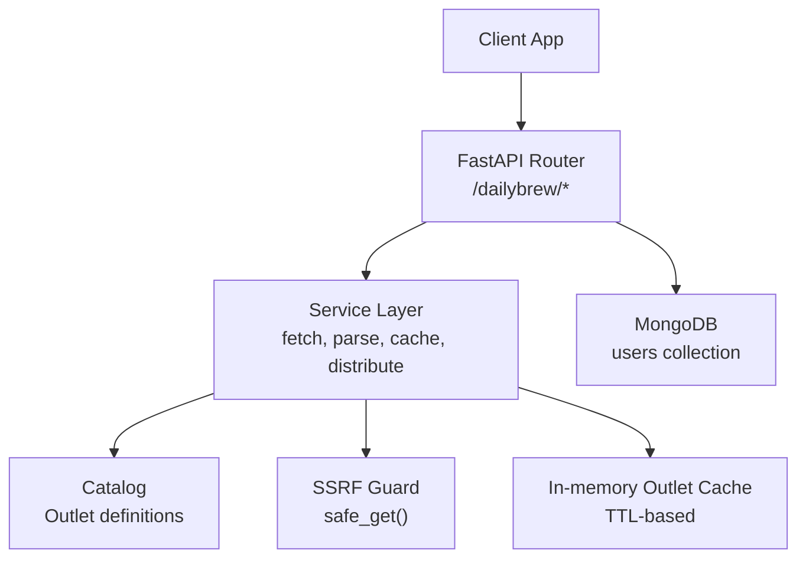
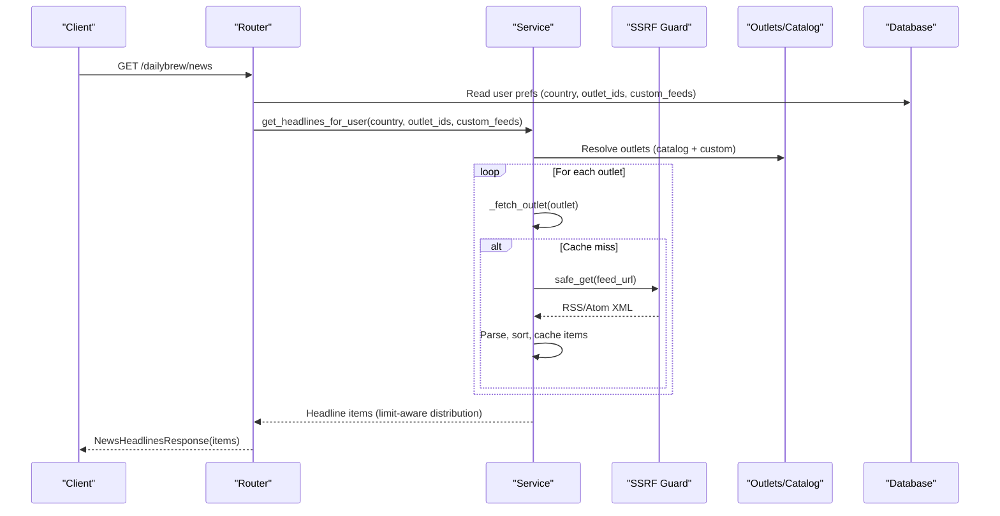
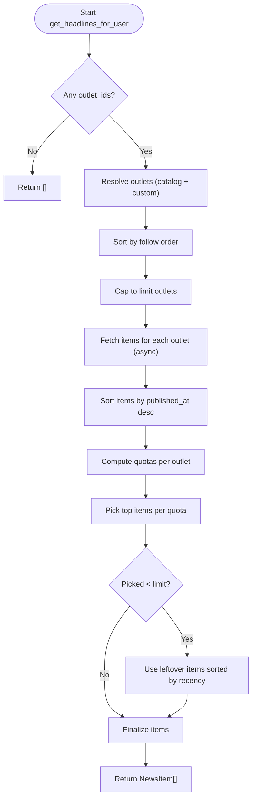
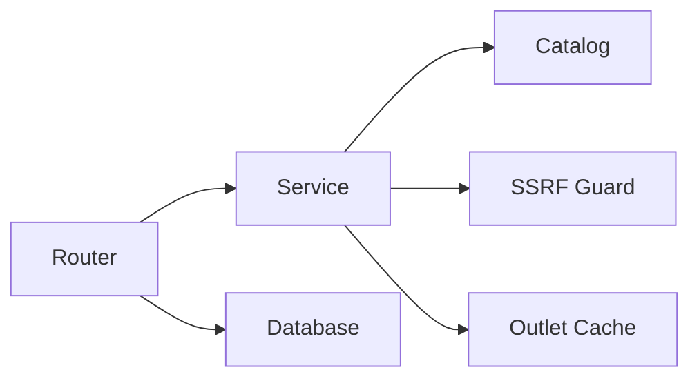

# Daily Brew & News Schemas

<cite>
**Referenced Files in This Document**
- [dailybrew/schemas.py](file://dailybrew/schemas.py)
- [dailybrew/service.py](file://dailybrew/service.py)
- [dailybrew/router.py](file://dailybrew/router.py)
- [dailybrew/catalog.py](file://dailybrew/catalog.py)
- [security/ssrf_guard.py](file://security/ssrf_guard.py)
- [core/deps.py](file://core/deps.py)
</cite>

## Table of Contents
1. [Introduction](#introduction)
2. [Project Structure](#project-structure)
3. [Core Components](#core-components)
4. [Architecture Overview](#architecture-overview)
5. [Detailed Component Analysis](#detailed-component-analysis)
6. [Dependency Analysis](#dependency-analysis)
7. [Performance Considerations](#performance-considerations)
8. [Troubleshooting Guide](#troubleshooting-guide)
9. [Conclusion](#conclusion)
10. [Appendices](#appendices)

## Introduction
This document provides detailed schema documentation for the Daily Brew news aggregation system. It covers:
- News article schemas (title, content, source information, categorization fields)
- User preference schemas for country-specific news, outlet subscriptions, and custom feed configurations
- Validation rules for news sources, URL formats, and content filtering
- Examples of news collection, user preference updates, and custom feed management
- Performance considerations for aggregation queries and caching strategies

The system aggregates RSS/Atom feeds from curated country catalogs and topic-focused pools, plus user-added custom feeds, to deliver personalized daily headlines.

## Project Structure
Daily Brew is implemented as a FastAPI router with service logic, a static catalog of outlets, and security guards for safe external fetches. Key modules:
- Router: HTTP endpoints for news sources, search, custom feeds, and aggregated headlines
- Service: Feed fetching, parsing, sorting, caching, and headline distribution logic
- Catalog: Curated per-country outlets and topic-focused pool
- Security: SSRF-safe HTTP client wrapper
- Core dependencies: Authentication and database access

**Diagram sources**
- [dailybrew/router.py:15-101](file://dailybrew/router.py#L15-L101)
- [dailybrew/service.py:168-284](file://dailybrew/service.py#L168-L284)
- [dailybrew/catalog.py:4-12](file://dailybrew/catalog.py#L4-L12)
- [security/ssrf_guard.py:67-108](file://security/ssrf_guard.py#L67-L108)
- [core/deps.py:15-50](file://core/deps.py#L15-L50)

**Section sources**
- [dailybrew/router.py:1-101](file://dailybrew/router.py#L1-L101)
- [dailybrew/service.py:1-356](file://dailybrew/service.py#L1-L356)
- [dailybrew/catalog.py:1-281](file://dailybrew/catalog.py#L1-L281)
- [security/ssrf_guard.py:1-109](file://security/ssrf_guard.py#L1-L109)
- [core/deps.py:1-51](file://core/deps.py#L1-L51)

## Core Components
- NewsItem: Represents a single headline with link, source name, optional publish time, and logo URL.
- OutletInfo: Describes an outlet’s id, name, description, and topics.
- NewsSourceResponse: Returns a country code and list of outlets available for that country.
- SearchFeedsResponse: Returns matching outlets for a free-text query.
- UpdateNewsPreferencesRequest: Schema for updating a user’s country and selected outlet ids.
- AddCustomFeedRequest: Validates and adds a user-provided RSS/Atom feed URL.

These Pydantic models define request/response contracts and enforce basic validation at the API boundary.

**Section sources**
- [dailybrew/schemas.py:6-40](file://dailybrew/schemas.py#L6-L40)

## Architecture Overview
The Daily Brew feature exposes several endpoints:
- GET /dailybrew/news-sources: Lists outlets for a given country
- GET /dailybrew/search-feeds: Searches all known outlets by keywords
- GET /dailybrew/outlets: Resolves specific outlet ids to display info
- POST /dailybrew/custom-feed: Adds a user-submitted RSS/Atom feed after live validation
- GET /dailybrew/news: Aggregates headlines based on user preferences

**Diagram sources**
- [dailybrew/router.py:91-101](file://dailybrew/router.py#L91-L101)
- [dailybrew/service.py:227-284](file://dailybrew/service.py#L227-L284)
- [dailybrew/service.py:168-202](file://dailybrew/service.py#L168-L202)
- [security/ssrf_guard.py:67-108](file://security/ssrf_guard.py#L67-L108)

## Detailed Component Analysis

### News Article Schema
- Fields:
  - headline: string (required)
  - link: string (required)
  - source_name: string (required)
  - published_at: datetime (optional)
  - logo_url: string (optional)
- Source: The response model for aggregated headlines uses this schema.

Validation and behavior:
- Required fields are enforced by the Pydantic model.
- Optional fields allow flexibility when sources omit timestamps or logos.

Example usage:
- Returned by GET /dailybrew/news as part of NewsHeadlinesResponse.items.

**Section sources**
- [dailybrew/schemas.py:6-15](file://dailybrew/schemas.py#L6-L15)
- [dailybrew/router.py:91-101](file://dailybrew/router.py#L91-L101)

### Outlet and Source Information Schema
- OutletInfo:
  - id: string (unique identifier for an outlet)
  - name: string (display name)
  - description: string (short description)
  - topics: list of strings (content tags used for search scoring)
- NewsSourceResponse:
  - country: string (ISO 3166-1 alpha-2 code, uppercased)
  - outlets: list of OutletInfo

Behavior:
- Country-scoped outlets come from the catalog; topic-focused outlets are surfaced via search.
- Topics enable weighted search matching across names, descriptions, and tags.

**Section sources**
- [dailybrew/schemas.py:18-31](file://dailybrew/schemas.py#L18-L31)
- [dailybrew/catalog.py:4-12](file://dailybrew/catalog.py#L4-L12)
- [dailybrew/router.py:15-24](file://dailybrew/router.py#L15-L24)
- [dailybrew/router.py:27-39](file://dailybrew/router.py#L27-L39)

### User Preference Schemas
- UpdateNewsPreferencesRequest:
  - country: string (ISO 3166-1 alpha-2)
  - outlet_ids: list of strings (selected outlets to follow)
- Custom feed storage:
  - Users can add custom feeds stored under custom_news_feeds in the users collection.
  - Each entry includes id, name, and feed_url.

Behavior:
- Country drives default suggestions; actual aggregation uses outlet_ids (including topic-pool and custom feeds).
- Custom feeds are validated live before saving to ensure they are valid RSS/Atom.

**Section sources**
- [dailybrew/schemas.py:34-40](file://dailybrew/schemas.py#L34-L40)
- [dailybrew/router.py:60-88](file://dailybrew/router.py#L60-L88)
- [dailybrew/service.py:227-241](file://dailybrew/service.py#L227-L241)

### Bible Verse and Quote Inclusion Schemas
- Not present in the current codebase.
- No schemas or endpoints were found for Bible verses or quotes within the Daily Brew module or related services.

[No sources needed since this section does not analyze specific files]

### Validation Rules
- URL format and safety:
  - Only http and https schemes are allowed.
  - Hostnames must resolve to public IPs; private, loopback, link-local, reserved, multicast, and unspecified addresses are rejected.
  - Redirects are followed manually, re-validating every hop to prevent SSRF.
- Feed validity:
  - Custom feed URLs are fetched live and parsed; only valid RSS/Atom feeds with titles are accepted.
- Content filtering:
  - Outlets are filtered by user selection (outlet_ids), including curated catalog entries, topic-pool matches, and custom feeds.
  - Search uses word-prefix matching with weighted scoring across topics, names, and descriptions.

**Section sources**
- [security/ssrf_guard.py:33-48](file://security/ssrf_guard.py#L33-L48)
- [security/ssrf_guard.py:50-64](file://security/ssrf_guard.py#L50-L64)
- [security/ssrf_guard.py:67-108](file://security/ssrf_guard.py#L67-L108)
- [dailybrew/service.py:134-158](file://dailybrew/service.py#L134-L158)
- [dailybrew/service.py:311-355](file://dailybrew/service.py#L311-L355)

### News Collection and Distribution Logic
- Fetching:
  - Uses async HTTP client with a browser-like User-Agent and timeout.
  - Parses both RSS and Atom formats, extracting title, link, and publish date.
- Sorting:
  - Items sorted by publish time descending; undated items sort last.
  - Naive datetimes are normalized to UTC for consistent comparison.
- Distribution:
  - Preserves user-follow order.
  - Applies quotas per outlet to balance representation:
    - One outlet: all slots from it
    - Two outlets: first gets majority, second gets remainder
    - Three or more: one each, then distribute remaining slots evenly
  - Backfills leftover fresh items if any outlet runs short.

**Diagram sources**
- [dailybrew/service.py:227-284](file://dailybrew/service.py#L227-L284)
- [dailybrew/service.py:35-45](file://dailybrew/service.py#L35-L45)

**Section sources**
- [dailybrew/service.py:48-117](file://dailybrew/service.py#L48-L117)
- [dailybrew/service.py:168-202](file://dailybrew/service.py#L168-L202)
- [dailybrew/service.py:227-284](file://dailybrew/service.py#L227-L284)

### Custom Feed Management
- Adding a custom feed:
  - Validates scheme and reachability using SSRF guard.
  - Parses feed title to use as display name.
  - Stores resolved URL and unique id in user’s custom_news_feeds array.
- Deduplication:
  - If the same feed URL already exists, returns existing entry instead of duplicating.

**Section sources**
- [dailybrew/router.py:60-88](file://dailybrew/router.py#L60-L88)
- [dailybrew/service.py:134-158](file://dailybrew/service.py#L134-L158)

### Search Feeds
- Free-text search across all known outlets (country catalog and topic pool).
- Tokenizes query into words (minimum length 2).
- Scores matches by specificity:
  - Topic tag match: highest weight
  - Name prefix match: medium weight
  - Description prefix match: lowest weight
- Returns up to N results sorted by score.

**Section sources**
- [dailybrew/service.py:307-355](file://dailybrew/service.py#L307-L355)
- [dailybrew/router.py:27-39](file://dailybrew/router.py#L27-L39)

## Dependency Analysis
- Router depends on:
  - Service layer for business logic
  - Database via core dependencies for user data
- Service depends on:
  - Catalog for outlet definitions
  - SSRF guard for secure network requests
  - In-memory cache for performance
- Catalog defines immutable outlet structures and lookup functions.

**Diagram sources**
- [dailybrew/router.py:1-101](file://dailybrew/router.py#L1-L101)
- [dailybrew/service.py:1-356](file://dailybrew/service.py#L1-L356)
- [dailybrew/catalog.py:1-281](file://dailybrew/catalog.py#L1-L281)
- [security/ssrf_guard.py:1-109](file://security/ssrf_guard.py#L1-L109)
- [core/deps.py:1-51](file://core/deps.py#L1-L51)

**Section sources**
- [dailybrew/router.py:1-101](file://dailybrew/router.py#L1-L101)
- [dailybrew/service.py:1-356](file://dailybrew/service.py#L1-L356)
- [dailybrew/catalog.py:1-281](file://dailybrew/catalog.py#L1-L281)
- [security/ssrf_guard.py:1-109](file://security/ssrf_guard.py#L1-L109)
- [core/deps.py:1-51](file://core/deps.py#L1-L51)

## Performance Considerations
- In-memory outlet cache:
  - TTL-based cache per outlet reduces repeated network calls.
  - Concurrency-safe refresh using an asyncio lock prevents thundering herds.
- Background prewarmer:
  - Periodically refreshes all curated outlets to keep cache warm.
  - Ensures user-facing requests read from cache rather than paying cold fetch costs.
- Async fetching:
  - Parallel fetches across selected outlets minimize latency.
- Sorting and backfill:
  - Efficiently distributes headlines while preserving freshness and user priorities.

Recommendations:
- Monitor cache hit rates and adjust TTL if feed update frequency changes.
- Consider moving cache to a shared store (e.g., Redis) if scaling to multiple replicas.
- Rate-limit or throttle background prewarm cycles to avoid overwhelming upstream feeds.

**Section sources**
- [dailybrew/service.py:20-33](file://dailybrew/service.py#L20-L33)
- [dailybrew/service.py:168-202](file://dailybrew/service.py#L168-L202)
- [dailybrew/service.py:205-220](file://dailybrew/service.py#L205-L220)
- [dailybrew/service.py:227-284](file://dailybrew/service.py#L227-L284)

## Troubleshooting Guide
Common issues and resolutions:
- Invalid scheme:
  - Error: Non-http/https URLs are rejected.
  - Action: Ensure feed URLs use http or https.
- Unreachable host:
  - Error: DNS resolution fails or resolves to private/internal IP.
  - Action: Verify hostname and network accessibility; avoid internal domains.
- Fetch failed:
  - Error: Network errors, non-2xx responses, missing Location headers, or too many redirects.
  - Action: Check upstream feed availability and redirect chains.
- Not a valid feed:
  - Error: Custom feed URL does not return parseable RSS/Atom with a title.
  - Action: Confirm the URL points to a working RSS/Atom endpoint.
- Slow or failing feeds:
  - Behavior: Failures fall back to cached items or empty lists to avoid breaking the UI.
  - Action: Investigate upstream feed health; consider removing problematic outlets.

**Section sources**
- [security/ssrf_guard.py:33-48](file://security/ssrf_guard.py#L33-L48)
- [security/ssrf_guard.py:50-64](file://security/ssrf_guard.py#L50-L64)
- [security/ssrf_guard.py:67-108](file://security/ssrf_guard.py#L67-L108)
- [dailybrew/service.py:134-158](file://dailybrew/service.py#L134-L158)
- [dailybrew/service.py:168-202](file://dailybrew/service.py#L168-L202)

## Conclusion
The Daily Brew system provides a robust, secure, and performant news aggregation pipeline with clear schemas for articles, outlets, and user preferences. It supports curated country catalogs, topic-focused feeds, and user-added custom feeds, with strong validation and caching to ensure reliability and speed. While Bible verse and quote inclusion schemas are not currently implemented, the architecture allows for future extensions.

[No sources needed since this section summarizes without analyzing specific files]

## Appendices

### API Endpoints Summary
- GET /dailybrew/news-sources?country={iso_code}
  - Returns outlets available for a country
- GET /dailybrew/search-feeds?q={query}
  - Returns matching outlets by keyword search
- GET /dailybrew/outlets?ids={comma-separated ids}
  - Resolves outlet ids to display info
- POST /dailybrew/custom-feed
  - Adds a user-submitted RSS/Atom feed after validation
- GET /dailybrew/news
  - Returns aggregated headlines based on user preferences

**Section sources**
- [dailybrew/router.py:15-101](file://dailybrew/router.py#L15-L101)