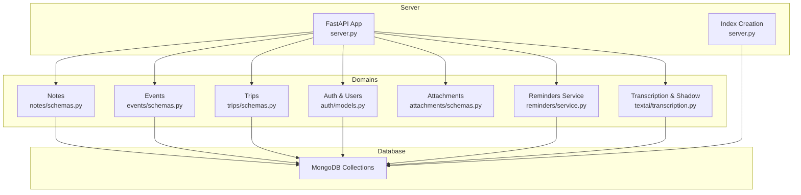
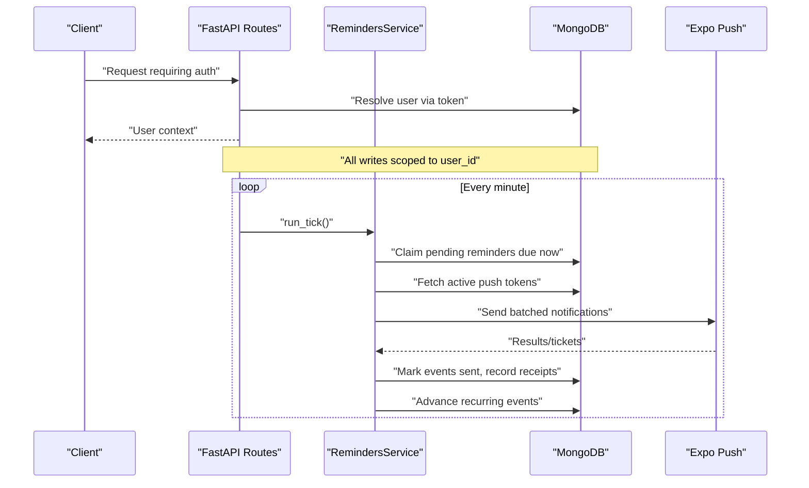
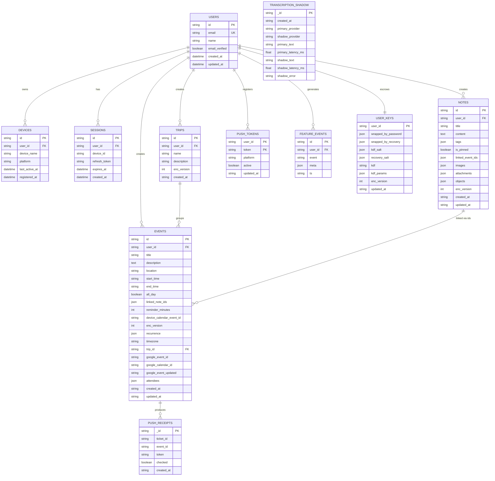
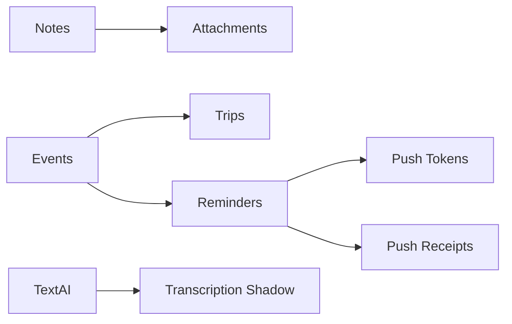

# Data Models & Database Design

<cite>
**Referenced Files in This Document**
- [server.py](file://server.py)
- [core/repository.py](file://core/repository.py)
- [notes/schemas.py](file://notes/schemas.py)
- [events/schemas.py](file://events/schemas.py)
- [trips/schemas.py](file://trips/schemas.py)
- [auth/models.py](file://auth/models.py)
- [attachments/schemas.py](file://attachments/schemas.py)
- [reminders/service.py](file://reminders/service.py)
- [textai/transcription.py](file://textai/transcription.py)
</cite>

## Table of Contents
1. [Introduction](#introduction)
2. [Project Structure](#project-structure)
3. [Core Components](#core-components)
4. [Architecture Overview](#architecture-overview)
5. [Detailed Component Analysis](#detailed-component-analysis)
6. [Dependency Analysis](#dependency-analysis)
7. [Performance Considerations](#performance-considerations)
8. [Troubleshooting Guide](#troubleshooting-guide)
9. [Conclusion](#conclusion)
10. [Appendices](#appendices)

## Introduction
This document describes the Nueco Backend database schema and data model design. It focuses on collections for users, notes, events, trips, and supporting collections such as push tokens, receipts, sessions, devices, feature telemetry, and transcription shadow records. It explains entity relationships, field definitions, validation rules, primary/foreign key semantics, compound indexes, query patterns, data lifecycle (including soft deletes and TTL), caching considerations, and security measures including encryption at rest and access control.

## Project Structure
The backend is a FastAPI application backed by MongoDB via Motor. The server initializes the database client, registers routers for each domain, and creates indexes at startup. Domain modules define Pydantic schemas that mirror the persisted documents and enforce validation rules. A user-scoped collection wrapper enforces tenant isolation on every operation.

**Diagram sources**
- [server.py:16-21](file://server.py#L16-L21)
- [server.py:344-432](file://server.py#L344-L432)
- [notes/schemas.py:33-100](file://notes/schemas.py#L33-L100)
- [events/schemas.py:5-101](file://events/schemas.py#L5-L101)
- [trips/schemas.py:5-26](file://trips/schemas.py#L5-L26)
- [auth/models.py:6-66](file://auth/models.py#L6-L66)
- [attachments/schemas.py:4-24](file://attachments/schemas.py#L4-L24)
- [reminders/service.py:37-215](file://reminders/service.py#L37-L215)
- [textai/transcription.py:363-450](file://textai/transcription.py#L363-L450)

**Section sources**
- [server.py:16-21](file://server.py#L16-L21)
- [server.py:344-432](file://server.py#L344-L432)

## Core Components
- User-scoped data access: A wrapper ensures every read/write includes the current user’s ID, preventing cross-account leaks.
- Notes: Rich note documents with optional E2EE fields, attachments, images, and canvas objects; supports pinned state and linked events.
- Events: Calendar-like events with recurrence, timezone, trip grouping, reminders, and Google Calendar bridge metadata.
- Trips: Lightweight containers grouping related events.
- Auth/User support: User, device, and session documents with TTL-based session expiry.
- Push notifications: Device tokens and delivery receipts used by the reminder pipeline.
- AI/Transcription: Transcription results and shadow comparison records with TTL retention.

Key responsibilities and persistence points are defined across the referenced files.

**Section sources**
- [core/repository.py:27-95](file://core/repository.py#L27-L95)
- [notes/schemas.py:33-100](file://notes/schemas.py#L33-L100)
- [events/schemas.py:5-101](file://events/schemas.py#L5-L101)
- [trips/schemas.py:5-26](file://trips/schemas.py#L5-L26)
- [auth/models.py:6-66](file://auth/models.py#L6-L66)
- [reminders/service.py:37-215](file://reminders/service.py#L37-L215)
- [textai/transcription.py:363-450](file://textai/transcription.py#L363-L450)

## Architecture Overview
The system uses MongoDB collections to persist domain entities and supporting data. Indexes are created at startup to optimize common queries and ensure efficient pagination and filtering. The reminder service periodically claims due events, sends push notifications, tracks receipts, and advances recurring events. Transcription runs asynchronously and may write shadow records for evaluation.

**Diagram sources**
- [reminders/service.py:159-177](file://reminders/service.py#L159-L177)
- [reminders/service.py:181-215](file://reminders/service.py#L181-L215)
- [server.py:344-432](file://server.py#L344-L432)

## Detailed Component Analysis

### Users, Devices, Sessions
- Users: Store identity, verification tokens, password hash, preferences, and timestamps. Unique indexes on email and id ensure uniqueness and fast lookups.
- Devices: Track per-user devices with platform and last active timestamp. Indexed by user_id.
- Sessions: Store refresh token hashes and expiration. TTL index auto-deletes expired sessions based on expires_at.

Relationships:
- Devices belong to users via user_id.
- Sessions belong to users via user_id.

Validation:
- User creation constructs a well-defined document shape with required fields and defaults.

Indexes:
- users.email unique sparse
- users.id unique sparse
- sessions.expires_at TTL
- sessions.user_id
- devices.user_id

**Section sources**
- [auth/models.py:6-66](file://auth/models.py#L6-L66)
- [server.py:409-419](file://server.py#L409-L419)

### Notes
Fields include title, content, tags, pinning, linked events, embedded images, attachments, canvas image objects, encryption version, and timestamps. Notes are always scoped to a user_id via the repository wrapper.

Relationships:
- Notes link to events via linked_event_ids (references stored as strings).
- Notes embed attachment descriptors referencing external storage keys.

Validation:
- Pydantic models enforce types and structure for create/update/response shapes.

Indexes:
- Compound indexes optimized for list() queries: user_id + is_pinned + updated_at (+ id tiebreaker).
- Additional indexes for user_id+id and user_id+has_attachments.

Query patterns:
- Paginated listing filtered by user_id, sorted by pin and recency, with optional attachment filters.

Soft delete:
- No explicit soft delete flag is present; deletion removes the document.

**Section sources**
- [notes/schemas.py:33-100](file://notes/schemas.py#L33-L100)
- [attachments/schemas.py:4-24](file://attachments/schemas.py#L4-L24)
- [server.py:364-381](file://server.py#L364-L381)

### Events
Fields include title, description, location, start/end times, all-day flag, linked notes, reminders, device calendar IDs, encryption version, recurrence, timezone, trip grouping, Google Calendar bridge fields, attendees, and timestamps.

Relationships:
- Events reference trips via trip_id (opaque string).
- Events can be linked to notes via linked_note_ids.

Validation:
- Recurrence model constrains frequency and optional weekday and until date.
- Event create/update responses validate wire shapes.

Indexes:
- user_id + start_time (+ id tiebreaker) for list paging.
- user_id + id for direct lookup.
- Partial index on reminder_status="pending" + reminder_fire_at for scheduler efficiency.
- trip_id + user_id for timeline and cascade operations.

Lifecycle:
- Reminder status transitions: pending -> claimed -> sent; recurring events advance to next occurrence.
- Stuck claim recovery resets to pending if not processed within a threshold.

**Section sources**
- [events/schemas.py:5-101](file://events/schemas.py#L5-L101)
- [server.py:382-397](file://server.py#L382-L397)
- [reminders/service.py:44-67](file://reminders/service.py#L44-L67)
- [reminders/service.py:120-158](file://reminders/service.py#L120-L158)

### Trips
Lightweight container with name, description, encryption version, and timestamps. Used to group events.

Relationships:
- Events reference trips via trip_id.

Indexes:
- user_id + created_at (+ id tiebreaker) for list paging.
- user_id + id for direct lookup.

**Section sources**
- [trips/schemas.py:5-26](file://trips/schemas.py#L5-L26)
- [server.py:398-403](file://server.py#L398-L403)

### Push Tokens and Receipts
- Push tokens: One or more per user, with platform, active flag, and timestamps. Used to deliver event reminders.
- Push receipts: Records of notification tickets with checked flag and creation time; resolved asynchronously.

Indexes:
- push_tokens.user_id + active for quick retrieval of active devices.
- push_tokens.token for deduplication and updates.
- push_receipts.checked + created_at for efficient receipt resolution.

Lifecycle:
- Registration upserts tokens; unregistration marks inactive.
- Receipts are marked checked after resolution; stale receipts are pruned.

**Section sources**
- [server.py:129-162](file://server.py#L129-L162)
- [server.py:404-408](file://server.py#L404-L408)
- [reminders/service.py:93-118](file://reminders/service.py#L93-L118)
- [reminders/service.py:181-215](file://reminders/service.py#L181-L215)

### Feature Telemetry and Key Escrow
- Wrapped keys: Opaque blobs storing wrapped DEKs per user; indexed by user_id uniquely.
- Feature events: Metadata-only usage events with event name and size-capped meta; indexed by event+timestamp and user_id+timestamp.

Security:
- Server stores only opaque wrapped keys and never plaintext note content or unwrapped keys.

**Section sources**
- [server.py:56-123](file://server.py#L56-L123)
- [server.py:420-423](file://server.py#L420-L423)

### Transcription Shadow Records
- Collection: transcription_shadow
- Fields: created_at, provider names, primary/shadow texts, latencies, errors
- TTL: Auto-expire after 7 days via index

Purpose:
- Migration validation comparing primary and shadow providers without affecting user requests.

**Section sources**
- [textai/transcription.py:363-450](file://textai/transcription.py#L363-L450)
- [server.py:425-428](file://server.py#L425-L428)

### Data Model Relationships Diagram

**Diagram sources**
- [auth/models.py:6-66](file://auth/models.py#L6-L66)
- [notes/schemas.py:33-100](file://notes/schemas.py#L33-L100)
- [events/schemas.py:5-101](file://events/schemas.py#L5-L101)
- [trips/schemas.py:5-26](file://trips/schemas.py#L5-L26)
- [server.py:129-162](file://server.py#L129-L162)
- [server.py:404-408](file://server.py#L404-L408)
- [server.py:56-123](file://server.py#L56-L123)
- [textai/transcription.py:363-450](file://textai/transcription.py#L363-L450)

## Dependency Analysis
- Coupling:
  - Notes depend on attachments descriptors but not directly on storage implementation.
  - Events depend on trips via trip_id and on reminders via reminder fields.
  - Reminders depend on events and push_tokens collections.
  - TextAI depends on transcription providers and writes to a dedicated shadow collection.
- Cohesion:
  - Each domain module encapsulates its schemas and services, minimizing cross-domain coupling.
- External dependencies:
  - Motor/MongoDB for persistence.
  - Expo for push notifications.
  - OpenAI/Speechmatics for transcription.

**Diagram sources**
- [notes/schemas.py:33-100](file://notes/schemas.py#L33-L100)
- [events/schemas.py:5-101](file://events/schemas.py#L5-L101)
- [trips/schemas.py:5-26](file://trips/schemas.py#L5-L26)
- [reminders/service.py:37-215](file://reminders/service.py#L37-L215)
- [textai/transcription.py:363-450](file://textai/transcription.py#L363-L450)

**Section sources**
- [reminders/service.py:37-215](file://reminders/service.py#L37-L215)
- [textai/transcription.py:363-450](file://textai/transcription.py#L363-L450)

## Performance Considerations
- Indexing strategy:
  - Notes: Compound indexes covering user_id, is_pinned, updated_at, and id tiebreaker to avoid in-memory sorts during pagination.
  - Events: Compound indexes for list paging and partial index for pending reminders to keep scheduler queries small and fast.
  - Trips: Compound indexes for list paging and direct lookup.
  - Push tokens: Indexes for active token retrieval and deduplication.
  - Sessions: TTL index for automatic cleanup.
  - Feature events: Indexes for recent queries and per-user timelines.
  - Transcription shadow: TTL index for 7-day retention.
- Query patterns:
  - Pagination uses sort fields aligned with indexes and an id tiebreaker to guarantee deterministic ordering.
  - Reminder scheduling uses find_one_and_update for atomic claiming to prevent double-sends.
- Caching considerations:
  - Daily brew cache prewarmer runs at startup to reduce cold-start latency for news feeds.
  - Feature flags are refreshed on startup and periodically in background tasks.
- Concurrency:
  - Atomic claim-and-update prevents race conditions in reminder processing.
  - Batch sizes limit memory and network overhead for push and receipt resolution.

[No sources needed since this section provides general guidance]

## Troubleshooting Guide
- Reminder stuck claims:
  - If a tick crashes between claim and send, events remain in claimed state; a recovery step resets them to pending after a threshold.
- Push token invalidation:
  - DeviceNotRegistered errors mark tokens inactive; subsequent ticks skip them.
- Excessive backlog:
  - Claim loop caps per tick to prevent long-running jobs; backpressure is handled by batching.
- Transcription failures:
  - Shadow mode captures errors and latencies for offline analysis; primary request remains unaffected.

**Section sources**
- [reminders/service.py:44-67](file://reminders/service.py#L44-L67)
- [reminders/service.py:93-118](file://reminders/service.py#L93-L118)
- [reminders/service.py:181-215](file://reminders/service.py#L181-L215)
- [textai/transcription.py:363-450](file://textai/transcription.py#L363-L450)

## Conclusion
The Nueco Backend employs a clear, user-scoped MongoDB schema with carefully designed indexes to support high-performance queries and reliable reminder delivery. Notes, events, and trips form the core domain, supported by push notifications, authentication/session management, and AI-driven transcription features. Security is reinforced through E2EE key escrow and strict scoping of all data operations. Operational resilience is achieved via atomic operations, bounded batches, and automated cleanup using TTL indexes.

[No sources needed since this section summarizes without analyzing specific files]

## Appendices

### Field Definitions and Validation Rules Summary
- Notes:
  - Title/content/tags/pin/linking/images/attachments/objects/encryption/version/timestamps validated via Pydantic models.
- Events:
  - Time fields, recurrence constraints, timezone handling, reminder configuration, and Google Calendar bridge fields validated via Pydantic models.
- Trips:
  - Name/description/encryption/version/timestamps validated via Pydantic models.
- Users/Devices/Sessions:
  - Constructed via helper functions ensuring consistent shapes and defaults.
- Push Tokens/Receipts:
  - Upsert semantics for tokens; receipts tracked with checked flags and timestamps.
- Feature Events/Wrapped Keys:
  - Size caps and metadata-only constraints enforced at API layer.

**Section sources**
- [notes/schemas.py:33-100](file://notes/schemas.py#L33-L100)
- [events/schemas.py:5-101](file://events/schemas.py#L5-L101)
- [trips/schemas.py:5-26](file://trips/schemas.py#L5-L26)
- [auth/models.py:6-66](file://auth/models.py#L6-L66)
- [server.py:56-123](file://server.py#L56-L123)

### Data Lifecycle and Archival Strategies
- Soft deletes:
  - Not implemented; documents are removed when deleted.
- TTL indexes:
  - Sessions expire automatically based on expires_at.
  - Transcription shadow records auto-expire after 7 days.
- Archival:
  - No explicit archival pipelines; historical data remains unless explicitly deleted.

**Section sources**
- [server.py:413-428](file://server.py#L413-L428)

### Data Access Patterns and Security
- Tenant isolation:
  - All user-owned documents carry user_id; the scoped collection wrapper enforces it on every operation.
- Encryption:
  - E2EE fields indicate client-side ciphertext for sensitive content; server stores only opaque wrapped keys.
- Access control:
  - Authentication resolves user context; routes require valid bearer tokens.
- Privacy compliance:
  - Data residency checks at startup ensure external endpoints are Australian-region compliant.

**Section sources**
- [core/repository.py:27-95](file://core/repository.py#L27-L95)
- [server.py:333-341](file://server.py#L333-L341)
- [server.py:56-123](file://server.py#L56-L123)