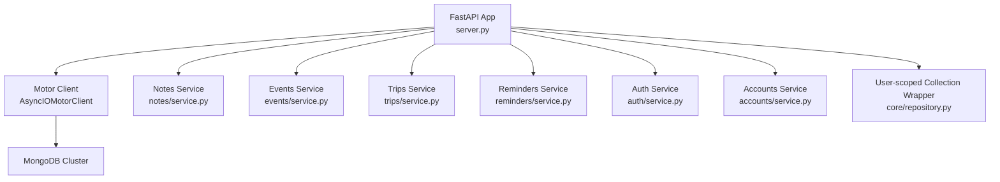
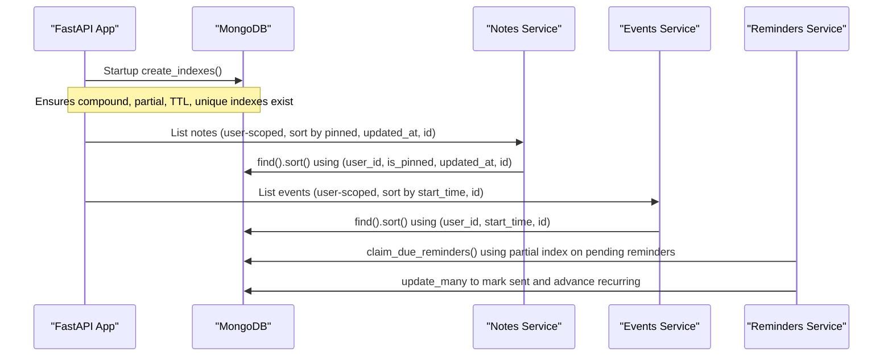
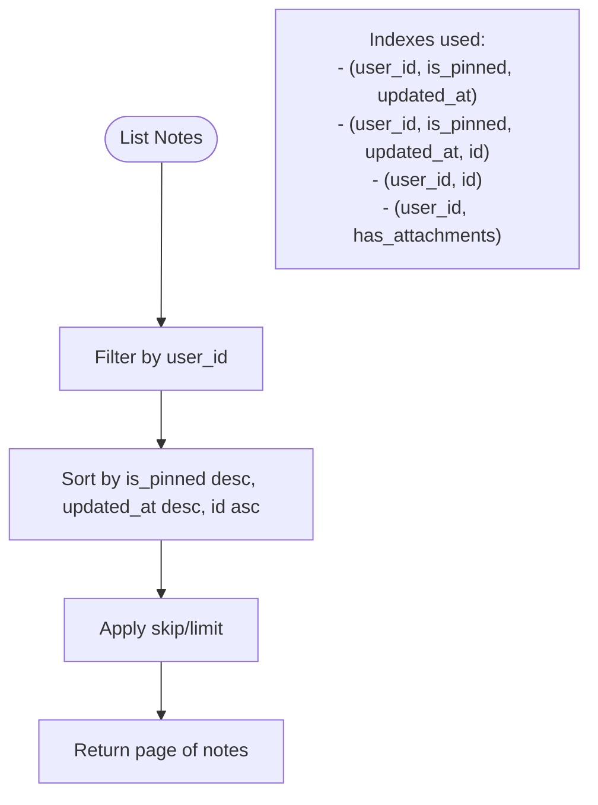
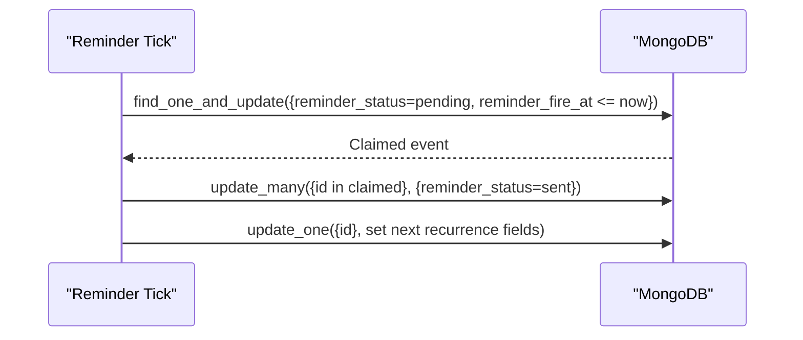
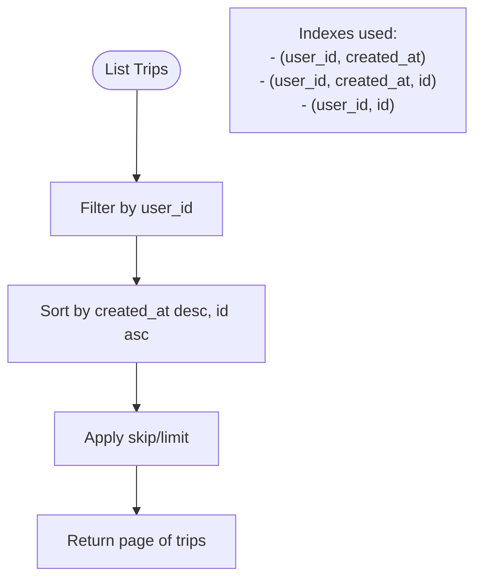
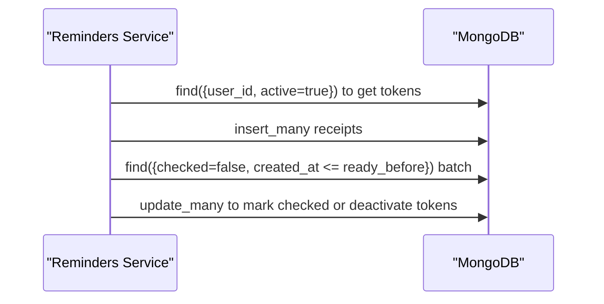
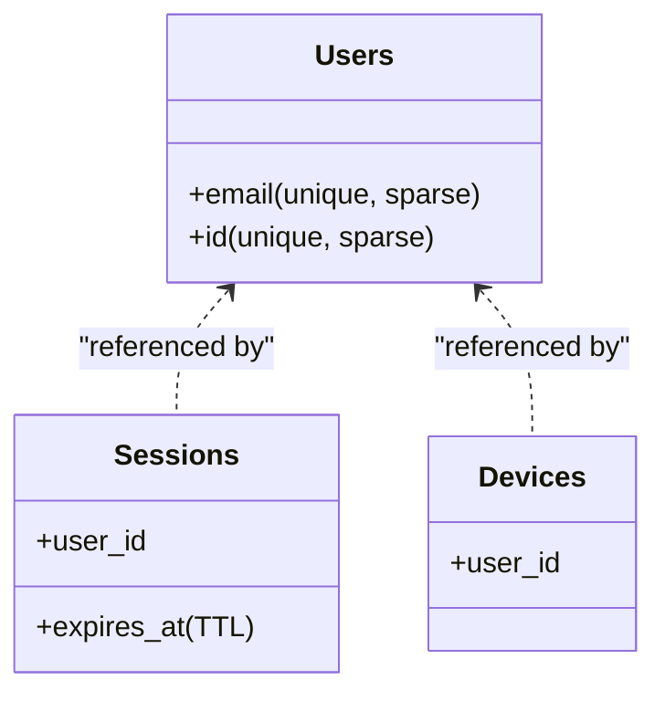
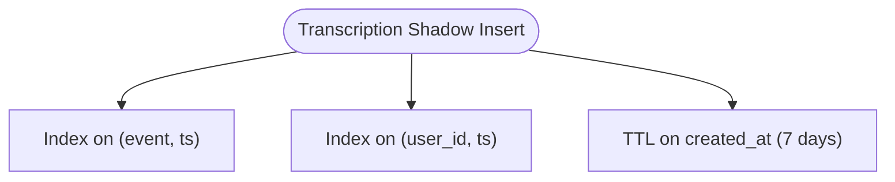
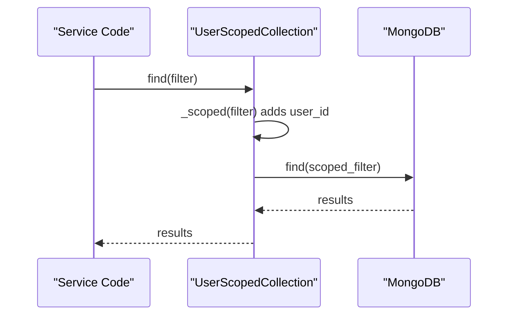
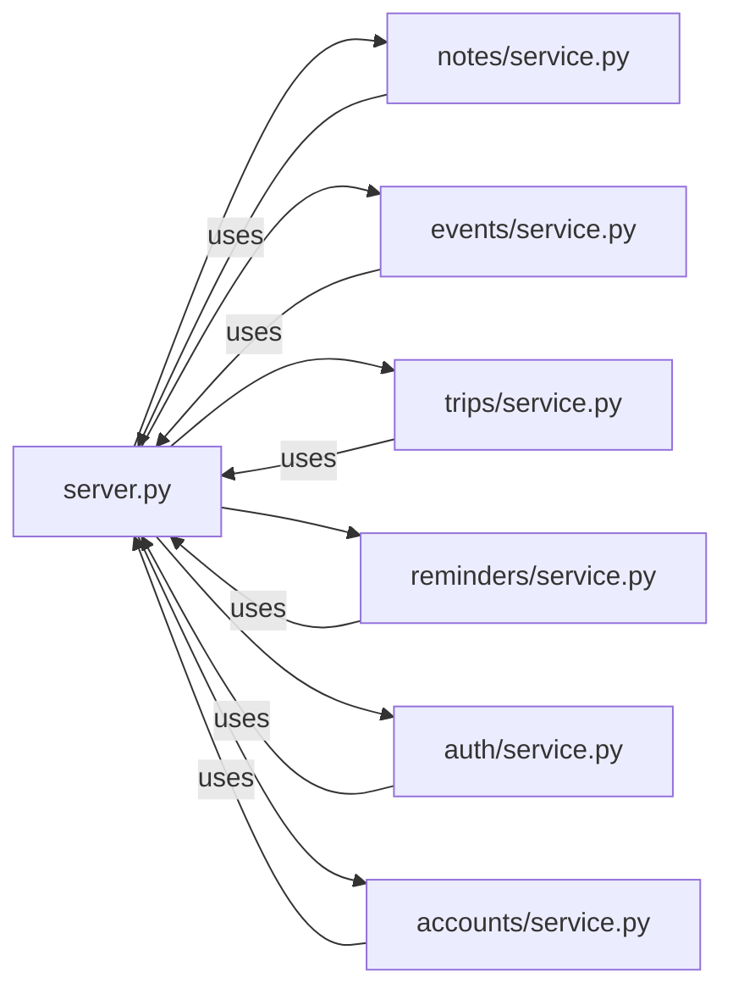

# Database Indexing & Performance

<cite>
**Referenced Files in This Document**
- [server.py](file://server.py)
- [notes/service.py](file://notes/service.py)
- [events/service.py](file://events/service.py)
- [trips/service.py](file://trips/service.py)
- [reminders/service.py](file://reminders/service.py)
- [auth/service.py](file://auth/service.py)
- [accounts/service.py](file://accounts/service.py)
- [core/repository.py](file://core/repository.py)
- [requirements.txt](file://requirements.txt)
</cite>

## Table of Contents
1. [Introduction](#introduction)
2. [Project Structure](#project-structure)
3. [Core Components](#core-components)
4. [Architecture Overview](#architecture-overview)
5. [Detailed Component Analysis](#detailed-component-analysis)
6. [Dependency Analysis](#dependency-analysis)
7. [Performance Considerations](#performance-considerations)
8. [Troubleshooting Guide](#troubleshooting-guide)
9. [Conclusion](#conclusion)
10. [Appendices](#appendices)

## Introduction
This document explains the Nueco Backend’s database indexing strategy and performance optimization practices for MongoDB. It covers:
- Compound indexes aligned to actual query patterns across notes, events, trips, push tokens, sessions, devices, users, feature events, and transcription shadow records
- TTL indexes for automatic cleanup of temporary data
- Partial indexes to optimize scheduler workloads
- Query selection criteria and index coverage strategies used by services
- Monitoring approaches and maintenance procedures
- Slow query identification and resolution examples
- Scaling considerations (sharding readiness and read/write patterns)
- Connection pooling configuration and health monitoring practices

## Project Structure
The backend is a FastAPI application that uses Motor (async MongoDB driver) with a single global client initialized at startup. Indexes are created on startup via an event handler. Services implement domain logic and issue queries that are intentionally covered by indexes defined centrally.

**Diagram sources**
- [server.py:16-18](file://server.py#L16-L18)
- [server.py:344-433](file://server.py#L344-L433)
- [notes/service.py:79-148](file://notes/service.py#L79-L148)
- [events/service.py:163-247](file://events/service.py#L163-L247)
- [trips/service.py:47-75](file://trips/service.py#L47-L75)
- [reminders/service.py:37-177](file://reminders/service.py#L37-L177)
- [auth/service.py:35-41](file://auth/service.py#L35-L41)
- [accounts/service.py:56-88](file://accounts/service.py#L56-L88)
- [core/repository.py:27-94](file://core/repository.py#L27-L94)

**Section sources**
- [server.py:16-18](file://server.py#L16-L18)
- [server.py:344-433](file://server.py#L344-L433)

## Core Components
- Global MongoDB client and database handle are created once at process start using environment variables for connection string and database name.
- Index creation runs on startup, including dropping superseded indexes before creating new ones to avoid stale index overhead.
- Services encapsulate domain operations and use indexes implicitly through carefully constructed filters and sorts.
- A user-scoped collection wrapper enforces tenant predicates on all operations to prevent cross-account data leaks.

Key responsibilities:
- server.py: Application bootstrap, index creation, background tasks, health endpoint
- notes/events/trips services: CRUD and list endpoints with index-covered sorts
- reminders service: Scheduler pipeline using partial indexes and atomic updates
- auth/accounts services: Authentication, session management, GDPR erasure
- core/repository.py: Tenant scoping seam ensuring every query includes user_id

**Section sources**
- [server.py:16-18](file://server.py#L16-L18)
- [server.py:344-433](file://server.py#L344-L433)
- [core/repository.py:27-94](file://core/repository.py#L27-L94)

## Architecture Overview
The system centers around a single MongoDB instance/cluster accessed via Motor. All collections are indexed at startup to match the exact query shapes used by services. Background tasks (e.g., reminder tick) rely on partial and TTL indexes to keep operations efficient.

**Diagram sources**
- [server.py:344-433](file://server.py#L344-L433)
- [notes/service.py:113-148](file://notes/service.py#L113-L148)
- [events/service.py:201-247](file://events/service.py#L201-L247)
- [reminders/service.py:52-67](file://reminders/service.py#L52-L67)

## Detailed Component Analysis

### Notes: Compound Indexes and Index-Covered Sorts
- The list operation filters by user_id and sorts by is_pinned desc, updated_at desc, then id asc for deterministic pagination.
- Two indexes support this:
  - A 3-key compound index covering (user_id, is_pinned, updated_at)
  - A 4-key compound index adding id as a tiebreaker for stable paging
- Additional indexes:
  - (user_id, id) for direct lookups
  - (user_id, has_attachments) for filtering by presence of attachments

Index selection rationale:
- The 4-key index ensures sorting does not fall back to in-memory sorts, avoiding large payload penalties (notes can include base64 images).
- The 3-key index remains for backward compatibility during rolling deployments where older instances may still sort without the id tiebreaker.

**Diagram sources**
- [notes/service.py:113-148](file://notes/service.py#L113-L148)
- [server.py:364-380](file://server.py#L364-L380)

**Section sources**
- [notes/service.py:113-148](file://notes/service.py#L113-L148)
- [server.py:364-380](file://server.py#L364-L380)

### Events: Time-based Queries and Partial Indexes
- List operations filter by user_id and optional month/year range, then sort by start_time asc and id asc for deterministic paging.
- Indexes:
  - (user_id, start_time)
  - (user_id, start_time, id) for index-covered sort with tiebreaker
  - (user_id, id) for direct lookups
  - "id" unique index for fast retrieval by id
- Reminder scheduler uses a partial index on (reminder_status, reminder_fire_at) only for documents where reminder_status equals "pending", keeping per-minute ticks small and fast.
- Trip-related queries use (trip_id, user_id) for timeline lookups and cascade unsets.

**Diagram sources**
- [events/service.py:201-247](file://events/service.py#L201-L247)
- [events/service.py:163-199](file://events/service.py#L163-L199)
- [reminders/service.py:52-67](file://reminders/service.py#L52-L67)
- [server.py:382-397](file://server.py#L382-L397)

**Section sources**
- [events/service.py:201-247](file://events/service.py#L201-L247)
- [events/service.py:163-199](file://events/service.py#L163-L199)
- [reminders/service.py:52-67](file://reminders/service.py#L52-L67)
- [server.py:382-397](file://server.py#L382-L397)

### Trips: Chronological Listing with Tiebreakers
- List operations filter by user_id and sort by created_at desc, id asc for deterministic paging.
- Indexes:
  - (user_id, created_at)
  - (user_id, created_at, id) for index-covered sort with tiebreaker
  - (user_id, id) for direct lookups

**Diagram sources**
- [trips/service.py:65-75](file://trips/service.py#L65-L75)
- [server.py:398-402](file://server.py#L398-L402)

**Section sources**
- [trips/service.py:65-75](file://trips/service.py#L65-L75)
- [server.py:398-402](file://server.py#L398-L402)

### Push Tokens and Receipts: Delivery Pipeline Optimization
- Active token lookup per reminder uses (user_id, active) to quickly find delivery targets.
- Token uniqueness via "token" index supports deactivation on device deregistration.
- Push receipts tracked with (checked, created_at) index to efficiently resolve pending receipts in batches.

**Diagram sources**
- [reminders/service.py:69-91](file://reminders/service.py#L69-L91)
- [reminders/service.py:181-214](file://reminders/service.py#L181-L214)
- [server.py:404-407](file://server.py#L404-L407)

**Section sources**
- [reminders/service.py:69-91](file://reminders/service.py#L69-L91)
- [reminders/service.py:181-214](file://reminders/service.py#L181-L214)
- [server.py:404-407](file://server.py#L404-L407)

### Users, Sessions, Devices: Auth and Lifecycle
- Users:
  - Unique sparse indexes on email and id for fast lookups and uniqueness constraints
- Sessions:
  - TTL index on expires_at for automatic cleanup of expired sessions
  - user_id index for session enumeration and invalidation
- Devices:
  - user_id index for device listing and last-active updates

**Diagram sources**
- [server.py:409-418](file://server.py#L409-L418)
- [auth/service.py:35-41](file://auth/service.py#L35-L41)

**Section sources**
- [server.py:409-418](file://server.py#L409-L418)
- [auth/service.py:35-41](file://auth/service.py#L35-L41)

### Feature Events and Transcription Shadow: Telemetry and Temporary Data
- Feature events:
  - Indexes on (event, ts) and (user_id, ts) for time-series analytics and per-user timelines
- Transcription shadow:
  - TTL index on created_at to auto-expire after 7 days, reducing storage and query load

**Diagram sources**
- [server.py:420-428](file://server.py#L420-L428)

**Section sources**
- [server.py:420-428](file://server.py#L420-L428)

### User Scoping Seam: Enforcing Tenant Predicates
- The scoped wrapper ensures every operation includes user_id, preventing accidental cross-account reads/writes.
- It merges caller filters with tenant predicate last, so explicit overrides cannot bypass scoping.
- CI tooling checks for unscoped queries against user-owned collections.

**Diagram sources**
- [core/repository.py:27-94](file://core/repository.py#L27-L94)

**Section sources**
- [core/repository.py:27-94](file://core/repository.py#L27-L94)

## Dependency Analysis
- server.py initializes the Motor client and defines all indexes; services depend on these indexes for optimal performance.
- Services import motor and define domain-specific queries that align with index definitions.
- The reminders service depends on events and push token indexes to perform atomic claims and delivery tracking.
- Auth and accounts services depend on users, sessions, and devices indexes for authentication flows and GDPR erasure.

**Diagram sources**
- [server.py:344-433](file://server.py#L344-L433)
- [notes/service.py:79-148](file://notes/service.py#L79-L148)
- [events/service.py:163-247](file://events/service.py#L163-L247)
- [trips/service.py:47-75](file://trips/service.py#L47-L75)
- [reminders/service.py:37-177](file://reminders/service.py#L37-L177)
- [auth/service.py:35-41](file://auth/service.py#L35-L41)
- [accounts/service.py:56-88](file://accounts/service.py#L56-L88)

**Section sources**
- [server.py:344-433](file://server.py#L344-L433)

## Performance Considerations
- Index coverage:
  - All list endpoints use index-covered sorts with tiebreakers to avoid in-memory sorts and ensure deterministic pagination.
  - Compound indexes match exact filter+sort sequences used by services.
- Partial indexes:
  - Reminder scheduler uses a partial index on pending reminders to minimize scan size and improve tick latency.
- TTL indexes:
  - Sessions and transcription shadow records automatically expire, reducing storage and improving query performance.
- Atomic operations:
  - Reminder claiming uses find_one_and_update to prevent double-sends and race conditions.
- Payload caps:
  - Services enforce wire-level payload limits to protect against oversized documents and memory pressure.
- Connection pooling:
  - Motor client is created with default pool settings; no explicit poolSize or maxPoolSize configured in code.
- Health monitoring:
  - A simple /health endpoint returns status and timestamp for liveness checks.

[No sources needed since this section provides general guidance]

## Troubleshooting Guide
Common issues and resolutions:
- Superseded indexes:
  - The startup routine drops known stale indexes before creating new ones to avoid dead weight on writes.
- In-memory sort risks:
  - Ensure list endpoints continue to use index-covered sorts; any change to sort order must be reflected in index definitions.
- Stuck claims:
  - The reminders service recovers stuck claims older than a threshold by resetting their status to pending.
- Expired sessions:
  - TTL index on expires_at cleans up old sessions automatically; verify TTL index exists and cluster clock is synchronized.
- Device deregistration:
  - Push receipt resolution marks tokens inactive when Expo reports DeviceNotRegistered; ensure (checked, created_at) index exists for efficient processing.

**Section sources**
- [server.py:344-433](file://server.py#L344-L433)
- [reminders/service.py:44-67](file://reminders/service.py#L44-L67)
- [reminders/service.py:181-214](file://reminders/service.py#L181-L214)

## Conclusion
Nueco’s MongoDB strategy emphasizes precise index alignment with query patterns, robust tenant scoping, and operational safeguards like TTL and partial indexes. Services are designed to leverage index-covered sorts and atomic operations to maintain performance under load. While connection pooling is not explicitly tuned in code, the current setup relies on Motor defaults and careful index design to meet performance needs. Health checks and background tasks provide basic observability and maintenance automation.

[No sources needed since this section summarizes without analyzing specific files]

## Appendices

### Index Definitions Summary
- Notes:
  - Compound: (user_id, is_pinned, updated_at), (user_id, is_pinned, updated_at, id), (user_id, id), (user_id, has_attachments)
- Events:
  - Compound: (user_id, start_time), (user_id, start_time, id), (user_id, id), (trip_id, user_id)
  - Partial: (reminder_status, reminder_fire_at) where reminder_status = "pending"
  - Unique: "id"
- Trips:
  - Compound: (user_id, created_at), (user_id, created_at, id), (user_id, id)
- Push tokens and receipts:
  - Compound: (user_id, active), "token", (checked, created_at)
- Users:
  - Unique sparse: "email", "id"
- Sessions:
  - TTL: "expires_at"
  - Index: "user_id"
- Devices:
  - Index: "user_id"
- Feature events:
  - Compound: (event, ts), (user_id, ts)
- Transcription shadow:
  - TTL: "created_at" (7 days)

**Section sources**
- [server.py:344-433](file://server.py#L344-L433)

### Query Patterns and Index Alignment
- Notes list: filter by user_id; sort by is_pinned desc, updated_at desc, id asc
- Events list: filter by user_id and optional date range; sort by start_time asc, id asc
- Trips list: filter by user_id; sort by created_at desc, id asc
- Reminder tick: partial index on pending reminders; atomic claim via find_one_and_update
- Push token lookup: filter by user_id and active flag

**Section sources**
- [notes/service.py:113-148](file://notes/service.py#L113-L148)
- [events/service.py:201-247](file://events/service.py#L201-L247)
- [trips/service.py:65-75](file://trips/service.py#L65-L75)
- [reminders/service.py:52-67](file://reminders/service.py#L52-L67)

### Connection Pooling Configuration
- Motor client initialization uses default pool settings; no explicit poolSize or maxPoolSize parameters are set in code.
- Environment variables MONGO_URL and DB_NAME configure the connection string and database name.

**Section sources**
- [server.py:16-18](file://server.py#L16-L18)
- [requirements.txt:57](file://requirements.txt#L57)
- [requirements.txt:83](file://requirements.txt#L83)

### Health Monitoring Practices
- /health endpoint returns status and timestamp for liveness checks.
- Startup routines validate region compliance and create indexes before serving traffic.

**Section sources**
- [server.py:169-172](file://server.py#L169-L172)
- [server.py:338-341](file://server.py#L338-L341)
- [server.py:344-433](file://server.py#L344-L433)