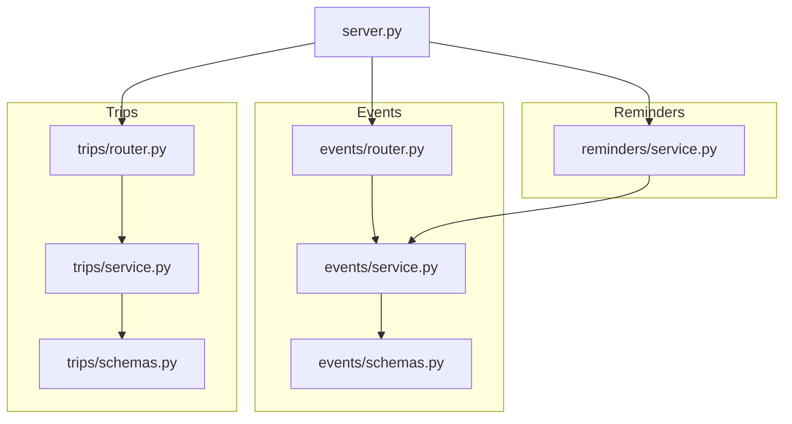
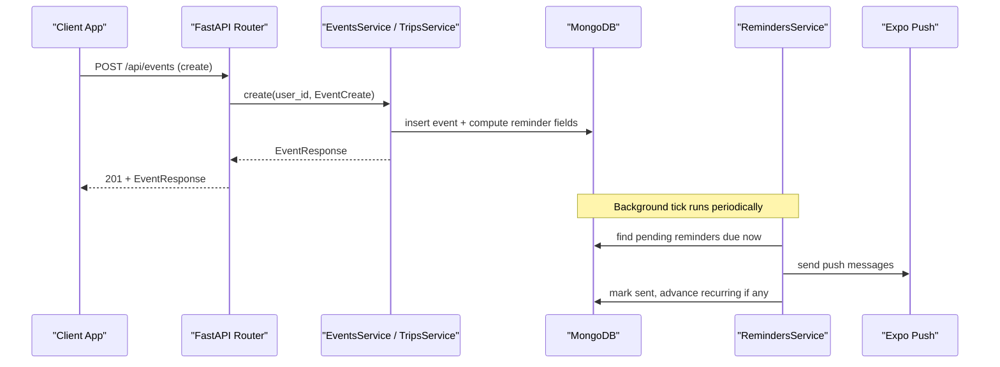
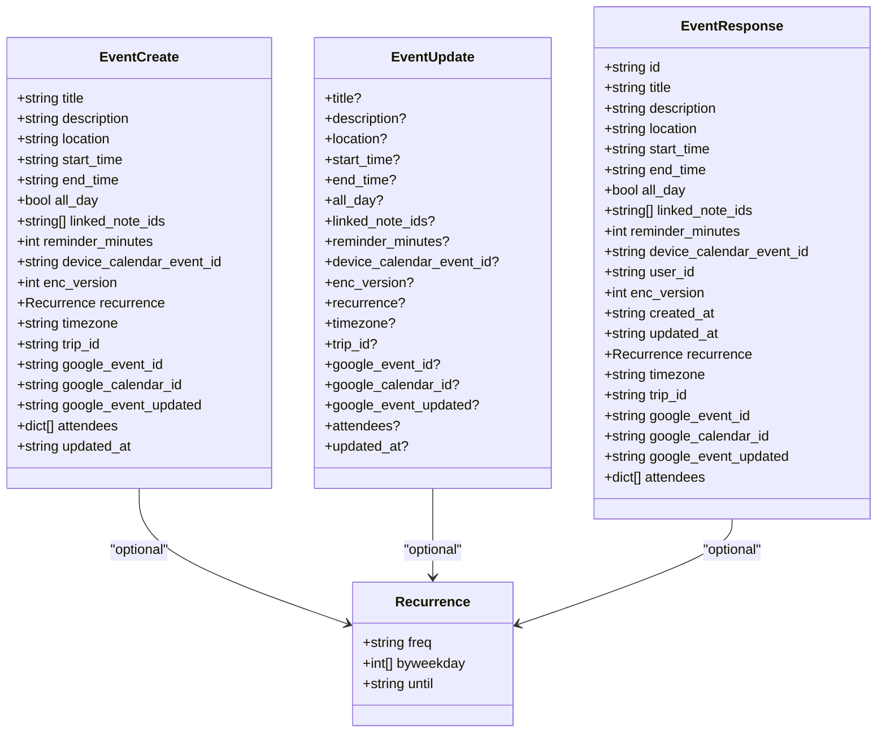
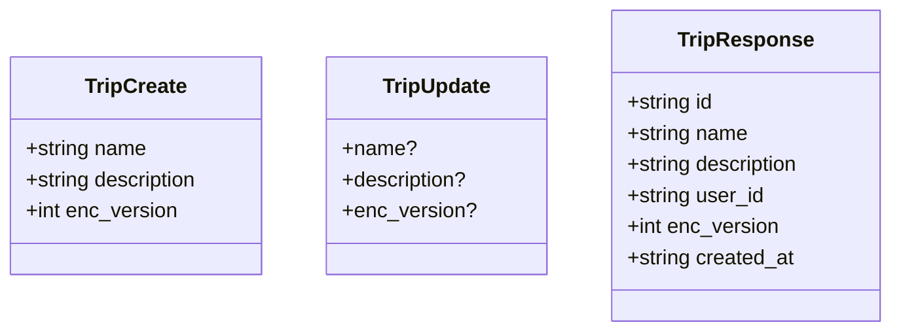
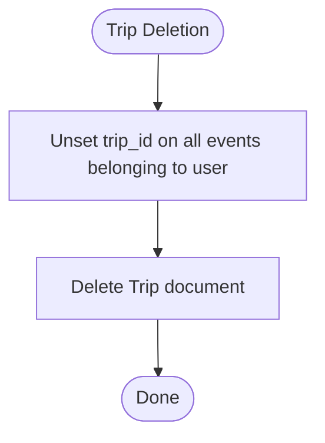
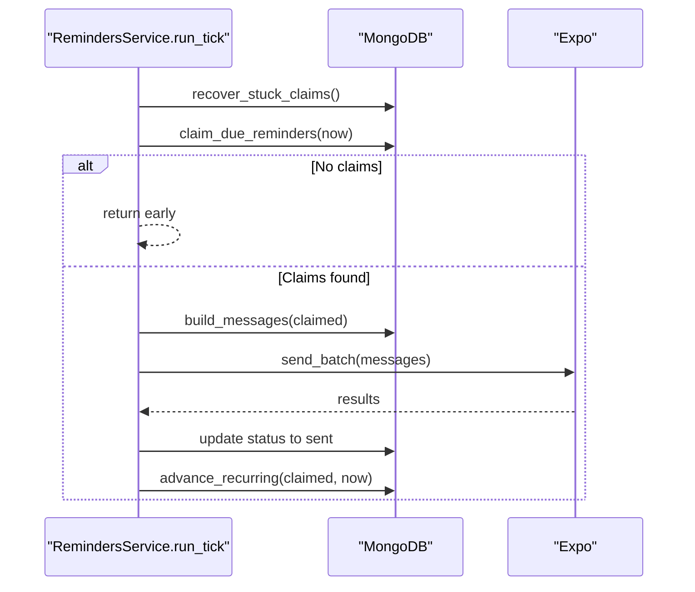
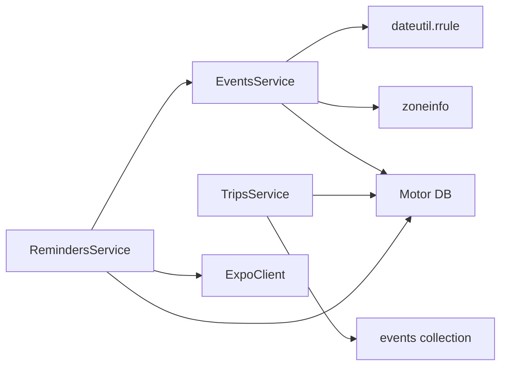

# Events & Trips Schemas

<cite>
**Referenced Files in This Document**
- [events/schemas.py](file://events/schemas.py)
- [events/service.py](file://events/service.py)
- [events/router.py](file://events/router.py)
- [trips/schemas.py](file://trips/schemas.py)
- [trips/service.py](file://trips/service.py)
- [trips/router.py](file://trips/router.py)
- [reminders/service.py](file://reminders/service.py)
- [server.py](file://server.py)
</cite>

## Table of Contents
1. [Introduction](#introduction)
2. [Project Structure](#project-structure)
3. [Core Components](#core-components)
4. [Architecture Overview](#architecture-overview)
5. [Detailed Component Analysis](#detailed-component-analysis)
6. [Dependency Analysis](#dependency-analysis)
7. [Performance Considerations](#performance-considerations)
8. [Troubleshooting Guide](#troubleshooting-guide)
9. [Conclusion](#conclusion)
10. [Appendices](#appendices)

## Introduction
This document provides comprehensive schema documentation for the Events and Trips domains, focusing on EventSchema and TripSchema. It explains calendar event modeling, scheduling and recurrence, reminder integration, timeline synchronization, trip planning features, event-to-trip relationships, validation rules, CRUD examples, performance considerations for calendar queries and timeline generation, and integration points with reminders and push notifications.

## Project Structure
The Events and Trips domains are implemented as separate modules with clear separation between schemas (Pydantic models), services (business logic), and routers (HTTP endpoints). The server wires these routers into a single API surface and manages database indexes to optimize queries.

**Diagram sources**
- [events/schemas.py:1-101](file://events/schemas.py#L1-L101)
- [events/service.py:1-312](file://events/service.py#L1-L312)
- [events/router.py:1-111](file://events/router.py#L1-L111)
- [trips/schemas.py:1-26](file://trips/schemas.py#L1-L26)
- [trips/service.py:1-102](file://trips/service.py#L1-L102)
- [trips/router.py:1-96](file://trips/router.py#L1-L96)
- [reminders/service.py:1-215](file://reminders/service.py#L1-L215)
- [server.py:181-197](file://server.py#L181-L197)

**Section sources**
- [events/schemas.py:1-101](file://events/schemas.py#L1-L101)
- [trips/schemas.py:1-26](file://trips/schemas.py#L1-L26)
- [events/router.py:1-111](file://events/router.py#L1-L111)
- [trips/router.py:1-96](file://trips/router.py#L1-L96)
- [server.py:181-197](file://server.py#L181-L197)

## Core Components
- EventSchema family:
  - Recurrence: defines frequency, optional weekly byweekday mapping, and an inclusive until date.
  - EventCreate/EventUpdate/EventResponse: define event fields including title, description, location, start_time/end_time, all_day flag, linked notes, reminders, device calendar IDs, encryption version, recurrence, timezone, trip_id, Google Calendar bridge fields, attendees, and updated_at.
  - PaginatedEventsResponse and BatchEventIds support efficient listing and batch retrieval.
- TripSchema family:
  - TripCreate/TripUpdate/TripResponse: define trip name, description, encryption version, user association, and timestamps.

Key capabilities:
- Calendar events with full or all-day semantics.
- Recurring events with timezone-aware math and bounded occurrence generation.
- Reminder scheduling derived from event timing and configured minutes before start.
- Grouping events under trips via trip_id; trips themselves do not store ordering—trip timelines are computed client-side by sorting linked events by start_time.
- Google Calendar bridge fields stored as passthrough metadata for client-side sync.

**Section sources**
- [events/schemas.py:5-101](file://events/schemas.py#L5-L101)
- [trips/schemas.py:5-26](file://trips/schemas.py#L5-L26)

## Architecture Overview
The system exposes REST endpoints for Events and Trips. Business logic resides in service modules that interact with MongoDB. Reminders integrate with Events through scheduled ticks that claim due reminders, send push notifications via Expo, and advance recurring events. Database indexes ensure efficient pagination and reminder processing.

**Diagram sources**
- [events/router.py:23-34](file://events/router.py#L23-L34)
- [events/service.py:167-199](file://events/service.py#L167-L199)
- [reminders/service.py:159-177](file://reminders/service.py#L159-L177)

**Section sources**
- [events/router.py:23-34](file://events/router.py#L23-L34)
- [events/service.py:167-199](file://events/service.py#L167-L199)
- [reminders/service.py:159-177](file://reminders/service.py#L159-L177)

## Detailed Component Analysis

### EventSchema
- Fields:
  - Identifier and content: id, title, description, location.
  - Timing: start_time, end_time, all_day (date-only vs instant).
  - Associations: linked_note_ids, trip_id (groups events under a trip).
  - Reminders: reminder_minutes; backend computes reminder_fire_at and status.
  - Sync metadata: device_calendar_event_id, google_event_id, google_calendar_id, google_event_updated, attendees.
  - Encryption: enc_version indicates ciphertext for certain text fields.
  - Recurrence: freq, byweekday (weekly only), until (inclusive).
  - Timezone: IANA name anchoring recurrence math across DST.
  - Conflict resolution: updated_at (client-authoritative when provided).

- Validation and normalization:
  - Payload size limits enforced for title, description, location with headroom for encrypted payloads.
  - updated_at backfilled from created_at on read for legacy documents to ensure consistent conflict resolution.

- Recurrence behavior:
  - Frequency mapped to dateutil constants; weekly supports multiple weekdays using a JS-compatible mapping.
  - Occurrence generation capped to prevent unbounded loops.
  - next_occurrence_on_or_after computes the next wall-clock occurrence in the event’s timezone and returns a UTC datetime.

- Reminder integration:
  - compute_reminder_fields derives reminder_fire_at from start_time minus reminder_minutes; past-due guard marks as sent to avoid re-scheduling.
  - Reminder label helper formats human-friendly labels for push bodies.

- Persistence and queries:
  - Create inserts event with computed reminder fields and timestamps.
  - List supports month/year filtering and deterministic paging using (start_time, id) sort.
  - Get and batch get retrieve events scoped by user_id.
  - Update selectively applies changes; explicit nulls can clear reminder/recurrence/trip_id/Google fields; reminder fields recomputed when timing or recurrence changes.
  - Delete removes event by id and user scope.

**Diagram sources**
- [events/schemas.py:5-101](file://events/schemas.py#L5-L101)

**Section sources**
- [events/schemas.py:5-101](file://events/schemas.py#L5-L101)
- [events/service.py:142-160](file://events/service.py#L142-L160)
- [events/service.py:167-199](file://events/service.py#L167-L199)
- [events/service.py:201-247](file://events/service.py#L201-L247)
- [events/service.py:267-306](file://events/service.py#L267-L306)
- [events/service.py:308-312](file://events/service.py#L308-L312)

### TripSchema
- Fields:
  - Identifier and content: id, name, description.
  - Association: user_id.
  - Encryption: enc_version indicating ciphertext for name/description.
  - Timestamps: created_at.

- Behavior:
  - Create validates payload sizes and persists trip.
  - List paginates by created_at with deterministic tiebreaker id.
  - Get retrieves trip by id and user scope.
  - Update applies partial updates; delete cascades by unsetting trip_id on all associated events before deletion to avoid dangling references.

**Diagram sources**
- [trips/schemas.py:5-26](file://trips/schemas.py#L5-L26)

**Section sources**
- [trips/schemas.py:5-26](file://trips/schemas.py#L5-L26)
- [trips/service.py:39-45](file://trips/service.py#L39-L45)
- [trips/service.py:51-63](file://trips/service.py#L51-L63)
- [trips/service.py:65-75](file://trips/service.py#L65-L75)
- [trips/service.py:77-81](file://trips/service.py#L77-L81)
- [trips/service.py:83-91](file://trips/service.py#L83-L91)
- [trips/service.py:93-101](file://trips/service.py#L93-L101)

### Relationships Between Events and Trips
- Association model:
  - Events carry an optional trip_id linking them to a Trip. There is no reverse index or embedded list in Trip; trip timelines are generated client-side by fetching events and sorting by start_time.
  - Deleting a Trip unsets trip_id on all its events to prevent dangling references.

- Example flows:
  - Create a Trip, then create an Event with trip_id set to associate it.
  - Update an Event to link or unlink from a Trip by setting or clearing trip_id.
  - Delete a Trip; backend ensures all linked events have trip_id cleared.

**Diagram sources**
- [trips/service.py:93-101](file://trips/service.py#L93-L101)

**Section sources**
- [trips/service.py:93-101](file://trips/service.py#L93-L101)
- [events/service.py:267-306](file://events/service.py#L267-L306)

### Validation Rules
- Dates and times:
  - start_time/end_time are ISO-8601 strings; all_day allows date-only values without time-of-day conversion.
  - Reminder fire time computed from start_time minus reminder_minutes; past-due guard prevents scheduling in the past.
- Locations:
  - Location field validated for maximum length with headroom for encrypted payloads.
- Recurrence patterns:
  - Supported frequencies: daily, weekly, monthly, yearly.
  - Weekly supports multiple weekdays using a JS-compatible mapping (0=Sunday..6=Saturday).
  - Until date is inclusive and parsed as a local date in the event’s timezone.
  - Occurrence generation is capped to prevent unbounded loops.
- Payload sizes:
  - Title, description, location, trip name, and description enforce maximum lengths with headroom for ciphertext.

**Section sources**
- [events/service.py:125-132](file://events/service.py#L125-L132)
- [events/service.py:142-150](file://events/service.py#L142-L150)
- [events/service.py:56-67](file://events/service.py#L56-L67)
- [events/service.py:69-123](file://events/service.py#L69-L123)
- [events/service.py:39-54](file://events/service.py#L39-L54)
- [trips/service.py:25-31](file://trips/service.py#L25-L31)
- [trips/service.py:39-45](file://trips/service.py#L39-L45)

### CRUD Examples
- Events:
  - Create: POST /api/events with EventCreate; returns EventResponse.
  - Read: GET /api/events (paginated, optional month/year filter); GET /api/events/{id}; POST /api/events/batch with event ids.
  - Update: PUT /api/events/{id} with EventUpdate; supports clearing fields via explicit null.
  - Delete: DELETE /api/events/{id}.
- Trips:
  - Create: POST /api/trips with TripCreate; returns TripResponse.
  - Read: GET /api/trips (paginated); GET /api/trips/{id}.
  - Update: PUT /api/trips/{id} with TripUpdate.
  - Delete: DELETE /api/trips/{id}; cascades to unset trip_id on events.

**Section sources**
- [events/router.py:23-111](file://events/router.py#L23-L111)
- [trips/router.py:23-96](file://trips/router.py#L23-L96)

### Integration Points with Reminders and Push Notifications
- Reminder computation:
  - On create/update, reminder fields are computed based on start_time and reminder_minutes; past-due events are marked sent to avoid late scheduling.
- Reminder delivery pipeline:
  - Periodic tick claims due reminders atomically, builds push messages per active device token, sends via Expo in batches, tracks receipts, and advances recurring events to their next occurrence.
  - If no active tokens exist, reminder is immediately marked sent.
  - Stuck claims recovery resets claimed-but-not-sent reminders after a timeout.
- Push token management:
  - Register/unregister endpoints manage device tokens; inactive tokens are pruned on DeviceNotRegistered errors.

**Diagram sources**
- [reminders/service.py:44-67](file://reminders/service.py#L44-L67)
- [reminders/service.py:69-91](file://reminders/service.py#L69-L91)
- [reminders/service.py:93-118](file://reminders/service.py#L93-L118)
- [reminders/service.py:120-158](file://reminders/service.py#L120-L158)
- [reminders/service.py:159-177](file://reminders/service.py#L159-L177)

**Section sources**
- [events/service.py:39-54](file://events/service.py#L39-L54)
- [reminders/service.py:44-177](file://reminders/service.py#L44-L177)
- [server.py:134-162](file://server.py#L134-L162)

## Dependency Analysis
- Events depend on:
  - Pydantic models for request/response validation.
  - dateutil rrule for recurrence math.
  - zoneinfo for timezone handling.
  - Motor async MongoDB driver for persistence.
- Trips depend on:
  - Pydantic models and Motor driver.
  - Events collection for cascade unset on trip delete.
- Reminders depend on:
  - Events service utilities (next_occurrence_on_or_after, reminder_label).
  - Expo client for push delivery.
  - MongoDB collections for events, push_tokens, push_receipts.

**Diagram sources**
- [events/service.py:13-17](file://events/service.py#L13-L17)
- [trips/service.py:8-14](file://trips/service.py#L8-L14)
- [reminders/service.py:11-20](file://reminders/service.py#L11-L20)

**Section sources**
- [events/service.py:13-17](file://events/service.py#L13-L17)
- [trips/service.py:8-14](file://trips/service.py#L8-L14)
- [reminders/service.py:11-20](file://reminders/service.py#L11-L20)

## Performance Considerations
- Calendar queries:
  - Events list uses a compound index on (user_id, start_time, id) to support efficient month/year filtering and deterministic paging.
  - Sorting by (start_time, id) avoids non-deterministic order and ensures stable skip/limit pagination.
  - Batch endpoint reduces N+1 queries by fetching multiple events in one call.
- Timeline generation:
  - Trips do not store ordering; clients compute trip timelines by retrieving events and sorting by start_time. This keeps trip writes lightweight and avoids redundant data.
- Reminder processing:
  - Partial index on (reminder_status, reminder_fire_at) filters only pending reminders, keeping per-minute ticks fast.
  - Atomic claim loop prevents double-sending and bounds work per tick.
  - Expo batching respects provider limits; receipts resolved asynchronously to handle delayed delivery confirmations.
- Indexes:
  - Startup creates necessary indexes for events, trips, push tokens, and receipts to optimize common queries and background jobs.

**Section sources**
- [events/service.py:201-247](file://events/service.py#L201-L247)
- [events/service.py:255-265](file://events/service.py#L255-L265)
- [server.py:382-407](file://server.py#L382-L407)
- [reminders/service.py:24-35](file://reminders/service.py#L24-L35)
- [reminders/service.py:52-67](file://reminders/service.py#L52-L67)

## Troubleshooting Guide
- Event not found:
  - GET/PUT/DELETE on events may return 404 if the event does not exist or is not owned by the current user.
- Trip not found:
  - GET/PUT/DELETE on trips may return 404 if the trip does not exist or is not owned by the current user.
- Payload too large:
  - Creating or updating events/trips with oversized fields returns 413; ensure title, description, location, name, and description adhere to limits.
- Reminder not firing:
  - Check reminder_minutes and start_time; past-due reminders are marked sent. Ensure device tokens are registered and active.
- Recurring event not advancing:
  - Verify recurrence configuration and timezone; invalid or malformed rules may cause exceptions logged during advancement.
- Dangling trip references:
  - Deleting a trip clears trip_id on all associated events; verify this cascade occurred if events appear orphaned.

**Section sources**
- [events/router.py:56-67](file://events/router.py#L56-L67)
- [events/router.py:82-96](file://events/router.py#L82-L96)
- [events/router.py:99-111](file://events/router.py#L99-L111)
- [trips/router.py:53-64](file://trips/router.py#L53-L64)
- [trips/router.py:67-81](file://trips/router.py#L67-L81)
- [trips/router.py:84-96](file://trips/router.py#L84-L96)
- [events/service.py:142-150](file://events/service.py#L142-L150)
- [trips/service.py:39-45](file://trips/service.py#L39-L45)
- [reminders/service.py:44-67](file://reminders/service.py#L44-L67)
- [reminders/service.py:120-158](file://reminders/service.py#L120-L158)
- [trips/service.py:93-101](file://trips/service.py#L93-L101)

## Conclusion
The Events and Trips schemas provide a robust foundation for calendar event management, trip planning, and reminder-driven notifications. Events encapsulate scheduling, recurrence, and associations to trips and external calendars. Trips group events logically without duplicating ordering information. The reminder system integrates tightly with events to deliver timely push notifications and maintain correct state for recurring events. Proper indexing and validation ensure performance and reliability across operations.

## Appendices

### API Endpoints Summary
- Events:
  - POST /api/events: Create event
  - GET /api/events: List events (paginated, optional month/year)
  - GET /api/events/{event_id}: Get event
  - POST /api/events/batch: Batch get events
  - PUT /api/events/{event_id}: Update event
  - DELETE /api/events/{event_id}: Delete event
- Trips:
  - POST /api/trips: Create trip
  - GET /api/trips: List trips (paginated)
  - GET /api/trips/{trip_id}: Get trip
  - PUT /api/trips/{trip_id}: Update trip
  - DELETE /api/trips/{trip_id}: Delete trip

**Section sources**
- [events/router.py:23-111](file://events/router.py#L23-L111)
- [trips/router.py:23-96](file://trips/router.py#L23-L96)