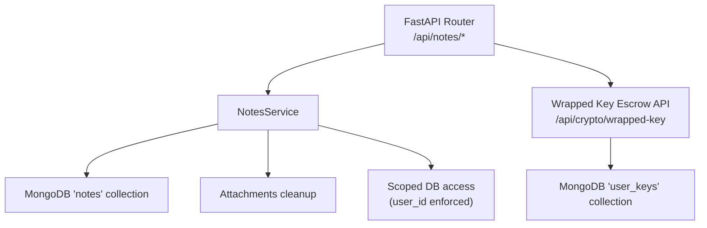
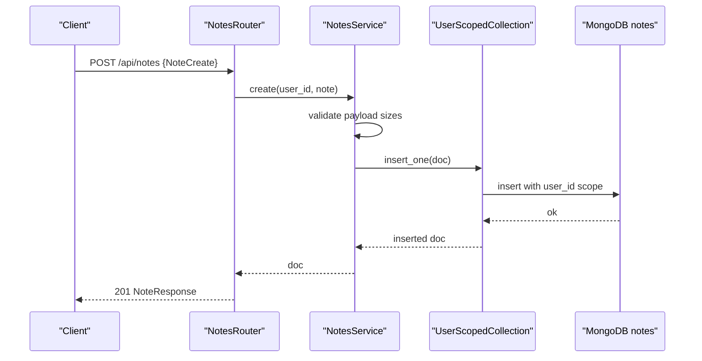
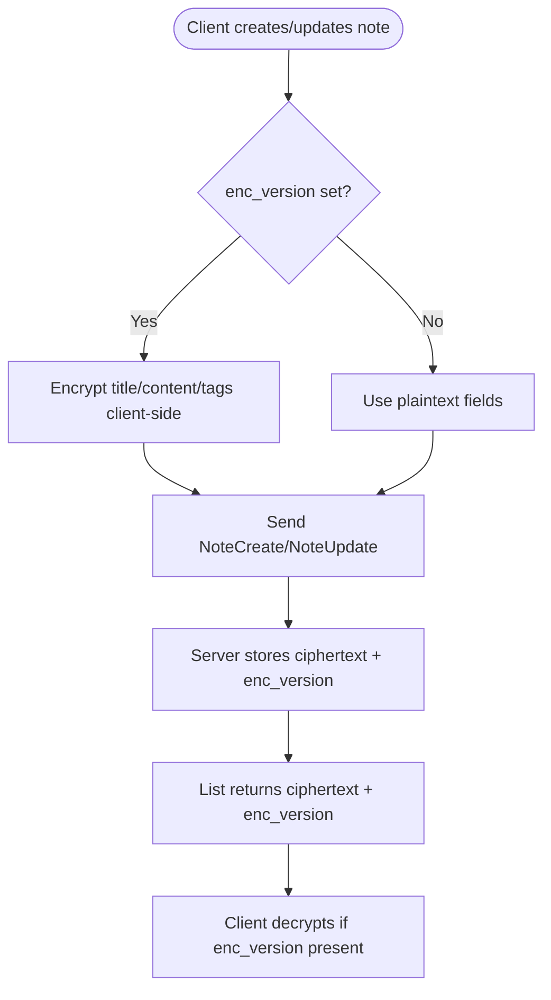
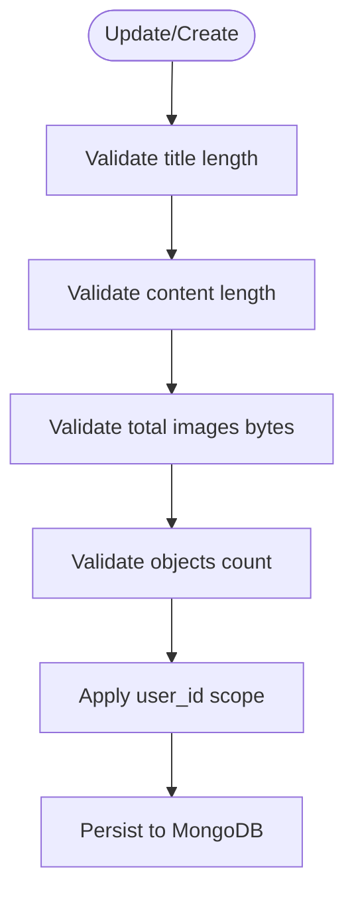
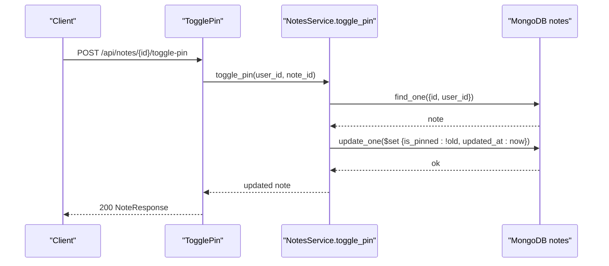
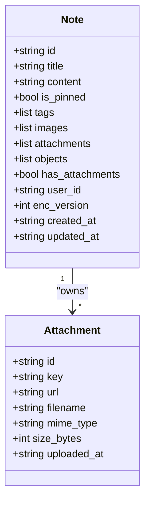
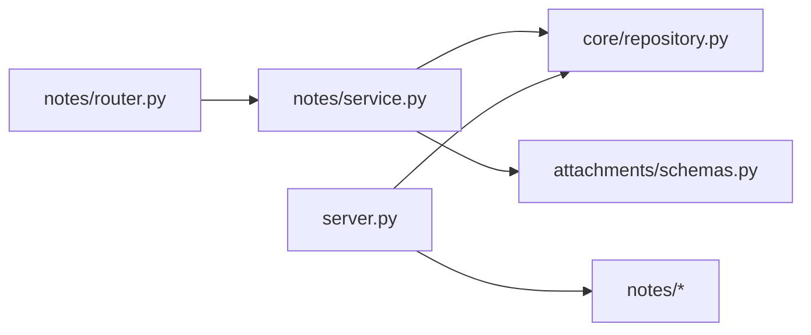

# Notes Schema & E2EE Structure

<cite>
**Referenced Files in This Document**
- [notes/schemas.py](file://notes/schemas.py)
- [notes/service.py](file://notes/service.py)
- [notes/router.py](file://notes/router.py)
- [attachments/schemas.py](file://attachments/schemas.py)
- [core/repository.py](file://core/repository.py)
- [server.py](file://server.py)
</cite>

## Table of Contents
1. [Introduction](#introduction)
2. [Project Structure](#project-structure)
3. [Core Components](#core-components)
4. [Architecture Overview](#architecture-overview)
5. [Detailed Component Analysis](#detailed-component-analysis)
6. [Dependency Analysis](#dependency-analysis)
7. [Performance Considerations](#performance-considerations)
8. [Troubleshooting Guide](#troubleshooting-guide)
9. [Conclusion](#conclusion)
10. [Appendices](#appendices)

## Introduction
This document describes the Notes system schema and end-to-end encryption (E2EE) design as implemented in the backend. It covers:
- The NoteSchema fields for encrypted content storage, metadata management, pinning, and attachment references
- E2EE implementation patterns: client-side encryption, wrapped key escrow on the server, and versioning via enc_version
- Validation rules for note content, timestamps, and user ownership scoping
- Relationships between notes and attachments, and how pinned notes are managed
- Example operations for creating, retrieving, and updating notes
- Performance considerations for large note collections and indexing strategies

## Project Structure
The Notes feature is organized into three primary modules:
- Schemas define request/response models and embedded types
- Service implements business logic, validation, persistence, and scoping
- Router exposes HTTP endpoints that translate service exceptions to HTTP responses

**Diagram sources**
- [notes/router.py:17-100](file://notes/router.py#L17-L100)
- [notes/service.py:79-226](file://notes/service.py#L79-L226)
- [core/repository.py:27-94](file://core/repository.py#L27-L94)
- [server.py:80-104](file://server.py#L80-L104)

**Section sources**
- [notes/router.py:1-100](file://notes/router.py#L1-L100)
- [notes/service.py:1-226](file://notes/service.py#L1-L226)
- [server.py:344-424](file://server.py#L344-L424)

## Core Components
- Note schemas define input/output shapes, including E2EE markers and optional legacy fields
- NotesService enforces payload size limits, normalizes linked events, persists notes, and manages pin toggling
- Scoped repository ensures all queries include a non-overridable user_id predicate
- Wrapped key escrow endpoints store opaque, base64-encoded keys derived from passwords/recovery codes

Key responsibilities:
- Payload validation with generous headroom for ciphertext sizes
- Deterministic pagination using compound indexes
- Best-effort attachment/object cleanup on note deletion
- User-scoped data access to prevent cross-account leaks

**Section sources**
- [notes/schemas.py:7-100](file://notes/schemas.py#L7-L100)
- [notes/service.py:22-65](file://notes/service.py#L22-L65)
- [core/repository.py:27-94](file://core/repository.py#L27-L94)
- [server.py:80-104](file://server.py#L80-L104)

## Architecture Overview
The Notes API follows a layered architecture:
- Router layer validates requests and maps errors to HTTP status codes
- Service layer performs validation, normalization, and persistence
- Repository layer enforces user scoping on every database operation
- Server startup creates indexes to optimize list/paging queries

**Diagram sources**
- [notes/router.py:17-28](file://notes/router.py#L17-L28)
- [notes/service.py:83-111](file://notes/service.py#L83-L111)
- [core/repository.py:66-71](file://core/repository.py#L66-L71)

**Section sources**
- [notes/router.py:17-100](file://notes/router.py#L17-L100)
- [notes/service.py:83-111](file://notes/service.py#L83-L111)
- [core/repository.py:27-94](file://core/repository.py#L27-L94)

## Detailed Component Analysis

### NoteSchema Fields and E2EE Markers
- Title and content: plaintext or client-side ciphertext when enc_version is set
- Tags: list of tag objects with name and color
- is_pinned: boolean flag used for sorting and quick access
- linked_event_id: deprecated singular field; dual-read/dual-write shim maintains compatibility
- linked_event_ids: authoritative plural array of event IDs
- images: base64-encoded image strings
- attachments: embedded Attachment objects referencing stored files
- objects: canvas image overlay metadata (position, scale, rotation, z-index)
- enc_version: indicates whether title/content/tags are ciphertext; None means legacy plaintext
- created_at/updated_at: timestamps; updated_at may be client-authoritative for offline-first conflict resolution

Attachment object fields:
- id, key, url, filename, mime_type, size_bytes, uploaded_at

**Section sources**
- [notes/schemas.py:7-100](file://notes/schemas.py#L7-L100)
- [attachments/schemas.py:4-24](file://attachments/schemas.py#L4-L24)

### E2EE Implementation
- Client-side encryption: When enc_version is set, title/content/tags are AES-256-GCM ciphertexts produced by the client
- Server behavior: Stores ciphertext verbatim; cannot read or search these fields
- Versioning: enc_version signals encryption mode; absence implies legacy plaintext
- Wrapped key escrow: Opaque blobs wrapped by password-derived and recovery-code-derived keys are stored server-side for multi-device sync
- Size constraints: Wire caps include generous headroom to accommodate base64 expansion and AES-GCM overhead

**Diagram sources**
- [notes/schemas.py:33-51](file://notes/schemas.py#L33-L51)
- [server.py:46-104](file://server.py#L46-L104)

**Section sources**
- [notes/schemas.py:33-51](file://notes/schemas.py#L33-L51)
- [server.py:46-104](file://server.py#L46-L104)

### Validation Rules
- Title length: capped with ciphertext headroom to avoid MongoDB 16MB document limit
- Content length: capped similarly with headroom for ciphertext expansion
- Images total size: capped at 8 MB base64 payload
- Image objects count: capped at 200 entries
- Timestamps: updated_at can be provided by client for offline-first conflict resolution; server falls back to UTC time if absent
- Ownership: user_id is enforced by scoped repository; cannot be overridden by caller

**Diagram sources**
- [notes/service.py:30-65](file://notes/service.py#L30-L65)
- [core/repository.py:43-52](file://core/repository.py#L43-L52)

**Section sources**
- [notes/service.py:30-65](file://notes/service.py#L30-L65)
- [core/repository.py:43-52](file://core/repository.py#L43-L52)

### Pin/Unpin Functionality
- Toggle endpoint flips is_pinned and updates updated_at
- List sorts pinned notes first, then by updated_at descending, with deterministic tie-breaking by id
- Indexes ensure efficient sorted paging without in-memory sort

**Diagram sources**
- [notes/router.py:88-100](file://notes/router.py#L88-L100)
- [notes/service.py:213-225](file://notes/service.py#L213-L225)

**Section sources**
- [notes/router.py:88-100](file://notes/router.py#L88-L100)
- [notes/service.py:213-225](file://notes/service.py#L213-L225)

### Attachments and Objects
- Attachments are embedded in notes with server-generated keys and download URLs
- On note deletion, the service extracts keys from both attachments and objects and best-effort deletes them from storage
- has_attachments is denormalized and kept in sync during updates

**Diagram sources**
- [notes/schemas.py:33-100](file://notes/schemas.py#L33-L100)
- [attachments/schemas.py:4-24](file://attachments/schemas.py#L4-L24)

**Section sources**
- [notes/service.py:191-212](file://notes/service.py#L191-L212)
- [attachments/schemas.py:4-24](file://attachments/schemas.py#L4-L24)

### Linked Events Compatibility
- Dual-read/dual-write shim ensures linked_event_ids is populated from legacy linked_event_id when absent
- Updates propagate linked_event_ids to linked_event_id for backward compatibility

**Section sources**
- [notes/service.py:67-76](file://notes/service.py#L67-L76)
- [notes/service.py:156-189](file://notes/service.py#L156-L189)

### Example Operations

#### Create Note
- Endpoint: POST /api/notes
- Request body: NoteCreate (title, content, tags, is_pinned, linked_event_ids, images, attachments, objects, enc_version, created_at, updated_at)
- Behavior: Validates payload, applies user scope, inserts note, returns NoteResponse

**Section sources**
- [notes/router.py:17-28](file://notes/router.py#L17-L28)
- [notes/service.py:83-111](file://notes/service.py#L83-L111)

#### Retrieve Note
- Endpoint: GET /api/notes/{note_id}
- Behavior: Finds note by id and user_id, normalizes linked events, returns NoteResponse

**Section sources**
- [notes/router.py:43-54](file://notes/router.py#L43-L54)
- [notes/service.py:150-154](file://notes/service.py#L150-L154)

#### Update Note
- Endpoint: PUT /api/notes/{note_id}
- Request body: NoteUpdate (partial fields allowed)
- Behavior: Validates payload, applies updates, keeps has_attachments in sync, sets updated_at if not provided, returns NoteResponse

**Section sources**
- [notes/router.py:57-71](file://notes/router.py#L57-L71)
- [notes/service.py:156-189](file://notes/service.py#L156-L189)

#### Delete Note
- Endpoint: DELETE /api/notes/{note_id}
- Behavior: Atomic delete with retrieval of attachment/object keys, best-effort storage cleanup

**Section sources**
- [notes/router.py:74-85](file://notes/router.py#L74-L85)
- [notes/service.py:191-212](file://notes/service.py#L191-L212)

#### Toggle Pin
- Endpoint: POST /api/notes/{note_id}/toggle-pin
- Behavior: Flips is_pinned, updates timestamp, returns updated note

**Section sources**
- [notes/router.py:88-100](file://notes/router.py#L88-L100)
- [notes/service.py:213-225](file://notes/service.py#L213-L225)

## Dependency Analysis
- Router depends on NotesService and Pydantic schemas
- Service depends on Motor async MongoDB client, core.repository scoped access, and attachments cleanup
- Server startup defines indexes and E2EE key escrow endpoints
- Scoped repository enforces user_id on all operations, preventing cross-account data access

**Diagram sources**
- [notes/router.py:1-100](file://notes/router.py#L1-L100)
- [notes/service.py:1-226](file://notes/service.py#L1-L226)
- [core/repository.py:1-95](file://core/repository.py#L1-L95)
- [server.py:344-424](file://server.py#L344-L424)

**Section sources**
- [notes/router.py:1-100](file://notes/router.py#L1-L100)
- [notes/service.py:1-226](file://notes/service.py#L1-L226)
- [core/repository.py:1-95](file://core/repository.py#L1-L95)
- [server.py:344-424](file://server.py#L344-L424)

## Performance Considerations
- Pagination uses index-covered sorting: (user_id, is_pinned desc, updated_at desc, id asc) avoids in-memory sorts and prevents 32MB sort limit failures
- Compound indexes support efficient filtering and sorting for large note collections
- Payload size limits protect against oversized documents and memory pressure
- Search is client-side when fields are ciphertext; server cannot regex-match encrypted content
- Best-effort attachment cleanup avoids blocking note deletion on storage failures

Index strategy highlights:
- Primary compound index for list() query and sort
- Superset index with id tiebreaker for rolling deployments
- Additional indexes for user_id+id and user_id+has_attachments

**Section sources**
- [notes/service.py:113-148](file://notes/service.py#L113-L148)
- [server.py:364-380](file://server.py#L364-L380)

## Troubleshooting Guide
Common issues and resolutions:
- Note not found: Ensure note_id belongs to current user; service raises NotFoundError which router maps to 404
- Payload too large: Reduce title/content/images or number of objects; router maps to 413
- Sorting anomalies: Verify presence of id tiebreaker in list() sort; rely on compound index for deterministic ordering
- Attachment cleanup failures: Deletion proceeds even if storage cleanup fails; check logs for specific key errors
- Cross-account access: Scoped repository enforces user_id; any attempt to override is corrected

Operational checks:
- Confirm indexes exist and match query patterns
- Validate that enc_version is set consistently across clients for E2EE
- Monitor feature events and wrapped key escrow usage for anomalies

**Section sources**
- [notes/router.py:24-28](file://notes/router.py#L24-L28)
- [notes/router.py:49-54](file://notes/router.py#L49-L54)
- [notes/router.py:64-71](file://notes/router.py#L64-L71)
- [notes/router.py:80-85](file://notes/router.py#L80-L85)
- [notes/service.py:191-212](file://notes/service.py#L191-L212)
- [core/repository.py:43-52](file://core/repository.py#L43-L52)

## Conclusion
The Notes system provides a robust, secure, and performant foundation for managing user notes with end-to-end encryption. Key strengths include:
- Clear schema definitions supporting both plaintext and ciphertext modes
- Strong validation and size limits to protect system stability
- Secure user scoping to prevent data leakage
- Efficient indexing for scalable pagination and sorting
- Practical E2EE design with client-side encryption and server-side wrapped key escrow

Adopting these patterns ensures reliable note management while preserving privacy and performance at scale.

## Appendices

### Database Indexes for Notes
- (user_id, is_pinned desc, updated_at desc): Covers primary list query and sort
- (user_id, is_pinned desc, updated_at desc, id asc): Adds deterministic tiebreaker for paging
- (user_id, id): Supports fast lookups by id within user scope
- (user_id, has_attachments): Enables filtered listing by attachment presence

**Section sources**
- [server.py:364-380](file://server.py#L364-L380)

### Wrapped Key Escrow Endpoints
- PUT /api/crypto/wrapped-key: Store opaque wrapped DEK blobs per user
- GET /api/crypto/wrapped-key: Retrieve stored wrapped keys for current user

**Section sources**
- [server.py:80-104](file://server.py#L80-L104)