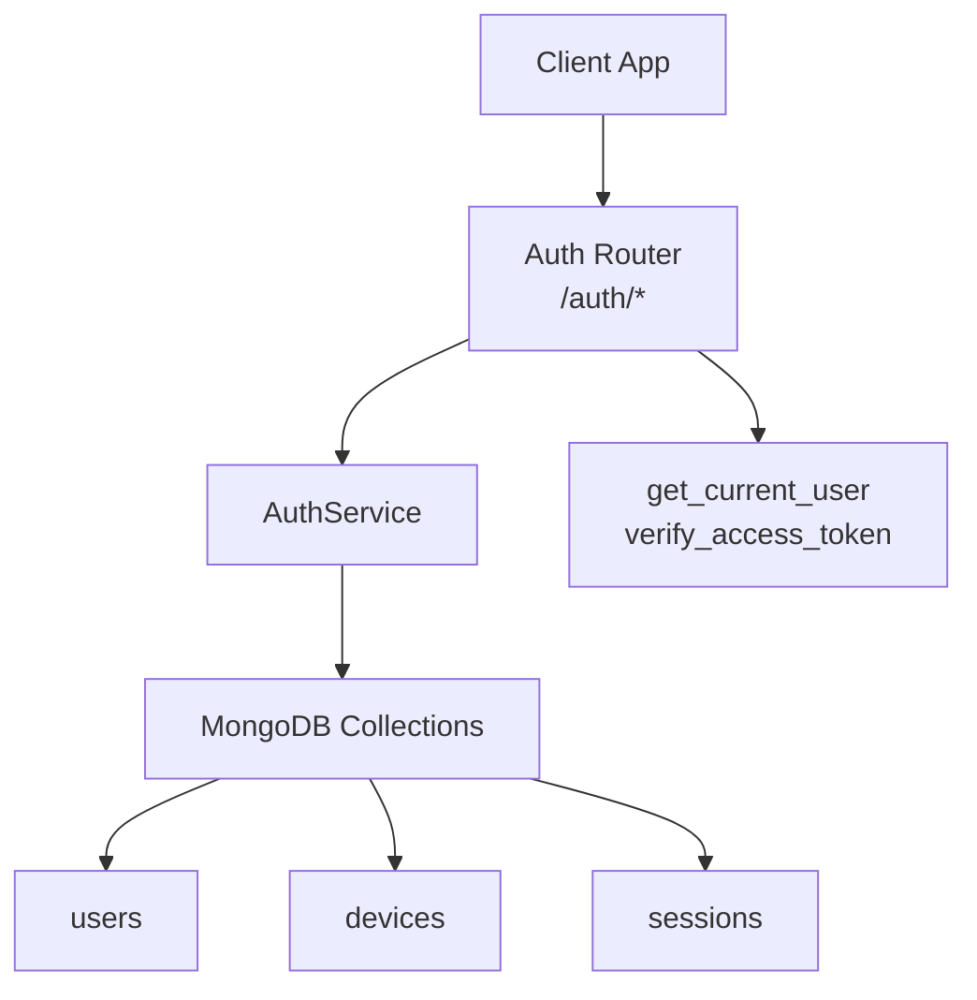
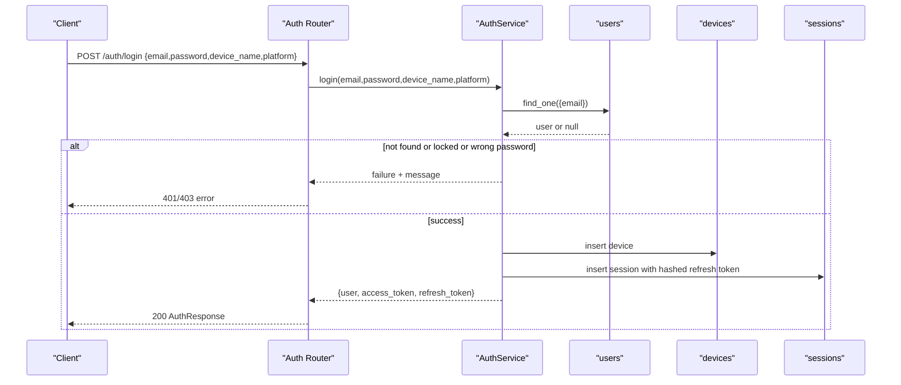
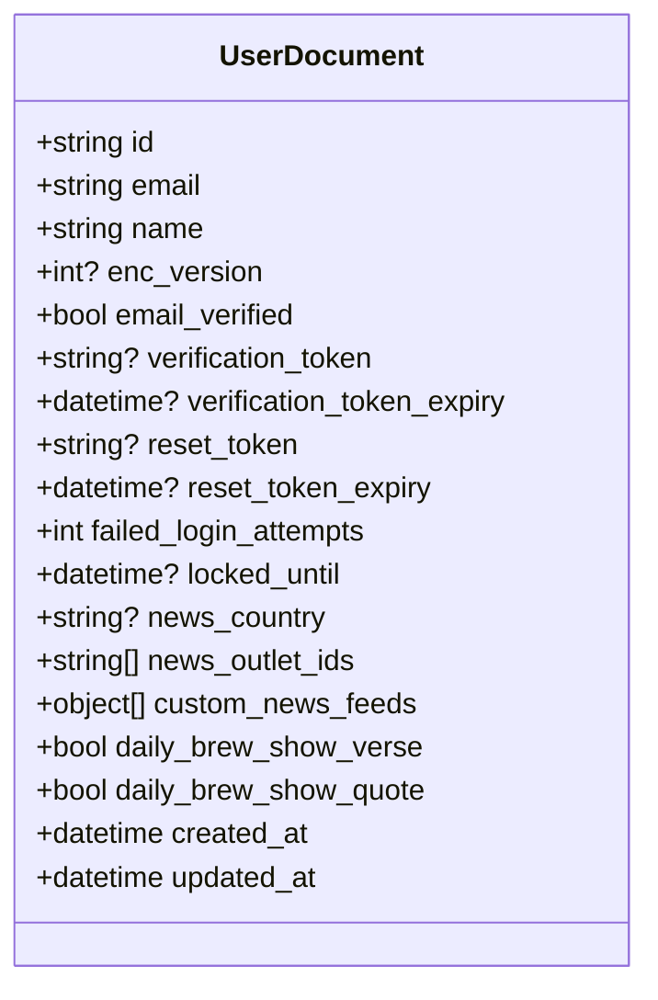
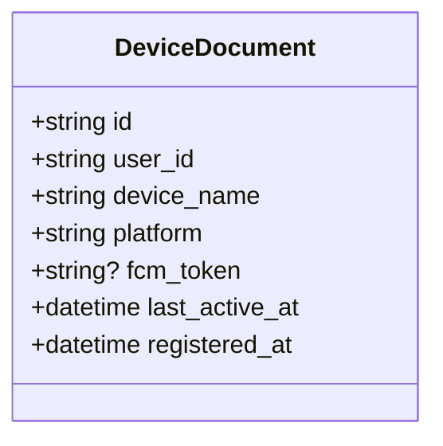
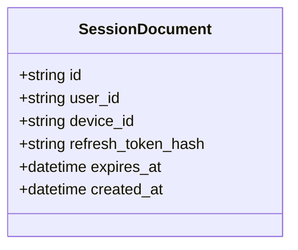
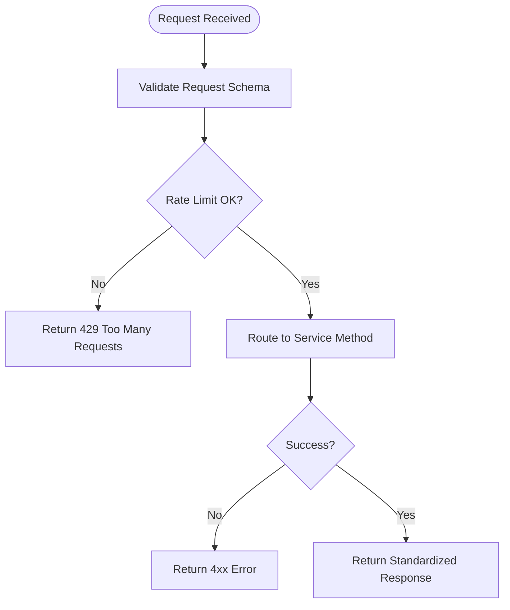
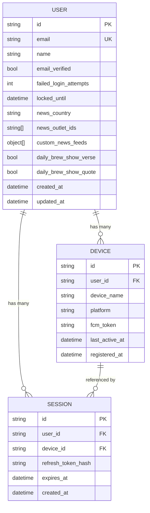
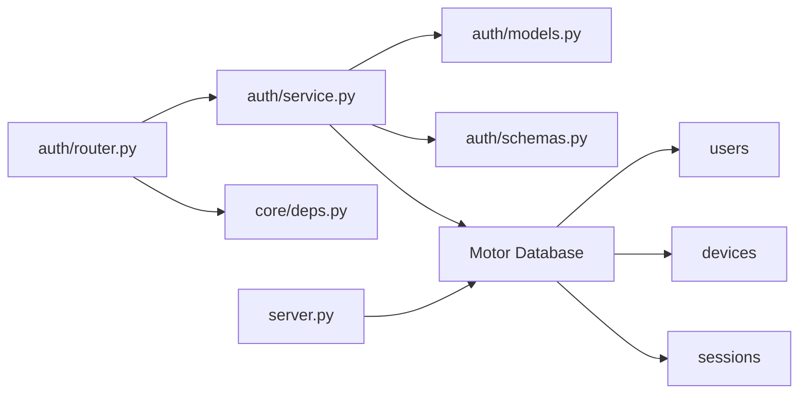

# User Models & Authentication Data

<cite>
**Referenced Files in This Document**
- [auth/models.py](file://auth/models.py)
- [auth/schemas.py](file://auth/schemas.py)
- [auth/service.py](file://auth/service.py)
- [auth/router.py](file://auth/router.py)
- [core/deps.py](file://core/deps.py)
- [server.py](file://server.py)
</cite>

## Table of Contents
1. [Introduction](#introduction)
2. [Project Structure](#project-structure)
3. [Core Components](#core-components)
4. [Architecture Overview](#architecture-overview)
5. [Detailed Component Analysis](#detailed-component-analysis)
6. [Dependency Analysis](#dependency-analysis)
7. [Performance Considerations](#performance-considerations)
8. [Troubleshooting Guide](#troubleshooting-guide)
9. [Conclusion](#conclusion)
10. [Appendices](#appendices)

## Introduction
This document describes the user-related data models and authentication flows in the Nueco Backend. It focuses on:
- The User document structure, including authentication fields, security controls, and user preferences
- The Device model for multi-device support with platform detection and FCM token management
- Session handling for refresh token lifecycle management
- Field validation rules, data types, and business logic constraints
- Relationships between users, devices, and sessions
- Examples of creation, updates, and queries
- Security considerations for password hashing, token storage, and session management

## Project Structure
The authentication subsystem is organized around a clear separation of concerns:
- Data models define MongoDB documents for users, devices, and sessions
- Schemas define request/response contracts used by FastAPI routes
- Service encapsulates business logic (signup, login, refresh, logout, preferences)
- Router exposes HTTP endpoints that validate inputs and call service methods
- Core dependencies provide database access and current-user resolution
- Server startup creates indexes for performance and TTL-based cleanup

**Diagram sources**
- [auth/router.py:93-366](file://auth/router.py#L93-L366)
- [auth/service.py:35-506](file://auth/service.py#L35-L506)
- [core/deps.py:24-50](file://core/deps.py#L24-L50)
- [server.py:409-418](file://server.py#L409-L418)

**Section sources**
- [auth/models.py:6-66](file://auth/models.py#L6-L66)
- [auth/schemas.py:6-80](file://auth/schemas.py#L6-L80)
- [auth/service.py:35-506](file://auth/service.py#L35-L506)
- [auth/router.py:93-366](file://auth/router.py#L93-L366)
- [core/deps.py:15-50](file://core/deps.py#L15-L50)
- [server.py:409-418](file://server.py#L409-L418)

## Core Components
- User document: stores identity, verification state, security counters, and preferences
- Device document: tracks per-device metadata and push tokens
- Session document: stores hashed refresh tokens and expiration, bound to device and user
- Request/response schemas: enforce input validation and output shape
- Service layer: implements signup, login, email verification, password reset/change, refresh/logout, and preference updates
- Router layer: rate limits, validates requests, and returns standardized responses
- Dependency injection: provides authenticated user context and database handle

**Section sources**
- [auth/models.py:6-66](file://auth/models.py#L6-L66)
- [auth/schemas.py:6-80](file://auth/schemas.py#L6-L80)
- [auth/service.py:35-506](file://auth/service.py#L35-L506)
- [auth/router.py:22-84](file://auth/router.py#L22-L84)
- [core/deps.py:15-50](file://core/deps.py#L15-L50)

## Architecture Overview
Authentication flow from client to database:

**Diagram sources**
- [auth/router.py:115-140](file://auth/router.py#L115-L140)
- [auth/service.py:202-273](file://auth/service.py#L202-L273)

## Detailed Component Analysis

### User Model
- Purpose: Represents an account with authentication state, security controls, and feature preferences
- Key fields:
  - Identity: id, email (normalized to lowercase), name, enc_version (for E2EE name encryption)
  - Verification: email_verified, verification_token, verification_token_expiry
  - Password: password (bcrypt hash)
  - Security: failed_login_attempts, locked_until
  - Preferences: news_country, news_outlet_ids, custom_news_feeds, daily_brew_show_verse, daily_brew_show_quote
  - Timestamps: created_at, updated_at
- Validation and constraints:
  - Email uniqueness enforced via unique index
  - Email normalized to lowercase before storage
  - Password stored as bcrypt hash; never stored in plaintext
  - Failed login attempts increment on incorrect password; account locks when threshold reached
  - Locked_until enforces time-based lockout
- Business logic:
  - Signup checks existing unverified accounts and expired tokens
  - Login resets failed attempts on success
  - Password reset invalidates all sessions for the user
  - Name update supports optional enc_version for E2EE bootstrap
  - News preferences update includes verse/quote toggles

**Diagram sources**
- [auth/models.py:6-32](file://auth/models.py#L6-L32)

**Section sources**
- [auth/models.py:6-32](file://auth/models.py#L6-L32)
- [auth/service.py:107-149](file://auth/service.py#L107-L149)
- [auth/service.py:202-273](file://auth/service.py#L202-L273)
- [auth/service.py:312-361](file://auth/service.py#L312-L361)
- [auth/service.py:387-422](file://auth/service.py#L387-L422)
- [server.py:409-411](file://server.py#L409-L411)

### Device Model
- Purpose: Tracks each device associated with a user for multi-device support and push notifications
- Key fields:
  - id, user_id, device_name, platform, fcm_token (optional)
  - last_active_at, registered_at
- Behavior:
  - Created on successful login with device_name and platform from request
  - last_active_at updated on refresh token usage
- Indexes:
  - user_id indexed for efficient device lookups

**Diagram sources**
- [auth/models.py:34-49](file://auth/models.py#L34-L49)
- [server.py:417-418](file://server.py#L417-L418)

**Section sources**
- [auth/models.py:34-49](file://auth/models.py#L34-L49)
- [auth/service.py:245-249](file://auth/service.py#L245-L249)
- [auth/service.py:442-446](file://auth/service.py#L442-L446)
- [server.py:417-418](file://server.py#L417-L418)

### Session Model
- Purpose: Manages refresh token lifecycle and enables server-side revocation of access tokens
- Key fields:
  - id, user_id, device_id
  - refresh_token (stored as SHA-256 hash)
  - expires_at, created_at
- Behavior:
  - Created on login with hashed refresh token and expiration
  - Refresh endpoint validates hashed token, issues new access token, updates device last_active_at
  - Logout deletes session by matching hashed refresh token
  - Password reset deletes all sessions for the user
  - TTL index auto-deletes expired sessions
- Access token binding:
  - Access tokens include session id claim; verify_access_token checks session existence and expiry

**Diagram sources**
- [auth/models.py:51-65](file://auth/models.py#L51-L65)
- [auth/service.py:424-460](file://auth/service.py#L424-L460)
- [auth/service.py:469-494](file://auth/service.py#L469-L494)
- [server.py:413-415](file://server.py#L413-L415)

**Section sources**
- [auth/models.py:51-65](file://auth/models.py#L51-L65)
- [auth/service.py:424-460](file://auth/service.py#L424-L460)
- [auth/service.py:469-494](file://auth/service.py#L469-L494)
- [server.py:413-415](file://server.py#L413-L415)

### Request/Response Schemas and Validation
- Input validation:
  - Email format validated via EmailStr
  - Password length minimum enforced at router level
  - Confirm password must match
  - Rate limiting protects sensitive endpoints
- Output shaping:
  - UserResponse excludes sensitive fields and includes preference flags
  - AuthResponse returns user, access_token, refresh_token, token_type
  - MessageResponse standardizes success messages

**Diagram sources**
- [auth/router.py:22-84](file://auth/router.py#L22-L84)
- [auth/router.py:93-140](file://auth/router.py#L93-L140)
- [auth/schemas.py:6-80](file://auth/schemas.py#L6-L80)

**Section sources**
- [auth/schemas.py:6-80](file://auth/schemas.py#L6-L80)
- [auth/router.py:93-140](file://auth/router.py#L93-L140)
- [auth/router.py:222-249](file://auth/router.py#L222-L249)
- [auth/router.py:276-321](file://auth/router.py#L276-L321)

### Relationships Between Entities
- One-to-many:
  - User has many Devices (indexed by user_id)
  - User has many Sessions (indexed by user_id)
- References:
  - Device references user_id
  - Session references user_id and device_id
- Access control:
  - Access tokens are bound to session id; logout invalidates session and thus access tokens

**Diagram sources**
- [auth/models.py:6-65](file://auth/models.py#L6-L65)
- [server.py:409-418](file://server.py#L409-L418)

**Section sources**
- [auth/models.py:6-65](file://auth/models.py#L6-L65)
- [server.py:409-418](file://server.py#L409-L418)

### Example Workflows

#### Create User (Signup)
- Steps:
  - Validate email format and password strength
  - Check for existing verified/unverified accounts
  - Hash password and create user document
  - Generate verification token and set expiry
  - Send verification email
- Outputs:
  - Success message indicating verification required

**Section sources**
- [auth/router.py:93-113](file://auth/router.py#L93-L113)
- [auth/service.py:107-149](file://auth/service.py#L107-L149)

#### Authenticate and Create Session (Login)
- Steps:
  - Normalize email and check rate limits
  - Find user and check lock status
  - Verify password; increment failed attempts if incorrect
  - On success, create device and session with hashed refresh token
  - Issue access token bound to session
- Outputs:
  - AuthResponse with user, access_token, refresh_token

**Section sources**
- [auth/router.py:115-140](file://auth/router.py#L115-L140)
- [auth/service.py:202-273](file://auth/service.py#L202-L273)

#### Refresh Access Token
- Steps:
  - Hash provided refresh token and lookup session
  - Validate session expiry
  - Retrieve user and issue new access token bound to same session
  - Update device last_active_at
- Outputs:
  - AuthResponse with user and new access_token

**Section sources**
- [auth/router.py:301-314](file://auth/router.py#L301-L314)
- [auth/service.py:424-451](file://auth/service.py#L424-L451)

#### Logout
- Steps:
  - Hash refresh token and delete corresponding session
- Outputs:
  - Success message

**Section sources**
- [auth/router.py:316-321](file://auth/router.py#L316-L321)
- [auth/service.py:453-460](file://auth/service.py#L453-L460)

#### Update News Preferences
- Steps:
  - Validate current user
  - Update country, outlet_ids, and verse/quote toggles
- Outputs:
  - Updated user response

**Section sources**
- [auth/router.py:342-356](file://auth/router.py#L342-L356)
- [auth/service.py:402-422](file://auth/service.py#L402-L422)

## Dependency Analysis
- Router depends on:
  - AuthService for business logic
  - get_current_user for protected endpoints
  - get_db for database access
- AuthService depends on:
  - Motor AsyncIOMotorDatabase collections: users, devices, sessions
  - JWT library for access tokens
  - bcrypt for password hashing
  - secrets for secure token generation
- Server startup ensures:
  - Unique indexes for users (email, id)
  - TTL index for sessions (expires_at)
  - Indexes for efficient queries on devices and sessions

**Diagram sources**
- [auth/router.py:9-16](file://auth/router.py#L9-L16)
- [auth/service.py:12-18](file://auth/service.py#L12-L18)
- [core/deps.py:15-50](file://core/deps.py#L15-L50)
- [server.py:409-418](file://server.py#L409-L418)

**Section sources**
- [auth/router.py:9-16](file://auth/router.py#L9-L16)
- [auth/service.py:12-18](file://auth/service.py#L12-L18)
- [core/deps.py:15-50](file://core/deps.py#L15-L50)
- [server.py:409-418](file://server.py#L409-L418)

## Performance Considerations
- Indexing:
  - Unique sparse indexes on users.email and users.id prevent duplicates and speed lookups
  - TTL index on sessions.expires_at automatically cleans expired sessions
  - Indexed user_id on devices and sessions optimizes per-user queries
- Blocking operations:
  - bcrypt hashing runs off the event loop using asyncio.to_thread to avoid blocking
- Query efficiency:
  - Compound indexes on notes/events/trips ensure covered sorts and pagination
  - Partial indexes reduce scheduler query size for pending reminders

[No sources needed since this section provides general guidance]

## Troubleshooting Guide
Common issues and resolutions:
- Invalid or expired verification link:
  - Ensure token exists and has not expired; resend verification to generate a new token
- Account locked after too many failed attempts:
  - Wait for lockout duration to expire; successful login resets counters
- Refresh token rejected:
  - Check session existence and expiry; logout invalidates session and access tokens
- Password reset failures:
  - Validate token and expiry; resetting password invalidates all sessions

Security best practices observed:
- Passwords are hashed with bcrypt; never stored in plaintext
- Refresh tokens are hashed before storage; only hashes persisted in sessions
- Access tokens are bound to session id; logout revokes them server-side
- Rate limiting protects signup, login, and password reset endpoints
- Email verification links are idempotent to tolerate mail provider scanning

**Section sources**
- [auth/service.py:202-273](file://auth/service.py#L202-L273)
- [auth/service.py:275-310](file://auth/service.py#L275-L310)
- [auth/service.py:312-361](file://auth/service.py#L312-L361)
- [auth/service.py:424-460](file://auth/service.py#L424-L460)
- [auth/router.py:22-84](file://auth/router.py#L22-L84)

## Conclusion
The Nueco Backend implements a robust authentication system centered around well-defined data models for users, devices, and sessions. Security is enforced through bcrypt password hashing, hashed refresh tokens, session-bound access tokens, and rate limiting. The design supports multi-device usage, preference management, and scalable query performance via indexing. Following the documented workflows and constraints ensures reliable and secure user account management.

[No sources needed since this section summarizes without analyzing specific files]

## Appendices

### Field Reference Summary
- User:
  - Authentication: email, password (hash), email_verified, verification_token, verification_token_expiry
  - Security: failed_login_attempts, locked_until
  - Preferences: news_country, news_outlet_ids, custom_news_feeds, daily_brew_show_verse, daily_brew_show_quote
  - Metadata: id, name, enc_version, created_at, updated_at
- Device:
  - Identification: id, user_id, device_name, platform
  - Push: fcm_token
  - Activity: last_active_at, registered_at
- Session:
  - Identity: id, user_id, device_id
  - Tokens: refresh_token (hashed)
  - Lifecycle: expires_at, created_at

**Section sources**
- [auth/models.py:6-65](file://auth/models.py#L6-L65)
- [auth/schemas.py:53-80](file://auth/schemas.py#L53-L80)