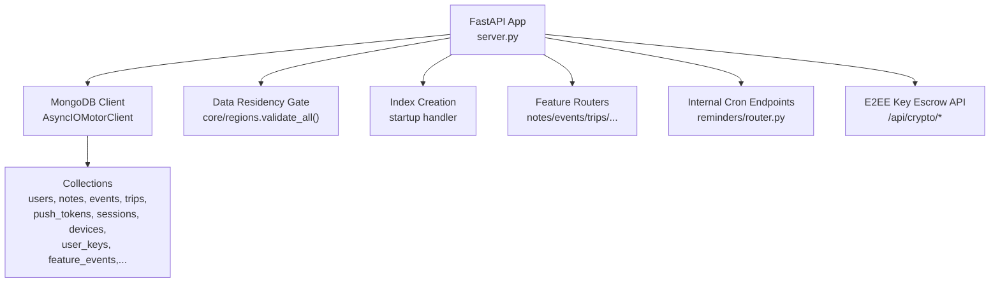
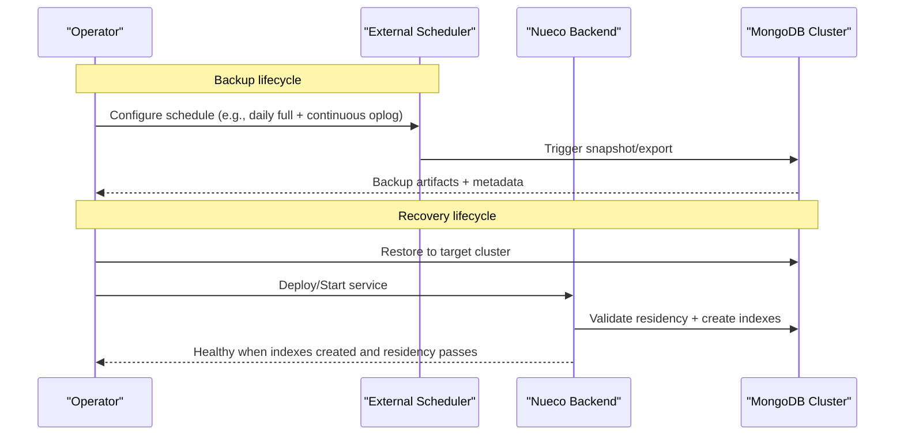
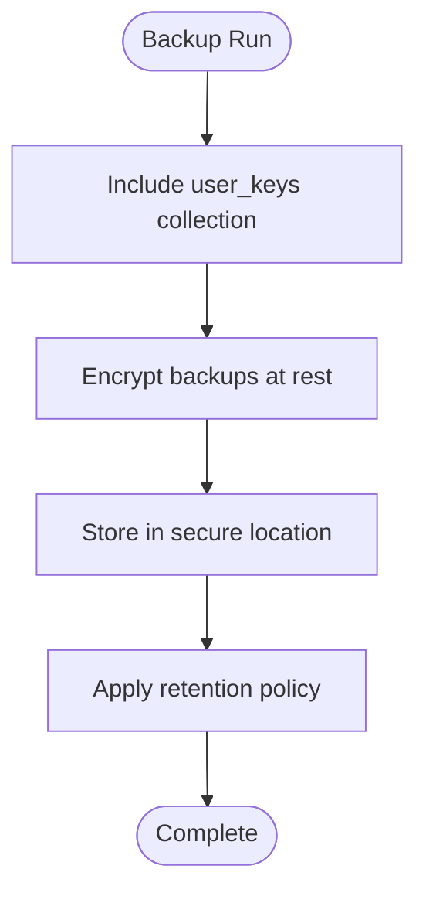
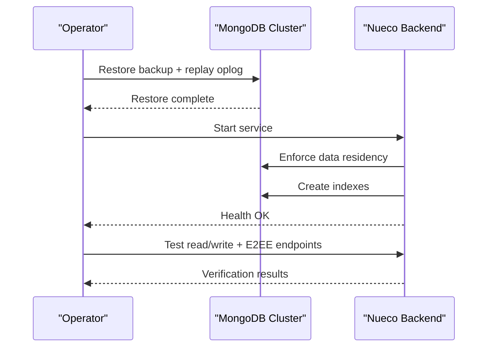
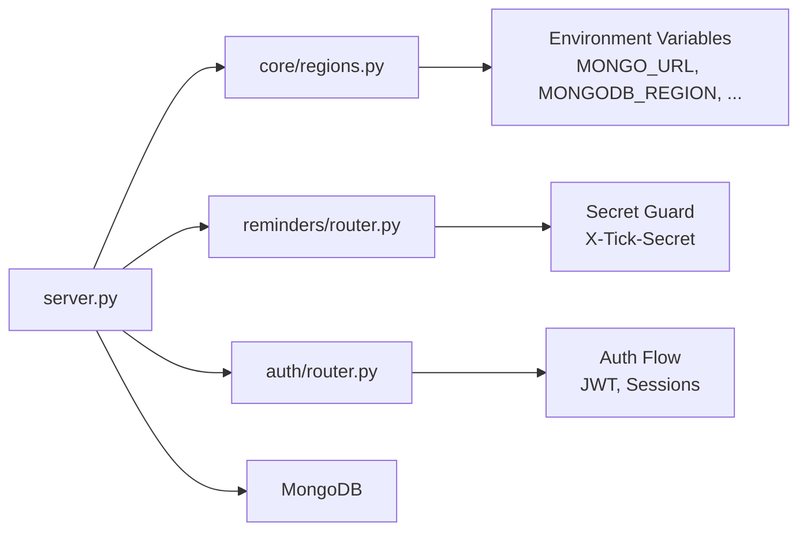

# Backup & Recovery

<cite>
**Referenced Files in This Document**
- [server.py](file://server.py)
- [core/deps.py](file://core/deps.py)
- [core/regions.py](file://core/regions.py)
- [auth/router.py](file://auth/router.py)
- [reminders/router.py](file://reminders/router.py)
- [requirements.txt](file://requirements.txt)
- [.gitignore](file://.gitignore)
- [privacy.html](file://static/privacy.html)
</cite>

## Table of Contents
1. [Introduction](#introduction)
2. [Project Structure](#project-structure)
3. [Core Components](#core-components)
4. [Architecture Overview](#architecture-overview)
5. [Detailed Component Analysis](#detailed-component-analysis)
6. [Dependency Analysis](#dependency-analysis)
7. [Performance Considerations](#performance-considerations)
8. [Troubleshooting Guide](#troubleshooting-guide)
9. [Conclusion](#conclusion)
10. [Appendices](#appendices)

## Introduction
This document provides comprehensive backup and recovery guidance for the Nueco Backend, focusing on MongoDB-backed data, the end-to-end encryption (E2EE) key escrow system, disaster recovery procedures, scheduling and storage management, validation, and compliance considerations. It is designed to be actionable for operators while remaining accessible to non-experts.

The backend uses an asynchronous MongoDB client via Motor, stores user-scoped data across multiple collections, and implements a strict data residency enforcement layer that validates external service endpoints and regions at startup. The E2EE key escrow stores only opaque wrapped keys and metadata; plaintext notes and unwrapped keys never touch the server.

## Project Structure
At runtime, the FastAPI application initializes a shared MongoDB client and database handle, enforces data residency, creates indexes, and registers feature routers. Key areas relevant to backup and recovery include:
- Application bootstrap and MongoDB connection setup
- Data residency validation and region checks
- Index creation for performance and consistency
- Internal cron-like endpoints for background tasks
- E2EE key escrow endpoints

**Diagram sources**
- [server.py:16-20](file://server.py#L16-L20)
- [server.py:338-342](file://server.py#L338-L342)
- [server.py:345-433](file://server.py#L345-L433)
- [reminders/router.py:19-28](file://reminders/router.py#L19-L28)
- [server.py:80-104](file://server.py#L80-L104)

**Section sources**
- [server.py:16-20](file://server.py#L16-L20)
- [server.py:338-342](file://server.py#L338-L342)
- [server.py:345-433](file://server.py#L345-L433)
- [reminders/router.py:19-28](file://reminders/router.py#L19-L28)
- [server.py:80-104](file://server.py#L80-L104)

## Core Components
- MongoDB connectivity: The app constructs a global AsyncIOMotorClient using MONGO_URL and selects a database by DB_NAME. All modules access the database through this shared handle.
- Data residency enforcement: On startup, all external service endpoints and regions are validated against an Australian allowlist. Any missing or invalid configuration aborts boot.
- Index management: Startup ensures critical indexes exist for notes, events, trips, push tokens, users, sessions, devices, user_keys, and feature events. Some indexes have TTLs or partial filters.
- Internal cron endpoints: Push reminder ticks and receipts resolution are exposed under /internal/push with a secret-based guard. These are intended to be triggered by an external scheduler.
- E2EE key escrow: Endpoints store and retrieve per-user wrapped keys and salts. The server never sees plaintext note content or unwrapped keys.

Operational implications for backup and recovery:
- Backups must capture all collections referenced by the application, including those used by internal features (e.g., user_keys, feature_events).
- Recovery must ensure indexes are recreated or already present before serving traffic.
- Data residency constraints apply to any restored environment; restoring into a non-Australian region will fail startup.

**Section sources**
- [server.py:16-20](file://server.py#L16-L20)
- [server.py:338-342](file://server.py#L338-L342)
- [server.py:345-433](file://server.py#L345-L433)
- [reminders/router.py:19-28](file://reminders/router.py#L19-L28)
- [server.py:80-104](file://server.py#L80-L104)

## Architecture Overview
The backup and recovery architecture centers around MongoDB as the primary data store. The backend does not implement its own backup logic; instead, it relies on platform-level backups (e.g., Atlas snapshots) and operator-managed processes. Recovery involves restoring the database, ensuring indexes exist, validating data residency, and restarting services.

[No sources needed since this diagram shows conceptual workflow, not actual code structure]

## Detailed Component Analysis

### MongoDB Backup Strategy
- Automated backups: Use your MongoDB provider’s snapshot or logical export tooling to perform regular backups. Ensure both full backups and point-in-time recovery (PITR) via oplog are enabled where supported.
- Point-in-time recovery: Maintain continuous oplog retention aligned with your RPO. For example, if your RPO is 15 minutes, ensure oplog covers at least that window.
- Data retention policies: Define how long backups are kept based on compliance and operational needs. Archive older backups to cold storage with appropriate access controls.
- Collections scope: Backups must include all collections written by the backend, including users, notes, events, trips, push_tokens, sessions, devices, user_keys, and feature_events.

Operational checklist:
- Verify backup jobs run successfully and produce artifacts.
- Validate that PITR windows meet RPO targets.
- Confirm retention periods align with policy.
- Monitor storage growth and alert on failures.

**Section sources**
- [server.py:345-433](file://server.py#L345-L433)

### E2EE Key Escrow System and Backup Requirements
- What is stored: Per-user wrapped Data Encryption Keys (DEK), KDF salts, and metadata. The server never receives plaintext notes or unwrapped keys.
- Why it matters: If user_keys are lost, users cannot recover their encrypted notes even with database restoration unless they retain their original password or recovery code.
- Backup requirements:
  - Include user_keys in every backup.
  - Protect backups containing wrapped keys with strong encryption and strict access controls.
  - Ensure recovery procedures can restore user_keys alongside other data.
- Access controls:
  - Restrict access to backup storage and restore operations to authorized personnel.
  - Audit access to key escrow data.

[No sources needed since this diagram shows conceptual workflow, not actual code structure]

**Section sources**
- [server.py:80-104](file://server.py#L80-L104)
- [server.py:420-423](file://server.py#L420-L423)

### Disaster Recovery Procedures
Recovery steps should be rehearsed regularly and documented in runbooks.

Database restoration:
- Restore from the most recent full backup plus oplog entries up to the desired recovery point.
- Validate that the restored cluster is reachable and healthy.

Service restart sequence:
- Start the backend so it can validate data residency and create indexes.
- Confirm health endpoint responds.
- Verify internal cron endpoints are gated and functional.

Data consistency verification:
- Spot-check critical collections (e.g., users, notes, events, trips) for expected schema and index coverage.
- Run a small set of read/write operations to confirm functionality.
- Validate that E2EE key escrow endpoints return expected responses for test users.

**Diagram sources**
- [server.py:338-342](file://server.py#L338-L342)
- [server.py:345-433](file://server.py#L345-L433)
- [server.py:170-172](file://server.py#L170-L172)

**Section sources**
- [server.py:338-342](file://server.py#L338-L342)
- [server.py:345-433](file://server.py#L345-L433)
- [server.py:170-172](file://server.py#L170-L172)

### Backup Scheduling and Storage Location Management
- Scheduling: Use an external scheduler to trigger backups at defined intervals. Align frequency with RPO.
- Storage locations: Store backups in a secure, isolated storage system with encryption at rest and in transit. Implement lifecycle rules for retention and archival.
- Access controls: Limit who can initiate backups, access artifacts, and perform restores. Use least privilege and audit logging.
- Monitoring: Alert on backup failures, storage capacity issues, and missed schedules.

[No sources needed since this section provides general guidance]

### Backup Validation Procedures
- Integrity checks: Verify checksums or signatures of backup artifacts.
- Restore drills: Periodically restore to a staging environment and validate data integrity and application behavior.
- PITR validation: Confirm you can recover to specific timestamps within the oplog window.
- Coverage validation: Ensure all collections are included in backups, especially user_keys and feature_events.

[No sources needed since this section provides general guidance]

### Recovery Playbooks

#### Data Corruption
- Identify affected collections and time range.
- Restore to a pre-corruption point using full backup + oplog.
- Re-run index creation and residency validation.
- Validate data consistency and application functionality.

#### Service Outage
- If caused by misconfiguration, correct environment variables and redeploy.
- If caused by database issues, restore and verify connectivity.
- Restart services and confirm health.

#### Security Incident
- Rotate secrets and credentials immediately.
- Isolate affected systems and preserve logs.
- Restore clean backups if necessary.
- Review access controls and audit logs.

[No sources needed since this section provides general guidance]

### Backup Encryption, Access Controls, and Compliance
- Encryption: Encrypt backups at rest and in transit. Use strong algorithms and manage keys securely.
- Access controls: Restrict access to backup storage and restore operations. Enforce multi-person approval for sensitive restores.
- Compliance: Adhere to data residency requirements. The backend enforces Australian-region declarations for all external services, including MongoDB. Restoring into a non-compliant region will fail startup.

**Section sources**
- [core/regions.py:144-165](file://core/regions.py#L144-L165)
- [core/regions.py:227-230](file://core/regions.py#L227-L230)

### Testing Procedures for Backup Integrity and RTO/RPO Planning
- RPO planning: Define maximum tolerable data loss based on business needs. Ensure oplog retention meets RPO.
- RTO planning: Measure restore time and service restart time to meet recovery objectives.
- Tests:
  - Perform full restore to staging and validate data.
  - Execute PITR to a specific timestamp and verify correctness.
  - Simulate failure scenarios and measure recovery times.
  - Validate E2EE key escrow recovery paths.

[No sources needed since this section provides general guidance]

## Dependency Analysis
The backend depends on MongoDB and several external services. Data residency enforcement ensures all endpoints and regions are declared and compliant. Internal cron endpoints require a shared secret.

**Diagram sources**
- [server.py:338-342](file://server.py#L338-L342)
- [core/regions.py:55-77](file://core/regions.py#L55-L77)
- [reminders/router.py:12-17](file://reminders/router.py#L12-L17)
- [auth/router.py:115-139](file://auth/router.py#L115-L139)

**Section sources**
- [core/regions.py:55-77](file://core/regions.py#L55-L77)
- [reminders/router.py:12-17](file://reminders/router.py#L12-L17)
- [auth/router.py:115-139](file://auth/router.py#L115-L139)

## Performance Considerations
- Indexes: The startup handler creates critical indexes to avoid blocking sorts and improve query performance. During recovery, ensure indexes are present to prevent degraded performance.
- Oplog size: Larger oplogs support finer-grained PITR but consume more storage. Balance RPO with storage costs.
- Backup windows: Schedule backups during low-traffic periods to minimize impact.

[No sources needed since this section provides general guidance]

## Troubleshooting Guide
Common issues and resolutions:
- Boot fails due to data residency: Missing or invalid endpoint/region configuration will abort startup. Fix environment variables and redeploy.
- Index creation warnings: Non-critical warnings may indicate existing indexes; verify queries perform as expected.
- Internal endpoints blocked: Ensure the correct secret header is provided for /internal/push endpoints.
- E2EE key escrow errors: If no key escrow exists for a user, the endpoint returns a 404. Ensure clients store wrapped keys after initial setup.

**Section sources**
- [core/regions.py:144-165](file://core/regions.py#L144-L165)
- [server.py:345-433](file://server.py#L345-L433)
- [reminders/router.py:12-17](file://reminders/router.py#L12-L17)
- [server.py:96-104](file://server.py#L96-L104)

## Conclusion
Effective backup and recovery for the Nueco Backend hinges on robust MongoDB backup strategies, strict adherence to data residency requirements, and careful handling of the E2EE key escrow. Operators should implement automated backups with PITR, enforce retention policies, validate backups regularly, and rehearse recovery procedures to meet RTO/RPO targets. Security and compliance must be embedded throughout the process, with encryption, access controls, and auditing applied to all backup artifacts and operations.

## Appendices

### Environment and Secrets Management
- Secrets are excluded from version control; use environment variables managed by your deployment platform.
- Critical variables include MONGO_URL, DB_NAME, and region declarations for all external services.

**Section sources**
- [.gitignore:1-4](file://.gitignore#L1-L4)
- [core/regions.py:55-77](file://core/regions.py#L55-L77)

### Dependencies
- The backend uses Motor for async MongoDB access and PyMongo for synchronous operations where needed.

**Section sources**
- [requirements.txt:57-83](file://requirements.txt#L57-L83)

### Security Posture Notes
- Notes and calendar events are protected with end-to-end encryption; passwords are hashed and never stored in plain text.
- Attachments are accessed via short-lived presigned links.

**Section sources**
- [privacy.html:496-504](file://static/privacy.html#L496-L504)